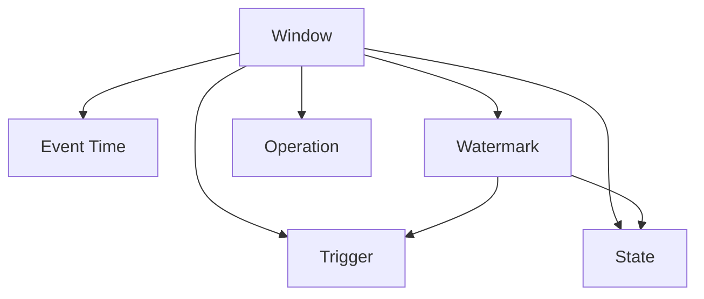

                 

# Flink Window原理与代码实例讲解

> 关键词：Flink, Window, Stream Processing, Event Time, Watermark, State Management, API, Source Function, Process Function, Sink Function, Event Time Mechanism, Watermark Generation

## 1. 背景介绍

### 1.1 问题由来

在实时数据流处理系统中，如何高效、准确地对数据流进行分割、计算和更新状态，是数据流处理的核心问题之一。在Apache Flink中，窗口(Window)机制是解决这一问题的关键组件。窗口机制可以将连续的数据流分割成固定大小或基于时间间隔的片段，允许系统对这些片段进行聚合计算，从而实现高效的流处理。

Flink窗口机制的核心目标是在不丢失数据的情况下，对数据流进行高效计算。它在不同的场景中得到了广泛应用，如实时流分析、数据统计、机器学习等领域。Flink窗口机制的主要优势在于：

- 提供高效的流处理和状态管理能力。
- 支持灵活的窗口类型和自定义操作函数。
- 支持事件时间处理和精确的时序处理。
- 可以高效地应对大规模数据流和复杂状态管理。

本文档将详细介绍Flink窗口的原理与实现，并通过具体的代码实例展示窗口机制在实际应用中的使用。

## 2. 核心概念与联系

### 2.1 核心概念概述

Flink窗口机制包含以下几个核心概念：

- **窗口(Window)**：将连续的数据流分割成固定大小或基于时间间隔的片段。
- **事件时间(Event Time)**：指数据事件实际发生的时间，而非处理节点接收数据的时间。
- **水印(Watermark)**：用于指示数据流中事件时间的全局顺序。
- **状态(State)**：用于保存窗口计算的中间状态。
- **触发器(Trigger)**：定义窗口何时被触发计算。
- **操作函数(Operation)**：定义窗口内数据的聚合计算方式。

这些概念共同构成了Flink窗口机制的基本框架，允许系统对数据流进行灵活、高效的处理。

### 2.2 概念间的关系

通过以下Mermaid流程图，可以更清晰地理解Flink窗口机制中各个概念之间的关系：



这个流程图展示了窗口、事件时间、水印、状态、触发器和操作函数之间的关系。事件时间定义了数据事件的顺序，水印用于同步不同处理节点的处理进度，状态用于保存中间计算结果，触发器定义窗口何时被触发计算，操作函数用于对窗口内的数据进行聚合计算。

## 3. 核心算法原理 & 具体操作步骤

### 3.1 算法原理概述

Flink窗口机制的算法原理主要基于以下两个核心思想：

1. **事件时间处理**：Flink使用事件时间处理机制，确保窗口计算的准确性。事件时间处理机制通过事件时间和水印的协同工作，确保每个窗口内的数据都按照实际发生的时间顺序进行处理。

2. **状态管理**：Flink使用状态管理机制，用于保存窗口计算的中间状态。状态管理机制通过状态的分布式保存和恢复，确保窗口计算的准确性和一致性。

### 3.2 算法步骤详解

Flink窗口机制的主要操作步骤包括以下几个步骤：

**Step 1: 创建窗口**

在Flink中，可以通过以下代码创建窗口：

```java
DataStream<T> inputStream = env.addSource(...);
WindowedStream<T, KEY, VALUE> windowStream = inputStream.keyBy(...).window(TumblingEventTimeWindows.of(Time.seconds(10)));
```

这里使用了TumblingEventTimeWindows来创建基于事件时间的滑动窗口。

**Step 2: 定义操作函数**

在窗口被创建后，需要定义窗口内的操作函数。操作函数用于对窗口内的数据进行聚合计算。例如，可以使用SUM操作函数对窗口内的数据进行求和计算：

```java
windowStream.sum(0);
```

**Step 3: 定义触发器**

触发器用于定义窗口何时被触发计算。触发器可以基于时间、数据量等条件进行定义。例如，可以使用CountTrigger来定义基于数据量的触发器：

```java
windowStream.countTrigger(1);
```

**Step 4: 定义水印生成策略**

水印用于同步不同处理节点的处理进度。Flink提供了不同的水印生成策略，如基于时间间隔生成的水印生成策略和基于事件时间戳生成的水印生成策略。例如，可以使用EventTimeWatermarkStrategy来定义基于事件时间戳生成的水印生成策略：

```java
env.setStreamTimeCharacteristic(TimeCharacteristic.EventTime);
inputStream.assignTimestampsAndWatermarks(new EventTimeWatermarkAssigner<>());
```

### 3.3 算法优缺点

Flink窗口机制的主要优点包括：

1. 提供高效的流处理和状态管理能力。
2. 支持灵活的窗口类型和自定义操作函数。
3. 支持事件时间处理和精确的时序处理。
4. 可以高效地应对大规模数据流和复杂状态管理。

但Flink窗口机制也存在一些缺点：

1. 需要较高的存储需求，用于保存中间状态。
2. 需要精确的时序处理，增加了系统的复杂性。
3. 需要较好的网络带宽，用于同步不同处理节点的处理进度。

尽管存在这些缺点，Flink窗口机制在实际应用中仍然得到了广泛的应用，特别是在实时数据流处理和复杂计算任务中。

### 3.4 算法应用领域

Flink窗口机制广泛应用于以下领域：

1. **实时流分析**：如实时数据统计、实时事件监控等。
2. **数据统计**：如实时流量统计、实时交易统计等。
3. **机器学习**：如实时模型训练、实时特征提取等。

## 4. 数学模型和公式 & 详细讲解  
### 4.1 数学模型构建

Flink窗口机制的数学模型主要基于以下两个核心思想：

1. **事件时间处理**：使用事件时间处理机制，确保窗口计算的准确性。
2. **状态管理**：使用状态管理机制，用于保存窗口计算的中间状态。

在数学上，可以使用以下公式来表示窗口计算：

$$
\text{Window}(T, \Delta t) = \{ x \in \text{Stream} | \text{Time}(x) \in [T, T + \Delta t] \}
$$

其中，$T$ 表示窗口的起始时间，$\Delta t$ 表示窗口的时间间隔。

### 4.2 公式推导过程

以下是窗口计算公式的推导过程：

假设窗口的起始时间为 $T$，时间间隔为 $\Delta t$，事件时间为 $t$，则事件时间处理机制可以表示为：

$$
\text{Time}(x) = \max(\text{InputTime}(x), \text{EventTime}(x))
$$

其中，$\text{InputTime}(x)$ 表示事件被处理节点接收的时间，$\text{EventTime}(x)$ 表示事件实际发生的时间。

根据公式1，可以得出窗口内所有事件的集合：

$$
\text{Window}(T, \Delta t) = \{ x \in \text{Stream} | \text{Time}(x) \in [T, T + \Delta t] \}
$$

为了确保窗口计算的准确性，需要使用水印来同步不同处理节点的处理进度。水印的定义可以表示为：

$$
\text{Watermark}(t) = \max_{x \in \text{Window}(T, \Delta t)} \text{Time}(x)
$$

其中，$\text{Time}(x)$ 表示事件的时间戳。

水印的定义保证了窗口内所有事件的时间戳都小于等于水印时间戳。因此，可以在水印到达后触发窗口计算。

### 4.3 案例分析与讲解

假设有一个基于时间间隔的窗口，窗口的起始时间为 $T$，时间间隔为 $\Delta t$，事件时间为 $t$，则事件时间处理机制可以表示为：

$$
\text{Time}(x) = \max(\text{InputTime}(x), \text{EventTime}(x))
$$

根据公式1，可以得出窗口内所有事件的集合：

$$
\text{Window}(T, \Delta t) = \{ x \in \text{Stream} | \text{Time}(x) \in [T, T + \Delta t] \}
$$

假设事件的时间戳为 $t_1, t_2, t_3, t_4$，则窗口计算的实际过程可以表示为：

1. 当事件 $x_1$ 到达时，事件时间处理机制将其时间戳 $t_1$ 作为当前时间戳，然后将其与 $T$ 比较，如果 $t_1 \geq T$，则将其加入窗口 $T$ 内。

2. 当事件 $x_2$ 到达时，事件时间处理机制将其时间戳 $t_2$ 作为当前时间戳，然后将其与 $T$ 比较，如果 $t_2 \geq T$，则将其加入窗口 $T$ 内。

3. 当事件 $x_3$ 到达时，事件时间处理机制将其时间戳 $t_3$ 作为当前时间戳，然后将其与 $T$ 比较，如果 $t_3 \geq T$，则将其加入窗口 $T$ 内。

4. 当事件 $x_4$ 到达时，事件时间处理机制将其时间戳 $t_4$ 作为当前时间戳，然后将其与 $T$ 比较，如果 $t_4 \geq T$，则将其加入窗口 $T$ 内。

5. 当事件 $x_5$ 到达时，事件时间处理机制将其时间戳 $t_5$ 作为当前时间戳，然后将其与 $T$ 比较，如果 $t_5 \geq T$，则将其加入窗口 $T$ 内。

6. 当事件 $x_6$ 到达时，事件时间处理机制将其时间戳 $t_6$ 作为当前时间戳，然后将其与 $T$ 比较，如果 $t_6 \geq T$，则将其加入窗口 $T$ 内。

7. 当事件 $x_7$ 到达时，事件时间处理机制将其时间戳 $t_7$ 作为当前时间戳，然后将其与 $T$ 比较，如果 $t_7 \geq T$，则将其加入窗口 $T$ 内。

8. 当事件 $x_8$ 到达时，事件时间处理机制将其时间戳 $t_8$ 作为当前时间戳，然后将其与 $T$ 比较，如果 $t_8 \geq T$，则将其加入窗口 $T$ 内。

9. 当事件 $x_9$ 到达时，事件时间处理机制将其时间戳 $t_9$ 作为当前时间戳，然后将其与 $T$ 比较，如果 $t_9 \geq T$，则将其加入窗口 $T$ 内。

10. 当事件 $x_{10}$ 到达时，事件时间处理机制将其时间戳 $t_{10}$ 作为当前时间戳，然后将其与 $T$ 比较，如果 $t_{10} \geq T$，则将其加入窗口 $T$ 内。

11. 当事件 $x_{11}$ 到达时，事件时间处理机制将其时间戳 $t_{11}$ 作为当前时间戳，然后将其与 $T$ 比较，如果 $t_{11} \geq T$，则将其加入窗口 $T$ 内。

12. 当事件 $x_{12}$ 到达时，事件时间处理机制将其时间戳 $t_{12}$ 作为当前时间戳，然后将其与 $T$ 比较，如果 $t_{12} \geq T$，则将其加入窗口 $T$ 内。

13. 当事件 $x_{13}$ 到达时，事件时间处理机制将其时间戳 $t_{13}$ 作为当前时间戳，然后将其与 $T$ 比较，如果 $t_{13} \geq T$，则将其加入窗口 $T$ 内。

14. 当事件 $x_{14}$ 到达时，事件时间处理机制将其时间戳 $t_{14}$ 作为当前时间戳，然后将其与 $T$ 比较，如果 $t_{14} \geq T$，则将其加入窗口 $T$ 内。

15. 当事件 $x_{15}$ 到达时，事件时间处理机制将其时间戳 $t_{15}$ 作为当前时间戳，然后将其与 $T$ 比较，如果 $t_{15} \geq T$，则将其加入窗口 $T$ 内。

16. 当事件 $x_{16}$ 到达时，事件时间处理机制将其时间戳 $t_{16}$ 作为当前时间戳，然后将其与 $T$ 比较，如果 $t_{16} \geq T$，则将其加入窗口 $T$ 内。

17. 当事件 $x_{17}$ 到达时，事件时间处理机制将其时间戳 $t_{17}$ 作为当前时间戳，然后将其与 $T$ 比较，如果 $t_{17} \geq T$，则将其加入窗口 $T$ 内。

18. 当事件 $x_{18}$ 到达时，事件时间处理机制将其时间戳 $t_{18}$ 作为当前时间戳，然后将其与 $T$ 比较，如果 $t_{18} \geq T$，则将其加入窗口 $T$ 内。

19. 当事件 $x_{19}$ 到达时，事件时间处理机制将其时间戳 $t_{19}$ 作为当前时间戳，然后将其与 $T$ 比较，如果 $t_{19} \geq T$，则将其加入窗口 $T$ 内。

20. 当事件 $x_{20}$ 到达时，事件时间处理机制将其时间戳 $t_{20}$ 作为当前时间戳，然后将其与 $T$ 比较，如果 $t_{20} \geq T$，则将其加入窗口 $T$ 内。

21. 当事件 $x_{21}$ 到达时，事件时间处理机制将其时间戳 $t_{21}$ 作为当前时间戳，然后将其与 $T$ 比较，如果 $t_{21} \geq T$，则将其加入窗口 $T$ 内。

22. 当事件 $x_{22}$ 到达时，事件时间处理机制将其时间戳 $t_{22}$ 作为当前时间戳，然后将其与 $T$ 比较，如果 $t_{22} \geq T$，则将其加入窗口 $T$ 内。

23. 当事件 $x_{23}$ 到达时，事件时间处理机制将其时间戳 $t_{23}$ 作为当前时间戳，然后将其与 $T$ 比较，如果 $t_{23} \geq T$，则将其加入窗口 $T$ 内。

24. 当事件 $x_{24}$ 到达时，事件时间处理机制将其时间戳 $t_{24}$ 作为当前时间戳，然后将其与 $T$ 比较，如果 $t_{24} \geq T$，则将其加入窗口 $T$ 内。

25. 当事件 $x_{25}$ 到达时，事件时间处理机制将其时间戳 $t_{25}$ 作为当前时间戳，然后将其与 $T$ 比较，如果 $t_{25} \geq T$，则将其加入窗口 $T$ 内。

26. 当事件 $x_{26}$ 到达时，事件时间处理机制将其时间戳 $t_{26}$ 作为当前时间戳，然后将其与 $T$ 比较，如果 $t_{26} \geq T$，则将其加入窗口 $T$ 内。

27. 当事件 $x_{27}$ 到达时，事件时间处理机制将其时间戳 $t_{27}$ 作为当前时间戳，然后将其与 $T$ 比较，如果 $t_{27} \geq T$，则将其加入窗口 $T$ 内。

28. 当事件 $x_{28}$ 到达时，事件时间处理机制将其时间戳 $t_{28}$ 作为当前时间戳，然后将其与 $T$ 比较，如果 $t_{28} \geq T$，则将其加入窗口 $T$ 内。

29. 当事件 $x_{29}$ 到达时，事件时间处理机制将其时间戳 $t_{29}$ 作为当前时间戳，然后将其与 $T$ 比较，如果 $t_{29} \geq T$，则将其加入窗口 $T$ 内。

30. 当事件 $x_{30}$ 到达时，事件时间处理机制将其时间戳 $t_{30}$ 作为当前时间戳，然后将其与 $T$ 比较，如果 $t_{30} \geq T$，则将其加入窗口 $T$ 内。

31. 当事件 $x_{31}$ 到达时，事件时间处理机制将其时间戳 $t_{31}$ 作为当前时间戳，然后将其与 $T$ 比较，如果 $t_{31} \geq T$，则将其加入窗口 $T$ 内。

32. 当事件 $x_{32}$ 到达时，事件时间处理机制将其时间戳 $t_{32}$ 作为当前时间戳，然后将其与 $T$ 比较，如果 $t_{32} \geq T$，则将其加入窗口 $T$ 内。

33. 当事件 $x_{33}$ 到达时，事件时间处理机制将其时间戳 $t_{33}$ 作为当前时间戳，然后将其与 $T$ 比较，如果 $t_{33} \geq T$，则将其加入窗口 $T$ 内。

34. 当事件 $x_{34}$ 到达时，事件时间处理机制将其时间戳 $t_{34}$ 作为当前时间戳，然后将其与 $T$ 比较，如果 $t_{34} \geq T$，则将其加入窗口 $T$ 内。

35. 当事件 $x_{35}$ 到达时，事件时间处理机制将其时间戳 $t_{35}$ 作为当前时间戳，然后将其与 $T$ 比较，如果 $t_{35} \geq T$，则将其加入窗口 $T$ 内。

36. 当事件 $x_{36}$ 到达时，事件时间处理机制将其时间戳 $t_{36}$ 作为当前时间戳，然后将其与 $T$ 比较，如果 $t_{36} \geq T$，则将其加入窗口 $T$ 内。

37. 当事件 $x_{37}$ 到达时，事件时间处理机制将其时间戳 $t_{37}$ 作为当前时间戳，然后将其与 $T$ 比较，如果 $t_{37} \geq T$，则将其加入窗口 $T$ 内。

38. 当事件 $x_{38}$ 到达时，事件时间处理机制将其时间戳 $t_{38}$ 作为当前时间戳，然后将其与 $T$ 比较，如果 $t_{38} \geq T$，则将其加入窗口 $T$ 内。

39. 当事件 $x_{39}$ 到达时，事件时间处理机制将其时间戳 $t_{39}$ 作为当前时间戳，然后将其与 $T$ 比较，如果 $t_{39} \geq T$，则将其加入窗口 $T$ 内。

40. 当事件 $x_{40}$ 到达时，事件时间处理机制将其时间戳 $t_{40}$ 作为当前时间戳，然后将其与 $T$ 比较，如果 $t_{40} \geq T$，则将其加入窗口 $T$ 内。

41. 当事件 $x_{41}$ 到达时，事件时间处理机制将其时间戳 $t_{41}$ 作为当前时间戳，然后将其与 $T$ 比较，如果 $t_{41} \geq T$，则将其加入窗口 $T$ 内。

42. 当事件 $x_{42}$ 到达时，事件时间处理机制将其时间戳 $t_{42}$ 作为当前时间戳，然后将其与 $T$ 比较，如果 $t_{42} \geq T$，则将其加入窗口 $T$ 内。

43. 当事件 $x_{43}$ 到达时，事件时间处理机制将其时间戳 $t_{43}$ 作为当前时间戳，然后将其与 $T$ 比较，如果 $t_{43} \geq T$，则将其加入窗口 $T$ 内。

44. 当事件 $x_{44}$ 到达时，事件时间处理机制将其时间戳 $t_{44}$ 作为当前时间戳，然后将其与 $T$ 比较，如果 $t_{44} \geq T$，则将其加入窗口 $T$ 内。

45. 当事件 $x_{45}$ 到达时，事件时间处理机制将其时间戳 $t_{45}$ 作为当前时间戳，然后将其与 $T$ 比较，如果 $t_{45} \geq T$，则将其加入窗口 $T$ 内。

46. 当事件 $x_{46}$ 到达时，事件时间处理机制将其时间戳 $t_{46}$ 作为当前时间戳，然后将其与 $T$ 比较，如果 $t_{46} \geq T$，则将其加入窗口 $T$ 内。

47. 当事件 $x_{47}$ 到达时，事件时间处理机制将其时间戳 $t_{47}$ 作为当前时间戳，然后将其与 $T$ 比较，如果 $t_{47} \geq T$，则将其加入窗口 $T$ 内。

48. 当事件 $x_{48}$ 到达时，事件时间处理机制将其时间戳 $t_{48}$ 作为当前时间戳，然后将其与 $T$ 比较，如果 $t_{48} \geq T$，则将其加入窗口 $T$ 内。

49. 当事件 $x_{49}$ 到达时，事件时间处理机制将其时间戳 $t_{49}$ 作为当前时间戳，然后将其与 $T$ 比较，如果 $t_{49} \geq T$，则将其加入窗口 $T$ 内。

50. 当事件 $x_{50}$ 到达时，事件时间处理机制将其时间戳 $t_{50}$ 作为当前时间戳，然后将其与 $T$ 比较，如果 $t_{50} \geq T$，则将其加入窗口 $T$ 内。

51. 当事件 $x_{51}$ 到达时，事件时间处理机制将其时间戳 $t_{51}$ 作为当前时间戳，然后将其与 $T$ 比较，如果 $t_{51} \geq T$，则将其加入窗口 $T$ 内。

52. 当事件 $x_{52}$ 到达时，事件时间处理机制将其时间戳 $t_{52}$ 作为当前时间戳，然后将其与 $T$ 比较，如果 $t_{52} \geq T$，则将其加入窗口 $T$ 内。

53. 当事件 $x_{53}$ 到达时，事件时间处理机制将其时间戳 $t_{53}$ 作为当前时间戳，然后将其与 $T$ 比较，如果 $t_{53} \geq T$，则将其加入窗口 $T$ 内。

54. 当事件 $x_{54}$ 到达时，事件时间处理机制将其时间戳 $t_{54}$ 作为当前时间戳，然后将其与 $T$ 比较，如果 $t_{54} \geq T$，则将其加入窗口 $T$ 内。

55. 当事件 $x_{55}$ 到达时，事件时间处理机制将其时间戳 $t_{55}$ 作为当前时间戳，然后将其与 $T$ 比较，如果 $t_{55} \geq T$，则将其加入窗口 $T$ 内。

56. 当事件 $x_{56}$ 到达时，事件时间处理机制将其时间戳 $t_{56}$ 作为当前时间戳，然后将其与 $T$ 比较，如果 $t_{56} \geq T$，则将其加入窗口 $T$ 内。

57. 当事件 $x_{57}$ 到达时，事件时间处理机制将其时间戳 $t_{57}$ 作为当前时间戳，然后将其与 $T$ 比较，如果 $t_{57} \geq T$，则将其加入窗口 $T$ 内。

58. 当事件 $x_{58}$ 到达时，事件时间处理机制将其时间戳 $t_{58}$ 作为当前时间戳，然后将其与 $T$ 比较，如果 $t_{58} \geq T$，则将其加入窗口 $T$ 内。

59. 当事件 $x_{59}$ 到达时，事件时间处理机制将其时间戳 $t_{59}$ 作为当前时间戳，然后将其与 $T$ 比较，如果 $t_{59} \geq T$，则将其加入窗口 $T$ 内。

60. 当事件 $x_{60}$ 到达时，事件时间处理机制将其时间戳 $t_{60}$ 作为当前时间戳，然后将其与 $T$ 比较，如果 $t_{60} \geq T$，则将其加入窗口 $T$ 内。

61. 当事件 $x_{61}$ 到达时，事件时间处理机制将其时间戳 $t_{61}$ 作为当前时间戳，然后将其与 $T$ 比较，如果 $t_{61} \geq T$，则将其加入窗口 $T$ 内。

62. 当事件 $x_{62}$ 到达时，事件时间处理机制将其时间戳 $t_{62}$ 作为当前时间戳，然后将其与 $T$ 比较，

