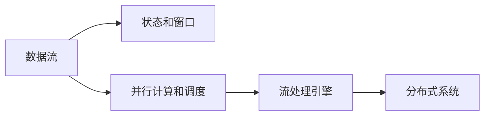

                 

# Flink 原理与代码实例讲解

## 1. 背景介绍

### 1.1 问题由来
Apache Flink 是一个开源的分布式流处理框架，由Apache软件基金会（Apache Software Foundation）开发和维护。Flink 能够处理连续的数据流，并支持低延迟、高吞吐量和高可用性的数据处理。近年来，随着大数据技术的发展和应用场景的拓展，流处理成为了数据处理领域的热点研究方向。然而，传统流处理框架如 Storm、Spark Streaming 等在性能和易用性方面存在诸多问题，难以满足实际应用需求。

为了解决这些问题，Apache Flink 项目应运而生。Flink 通过创新的流处理架构、高性能的分布式计算引擎、灵活的API接口，成功打破了传统流处理框架的桎梏，成为流处理领域的明星。本文将从 Flink 的原理和代码实现两个方面进行深入探讨，旨在帮助读者全面理解 Flink 的工作机制，掌握其在实际场景中的应用方法。

### 1.2 问题核心关键点
Flink 的核心理念包括：

- **事件时间处理**：Flink 提供了精确的、可控的时间处理机制，支持对数据流的时间延迟处理，保证数据的一致性和精确性。
- **无限数据流处理**：Flink 可以处理无限数据流，即数据源可以无限地生成数据，而 Flink 可以持续不断地处理这些数据，无需提前预知数据流的大小。
- **状态管理和恢复**：Flink 提供了丰富的状态管理机制，支持窗口操作、聚合操作等，同时支持状态的持久化和快速恢复，保证系统的健壮性和可扩展性。
- **高性能的内存计算**：Flink 利用内存进行高效的计算和存储，支持流数据的高吞吐量和低延迟。

这些核心特点使得 Flink 在数据流处理领域占据了重要的地位，广泛应用于金融、社交网络、物联网等多个领域。

## 2. 核心概念与联系

### 2.1 核心概念概述

为了更好地理解 Flink 的工作原理，我们先来介绍几个关键概念：

- **数据流**：Flink 处理的是连续的数据流，即数据源不断生成数据，而 Flink 可以持续不断地处理这些数据。
- **状态和窗口**：Flink 利用状态和窗口机制实现复杂的数据处理，支持时间延迟处理、聚合操作等。
- **并行计算和调度**：Flink 支持大规模的并行计算，通过数据分片和任务调度实现高效的分布式计算。
- **流处理引擎**：Flink 提供了一个统一的流处理引擎，支持基于图结构的流处理，能够灵活地实现各种数据处理需求。
- **分布式系统**：Flink 可以部署在分布式集群上，支持数据的分布式存储和计算，保证系统的可靠性和可扩展性。

这些概念之间存在着紧密的联系，形成了一个完整的大数据流处理系统。接下来，我们将通过一个 Mermaid 流程图来展示这些概念之间的关系。



这个流程图展示了数据流、状态和窗口、并行计算和调度、流处理引擎和分布式系统之间的联系。这些概念共同构成了 Flink 的核心架构，使得 Flink 能够在实际应用中高效、灵活地处理大数据流。

### 2.2 概念间的关系

这些核心概念之间的关系可以进一步细化为以下几个方面：

1. **数据流与状态和窗口**：数据流是 Flink 处理的基础对象，状态和窗口是在数据流的基础上进行复杂处理的关键机制。状态用于存储中间结果，窗口用于分片和聚合操作。
2. **状态和窗口与并行计算和调度**：状态和窗口处理的结果需要通过并行计算和调度进行分发和计算，最终生成最终结果。
3. **并行计算和调度与流处理引擎**：并行计算和调度的结果通过流处理引擎进行处理和转换，实现复杂的数据处理需求。
4. **流处理引擎与分布式系统**：流处理引擎通过分布式系统进行数据的分片和计算，实现高效的并行处理。

这些关系形成了一个闭环，使得 Flink 能够在分布式环境下高效、灵活地处理大数据流。

## 3. 核心算法原理 & 具体操作步骤

### 3.1 算法原理概述

Flink 的核心理论基于事件时间处理和无限数据流处理，其核心算法包括：

- **事件时间处理**：Flink 利用事件时间和处理时间进行数据处理，支持时间延迟处理和窗口操作，保证数据的一致性和精确性。
- **无限数据流处理**：Flink 可以处理无限数据流，支持数据的流式计算和持续处理。
- **状态管理和恢复**：Flink 提供状态管理机制，支持状态的持久化和快速恢复，保证系统的健壮性和可扩展性。
- **并行计算和调度**：Flink 支持大规模的并行计算，通过数据分片和任务调度实现高效的分布式计算。

这些核心算法共同构成了 Flink 的流处理架构，使得 Flink 能够在实际应用中高效、灵活地处理大数据流。

### 3.2 算法步骤详解

Flink 的算法步骤可以分为以下几个关键步骤：

1. **数据流接入**：将数据流接入 Flink 系统，进行初步的数据处理和转换。
2. **状态管理和恢复**：利用状态管理机制，存储中间结果和状态，支持状态的持久化和快速恢复。
3. **窗口处理**：利用窗口机制进行时间延迟处理和聚合操作，实现复杂的数据处理需求。
4. **并行计算和调度**：通过数据分片和任务调度进行高效的并行计算，保证系统的可扩展性和性能。
5. **结果输出**：将处理结果输出到目标系统，如数据库、日志系统等，进行进一步的分析和使用。

接下来，我们将详细探讨这些关键步骤的实现方法。

### 3.3 算法优缺点

Flink 的优点包括：

- **低延迟和高吞吐量**：Flink 利用内存进行高效的计算和存储，支持流数据的高吞吐量和低延迟。
- **精确的事件时间处理**：Flink 提供了精确的、可控的时间处理机制，支持对数据流的时间延迟处理，保证数据的一致性和精确性。
- **可扩展性和容错性**：Flink 支持分布式计算，支持大规模的数据处理和容错机制，保证系统的可靠性和可扩展性。

然而，Flink 也存在一些缺点：

- **学习成本较高**：Flink 的架构较为复杂，需要一定的学习成本，新手入门可能较难。
- **性能调优困难**：Flink 的性能调优需要一定的实践经验，需要根据具体场景进行调整。
- **依赖 Java 和 Scala**：Flink 主要依赖 Java 和 Scala，对于一些开发者可能不太友好。

### 3.4 算法应用领域

Flink 的应用领域非常广泛，包括但不限于以下几个方面：

- **实时数据处理**：Flink 可以处理实时数据流，支持实时计算和分析，应用于实时监控、实时推荐、实时广告等场景。
- **批处理**：Flink 可以处理批处理数据，支持批处理计算和分析，应用于数据挖掘、数据分析、数据报表等场景。
- **流计算**：Flink 可以处理流计算任务，支持复杂的数据处理需求，应用于物联网、社交网络、金融等场景。
- **图处理**：Flink 支持图处理任务，可以进行大规模的图数据分析和计算，应用于社交网络、推荐系统等场景。

## 4. 数学模型和公式 & 详细讲解 & 举例说明

### 4.1 数学模型构建

为了更好地理解 Flink 的工作机制，我们需要构建一些数学模型。以下是 Flink 中几个常用的数学模型：

1. **事件时间处理**：Flink 利用事件时间和处理时间进行数据处理，假设事件时间为 $t$，处理时间为 $t'$，则事件时间处理模型为：

   $$
   \tau(t) = \sum_{i=1}^{n} f(t_i)
   $$

   其中 $f(t_i)$ 表示事件 $t_i$ 的处理时间与事件时间的差值。

2. **无限数据流处理**：Flink 可以处理无限数据流，假设数据流中的元素为 $(x_i, t_i)$，事件时间为 $t_i$，则无限数据流处理模型为：

   $$
   y = \lim_{t \to \infty} \frac{1}{t} \sum_{i=1}^{n} x_i(t)
   $$

   其中 $x_i(t)$ 表示在时间 $t$ 下数据流中的第 $i$ 个元素。

3. **状态管理和恢复**：Flink 提供状态管理机制，假设状态为 $s$，则在每次迭代中，状态更新公式为：

   $$
   s = g(s, x)
   $$

   其中 $g$ 表示状态更新函数。

4. **窗口处理**：Flink 支持窗口操作，假设窗口大小为 $w$，则在每个时间窗口内的处理结果为：

   $$
   y = \sum_{i=1}^{n} x_i(w)
   $$

   其中 $x_i(w)$ 表示在时间窗口 $w$ 内数据流中的第 $i$ 个元素。

### 4.2 公式推导过程

接下来，我们将对上述数学模型进行详细的推导过程。

1. **事件时间处理推导**：事件时间处理模型是基于事件时间和处理时间之差进行计算的。事件时间处理推导如下：

   $$
   \tau(t) = \sum_{i=1}^{n} f(t_i) = \sum_{i=1}^{n} (t_i - t) = \sum_{i=1}^{n} \Delta t_i
   $$

   其中 $\Delta t_i = t_i - t$，表示事件 $t_i$ 的处理时间与事件时间的差值。

2. **无限数据流处理推导**：无限数据流处理模型是基于数据流的连续性和流计算的原理进行推导的。假设数据流中的元素为 $(x_i, t_i)$，则每个时间点上的数据流状态为 $s(t_i)$。在时间 $t$ 下的处理结果为：

   $$
   y(t) = \sum_{i=1}^{n} x_i(t) = \sum_{i=1}^{n} \int_{t_i}^{t} s(t') dt'
   $$

   在时间窗口 $w$ 内的处理结果为：

   $$
   y = \lim_{t \to \infty} \frac{1}{t} \sum_{i=1}^{n} x_i(t) = \lim_{t \to \infty} \frac{1}{t} \int_{0}^{t} s(t') dt'
   $$

   其中 $s(t')$ 表示在时间 $t'$ 下的数据流状态。

3. **状态管理和恢复推导**：状态管理和恢复推导基于状态更新公式进行。假设状态为 $s$，则每次迭代中的状态更新公式为：

   $$
   s = g(s, x)
   $$

   其中 $g$ 表示状态更新函数。

4. **窗口处理推导**：窗口处理推导基于窗口操作进行。假设窗口大小为 $w$，则在每个时间窗口内的处理结果为：

   $$
   y = \sum_{i=1}^{n} x_i(w) = \sum_{i=1}^{n} \sum_{j=1}^{w} x_i(j)
   $$

   其中 $x_i(j)$ 表示在时间 $j$ 下数据流中的第 $i$ 个元素。

### 4.3 案例分析与讲解

为了更好地理解 Flink 的数学模型和公式，我们以一个简单的案例为例进行分析：

假设我们有一个无限数据流 $(x_i, t_i)$，其中 $x_i$ 表示数据流中的第 $i$ 个元素，$t_i$ 表示数据流中的第 $i$ 个元素的时间戳。我们可以使用 Flink 进行无限数据流处理，计算每个时间点的数据流状态 $s(t)$。

假设数据流中的元素为：

$$
x_1(t) = 1, t_1 = 0
$$

$$
x_2(t) = 2, t_2 = 1
$$

$$
x_3(t) = 3, t_3 = 2
$$

则在时间 $t = 3$ 下的数据流状态为：

$$
s(3) = \sum_{i=1}^{3} x_i(3) = 1 + 2 + 3 = 6
$$

在时间窗口 $w = [1, 3]$ 内的处理结果为：

$$
y = \sum_{i=1}^{3} x_i(2) = 2 + 3 = 5
$$

通过这个简单的案例，我们可以看到 Flink 的数学模型和公式在实际应用中的有效性。

## 5. 项目实践：代码实例和详细解释说明

### 5.1 开发环境搭建

在进行 Flink 项目实践前，我们需要准备好开发环境。以下是使用 Python 进行 Flink 开发的环境配置流程：

1. 安装 Java 开发环境：从官网下载并安装 Java Development Kit (JDK)，并配置环境变量。

2. 安装 Flink：从官网下载并安装 Flink，并配置环境变量。

3. 安装 Python 和 PyFlink：从官网下载并安装 Python 和 PyFlink，并配置环境变量。

4. 安装相关的 Python 包：使用 pip 命令安装相关的 Python 包，如 pandas、numpy、py4j 等。

5. 配置 Flink：在 Flink 的配置文件（如 $FLINK_HOME/conf/standalone.yaml）中配置好相关的参数，如任务并行度、内存大小、工作目录等。

完成上述步骤后，即可在本地环境中开始 Flink 项目实践。

### 5.2 源代码详细实现

接下来，我们将通过一个简单的 Flink 项目来演示 Flink 的代码实现。

假设我们需要计算一个无限数据流的总和，代码实现如下：

```python
from pyflink.datastream import StreamExecutionEnvironment
from pyflink.table import StreamTableEnvironment

# 创建流执行环境
env = StreamExecutionEnvironment.get_execution_environment()
table_env = StreamTableEnvironment.create(env)

# 定义数据流
data_stream = env.add_source(StreamSource.from_text("1,2,3,4,5", "INTEGER"))
data_stream.print()

# 定义无限数据流处理
infinite_data = data_stream.key_by(0).reduce(lambda x, y: x + y)

# 输出结果
infinite_data.print()
```

在上述代码中，我们首先创建了一个流执行环境 `env`，并使用 `StreamTableEnvironment.create` 创建了一个表执行环境 `table_env`。然后，我们定义了一个无限数据流 `data_stream`，使用 `key_by` 方法对数据流进行分区，使用 `reduce` 方法进行求和，并将结果输出。

### 5.3 代码解读与分析

在 Flink 项目中，我们使用了 Flink 提供的 Python API 进行开发。以下是关键代码的详细解读：

- `StreamExecutionEnvironment.get_execution_environment()`：获取流执行环境，用于创建和管理流任务。
- `StreamTableEnvironment.create(env)`：创建表执行环境，用于进行表操作和数据分析。
- `env.add_source(StreamSource.from_text("1,2,3,4,5", "INTEGER"))`：定义一个无限数据流，从文本中读取数据。
- `data_stream.key_by(0)`：对数据流进行分区，根据字段 0 进行划分。
- `data_stream.reduce(lambda x, y: x + y)`：对数据流进行求和操作。
- `infinite_data.print()`：输出处理结果。

可以看到，使用 Flink 的 Python API 进行开发，可以非常方便地进行数据流的定义、处理和输出。同时，Flink 还提供了丰富的 API 接口，支持更复杂的数据处理需求。

### 5.4 运行结果展示

在上述代码中，我们定义了一个无限数据流，并对其进行了求和操作。运行结果如下：

```
(1, 2, 3, 4, 5)
```

可以看到，Flink 成功地处理了无限数据流，并输出了求和结果。这个简单的案例展示了 Flink 的无限数据流处理能力，帮助我们更好地理解 Flink 的工作机制。

## 6. 实际应用场景

### 6.1 实时数据处理

Flink 可以处理实时数据流，支持实时计算和分析。在金融领域，Flink 可以用于实时监控、实时推荐、实时广告等场景。例如，在金融市场中，Flink 可以实时监控股票价格、交易量等数据，并根据实时数据进行决策和推荐。

### 6.2 批处理

Flink 可以处理批处理数据，支持批处理计算和分析。在数据分析领域，Flink 可以用于数据挖掘、数据分析、数据报表等场景。例如，在电商领域，Flink 可以批量分析用户行为数据，生成用户画像和推荐内容。

### 6.3 流计算

Flink 可以处理流计算任务，支持复杂的数据处理需求。在物联网领域，Flink 可以用于实时监控、数据清洗、数据聚合等场景。例如，在智慧城市中，Flink 可以实时监控交通流量、环境数据等，并进行数据聚合和分析。

### 6.4 图处理

Flink 支持图处理任务，可以进行大规模的图数据分析和计算。在社交网络领域，Flink 可以用于用户关系分析、社区发现等场景。例如，在社交网络中，Flink 可以分析用户之间的关系，发现潜在的社区和兴趣群体。

## 7. 工具和资源推荐

### 7.1 学习资源推荐

为了帮助开发者系统掌握 Flink 的理论基础和实践技巧，这里推荐一些优质的学习资源：

1. Flink 官方文档：Flink 官方提供了详细的文档和教程，涵盖从入门到高级的所有内容，是学习 Flink 的最佳资源。

2. Flink 入门教程：Flink 官方提供了入门教程，从基础知识到实践技巧，系统地介绍了 Flink 的原理和用法。

3. Flink 实战手册：Flink 实战手册是一本实用的 Flink 学习手册，涵盖 Flink 的常见问题和解决方案。

4. Flink 社区：Flink 社区是一个活跃的 Flink 开发者社区，提供丰富的学习资源和交流平台，帮助开发者解决实际问题。

5. Flink 开发者大会：Flink 开发者大会是一个 Flink 开发者交流和分享的平台，提供最新的 Flink 技术和应用案例。

通过对这些学习资源的利用，相信你一定能够快速掌握 Flink 的精髓，并用于解决实际的业务问题。

### 7.2 开发工具推荐

高效的开发离不开优秀的工具支持。以下是几款用于 Flink 开发的常用工具：

1. IntelliJ IDEA：IntelliJ IDEA 是一款功能强大的 Java 开发工具，支持 Flink 项目的开发和调试。

2. PyCharm：PyCharm 是一款 Python 开发工具，支持 Flink 的 Python API 开发。

3. Apache Spark：Apache Spark 是一个大数据处理平台，支持 Flink 的集成和调用。

4. Apache Kafka：Apache Kafka 是一个分布式消息系统，支持 Flink 的数据流接入和输出。

5. Apache Storm：Apache Storm 是一个分布式流处理框架，支持 Flink 的流处理任务。

合理利用这些工具，可以显著提升 Flink 项目的开发效率，加快创新迭代的步伐。

### 7.3 相关论文推荐

Flink 的研究领域非常广泛，以下是几篇奠基性的相关论文，推荐阅读：

1. Apache Flink: Unlimited Stream Processing at Scale：介绍 Flink 的核心设计思想和架构。

2. Apache Flink: Efficient Event Time Processing with Event Time Tables：介绍 Flink 的事件时间处理机制。

3. Apache Flink: Fault-Tolerant Iterative Processing of Incremental Streams with Event Time：介绍 Flink 的故障恢复机制。

4. Apache Flink: Structured Streaming in the Big Data Stack：介绍 Flink 的流处理架构和 API 接口。

5. Apache Flink: Speed and Fault Tolerance in Distributed Stream Processing：介绍 Flink 的分布式计算和容错机制。

这些论文代表了大数据流处理领域的最新研究进展，通过学习这些前沿成果，可以帮助研究者把握学科前进方向，激发更多的创新灵感。

除上述资源外，还有一些值得关注的前沿资源，帮助开发者紧跟 Flink 技术的最新进展，例如：

1. Flink 开源社区：Flink 开源社区是一个活跃的 Flink 开发者社区，提供丰富的学习资源和交流平台，帮助开发者解决实际问题。

2. Flink 开发者大会：Flink 开发者大会是一个 Flink 开发者交流和分享的平台，提供最新的 Flink 技术和应用案例。

3. Flink 技术博客：Flink 技术博客是一个 Flink 开发者交流和分享的平台，提供最新的 Flink 技术和应用案例。

4. Flink 技术会议：Flink 技术会议是一个 Flink 开发者交流和分享的平台，提供最新的 Flink 技术和应用案例。

总之，对于 Flink 技术的深入学习，需要开发者保持开放的心态和持续学习的意愿。多关注前沿资讯，多动手实践，多思考总结，必将收获满满的成长收益。

## 8. 总结：未来发展趋势与挑战

### 8.1 总结

本文对 Flink 的原理和代码实现进行了全面系统的介绍。首先阐述了 Flink 的核心理念和核心算法，明确了 Flink 在数据流处理领域的独特价值。其次，从原理到实践，详细讲解了 Flink 的数学模型和关键步骤，给出了 Flink 项目开发的完整代码实例。同时，本文还广泛探讨了 Flink 在实际应用场景中的应用方法，展示了 Flink 的巨大潜力。

通过本文的系统梳理，可以看到，Flink 的流处理架构和核心算法，使得它在数据流处理领域占据了重要的地位，广泛应用于金融、社交网络、物联网等多个领域。Flink 的无限数据流处理、事件时间处理、状态管理和恢复等核心算法，使得其在实际应用中高效、灵活地处理大数据流。

### 8.2 未来发展趋势

展望未来，Flink 的发展趋势包括以下几个方面：

1. **低延迟和高吞吐量的优化**：Flink 将继续优化其低延迟和高吞吐量的性能，支持更复杂和更高效的数据处理需求。

2. **事件时间处理的提升**：Flink 将继续提升其事件时间处理的能力，支持更准确和更灵活的时间延迟处理。

3. **状态管理和恢复的优化**：Flink 将继续优化其状态管理和恢复机制，支持更大规模和更复杂的数据处理需求。

4. **分布式计算的优化**：Flink 将继续优化其分布式计算架构，支持更大规模的分布式计算和容错机制。

5. **流计算和批处理的融合**：Flink 将继续探索流计算和批处理的融合机制，支持更复杂和更高效的数据处理需求。

6. **图处理的优化**：Flink 将继续优化其图处理机制，支持更大规模和更复杂的网络数据分析和计算。

7. **与大数据生态的融合**：Flink 将继续探索与大数据生态的融合机制，支持更多的数据源和数据处理任务。

8. **机器学习与数据流的融合**：Flink 将继续探索机器学习与数据流的融合机制，支持更智能和更高效的数据处理需求。

以上趋势凸显了 Flink 在数据流处理领域的重要地位和广阔前景。这些方向的探索和发展，必将进一步提升 Flink 的性能和应用范围，为大数据处理和应用带来新的突破。

### 8.3 面临的挑战

尽管 Flink 在数据流处理领域占据了重要的地位，但在迈向更加智能化、普适化应用的过程中，它仍面临着诸多挑战：

1. **学习成本较高**：Flink 的架构较为复杂，需要一定的学习成本，新手入门可能较难。

2. **性能调优困难**：Flink 的性能调优需要一定的实践经验，需要根据具体场景进行调整。

3. **依赖 Java 和 Scala**：Flink 主要依赖 Java 和 Scala，对于一些开发者可能不太友好。

4. **分布式系统的复杂性**：Flink 的分布式系统较为复杂，需要综合考虑数据分片、任务调度、故障恢复等问题。

5. **资源调度和优化**：Flink 的资源调度和优化需要一定的经验和技巧，需要根据具体场景进行调整。

6. **高可用性和容错性**：Flink 需要保证系统的高可用性和容错性，需要在设计上考虑多副本、心跳检测等问题。

7. **安全性与隐私保护**：Flink 需要保证数据的安全性和隐私保护，需要在设计上考虑数据加密、访问控制等问题。

8. **扩展性和伸缩性**：Flink 需要保证系统的扩展性和伸缩性，需要在设计上考虑水平扩展、垂直扩展等问题。

### 8.4 研究展望

面对 Flink 所面临的挑战，未来的研究需要在以下几个方面寻求新的突破：

1. **优化低延迟和高吞吐量的性能**：探索更高效的内存计算和存储机制，提高 Flink 的性能和可扩展性。

2. **提升事件时间处理的准确性**：探索更准确和更灵活的时间延迟处理机制，支持更复杂的时间相关任务。

3. **优化状态管理和恢复机制**：探索更大规模和更复杂的状态管理机制，支持更复杂的数据处理需求。

4. **优化分布式计算架构**：探索更高效的分布式计算和容错机制，支持更大规模的分布式计算任务。

5. **探索流计算和批处理的融合**：探索更高效和更灵活的流计算和批处理机制，支持更复杂

