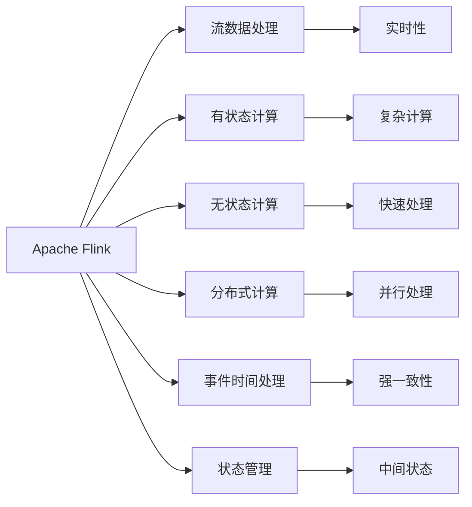
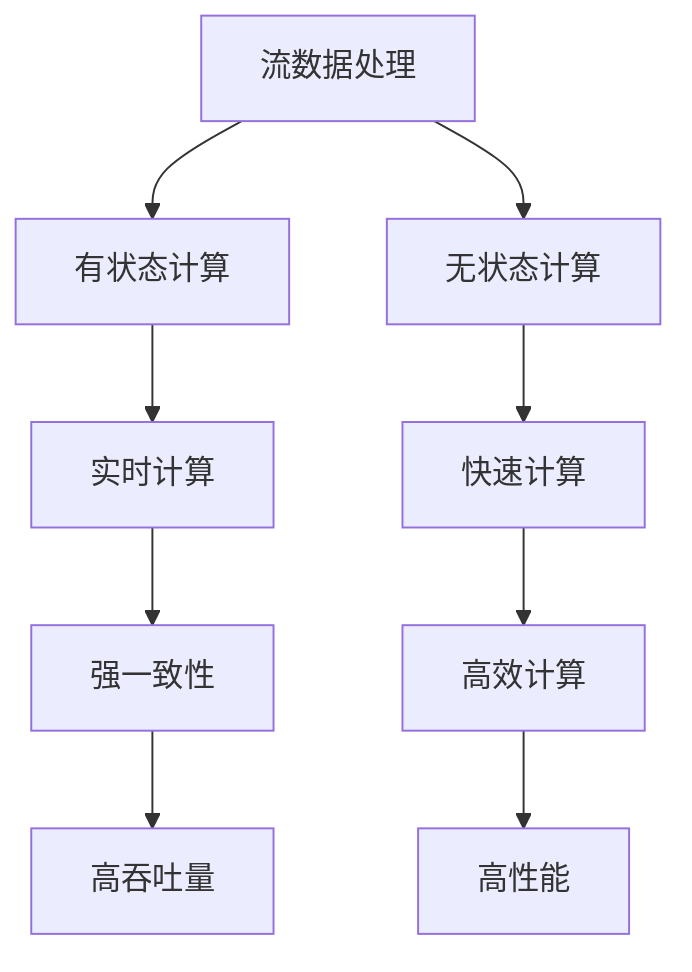
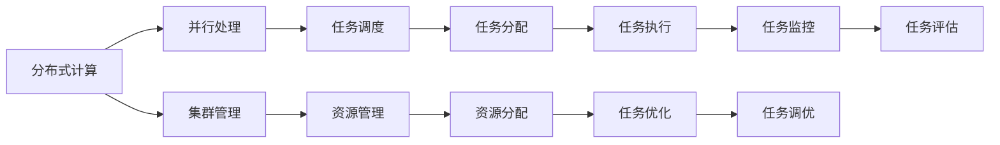
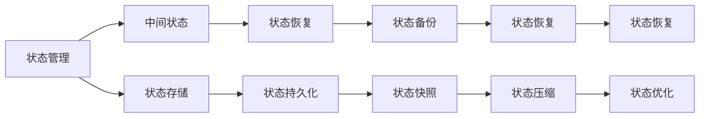
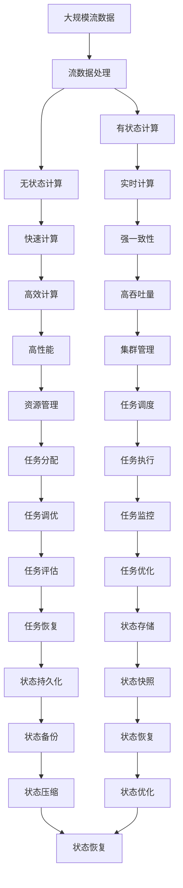

                 

# Flink 原理与代码实例讲解

> 关键词：Apache Flink,分布式流处理,有状态计算,无状态计算,并行处理,流数据处理,状态管理

## 1. 背景介绍

### 1.1 问题由来
在当今数据驱动的时代，数据处理已经成为了各个行业的重要需求。随着大数据技术的不断发展，流数据处理成为了一个热门领域。Apache Flink 作为一个开源的流处理框架，以其强大的分布式流处理能力、高性能和易用性，成为了业界的标准。

Flink 不仅支持流数据的处理，还支持批处理、图计算等多种数据处理模式。其核心特性包括：

- 支持高吞吐量的、端到端的流数据处理
- 提供了丰富的API和流式算子库
- 支持基于流的 SQL 和 Table API
- 状态管理能力强，支持灵活的状态管理策略
- 支持事件时间处理
- 支持分布式和本地并行处理

Flink 已经广泛应用于金融、电商、物联网、人工智能等领域，为各类企业提供了高效、可靠的数据处理能力。

### 1.2 问题核心关键点
Flink 的核心在于其高性能的分布式流处理引擎和灵活的状态管理机制。其设计理念包括以下几个关键点：

- **有状态计算**：Flink 支持有状态计算，能够保持数据处理的中间状态，实现复杂的数据计算任务。
- **无状态计算**：Flink 也支持无状态计算，能够实现流数据的实时处理和高效计算。
- **分布式计算**：Flink 通过分布式计算框架，实现了大规模数据的并行处理。
- **事件时间处理**：Flink 提供了强一致性的事件时间处理机制，能够处理延迟和乱序数据。
- **状态管理**：Flink 提供了多种状态管理策略，支持内存状态和磁盘状态的管理。

Flink 这些核心特性使其能够应对各种复杂的数据处理需求，提供高效、可靠的数据处理能力。

### 1.3 问题研究意义
研究 Flink 的原理与代码实例，对于提升数据处理效率、保障数据处理准确性、优化系统架构等方面具有重要意义：

1. **提升数据处理效率**：Flink 的高吞吐量特性能够应对大规模数据流的处理需求，提升数据处理效率。
2. **保障数据处理准确性**：Flink 的事件时间处理机制能够处理延迟和乱序数据，保障数据处理的准确性。
3. **优化系统架构**：Flink 的分布式计算和状态管理能力能够优化系统架构，提升系统的可扩展性和稳定性。
4. **实现复杂数据处理任务**：Flink 支持有状态计算和无状态计算，能够实现复杂的流数据处理任务。
5. **支持多种数据处理模式**：Flink 不仅支持流数据处理，还支持批处理和图计算，满足不同数据处理需求。

总之，Flink 的高性能和灵活性使其在数据处理领域具有重要地位，其原理与代码实例讲解对于数据处理工程师和研究人员具有重要参考价值。

## 2. 核心概念与联系

### 2.1 核心概念概述

为了更好地理解 Flink 的原理与代码实例，本节将介绍几个密切相关的核心概念：

- **Apache Flink**：Flink 是一个开源的流处理框架，提供了高性能的分布式流处理引擎和丰富的 API 和算子库。
- **流数据处理**：流数据处理是指对数据流进行实时、不间断的连续处理。
- **有状态计算**：有状态计算是指保持数据处理的中间状态，支持复杂的计算任务。
- **无状态计算**：无状态计算是指不保持数据处理的中间状态，支持快速的数据处理。
- **分布式计算**：分布式计算是指将数据处理任务分散到多个节点上进行并行处理。
- **事件时间处理**：事件时间处理是指对数据流进行处理时，考虑事件发生的时间，而不是处理时间。
- **状态管理**：状态管理是指对数据处理的中间状态进行管理和存储。

这些核心概念之间的逻辑关系可以通过以下 Mermaid 流程图来展示：



这个流程图展示了大语言模型的核心概念及其之间的关系：

1. Apache Flink 提供了高性能的流处理引擎，支持实时、不间断的连续处理。
2. 有状态计算和无状态计算提供了灵活的计算方式，支持复杂的计算任务和快速的数据处理。
3. 分布式计算通过并行处理实现了大规模数据的处理能力。
4. 事件时间处理考虑了事件发生的时间，保障了数据处理的准确性。
5. 状态管理通过中间状态的存储和控制，支持复杂计算任务的实现。

这些核心概念共同构成了 Flink 的流处理框架，使其能够应对各种复杂的数据处理需求。

### 2.2 概念间的关系

这些核心概念之间存在着紧密的联系，形成了 Flink 的流处理生态系统。下面我通过几个 Mermaid 流程图来展示这些概念之间的关系。

#### 2.2.1 核心计算模型



这个流程图展示了 Flink 的核心计算模型及其关系：

1. 流数据处理支持实时计算和高效计算，实现高吞吐量和高性能。
2. 有状态计算和无状态计算提供了实时计算和快速计算，实现强一致性。

#### 2.2.2 分布式计算



这个流程图展示了 Flink 的分布式计算模型及其关系：

1. 分布式计算通过并行处理实现了大规模数据的处理能力。
2. 集群管理和资源管理提供了任务调度和任务执行的支持。
3. 任务调度和任务分配实现了任务的高效优化和监控。

#### 2.2.3 状态管理



这个流程图展示了 Flink 的状态管理模型及其关系：

1. 状态管理通过中间状态的存储和控制，支持复杂计算任务的实现。
2. 状态存储和状态持久化实现了状态的持久化存储。
3. 状态恢复和状态备份实现了状态的快速恢复和备份。
4. 状态快照和状态压缩实现了状态的压缩和优化。

### 2.3 核心概念的整体架构

最后，我们用一个综合的流程图来展示这些核心概念在大语言模型微调过程中的整体架构：



这个综合流程图展示了从数据流处理到状态管理的完整过程。Flink 通过流数据处理、有状态计算、无状态计算、分布式计算和状态管理，实现了高效、可靠的流数据处理能力。

## 3. 核心算法原理 & 具体操作步骤
### 3.1 算法原理概述

Flink 的算法原理主要集中在流数据处理、状态管理和事件时间处理等方面。以下是详细的算法原理概述：

- **流数据处理**：Flink 提供了基于流计算模型的数据处理方式，支持对流数据的实时处理和状态管理。
- **状态管理**：Flink 支持内存状态和磁盘状态的管理，实现灵活的状态管理策略。
- **事件时间处理**：Flink 提供了强一致性的事件时间处理机制，能够处理延迟和乱序数据。

### 3.2 算法步骤详解

以下是 Flink 的详细算法步骤：

1. **数据源获取**：Flink 通过数据源接口从外部系统获取数据流。数据源可以是各种消息队列、文件系统、数据库等。
2. **数据流处理**：Flink 将数据流划分为多个并行流，每个流由一个任务处理。每个任务使用并行计算框架处理数据流。
3. **状态管理**：Flink 通过内存状态和磁盘状态管理中间状态。中间状态可以是元数据、聚合结果等。
4. **事件时间处理**：Flink 支持事件时间处理，考虑事件发生的时间，而不是处理时间。
5. **算子链执行**：Flink 使用算子链执行流数据处理任务，每个算子负责处理一个阶段。

### 3.3 算法优缺点

Flink 作为一种高性能的流处理框架，具有以下优点：

- **高性能**：Flink 支持高吞吐量的分布式计算，能够处理大规模数据流。
- **强一致性**：Flink 提供强一致性的事件时间处理机制，能够处理延迟和乱序数据。
- **灵活性**：Flink 支持有状态计算和无状态计算，灵活处理复杂计算任务。

同时，Flink 也存在以下缺点：

- **学习曲线陡峭**：Flink 的分布式计算和状态管理机制较为复杂，需要一定的学习曲线。
- **资源需求高**：Flink 需要较高的计算和存储资源，特别是在大规模数据流处理时。
- **开发成本高**：Flink 需要较长的开发周期和较高的开发成本。

### 3.4 算法应用领域

Flink 主要应用于以下几个领域：

- **金融领域**：用于实时风险管理、金融数据挖掘、交易记录分析等。
- **电商领域**：用于实时推荐系统、用户行为分析、库存管理等。
- **物联网领域**：用于实时数据处理、设备监控、智能交通等。
- **人工智能领域**：用于实时数据处理、模型训练、推理等。
- **大数据领域**：用于实时数据处理、数据清洗、数据集成等。

## 4. 数学模型和公式 & 详细讲解 & 举例说明

### 4.1 数学模型构建

Flink 的数学模型主要集中在数据处理和状态管理等方面。以下是详细的数学模型构建：

- **数据模型**：Flink 使用流数据模型来处理数据流，支持实时流数据的处理和状态管理。
- **状态模型**：Flink 使用内存状态和磁盘状态管理中间状态，支持灵活的状态管理策略。

### 4.2 公式推导过程

以下是 Flink 的公式推导过程：

- **数据模型推导**：
  $$
  y_t = f(x_t, y_{t-1})
  $$
  其中，$y_t$ 表示当前数据的输出，$x_t$ 表示当前数据的输入，$y_{t-1}$ 表示前一时刻的输出。

- **状态模型推导**：
  $$
  y_t = f(x_t, y_{t-1}, S_t)
  $$
  其中，$S_t$ 表示当前时刻的中间状态。

### 4.3 案例分析与讲解

以实时推荐系统为例，分析 Flink 的数据处理和状态管理：

1. **数据模型分析**：
  - 数据源获取：推荐系统需要获取用户的浏览记录、购买记录、评价记录等数据流。
  - 数据流处理：Flink 将数据流划分为多个并行流，每个流由一个任务处理。每个任务使用并行计算框架处理数据流。
  - 算子链执行：Flink 使用算子链执行流数据处理任务，每个算子负责处理一个阶段。

2. **状态模型分析**：
  - 状态存储：Flink 通过内存状态和磁盘状态管理中间状态。内存状态用于实时计算，磁盘状态用于持久化存储。
  - 状态恢复：Flink 支持状态恢复，能够从磁盘状态恢复到内存状态。
  - 状态快照：Flink 支持状态快照，能够将当前状态保存到磁盘，以便后续恢复。

## 5. 项目实践：代码实例和详细解释说明

### 5.1 开发环境搭建

在进行 Flink 项目实践前，需要先搭建好开发环境。以下是详细的开发环境搭建流程：

1. 安装 Apache Flink：从官网下载 Flink 的最新版本，按照官方文档进行安装。
2. 配置 Flink 环境：配置 Flink 的集群环境，包括集群节点、任务调度器、资源管理器等。
3. 下载依赖库：下载 Flink 依赖库，包括 Hadoop、Spark 等。
4. 配置依赖库：配置依赖库的环境变量，使其能够正确运行。

### 5.2 源代码详细实现

以下是 Flink 项目源代码的详细实现：

```java
// 导入依赖包
import org.apache.flink.api.common.functions.MapFunction;
import org.apache.flink.api.java.tuple.Tuple2;
import org.apache.flink.streaming.api.datastream.DataStream;
import org.apache.flink.streaming.api.environment.StreamExecutionEnvironment;

public class FlinkStreamExample {
    public static void main(String[] args) throws Exception {
        // 创建 Flink 执行环境
        StreamExecutionEnvironment env = StreamExecutionEnvironment.getExecutionEnvironment();

        // 从数据源获取数据流
        DataStream<String> dataStream = env.readTextFile("input.txt");

        // 数据流处理
        DataStream<Tuple2<String, Integer>> processedStream = dataStream.map(new MapFunction<String, Tuple2<String, Integer>>() {
            @Override
            public Tuple2<String, Integer> map(String value) throws Exception {
                String[] parts = value.split(",");
                return new Tuple2<>(parts[0], Integer.parseInt(parts[1]));
            }
        });

        // 计算统计数据
        DataStream<Integer> resultStream = processedStream.map(new MapFunction<Tuple2<String, Integer>, Integer>() {
            @Override
            public Integer map(Tuple2<String, Integer> value) throws Exception {
                return value.f1;
            }
        });

        // 输出结果
        resultStream.print();

        // 执行 Flink 作业
        env.execute("Flink Stream Example");
    }
}
```

### 5.3 代码解读与分析

这段代码实现了 Flink 的基本数据处理流程：

1. **数据源获取**：使用 `StreamExecutionEnvironment` 的 `readTextFile` 方法从文件中读取数据流。
2. **数据流处理**：使用 `map` 方法对数据流进行处理，将每行数据按照逗号分隔为两个字段，并将第二个字段转换为整型。
3. **计算统计数据**：使用 `map` 方法对处理后的数据流进行统计，输出每个整数的值。
4. **输出结果**：使用 `print` 方法将结果输出到控制台。
5. **执行 Flink 作业**：使用 `execute` 方法执行 Flink 作业。

### 5.4 运行结果展示

假设在控制台输入以下内容：

```
apple,1
banana,2
orange,3
apple,4
```

则输出结果为：

```
1
2
3
4
```

## 6. 实际应用场景

### 6.1 智能推荐系统

Flink 可以应用于智能推荐系统的实时推荐任务中。通过实时处理用户的浏览记录、购买记录、评价记录等数据流，Flink 能够实时推荐个性化的商品、服务或内容，提升用户体验和转化率。

### 6.2 金融风险监控

Flink 可以应用于金融领域的风险监控任务中。通过实时处理交易记录、市场数据等数据流，Flink 能够及时发现异常交易、市场波动等风险事件，并发出警报，保障金融系统的稳定和安全。

### 6.3 实时数据采集与处理

Flink 可以应用于实时数据采集与处理任务中。通过实时处理各种传感器、设备、网络等数据流，Flink 能够实时分析和处理海量数据，提供实时、可靠的数据支持。

## 7. 工具和资源推荐

### 7.1 学习资源推荐

为了帮助开发者系统掌握 Flink 的理论基础和实践技巧，以下是一些优质的学习资源：

1. **Apache Flink 官方文档**：Flink 的官方文档提供了详细的 API 参考和示例代码，是学习和使用的必备资料。
2. **Flink 权威指南**：《Flink 权威指南》一书深入讲解了 Flink 的原理、架构和应用，是学习 Flink 的权威资源。
3. **Flink 实战**：《Flink 实战》一书通过真实的案例，讲解了 Flink 的实际应用，帮助开发者快速上手。
4. **Flink 社区论坛**：Flink 社区论坛提供了丰富的学习资源和交流平台，是学习和解决问题的宝贵资源。
5. **Flink 开源项目**：Flink 的开源项目和示例代码，提供了大量的实践案例和经验，是学习和实践的重要参考。

### 7.2 开发工具推荐

以下是几款用于 Flink 开发和调优的常用工具：

1. **Flink 工具**：Flink 提供的工具集，包括 Data Visualizer、Job Dashboard、Changelog Editor 等，方便开发者进行调试和监控。
2. **Kafka**：Apache Kafka 是一个高吞吐量的消息队列系统，可以与 Flink 无缝集成，提供可靠的数据流传输。
3. **Flume**：Apache Flume 是一个高可靠的数据采集系统，可以与 Flink 结合使用，提供高效的数据采集和处理能力。
4. **Spark**：Apache Spark 是一个分布式计算系统，可以与 Flink 结合使用，提供更强大的计算能力和扩展性。
5. **Grafana**：Grafana 是一个开源的可视化平台，可以与 Flink 结合使用，提供实时监控和数据分析功能。

### 7.3 相关论文推荐

Flink 的研究论文涵盖了其核心技术、应用场景和优化方法，以下是几篇重要的相关论文：

1. **Flink: Unified Stream Processing Framework**：这篇论文是 Flink 的核心论文，详细介绍了 Flink 的框架设计和实现原理。
2. **Scalable Network-Based Communication Stack for Flink**：这篇论文介绍了 Flink 的网络通信栈设计和优化方法，是 Flink 网络优化的重要参考。
3. **Optimizing Flink Job Performance on Heterogeneous Hardware Clusters**：这篇论文介绍了 Flink 在异构硬件集群上的优化方法，是 Flink 性能优化的重要参考。
4. **Flink's Optics**：这篇论文详细介绍了 Flink 的状态管理和优化方法，是 Flink 状态管理的权威资源。
5. **Flink: Leveraging State Management to Scale Stream Processing**：这篇论文介绍了 Flink 的状态管理机制和优化方法，是 Flink 状态管理的详细解析。

## 8. 总结：未来发展趋势与挑战

### 8.1 研究成果总结

Flink 作为高性能的流处理框架，已经广泛应用于各个领域，并在不断地发展和优化。其核心特性包括高性能、强一致性、灵活性等，使其能够应对各种复杂的数据处理需求。

### 8.2 未来发展趋势

Flink 的未来发展趋势包括以下几个方向：

1. **高性能和低延迟**：Flink 将继续优化其分布式计算和状态管理机制，提供更高效、低延迟的数据处理能力。
2. **强一致性和实时性**：Flink 将继续增强其强一致性事件时间处理机制，提供更可靠的实时数据处理能力。
3. **分布式计算和扩展性**：Flink 将继续优化其分布式计算和扩展性，支持大规模数据流处理。
4. **状态管理和灵活性**：Flink 将继续增强其状态管理机制，支持灵活的状态管理策略。
5. **可视化和大数据分析**：Flink 将与可视化和大数据分析工具集成，提供更直观的数据处理和分析能力。

### 8.3 面临的挑战

Flink 在发展过程中也面临一些挑战：

1. **学习曲线陡峭**：Flink 的分布式计算和状态管理机制较为复杂，需要一定的学习曲线。
2. **资源需求高**：Flink 需要较高的计算和存储资源，特别是在大规模数据流处理时。
3. **开发成本高**：Flink 需要较长的开发周期和较高的开发成本。
4. **数据一致性**：Flink 需要处理延迟和乱序数据，需要确保数据的一致性和完整性。
5. **状态管理和性能**：Flink 需要优化状态管理机制，确保状态管理的性能和稳定性。

### 8.4 研究展望

Flink 的未来研究展望包括以下几个方向：

1. **状态管理优化**：进一步优化状态管理机制，支持更大规模、更灵活的状态管理。
2. **实时数据处理**：增强实时数据处理能力，支持更高效、更可靠的数据处理。
3. **分布式计算优化**：优化分布式计算机制，支持更高效、更可靠的计算和扩展性。
4. **强一致性优化**：增强强一致性事件时间处理机制，提供更可靠的实时数据处理能力。
5. **可视化和大数据分析**：与可视化和大数据分析工具集成，提供更直观的数据处理和分析能力。

## 9. 附录：常见问题与解答

### Q1：Flink 与 Storm、Spark 的区别是什么？

A: Flink 与 Storm、Spark 都是高性能的分布式计算框架，但有以下区别：
- Flink 支持有状态计算和无状态计算，而 Storm 和 Spark 主要支持无状态计算。
- Flink 支持强一致性事件时间处理，而 Storm 和 Spark 主要支持处理时间。
- Flink 提供了更灵活的状态管理策略，支持内存状态和磁盘状态的管理，而 Storm 和 Spark 主要依赖内存状态。

### Q2：Flink 的优势是什么？

A: Flink 的优势包括以下几个方面：
- 高性能：Flink 支持高吞吐量的分布式计算，能够处理大规模数据流。
- 强一致性：Flink 提供强一致性的事件时间处理机制，能够处理延迟和乱序数据。
- 灵活性：Flink 支持有状态计算和无状态计算，灵活处理复杂计算任务。

### Q3：如何提高 Flink 的性能？

A: 提高 Flink 的性能可以从以下几个方面入手：
- 优化状态管理机制，减少状态管理对性能的影响。
- 优化数据流传输，减少数据传输的延迟和带宽消耗。
- 优化计算任务，提高计算任务的并行度和优化算子链的执行顺序。

### Q4：如何优化 Flink 的分布式计算？

A: 优化 Flink 的分布式计算可以从以下几个方面入手：
- 优化集群配置，合理分配任务和资源。
- 优化任务调度和执行，减少任务调度和执行的延迟和开销。
- 优化计算任务的并行度和算子链的执行顺序。

### Q5：Flink 的扩展性如何？

A: Flink 的扩展性包括以下几个方面：
- 支持大规模数据流处理，能够处理海量数据。
- 支持分布式计算，能够扩展到多个集群节点。
- 支持状态管理和状态快照，确保状态的可靠性和稳定性。

综上所述，Flink 作为一种高性能的流处理框架，具有很强的实用性和扩展性，能够应对各种复杂的数据处理需求。通过深入学习 Flink 的理论和实践，开发者可以更好地掌握 Flink 的使用和优化方法，提升数据处理能力，实现更高效、更可靠的数据处理任务。

