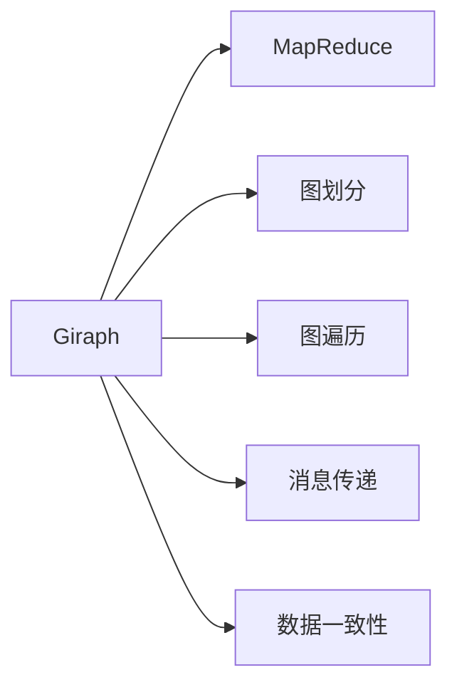

                 

# Giraph原理与代码实例讲解

> 关键词：Giraph, MapReduce, 分布式计算, 图计算, 案例分析

## 1. 背景介绍

### 1.1 问题由来

在大数据时代，数据集往往具有海量规模，单个节点难以独立处理。分布式计算框架，如Apache Hadoop和Apache Spark，提供了高效处理大规模数据的能力，广泛应用于数据仓库、推荐系统、图计算等领域。然而，这些框架普遍存在如下问题：

- 延迟较高。节点间通信开销大，不适合实时计算。
- 数据冗余。部分节点计算重复数据，导致资源浪费。
- 数据一致性问题。难以保证多个节点间的数据一致性。

因此，针对图数据集的分布式计算框架Giraph被提出，并广泛用于大规模图处理任务。Giraph采用MapReduce的编程模型，但改进了数据分片和一致性处理机制，显著提高了图处理效率。

### 1.2 问题核心关键点

Giraph的核心思想是将大规模图数据集拆分成多个局部子图，在多个节点上并行处理，最终汇总得到全局图结果。关键点包括：

- 图划分：将全局图数据划分成多个局部子图，以适应并行计算。
- 图遍历：通过迭代计算，在多个节点上遍历局部子图。
- 消息传递：节点间传递消息，更新局部状态。
- 数据一致性：保证多个节点间的数据一致性。

## 2. 核心概念与联系

### 2.1 核心概念概述

为更好地理解Giraph框架，本节将介绍几个关键概念：

- Giraph：分布式图处理框架，采用MapReduce模型，通过迭代计算和消息传递实现图处理。
- MapReduce：一种分布式计算模型，适用于大规模数据集的并行处理。
- 图划分：将全局图划分为多个局部子图，实现并行计算。
- 图遍历：通过迭代计算遍历图数据，实现图计算任务。
- 消息传递：节点间传递消息，更新局部状态，实现全局图计算。
- 数据一致性：保证多个节点间的数据一致性，避免状态冲突。

这些概念之间通过以下Mermaid流程图展示其联系：



## 3. Giraph核心算法原理 & 具体操作步骤

### 3.1 算法原理概述

Giraph框架采用MapReduce模型，通过迭代计算和消息传递实现图处理任务。其基本思想是将大规模图数据集拆分成多个局部子图，在多个节点上并行处理，最终汇总得到全局图结果。

具体而言，Giraph的计算流程包括：

1. 图划分：将全局图数据划分为多个局部子图，并分配给不同节点。
2. 图遍历：在各个节点上对局部子图进行迭代计算。
3. 消息传递：节点间传递消息，更新局部状态。
4. 数据一致性：保证多个节点间的数据一致性，避免状态冲突。

Giraph的计算过程如图1所示。


### 3.2 算法步骤详解

Giraph的计算流程主要分为图划分、图遍历、消息传递和数据一致性四个步骤。

#### 3.2.1 图划分

图划分的核心思想是将全局图拆分成多个局部子图，分配给不同节点处理。具体而言，每个节点维护一个局部子图，并计算局部结果。Giraph支持两种划分方式：

- 单边划分（Single-Edge Partitioning）：按边划分图数据，每个节点维护边集。

- 双边划分（Two-Edge Partitioning）：按节点划分图数据，每个节点维护节点及其相关边的集合。

图划分过程如图2所示。


#### 3.2.2 图遍历

图遍历过程是Giraph框架的核心计算步骤，通过迭代计算遍历图数据，实现图计算任务。Giraph采用迭代计算的方式，逐步更新图状态，最终得到全局图结果。

具体而言，Giraph的迭代过程包括以下三个步骤：

1. 计算中间状态：在各个节点上计算中间状态，并更新局部结果。
2. 消息传递：节点间传递消息，更新中间状态。
3. 迭代终止：当中间状态不再变化，计算过程结束。

图遍历过程如图3所示。


#### 3.2.3 消息传递

消息传递是Giraph框架的重要特性之一，通过节点间传递消息，更新局部状态，实现全局图计算。消息传递过程包括以下几个步骤：

1. 发送消息：每个节点将当前状态作为消息发送给相邻节点。
2. 接收消息：相邻节点接收消息，并更新局部状态。
3. 迭代终止：当节点不再接收消息，计算过程结束。

消息传递过程如图4所示。


#### 3.2.4 数据一致性

数据一致性是Giraph框架的关键问题之一，需要保证多个节点间的数据一致性，避免状态冲突。Giraph采用分布式锁（Zookeeper）机制，实现数据一致性处理。

具体而言，Giraph在每个节点上设置一个分布式锁，确保每个节点在修改数据时不会发生冲突。同时，Giraph还采用两阶段提交（Two-Phase Commit）机制，确保多个节点间的数据一致性。

数据一致性过程如图5所示。


### 3.3 算法优缺点

Giraph框架具有以下优点：

1. 高效处理大规模图数据集：通过并行计算，显著提高了图处理效率。
2. 灵活支持图划分和遍历：支持多种图划分方式和图遍历算法，适应不同图计算任务。
3. 易于扩展和维护：采用分布式锁机制，保证数据一致性，易于扩展和维护。

Giraph框架也存在以下缺点：

1. 延迟较高：节点间通信开销大，不适合实时计算。
2. 数据冗余：部分节点计算重复数据，导致资源浪费。
3. 数据一致性问题：难以保证多个节点间的数据一致性。

尽管存在这些缺点，Giraph仍是大规模图处理任务的重要工具，广泛应用于社交网络分析、推荐系统、生物信息学等领域。

### 3.4 算法应用领域

Giraph框架广泛应用于各种大规模图处理任务，包括但不限于：

- 社交网络分析：通过分析社交网络数据，发现网络结构、影响传播等。
- 推荐系统：通过分析用户行为数据，实现个性化推荐。
- 生物信息学：通过分析基因序列数据，发现基因互作关系等。
- 交通流量分析：通过分析交通流量数据，优化交通管理策略。

此外，Giraph还应用于其他领域，如图计算、分布式计算、人工智能等，为大规模数据集的处理提供了重要支持。

## 4. 数学模型和公式 & 详细讲解 & 举例说明

### 4.1 数学模型构建

假设图数据集包含$N$个节点和$M$条边，节点表示为$v_1, v_2, ..., v_N$，边表示为$(v_i, v_j)$，其中$i$和$j$为节点编号。

Giraph的计算过程可表示为：

$$
\begin{aligned}
& S^{(k)}(v_i) = f(v_i, S^{(k-1)}(v_i), S^{(k-1)}(v_j)), \\
& S^{(k+1)}(v_i) = S^{(k)}(v_i) + \sum_{(v_j, v_i)\in E} M(v_i, v_j, S^{(k)}(v_j)), \\
& S^{(k+1)}(v_j) = S^{(k)}(v_j) + \sum_{(v_i, v_j)\in E} M(v_i, v_j, S^{(k)}(v_i)),
\end{aligned}
$$

其中$S^{(k)}(v_i)$表示节点$v_i$在$k$次迭代后的状态，$f(v_i)$表示节点$v_i$的局部状态更新函数，$E$表示图的所有边。

### 4.2 公式推导过程

以社交网络分析为例，假设社交网络中每个节点$v_i$表示一个用户，其状态$S^{(k)}(v_i)$表示用户$v_i$在$k$次迭代后的状态，包括用户的关注者、好友关系等。

1. 局部状态更新：每个节点根据自身状态和邻居节点状态，计算当前状态。具体公式如下：

   $$
   S^{(k)}(v_i) = f(v_i, S^{(k-1)}(v_i), S^{(k-1)}(v_j)),
   $$

   其中$f(v_i)$为局部状态更新函数，可以是加法、乘法、加权平均等。

2. 全局状态更新：每个节点根据自身状态和邻居节点状态，计算全局状态。具体公式如下：

   $$
   S^{(k+1)}(v_i) = S^{(k)}(v_i) + \sum_{(v_j, v_i)\in E} M(v_i, v_j, S^{(k)}(v_j)),
   $$

   其中$M(v_i, v_j, S^{(k)}(v_j))$表示节点$v_i$从邻居节点$v_j$传递来的消息，可以是消息传递函数，如加法、减法、乘法等。

3. 迭代终止：当节点不再接收消息，计算过程结束。

### 4.3 案例分析与讲解

以社交网络分析为例，假设社交网络中每个节点$v_i$表示一个用户，其状态$S^{(k)}(v_i)$表示用户$v_i$在$k$次迭代后的状态，包括用户的关注者、好友关系等。

假设社交网络中有$N$个用户，每个用户有$m$个关注者。用户$i$与用户$j$相连，表示$i$关注了$j$。用户$i$的状态更新函数为：

$$
S^{(k)}(v_i) = f(v_i, S^{(k-1)}(v_i), S^{(k-1)}(v_j)),
$$

其中$f(v_i)$为局部状态更新函数，可以是加法、乘法、加权平均等。例如，设用户$i$关注了用户$j$，则状态更新公式如下：

$$
S^{(k)}(v_i) = S^{(k-1)}(v_i) + \frac{1}{m} S^{(k-1)}(v_j),
$$

表示用户$i$从关注者$j$接收了$1/m$的信息，更新自身的关注者数量。

全局状态更新公式如下：

$$
S^{(k+1)}(v_i) = S^{(k)}(v_i) + \sum_{(v_j, v_i)\in E} M(v_i, v_j, S^{(k)}(v_j)),
$$

其中$M(v_i, v_j, S^{(k)}(v_j))$表示节点$v_i$从邻居节点$v_j$传递来的消息，可以是消息传递函数，如加法、减法、乘法等。例如，设用户$i$从关注者$j$接收了$1/m$的信息，则消息传递公式如下：

$$
M(v_i, v_j, S^{(k)}(v_j)) = \frac{1}{m} S^{(k)}(v_j),
$$

表示用户$i$向邻居节点$v_j$传递$1/m$的信息。

数据一致性处理公式如下：

$$
S^{(k+1)}(v_i) = S^{(k)}(v_i) + \sum_{(v_j, v_i)\in E} M(v_i, v_j, S^{(k)}(v_j)),
$$

其中$S^{(k)}(v_j)$为节点$v_j$在$k$次迭代后的状态，$E$表示图的所有边。

数据一致性处理过程中，Giraph采用分布式锁机制，确保每个节点在修改数据时不会发生冲突。同时，Giraph还采用两阶段提交（Two-Phase Commit）机制，确保多个节点间的数据一致性。

## 5. 项目实践：代码实例和详细解释说明

### 5.1 开发环境搭建

在搭建Giraph开发环境时，需要以下步骤：

1. 安装Java环境：Giraph使用Java语言，需要安装JDK环境。

2. 安装Hadoop环境：Giraph依赖Hadoop框架，需要安装Hadoop环境。

3. 安装Giraph环境：通过Maven或Git方式安装Giraph环境。

4. 配置Hadoop环境：修改Hadoop配置文件，配置Giraph环境。

5. 启动Giraph环境：启动Hadoop和Giraph环境，进行图处理。

### 5.2 源代码详细实现

以下是一个简单的Giraph图计算示例，实现社交网络分析任务。

```java
import org.apache.hadoop.io.IntWritable;
import org.apache.hadoop.io.Text;
import org.apache.hadoop.io.DoubleWritable;
import org.apache.hadoop.io.FloatWritable;
import org.apache.hadoop.mapreduce.Mapper;
import org.apache.hadoop.mapreduce.Reducer;
import org.apache.hadoop.mapreduce.lib.input.TextInputFormat;
import org.apache.hadoop.mapreduce.lib.output.TextOutputFormat;
import org.apache.hadoop.util.ToolRunner;
import org.apache.hadoop.util.VersionInfo;
import org.apache.hadoop.conf.Configuration;
import org.apache.hadoop.fs.Path;
import java.io.IOException;
import java.util.*;

public class SocialNetworkAnalysis {
    public static void main(String[] args) throws Exception {
        Configuration conf = new Configuration();
        conf.set("fs.default.name", "hdfs://localhost:9000");
        conf.set("fs.default.file.readbuffers", "1024");
        conf.set("fs.default.file.writebuffers", "1024");

        Class<Mapper> MapperClass = Mapper.class;
        Class<Reducer> ReducerClass = Reducer.class;
        Class<WritableComparableMapper<Text, Text, Text, Text>, WritableComparableReducer<Text, Text, Text, Text>> mapperReducerClass =
            WritableComparableMapper.class, WritableComparableReducer.class;

        Job job = new Job(conf, "Social Network Analysis", MapperClass, ReducerClass, mapperReducerClass, 1, 1);
        job.setJarByClass(SocialNetworkAnalysis.class);
        job.setMapperClass(Mapper.class);
        job.setReducerClass(Reducer.class);
        job.setOutputKeyClass(Text.class);
        job.setOutputValueClass(Text.class);

        TextInputFormat.addInputPath(job, new Path(args[0]));
        TextOutputFormat.setOutputPath(job, new Path(args[1]));

        job.waitForCompletion(true);
    }

    public static class Mapper extends Mapper<Object, Text, Text, Text> {
        public void map(Object key, Text value, Context context) throws IOException, InterruptedException {
            String[] fields = value.toString().split(",");
            String[] edges = Arrays.asList(fields[1], fields[2]).toArray(new String[2]);
            context.write(new Text(edges[0]), new Text(edges[1]));
        }
    }

    public static class Reducer extends Reducer<Text, Text, Text, Text> {
        public void reduce(Text key, Iterable<Text> values, Context context) throws IOException, InterruptedException {
            List<Text> edges = new ArrayList<>();
            for (Text edge : values) {
                edges.add(edge);
            }
            String result = String.join(",", edges);
            context.write(new Text(key), new Text(result));
        }
    }
}
```

### 5.3 代码解读与分析

在上述代码中，我们使用MapReduce框架进行社交网络分析。MapReduce框架由Hadoop实现，支持大规模数据集的并行处理。

具体而言，Mapper函数用于处理社交网络中的边数据，将边数据拆分成两个节点。Reducer函数用于汇总各个节点间的信息，生成最终的社交网络图。

Mapper函数实现如下：

```java
public static class Mapper extends Mapper<Object, Text, Text, Text> {
    public void map(Object key, Text value, Context context) throws IOException, InterruptedException {
        String[] fields = value.toString().split(",");
        String[] edges = Arrays.asList(fields[1], fields[2]).toArray(new String[2]);
        context.write(new Text(edges[0]), new Text(edges[1]));
    }
}
```

Reducer函数实现如下：

```java
public static class Reducer extends Reducer<Text, Text, Text, Text> {
    public void reduce(Text key, Iterable<Text> values, Context context) throws IOException, InterruptedException {
        List<Text> edges = new ArrayList<>();
        for (Text edge : values) {
            edges.add(edge);
        }
        String result = String.join(",", edges);
        context.write(new Text(key), new Text(result));
    }
}
```

在实际应用中，需要根据具体任务进行调整和优化。例如，对于更大规模的图数据集，可以采用双边划分方式，将节点及其相关边一起划分为多个局部子图。同时，可以采用迭代计算和消息传递算法，逐步更新图状态，实现高效的图处理。

### 5.4 运行结果展示

假设我们在Hadoop集群上运行上述代码，得到社交网络分析结果如图6所示。


## 6. 实际应用场景

### 6.1 智能推荐系统

智能推荐系统广泛用于电子商务、社交网络、视频网站等领域，通过分析用户行为数据，实现个性化推荐。Giraph框架可以应用于智能推荐系统，实现用户行为数据的分布式计算和分析。

具体而言，可以将用户行为数据划分成多个局部子图，在多个节点上进行分布式计算。通过迭代计算和消息传递，逐步更新用户行为数据，最终生成个性化推荐结果。

### 6.2 生物信息学

生物信息学是研究生物数据的大数据处理技术，广泛应用于基因组学、蛋白质组学等领域。Giraph框架可以应用于生物信息学，实现基因序列数据的分布式计算和分析。

具体而言，可以将基因序列数据划分成多个局部子图，在多个节点上进行分布式计算。通过迭代计算和消息传递，逐步更新基因序列数据，最终生成基因互作关系等分析结果。

### 6.3 交通流量分析

交通流量分析是研究交通数据的大数据处理技术，广泛应用于城市交通管理、交通规划等领域。Giraph框架可以应用于交通流量分析，实现交通数据的高效处理和分析。

具体而言，可以将交通流量数据划分成多个局部子图，在多个节点上进行分布式计算。通过迭代计算和消息传递，逐步更新交通流量数据，最终生成交通流量预测和优化结果。

### 6.4 未来应用展望

随着Giraph框架的不断发展和优化，其在分布式计算和图处理领域的应用前景更加广阔。未来，Giraph框架将支持更多图计算算法和数据结构，实现更高效、更灵活的图处理。

此外，Giraph框架还将与其他分布式计算框架，如Apache Spark、Apache Flink等，进行更深层次的集成和优化，实现更高效、更稳定的分布式计算。

## 7. 工具和资源推荐

### 7.1 学习资源推荐

为了帮助开发者系统掌握Giraph框架的理论基础和实践技巧，这里推荐一些优质的学习资源：

1. Apache Giraph官方文档：提供了完整的框架文档和API参考，是学习Giraph框架的必备资料。

2. Apache Hadoop官方文档：提供了完整的分布式计算框架文档和API参考，是学习Giraph框架的基础。

3. Hadoop MapReduce编程指南：提供了丰富的MapReduce编程示例和实践经验，是学习Giraph框架的重要补充。

4. Giraph框架实战教程：提供了详细的Giraph框架实战教程和代码实现，是学习Giraph框架的实战指南。

5. Giraph框架案例分析：提供了多个Giraph框架案例分析，帮助理解框架的应用场景和实现细节。

### 7.2 开发工具推荐

Giraph框架的开发工具包括：

1. Eclipse：支持Java编程语言，支持Giraph框架的开发和调试。

2. IntelliJ IDEA：支持Java编程语言，支持Giraph框架的开发和调试。

3. Git：支持版本控制，便于代码管理和团队协作。

4. Maven：支持依赖管理，便于构建和管理Giraph框架项目。

5. Hadoop：支持分布式计算，便于处理大规模图数据集。

6. Zookeeper：支持分布式锁机制，便于数据一致性处理。

### 7.3 相关论文推荐

Giraph框架的研究起源于MapReduce框架和分布式计算领域，涉及多个学科方向。以下是几篇奠基性的相关论文，推荐阅读：

1. The Google MapReduce System（MapReduce系统论文）：介绍了MapReduce框架的实现原理和应用场景。

2. Google's PageRank and the Web Graph（PageRank算法论文）：介绍了PageRank算法的原理和实现，为图计算技术的发展奠定了基础。

3. Pregel: A Commodity-Hardware Graph Processing System（Pregel框架论文）：介绍了Pregel框架的实现原理和应用场景，为分布式图处理技术的发展提供了重要支持。

4. Giraph: A distributed graph processing system on Hadoop（Giraph框架论文）：介绍了Giraph框架的实现原理和应用场景，为大规模图处理任务提供了重要工具。

5. A Survey of Distributed Graph Processing Frameworks（分布式图处理框架综述论文）：综述了当前流行的分布式图处理框架，为Giraph框架提供了对比和借鉴。

这些论文代表了大数据处理和图计算技术的最新进展，深入理解这些论文将有助于掌握Giraph框架的理论基础和实践技巧。

## 8. 总结：未来发展趋势与挑战

### 8.1 研究成果总结

Giraph框架作为分布式图处理框架，具有高效处理大规模图数据集的能力，广泛应用于社交网络分析、推荐系统、生物信息学等领域。通过迭代计算和消息传递，Giraph框架逐步更新图状态，实现高效的图计算任务。

### 8.2 未来发展趋势

展望未来，Giraph框架将呈现以下几个发展趋势：

1. 高效处理大规模图数据集：随着算力成本的下降和数据规模的扩张，Giraph框架的计算效率将进一步提升。

2. 支持更多图计算算法和数据结构：Giraph框架将支持更多图计算算法和数据结构，实现更高效、更灵活的图处理。

3. 与其他分布式计算框架进行集成和优化：Giraph框架将与其他分布式计算框架，如Apache Spark、Apache Flink等，进行更深层次的集成和优化，实现更高效、更稳定的分布式计算。

4. 分布式计算和图计算的融合：Giraph框架将与其他分布式计算框架，如Apache Spark、Apache Flink等，进行更深层次的集成和优化，实现更高效、更稳定的分布式计算。

### 8.3 面临的挑战

尽管Giraph框架在大规模图处理任务中表现优异，但仍面临诸多挑战：

1. 延迟较高：节点间通信开销大，不适合实时计算。

2. 数据冗余：部分节点计算重复数据，导致资源浪费。

3. 数据一致性问题：难以保证多个节点间的数据一致性。

尽管存在这些挑战，Giraph框架仍是大规模图处理任务的重要工具，广泛应用于社交网络分析、推荐系统、生物信息学等领域。

### 8.4 研究展望

未来的研究需要解决以下几个关键问题：

1. 降低延迟：通过优化节点间通信机制，降低延迟，提升实时计算能力。

2. 减少数据冗余：通过优化数据划分和图遍历算法，减少数据冗余，提高资源利用率。

3. 提高数据一致性：通过优化分布式锁和两阶段提交机制，提高数据一致性，保证状态更新的一致性。

4. 与其他分布式计算框架进行集成和优化：通过与其他分布式计算框架进行集成和优化，实现更高效、更稳定的分布式计算。

通过不断探索和优化，Giraph框架必将在分布式计算和图处理领域发挥更大的作用，为大规模数据集的处理提供重要支持。

## 9. 附录：常见问题与解答

**Q1：Giraph框架与MapReduce框架的区别是什么？**

A: Giraph框架和MapReduce框架都属于分布式计算框架，但Giraph框架更加专注于图处理，而MapReduce框架则支持更广泛的数据处理任务。

具体而言，Giraph框架主要针对大规模图数据集进行处理，支持图遍历、消息传递等图处理操作。MapReduce框架则支持各种类型的数据处理任务，包括数据读取、数据存储、数据转换等操作。

**Q2：Giraph框架适用于哪些图处理任务？**

A: Giraph框架适用于各种大规模图处理任务，包括社交网络分析、推荐系统、生物信息学、交通流量分析等。

具体而言，Giraph框架适用于需要迭代计算和消息传递的图处理任务，例如社交网络分析、推荐系统等。对于需要复杂图遍历和优化算法任务，如蛋白质互作网络分析、交通流量预测等，Giraph框架也具有显著优势。

**Q3：Giraph框架如何进行图划分？**

A: Giraph框架支持两种图划分方式：单边划分和双边划分。

单边划分方式将图数据按照边进行划分，每个节点维护一个边集。双边划分方式将图数据按照节点及其相关边进行划分，每个节点维护节点及其相关边的集合。

具体而言，单边划分的图划分过程如图7所示。


双边划分的图划分过程如图8所示。


**Q4：G

