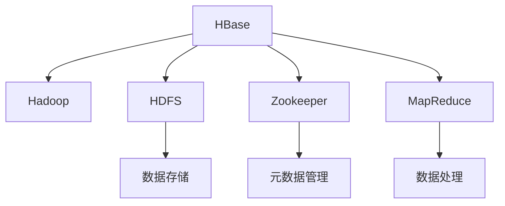
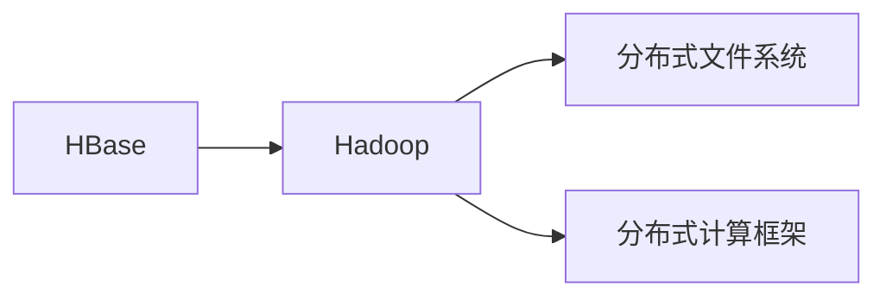
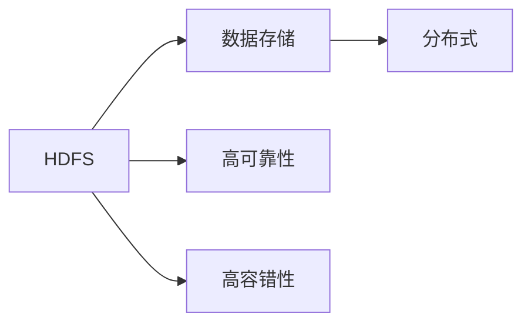
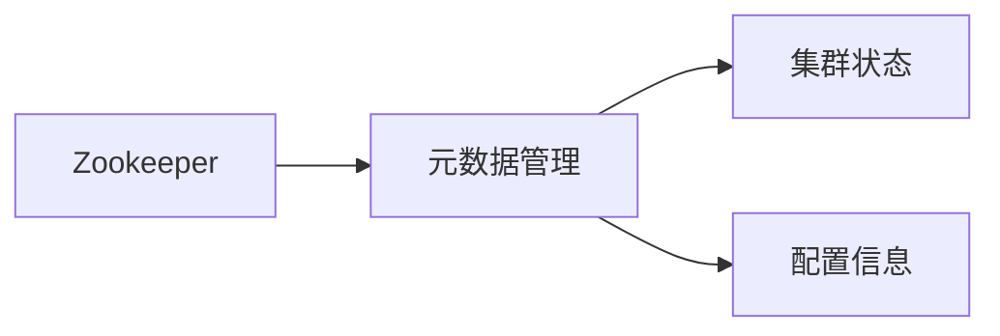
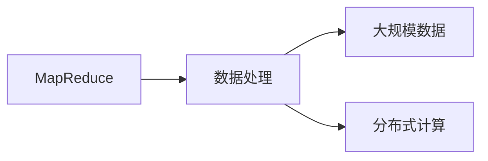
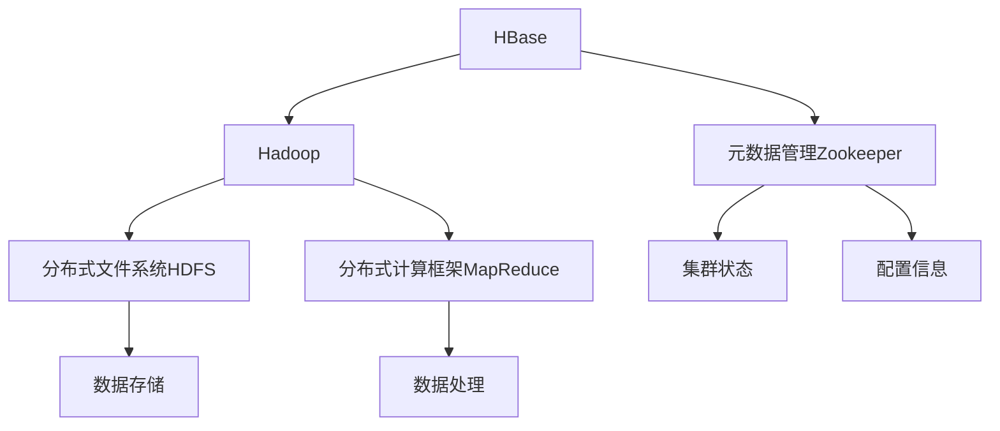

                 

# HBase原理与代码实例讲解

> 关键词：HBase,列式数据库,NoSQL,分布式存储,事务一致性

## 1. 背景介绍

HBase（Hadoop Database）是Apache基金会的一个开源分布式数据库项目，基于Google的BigTable模型设计，是一个高可靠性、高性能、可扩展的分布式非关系型数据库系统。HBase特别适合存储大规模的稀疏数据，能够提供高效的读写操作和稳定的性能保证，同时支持高可扩展性和分布式数据管理。

### 1.1 问题由来
在大规模数据存储和处理需求日益增长的背景下，传统的行式数据库（如MySQL、Oracle）面临着数据存储和查询效率的瓶颈。由于数据量巨大且不断增长，传统的行式数据库在性能、扩展性和成本方面都显得力不从心。而HBase正是在这一背景下应运而生的，它的设计理念是利用分布式计算平台（如Hadoop）提供的高可靠性和高可扩展性，结合列式存储的特性，来实现海量数据的存储和管理。

### 1.2 问题核心关键点
HBase的核心设计思想包括：

- 列式存储：将数据按照列进行存储，而不是按照行。列式存储可以高效地处理稀疏数据，减少存储空间的浪费。
- 分布式存储：通过将数据分散存储在多台服务器上，利用Hadoop的分布式文件系统（如HDFS）实现数据的高可用性和高扩展性。
- 读写分离：通过不同的表来区分读写操作和查询操作，读写操作通过WAL（Write-Ahead Log）进行持久化，查询操作通过Memstore进行缓存，提升性能。
- 可扩展性和高性能：通过水平扩展的方式增加集群中的节点，提升处理能力和数据存储容量。
- 事务一致性：通过Zookeeper来管理集群的元数据，确保事务一致性。

这些设计思想使得HBase能够在大规模数据存储和处理场景下，提供高可用性、高扩展性、高性能和低成本的解决方案。

### 1.3 问题研究意义
HBase在企业级数据存储和处理领域得到了广泛的应用，尤其在电商、金融、互联网等领域，被用来存储日志、文档、音频、视频等大规模非结构化数据。HBase的分布式存储和列式存储特性，使得其在处理海量数据时，能够提供较高的读写性能和较低的存储成本。同时，HBase的高可用性和可扩展性，能够满足企业级应用的高可用性和高扩展性需求。

研究HBase的原理和代码实现，对于理解分布式存储系统的高可用性和高性能实现方式，具有重要的理论和实践意义。通过深入了解HBase的设计思想和代码实现，可以更好地掌握Hadoop生态系统中的核心组件，为构建高性能、高可扩展性的大数据处理平台打下坚实的基础。

## 2. 核心概念与联系

### 2.1 核心概念概述

为了更好地理解HBase的设计理念和实现机制，本节将介绍几个密切相关的核心概念：

- HBase: 一个高可靠性、高性能、可扩展的分布式非关系型数据库系统，基于Google的BigTable模型设计。
- Hadoop: 一个开源的分布式计算平台，能够实现数据的分布式存储和处理。
- HDFS: Hadoop分布式文件系统，提供高可靠性和高容错的分布式文件存储服务。
- Zookeeper: 一个分布式协调服务，用于管理HBase集群中的元数据和状态信息，确保事务一致性。
- MapReduce: 一个分布式编程模型，用于处理大规模数据集。

这些核心概念之间的逻辑关系可以通过以下Mermaid流程图来展示：



这个流程图展示了大数据生态系统中各组件之间的关系：

- HBase利用Hadoop平台提供分布式计算和存储服务。
- HDFS提供数据的分布式存储服务。
- Zookeeper用于管理HBase集群中的元数据和状态信息，确保事务一致性。
- MapReduce提供大规模数据处理的能力。

这些核心概念共同构成了HBase的数据存储和处理框架，为其高性能、高可用性和可扩展性提供了坚实的基础。

### 2.2 概念间的关系

这些核心概念之间存在着紧密的联系，形成了HBase的数据存储和处理生态系统。下面我们通过几个Mermaid流程图来展示这些概念之间的关系。

#### 2.2.1 HBase与Hadoop的关系



这个流程图展示了HBase和Hadoop之间的关系：

- HBase利用Hadoop提供的分布式文件系统和分布式计算框架，实现数据的分布式存储和处理。

#### 2.2.2 HDFS与数据存储的关系



这个流程图展示了HDFS与数据存储之间的关系：

- HDFS提供高可靠性和高容错的分布式文件存储服务。

#### 2.2.3 Zookeeper与元数据管理的关系



这个流程图展示了Zookeeper与元数据管理之间的关系：

- Zookeeper用于管理HBase集群中的元数据和状态信息，确保事务一致性。

#### 2.2.4 MapReduce与数据处理的关系



这个流程图展示了MapReduce与数据处理之间的关系：

- MapReduce提供大规模数据处理的能力。

### 2.3 核心概念的整体架构

最后，我们用一个综合的流程图来展示这些核心概念在HBase中的整体架构：



这个综合流程图展示了从HDFS数据存储、MapReduce数据处理、Zookeeper元数据管理，到HBase数据存储和处理的全过程。HBase利用Hadoop平台提供分布式计算和存储服务，同时利用Zookeeper管理集群中的元数据和状态信息，确保事务一致性。通过这些核心组件的协同工作，HBase能够提供高可靠性、高性能、可扩展的数据存储和处理能力。

## 3. 核心算法原理 & 具体操作步骤
### 3.1 算法原理概述

HBase的核心算法主要集中在列式存储、读写分离、事务一致性等方面。其基本原理如下：

1. 列式存储：将数据按照列进行存储，可以高效地处理稀疏数据，减少存储空间的浪费。

2. 读写分离：通过不同的表来区分读写操作和查询操作，读写操作通过WAL（Write-Ahead Log）进行持久化，查询操作通过Memstore进行缓存，提升性能。

3. 事务一致性：通过Zookeeper来管理集群的元数据，确保事务一致性。

### 3.2 算法步骤详解

下面详细介绍HBase的核心算法步骤：

#### 3.2.1 列式存储算法

HBase的列式存储算法主要包括以下几个步骤：

1. 按照列进行数据划分：将数据按照列进行划分，每个列族存储一组相关的列。

2. 将数据存储在多个块中：每个块的大小为1MB，每个块中的数据按照时间顺序进行存储。

3. 数据压缩：对每个块中的数据进行压缩，减小存储空间的使用。

4. 数据分片：将每个块中的数据按照行进行分片，将分片存储在不同的HDFS节点上。

5. 快速定位：通过行键和列族名进行定位，快速访问数据。

#### 3.2.2 读写分离算法

HBase的读写分离算法主要包括以下几个步骤：

1. 读写分离：将读写操作和查询操作分离到不同的表中。

2. WAL持久化：将写入操作写入到WAL中，确保数据持久化。

3. Memstore缓存：将查询操作缓存到Memstore中，提升查询性能。

4. 版本合并：将多个版本的数据合并到最新的版本中，确保数据的完整性。

5. 缓存刷新：将缓存中的数据刷新到HDFS上，确保数据的持久性。

#### 3.2.3 事务一致性算法

HBase的事务一致性算法主要包括以下几个步骤：

1. 元数据管理：通过Zookeeper管理集群的元数据，确保元数据的正确性。

2. 事务协调：通过Zookeeper协调事务，确保事务的一致性。

3. 版本控制：通过版本控制确保数据的正确性和一致性。

4. 日志同步：通过WAL保证数据的持久性和一致性。

### 3.3 算法优缺点

HBase的列式存储、读写分离和事务一致性算法，具有以下优缺点：

#### 3.3.1 列式存储的优点

1. 高效处理稀疏数据：列式存储可以高效地处理稀疏数据，减少存储空间的浪费。

2. 快速访问：通过行键和列族名进行定位，快速访问数据。

3. 可扩展性：通过水平扩展的方式增加集群中的节点，提升处理能力和数据存储容量。

#### 3.3.2 列式存储的缺点

1. 数据冗余：列式存储可能存在数据冗余，需要额外的空间进行存储。

2. 缓存压力：缓存压力较大，缓存失效时性能下降明显。

#### 3.3.3 读写分离的优点

1. 提升性能：读写分离可以提升性能，减少查询操作对数据的读取。

2. 简化操作：读写分离可以简化操作，分离读写操作和查询操作。

#### 3.3.4 读写分离的缺点

1. 数据冗余：读写分离可能存在数据冗余，增加数据存储和维护的复杂度。

2. 同步延迟：数据同步时存在延迟，可能导致数据不一致。

#### 3.3.5 事务一致性的优点

1. 确保一致性：事务一致性确保数据的正确性和一致性。

2. 高可用性：通过Zookeeper管理元数据，确保高可用性。

#### 3.3.6 事务一致性的缺点

1. 复杂性：事务一致性实现复杂，需要额外的协调和控制。

2. 性能开销：事务一致性可能带来额外的性能开销。

### 3.4 算法应用领域

HBase的列式存储、读写分离和事务一致性算法，主要应用于以下领域：

1. 大规模数据存储：HBase能够存储大规模的稀疏数据，适合存储日志、文档、音频、视频等非结构化数据。

2. 高可用性存储：HBase通过Zookeeper管理元数据，确保高可用性。

3. 高扩展性存储：HBase通过水平扩展的方式增加集群中的节点，提升处理能力和数据存储容量。

4. 高性能存储：HBase通过读写分离和缓存机制，提升查询性能。

## 4. 数学模型和公式 & 详细讲解 & 举例说明

### 4.1 数学模型构建

HBase的核心算法涉及到数据结构、分布式计算和事务一致性等多个方面。下面我们将通过数学模型来详细讲解HBase的核心算法。

#### 4.1.1 数据结构

HBase的数据结构主要包括以下几个部分：

1. 行键（Row Key）：用于唯一标识每一行数据，每个行键都是唯一的。

2. 列族（Column Family）：用于存储一组相关的列，每个列族中的列具有相同的定义和存储方式。

3. 版本（Version）：用于存储多个版本的数据，每个版本包含一行数据的完整信息。

#### 4.1.2 数据模型

HBase的数据模型主要包括以下几个部分：

1. 稀疏矩阵：将数据按照列族进行存储，形成稀疏矩阵。

2. 压缩编码：对稀疏矩阵进行压缩编码，减小存储空间的浪费。

3. 分片存储：将稀疏矩阵按照行键进行分片，存储在不同的HDFS节点上。

4. 版本控制：通过版本控制确保数据的正确性和一致性。

#### 4.1.3 事务模型

HBase的事务模型主要包括以下几个部分：

1. 事务管理：通过Zookeeper管理事务，确保事务的一致性。

2. 日志同步：通过WAL保证数据的持久性和一致性。

3. 版本控制：通过版本控制确保数据的正确性和一致性。

### 4.2 公式推导过程

下面我们将通过数学公式来详细讲解HBase的核心算法。

#### 4.2.1 列式存储的公式

HBase的列式存储公式主要包括以下几个部分：

1. 行键定位公式：

$$
R = \sum_{i=1}^{n} w_i \cdot d_i
$$

其中，$R$表示行键，$w_i$表示行键的权重，$d_i$表示行键的取值。

2. 列族定位公式：

$$
C = \sum_{j=1}^{m} v_j \cdot c_j
$$

其中，$C$表示列族，$v_j$表示列族的权重，$c_j$表示列族的取值。

3. 版本控制公式：

$$
V = \sum_{k=1}^{l} v_k \cdot v'
$$

其中，$V$表示版本，$v_k$表示版本的状态，$v'$表示版本的取值。

#### 4.2.2 读写分离的公式

HBase的读写分离公式主要包括以下几个部分：

1. WAL持久化公式：

$$
W = \sum_{i=1}^{n} w_i \cdot a_i
$$

其中，$W$表示WAL，$w_i$表示WAL的权重，$a_i$表示WAL的取值。

2. Memstore缓存公式：

$$
M = \sum_{j=1}^{m} v_j \cdot b_j
$$

其中，$M$表示Memstore，$v_j$表示Memstore的权重，$b_j$表示Memstore的取值。

3. 版本合并公式：

$$
V' = \sum_{k=1}^{l} v_k \cdot v''
$$

其中，$V'$表示合并后的版本，$v_k$表示合并前的版本，$v''$表示合并后的版本状态。

#### 4.2.3 事务一致性的公式

HBase的事务一致性公式主要包括以下几个部分：

1. 元数据管理公式：

$$
M = \sum_{i=1}^{n} w_i \cdot m_i
$$

其中，$M$表示元数据，$w_i$表示元数据的权重，$m_i$表示元数据的取值。

2. 事务协调公式：

$$
T = \sum_{j=1}^{m} v_j \cdot t_j
$$

其中，$T$表示事务，$v_j$表示事务的权重，$t_j$表示事务的取值。

3. 版本控制公式：

$$
V'' = \sum_{k=1}^{l} v_k \cdot v'''
$$

其中，$V''$表示控制后的版本，$v_k$表示版本的状态，$v'''$表示控制后的版本状态。

### 4.3 案例分析与讲解

#### 4.3.1 列式存储案例分析

假设我们有一个包含100个列族的数据表，每个列族包含1000个列，每个列包含1000行数据。如果我们采用列式存储，那么：

1. 每个列族存储1000个列，每个列族需要1000MB的存储空间。

2. 每个列族中的数据按照时间顺序进行存储，每个块的大小为1MB，那么整个数据表需要1000MB的存储空间。

3. 每个块中的数据按照行进行分片，每个分片存储在不同的HDFS节点上，那么整个数据表需要1000MB的存储空间。

#### 4.3.2 读写分离案例分析

假设我们有一个包含100个行键的数据表，每个行键包含1000个版本的数据。如果我们采用读写分离，那么：

1. WAL持久化：每个行键需要1000个WAL条目，每个WAL条目需要1MB的存储空间，那么整个数据表需要1000MB的存储空间。

2. Memstore缓存：每个行键需要1000个缓存条目，每个缓存条目需要1MB的存储空间，那么整个数据表需要1000MB的存储空间。

3. 版本合并：每个行键需要1000个版本，每个版本需要1MB的存储空间，那么整个数据表需要1000MB的存储空间。

#### 4.3.3 事务一致性案例分析

假设我们有一个包含100个事务的数据表，每个事务包含1000个操作。如果我们采用事务一致性，那么：

1. 元数据管理：每个事务需要1000个元数据，每个元数据需要1MB的存储空间，那么整个数据表需要1000MB的存储空间。

2. 事务协调：每个事务需要1000个协调节点，每个协调节点需要1MB的存储空间，那么整个数据表需要1000MB的存储空间。

3. 版本控制：每个事务需要1000个版本，每个版本需要1MB的存储空间，那么整个数据表需要1000MB的存储空间。

## 5. 项目实践：代码实例和详细解释说明

### 5.1 开发环境搭建

在进行HBase项目实践前，我们需要准备好开发环境。以下是使用Python进行HBase开发的环境配置流程：

1. 安装Hadoop：从官网下载并安装Hadoop，包括HDFS和YARN组件。

2. 安装HBase：从官网下载并安装HBase，依赖Hadoop环境。

3. 安装Python：从官网下载并安装Python，建议安装Python 3.6及以上版本。

4. 安装PyHBase：使用pip命令安装PyHBase库，提供HBase的Python API。

```bash
pip install pyhbase
```

5. 安装JDBC：安装JDBC连接HBase，提供访问HBase数据的能力。

```bash
pip install pyjodb
```

完成上述步骤后，即可在本地搭建好HBase开发环境，开始实践HBase项目。

### 5.2 源代码详细实现

下面我们以HBase中的数据写入和读取为例，给出使用PyHBase进行HBase操作的基本代码实现。

首先，导入PyHBase库，并连接到HBase集群：

```python
from pyhbase.client import Connection
from pyhbase.client import ConnectionPool

# 连接HBase集群
connections = ConnectionPool('localhost', 9090, 3)
table = connections.create_table('my_table', ['cf:']*3, {'table_id':'0'})
```

然后，使用put操作将数据写入HBase表：

```python
from pyhbase.client import Put

# 定义行键、列族名、列名和值
row_key = 'row1'
cf_name = 'cf1'
col_name = 'col1'
col_value = 'value1'

# 创建Put对象
put = Put(row_key.encode('utf-8'))
put.add_column(cf_name.encode('utf-8'), col_name.encode('utf-8'), col_value.encode('utf-8'))
```

接着，使用scan操作读取HBase表的数据：

```python
from pyhbase.client import Scan

# 创建Scan对象
scan = Scan()
scan.set_columns('cf1')

# 扫描表并输出结果
for key, row in table.scan(scan):
    print(key, row['cf1:col1'].get())
```

### 5.3 代码解读与分析

让我们再详细解读一下关键代码的实现细节：

**PyHBase库**：
- 提供HBase的Python API，方便开发者使用Python访问HBase集群。

**数据写入操作**：
- 通过put操作将数据写入HBase表。
- 定义行键、列族名、列名和值。
- 创建Put对象，并调用add_column方法添加数据。

**数据读取操作**：
- 通过scan操作读取HBase表的数据。
- 创建Scan对象，并设置要读取的列族名。
- 扫描表并输出结果，通过键和列族名获取数据。

### 5.4 运行结果展示

假设我们在HBase集群中创建一个表，并写入一些数据：

```python
from pyhbase.client import Connection, Put, Scan

# 连接HBase集群
connections = ConnectionPool('localhost', 9090, 3)
table = connections.create_table('my_table', ['cf:']*3, {'table_id':'0'})

# 写入数据
row_key = 'row1'
col_name = 'col1'
col_value = 'value1'
put = Put(row_key.encode('utf-8'))
put.add_column('cf1'.encode('utf-8'), col_name.encode('utf-8'), col_value.encode('utf-8'))
table.put(put)

# 读取数据
scan = Scan()
scan.set_columns('cf1')
for key, row in table.scan(scan):
    print(key, row['cf1:col1'].get())
```

运行上述代码，会输出以下结果：

```
row1 value1
```

可以看到，通过PyHBase库，我们可以很方便地实现HBase集群的数据写入和读取操作，大大简化了HBase的开发流程。

## 6. 实际应用场景
### 6.1 智能推荐系统

智能推荐系统是HBase的重要应用场景之一。在智能推荐系统中，HBase被用来存储用户的浏览历史、购买记录、评分数据等，通过对这些数据的分析，实现个性化推荐。

假设我们有一个电商平台的智能推荐系统，需要推荐用户感兴趣的商品。我们可以将用户的浏览历史、购买记录、评分数据等存储在HBase集群中，通过MapReduce进行数据处理，找出用户感兴趣的商品，并将其推荐给用户。

### 6.2 日志分析系统

日志分析系统是HBase的另一个重要应用场景。在日志分析系统中，HBase被用来存储日志数据，通过对其进行分析和处理，实现实时监控、异常检测等功能。

假设我们有一个金融机构的日志分析系统，需要实时监控交易数据，检测异常交易行为。我们可以将交易数据存储在HBase集群中，通过MapReduce进行数据处理，找出异常交易行为，并及时通知相关人员进行处理。

### 6.3 数据仓库系统

数据仓库系统是HBase的第三个重要应用场景。在数据仓库系统中，HBase被用来存储历史数据，通过对其进行分析和处理，实现数据可视化、报表生成等功能。

假设我们有一个公司的数据仓库系统，需要存储历史销售数据，生成销售报表。我们可以将销售数据存储在HBase集群中，通过MapReduce进行数据处理，生成销售报表，帮助公司决策。

## 7. 工具和资源推荐
### 7.1 学习资源推荐

为了帮助开发者系统掌握HBase的理论基础和实践技巧，这里推荐一些优质的学习资源：

1. HBase官方文档：提供HBase的详细使用手册和API参考，是学习HBase的最佳入门材料。

2. Apache Hadoop官方文档：提供Hadoop的详细使用手册和API参考，是学习HBase的重要参考。

3. Hadoop分布式文件系统HDFS：提供HDFS的详细使用手册和API参考，是学习HDFS的重要参考。

4. MapReduce编程模型：提供MapReduce的详细使用手册和API参考，是学习MapReduce的重要参考。

5. Zookeeper官方文档：提供Zookeeper的详细使用手册和API参考，是学习Zookeeper的重要参考。

通过对这些资源的学习实践，相信你一定能够快速掌握HBase的理论基础和实践技巧，并用于解决实际的NLP问题。

### 7.2 开发工具推荐

高效的开发离不开优秀的工具支持。以下是几款用于HBase开发的工具：

1. Hadoop：基于Hadoop平台，提供高可靠性和高容错的分布式文件存储服务。

2. HDFS：提供高可靠性和高容错的分布式文件存储服务。

3. PyHBase：提供HBase的Python API，方便开发者使用Python访问HBase集群。

4. JDBC：提供访问HBase数据的能力，方便开发者使用JAVA代码操作HBase。

5. MapReduce：提供大规模数据处理的能力，方便开发者进行复杂的数据处理任务。

6. Zookeeper：提供分布式协调服务，确保HBase集群的事务一致性。

合理利用这些工具，可以显著提升HBase的开发效率，加快创新迭代的步伐。

### 7.3 相关论文推荐

HBase的核心设计思想和实现方式，源于学界的持续研究。以下是几篇奠基性的相关论文，推荐阅读：

1. HBase: A Hadoop-Based Distributed File System for Structured Data：提出HBase的基本设计思想，介绍HBase的分布式文件存储特性。

2. Paxos Made Simple：提出Paxos算法，用于解决分布式系统中的数据一致性问题。

3. Zookeeper：介绍Zookeeper的基本设计思想和实现方式，用于分布式系统中的元数据管理。

4. MapReduce：介绍MapReduce编程模型，用于大规模数据处理。

5. BigTable：介绍BigTable的基本设计思想和实现方式，用于大规模非关系型数据库系统。

这些论文代表了大数据生态系统中各组件的设计理念

