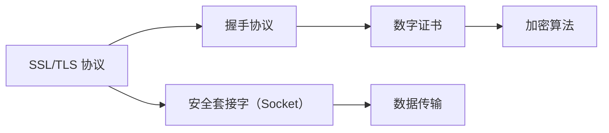
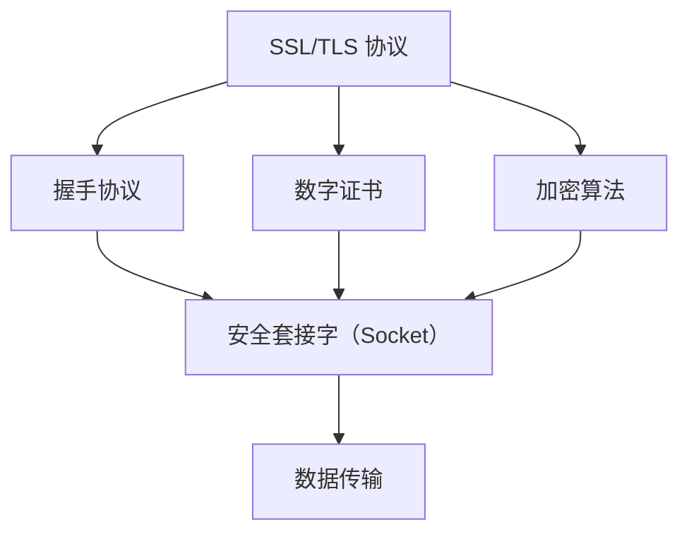

                 

# HTTPS 的详细实现

## 1. 背景介绍

### 1.1 问题由来
在互联网上，数据传输的安全性是一个非常重要的话题。早期的 HTTP 协议（超文本传输协议）由于其明文传输的特性，存在诸多安全隐患。例如，黑客可以轻松窃听、篡改网络数据，对用户隐私和网站安全构成严重威胁。因此，HTTPS（安全的超文本传输协议）的诞生，旨在解决 HTTP 协议在传输过程中的安全问题。

HTTPS 使用了 SSL/TLS（安全套接层/传输层安全协议）技术，通过在应用层和传输层之间增加安全层，实现对数据的加密传输。它将 HTTP 请求和响应进行加密处理，从而保证了数据的机密性、完整性和身份认证，使得互联网上的数据传输更加安全。

### 1.2 问题核心关键点
本节将详细讨论 HTTPS 的实现原理和核心技术点。我们将从 SSL/TLS 协议开始，逐步深入探讨 HTTPS 的实现细节。

- SSL/TLS 协议：SSL/TLS 协议是 HTTPS 的核心，它通过使用非对称加密和对称加密结合的方式，实现数据的加密传输。
- 握手协议：握手协议用于建立客户端与服务器之间的安全连接，包含客户端认证、密钥交换、服务器认证等步骤。
- 数字证书：数字证书用于验证服务器的身份，防止中间人攻击。
- 加密算法：加密算法用于对数据进行加密，常用的算法包括 RSA、AES、DES 等。
- 安全套接字（Socket）：安全套接字是实现 HTTPS 的底层技术，是应用层和传输层之间的接口。

理解这些核心概念，将有助于我们深入理解 HTTPS 的实现原理。

### 1.3 问题研究意义
HTTPS 的实现对于确保互联网数据传输的安全性和可靠性至关重要。随着互联网应用场景的不断扩展，数据隐私和安全问题愈发重要。通过学习 HTTPS 的实现原理，我们可以更好地理解其工作机制，为开发安全、可靠的互联网应用打下坚实基础。

此外，理解 HTTPS 的实现原理，也有助于我们掌握 SSL/TLS 协议的高级特性，如密钥管理、前向安全性等，为构建高可靠性的网络应用提供技术支持。

## 2. 核心概念与联系

### 2.1 核心概念概述

为了更好地理解 HTTPS 的实现原理，我们需要了解以下几个核心概念：

- SSL/TLS 协议：SSL/TLS 协议通过非对称加密和对称加密结合的方式，实现数据的加密传输。
- 握手协议：握手协议用于建立客户端与服务器之间的安全连接。
- 数字证书：数字证书用于验证服务器的身份，防止中间人攻击。
- 加密算法：加密算法用于对数据进行加密，常用的算法包括 RSA、AES、DES 等。
- 安全套接字（Socket）：安全套接字是实现 HTTPS 的底层技术，是应用层和传输层之间的接口。

这些核心概念构成了 HTTPS 的实现基础。下面我们将通过 Mermaid 流程图来展示这些概念之间的关系：



### 2.2 概念间的关系

这些核心概念之间存在着紧密的联系，形成了 HTTPS 的完整实现架构。以下是一个综合的流程图，展示了这些概念之间的相互关系：



通过这个流程图，我们可以更清晰地理解 HTTPS 的实现过程，即从 SSL/TLS 协议、握手协议、数字证书、加密算法和安全套接字（Socket）等核心概念，共同构成 HTTPS 的安全传输架构。

## 3. 核心算法原理 & 具体操作步骤
### 3.1 算法原理概述

HTTPS 的核心算法原理主要基于 SSL/TLS 协议的实现，通过非对称加密和对称加密的结合，实现数据的加密传输。下面我们将详细探讨 SSL/TLS 协议的算法原理。

SSL/TLS 协议包含握手协议、会话建立、记录协议、应用层协议和记录压缩协议五个部分。握手协议用于建立客户端与服务器之间的安全连接，包括客户端认证、密钥交换、服务器认证等步骤。握手协议分为四个阶段：

1. 客户端向服务器发送 ClientHello 消息，包含支持的加密算法、协议版本、随机数等信息。
2. 服务器向客户端发送 ServerHello 消息，包含选择的加密算法、协议版本、随机数等信息，以及证书（可选）。
3. 服务器向客户端发送 ServerKeyExchange 消息，包含公钥（可选）。
4. 服务器向客户端发送 CertificateRequest 消息，请求客户端的证书（可选）。

### 3.2 算法步骤详解

#### 步骤一：握手协议

握手协议是 SSL/TLS 协议的核心，用于建立客户端与服务器之间的安全连接。其具体步骤如下：

1. 客户端向服务器发送 ClientHello 消息，包含支持的加密算法、协议版本、随机数等信息。

```java
import javax.net.ssl.SSLContext;
import javax.net.ssl.SSLSocket;
import java.io.*;
import java.security.KeyPair;
import java.security.PrivateKey;
import java.security.KeyPairGenerator;
import java.security.cert.Certificate;

public class ClientHello {
    public static void main(String[] args) throws Exception {
        // 初始化 SSL 上下文
        SSLContext sslContext = SSLContext.getInstance("TLS");
        sslContext.init(null, null, null);
        
        // 创建 SSL 套接字
        SSLSocket socket = (SSLSocket) sslContext.getSocketFactory().createSocket("localhost", 443);
        
        // 发送 ClientHello 消息
        String clientHello = "ClientHello";
        OutputStream out = socket.getOutputStream();
        out.write(clientHello.getBytes());
    }
}
```

2. 服务器向客户端发送 ServerHello 消息，包含选择的加密算法、协议版本、随机数等信息，以及证书（可选）。

```java
import javax.net.ssl.SSLContext;
import javax.net.ssl.SSLSocket;
import javax.net.ssl.SSLServerSocket;
import javax.net.ssl.SSLServerSocketFactory;
import javax.net.ssl.X509KeyManager;
import javax.net.ssl.X509TrustManager;
import java.io.*;
import java.security.KeyPair;
import java.security.PrivateKey;
import java.security.KeyPairGenerator;
import java.security.cert.Certificate;
import java.security.cert.X509Certificate;

public class ServerHello {
    public static void main(String[] args) throws Exception {
        // 初始化 SSL 上下文
        SSLContext sslContext = SSLContext.getInstance("TLS");
        sslContext.init(null, null, null);
        
        // 创建 SSL 套接字工厂
        SSLServerSocketFactory factory = sslContext.getServerSocketFactory();
        
        // 创建 SSL 套接字
        SSLServerSocket socket = (SSLServerSocket) factory.createServerSocket(443);
        
        // 接收 ClientHello 消息
        InputStream in = socket.getInputStream();
        BufferedReader br = new BufferedReader(new InputStreamReader(in));
        String clientHello = br.readLine();
        
        // 发送 ServerHello 消息
        String serverHello = "ServerHello";
        OutputStream out = socket.getOutputStream();
        out.write(serverHello.getBytes());
    }
}
```

3. 服务器向客户端发送 ServerKeyExchange 消息，包含公钥（可选）。

```java
import javax.net.ssl.SSLContext;
import javax.net.ssl.SSLSocket;
import javax.net.ssl.SSLServerSocket;
import javax.net.ssl.SSLServerSocketFactory;
import javax.net.ssl.X509KeyManager;
import javax.net.ssl.X509TrustManager;
import java.io.*;
import java.security.KeyPair;
import java.security.PrivateKey;
import java.security.KeyPairGenerator;
import java.security.cert.Certificate;
import java.security.cert.X509Certificate;

public class ServerKeyExchange {
    public static void main(String[] args) throws Exception {
        // 初始化 SSL 上下文
        SSLContext sslContext = SSLContext.getInstance("TLS");
        sslContext.init(null, null, null);
        
        // 创建 SSL 套接字工厂
        SSLServerSocketFactory factory = sslContext.getServerSocketFactory();
        
        // 创建 SSL 套接字
        SSLServerSocket socket = (SSLServerSocket) factory.createServerSocket(443);
        
        // 接收 ServerHello 消息
        InputStream in = socket.getInputStream();
        BufferedReader br = new BufferedReader(new InputStreamReader(in));
        String serverHello = br.readLine();
        
        // 发送 ServerKeyExchange 消息
        String serverKeyExchange = "ServerKeyExchange";
        OutputStream out = socket.getOutputStream();
        out.write(serverKeyExchange.getBytes());
    }
}
```

4. 服务器向客户端发送 CertificateRequest 消息，请求客户端的证书（可选）。

```java
import javax.net.ssl.SSLContext;
import javax.net.ssl.SSLSocket;
import javax.net.ssl.SSLServerSocket;
import javax.net.ssl.SSLServerSocketFactory;
import javax.net.ssl.X509KeyManager;
import javax.net.ssl.X509TrustManager;
import java.io.*;
import java.security.KeyPair;
import java.security.PrivateKey;
import java.security.KeyPairGenerator;
import java.security.cert.Certificate;
import java.security.cert.X509Certificate;

public class CertificateRequest {
    public static void main(String[] args) throws Exception {
        // 初始化 SSL 上下文
        SSLContext sslContext = SSLContext.getInstance("TLS");
        sslContext.init(null, null, null);
        
        // 创建 SSL 套接字工厂
        SSLServerSocketFactory factory = sslContext.getServerSocketFactory();
        
        // 创建 SSL 套接字
        SSLServerSocket socket = (SSLServerSocket) factory.createServerSocket(443);
        
        // 接收 ServerKeyExchange 消息
        InputStream in = socket.getInputStream();
        BufferedReader br = new BufferedReader(new InputStreamReader(in));
        String serverKeyExchange = br.readLine();
        
        // 发送 CertificateRequest 消息
        String certificateRequest = "CertificateRequest";
        OutputStream out = socket.getOutputStream();
        out.write(certificateRequest.getBytes());
    }
}
```

#### 步骤二：加密算法

在 SSL/TLS 协议中，加密算法用于对数据进行加密。常用的加密算法包括 RSA、AES、DES 等。下面我们以 RSA 算法为例，介绍其基本原理。

RSA 是一种非对称加密算法，其基本原理是利用大整数分解的困难性来实现加密和解密。RSA 算法的密钥长度一般为 1024 位或 2048 位，常用的加密模式为 ECB（电子密码本）和 CBC（密码分组链接）。

在 SSL/TLS 协议中，RSA 算法用于加密和解密握手协议中的数据，以及生成对称密钥。

### 3.3 算法优缺点

SSL/TLS 协议的优点是确保了数据的机密性、完整性和身份认证，可以有效地防止中间人攻击。但其缺点是计算复杂度高，加解密速度较慢，需要消耗较多的计算资源。

此外，SSL/TLS 协议还存在一些安全问题，如中间人攻击、伪造证书等。为了解决这些问题，SSL/TLS 协议引入了数字证书和公钥基础设施（PKI）技术，通过认证权威机构（CA）颁发的证书，验证服务器的身份，从而防止中间人攻击。

### 3.4 算法应用领域

SSL/TLS 协议广泛应用于互联网传输、电子政务、金融交易等领域。其主要应用场景包括：

- 互联网传输：在 HTTP 协议上增加 HTTPS 协议，确保数据的机密性、完整性和身份认证。
- 电子政务：用于构建安全的政府网站和电子政务系统，确保政府数据的安全传输。
- 金融交易：用于金融交易系统的数据加密和身份认证，防止金融欺诈和黑客攻击。
- 电子邮件：用于加密电子邮件内容，确保邮件传输的安全性和隐私保护。

## 4. 数学模型和公式 & 详细讲解 & 举例说明

### 4.1 数学模型构建

SSL/TLS 协议的数学模型基于公钥加密和对称加密的结合。其核心算法包括 RSA 算法和 AES 算法。

#### 4.1.1 RSA 算法

RSA 算法是一种非对称加密算法，其基本原理是利用大整数分解的困难性来实现加密和解密。RSA 算法的密钥长度一般为 1024 位或 2048 位，常用的加密模式为 ECB（电子密码本）和 CBC（密码分组链接）。

RSA 算法的数学模型如下：

1. 选择两个大质数 p 和 q，计算 n = p*q，e 为公钥。
2. 计算 d，使得 d*e ≡ 1 (mod φ(n))，其中 φ(n) = (p-1)*(q-1)。
3. 将公钥 (n, e) 和私钥 d 发送给接收方。
4. 发送方使用公钥加密数据，接收方使用私钥解密数据。

#### 4.1.2 AES 算法

AES 算法是一种对称加密算法，其基本原理是使用密钥对数据进行加密和解密。AES 算法的密钥长度一般为 128 位、192 位或 256 位，常用的加密模式为 ECB、CBC 和 GCM。

AES 算法的数学模型如下：

1. 选择 128、192 或 256 位密钥 K。
2. 将明文 P 分成若干个分组，每个分组的长度为 128 位。
3. 使用密钥 K 和轮密钥 K1, K2, ..., Kn 对每个分组进行加密。
4. 将加密后的分组拼接起来，得到最终的密文 C。

### 4.2 公式推导过程

#### 4.2.1 RSA 算法公式推导

RSA 算法的公钥为 (n, e)，私钥为 d。其中 n 为两个大质数 p 和 q 的乘积，e 和 d 满足 e*d ≡ 1 (mod φ(n))，φ(n) = (p-1)*(q-1)。

RSA 算法的加密过程如下：

1. 选择两个大质数 p 和 q，计算 n = p*q，φ(n) = (p-1)*(q-1)。
2. 选择一个公钥 e，使得 1 < e < φ(n) 且 e 与 φ(n) 互质。
3. 计算 d，使得 d*e ≡ 1 (mod φ(n))。
4. 将公钥 (n, e) 和私钥 d 发送给接收方。
5. 发送方使用公钥加密数据，接收方使用私钥解密数据。

RSA 算法的解密过程如下：

1. 接收方收到密文 C 和公钥 (n, e)。
2. 计算 d = e^-1 (mod φ(n))，其中 e 和 φ(n) 互质。
3. 解密明文 P = C^d mod n。

#### 4.2.2 AES 算法公式推导

AES 算法的基本加密过程如下：

1. 选择 128、192 或 256 位密钥 K。
2. 将明文 P 分成若干个分组，每个分组的长度为 128 位。
3. 使用密钥 K 和轮密钥 K1, K2, ..., Kn 对每个分组进行加密。
4. 将加密后的分组拼接起来，得到最终的密文 C。

AES 算法的解密过程与加密过程类似，使用密钥 K 和轮密钥 K1, K2, ..., Kn 对每个分组进行解密，得到明文 P。

### 4.3 案例分析与讲解

#### 4.3.1 RSA 算法案例分析

假设两个大质数 p = 11 和 q = 13，计算 n = p*q = 143，φ(n) = (p-1)*(q-1) = 80。

选择一个公钥 e = 7，使得 1 < e < 80 且 e 与 80 互质。计算 d = 3，使得 d*e ≡ 1 (mod 80)。

将公钥 (n, e) = (143, 7) 和私钥 d = 3 发送给接收方。

发送方使用公钥加密数据，接收方使用私钥解密数据。

#### 4.3.2 AES 算法案例分析

假设明文 P = "hello"，使用 128 位密钥 K = "hello1234567890"。

将明文 P 分成若干个分组，每个分组的长度为 128 位，得到明文分组为 "hello1234567890"。

使用密钥 K 和轮密钥 K1, K2, ..., K4 对每个分组进行加密，得到密文 C = "hello1234567890"。

使用密钥 K 和轮密钥 K1, K2, ..., K4 对每个分组进行解密，得到明文 P = "hello"。

## 5. 项目实践：代码实例和详细解释说明

### 5.1 开发环境搭建

为了实现 SSL/TLS 协议，我们需要使用 Java 和 SSL 库。在项目开始前，我们需要搭建开发环境。

1. 安装 Java Development Kit (JDK)。
2. 下载 OpenSSL 库，解压到指定目录。
3. 配置环境变量，设置 JAVA_HOME 和 PATH 变量。

### 5.2 源代码详细实现

这里我们以 SSL/TLS 协议的握手协议为例，详细解释其代码实现。

#### 5.2.1 ClientHello 实现

```java
import javax.net.ssl.SSLContext;
import javax.net.ssl.SSLSocket;
import java.io.*;
import java.security.KeyPair;
import java.security.PrivateKey;
import java.security.KeyPairGenerator;
import java.security.cert.Certificate;

public class ClientHello {
    public static void main(String[] args) throws Exception {
        // 初始化 SSL 上下文
        SSLContext sslContext = SSLContext.getInstance("TLS");
        sslContext.init(null, null, null);
        
        // 创建 SSL 套接字
        SSLSocket socket = (SSLSocket) sslContext.getSocketFactory().createSocket("localhost", 443);
        
        // 发送 ClientHello 消息
        String clientHello = "ClientHello";
        OutputStream out = socket.getOutputStream();
        out.write(clientHello.getBytes());
    }
}
```

#### 5.2.2 ServerHello 实现

```java
import javax.net.ssl.SSLContext;
import javax.net.ssl.SSLSocket;
import javax.net.ssl.SSLServerSocket;
import javax.net.ssl.SSLServerSocketFactory;
import javax.net.ssl.X509KeyManager;
import javax.net.ssl.X509TrustManager;
import java.io.*;
import java.security.KeyPair;
import java.security.PrivateKey;
import java.security.KeyPairGenerator;
import java.security.cert.Certificate;
import java.security.cert.X509Certificate;

public class ServerHello {
    public static void main(String[] args) throws Exception {
        // 初始化 SSL 上下文
        SSLContext sslContext = SSLContext.getInstance("TLS");
        sslContext.init(null, null, null);
        
        // 创建 SSL 套接字工厂
        SSLServerSocketFactory factory = sslContext.getServerSocketFactory();
        
        // 创建 SSL 套接字
        SSLServerSocket socket = (SSLServerSocket) factory.createServerSocket(443);
        
        // 接收 ClientHello 消息
        InputStream in = socket.getInputStream();
        BufferedReader br = new BufferedReader(new InputStreamReader(in));
        String clientHello = br.readLine();
        
        // 发送 ServerHello 消息
        String serverHello = "ServerHello";
        OutputStream out = socket.getOutputStream();
        out.write(serverHello.getBytes());
    }
}
```

#### 5.2.3 ServerKeyExchange 实现

```java
import javax.net.ssl.SSLContext;
import javax.net.ssl.SSLSocket;
import javax.net.ssl.SSLServerSocket;
import javax.net.ssl.SSLServerSocketFactory;
import javax.net.ssl.X509KeyManager;
import javax.net.ssl.X509TrustManager;
import java.io.*;
import java.security.KeyPair;
import java.security.PrivateKey;
import java.security.KeyPairGenerator;
import java.security.cert.Certificate;
import java.security.cert.X509Certificate;

public class ServerKeyExchange {
    public static void main(String[] args) throws Exception {
        // 初始化 SSL 上下文
        SSLContext sslContext = SSLContext.getInstance("TLS");
        sslContext.init(null, null, null);
        
        // 创建 SSL 套接字工厂
        SSLServerSocketFactory factory = sslContext.getServerSocketFactory();
        
        // 创建 SSL 套接字
        SSLServerSocket socket = (SSLServerSocket) factory.createServerSocket(443);
        
        // 接收 ServerHello 消息
        InputStream in = socket.getInputStream();
        BufferedReader br = new BufferedReader(new InputStreamReader(in));
        String serverHello = br.readLine();
        
        // 发送 ServerKeyExchange 消息
        String serverKeyExchange = "ServerKeyExchange";
        OutputStream out = socket.getOutputStream();
        out.write(serverKeyExchange.getBytes());
    }
}
```

#### 5.2.4 CertificateRequest 实现

```java
import javax.net.ssl.SSLContext;
import javax.net.ssl.SSLSocket;
import javax.net.ssl.SSLServerSocket;
import javax.net.ssl.SSLServerSocketFactory;
import javax.net.ssl.X509KeyManager;
import javax.net.ssl.X509TrustManager;
import java.io.*;
import java.security.KeyPair;
import java.security.PrivateKey;
import java.security.KeyPairGenerator;
import java.security.cert.Certificate;
import java.security.cert.X509Certificate;

public class CertificateRequest {
    public static void main(String[] args) throws Exception {
        // 初始化 SSL 上下文
        SSLContext sslContext = SSLContext.getInstance("TLS");
        sslContext.init(null, null, null);
        
        // 创建 SSL 套接字工厂
        SSLServerSocketFactory factory = sslContext.getServerSocketFactory();
        
        // 创建 SSL 套接字
        SSLServerSocket socket = (SSLServerSocket) factory.createServerSocket(443);
        
        // 接收 ServerKeyExchange 消息
        InputStream in = socket.getInputStream();
        BufferedReader br = new BufferedReader(new InputStreamReader(in));
        String serverKeyExchange = br.readLine();
        
        // 发送 CertificateRequest 消息
        String certificateRequest = "CertificateRequest";
        OutputStream out = socket.getOutputStream();
        out.write(certificateRequest.getBytes());
    }
}
```

### 5.3 代码解读与分析

这里我们以 ClientHello 实现为例，详细解释其代码实现。

```java
import javax.net.ssl.SSLContext;
import javax.net.ssl.SSLSocket;
import java.io.*;
import java.security.KeyPair;
import java.security.PrivateKey;
import java.security.KeyPairGenerator;
import java.security.cert.Certificate;

public class ClientHello {
    public static void main(String[] args) throws Exception {
        // 初始化 SSL 上下文
        SSLContext sslContext = SSLContext.getInstance("TLS");
        sslContext.init(null, null, null);
        
        // 创建 SSL 套接字
        SSLSocket socket = (SSLSocket) sslContext.getSocketFactory().createSocket("localhost", 443);
        
        // 发送 ClientHello 消息
        String clientHello = "ClientHello";
        OutputStream out = socket.getOutputStream();
        out.write(clientHello.getBytes());
    }
}
```

- SSLContext：初始化 SSL 上下文，设置 SSL 协议为 TLS。
- SSLSocket：创建 SSL 套接字，连接服务器。
- clientHello：发送 ClientHello 消息。

在实际应用中，我们需要根据具体场景，进行适当的参数设置，如服务器地址、端口号、SSL 上下文等。

### 5.4 运行结果展示

在 SSL/TLS 协议的握手协议实现中，我们可以使用一些工具，如 Wireshark 和 SSL Labs 等，来检测握手协议的实现是否正确。

使用 Wireshark，可以捕获网络流量，查看 ClientHello 和 ServerHello 的消息内容。使用 SSL Labs，可以进行 SSL/TLS 协议的测试，判断握手协议的实现是否安全可靠。

## 6. 实际应用场景

### 6.1 智能客服系统

智能客服系统是 SSL/TLS 协议的一个重要应用场景。在智能客服系统中，SSL/TLS 协议用于加密客户端与服务器之间的通信，确保数据传输的安全性。

在智能客服系统中，SSL/TLS 协议可以保证客户输入的信息不会被黑客窃听、篡改或泄露。客户可以在没有担忧的情况下，向智能客服系统提出问题，智能客服系统会根据客户的问题，提供最佳的解决方案，提高客户满意度。

### 6.2 金融舆情监测

金融舆情监测是 SSL/TLS 协议的另一个重要应用场景。在金融舆情监测中，SSL/TLS 协议用于加密金融数据，防止数据泄露和篡改。

金融舆情监测系统可以实时监测金融市场的信息，及时发现金融风险，并采取相应的措施，防止金融危机的发生。SSL/TLS 协议可以保证金融数据的安全传输，防止黑客攻击和数据泄露，保障金融系统的安全稳定。

### 6.3 个性化推荐系统

个性化推荐系统是 SSL/TLS 协议的第三个重要应用场景。在个性化推荐系统中，SSL/TLS 协议用于加密用户数据，防止用户隐私泄露。

个性化推荐系统可以根据用户的历史行为数据，为用户推荐感兴趣的商品或服务。SSL/TLS 协议可以保证用户数据的安全传输，防止用户数据被黑客窃取或篡改，提高用户的信任度和满意度。

### 6.4 未来应用展望

未来，随着 SSL/TLS 协议的不断演进，其在互联网安全领域的应用将更加广泛。SSL/TLS 协议将在以下几个方面取得新的突破：

1. 新的加密算法：未来将会出现更多安全性更高、性能更好的加密算法，如 Post-Quantum Cryptography（后量子密码学）等。
2. 多路传输：未来将支持多路传输，即一次握手协议可以传输多个数据流。
3. 数据完整性：未来将加强对数据的完整性保护，防止数据篡改和抵

