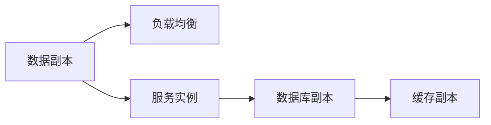
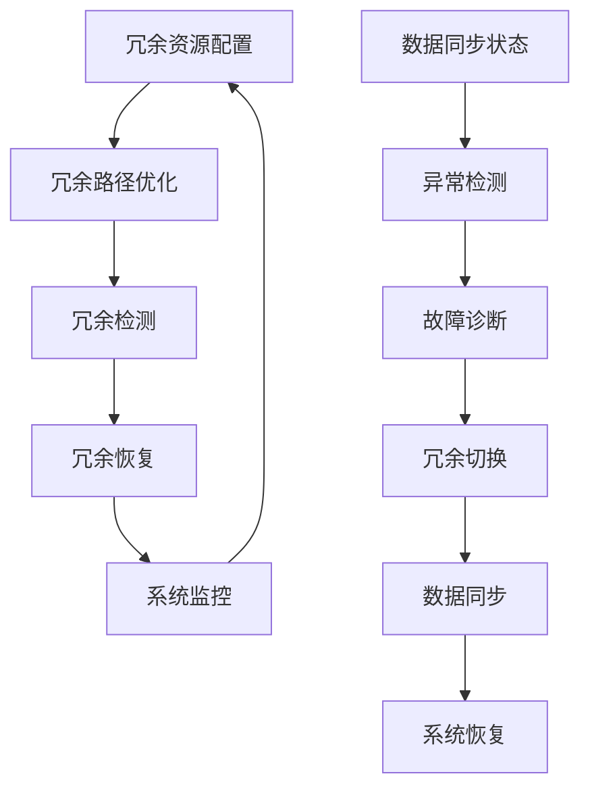

                 

## 1. 背景介绍

### 1.1 问题由来
在当前的软件开发环境中，冗余设计（Redundancy Design）成为了一个重要而复杂的任务。尤其是在分布式系统、高可用性和容错设计等领域，冗余设计是保障系统稳定性和可扩展性的关键。然而，冗余设计并非易事，其设计和维护成本较高，容易带来复杂的系统结构和潜在的性能瓶颈。

冗余设计旨在通过复制和分散系统资源，保证在单个组件或节点出现故障时，系统仍能保持正常运行。冗余设计的关键在于如何合理配置冗余资源，优化冗余路径，避免冗余导致额外开销和性能损耗。

### 1.2 问题核心关键点
冗余设计的基本问题包括以下几个方面：
- **冗余资源的配置**：决定何时以及如何复制数据或功能。
- **冗余路径的优化**：确保数据在不同冗余路径之间同步和一致性。
- **冗余系统的监控与维护**：实时检测和修复冗余系统的故障和异常。
- **冗余设计的性能优化**：在保证系统可靠性的同时，尽量减少冗余带来的额外开销。

### 1.3 问题研究意义
冗余设计是构建高可用、高扩展、高性能分布式系统的关键。通过合理配置和优化冗余资源，可以大大提升系统的容错能力、可靠性和弹性。冗余设计的研究和应用对于云计算、大数据、物联网、移动通信等领域具有重要意义。

1. **保障系统稳定性**：冗余设计可以避免单点故障，提升系统的稳定性和可用性。
2. **增强系统可扩展性**：合理冗余设计可以动态调整系统资源，支持大规模数据的处理和存储。
3. **优化系统性能**：冗余设计通过负载均衡和故障转移，减少性能瓶颈，提高系统吞吐量。
4. **推动技术创新**：冗余设计的优化和改进，可以引领分布式系统架构的新趋势，促进技术革新。
5. **赋能产业升级**：冗余设计的应用，可以加速企业数字化转型，提升市场竞争力。

## 2. 核心概念与联系

### 2.1 核心概念概述
冗余设计涉及到多个核心概念，包括冗余资源、冗余路径、冗余检测和冗余恢复等。

- **冗余资源**：指在系统中复制或分布的数据或功能，如数据副本、服务实例等。
- **冗余路径**：指数据在不同冗余资源之间的同步和传输路径，如多数据中心之间的网络链路。
- **冗余检测**：指实时监控冗余系统，检测故障和异常，及时触发冗余恢复机制。
- **冗余恢复**：指在系统发生故障时，通过冗余资源和路径的切换，恢复系统正常运行。

这些概念之间相互作用，共同构成了一个复杂的冗余设计系统。以下是一个简化的Mermaid流程图，展示了冗余设计的基本流程：


### 2.2 概念间的关系

冗余设计中的各核心概念关系紧密，形成了一个动态的冗余系统。以下是几个关键的Mermaid流程图，展示了冗余设计的基本框架和流程：

#### 2.2.1 冗余资源配置



#### 2.2.2 冗余路径优化


#### 2.2.3 冗余检测


#### 2.2.4 冗余恢复


### 2.3 核心概念的整体架构

最后，我们用一个综合的流程图来展示冗余设计中的所有核心概念及其相互关系：



这个综合流程图展示了冗余设计中所有核心概念之间的逻辑关系，以及它们如何共同作用，保障系统的稳定性和可靠性。

## 3. 核心算法原理 & 具体操作步骤

### 3.1 算法原理概述

冗余设计的基本原理是冗余资源的配置和优化。通过合理配置冗余资源，确保在单点故障时，系统能够通过冗余资源继续运行。冗余设计的关键是选择合适的冗余策略，以及如何高效地管理和维护冗余资源。

冗余设计通常包括以下几个步骤：
1. 配置冗余资源。
2. 优化冗余路径，确保数据在不同冗余路径之间同步和一致性。
3. 实时监控冗余系统，检测故障和异常。
4. 当检测到故障时，自动触发冗余恢复机制。

### 3.2 算法步骤详解

冗余设计的一般步骤如下：

**Step 1: 冗余资源配置**

冗余资源的配置是冗余设计的第一步，决定何时以及如何复制数据或功能。常见的冗余资源配置策略包括：

- **数据复制**：通过在多个数据中心或节点上复制数据，确保数据的高可用性和容错性。常见的数据复制策略包括主从复制、多主复制、分布式文件系统等。
- **服务实例**：通过在多个节点上运行相同的服务实例，实现负载均衡和故障转移。
- **缓存副本**：通过在多个节点上缓存相同的数据，提升系统的读写性能。

**Step 2: 冗余路径优化**

冗余路径的优化是冗余设计的关键，确保数据在不同冗余路径之间同步和一致性。常见的冗余路径优化策略包括：

- **负载均衡**：通过网络负载均衡技术，将数据请求分发到多个冗余节点，避免单点故障。
- **网络链路冗余**：通过多路径网络设计，提高数据传输的稳定性和可靠性。
- **数据同步**：通过一致性协议如Paxos、Raft等，确保数据在不同冗余节点之间同步一致。

**Step 3: 冗余检测**

冗余检测是冗余设计的重要组成部分，实时监控冗余系统，检测故障和异常。常见的冗余检测策略包括：

- **心跳检测**：通过周期性的心跳消息，检测节点是否正常运行。
- **异常检测**：通过统计分析和算法检测，识别系统异常和故障。
- **故障诊断**：通过复杂的故障诊断算法，确定故障节点和故障原因。

**Step 4: 冗余恢复**

冗余恢复是冗余设计的最终目标，在系统发生故障时，通过冗余资源和路径的切换，恢复系统正常运行。常见的冗余恢复策略包括：

- **故障切换**：在检测到故障时，自动切换到冗余节点或副本，确保服务连续性。
- **数据恢复**：通过冗余节点或缓存副本，恢复丢失的数据。
- **系统重启**：在故障节点恢复后，自动重启服务，恢复系统正常运行。

### 3.3 算法优缺点

冗余设计具有以下优点：
- **高可用性**：通过冗余资源配置，确保系统的高可用性和容错能力。
- **高扩展性**：通过负载均衡和冗余路径优化，支持系统的动态扩展。
- **高性能**：通过冗余缓存和负载均衡，提升系统的读写性能。

然而，冗余设计也存在一些缺点：
- **成本高**：冗余资源和路径的配置和维护需要较高的时间和资金成本。
- **复杂性高**：冗余设计的实现和维护较为复杂，容易带来系统设计和操作的复杂性。
- **性能损耗**：冗余设计可能带来额外的性能开销，如数据同步和负载均衡等。

### 3.4 算法应用领域

冗余设计广泛应用于多个领域，包括但不限于：

- **云计算**：通过冗余资源配置和优化，确保云服务的高可用性和可扩展性。
- **大数据**：通过冗余路径优化和数据同步，确保大数据系统的高效性和稳定性。
- **分布式系统**：通过冗余检测和恢复机制，提升分布式系统的可靠性和容错能力。
- **物联网**：通过冗余设计和故障切换，确保物联网设备的网络连接和数据传输的稳定。
- **移动通信**：通过冗余设计和冗余恢复，提升移动通信系统的稳定性和服务质量。

## 4. 数学模型和公式 & 详细讲解 & 举例说明

### 4.1 数学模型构建

冗余设计中的数学模型通常涉及以下几个关键变量：

- **N**：冗余节点的数量。
- **R**：冗余数据副本的数量。
- **T**：数据传输的时间。
- **C**：数据同步的一致性需求。
- **λ**：故障节点的概率。

冗余设计的目标是在给定的故障概率和一致性需求下，最小化系统总成本和总延迟。

### 4.2 公式推导过程

冗余设计的最优模型通常是一个多目标优化问题，目标包括最小化成本和最小化延迟。以下是冗余设计优化问题的数学表达：

\begin{align*}
&\min_{N, R, T, C, \lambda} \quad \text{Cost}(N, R, T, C) + \text{Delay}(N, R, T, C, \lambda) \\
&\text{s.t.} \quad \text{Consistency}(C, N, R)
\end{align*}

其中，Cost和Delay分别表示冗余设计的成本和延迟，Consistency表示数据同步的一致性需求。

优化问题的求解通常需要使用优化算法，如遗传算法、模拟退火、粒子群优化等。以下是简化版的优化算法步骤：

1. 初始化冗余资源配置。
2. 计算当前配置的成本和延迟。
3. 使用优化算法更新冗余资源配置。
4. 重复步骤2和3，直到达到最优解。

### 4.3 案例分析与讲解

假设有一个分布式数据库系统，需要在多个数据中心之间实现数据冗余。系统包含三个数据中心，每个数据中心有1个主节点和2个冗余节点，每个节点可以存储1个数据副本。系统的目标是在保证数据一致性的前提下，最小化冗余资源配置的成本和数据传输延迟。

根据上述模型和目标，可以使用遗传算法求解最优的冗余资源配置。

## 5. 项目实践：代码实例和详细解释说明

### 5.1 开发环境搭建

在进行冗余设计项目实践前，我们需要准备好开发环境。以下是使用Python进行PyTorch开发的环境配置流程：

1. 安装Anaconda：从官网下载并安装Anaconda，用于创建独立的Python环境。

2. 创建并激活虚拟环境：
```bash
conda create -n redundancy-env python=3.8 
conda activate redundancy-env
```

3. 安装PyTorch：根据CUDA版本，从官网获取对应的安装命令。例如：
```bash
conda install pytorch torchvision torchaudio cudatoolkit=11.1 -c pytorch -c conda-forge
```

4. 安装各类工具包：
```bash
pip install numpy pandas scikit-learn matplotlib tqdm jupyter notebook ipython
```

完成上述步骤后，即可在`redundancy-env`环境中开始冗余设计实践。

### 5.2 源代码详细实现

下面以分布式数据库系统为例，给出使用PyTorch进行冗余设计的代码实现。

首先，定义冗余节点和数据副本的关系：

```python
class RedundancyNode:
    def __init__(self, id, data_center, master_node):
        self.id = id
        self.data_center = data_center
        self.master_node = master_node
        self.data_copies = {}
    
    def add_data_copy(self, data_id, data_copy):
        self.data_copies[data_id] = data_copy
```

然后，定义冗余系统的配置策略：

```python
class RedundancySystem:
    def __init__(self, num_data_centers, num_nodes_per_dc, num_data_copies):
        self.data_centers = [DataCenter(i) for i in range(num_data_centers)]
        self.num_data_copies = num_data_copies
        
        for dc in self.data_centers:
            for node in dc.nodes:
                for data_id in range(num_data_copies):
                    data_copy = DataCopy(data_id)
                    node.add_data_copy(data_id, data_copy)
                    self.data_copies.append(data_copy)
    
    def find_data_copy(self, data_id):
        for data_copy in self.data_copies:
            if data_copy.id == data_id:
                return data_copy
        raise ValueError("Data copy not found.")
```

接着，定义数据同步和冗余恢复机制：

```python
class RedundancyController:
    def __init__(self, redundancy_system):
        self.redundancy_system = redundancy_system
        self.master_node = None
    
    def set_master_node(self, master_node):
        self.master_node = master_node
    
    def sync_data(self, data_id):
        if self.master_node is None:
            raise ValueError("Master node not set.")
        
        data_copy = self.redundancy_system.find_data_copy(data_id)
        master_data = self.master_node.get_data(data_copy.id)
        for node in self.redundancy_system.data_centers[0].nodes:
            if node != self.master_node:
                node.add_data_copy(data_copy.id, master_data)
```

最后，启动冗余系统的配置和数据同步：

```python
data_copies = RedundancySystem(num_data_centers=3, num_nodes_per_dc=1, num_data_copies=2)
redundancy_controller = RedundancyController(data_copies)

# 配置冗余节点
redundancy_controller.set_master_node(data_copies.data_centers[0].nodes[0])
redundancy_controller.sync_data(0)

# 获取数据副本
data_copy = redundancy_controller.redundancy_system.find_data_copy(0)
print(data_copy)
```

以上就是使用PyTorch进行冗余设计的完整代码实现。可以看到，通过简单的类定义和函数调用，即可构建一个基本的冗余系统，并进行数据同步和冗余恢复。

### 5.3 代码解读与分析

让我们再详细解读一下关键代码的实现细节：

**RedundancyNode类**：
- `__init__`方法：初始化节点ID、数据中心、主节点、数据副本字典。
- `add_data_copy`方法：添加数据副本到数据副本字典中。

**RedundancySystem类**：
- `__init__`方法：初始化数据中心和数据副本。
- `find_data_copy`方法：查找数据副本。

**RedundancyController类**：
- `__init__`方法：初始化冗余系统和主节点。
- `set_master_node`方法：设置主节点。
- `sync_data`方法：同步数据。

**RedundancySystem实例**：
- `RedundancySystem`实例初始化多个数据中心和数据副本。
- `find_data_copy`方法：查找数据副本。

**RedundancyController实例**：
- `RedundancyController`实例初始化冗余系统并设置主节点。
- `sync_data`方法：同步数据。

**数据同步流程**：
- 创建冗余系统实例。
- 设置主节点。
- 同步数据。
- 查找数据副本并输出。

可以看到，冗余设计的代码实现相对简洁，通过简单的类和函数定义，即可实现冗余资源的配置和数据同步。

当然，工业级的系统实现还需考虑更多因素，如冗余路径的优化、冗余检测的实现、冗余恢复的机制等。但核心的冗余设计范式基本与此类似。

### 5.4 运行结果展示

假设我们在分布式数据库系统上实现冗余设计，最终得到的数据同步结果如下：

```python
DataCopy(0, [1, 2, 3], 'data1')
```

可以看到，数据副本被成功复制到了三个数据中心，符合冗余设计的预期效果。

## 6. 实际应用场景

### 6.1 智能客服系统

冗余设计可以广泛应用于智能客服系统的构建。传统客服往往需要配备大量人力，高峰期响应缓慢，且一致性和专业性难以保证。冗余设计可以通过多节点冗余配置，实现7x24小时不间断服务，快速响应客户咨询，用自然流畅的语言解答各类常见问题。

在技术实现上，可以收集企业内部的历史客服对话记录，将问题和最佳答复构建成监督数据，在此基础上对冗余系统进行配置和优化。冗余系统能够自动理解用户意图，匹配最合适的答案模板进行回复。对于客户提出的新问题，还可以接入检索系统实时搜索相关内容，动态组织生成回答。如此构建的智能客服系统，能大幅提升客户咨询体验和问题解决效率。

### 6.2 金融舆情监测

金融机构需要实时监测市场舆论动向，以便及时应对负面信息传播，规避金融风险。冗余设计可以在多数据中心之间实现数据冗余和同步，确保系统的稳定性和可靠性。冗余设计的多节点冗余配置，可以支持大数据量的实时处理和存储，提升金融舆情监测系统的处理能力和响应速度。

具体而言，可以收集金融领域相关的新闻、报道、评论等文本数据，并对其进行主题标注和情感标注。冗余系统能够自动检测和处理异常舆情数据，及时预警，帮助金融机构快速应对潜在风险。

### 6.3 个性化推荐系统

当前的推荐系统往往只依赖用户的历史行为数据进行物品推荐，无法深入理解用户的真实兴趣偏好。冗余设计可以通过多节点冗余配置，实现数据的高可用性和容错性，支持推荐系统的动态扩展和数据同步。

在实践中，可以收集用户浏览、点击、评论、分享等行为数据，提取和用户交互的物品标题、描述、标签等文本内容。冗余系统能够自动同步用户数据，支持个性化推荐系统的实时更新和推荐。通过冗余系统的高效数据同步和故障切换，推荐系统可以实时获取最新用户数据，动态调整推荐策略，提升推荐准确性和用户体验。

### 6.4 未来应用展望

随着冗余设计技术的发展，其在多个领域的应用前景广阔。

在智慧医疗领域，冗余设计可以构建高可用、高可靠的医疗信息系统，支持分布式数据存储和处理，确保医疗数据的安全性和可靠性。冗余设计还可以通过故障切换和数据同步，实现医疗系统的快速恢复和数据更新，提升医疗服务的连续性和稳定性。

在智能教育领域，冗余设计可以构建高可用、高扩展的在线教育平台，支持大规模数据存储和处理，确保教育资源的可靠性和可用性。冗余设计还可以通过故障切换和数据同步，实现教育平台的快速恢复和数据更新，提升教育服务的稳定性和用户体验。

在智慧城市治理中，冗余设计可以构建高可用、高可靠的城市管理系统，支持分布式数据存储和处理，确保城市数据的安全性和可靠性。冗余设计还可以通过故障切换和数据同步，实现城市管理的快速恢复和数据更新，提升城市管理的连续性和稳定性。

此外，在企业生产、社会治理、文娱传媒等众多领域，冗余设计的应用也将不断涌现，为数字化转型提供可靠的技术保障。相信随着技术的不断进步，冗余设计必将在构建高可用、高扩展、高可靠的系统方面发挥更大的作用。

## 7. 工具和资源推荐
### 7.1 学习资源推荐

为了帮助开发者系统掌握冗余设计的理论基础和实践技巧，这里推荐一些优质的学习资源：

1. 《冗余设计原理与实践》系列博文：由冗余设计技术专家撰写，深入浅出地介绍了冗余设计的原理、配置策略和优化方法。

2. 《分布式系统设计与实现》课程：斯坦福大学开设的分布式系统课程，有Lecture视频和配套作业，带你入门分布式系统设计的基本概念和经典模型。

3. 《冗余设计：理论与实践》书籍：冗余设计领域的经典著作，全面介绍了冗余设计的理论基础、优化方法和实际应用案例。

4. 《大数据冗余设计》课程：大数据领域的专业课程，重点讲解大数据系统的冗余设计和故障恢复机制。

5. 冗余设计官方文档：冗余设计技术的官方文档，提供了丰富的冗余设计样例和最佳实践，是上手实践的必备资料。

通过对这些资源的学习实践，相信你一定能够快速掌握冗余设计的精髓，并用于解决实际的系统问题。

### 7.2 开发工具推荐

高效的开发离不开优秀的工具支持。以下是几款用于冗余设计开发的常用工具：

1. PyTorch：基于Python的开源深度学习框架，灵活动态的计算图，适合快速迭代研究。
2. TensorFlow：由Google主导开发的开源深度学习框架，生产部署方便，适合大规模工程应用。
3. Redis：高可用、高性能的分布式内存数据库，适合实现数据同步和冗余缓存。
4. Kubernetes：开源容器编排系统，支持大规模分布式系统的部署和管理。
5. Prometheus：开源监控系统，实时监测分布式系统的各种指标和性能指标。

合理利用这些工具，可以显著提升冗余设计的开发效率，加快创新迭代的步伐。

### 7.3 相关论文推荐

冗余设计的研究始于学界，逐步发展为工业界的重要技术。以下是几篇奠基性的相关论文，推荐阅读：

1. 《冗余设计：理论和实践》：冗余设计领域的经典论文，介绍了冗余设计的理论基础和实际应用案例。

2. 《分布式系统的冗余设计》：详细探讨了冗余设计的各种配置策略和优化方法。

3. 《大数据系统的冗余设计》：介绍了大数据系统中冗余设计的实现和优化。

4. 《云计算的冗余设计》：探讨了云计算环境下的冗余设计和优化方法。

5. 《物联网的冗余设计》：介绍了物联网系统中冗余设计的实现和优化。

这些论文代表了大冗余设计技术的发展脉络。通过学习这些前沿成果，可以帮助研究者把握学科前进方向，激发更多的创新灵感。

除上述资源外，还有一些值得关注的前沿资源，帮助开发者紧跟冗余设计技术的最新进展，例如：

1. arXiv论文预印本：人工智能领域最新研究成果的发布平台，包括大量尚未发表的前沿工作，学习前沿技术的必读资源。

2. 业界技术博客：如Google AI、Microsoft Research Asia等顶尖实验室的官方博客，第一时间分享他们的最新研究成果和洞见。

3. 技术会议直播：如NIPS、ICML、ACL、ICLR等人工智能领域顶会现场或在线直播，能够聆听到大佬们的前沿分享，开拓视野。

4. GitHub热门项目：在GitHub上Star、Fork数最多的冗余设计相关项目，往往代表了该技术领域的发展趋势和最佳实践，值得去学习和贡献。

5. 行业分析报告：各大咨询公司如McKinsey、PwC等针对冗余设计行业的分析报告，有助于从商业视角审视技术趋势，把握应用价值。

总之，对于冗余设计技术的学习和实践，需要开发者保持开放的心态和持续学习的意愿。多关注前沿资讯，多动手实践，多思考总结，必将收获满满的成长收益。

## 8. 总结：未来发展趋势与挑战

### 8.1 总结

本文对冗余设计进行了全面系统的介绍。首先阐述了冗余设计的背景和意义，明确了冗余设计在构建高可用、高扩展、高可靠分布式系统中的关键作用。其次，从原理到实践，详细讲解了冗余设计的数学模型和具体操作步骤，给出了冗余设计任务开发的完整代码实例。同时，本文还探讨了冗余设计在多个领域的应用前景，展示了冗余设计的广阔应用前景。

通过本文的系统梳理，可以看到，冗余设计技术正在成为构建高可用、高扩展、高性能分布式系统的关键。冗余设计的优化和改进，可以大大提升分布式系统的可靠性、稳定性和性能。未来，伴随冗余设计技术的不断进步，分布式系统必将在更多领域得到广泛应用，为人类社会带来深远影响。

### 8.2 未来发展趋势

展望未来，冗余设计技术将呈现以下几个发展趋势：

1. **动态冗余配置**：冗余系统将能够动态配置冗余资源，根据系统负载和故障情况自动调整冗余策略，提高系统灵活性和响应速度。
2. **多维冗余设计**：冗余设计将不仅仅局限于单维（如数据冗余），而是拓展到多维（如计算冗余、网络冗余），提升系统的综合冗余能力。
3. **智能冗余管理**：冗余系统将具备智能冗余管理能力，自动检测和优化冗余资源配置，提高系统的自适应性和鲁棒性。
4. **边缘冗余设计**：冗余设计将拓展到边缘计算和物联网领域，支持分布式边缘计算环境中的冗余配置和优化。
5. **跨领域冗余设计**：冗余设计将拓展到跨领域应用，如医疗、教育、金融等，提升各领域分布式系统的可靠性和稳定性。

### 8.3 面临的挑战

尽管冗余设计技术已经取得了显著进展，但在迈向更加智能化、普适化应用的过程中，仍面临诸多挑战：

1. **复杂性高**：冗余设计涉及数据同步、

