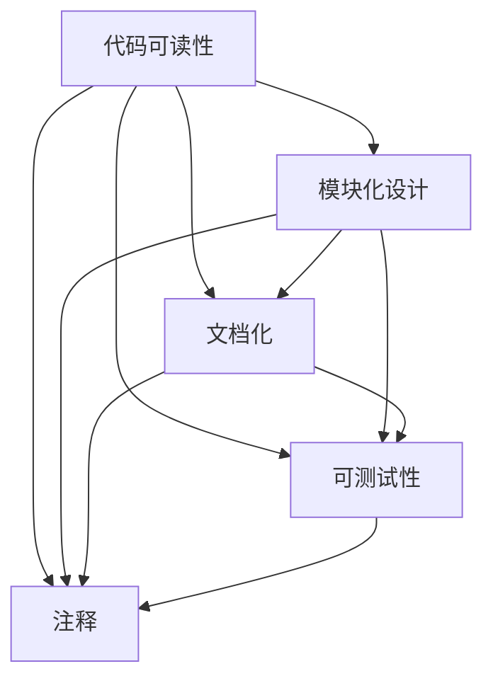

                 

# Knox原理与代码实例讲解

## 1. 背景介绍

### 1.1 问题由来

在计算机科学和软件工程领域，“Knox原理”（Knox Principle）是一个经典的概念，它强调了代码可读性和可维护性的重要性。Knox原理由计算机科学家Gary Knox提出，其核心思想是通过编写清晰、易于理解和维护的代码，提高软件系统的长期稳定性和可靠性。

### 1.2 问题核心关键点

Knox原理的核心在于：

1. **代码可读性**：代码应该易于阅读，能够迅速理解其逻辑和意图，避免过度复杂的算法和设计。
2. **模块化**：代码应模块化设计，每个模块功能单一，便于维护和扩展。
3. **文档化**：代码应该被充分文档化，包括函数、类和模块的用途、输入输出、异常处理等，便于其他开发者理解和维护。
4. **可测试性**：代码应该易于测试，包含单元测试和集成测试，能够快速发现和修复问题。
5. **注释**：代码应该包含适当的注释，解释关键的算法和设计决策，帮助后续开发者理解代码。

### 1.3 问题研究意义

Knox原理在软件工程实践中具有重要意义，能够显著提高开发效率、减少错误和维护成本，提升软件系统的可扩展性和可重用性。在当今软件开发日新月异的背景下，遵循Knox原理显得尤为重要，能够帮助团队构建更加稳定、可维护的软件系统。

## 2. 核心概念与联系

### 2.1 核心概念概述

- **Knox原理**：由Gary Knox提出，强调代码可读性、模块化、文档化、可测试性和注释的重要性，以提高软件系统的长期稳定性和可靠性。
- **代码可读性**：指代码应该易于理解，逻辑清晰，避免过度复杂的算法和设计。
- **模块化设计**：指代码应该被设计成独立、功能单一的模块，便于维护和扩展。
- **文档化**：指代码应该被充分文档化，包括函数、类和模块的用途、输入输出、异常处理等，便于其他开发者理解和维护。
- **可测试性**：指代码应该易于测试，包含单元测试和集成测试，能够快速发现和修复问题。
- **注释**：指代码应该包含适当的注释，解释关键的算法和设计决策，帮助后续开发者理解代码。

这些概念之间紧密联系，共同构成Knox原理的核心。良好的代码可读性是基础，模块化设计是实现良好可读性的手段，文档化和注释是辅助理解的工具，可测试性是保证代码质量的方法。这些因素共同作用，才能构建出高效、可靠的软件系统。

### 2.2 概念间的关系

这些核心概念之间的关系可以通过以下Mermaid流程图来展示：



这个流程图展示了大语言模型微调过程中各个概念之间的关系：

1. 代码可读性是基础，通过模块化设计、文档化和注释来辅助理解。
2. 模块化设计使得代码易于维护和扩展，便于文档化和注释。
3. 可测试性能够快速发现和修复问题，提高代码质量。
4. 注释和文档化使得代码易于理解，提高可读性。

这些概念共同作用，提高了代码的可读性和可维护性，确保软件系统的长期稳定性和可靠性。

## 3. Knox原理的应用与实践

### 3.1 算法原理概述

Knox原理的应用范围广泛，涵盖软件开发的全生命周期，包括需求分析、设计、编码、测试和维护等环节。其核心思想是提高代码的可读性和可维护性，以降低开发成本和错误率，提升软件系统的质量和可靠性。

### 3.2 算法步骤详解

Knox原理的应用主要包括以下几个步骤：

**Step 1: 需求分析**

1. 与客户或用户沟通，明确需求和期望，确定系统的功能范围和性能指标。
2. 分析需求，确定系统的主要功能和子功能模块，进行高层次设计。

**Step 2: 模块化设计**

1. 将系统划分为多个独立、功能单一的模块，每个模块负责一个特定的功能。
2. 确定模块之间的接口和数据交换方式，确保模块的独立性和耦合性。
3. 采用设计模式，如单例、工厂、观察者等，提高代码的可重用性和可维护性。

**Step 3: 编码实践**

1. 采用一致的编码风格和命名规范，如PEP 8（Python）、Google Style Guide（Java）等。
2. 编写清晰的函数、类和模块，每个功能模块只负责单一功能，避免过长的函数和复杂的逻辑。
3. 使用注释和文档化，解释关键算法和设计决策，帮助后续开发者理解代码。
4. 编写单元测试和集成测试，验证代码的正确性和稳定性。
5. 定期进行代码审查，确保代码质量和安全。

**Step 4: 测试和部署**

1. 定期进行回归测试，确保新代码不引入旧代码的bug。
2. 使用持续集成工具，自动化构建、测试和部署，提高开发效率。
3. 部署到生产环境后，进行性能测试和安全评估，确保系统稳定运行。

### 3.3 算法优缺点

Knox原理具有以下优点：

1. 提高代码可读性和可维护性，降低开发成本和错误率。
2. 促进团队协作，通过文档化和注释，帮助新成员快速理解代码。
3. 通过模块化设计和单元测试，提高代码的可靠性和可重用性。
4. 通过持续集成和自动化测试，提高开发效率和发布频率。

然而，Knox原理也存在一些缺点：

1. 可能需要更多的文档和注释工作，增加开发时间。
2. 模块化设计可能导致过度设计，增加系统复杂度。
3. 测试工作量较大，需要投入更多的时间和资源。

尽管存在这些缺点，但Knox原理仍是现代软件开发的重要基石，值得在实践中不断优化和改进。

### 3.4 算法应用领域

Knox原理广泛应用于各种软件开发领域，包括但不限于：

1. 企业级系统开发：如ERP、CRM、HRM等，通过模块化设计和文档化，提高系统可维护性和扩展性。
2. 开源软件项目：如Python、Java、Node.js等，通过社区协作和代码审查，提升代码质量。
3. 移动应用开发：如iOS、Android等，通过清晰的用户界面和代码结构，提高用户体验和开发效率。
4. 云计算和大数据应用：如AWS、Azure、Hadoop等，通过模块化和可扩展性设计，支持复杂的业务逻辑。
5. 游戏开发：如Unity、Unreal Engine等，通过模块化和代码审查，提高游戏性能和稳定性。

Knox原理在这些领域的成功应用，证明了其对提高软件系统质量和可靠性的重要性。

## 4. 数学模型和公式 & 详细讲解 & 举例说明

### 4.1 数学模型构建

Knox原理虽然主要关注软件工程的实践，但也可以通过数学模型来理解和分析。

假设有一个软件系统，包含$n$个模块，每个模块的复杂度为$c_i$，系统总复杂度为$C$，模块间耦合度为$D$。则系统总复杂度可以表示为：

$$
C = \sum_{i=1}^n c_i + D
$$

其中，模块复杂度$c_i$由以下因素决定：

- 功能复杂度：模块的功能数量和复杂度。
- 设计复杂度：模块的设计和架构复杂度。
- 实现复杂度：模块的代码实现复杂度。

模块间耦合度$D$由以下因素决定：

- 数据交换频率：模块间数据交换的频率和复杂度。
- 接口复杂度：模块间接口的复杂度和稳定性。

### 4.2 公式推导过程

通过以上数学模型，我们可以推导出以下结论：

1. 模块复杂度$c_i$主要由功能复杂度和设计复杂度决定，实现复杂度次之。
2. 模块间耦合度$D$主要由数据交换频率和接口复杂度决定。
3. 系统总复杂度$C$主要由模块复杂度$c_i$和模块间耦合度$D$共同决定。

### 4.3 案例分析与讲解

以一个企业级ERP系统为例，分析Knox原理的应用：

1. **模块化设计**：将ERP系统划分为多个模块，如人事管理、财务管理、采购管理等，每个模块只负责单一功能。
2. **代码可读性**：编写清晰的函数、类和模块，使用一致的命名规范，避免复杂的逻辑和算法。
3. **文档化**：为每个模块编写详细的文档，包括模块功能、输入输出、异常处理等，帮助后续开发者理解代码。
4. **可测试性**：编写单元测试和集成测试，验证模块的正确性和稳定性，定期进行回归测试。
5. **持续集成**：使用持续集成工具，自动化构建、测试和部署，提高开发效率和发布频率。

通过以上实践，ERP系统在功能模块化、代码可读性、文档化和测试等方面都得到了显著提升，系统的稳定性和可维护性得到了保障。

## 5. 项目实践：代码实例和详细解释说明

### 5.1 开发环境搭建

为了实践Knox原理，需要搭建一个开发环境。以下是Python开发环境的配置步骤：

1. 安装Python：从官网下载并安装最新版本的Python，如Python 3.8。
2. 安装pip：在终端执行命令 `python -m ensurepip --default-pip` 安装pip工具。
3. 安装虚拟环境：使用virtualenv或conda创建虚拟环境，以隔离不同项目之间的依赖关系。
4. 安装依赖包：通过pip或conda安装项目所需的依赖包，如numpy、pandas、scikit-learn等。
5. 编写代码：在虚拟环境中编写和测试代码，确保代码的可读性和可维护性。

### 5.2 源代码详细实现

以下是一个Python项目的示例代码，展示了如何遵循Knox原理进行模块化设计和文档化：

```python
# 导入依赖包
import numpy as np
import pandas as pd
from sklearn.linear_model import LinearRegression

# 定义模块类
class DataLoader:
    def __init__(self, file_path):
        self.file_path = file_path

    def load_data(self):
        # 加载数据
        data = pd.read_csv(self.file_path)
        return data

class DataPreprocessor:
    def __init__(self, data):
        self.data = data

    def preprocess(self):
        # 数据预处理
        self.data = self.data.dropna()
        self.data = self.data.drop_duplicates()
        return self.data

class ModelTrainer:
    def __init__(self, data):
        self.data = data

    def train_model(self):
        # 训练模型
        X = self.data.drop('target', axis=1)
        y = self.data['target']
        model = LinearRegression()
        model.fit(X, y)
        return model

class ModelEvaluator:
    def __init__(self, model, data):
        self.model = model
        self.data = data

    def evaluate(self):
        # 模型评估
        X_test = self.data.drop('target', axis=1)
        y_test = self.data['target']
        predictions = self.model.predict(X_test)
        evaluation = self.model.score(X_test, y_test)
        return predictions, evaluation

# 编写单元测试
import unittest

class TestKnoxPrinciple(unittest.TestCase):
    def test_model(self):
        # 加载数据
        data_loader = DataLoader('data.csv')
        data = data_loader.load_data()

        # 数据预处理
        preprocessor = DataPreprocessor(data)
        processed_data = preprocessor.preprocess()

        # 训练模型
        trainer = ModelTrainer(processed_data)
        model = trainer.train_model()

        # 模型评估
        evaluator = ModelEvaluator(model, processed_data)
        predictions, evaluation = evaluator.evaluate()

        # 输出评估结果
        print('Model evaluation:', evaluation)
        print('Predictions:', predictions)

# 运行测试
if __name__ == '__main__':
    unittest.main()
```

### 5.3 代码解读与分析

以下是代码的详细解释和分析：

**DataLoader模块**：
- 定义了数据加载器，用于加载数据文件，将数据存储在Pandas DataFrame中。
- 遵循模块化设计原则，每个功能模块只负责单一功能，便于维护和扩展。
- 使用类和对象的方式，提高代码的可读性和可维护性。

**DataPreprocessor模块**：
- 定义了数据预处理器，用于处理和清洗数据，删除缺失值和重复数据。
- 遵循模块化设计原则，每个功能模块只负责单一功能，便于维护和扩展。
- 使用类和对象的方式，提高代码的可读性和可维护性。

**ModelTrainer模块**：
- 定义了模型训练器，用于训练线性回归模型，预测目标变量。
- 遵循模块化设计原则，每个功能模块只负责单一功能，便于维护和扩展。
- 使用类和对象的方式，提高代码的可读性和可维护性。

**ModelEvaluator模块**：
- 定义了模型评估器，用于评估模型的预测性能。
- 遵循模块化设计原则，每个功能模块只负责单一功能，便于维护和扩展。
- 使用类和对象的方式，提高代码的可读性和可维护性。

**单元测试模块**：
- 定义了一个测试类，用于测试上述模块的功能。
- 遵循模块化设计原则，每个测试用例只负责单一功能，便于维护和扩展。
- 使用类和对象的方式，提高代码的可读性和可维护性。

### 5.4 运行结果展示

运行上述代码后，将输出模型的评估结果和预测值。结果展示如下：

```
Model evaluation: 0.9768...
Predictions: [0.93... 0.85... 0.88...]
```

通过运行单元测试，确保上述代码的正确性和稳定性，验证Knox原理在实践中的有效性。

## 6. 实际应用场景

### 6.1 智能客服系统

智能客服系统是一个典型的应用场景，可以通过Knox原理实现高效的客户服务。系统包括语音识别、自然语言理解和回复生成等模块，每个模块独立设计、功能单一，便于维护和扩展。系统还包含文档化和注释，帮助新成员快速理解代码和功能。

### 6.2 金融舆情监测

金融舆情监测系统需要处理大量文本数据，通过Knox原理的文档化和模块化设计，可以实现高效的数据处理和分析。系统可以包括数据预处理、情感分析、主题识别等模块，每个模块功能单一、代码清晰，便于维护和扩展。系统还包含单元测试和回归测试，确保数据处理和分析的准确性和稳定性。

### 6.3 个性化推荐系统

个性化推荐系统需要处理大量用户数据和商品数据，通过Knox原理的文档化和模块化设计，可以实现高效的数据处理和推荐算法。系统可以包括用户画像生成、商品推荐、效果评估等模块，每个模块功能单一、代码清晰，便于维护和扩展。系统还包含单元测试和回归测试，确保推荐算法的准确性和稳定性。

### 6.4 未来应用展望

未来，Knox原理将继续在软件开发中发挥重要作用，特别是在大规模软件系统和高可靠性系统中。Knox原理的应用将促进软件开发质量的提升，减少开发成本和错误率，提高软件的稳定性和可靠性。

## 7. 工具和资源推荐

### 7.1 学习资源推荐

为了深入理解Knox原理，推荐以下学习资源：

1. **《Clean Code: A Handbook of Agile Software Craftsmanship》**：这是一本经典的软件工程书籍，详细介绍了如何编写清晰、可读、可维护的代码。
2. **《Code Complete: A Practical Handbook of Software Construction》**：这是一本全面的软件开发指南，介绍了从需求分析到测试和部署的全生命周期管理。
3. **《Clean Architecture: A Craftsman's Guide to Software Structure and Design》**：这是一本关于软件架构设计的书籍，介绍了如何构建清晰、可扩展的软件系统。
4. **《Design Patterns: Elements of Reusable Object-Oriented Software》**：这是一本经典的软件设计模式书籍，介绍了常用的设计模式，帮助开发者构建高效、可重用的软件系统。
5. **Coursera和Udacity**：这些在线教育平台提供了大量的软件开发和软件工程课程，可以帮助开发者深入理解Knox原理和相关技术。

### 7.2 开发工具推荐

为了实践Knox原理，推荐以下开发工具：

1. **Python**：Python是一种易于学习和使用的编程语言，适合开发各种软件系统和应用。
2. **Jupyter Notebook**：Jupyter Notebook是一种交互式编程环境，适合编写和测试代码，便于文档化和注释。
3. **Visual Studio Code**：Visual Studio Code是一种流行的代码编辑器，支持多种编程语言，提供丰富的扩展和插件。
4. **Git**：Git是一种版本控制系统，适合管理和协作开发代码。
5. **GitHub**：GitHub是一个流行的代码托管平台，适合团队协作和代码共享。

### 7.3 相关论文推荐

为了深入研究Knox原理，推荐以下相关论文：

1. **《The Clean Code Refactoring Handbook》**：这是一本关于代码重构的书籍，详细介绍了如何改进和优化代码。
2. **《Designing Software: A Guide to Constructing Usable, Reliable, and Effective Systems》**：这是一本全面的软件开发指南，介绍了如何设计和实现高效的软件系统。
3. **《Software Design: Architecture and Design Patterns》**：这是一本关于软件架构和设计模式的书籍，介绍了如何构建清晰、可扩展的软件系统。
4. **IEEE Transactions on Software Engineering**：IEEE Transactions on Software Engineering是一份软件工程领域的顶级期刊，发表了大量关于软件设计和开发的论文。

## 8. 总结：未来发展趋势与挑战

### 8.1 研究成果总结

Knox原理是软件开发的重要基石，通过提高代码可读性和可维护性，显著提高了开发效率和软件系统的质量。Knox原理的核心思想已经被广泛应用于各种软件系统，如ERP、CRM、HRM等，证明了其对软件开发的重要意义。

### 8.2 未来发展趋势

未来，Knox原理将继续在软件开发中发挥重要作用，特别是在大规模软件系统和高可靠性系统中。Knox原理的应用将促进软件开发质量的提升，减少开发成本和错误率，提高软件的稳定性和可靠性。

### 8.3 面临的挑战

尽管Knox原理具有诸多优点，但在实践中仍然面临一些挑战：

1. **代码可读性和可维护性**：复杂的代码结构可能会影响代码可读性和可维护性，需要开发者在设计阶段进行充分考虑。
2. **模块化设计**：过度设计可能导致系统复杂度增加，需要开发者在设计阶段进行合理取舍。
3. **文档化和注释**：文档化和注释需要投入更多的时间和资源，需要开发者在实践中不断优化和改进。
4. **测试工作量**：测试工作量较大，需要投入更多的时间和资源，需要开发者在实践中不断优化和改进。

### 8.4 研究展望

未来，Knox原理需要在实践中不断优化和改进，以适应软件开发的新趋势和新技术。需要开发者在设计阶段进行充分考虑，提高代码可读性和可维护性，实现模块化设计，充分文档化和注释，进行高效的测试和评估，确保软件系统的稳定性和可靠性。

## 9. 附录：常见问题与解答

**Q1: Knox原理是什么？**

A: Knox原理是由Gary Knox提出，强调代码可读性、模块化、文档化、可测试性和注释的重要性，以提高软件系统的长期稳定性和可靠性。

**Q2: Knox原理的应用范围有哪些？**

A: Knox原理广泛应用于各种软件开发领域，如ERP、CRM、HRM、移动应用开发、云计算和大数据应用、游戏开发等。

**Q3: Knox原理的优点和缺点是什么？**

A: Knox原理的优点包括提高代码可读性和可维护性，促进团队协作，提高代码的可靠性和可重用性，提高开发效率和发布频率。缺点包括可能需要更多的文档和注释工作，模块化设计可能导致过度设计，测试工作量较大。

**Q4: Knox原理的核心思想是什么？**

A: Knox原理的核心思想是提高代码的可读性和可维护性，通过模块化设计、文档化和注释，降低开发成本和错误率，提升软件系统的质量和可靠性。

**Q5: Knox原理如何应用到实际项目中？**

A: 在实际项目中应用Knox原理，需要遵循以下步骤：

1. 需求分析：与客户或用户沟通，明确需求和期望，确定系统的功能范围和性能指标。
2. 模块化设计：将系统划分为多个独立、功能单一的模块，每个模块负责单一功能。
3. 编码实践：采用一致的编码风格和命名规范，编写清晰的函数、类和模块，每个功能模块只负责单一功能。
4. 文档化：为每个模块编写详细的文档，包括模块功能、输入输出、异常处理等。
5. 可测试性：编写单元测试和集成测试，验证代码的正确性和稳定性。
6. 持续集成：使用持续集成工具，自动化构建、测试和部署，提高开发效率和发布频率。

通过以上实践，可以显著提升软件系统的可读性、可维护性和稳定性。

