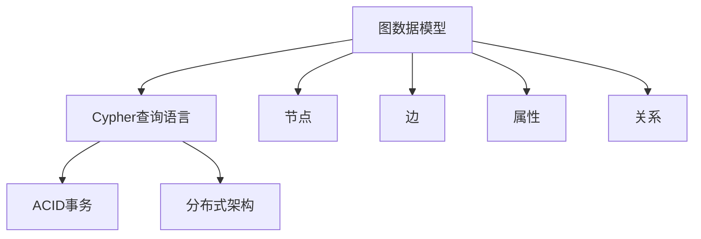
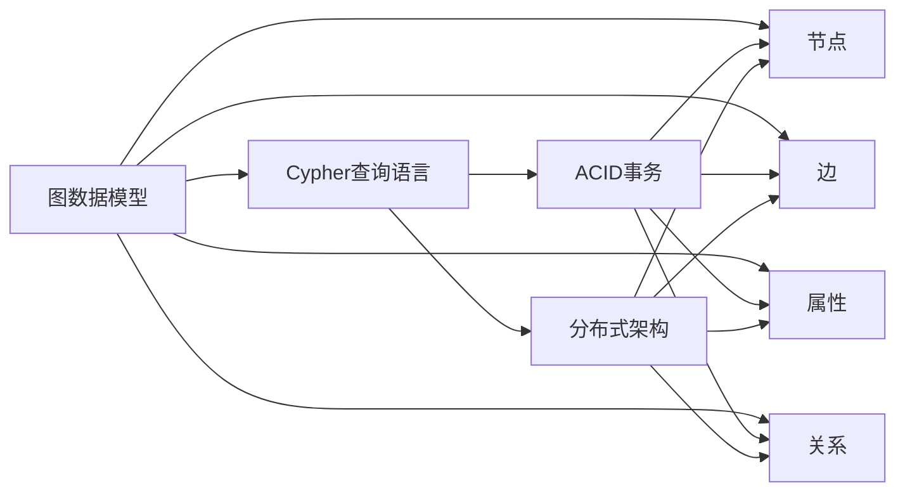

                 

# Neo4j原理与代码实例讲解

## 1. 背景介绍

### 1.1 问题由来
近年来，随着数据量的爆炸式增长和分析需求的不断变化，传统的关系型数据库已经难以满足业务场景的多样化和复杂性要求。而基于图数据模型的NoSQL数据库成为了一种新的选择。GraphDB（Neo4j是目前最知名的GraphDB之一）作为图数据库领域的佼佼者，其高性能、高可用性和易用性使其在数据管理、社交网络分析、推荐系统、知识图谱等领域得到了广泛应用。本文旨在深入探讨Neo4j的原理与实现，并通过一系列的代码实例，展示其在实际应用中的灵活应用。

### 1.2 问题核心关键点
Neo4j作为一款高性能的图数据库，其核心原理包括：
1. 图模型与图数据库：了解Neo4j如何存储和处理图结构数据，包括节点、边、属性和关系等概念。
2. Cypher查询语言：掌握使用Cypher语言进行图数据库查询的方法和技巧。
3. 性能调优：理解Neo4j的缓存、索引、并行处理等性能优化机制。
4. 高级特性：探索Neo4j的高级特性，如分布式集群、consistent hashing算法、时间线、版本控制等。
5. 代码实践：通过具体的代码实例，深入理解Neo4j的原理与操作。

这些关键点构成了理解Neo4j的基础，本文将围绕这些点展开详细讨论。

### 1.3 问题研究意义
Neo4j在图数据库领域取得了显著成果，其高性能和灵活性使其在多个大数据场景中具有不可替代的优势。研究Neo4j的原理与代码实例，对于掌握图形数据库技术、优化数据库性能、提升数据处理能力具有重要意义：
1. 提升数据管理效率：通过了解Neo4j的图模型和查询语言，能够更好地管理复杂数据结构，提升数据处理效率。
2. 优化查询性能：掌握Neo4j的性能优化技巧，能够提高查询和分析速度，缩短响应时间。
3. 推动技术创新：探索Neo4j的高级特性和代码实例，能够激发新的应用思路，推动技术创新和应用发展。
4. 增强可操作性：通过具体代码实例，深入理解Neo4j的操作细节，提升开发者和运维人员的操作技能。
5. 确保数据安全：了解Neo4j的数据安全特性，能够保护数据免受未授权访问和篡改。

## 2. 核心概念与联系

### 2.1 核心概念概述

Neo4j作为一款领先的图数据库，其核心概念主要包括：

- 图数据模型：由节点(Node)、边(Edge)、属性(Property)和关系(Relationship)组成的数据模型。节点和边之间的关系以属性表示，节点之间通过边进行连接。
- Cypher查询语言：Neo4j专有的查询语言，用于描述对图数据的查询和操作。
- ACID事务：支持ACID事务，保证数据操作的原子性、一致性、隔离性和持久性。
- 分布式架构：支持分布式架构，通过集群和节点分配，实现高可用性和高性能。

这些核心概念之间存在紧密联系，共同构成了Neo4j的基本框架和功能。下图展示了这些核心概念之间的关系：



### 2.2 概念间的关系

以上核心概念之间存在复杂的关系，它们相互依存、相互影响，共同构成了Neo4j的完整架构。下图展示了这些概念之间的关系：



## 3. 核心算法原理 & 具体操作步骤

### 3.1 算法原理概述

Neo4j的核心算法主要包括以下几个方面：

1. 图存储算法：Neo4j采用邻接矩阵和邻接列表相结合的存储方式，支持快速节点和边的访问。
2. Cypher查询算法：使用基于C++的解析器和执行器，对Cypher查询进行编译和执行，实现高效的图数据查询。
3. 分布式架构算法：通过一致性哈希算法和分布式共识算法，保证集群中的节点能够高效地协调和数据分布。
4. 性能优化算法：采用缓存、索引、并发控制等技术，提升查询和操作的性能。

### 3.2 算法步骤详解

Neo4j的核心算法步骤主要包括以下几个方面：

1. 数据模型设计：定义节点、边、属性和关系，设计数据模型。
2. 数据加载和导入：将数据加载到Neo4j数据库中。
3. 数据查询和分析：使用Cypher查询语言进行数据查询和分析。
4. 性能优化和调优：通过缓存、索引、并发控制等技术，优化查询性能。
5. 集群管理和扩展：通过一致性哈希算法和分布式共识算法，管理集群和扩展节点。

### 3.3 算法优缺点

Neo4j的优点包括：
1. 高性能：支持并行查询和分布式架构，能够高效处理大规模图数据。
2. 灵活性：支持复杂的数据模型和查询语言，能够灵活处理各种数据场景。
3. 高可用性：支持ACID事务和一致性哈希算法，保证数据的一致性和可靠性。
4. 易用性：提供丰富的API和工具，简化数据操作和查询。

Neo4j的缺点包括：
1. 学习曲线较陡：需要掌握复杂的图模型和Cypher语言，学习成本较高。
2. 资源消耗较大：需要较多的计算资源，特别是分布式架构和并发处理时。
3. 数据模型限制：虽然灵活性高，但在某些复杂场景下，可能需要手动设计数据模型。

### 3.4 算法应用领域

Neo4j广泛应用于多个领域，包括但不限于：

- 社交网络分析：用于分析和处理大规模社交网络数据，如好友关系、社交圈、影响力等。
- 推荐系统：用于分析用户行为和商品特征，提供个性化的推荐服务。
- 知识图谱：用于构建和查询知识图谱，支持语义搜索和数据推理。
- 地理信息分析：用于分析和处理地理数据，如路线规划、位置推荐等。
- 数据治理：用于数据清洗、数据整合和数据治理，提升数据质量和数据治理效率。

## 4. 数学模型和公式 & 详细讲解 & 举例说明

### 4.1 数学模型构建

Neo4j的图数据模型可以表示为：
\[ G(V, E, P) \]
其中，\( V \) 表示节点集合，\( E \) 表示边集合，\( P \) 表示属性集合。每个节点\( v_i \) 可以表示为一个三元组：
\[ v_i = (id_i, label_i, properties_i) \]
其中，\( id_i \) 表示节点的唯一标识符，\( label_i \) 表示节点的标签，\( properties_i \) 表示节点的属性。每个边\( e_j \) 可以表示为一个四元组：
\[ e_j = (id_j, id_u, id_v, type_j) \]
其中，\( id_j \) 表示边的唯一标识符，\( id_u \) 和\( id_v \) 表示边连接的节点，\( type_j \) 表示边的类型。每个属性\( p_k \) 可以表示为一个二元组：
\[ p_k = (id_k, value_k) \]
其中，\( id_k \) 表示属性的唯一标识符，\( value_k \) 表示属性的值。

### 4.2 公式推导过程

Neo4j的Cypher查询语言是一种基于模式匹配的查询语言，其基本语法包括：
\[ MATCH \] 匹配节点或边，
\[ WHERE \] 过滤匹配结果，
\[ RETURN \] 返回查询结果。

例如，查询所有具有标签"Person"的节点：
\[ MATCH (p:Person) RETURN p \]

### 4.3 案例分析与讲解

考虑一个简单的社交网络数据集，其中包含多个节点和边。节点表示用户，边表示用户之间的关系（如朋友关系）。我们可以使用Cypher查询语言查询某个用户的所有朋友，示例代码如下：

```python
import neo4j

graph_db = neo4j.GraphDatabase.driver("bolt://localhost:7687", auth=("neo4j", "password"))

query = "MATCH (u:User)-[:FRIENDS]->(friend:User) WHERE u.name='Alice' RETURN friend.name"
result = graph_db.session.run(query)

for row in result:
    print(row['name'])
```

## 5. 项目实践：代码实例和详细解释说明

### 5.1 开发环境搭建

在搭建Neo4j开发环境时，需要考虑以下几个方面：

1. 安装Neo4j：可以从官网下载Neo4j社区版，并进行安装和配置。
2. 连接数据库：使用Bolt协议连接到Neo4j数据库。
3. 创建和删除数据库：使用Cypher语言创建和删除数据库。

以下是具体的搭建步骤：

```python
from neo4j import GraphDatabase

# 创建连接
driver = GraphDatabase.driver("bolt://localhost:7687", auth=("neo4j", "password"))

# 创建数据库
create_query = "CREATE DATABASE mydb"
driver.session.run(create_query)

# 删除数据库
drop_query = "DROP DATABASE mydb"
driver.session.run(drop_query)

# 关闭连接
driver.close()
```

### 5.2 源代码详细实现

接下来，我们将通过具体的代码实例，展示如何使用Cypher语言进行数据查询和操作。

**案例1：查询所有具有标签"Person"的节点**

```python
import neo4j

graph_db = neo4j.GraphDatabase.driver("bolt://localhost:7687", auth=("neo4j", "password"))

query = "MATCH (p:Person) RETURN p"
result = graph_db.session.run(query)

for row in result:
    print(row['name'])
```

**案例2：查询具有标签"Person"且属性"name"值为"Alice"的节点**

```python
import neo4j

graph_db = neo4j.GraphDatabase.driver("bolt://localhost:7687", auth=("neo4j", "password"))

query = "MATCH (p:Person {name:'Alice'}) RETURN p"
result = graph_db.session.run(query)

for row in result:
    print(row['name'])
```

### 5.3 代码解读与分析

以上代码实例展示了如何使用Cypher语言进行数据查询和操作。具体步骤如下：

1. 创建连接：使用`neo4j.GraphDatabase.driver()`方法创建与Neo4j数据库的连接。
2. 执行查询：使用`session.run()`方法执行Cypher查询。
3. 处理结果：将查询结果逐行输出。

**案例1**展示了如何使用Cypher语言查询所有具有标签"Person"的节点，并输出节点的名称。

**案例2**展示了如何使用Cypher语言查询具有标签"Person"且属性"name"值为"Alice"的节点，并输出节点的名称。

### 5.4 运行结果展示

运行以上代码实例，将输出符合查询条件的节点名称。

## 6. 实际应用场景

### 6.1 社交网络分析

社交网络分析是Neo4j的一个重要应用场景。例如，可以分析一个社交网络中的关系链路，识别关键节点和影响力节点。

### 6.2 推荐系统

推荐系统通过分析用户和商品之间的关系，提供个性化的推荐服务。Neo4j可以用于构建用户-商品关系图，并查询推荐结果。

### 6.3 知识图谱

知识图谱用于构建和查询知识库中的语义信息。Neo4j可以用于存储和查询知识图谱中的节点和关系，支持语义搜索和数据推理。

### 6.4 未来应用展望

未来，Neo4j将进一步拓展应用场景，推动图形数据库技术的发展。预计将在以下几个方面取得突破：

1. 云计算支持：更多云服务提供商将提供Neo4j云服务，提升数据管理和查询性能。
2. 自动化操作：更多自动化工具将支持Neo4j的操作，简化数据管理任务。
3. 数据可视化：更多可视化工具将支持Neo4j的数据可视化，提升数据分析能力。
4. 智能分析：更多智能算法将支持Neo4j的数据分析，提升数据分析效率。

## 7. 工具和资源推荐

### 7.1 学习资源推荐

为了帮助开发者掌握Neo4j的技术，以下是一些推荐的资源：

1. Neo4j官方文档：Neo4j官方提供的详细文档，包括安装、配置、查询和操作等内容。
2. Cypher语言教程：Cypher语言的官方教程和示例，帮助开发者掌握Cypher查询语言。
3. Neo4j社区：Neo4j社区提供了丰富的资源和支持，包括示例代码、博客和论坛等。

### 7.2 开发工具推荐

以下是一些推荐的Neo4j开发工具：

1. Neo4j Desktop：Neo4j官方的桌面应用，支持图形化的数据建模和查询操作。
2. Neo4j Browser：Neo4j官方的浏览器工具，支持图形化的数据查询和操作。
3. Neo4j GUI：Neo4j官方的图形界面工具，支持图形化的数据建模和查询操作。

### 7.3 相关论文推荐

以下是一些关于Neo4j的最新研究成果：

1. "Graph Databases: The Definitive Guide" by Michael R. T annually，Neo4j 的作者之一。
2. "Scalability and Performance of Neo4j" by Mark Needham，探讨Neo4j的分布式架构和性能优化。
3. "Graph-Based Recommender Systems" by Joachim Klein，探讨如何使用Neo4j构建推荐系统。

## 8. 总结：未来发展趋势与挑战

### 8.1 研究成果总结

Neo4j作为一款高性能的图数据库，已经在多个领域得到了广泛应用。其主要研究成果包括：

1. 图数据模型：支持灵活的节点、边、属性和关系，适用于各种数据场景。
2. Cypher查询语言：支持基于模式匹配的查询语言，易于理解和操作。
3. 分布式架构：支持高可用性和高性能的分布式架构，能够处理大规模数据。
4. 性能优化：采用缓存、索引、并发控制等技术，提升查询和操作的性能。

### 8.2 未来发展趋势

未来，Neo4j将继续在以下领域发展：

1. 云计算支持：更多云服务提供商将提供Neo4j云服务，提升数据管理和查询性能。
2. 自动化操作：更多自动化工具将支持Neo4j的操作，简化数据管理任务。
3. 数据可视化：更多可视化工具将支持Neo4j的数据可视化，提升数据分析能力。
4. 智能分析：更多智能算法将支持Neo4j的数据分析，提升数据分析效率。

### 8.3 面临的挑战

尽管Neo4j已经取得了显著的成就，但在发展过程中仍然面临一些挑战：

1. 学习曲线陡峭：Neo4j的复杂性和学习曲线较陡峭，需要开发者具备较强的技术能力。
2. 资源消耗大：Neo4j需要较多的计算资源，特别是分布式架构和并发处理时。
3. 数据模型设计：虽然灵活性高，但在某些复杂场景下，可能需要手动设计数据模型。

### 8.4 研究展望

未来，Neo4j将进一步拓展应用场景，推动图形数据库技术的发展。预计将在以下几个方面取得突破：

1. 云计算支持：更多云服务提供商将提供Neo4j云服务，提升数据管理和查询性能。
2. 自动化操作：更多自动化工具将支持Neo4j的操作，简化数据管理任务。
3. 数据可视化：更多可视化工具将支持Neo4j的数据可视化，提升数据分析能力。
4. 智能分析：更多智能算法将支持Neo4j的数据分析，提升数据分析效率。

## 9. 附录：常见问题与解答

**Q1：Neo4j适用于哪些数据场景？**

A: Neo4j适用于多种数据场景，如社交网络、推荐系统、知识图谱等。它支持灵活的数据模型和复杂的查询语言，能够处理各种数据场景。

**Q2：Neo4j的学习曲线是否陡峭？**

A: 是的，Neo4j的学习曲线较陡峭，需要开发者具备一定的技术背景和经验。但一旦掌握，将能够高效地管理和使用Neo4j。

**Q3：Neo4j的性能如何？**

A: Neo4j具有高性能和低延迟，支持并行查询和分布式架构，能够高效处理大规模数据。但需要一定的计算资源，特别是在分布式架构和并发处理时。

**Q4：Neo4j的分布式架构有哪些优势？**

A: Neo4j的分布式架构具有高可用性和高扩展性，能够处理大规模数据和并发请求。通过一致性哈希算法和分布式共识算法，保证集群中的节点能够高效地协调和数据分布。

**Q5：如何优化Neo4j的性能？**

A: 可以通过缓存、索引、并发控制等技术，优化Neo4j的性能。例如，使用缓存机制减少数据库访问次数，使用索引加快查询速度，使用并发控制提升并发操作性能。

---

作者：禅与计算机程序设计艺术 / Zen and the Art of Computer Programming

