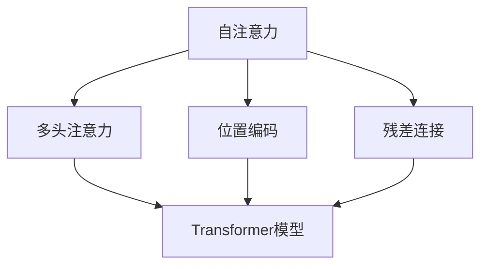
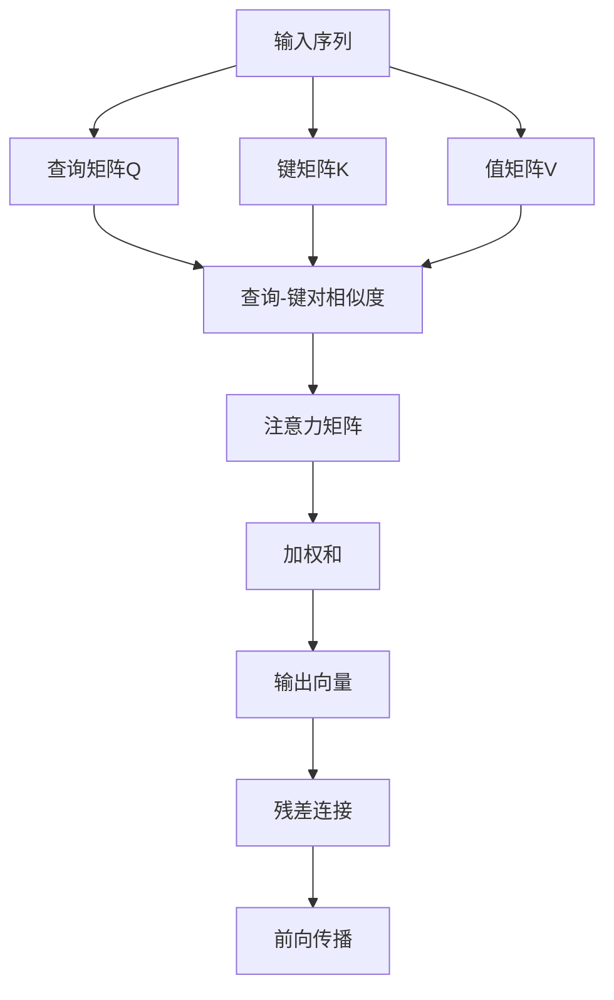
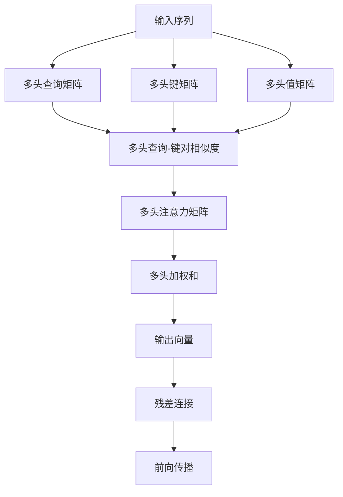
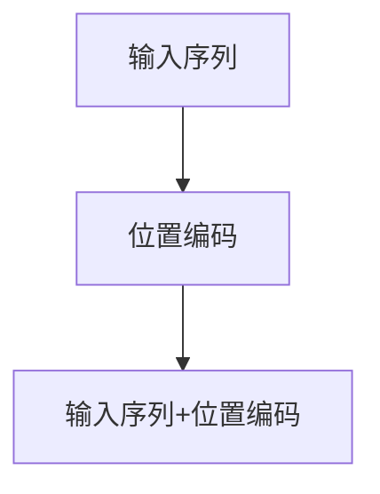
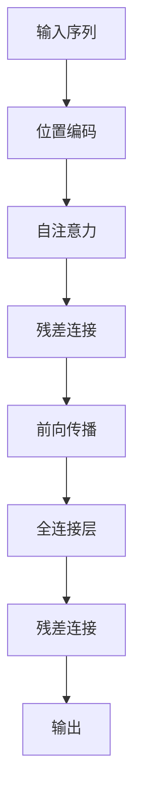
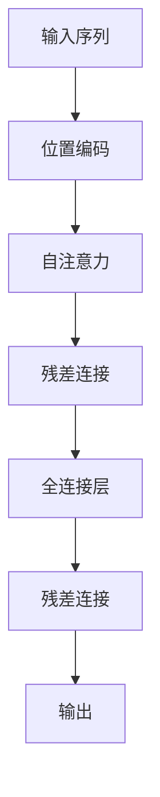

                 

# Python深度学习实践：基于自注意力机制的序列模型

> 关键词：自注意力,序列模型,Transformer,深度学习,神经网络

## 1. 背景介绍

### 1.1 问题由来

深度学习在自然语言处理(NLP)和计算机视觉(CV)等领域已经取得了显著的进展，其主要驱动因素之一就是自注意力机制(Attention Mechanism)。自注意力不仅能够有效捕捉序列数据中的局部和全局信息，还能提升模型的表示能力和泛化能力，因此被广泛应用于各种序列模型中。

自注意力机制最早由Attention is All You Need提出，由Google Brain团队开发，用于机器翻译任务。该模型摒弃了传统的循环神经网络(RNN)，而是采用自注意力机制，实现了序列建模。自注意力机制使得模型在每个时间步只需计算输入序列中与其他所有序列的交互，从而大大降低了计算复杂度，提高了模型训练和推理的效率。

自注意力机制不仅在机器翻译领域取得了突破，也被广泛应用于文本生成、问答、文本分类等NLP任务中，以及时间序列预测、图像生成等CV任务中，成为序列模型的主流技术。

### 1.2 问题核心关键点

自注意力机制的核心思想在于通过计算输入序列中每个元素与其他元素之间的关联度，来确定每个元素的表示。具体来说，自注意力机制通过计算输入序列中每个元素与其他元素之间的相似度得分，进而确定每个元素的表示向量，从而实现了序列建模。

自注意力机制的计算过程主要分为三个步骤：

1. 计算查询-键-值对( Query-Key-Value Pair)的相似度得分，得到注意力矩阵(Attention Matrix)。
2. 根据注意力矩阵计算加权和( Weighted Sum)，得到每个元素的表示向量。
3. 对表示向量进行线性变换和非线性激活，得到最终输出。

自注意力机制的优点在于：

- 高效：通过计算注意力得分，可以并行计算输入序列中所有元素与其他元素的交互，显著降低计算复杂度。
- 泛化能力强：自注意力机制可以捕捉输入序列中的局部和全局信息，适应不同的数据分布。
- 灵活：可以通过不同的注意力计算方式和多头注意力机制，灵活应对不同的任务需求。

自注意力机制的缺点在于：

- 复杂度较高：自注意力机制需要计算输入序列中所有元素与其他元素的相似度得分，计算量较大。
- 可解释性不足：自注意力机制的内部计算过程较为复杂，难以解释其决策过程。
- 对噪声敏感：输入序列中的噪声或异常值可能会影响自注意力机制的输出结果。

尽管存在这些缺点，自注意力机制的优越性能和广泛应用，使得其成为了深度学习中不可或缺的技术。本文将深入探讨基于自注意力机制的序列模型，重点介绍Transformer模型的原理和实现，并通过PyTorch框架进行代码实践。

## 2. 核心概念与联系

### 2.1 核心概念概述

为更好地理解基于自注意力机制的序列模型，本节将介绍几个密切相关的核心概念：

- 自注意力机制(Attention Mechanism)：通过计算输入序列中每个元素与其他元素之间的相似度得分，来确定每个元素的表示向量，从而实现序列建模。
- 多头注意力机制(Multi-Head Attention)：通过多个注意力头并行计算输入序列中的注意力得分，进一步提高模型性能。
- 位置编码(Positional Encoding)：通过添加位置信息，使模型能够区分输入序列中不同位置上的元素。
- 残差连接(Residual Connection)：通过残差连接结构，使得模型能够学习残差信号，提升训练效果。
- Transformer模型：一种基于自注意力机制的序列模型，由Google Brain团队开发，广泛用于各种序列建模任务。

这些核心概念之间存在着紧密的联系，构成了自注意力机制和Transformer模型的基本框架。下面我们通过几个Mermaid流程图来展示这些概念之间的联系：

这个流程图展示了自注意力、多头注意力、位置编码和残差连接四个核心概念与Transformer模型的关系。其中，自注意力是基础，通过多头注意力机制进行扩展，位置编码和残差连接则用于提升模型的表现。

### 2.2 概念间的关系

这些核心概念之间存在着紧密的联系，形成了自注意力机制和Transformer模型的完整生态系统。下面我们通过几个Mermaid流程图来展示这些概念之间的关系。

#### 2.2.1 自注意力机制的计算流程

这个流程图展示了自注意力机制的计算流程。首先，将输入序列转换为查询矩阵Q、键矩阵K和值矩阵V。然后，通过计算查询矩阵Q与键矩阵K的相似度得分，得到注意力矩阵F。最后，根据注意力矩阵F计算加权和G，并进行残差连接I，最终得到输出向量H。

#### 2.2.2 多头注意力机制的计算流程

这个流程图展示了多头注意力机制的计算流程。首先，将输入序列转换为多头查询矩阵、多头键矩阵和多头值矩阵。然后，通过计算多头查询矩阵与多头键矩阵的相似度得分，得到多头注意力矩阵F。最后，根据多头注意力矩阵F计算多头加权和G，并进行残差连接I，最终得到输出向量H。

#### 2.2.3 位置编码的计算流程

这个流程图展示了位置编码的计算流程。首先，根据输入序列的长度和位置信息，生成位置编码矩阵B。然后，将输入序列与位置编码矩阵B相加，得到带有位置信息的输入序列C。

#### 2.2.4 Transformer模型的计算流程

这个流程图展示了Transformer模型的计算流程。首先，将输入序列转换为带有位置信息的输入序列C。然后，通过自注意力计算得到自注意力结果D，并进行残差连接。接着，通过前向传播和全连接层计算得到输出E，并进行残差连接。最后，得到最终输出H。

### 2.3 核心概念的整体架构

最后，我们用一个综合的流程图来展示这些核心概念在大语言模型微调过程中的整体架构：

这个综合流程图展示了从输入序列到最终输出的完整过程。输入序列首先经过位置编码，然后通过自注意力计算得到自注意力结果，并进行残差连接。接着，通过全连接层计算得到输出，并进行残差连接。最后，得到最终输出。

## 3. 核心算法原理 & 具体操作步骤
### 3.1 算法原理概述

基于自注意力机制的序列模型，本质上是一种通过自注意力机制计算输入序列中每个元素的表示向量，并输出最终序列的技术。其核心思想是通过计算输入序列中每个元素与其他元素之间的相似度得分，来确定每个元素的表示向量，从而实现序列建模。

具体来说，自注意力机制的计算过程分为三个步骤：

1. 计算查询-键-值对( Query-Key-Value Pair)的相似度得分，得到注意力矩阵(Attention Matrix)。
2. 根据注意力矩阵计算加权和( Weighted Sum)，得到每个元素的表示向量。
3. 对表示向量进行线性变换和非线性激活，得到最终输出。

Transformer模型是采用自注意力机制的序列模型的经典代表，其基本结构如图2所示。Transformer模型由多个编码器(Encoder)和解码器(Decoder)组成，每个编码器和解码器都由多头注意力机制和前向传播层组成。

Transformer模型在编码器部分采用残差连接和位置编码技术，通过自注意力机制计算每个输入序列的表示向量，然后将多个头并行计算的表示向量进行拼接，最终得到编码器的输出。在解码器部分，通过残差连接和位置编码技术，将编码器的输出作为解码器的输入，再经过多头注意力机制和前向传播层，最终得到解码器的输出。

### 3.2 算法步骤详解

基于自注意力机制的序列模型的计算过程主要分为以下几个关键步骤：

**Step 1: 准备数据集**

在训练和推理过程中，需要准备好输入序列和对应的标签。通常采用PyTorch的数据加载器（DataLoader）来批量处理数据集，以便进行高效的模型训练和推理。

**Step 2: 定义模型结构**

在PyTorch中，可以通过定义Transformer模型类来实现自注意力机制的计算过程。在模型类中，需要定义输入序列和输出序列的长度、特征维度、注意力头数等关键参数，以及对应的多头注意力机制和前向传播层。

**Step 3: 定义损失函数**

通常采用交叉熵损失函数来衡量模型预测结果与真实标签之间的差异。在PyTorch中，可以使用torch.nn.CrossEntropyLoss来定义损失函数，并通过反向传播算法进行优化。

**Step 4: 执行模型训练**

在模型训练过程中，需要定义优化器（如AdamW）、学习率、批大小等超参数，并通过梯度下降算法进行参数更新。通常采用GPU/TPU等高性能设备进行模型训练，以加速计算过程。

**Step 5: 执行模型推理**

在模型推理过程中，需要定义模型输入和输出，通过前向传播计算模型输出，并进行预测和评估。通常采用GPU/TPU等高性能设备进行模型推理，以加速计算过程。

**Step 6: 评估模型性能**

在模型训练和推理过程中，需要定期评估模型性能，通过验证集和测试集来评估模型的泛化能力和精度。通常采用准确率、精度、召回率、F1分数等指标来评估模型性能。

### 3.3 算法优缺点

基于自注意力机制的序列模型具有以下优点：

- 高效：自注意力机制通过计算注意力得分，可以并行计算输入序列中所有元素与其他元素的交互，显著降低计算复杂度。
- 泛化能力强：自注意力机制可以捕捉输入序列中的局部和全局信息，适应不同的数据分布。
- 灵活：可以通过不同的注意力计算方式和多头注意力机制，灵活应对不同的任务需求。

同时，该方法也存在一定的局限性：

- 复杂度较高：自注意力机制需要计算输入序列中所有元素与其他元素的相似度得分，计算量较大。
- 可解释性不足：自注意力机制的内部计算过程较为复杂，难以解释其决策过程。
- 对噪声敏感：输入序列中的噪声或异常值可能会影响自注意力机制的输出结果。

尽管存在这些局限性，自注意力机制的优越性能和广泛应用，使得其成为了深度学习中不可或缺的技术。未来相关研究的重点在于如何进一步降低计算复杂度，提高可解释性和鲁棒性。

### 3.4 算法应用领域

基于自注意力机制的序列模型已经在自然语言处理(NLP)和计算机视觉(CV)等领域得到了广泛的应用，覆盖了各种序列建模任务，例如：

- 机器翻译：将源语言文本翻译成目标语言。
- 文本生成：生成自然语言文本，如文本摘要、对话生成等。
- 文本分类：对文本进行分类，如情感分析、主题分类等。
- 文本匹配：判断两个文本之间的相似度，如文档检索、问答匹配等。
- 图像生成：生成图像，如GAN生成图像、图像插值等。
- 图像分类：对图像进行分类，如图像识别、物体检测等。
- 时间序列预测：对时间序列数据进行预测，如股票价格预测、天气预测等。

除了这些经典任务外，自注意力机制还被创新性地应用到更多场景中，如多模态信息融合、跨领域知识迁移等，为NLP和CV技术带来了全新的突破。随着预训练语言模型和自注意力机制的不断进步，相信NLP和CV技术将在更广阔的应用领域大放异彩。

## 4. 数学模型和公式 & 详细讲解  
### 4.1 数学模型构建

本节将使用数学语言对基于自注意力机制的序列模型进行更加严格的刻画。

记输入序列为 $x=\{x_1,x_2,\cdots,x_t\}$，输出序列为 $y=\{y_1,y_2,\cdots,y_t\}$，其中 $x_i,y_i$ 分别表示输入序列和输出序列中的第 $i$ 个元素。假设输入序列的长度为 $t$，特征维度为 $d$，注意力头数为 $H$，查询矩阵 $Q_{h}$、键矩阵 $K_{h}$ 和值矩阵 $V_{h}$ 的维度均为 $d_h$。

在自注意力机制中，查询矩阵 $Q_{h}$、键矩阵 $K_{h}$ 和值矩阵 $V_{h}$ 是线性变换后的表示向量。假设线性变换的权重矩阵分别为 $W_Q$、$W_K$ 和 $W_V$，则查询矩阵 $Q_{h}$、键矩阵 $K_{h}$ 和值矩阵 $V_{h}$ 可以表示为：

$$
Q_{h} = xW_Q^h \in \mathbb{R}^{t \times d_h}
$$
$$
K_{h} = xW_K^h \in \mathbb{R}^{t \times d_h}
$$
$$
V_{h} = xW_V^h \in \mathbb{R}^{t \times d_h}
$$

其中 $W_Q^h$、$W_K^h$ 和 $W_V^h$ 分别表示线性变换的权重矩阵，$x$ 表示输入序列。

在自注意力机制中，注意力矩阵 $A_h$ 可以通过计算查询矩阵 $Q_{h}$ 和键矩阵 $K_{h}$ 的相似度得分得到。假设注意力矩阵 $A_h$ 的大小为 $t \times t$，则注意力矩阵 $A_h$ 可以表示为：

$$
A_h = \text{softmax}\left(\frac{Q_hK_h^T}{\sqrt{d_h}}\right) \in \mathbb{R}^{t \times t}
$$

其中 softmax 函数用于计算注意力得分，$\sqrt{d_h}$ 为归一化因子，确保注意力得分之和为1。

在自注意力机制中，每个输入序列的表示向量 $z_i$ 可以通过注意力矩阵 $A_h$ 和值矩阵 $V_{h}$ 计算得到。假设输出序列的长度也为 $t$，则表示向量 $z_i$ 可以表示为：

$$
z_i = \sum_{j=1}^{t} A_h^jV_h^j \in \mathbb{R}^{t \times d_h}
$$

在Transformer模型中，通常采用多头注意力机制，通过并行计算多个注意力头，进一步提升模型性能。假设多头注意力机制的注意力头数为 $H$，则多头注意力机制的输出表示向量 $Z$ 可以表示为：

$$
Z = \left[\begin{array}{ccc} 
z_1^1 & z_1^2 & \cdots & z_1^H \\
z_2^1 & z_2^2 & \cdots & z_2^H \\
\vdots & \vdots & \ddots & \vdots \\
z_t^1 & z_t^2 & \cdots & z_t^H
\end{array}\right] \in \mathbb{R}^{t \times d_hH}
$$

其中 $z_i^h$ 表示第 $i$ 个输入序列的第 $h$ 个注意力头的表示向量。

在Transformer模型中，通常采用残差连接和全连接层来提升模型的性能。假设残差连接和全连接层的权重矩阵分别为 $W_R$ 和 $W_C$，则Transformer模型的输出表示向量 $Y$ 可以表示为：

$$
Y = \text{Residual}\left(\text{Attention}\left(xW_R, xW_K, xW_V\right)\right) + xW_C \in \mathbb{R}^{t \times d_hH}
$$

其中 $\text{Residual}$ 表示残差连接操作，$\text{Attention}$ 表示多头注意力机制。

### 4.2 公式推导过程

以下我们以Transformer模型为例，推导自注意力机制的计算公式及其梯度计算。

假设输入序列的长度为 $t$，特征维度为 $d$，注意力头数为 $H$，查询矩阵 $Q_h$、键矩阵 $K_h$ 和值矩阵 $V_h$ 的维度均为 $d_h$。假设输入序列 $x$ 的大小为 $t \times d$，多头注意力机制的注意力头数为 $H$。

在自注意力机制中，查询矩阵 $Q_h$、键矩阵 $K_h$ 和值矩阵 $V_h$ 可以通过线性变换得到：

$$
Q_h = xW_Q^h \in \mathbb{R}^{t \times d_h}
$$
$$
K_h = xW_K^h \in \mathbb{R}^{t \times d_h}
$$
$$
V_h = xW_V^h \in \mathbb{R}^{t \times d_h}
$$

其中 $W_Q^h$、$W_K^h$ 和 $W_V^h$ 分别表示线性变换的权重矩阵。

在自注意力机制中，注意力矩阵 $A_h$ 可以通过计算查询矩阵 $Q_h$ 和键矩阵 $K_h$ 的相似度得分得到：

$$
A_h = \text{softmax}\left(\frac{Q_hK_h^T}{\sqrt{d_h}}\right) \in \mathbb{R}^{t \times t}
$$

其中 softmax 函数用于计算注意力得分，$\sqrt{d_h}$ 为归一化因子，确保注意力得分之和为1。

在自注意力机制中，每个输入序列的表示向量 $z_i$ 可以通过注意力矩阵 $A_h$ 和值矩阵 $V_h$ 计算得到：

$$
z_i = \sum_{j=1}^{t} A_h^jV_h^j \in \mathbb{R}^{t \times d_h}
$$

在Transformer模型中，通常采用多头注意力机制，通过并行计算多个注意力头，进一步提升模型性能。假设多头注意力机制的注意力头数为 $H$，则多头注意力机制的输出表示向量 $Z$ 可以表示为：

$$
Z = \left[\begin{array}{ccc} 
z_1^1 & z_1^2 & \cdots & z_1^H \\
z_2^1 & z_2^2 & \cdots & z_2^H \\
\vdots & \vdots & \ddots & \vdots \\
z_t^1 & z_t^2 & \cdots & z_t^H
\end{array}\right] \in \mathbb{R}^{t \times d_hH}
$$

其中 $z_i^h$ 表示第 $i$ 个输入序列的第 $h$ 个注意力头的表示向量。

在Transformer模型中，通常采用残差连接和全连接层来提升模型的性能。假设残差连接和全连接层的权重矩阵分别为 $W_R$ 和 $W_C$，则Transformer模型的输出表示向量 $Y$ 可以表示为：

$$
Y = \text{Residual}\left(\text{Attention}\left(xW_R, xW_K, xW_V\right)\right) + xW_C \in \mathbb{R}^{t \times d_hH}
$$

其中 $\text{Residual}$ 表示残差连接操作，$\text{Attention}$ 表示多头注意力机制。

在自注意力机制中，注意力矩阵 $A_h$ 的梯度可以通过计算查询矩阵 $Q_h$ 和键矩阵 $K_h$ 的梯度得到：

$$
\frac{\partial A_h}{\partial Q_h} = \frac{\partial A_h}{\partial K_h}^T \in \mathbb{R}^{t \times t \times d_h}
$$
$$
\frac{\partial A_h}{\partial K_h} = \frac{\partial A_h}{\partial Q_h}Q_h^T \in \mathbb{R}^{t \times t \times d_h}
$$

其中 $\frac{\partial A_h}{\partial Q_h}$ 和 $\frac{\partial A_h}{\partial K_h}$ 分别表示注意力矩阵 $A_h$ 对查询矩阵 $Q_h$ 和键矩阵 $K_h$ 的梯度。

在自注意力机制中，每个输入序列的表示向量 $z_i$ 的梯度可以通过注意力矩阵 $A_h$ 和值矩阵 $V_h$ 的梯度计算得到：

$$
\frac{\partial z_i}{\partial Q_h} = A_h^iV_h^i \in \mathbb{R}^{d_h}
$$
$$
\frac{\partial z_i}{\partial K_h} = Q_h^iA_h^i \in \mathbb{R}^{d_h}
$$
$$
\frac{\partial z_i}{\partial V_h} = A_h^i \in \mathbb{R}^{d_h}
$$

其中 $\frac{\partial z_i}{\partial Q_h}$、$\frac{\partial z_i}{\partial K_h}$ 和 $\frac{\partial z_i}{\partial V_h}$ 分别表示表示向量 $z_i$ 对查询矩阵 $Q_h$、键矩阵 $K_h$ 和值矩阵 $V_h$ 的梯度。

在Transformer模型中，通常采用残差连接和全连接层来提升模型的性能。假设残差连接和全连接层的权重矩阵分别为 $W_R$ 和 $W_C$，则Transformer模型的输出表示向量 $Y$ 的梯度可以通过残差连接和全连接层的梯度计算得到：

$$
\frac{\partial Y}{\partial W_R} = \frac{\partial Z}{\partial W_R} \in \mathbb{R}^{t \times d_hH}
$$
$$
\frac{\partial Y}{\partial W_C} = \frac{\partial Z}{\partial W_C} \in \mathbb{R}^{t \times d_hH}
$$

其中 $\frac{\partial Y}{\partial W_R}$ 和 $\frac{\partial Y}{\partial W_C}$ 分别表示输出表示向量 $Y$ 对残差连接和全连接层的梯度。

### 4.3 案例分析与讲解

这里我们以机器翻译任务为例，通过实际案例来讲解Transformer模型的实现。

在机器翻译任务中，输入序列为源语言文本，输出序列为目标语言文本。假设输入序列的长度为 $t$，特征维度为 $d$，注意力头数为 $H$，查询矩阵 $Q_h$、键矩阵 $K_h$ 和值矩阵 $V_h$ 的维度均为 $d_h$。假设输入序列 $x$ 的大小为 $t \times d$，多头注意力机制的注意力头数为 $H$。

在自注意力机制中，查询矩阵 $Q_h$、键矩阵 $K_h$ 和值矩阵 $V_h$ 可以通过线性变换得到：

$$
Q_h = xW_Q^h \in \mathbb{R}^{t \times d_h}
$$
$$
K_h = xW_K^h \in \mathbb{R}^{t \times d_h}
$$
$$
V_h = xW_V^h \in \mathbb{R}^{t \times d_h}
$$

其中 $W_Q^h$、$W_K^h$ 和 $W_V^h$ 分别表示线性变换的权重矩阵。

在自注意力机制中，注意力矩阵 $A_h$ 可以通过计算查询矩阵 $Q_h$ 和键矩阵 $K_h$ 的相似度得分得到：

$$
A_h = \text{softmax}\left(\frac{Q_hK_h^T}{\sqrt{d_h}}\right) \in \mathbb{R}^{t \times t}
$$

其中 softmax 函数用于计算注意力得分，$\sqrt{d_h}$ 为归一化因子，确保注意力得分之和为1。

在自注意力机制中，每个输入序列的表示向量 $z_i$ 可以通过注意力矩阵 $A_h$ 和值矩阵 $V_h$ 计算得到：

$$
z_i = \sum_{j=1}^{t} A_h^jV_h^j \in \mathbb{R}^{t \times d_h}
$$

在Transformer模型中，通常采用多头注意力机制，通过并行计算多个

