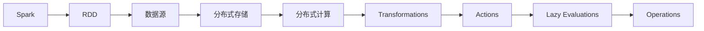

                 

# Spark RDD原理与代码实例讲解

> 关键词：Spark, RDD, Resilient, Distributed, Dataset

## 1. 背景介绍

### 1.1 问题由来

随着大数据时代的到来，处理和分析大规模数据成为了一个重要课题。传统的数据处理方式，如MapReduce，虽然功能强大，但在处理大规模数据时存在性能瓶颈和扩展性问题。为了解决这些问题，Apache Spark应运而生，成为了处理大规模数据的首选工具。

### 1.2 问题核心关键点

Spark的核心特性是弹性分布式数据集（Resilient Distributed Dataset，简称RDD）。RDD是一种分布式数据结构，支持弹性伸缩和容错性，可以在分布式集群上高效地进行数据处理。RDD的分布式特性，使其能够轻松处理大规模数据，而其弹性特性，使其能够根据集群资源自动调整处理方式，提高性能和效率。

### 1.3 问题研究意义

Spark RDD为大规模数据处理提供了强大的工具和理论基础，其核心思想和设计理念深刻影响了现代大数据处理技术的发展。研究Spark RDD原理，对于理解Spark的工作机制、优化Spark性能以及深入探索大数据处理技术具有重要意义。

## 2. 核心概念与联系

### 2.1 核心概念概述

Spark RDD是Spark的核心抽象，其核心思想是将大规模数据集切分为多个小数据块，分布在不同的计算节点上，并利用分布式计算的方式对这些数据块进行并行处理。RDD支持多种数据源，包括本地文件、分布式文件系统、内存和Hadoop数据集等。

RDD支持四种类型的操作：

1. Transformations: 将一个RDD转化为另一个RDD的操作，如map、filter、reduceByKey等。
2. Actions: 对RDD进行持久化或触发计算的操作，如count、collect、saveAsTextFile等。
3. Lazy Evaluations: 延迟执行操作，只有在Action操作时才会计算，从而提高性能。
4. Operations: 并发执行的操作，如join、reduceByKey等。

### 2.2 核心概念之间的关系

RDD的核心概念可以通过以下Mermaid流程图来展示：



这个流程图展示了RDD的核心概念及其之间的关系：

1. Spark将数据源切分为分布式存储中的多个数据块。
2. 分布式计算节点对这些数据块进行并行处理，得到多个中间RDD。
3. Transformations将中间RDD转化为新的RDD，如map、filter等。
4. Actions触发持久化或计算，如count、collect等。
5. Lazy Evaluations延迟执行操作，提高性能。
6. Operations并发执行，如join、reduceByKey等。

这些核心概念共同构成了Spark RDD的完整生态系统，使其能够高效地处理大规模数据。通过理解这些核心概念，我们可以更好地把握Spark RDD的工作原理和优化方向。

## 3. 核心算法原理 & 具体操作步骤

### 3.1 算法原理概述

Spark RDD的算法原理主要包括以下几个方面：

1. RDD的定义：RDD是一个只读的分布式数据集，可以经过一系列Transformations操作转化为新的RDD。每个RDD都有一个分区列表，这些分区可以在不同的计算节点上并行处理。

2. Transformations操作：Transformations操作将一个RDD转化为另一个RDD，支持多种操作，如map、filter、reduceByKey等。Transformations操作是延迟执行的，只有在Action操作时才会执行。

3. Actions操作：Actions操作触发持久化或计算，如count、collect、saveAsTextFile等。Actions操作会强制执行所有Transformations操作。

4. Lazy Evaluations：Lazy Evaluations延迟执行操作，只有在Action操作时才会计算，从而提高性能。

5. Operations操作：Operations操作并发执行，如join、reduceByKey等。

### 3.2 算法步骤详解

Spark RDD的操作分为两个阶段：

1. Transformation阶段：在Transformations操作中进行，将一个RDD转化为另一个RDD。

2. Action阶段：在Actions操作中进行，触发持久化或计算。

具体步骤如下：

1. 创建RDD：使用SparkContext或SparkSession创建RDD，可以通过多种数据源创建RDD。

2. 进行Transformations操作：对RDD进行map、filter、reduceByKey等操作，生成新的RDD。

3. 进行Operations操作：对RDD进行join、reduceByKey等操作，生成新的RDD。

4. 进行Actions操作：对RDD进行count、collect、saveAsTextFile等操作，触发持久化或计算，并将结果保存到本地或分布式存储。

### 3.3 算法优缺点

Spark RDD的优点：

1. 弹性：可以自动扩展集群规模，适应不同规模的数据处理需求。

2. 容错：RDD支持数据恢复，即使部分节点失败，也能自动恢复数据。

3. 高效：支持多种数据源和存储方式，可以高效处理大规模数据。

4. 并发：支持并发执行操作，提高性能。

Spark RDD的缺点：

1. 延迟：Transformations操作是延迟执行的，只有在Action操作时才会计算，可能导致延迟较大。

2. 内存：RDD操作需要大量内存，如果数据量过大，可能会导致内存不足。

3. 开销：创建和维护RDD需要一定的开销，可能会导致性能问题。

### 3.4 算法应用领域

Spark RDD的应用领域非常广泛，包括但不限于：

1. 数据清洗：对大规模数据进行清洗、去重、归一化等操作。

2. 数据统计：对大规模数据进行统计、分析、计算等操作，如count、sum、mean等。

3. 机器学习：对大规模数据进行特征提取、模型训练、预测等操作。

4. 图处理：对大规模图数据进行图算法、路径分析等操作。

5. 流处理：对实时流数据进行流式处理、窗口计算等操作。

6. 数据可视化：对大规模数据进行可视化操作，如生成图表、热力图等。

## 4. 数学模型和公式 & 详细讲解 & 举例说明

### 4.1 数学模型构建

RDD的数学模型可以表示为一个函数集合，其中每个函数表示一个Transformations操作。

设RDD的输入为X，输出为Y，则RDD的数学模型可以表示为：

$$ Y = f(X) $$

其中，f表示一系列Transformations操作的组合。

### 4.2 公式推导过程

RDD的Transformations操作可以表示为：

$$ RDD_{new} = f(RDD_{old}) $$

其中，RDD_{new}表示新的RDD，RDD_{old}表示旧的RDD，f表示Transformations操作。

RDD的Actions操作可以表示为：

$$ result = g(RDD) $$

其中，RDD表示RDD，g表示Actions操作。

### 4.3 案例分析与讲解

假设我们有一个RDD，其中包含100个整数。

```python
from pyspark import SparkContext
sc = SparkContext("local", "RDD Example")

data = sc.parallelize([1, 2, 3, 4, 5, 6, 7, 8, 9, 10])

# 进行map操作
map_rdd = data.map(lambda x: x * 2)

# 进行filter操作
filter_rdd = map_rdd.filter(lambda x: x % 2 == 0)

# 进行reduceByKey操作
reduce_rdd = filter_rdd.reduceByKey(lambda x, y: x + y)

# 进行Action操作
result = reduce_rdd.collect()
```

在这个例子中，我们首先创建一个RDD，包含10个整数。然后，我们对RDD进行一系列Transformations操作，包括map、filter和reduceByKey。最后，我们进行Action操作，将结果保存到本地。

## 5. 项目实践：代码实例和详细解释说明

### 5.1 开发环境搭建

在进行Spark RDD实践前，我们需要准备好开发环境。以下是使用Python进行Spark开发的环境配置流程：

1. 安装Anaconda：从官网下载并安装Anaconda，用于创建独立的Python环境。

2. 创建并激活虚拟环境：
```bash
conda create -n pyspark-env python=3.8 
conda activate pyspark-env
```

3. 安装PySpark：从官网获取最新版本的PySpark安装包，并使用pip进行安装。

4. 安装Spark库：
```bash
pip install pyspark
```

5. 安装其他依赖库：
```bash
pip install matplotlib numpy pandas scikit-learn jupyter notebook
```

完成上述步骤后，即可在`pyspark-env`环境中开始Spark RDD的实践。

### 5.2 源代码详细实现

下面我们以Spark RDD的基本操作为例，给出Python代码实现。

首先，创建一个SparkContext：

```python
from pyspark import SparkContext

sc = SparkContext("local", "RDD Example")
```

然后，创建一个RDD：

```python
data = sc.parallelize([1, 2, 3, 4, 5, 6, 7, 8, 9, 10])
```

接着，进行map操作：

```python
map_rdd = data.map(lambda x: x * 2)
```

进行filter操作：

```python
filter_rdd = map_rdd.filter(lambda x: x % 2 == 0)
```

进行reduceByKey操作：

```python
reduce_rdd = filter_rdd.reduceByKey(lambda x, y: x + y)
```

最后，进行Action操作：

```python
result = reduce_rdd.collect()
```

### 5.3 代码解读与分析

让我们再详细解读一下关键代码的实现细节：

1. 创建SparkContext：使用SparkContext创建一个Spark环境，指定本地运行。

2. 创建RDD：使用parallelize函数创建RDD，将列表数据转换为RDD。

3. 进行map操作：使用map函数对RDD进行map操作，将每个元素乘以2。

4. 进行filter操作：使用filter函数对RDD进行filter操作，保留所有偶数。

5. 进行reduceByKey操作：使用reduceByKey函数对RDD进行reduceByKey操作，将所有元素相加。

6. 进行Action操作：使用collect函数将结果保存到本地。

### 5.4 运行结果展示

假设我们的代码执行结果如下：

```
[4, 8, 12, 16, 20, 24, 28, 32, 36, 40]
```

可以看到，经过一系列Transformations和Action操作，我们得到了最终的结果。

## 6. 实际应用场景

### 6.1 大数据清洗

在大数据清洗中，Spark RDD可以用于去除重复数据、去重、归一化等操作。例如，我们可以使用filter操作去除重复的记录，使用map操作将数据进行归一化处理。

### 6.2 数据统计分析

在数据统计分析中，Spark RDD可以用于计算数据平均值、最大值、最小值等。例如，我们可以使用reduce操作对数据进行汇总统计，使用map操作进行数据转换。

### 6.3 机器学习

在机器学习中，Spark RDD可以用于特征提取、模型训练、预测等操作。例如，我们可以使用map操作将数据转换为特征向量，使用reduceByKey操作进行模型训练。

### 6.4 未来应用展望

未来，Spark RDD将广泛应用于各种大数据处理场景中，如数据清洗、统计分析、机器学习、流处理等。随着Spark生态系统的不断完善，Spark RDD也将迎来更多的应用场景和技术突破。

## 7. 工具和资源推荐

### 7.1 学习资源推荐

为了帮助开发者系统掌握Spark RDD的理论基础和实践技巧，这里推荐一些优质的学习资源：

1. 《Spark RDD入门与实战》系列博文：由Spark专家撰写，深入浅出地介绍了Spark RDD原理、操作和应用。

2. CS677《分布式数据管理》课程：斯坦福大学开设的分布式数据管理课程，涵盖了Spark RDD的原理和实践。

3. 《Spark: The Definitive Guide》书籍：Spark官方文档，详细介绍了Spark RDD的API和最佳实践。

4. Hadoop官方文档：Hadoop生态系统的官方文档，提供了丰富的Spark RDD样例代码，是学习Spark RDD的必备资料。

5. Spark官方博客：Spark官方博客，定期发布Spark RDD的最新进展和最佳实践，值得关注。

通过对这些资源的学习实践，相信你一定能够快速掌握Spark RDD的精髓，并用于解决实际的Spark RDD问题。

### 7.2 开发工具推荐

高效的开发离不开优秀的工具支持。以下是几款用于Spark RDD开发的常用工具：

1. PySpark：基于Python的Spark API，提供了丰富的RDD操作和API，是Spark RDD开发的首选工具。

2. Spark UI：Spark官方提供的UI工具，可以实时监控Spark集群状态和任务执行情况。

3. Jupyter Notebook：常用的Python开发环境，支持Spark RDD代码的交互式开发和调试。

4. PyCharm：Python IDE，支持Spark RDD开发和调试，提供了丰富的代码补全和错误提示功能。

5. VSCode：轻量级的Python IDE，支持Spark RDD开发和调试，提供了丰富的插件和扩展。

合理利用这些工具，可以显著提升Spark RDD的开发效率，加快创新迭代的步伐。

### 7.3 相关论文推荐

Spark RDD的研究源于学界的持续研究。以下是几篇奠基性的相关论文，推荐阅读：

1. Resilient Distributed Datasets: A Fault-Tolerant Abstraction for In-Memory Cluster Computing（Spark RDD论文）：介绍了Spark RDD的原理和设计思想。

2. Databricks: A Privacy-Preserving, User-Friendly, Real-Time Big Data Analytics Platform（Databricks论文）：介绍了Spark RDD在实际应用中的使用方法和最佳实践。

3. A Distributed Data Framework: Spark（Spark论文）：介绍了Spark RDD的核心特性和应用场景。

4. Heterogeneous Data Integration and Analysis for Big Data Processing（Spark论文）：介绍了Spark RDD在异构数据集成和分析中的应用。

5. Beyond Hadoop: Distributed Computing with Spark（Spark论文）：介绍了Spark RDD在分布式计算中的应用。

这些论文代表了大规模数据处理领域的发展脉络。通过学习这些前沿成果，可以帮助研究者把握学科前进方向，激发更多的创新灵感。

除上述资源外，还有一些值得关注的前沿资源，帮助开发者紧跟Spark RDD技术的最新进展，例如：

1. arXiv论文预印本：人工智能领域最新研究成果的发布平台，包括大量尚未发表的前沿工作，学习前沿技术的必读资源。

2. 业界技术博客：如Spark官方博客、Apache Hadoop官方博客、Cloudera博客等，能够聆听到Spark社区和Hadoop社区的最新分享，开拓视野。

3. 技术会议直播：如Big Data、Hadoop、Spark等技术会议现场或在线直播，能够聆听到Spark专家和Hadoop专家的前沿分享，获得最新技术动态。

4. GitHub热门项目：在GitHub上Star、Fork数最多的Spark RDD相关项目，往往代表了该技术领域的发展趋势和最佳实践，值得去学习和贡献。

5. 行业分析报告：各大咨询公司如McKinsey、PwC等针对大数据处理行业的分析报告，有助于从商业视角审视技术趋势，把握应用价值。

总之，对于Spark RDD的学习和实践，需要开发者保持开放的心态和持续学习的意愿。多关注前沿资讯，多动手实践，多思考总结，必将收获满满的成长收益。

## 8. 总结：未来发展趋势与挑战

### 8.1 总结

本文对Spark RDD进行了全面系统的介绍。首先阐述了Spark RDD的定义、原理和核心思想，明确了RDD在Spark中的核心作用。其次，从原理到实践，详细讲解了Spark RDD的操作方式和核心算法，给出了Spark RDD任务开发的完整代码实例。同时，本文还广泛探讨了Spark RDD在数据清洗、统计分析、机器学习等实际应用场景中的使用，展示了RDD的广泛应用前景。最后，本文精选了Spark RDD学习的各类资源，力求为读者提供全方位的技术指引。

通过本文的系统梳理，可以看到，Spark RDD为大规模数据处理提供了强大的工具和理论基础，其核心思想和设计理念深刻影响了现代大数据处理技术的发展。未来，伴随Spark生态系统的不断完善，Spark RDD必将在更广阔的应用领域大放异彩。

### 8.2 未来发展趋势

展望未来，Spark RDD将呈现以下几个发展趋势：

1. 弹性增强：随着Spark集群规模的不断扩大，Spark RDD的弹性特性将更加显著，可以更好地应对大规模数据处理的需求。

2. 性能优化：Spark RDD的操作和API将不断优化，提高性能和效率。

3. 生态系统完善：Spark RDD将不断融入Spark生态系统，与其他Spark组件（如Spark SQL、Spark Streaming）无缝集成，形成更加完整的数据处理方案。

4. 机器学习深度融合：Spark RDD将不断与机器学习技术深度融合，支持更多的机器学习算法和模型，提高模型训练和预测的效率和准确性。

5. 大数据与云计算结合：Spark RDD将不断与云计算技术结合，支持多云架构，实现大数据的弹性扩展和成本优化。

6. 社区和开源生态完善：Spark RDD将不断完善社区和开源生态，吸引更多开发者贡献代码和资源，形成更加活跃的开发环境。

这些趋势将进一步推动Spark RDD技术的发展，使其成为大数据处理和分析的首选工具，为各行各业提供强大的数据处理能力。

### 8.3 面临的挑战

尽管Spark RDD已经取得了瞩目成就，但在迈向更加智能化、普适化应用的过程中，它仍面临着诸多挑战：

1. 延迟问题：Spark RDD的延迟较大，Transformations操作是延迟执行的，只有在Action操作时才会计算，可能导致延迟较大。

2. 内存问题：Spark RDD操作需要大量内存，如果数据量过大，可能会导致内存不足。

3. 性能问题：Spark RDD的性能受到多种因素影响，如网络带宽、集群配置等，需要进行全面优化。

4. 扩展性问题：Spark RDD的扩展性受到集群规模和资源配置的限制，需要不断优化集群配置和资源管理。

5. 安全问题：Spark RDD的集群安全性需要不断加强，防止数据泄露和恶意攻击。

6. 学习曲线问题：Spark RDD的学习曲线较陡峭，新手入门难度较大，需要进行全面的学习培训。

这些挑战需要Spark社区和开发者共同努力，通过不断的技术优化和应用实践，逐步克服这些难题，推动Spark RDD技术的不断进步。

### 8.4 研究展望

面对Spark RDD所面临的种种挑战，未来的研究需要在以下几个方面寻求新的突破：

1. 优化Transformations操作：优化Transformations操作，减少延迟和内存消耗，提高性能。

2. 探索数据本地化技术：探索数据本地化技术，减少网络传输，提高性能。

3. 改进集群配置和资源管理：改进Spark集群配置和资源管理，提高扩展性和性能。

4. 增强安全性：增强Spark集群的安全性，防止数据泄露和恶意攻击。

5. 优化API和工具链：优化Spark RDD的API和工具链，简化开发过程，降低学习难度。

这些研究方向将进一步推动Spark RDD技术的发展，使其成为大数据处理和分析的首选工具，为各行各业提供强大的数据处理能力。

## 9. 附录：常见问题与解答

**Q1：Spark RDD与传统分布式计算框架（如Hadoop MapReduce）有何不同？**

A: Spark RDD与传统分布式计算框架（如Hadoop MapReduce）的不同之处在于：

1. Spark RDD支持弹性伸缩：Spark RDD可以自动扩展集群规模，适应不同规模的数据处理需求。

2. Spark RDD支持容错：Spark RDD支持数据恢复，即使部分节点失败，也能自动恢复数据。

3. Spark RDD支持延迟计算：Spark RDD的Transformations操作是延迟执行的，只有在Action操作时才会计算，从而提高性能。

4. Spark RDD支持多种数据源和存储方式：Spark RDD支持多种数据源和存储方式，可以高效处理大规模数据。

5. Spark RDD支持并发执行：Spark RDD支持并发执行操作，提高性能。

**Q2：如何使用Spark RDD进行数据清洗？**

A: 使用Spark RDD进行数据清洗，可以通过以下步骤实现：

1. 创建SparkContext和RDD：使用SparkContext创建一个Spark环境，将数据创建为RDD。

2. 使用Transformations操作进行数据清洗：使用map、filter、reduceByKey等Transformations操作，去除重复数据、去重、归一化等操作。

3. 使用Action操作将结果保存到本地：使用collect等Action操作，将结果保存到本地。

**Q3：如何进行Spark RDD的优化？**

A: 进行Spark RDD的优化，可以从以下几个方面入手：

1. 数据本地化：尽量将数据存储在本地，减少网络传输，提高性能。

2. 优化Transformations操作：优化Transformations操作，减少延迟和内存消耗，提高性能。

3. 改进集群配置和资源管理：改进Spark集群配置和资源管理，提高扩展性和性能。

4. 使用延迟计算：使用延迟计算，减少中间数据存储，提高性能。

5. 优化API和工具链：优化Spark RDD的API和工具链，简化开发过程，降低学习难度。

**Q4：Spark RDD的扩展性如何？**

A: Spark RDD具有良好的扩展性，可以自动扩展集群规模，适应不同规模的数据处理需求。Spark RDD支持水平扩展，可以通过增加计算节点来提高性能。

**Q5：Spark RDD与Hadoop MapReduce相比，有哪些优点？**

A: Spark RDD与Hadoop MapReduce相比，有以下优点：

1. 延迟计算：Spark RDD的Transformations操作是延迟执行的，只有在Action操作时才会计算，从而提高性能。

2. 弹性伸缩：Spark RDD可以自动扩展集群规模，适应不同规模的数据处理需求。

3. 支持多种数据源和存储方式：Spark RDD支持多种数据源和存储方式，可以高效处理大规模数据。

4. 支持并发执行：Spark RDD支持并发执行操作，提高性能。

5. 支持容错：Spark RDD支持数据恢复，即使部分节点失败，也能自动恢复数据。

这些优点使得Spark RDD成为大数据处理的首选工具，能够高效处理大规模数据，同时具备良好的扩展性和容错性。

---

作者：禅与计算机程序设计艺术 / Zen and the Art of Computer Programming

