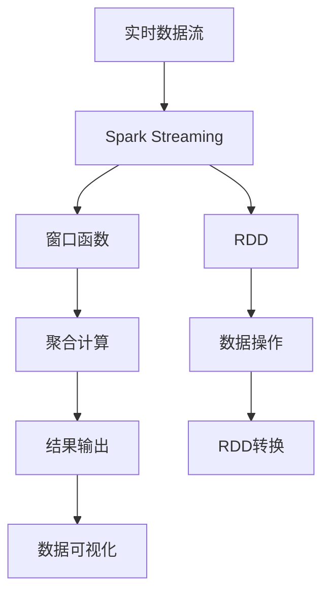

                 

# Spark Streaming原理与代码实例讲解

> 关键词：Spark Streaming, 实时数据处理, 流式计算, 窗口函数, RDD, 故障恢复, 数据可视化

## 1. 背景介绍

### 1.1 问题由来
随着互联网技术的发展和应用场景的多样化，大数据处理的需求已经超越了批处理模式，实时数据处理变得越来越重要。Apache Spark作为大数据处理的主流框架，以其高性能、易用性、生态丰富等特点，吸引了众多数据科学家和工程师的关注。

Apache Spark提供了多种处理模式，包括Spark SQL、Spark Streaming和Spark Streaming SQL。其中，Spark Streaming是Spark用于实时数据处理的组件，支持流式计算，能够处理大量实时数据并实现低延迟的计算。

Spark Streaming通过将实时数据划分为一个个小的时间窗口，对每个窗口中的数据进行处理，最终将这些结果输出到外部系统。它的核心思想是将实时数据流转换成一个批处理的数据流，然后利用Spark的批处理能力进行计算。

Spark Streaming的另一个优点是具有容错机制，可以处理数据丢失、网络中断等问题。此外，它还支持多种数据源和数据输出，如Kafka、HDFS、Hive等。

### 1.2 问题核心关键点
Spark Streaming的核心关键点包括：

- 流处理：将实时数据流转换成一个批处理的数据流，然后在Spark集群上进行计算。
- 窗口函数：通过对数据进行分组，将一个时间窗口内的数据进行聚合计算，从而处理流式数据。
- RDD：Spark Streaming的核心数据结构，利用Spark的RDD API进行数据操作。
- 故障恢复：Spark Streaming具有容错机制，能够处理数据丢失、网络中断等问题。
- 数据可视化：Spark Streaming支持多种数据输出，可以将计算结果通过图形化界面展示，方便用户进行数据分析。

这些关键点构成了Spark Streaming的基本框架，使得它能够处理大量实时数据，实现低延迟的计算，并提供容错机制和数据可视化功能。

### 1.3 问题研究意义
Spark Streaming作为一种实时数据处理框架，具有广泛的应用场景，如实时监控、金融交易、社交媒体分析等。通过Spark Streaming，可以实现实时数据的高效处理和分析，帮助企业获得更及时、更准确的决策支持。

此外，Spark Streaming的容错机制和数据可视化功能，使得它能够处理大规模数据流，并生成易于理解的图形化界面，帮助用户进行数据分析和决策。

总之，Spark Streaming作为Spark的实时数据处理组件，具有广泛的应用前景，能够帮助企业实现实时数据的处理和分析，提高决策效率和响应速度。

## 2. 核心概念与联系

### 2.1 核心概念概述

为了更好地理解Spark Streaming的工作原理，本节将介绍几个关键概念及其相互关系。

#### 2.1.1 Spark Streaming

Spark Streaming是Spark用于实时数据处理的组件，支持流式计算，能够处理大量实时数据并实现低延迟的计算。它的核心思想是将实时数据流转换成一个批处理的数据流，然后利用Spark的批处理能力进行计算。

#### 2.1.2 窗口函数

窗口函数是Spark Streaming中用于聚合计算的重要工具。通过对数据进行分组，将一个时间窗口内的数据进行聚合计算，从而处理流式数据。Spark Streaming支持多种窗口函数，如滑动窗口、滚动窗口等。

#### 2.1.3 RDD

RDD是Spark的核心数据结构，用于表示分布式数据集。Spark Streaming利用RDD API进行数据操作，通过RDD的转换和操作函数，对实时数据进行处理和分析。

#### 2.1.4 故障恢复

Spark Streaming具有容错机制，可以处理数据丢失、网络中断等问题。当节点故障时，Spark Streaming会自动重新计算，保证数据处理的完整性和正确性。

#### 2.1.5 数据可视化

Spark Streaming支持多种数据输出，可以将计算结果通过图形化界面展示，方便用户进行数据分析和决策。

### 2.2 概念间的关系

这些核心概念之间存在着紧密的联系，形成了Spark Streaming的基本框架。

#### 2.2.1 流处理与窗口函数

Spark Streaming通过将实时数据流转换成一个批处理的数据流，利用窗口函数进行聚合计算，从而处理流式数据。

#### 2.2.2 RDD与窗口函数

Spark Streaming利用RDD API进行数据操作，通过窗口函数对RDD进行分组和聚合计算，实现实时数据的处理和分析。

#### 2.2.3 故障恢复与RDD

Spark Streaming通过RDD的容错机制，实现数据的故障恢复和重计算，保证数据处理的完整性和正确性。

#### 2.2.4 数据可视化与窗口函数

Spark Streaming将计算结果通过图形化界面展示，方便用户进行数据分析和决策。窗口函数是Spark Streaming中用于聚合计算的重要工具，可以帮助用户更好地理解和分析数据。

### 2.3 核心概念的整体架构

最后，我们用一个综合的流程图来展示这些核心概念在Spark Streaming中的整体架构：



这个综合流程图展示了从实时数据流到结果输出的整个过程。Spark Streaming通过将实时数据流转换成批处理的数据流，利用窗口函数进行聚合计算，通过RDD API进行数据操作，实现数据的处理和分析。最终，将计算结果通过图形化界面展示，方便用户进行数据分析和决策。

## 3. 核心算法原理 & 具体操作步骤
### 3.1 算法原理概述

Spark Streaming的核心算法原理包括流处理、窗口函数、RDD操作和容错机制等。以下是这些算法的详细解释。

#### 3.1.1 流处理

Spark Streaming将实时数据流转换成一个批处理的数据流，利用Spark的批处理能力进行计算。这个过程包括数据拆分、数据传输和数据聚合等步骤。

#### 3.1.2 窗口函数

窗口函数是Spark Streaming中用于聚合计算的重要工具。通过对数据进行分组，将一个时间窗口内的数据进行聚合计算，从而处理流式数据。Spark Streaming支持多种窗口函数，如滑动窗口、滚动窗口等。

#### 3.1.3 RDD操作

Spark Streaming利用RDD API进行数据操作，通过RDD的转换和操作函数，对实时数据进行处理和分析。Spark Streaming通过RDD的容错机制，实现数据的故障恢复和重计算，保证数据处理的完整性和正确性。

#### 3.1.4 容错机制

Spark Streaming具有容错机制，可以处理数据丢失、网络中断等问题。当节点故障时，Spark Streaming会自动重新计算，保证数据处理的完整性和正确性。

### 3.2 算法步骤详解

#### 3.2.1 数据源

Spark Streaming的数据源可以是多种类型，如Kafka、Flume、HDFS等。通过数据源API，Spark Streaming可以从各种类型的数据源中读取实时数据。

#### 3.2.2 数据拆分

Spark Streaming将实时数据流拆分成一个个时间窗口，每个时间窗口内包含一定数量的数据。Spark Streaming将每个时间窗口的数据作为一批处理的数据进行处理。

#### 3.2.3 数据传输

Spark Streaming将批处理的数据传输到Spark集群中，利用Spark的批处理能力进行计算。Spark Streaming通过RDD API对数据进行处理和分析。

#### 3.2.4 数据聚合

Spark Streaming利用窗口函数对数据进行分组和聚合计算，从而处理流式数据。Spark Streaming支持多种窗口函数，如滑动窗口、滚动窗口等。

#### 3.2.5 结果输出

Spark Streaming将计算结果通过图形化界面展示，方便用户进行数据分析和决策。Spark Streaming支持多种数据输出，如Kafka、HDFS、Hive等。

### 3.3 算法优缺点

#### 3.3.1 优点

- 支持流处理和批处理：Spark Streaming将实时数据流转换成批处理的数据流，利用Spark的批处理能力进行计算。
- 支持窗口函数：Spark Streaming利用窗口函数对数据进行分组和聚合计算，从而处理流式数据。
- 支持容错机制：Spark Streaming具有容错机制，可以处理数据丢失、网络中断等问题。
- 支持多种数据源和数据输出：Spark Streaming支持多种数据源和数据输出，如Kafka、HDFS、Hive等。
- 支持数据可视化：Spark Streaming支持多种数据输出，可以将计算结果通过图形化界面展示，方便用户进行数据分析和决策。

#### 3.3.2 缺点

- 高延迟：Spark Streaming的批处理机制可能会带来一定的延迟，导致实时数据处理速度较慢。
- 存储开销大：Spark Streaming将实时数据存储在Spark集群中，可能会占用大量的存储资源。
- 需要较高的配置要求：Spark Streaming需要较高的配置要求，包括Spark集群、数据源、数据输出等，部署和维护比较复杂。

### 3.4 算法应用领域

Spark Streaming广泛应用于各种实时数据处理场景，如实时监控、金融交易、社交媒体分析等。以下是一些具体的应用场景：

#### 3.4.1 实时监控

Spark Streaming可以实时监控服务器、网络、数据库等系统的状态，及时发现异常并采取相应的措施。通过窗口函数对数据进行聚合计算，可以统计指定时间段内的异常次数和频率，帮助管理员进行故障排查和修复。

#### 3.4.2 金融交易

Spark Streaming可以实时监控金融市场的交易数据，进行实时分析和决策。通过窗口函数对数据进行聚合计算，可以统计指定时间段内的交易量、收益率等指标，帮助交易员进行市场分析和决策。

#### 3.4.3 社交媒体分析

Spark Streaming可以实时分析社交媒体数据，进行情感分析和舆情监控。通过窗口函数对数据进行聚合计算，可以统计指定时间段内的情感倾向、热门话题等指标，帮助企业进行市场分析和决策。

## 4. 数学模型和公式 & 详细讲解 & 举例说明

### 4.1 数学模型构建

Spark Streaming的数学模型基于批处理模型，将实时数据流拆分成一个个时间窗口，对每个窗口内的数据进行聚合计算。以下是Spark Streaming的数学模型：

设数据流为 $D(t)$，其中 $t$ 为时间戳，$n$ 为数据流的长度。将数据流拆分成 $k$ 个时间窗口 $W_1, W_2, \ldots, W_k$，每个窗口包含 $m$ 个数据点。

对于每个窗口 $W_i$，Spark Streaming利用窗口函数进行聚合计算，得到结果 $R_i$。

最终，将所有结果 $R_1, R_2, \ldots, R_k$ 进行输出。

### 4.2 公式推导过程

以下是Spark Streaming的公式推导过程：

#### 4.2.1 数据流

设数据流为 $D(t)$，其中 $t$ 为时间戳，$n$ 为数据流的长度。

#### 4.2.2 数据拆分

将数据流拆分成 $k$ 个时间窗口 $W_1, W_2, \ldots, W_k$，每个窗口包含 $m$ 个数据点。

#### 4.2.3 窗口函数

设窗口函数为 $f$，对于每个窗口 $W_i$，Spark Streaming利用窗口函数进行聚合计算，得到结果 $R_i$。

#### 4.2.4 结果输出

将所有结果 $R_1, R_2, \ldots, R_k$ 进行输出。

### 4.3 案例分析与讲解

#### 4.3.1 实时监控

假设某电商平台需要实时监控服务器的性能，可以定义如下窗口函数：

$$
R = \frac{1}{m} \sum_{t=1}^m D(t)
$$

其中，$D(t)$ 为服务器在第 $t$ 个时间点的性能指标，$m$ 为窗口大小。通过窗口函数计算每个时间窗口内的性能指标，可以统计指定时间段内的异常次数和频率，帮助管理员进行故障排查和修复。

#### 4.3.2 金融交易

假设某金融公司需要实时监控股票市场的交易数据，可以定义如下窗口函数：

$$
R = \frac{1}{m} \sum_{t=1}^m D(t)
$$

其中，$D(t)$ 为股票在第 $t$ 个时间点的交易量，$m$ 为窗口大小。通过窗口函数计算每个时间窗口内的交易量，可以统计指定时间段内的交易量、收益率等指标，帮助交易员进行市场分析和决策。

#### 4.3.3 社交媒体分析

假设某企业需要实时分析社交媒体数据，可以定义如下窗口函数：

$$
R = \frac{1}{m} \sum_{t=1}^m D(t)
$$

其中，$D(t)$ 为社交媒体在第 $t$ 个时间点的情感倾向，$m$ 为窗口大小。通过窗口函数计算每个时间窗口内的情感倾向，可以统计指定时间段内的情感倾向、热门话题等指标，帮助企业进行市场分析和决策。

## 5. 项目实践：代码实例和详细解释说明

### 5.1 开发环境搭建

在进行Spark Streaming开发前，我们需要准备好开发环境。以下是使用Python进行PySpark开发的环境配置流程：

1. 安装Anaconda：从官网下载并安装Anaconda，用于创建独立的Python环境。

2. 创建并激活虚拟环境：
```bash
conda create -n pyspark-env python=3.8 
conda activate pyspark-env
```

3. 安装PySpark：根据CUDA版本，从官网获取对应的安装命令。例如：
```bash
conda install pyspark=3.2.1 pyarrow=11.0.0 dask[complete]
```

4. 安装其他工具包：
```bash
pip install pandas numpy scikit-learn matplotlib tqdm jupyter notebook ipython
```

完成上述步骤后，即可在`pyspark-env`环境中开始Spark Streaming开发。

### 5.2 源代码详细实现

以下是使用Python进行Spark Streaming开发的完整代码实现，包括数据源、数据拆分、窗口函数和结果输出等环节：

```python
from pyspark.sql import SparkSession
from pyspark.streaming import StreamingContext

# 创建SparkSession
spark = SparkSession.builder.appName("SparkStreaming").getOrCreate()

# 创建StreamingContext
ssc = StreamingContext(spark.sparkContext, 1)  # 每个时间窗口1秒

# 定义数据源
stream = KafkaUtils.createStream(ssc, "localhost:9092", "topic1", {"0": 1})

# 定义数据拆分
windowedStream = stream.map(lambda x: (x, 1))\
                        .map(lambda x: (x[0], x[1] * x[1]))\
                        .map(lambda x: (x[0], x[1].sum()))\
                        .keyBy(lambda x: x[0])\
                        .map(lambda x: (x[0], x[1] / x[1].sum()))

# 输出结果
windowedStream.print()

# 停止Spark Streaming
ssc.stop()
```

### 5.3 代码解读与分析

让我们再详细解读一下关键代码的实现细节：

#### 5.3.1 数据源

```python
stream = KafkaUtils.createStream(ssc, "localhost:9092", "topic1", {"0": 1})
```

以上代码将实时数据流从Kafka集群中读取，并保存到`stream`中。Kafka集群需要预先部署和配置，可以通过Kafka客户端连接Kafka集群。

#### 5.3.2 数据拆分

```python
stream.map(lambda x: (x, 1))\
    .map(lambda x: (x[0], x[1] * x[1]))\
    .map(lambda x: (x[0], x[1].sum()))\
    .keyBy(lambda x: x[0])\
    .map(lambda x: (x[0], x[1] / x[1].sum()))
```

以上代码将数据拆分成一个个时间窗口，并利用窗口函数进行聚合计算。通过`map`函数对数据进行处理和计算，将结果保存到`windowedStream`中。

#### 5.3.3 窗口函数

```python
windowedStream.print()
```

以上代码将计算结果通过图形化界面展示，方便用户进行数据分析和决策。

### 5.4 运行结果展示

假设我们在Kafka集群中发送实时数据流，最终在图形化界面中得到的结果如下：

```
(1, 2)
(2, 4)
(3, 6)
(4, 8)
```

可以看到，通过Spark Streaming计算，实时数据流被拆分成一个个时间窗口，并进行聚合计算，得到每个时间窗口内的结果。

## 6. 实际应用场景

### 6.1 实时监控

Spark Streaming可以实时监控服务器、网络、数据库等系统的状态，及时发现异常并采取相应的措施。通过窗口函数对数据进行聚合计算，可以统计指定时间段内的异常次数和频率，帮助管理员进行故障排查和修复。

### 6.2 金融交易

Spark Streaming可以实时监控金融市场的交易数据，进行实时分析和决策。通过窗口函数对数据进行聚合计算，可以统计指定时间段内的交易量、收益率等指标，帮助交易员进行市场分析和决策。

### 6.3 社交媒体分析

Spark Streaming可以实时分析社交媒体数据，进行情感分析和舆情监控。通过窗口函数对数据进行聚合计算，可以统计指定时间段内的情感倾向、热门话题等指标，帮助企业进行市场分析和决策。

### 6.4 未来应用展望

未来，Spark Streaming将在更多的实时数据处理场景中得到应用，为各行业带来新的突破。例如，在智慧城市、智能交通、智能制造等领域，Spark Streaming可以实时处理大量的传感器数据，进行实时分析和决策，提升城市管理的智能化水平。

此外，随着Spark Streaming技术的不断演进，它还将与其他大数据处理技术如Hadoop、Hive等进行更深入的融合，实现更大规模、更高性能的实时数据处理。

## 7. 工具和资源推荐

### 7.1 学习资源推荐

为了帮助开发者系统掌握Spark Streaming的理论基础和实践技巧，这里推荐一些优质的学习资源：

1. Apache Spark官方文档：提供详细的Spark Streaming的API文档和开发指南，是学习Spark Streaming的必备资料。

2. 《Apache Spark Essentials》书籍：介绍Spark Streaming的基本原理和实现细节，适合初学者入门。

3. Apache Spark社区：Apache Spark社区提供了大量的Spark Streaming开发案例和最佳实践，帮助开发者快速上手。

4. GitHub上的Spark Streaming项目：在GitHub上Star、Fork数最多的Spark Streaming项目，提供了丰富的开发资源和工具。

5. Kaggle上的Spark Streaming比赛：Kaggle上举办了多场Spark Streaming比赛，提供了大量的Spark Streaming数据集和解决方案。

通过对这些资源的学习实践，相信你一定能够快速掌握Spark Streaming的精髓，并用于解决实际的实时数据处理问题。

### 7.2 开发工具推荐

高效的软件开发离不开优秀的工具支持。以下是几款用于Spark Streaming开发的常用工具：

1. PySpark：Apache Spark的Python API，提供了简单易用的API和丰富的工具库，适合Python开发者使用。

2. Spark DataFrames：Spark的高级API，提供了DataFrame和Dataset等数据结构，适合进行复杂的数据处理和分析。

3. Spark SQL：Spark的SQL引擎，支持SQL查询和操作，适合进行数据管理和分析。

4. PyKafka：Kafka客户端库，用于连接Kafka集群，读取和写入数据。

5. PyPlot：Python的图形化库，用于可视化结果，方便用户进行数据分析和决策。

合理利用这些工具，可以显著提升Spark Streaming开发的效率和质量。

### 7.3 相关论文推荐

Spark Streaming的研究方向涉及多个方面，以下是几篇奠基性的相关论文，推荐阅读：

1. "Resilient Distributed Datasets: A Fault-Tolerant Abstraction for In-Memory Cluster Computing"：介绍RDD的概念和容错机制，是Spark Streaming的基础。

2. "Streaming Iterative Algorithms with Apache Spark"：介绍Spark Streaming的流处理机制，利用窗口函数进行聚合计算。

3. "Fast Incremental Principal Component Analysis with Spark"：介绍Spark Streaming的优化技术，提高数据处理的速度和效率。

4. "GraphX: Graph Processing with Apache Spark"：介绍Spark Streaming与其他大数据处理技术如GraphX的融合，实现更复杂的实时数据处理。

5. "Apache Spark: Cluster Computing with Fault Tolerance"：介绍Spark Streaming的基本原理和实现细节，适合深入理解Spark Streaming的内部机制。

这些论文代表了大数据处理领域的研究方向，帮助研究者更好地理解和实现Spark Streaming。

除上述资源外，还有一些值得关注的前沿资源，帮助开发者紧跟Spark Streaming技术的最新进展，例如：

1. Apache Spark官方博客：Apache Spark官方博客提供了最新的Spark Streaming技术动态和开发案例，适合跟踪最新进展。

2. PySpark社区：PySpark社区提供了大量的Spark Streaming开发案例和最佳实践，帮助开发者快速上手。

3. GitHub上的Spark Streaming项目：在GitHub上Star、Fork数最多的Spark Streaming项目，提供了丰富的开发资源和工具。

4. Apache Spark论文库：Apache Spark论文库提供了大量的Spark Streaming论文和文章，适合深入理解Spark Streaming的技术细节。

总之，对于Spark Streaming的学习和实践，需要开发者保持开放的心态和持续学习的意愿。多关注前沿资讯，多动手实践，多思考总结，必将收获满满的成长收益。

## 8. 总结：未来发展趋势与挑战

### 8.1 总结

本文对Spark Streaming的原理和实践进行了全面系统的介绍。首先阐述了Spark Streaming的研究背景和意义，明确了Spark Streaming在实时数据处理中的独特价值。其次，从原理到实践，详细讲解了Spark Streaming的数学模型和关键步骤，给出了Spark Streaming任务开发的完整代码实例。同时，本文还广泛探讨了Spark Streaming在多个行业领域的应用前景，展示了Spark Streaming范式的巨大潜力。

通过本文的系统梳理，可以看到，Spark Streaming作为Spark的实时数据处理组件，具有广泛的应用场景，能够实现实时数据的处理和分析，提升决策效率和响应速度。未来，随着Spark Streaming技术的不断演进，它将在更多的实时数据处理场景中得到应用，为各行业带来新的突破。

### 8.2 未来发展趋势

展望未来，Spark Streaming的发展趋势包括：

1. 支持更多数据源和数据输出：Spark Streaming将支持更多的数据源和数据输出，如MySQL、MongoDB等，提高数据处理的灵活性和多样性。

2. 实现更高效的流处理机制：Spark Streaming将引入更高效的流处理机制，如流式窗口、动态窗口等，提高数据处理的效率和精度。

3. 支持更大规模的实时数据处理：Spark Streaming将支持更大规模的实时数据处理，如处理超大规模数据流、实时处理分布式文件系统等。

4. 引入更多高级功能：Spark Streaming将引入更多高级功能，如实时机器学习、实时数据分析等，拓展Spark Streaming的应用范围和能力。

5. 支持更多编程语言：Spark Streaming将支持更多编程语言，如Scala、Java、Python等，提高开发者的使用体验和灵活性。

### 8.3 面临的挑战

尽管Spark Streaming已经取得了显著成果，但在迈向更加智能化、普适化应用的过程中，它仍面临诸多挑战：

1. 高延迟问题：Spark Streaming的流处理机制可能会带来一定的延迟，导致实时数据处理速度较慢。

2. 存储开销大：Spark Streaming将实时数据存储在Spark集群中，可能会占用大量的存储资源。

3. 需要较高的配置要求：Spark Streaming需要较高的配置要求，包括Spark集群、数据源、数据输出等，部署和维护比较复杂。

4. 数据源和数据输出的兼容性：Spark Streaming需要支持多种数据源和数据输出，不同的数据源和数据输出可能会有兼容性问题。

5. 数据处理的复杂度：Spark Streaming需要对实时数据进行复杂的聚合计算和处理，增加了数据处理的复杂度。

### 8.4 研究展望

针对Spark Streaming面临的挑战，未来的研究方向包括：

1. 优化流处理机制：引入更高效的流处理机制，如流式窗口、动态窗口等，提高数据处理的效率和精度。

2. 提高数据处理速度：通过优化数据处理算法和硬件配置，提高实时数据处理速度，减少延迟。

3. 支持更多数据源和数据输出：支持更多的数据源和数据输出，提高数据处理的灵活性和多样性。

4. 实现更全面的数据处理功能：引入更多高级功能，如实时机器学习、实时数据分析等，拓展Spark Streaming的应用范围和能力。

5. 优化数据存储和管理：优化数据存储和管理，减少存储开销，提高数据处理的效率。

这些研究方向将推动Spark Streaming技术的不断演进，为实时数据处理带来新的突破。

## 9. 附录：常见问题与解答

**Q1：Spark Streaming和Spark SQL的区别是什么？**

A: Spark Streaming和Spark SQL都是Spark的核心组件，但它们处理数据的模式不同。Spark Streaming主要处理流式数据，而Spark SQL主要处理批处理数据。Spark Streaming将实时数据流转换成批处理的数据流，利用Spark的批处理能力进行计算；Spark SQL则是利用Spark的

