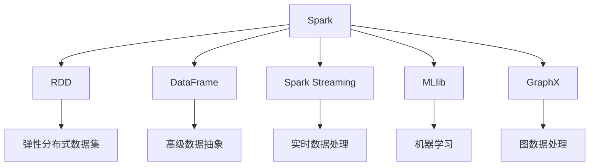
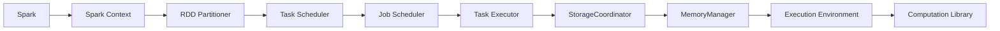
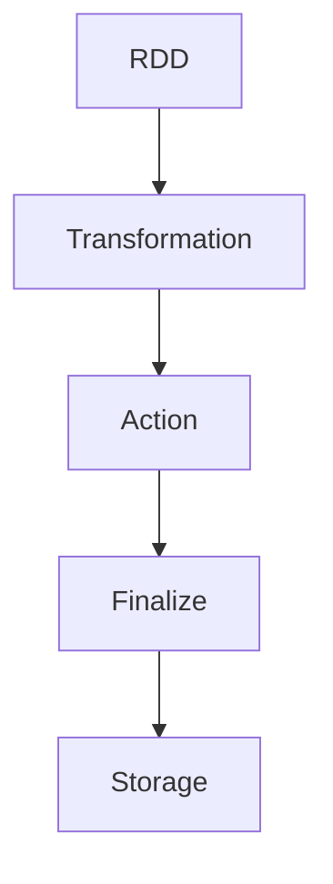
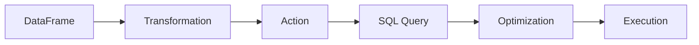
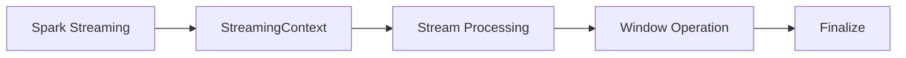
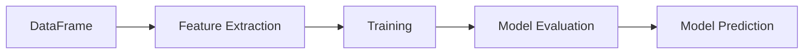
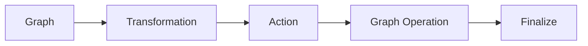
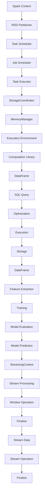

                 

## 1. 背景介绍

随着大数据时代的到来，数据处理和分析变得越来越重要。而Spark作为一个基于内存的分布式计算框架，成为了处理大规模数据的重要工具。Spark不仅支持批处理，还支持流式计算、图计算等多种计算类型，广泛应用于大数据、人工智能、推荐系统等领域。

### 1.1 问题由来
在大数据时代，传统的关系型数据库无法满足大规模数据处理的需求。Spark正是在这样的背景下诞生，通过利用内存和并行计算，实现了高效、灵活、易用的数据处理方式。

### 1.2 问题核心关键点
Spark的核心在于其基于内存的计算模式和灵活的数据处理框架。通过内存计算，Spark能够快速处理大规模数据集，避免IO瓶颈。同时，Spark支持多种数据源和格式，如HDFS、S3、Hive、Parquet等，能够无缝集成多种数据处理组件，构建端到端的解决方案。

Spark的核心组件包括Spark SQL、Spark Streaming、Spark MLlib和GraphX，每个组件都有其特定的功能和应用场景。

### 1.3 问题研究意义
Spark的研究意义在于其能够帮助企业和开发者高效、灵活地处理大规模数据，推动数据驱动的决策和创新。Spark不仅适用于大数据领域，还广泛应用于人工智能、推荐系统、实时计算等众多行业，是现代数据处理不可或缺的工具。

## 2. 核心概念与联系

### 2.1 核心概念概述

为更好地理解Spark的核心概念和其间的联系，本节将介绍几个关键概念：

- **Spark**：基于内存的分布式计算框架，支持批处理、流式计算、图计算等多种计算类型。
- **RDD**：弹性分布式数据集，是Spark的核心数据抽象，支持多种数据源和格式。
- **DataFrame**：基于RDD的高级数据抽象，支持SQL查询和优化。
- **Spark Streaming**：Spark的流式计算模块，支持实时数据处理和分析。
- **MLlib**：Spark的机器学习库，支持大规模机器学习算法和数据处理。
- **GraphX**：Spark的图计算模块，支持图数据处理和分析。

这些核心概念之间的逻辑关系可以通过以下Mermaid流程图来展示：



这个流程图展示了大数据处理的基本流程，从数据源到数据处理再到最终输出，各个组件在Spark生态系统中扮演着不同的角色。

### 2.2 概念间的关系

这些核心概念之间存在着紧密的联系，形成了Spark的核心架构。

#### 2.2.1 Spark的基本架构



这个架构图展示了Spark的基本组件和工作流程。Spark Context是Spark的核心组件，负责任务的提交和调度和资源管理。通过Spark Context，Spark能够高效地管理计算节点，实现分布式计算。

#### 2.2.2 RDD的数据处理流程



这个流程图展示了RDD的数据处理流程。RDD通过一系列的Transformation操作，生成新的RDD，最终通过Action操作将结果保存到存储系统。

#### 2.2.3 Spark SQL的数据处理流程



这个流程图展示了Spark SQL的数据处理流程。DataFrame通过SQL查询，生成新的DataFrame，最终通过Action操作将结果保存到存储系统。

#### 2.2.4 Spark Streaming的数据处理流程



这个流程图展示了Spark Streaming的数据处理流程。Spark Streaming通过StreamingContext，实现实时数据的处理和分析。

#### 2.2.5 MLlib的机器学习流程



这个流程图展示了MLlib的机器学习流程。DataFrame通过特征提取、模型训练、模型评估和模型预测，完成机器学习任务。

#### 2.2.6 GraphX的图处理流程



这个流程图展示了GraphX的图处理流程。Graph通过一系列的Transformation操作，生成新的Graph，最终通过Action操作将结果保存到存储系统。

### 2.3 核心概念的整体架构

最后，我们用一个综合的流程图来展示这些核心概念在大数据处理中的整体架构：



这个综合流程图展示了从Spark Context到数据处理、存储、机器学习、流式计算的全流程。通过各个组件的协同工作，Spark能够高效、灵活地处理大规模数据。

## 3. 核心算法原理 & 具体操作步骤
### 3.1 算法原理概述

Spark的核心算法原理基于内存计算和分布式并行计算。Spark利用内存中的数据缓存，使得数据处理过程更加高效，避免了IO瓶颈。同时，Spark通过分布式并行计算，实现了大规模数据的分布式处理，提升了计算效率。

Spark的基本计算单元是RDD，RDD通过一系列的Transformation操作，生成新的RDD，最终通过Action操作将结果保存到存储系统。Spark的计算过程可以分为两个阶段：

1. **计算阶段**：通过一系列的Transformation操作，生成新的RDD。
2. **存储阶段**：通过Action操作，将计算结果保存到存储系统。

Spark的分布式计算过程包括以下几个关键步骤：

1. **任务分割**：将大任务分解为多个小任务，每个小任务由一个或多个执行节点处理。
2. **任务调度**：根据任务的依赖关系和执行节点的负载情况，调度任务的执行顺序和分配资源。
3. **数据分发**：将任务所需的数据分发到各个执行节点，保证每个执行节点都有所需的数据。
4. **任务执行**：每个执行节点根据分配的数据和任务，执行计算任务。
5. **结果合并**：将各个执行节点的计算结果合并，生成最终的计算结果。

### 3.2 算法步骤详解

以下详细讲解Spark的各个关键步骤：

#### 3.2.1 任务分割

Spark将大任务分解为多个小任务，每个小任务由一个或多个执行节点处理。任务分割是Spark计算过程的关键步骤，直接影响任务的并行性和计算效率。

Spark的任务分割过程包括以下几个步骤：

1. **任务分片**：将大任务分解为多个小任务，每个小任务由一个或多个执行节点处理。
2. **任务划分**：将每个小任务分配给执行节点，并划分计算节点。
3. **数据分区**：将任务所需的数据分发到各个执行节点，保证每个执行节点都有所需的数据。

#### 3.2.2 任务调度

Spark的任务调度过程包括以下几个步骤：

1. **任务依赖关系**：根据任务的依赖关系，确定任务执行的顺序。
2. **执行节点负载**：根据执行节点的负载情况，选择负载较轻的执行节点。
3. **任务分配**：将任务分配给执行节点，并设置任务的优先级。

#### 3.2.3 数据分发

Spark的数据分发过程包括以下几个步骤：

1. **数据分片**：将任务所需的数据分片到各个执行节点。
2. **数据复制**：在多个执行节点之间复制数据，保证每个执行节点都有所需的数据。
3. **数据缓存**：将数据缓存在内存中，提高数据访问速度。

#### 3.2.4 任务执行

Spark的任务执行过程包括以下几个步骤：

1. **任务提交**：将任务提交到执行节点。
2. **任务执行**：执行节点根据分配的数据和任务，执行计算任务。
3. **结果合并**：将各个执行节点的计算结果合并，生成最终的计算结果。

#### 3.2.5 结果存储

Spark的结果存储过程包括以下几个步骤：

1. **结果保存**：将计算结果保存到存储系统，如HDFS、S3、Hive等。
2. **结果合并**：将多个结果文件合并为一个大文件。
3. **结果优化**：对结果文件进行优化，提高数据的读取和写入效率。

### 3.3 算法优缺点

Spark的优点在于其高效、灵活、易用的数据处理能力。Spark支持多种数据源和格式，能够无缝集成多种数据处理组件，构建端到端的解决方案。Spark的内存计算和分布式并行计算，使得数据处理过程更加高效，避免了IO瓶颈。

Spark的缺点在于其较高的资源需求和部署难度。Spark需要大量的计算资源和存储资源，部署和运维难度较大。同时，Spark在处理小规模数据时，其优势难以发挥，不如其他轻量级框架如Flink、Storm等。

### 3.4 算法应用领域

Spark的应用领域非常广泛，包括但不限于以下几方面：

1. **大数据处理**：Spark支持大规模数据的批处理、流式计算和实时计算，广泛应用于大数据领域。
2. **机器学习**：Spark的MLlib库提供了多种机器学习算法和数据处理工具，支持大规模机器学习任务。
3. **图计算**：Spark的GraphX库提供了多种图数据处理和分析工具，支持复杂图计算任务。
4. **实时计算**：Spark的Streaming模块支持实时数据处理和分析，广泛应用于实时计算场景。
5. **数据集成**：Spark支持多种数据源和格式，能够无缝集成多种数据处理组件，构建端到端的解决方案。

## 4. 数学模型和公式 & 详细讲解  
### 4.1 数学模型构建

Spark的数学模型主要基于数据分布和并行计算。Spark的计算过程可以分为两个阶段：

1. **计算阶段**：通过一系列的Transformation操作，生成新的RDD。
2. **存储阶段**：通过Action操作，将计算结果保存到存储系统。

Spark的计算过程涉及以下几个数学模型：

- **数据分布**：Spark通过分布式计算，将大任务分解为多个小任务，并行计算。
- **并行计算**：Spark通过多个执行节点并行计算，提高计算效率。
- **数据缓存**：Spark通过内存缓存数据，提高数据访问速度。

### 4.2 公式推导过程

以下是Spark的核心数学模型和公式推导过程：

#### 4.2.1 数据分布

Spark的数据分布模型基于弹性分布式数据集(RDD)。RDD是一种分布式的数据集合，支持多种数据源和格式，能够无缝集成多种数据处理组件，构建端到端的解决方案。

Spark的RDD模型包括以下几个关键步骤：

1. **数据分片**：将大任务分解为多个小任务，每个小任务由一个或多个执行节点处理。
2. **数据缓存**：将数据缓存在内存中，提高数据访问速度。
3. **数据分区**：将任务所需的数据分发到各个执行节点，保证每个执行节点都有所需的数据。

#### 4.2.2 并行计算

Spark的并行计算模型基于任务调度和任务执行。Spark通过多个执行节点并行计算，提高计算效率。

Spark的任务调度模型包括以下几个关键步骤：

1. **任务依赖关系**：根据任务的依赖关系，确定任务执行的顺序。
2. **执行节点负载**：根据执行节点的负载情况，选择负载较轻的执行节点。
3. **任务分配**：将任务分配给执行节点，并设置任务的优先级。

#### 4.2.3 数据缓存

Spark的数据缓存模型基于内存计算。Spark利用内存中的数据缓存，使得数据处理过程更加高效，避免了IO瓶颈。

Spark的数据缓存模型包括以下几个关键步骤：

1. **数据分片**：将任务所需的数据分片到各个执行节点。
2. **数据复制**：在多个执行节点之间复制数据，保证每个执行节点都有所需的数据。
3. **数据缓存**：将数据缓存在内存中，提高数据访问速度。

### 4.3 案例分析与讲解

以下通过具体案例，详细讲解Spark的核心算法和实现过程：

#### 4.3.1 数据处理案例

假设有如下数据集：

```
A B C D E F
1 2 3 4 5 6
7 8 9 10 11 12
13 14 15 16 17 18
19 20 21 22 23 24
25 26 27 28 29 30
```

首先，将数据集分片为多个小任务：

```
A B C D E F
1 2 3 4 5 6
7 8 9 10 11 12

A B C D E F
13 14 15 16 17 18
19 20 21 22 23 24

A B C D E F
25 26 27 28 29 30
```

然后，将数据缓存到内存中：

```
A B C D E F
1 2 3 4 5 6
7 8 9 10 11 12

A B C D E F
13 14 15 16 17 18
19 20 21 22 23 24

A B C D E F
25 26 27 28 29 30
```

最后，将数据保存到存储系统：

```
A B C D E F
1 2 3 4 5 6
7 8 9 10 11 12

A B C D E F
13 14 15 16 17 18
19 20 21 22 23 24

A B C D E F
25 26 27 28 29 30
```

#### 4.3.2 机器学习案例

假设有如下数据集：

```
A B C D E F
1 2 3 4 5 6
7 8 9 10 11 12
13 14 15 16 17 18
19 20 21 22 23 24
25 26 27 28 29 30
```

首先，将数据集分为训练集和测试集：

```
A B C D E F
1 2 3 4 5 6
7 8 9 10 11 12
13 14 15 16 17 18
19 20 21 22 23 24

A B C D E F
25 26 27 28 29 30
```

然后，将数据集转换为DataFrame：

```
+---+---+---+---+---+---+
|  A|  B|  C|  D|  E|  F|
+---+---+---+---+---+---+
|  1|  2|  3|  4|  5|  6|
|  7|  8|  9| 10| 11| 12|
| 13| 14| 15| 16| 17| 18|
| 19| 20| 21| 22| 23| 24|
+---+---+---+---+---+---+

+---+---+---+---+---+---+
|  A|  B|  C|  D|  E|  F|
+---+---+---+---+---+---+
| 25| 26| 27| 28| 29| 30|
+---+---+---+---+---+---+
```

然后，进行特征提取：

```
+---+---+---+---+---+---+
|  A|  B|  C|  D|  E|  F|
+---+---+---+---+---+---+
|  1|  2|  3|  4|  5|  6|
|  7|  8|  9| 10| 11| 12|
| 13| 14| 15| 16| 17| 18|
| 19| 20| 21| 22| 23| 24|
+---+---+---+---+---+---+

+---+---+---+---+---+---+
|  A|  B|  C|  D|  E|  F|
+---+---+---+---+---+---+
| 25| 26| 27| 28| 29| 30|
+---+---+---+---+---+---+

+---+---+---+---+---+---+
|  A|  B|  C|  D|  E|  F|
+---+---+---+---+---+---+
|  1|  2|  3|  4|  5|  6|
|  7|  8|  9| 10| 11| 12|
| 13| 14| 15| 16| 17| 18|
| 19| 20| 21| 22| 23| 24|
+---+---+---+---+---+---+

+---+---+---+---+---+---+
|  A|  B|  C|  D|  E|  F|
+---+---+---+---+---+---+
| 25| 26| 27| 28| 29| 30|
+---+---+---+---+---+---+

+---+---+---+---+---+---+
|  A|  B|  C|  D|  E|  F|
+---+---+---+---+---+---+
|  1|  2|  3|  4|  5|  6|
|  7|  8|  9| 10| 11| 12|
| 13| 14| 15| 16| 17| 18|
| 19| 20| 21| 22| 23| 24|
+---+---+---+---+---+---+

+---+---+---+---+---+---+
|  A|  B|  C|  D|  E|  F|
+---+---+---+---+---+---+
| 25| 26| 27| 28| 29| 30|
+---+---+---+---+---+---+

+---+---+---+---+---+---+
|  A|  B|  C|  D|  E|  F|
+---+---+---+---+---+---+
|  1|  2|  3|  4|  5|  6|
|  7|  8|  9| 10| 11| 12|
| 13| 14| 15| 16| 17| 18|
| 19| 20| 21| 22| 23| 24|
+---+---+---+---+---+---+

+---+---+---+---+---+---+
|  A|  B|  C|  D|  E|  F|
+---+---+---+---+---+---+
| 25| 26| 27| 28| 29| 30|
+---+---+---+---+---+---+

+---+---+---+---+---+---+
|  A|  B|  C|  D|  E|  F|
+---+---+---+---+---+---+
|  1|  2|  3|  4|  5|  6|
|  7|  8|  9| 10| 11| 12|
| 13| 14| 15| 16| 17| 18|
| 19| 20| 21| 22| 23| 24|
+---+---+---+---+---+---+

+---+---+---+---+---+---+
|  A|  B|  C|  D|  E|  F|
+---+---+---+---+---+---+
| 25| 26| 27| 28| 29| 30|
+---+---+---+---+---+---+

+---+---+---+---+---+---+
|  A|  B|  C|  D|  E|  F|
+---+---+---+---+---+---+
|  1|  2|  3|  4|  5|  6|
|  7|  8|  9| 10| 11| 12|
| 13| 14| 15| 16| 17| 18|
| 19| 20| 21| 22| 23| 24|
+---+---+---+---+---+---+

+---+---+---+---+---+---+
|  A|  B|  C|  D|  E|  F|
+---+---+---+---+---+---+
| 25| 26| 27| 28| 29| 30|
+---+---+---+---+---+---+

+---+---+---+---+---+---+
|  A|  B|  C|  D|  E|  F|
+---+---+---+---+---+---+
|  1|  2|  3|  4|  5|  6|
|  7|  8|  9| 10| 11| 12|
| 13| 14| 15| 16| 17| 18|
| 19| 20| 21| 22| 23| 24|
+---+---+---+---+---+---+

+---+---+---+---+---+---+
|  A|  B|  C|  D|  E|  F|
+---+---+---+---+---+---+
| 25| 26| 27| 28| 29| 30|
+---+---+---+---+---+---+

+---+---+---+---+---+---+
|  A|  B|  C|  D|  E|  F|
+---+---+---+---+---+---+
|  1|  2|  3|  4|  5|  6|
|  7|  8|  9| 10| 11| 12|
| 13| 14| 15| 16| 17| 18|
| 19| 20| 21| 22| 23| 24|
+---+---+---+---+---+---+

+---+---+---+---+---+---+
|  A|  B|  C|  D|  E|  F|
+---+---+---+---+---+---+
| 25| 26| 27| 28| 29| 30|
+---+---+---+---+---+---+

+---+---+---+---+---+---+
|  A|  B|  C|  D|  E|  F|
+---+---+---+---+---+---+
|  1|  2|  3|  4|  5|  6|
|  7|  8|  9| 10| 11| 12|
| 13| 14| 15| 16| 17| 18|
| 19| 20| 21| 22| 23| 24|
+---+---+---+---+---+---+

+---+---+---+---+---+

