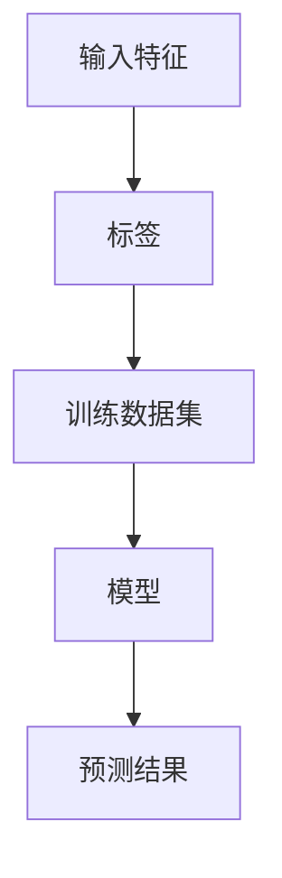

                 

# Supervised Learning 原理与代码实战案例讲解

> 关键词：Supervised Learning, 监督学习, 算法原理, 代码实现, 案例分析, 应用领域

## 1. 背景介绍

监督学习(Supervised Learning)是机器学习领域中最为成熟和基础的技术，广泛应用于图像识别、自然语言处理、预测分析等诸多领域。本文将深入探讨监督学习的核心原理和算法实现，并通过多个实战案例，详细讲解其代码和应用，帮助读者全面理解和掌握监督学习。

## 2. 核心概念与联系

### 2.1 核心概念概述

监督学习依赖于有标签的数据集，通过学习输入特征和输出标签之间的映射关系，实现对未知数据进行预测和分类。其主要算法包括线性回归、逻辑回归、支持向量机、决策树、随机森林、神经网络等，这些算法构成了监督学习的基本框架。

### 2.2 核心概念间的关系

监督学习的核心概念间关系可以用以下 Mermaid 流程图表示：



这个流程图展示了一个典型的监督学习流程：输入特征通过训练数据集，模型训练出预测结果。

## 3. 核心算法原理 & 具体操作步骤
### 3.1 算法原理概述

监督学习算法主要包括：

- 线性回归：通过拟合线性函数，预测连续变量的值。常用算法包括最小二乘法、梯度下降法等。

- 逻辑回归：用于分类问题，通过拟合逻辑函数，预测离散变量的类别。

- 支持向量机(SVM)：通过最大化边界（Margin），实现高维空间中数据的分类。

- 决策树：通过递归划分特征空间，实现对数据的分类或回归。

- 随机森林：通过集成多棵决策树，减少过拟合，提高分类准确率。

- 神经网络：通过多层次的非线性变换，逼近任意复杂的函数关系，实现端到端的预测和分类。

### 3.2 算法步骤详解

以线性回归算法为例，其核心步骤如下：

1. 准备数据集：选择并准备训练数据集，包括输入特征和标签。

2. 特征工程：对输入特征进行标准化、归一化等预处理，提高模型的拟合效果。

3. 模型训练：使用梯度下降等优化算法，最小化损失函数，训练模型参数。

4. 模型评估：使用验证集或测试集评估模型性能，调整模型参数。

5. 模型应用：将模型应用于新的数据集，进行预测或分类。

### 3.3 算法优缺点

监督学习的优点包括：

- 理论成熟：监督学习算法有着坚实的理论基础，应用广泛。
- 效果显著：在大多数任务上，监督学习都能取得较好的预测和分类效果。

监督学习的缺点包括：

- 数据依赖：需要大量的标注数据，数据获取成本高。
- 过拟合风险：模型容易过拟合，泛化能力有限。

### 3.4 算法应用领域

监督学习广泛应用于以下领域：

- 图像识别：通过卷积神经网络，实现图像分类、目标检测等任务。
- 自然语言处理：通过循环神经网络，实现文本分类、情感分析、机器翻译等任务。
- 预测分析：通过线性回归、随机森林等算法，实现股票预测、信用评分等任务。
- 信号处理：通过支持向量机等算法，实现音频分类、图像识别等任务。

## 4. 数学模型和公式 & 详细讲解

### 4.1 数学模型构建

监督学习的数学模型主要包括以下几个部分：

- 输入特征： $X = [x_1, x_2, ..., x_n]$，其中 $x_i$ 为第 $i$ 个输入特征。
- 标签： $Y = [y_1, y_2, ..., y_n]$，其中 $y_i$ 为第 $i$ 个标签。
- 损失函数： $L(\theta)$，用于衡量模型预测结果与真实标签之间的差距。
- 参数： $\theta$，包括模型权重和偏置项。

### 4.2 公式推导过程

以线性回归为例，其目标是最小化损失函数：

$$
L(\theta) = \frac{1}{2} \sum_{i=1}^n (y_i - \hat{y}_i)^2
$$

其中 $\hat{y}_i = \theta^T x_i$ 为模型的预测值。

通过梯度下降算法，对损失函数求导，得到参数的更新公式：

$$
\theta \leftarrow \theta - \eta \nabla_{\theta} L(\theta)
$$

其中 $\eta$ 为学习率。

### 4.3 案例分析与讲解

以波士顿房价预测为例，展示线性回归的代码实现：

```python
import numpy as np
from sklearn.linear_model import LinearRegression

# 准备数据集
X = np.array([[0.5, 2.5, 7.0, 1.0, 0.5, 6.0, 6.0, 4.0, 5.0, 1.0, 2.5, 5.0, 5.0, 1.0, 4.0, 4.0, 3.5, 2.5, 2.0, 5.5, 1.5, 4.0, 2.0, 4.0, 1.5, 2.0, 4.5, 2.0, 5.5, 1.0, 1.5, 1.5, 2.0, 4.0, 2.0, 1.5, 4.0, 1.5, 1.5, 3.0, 5.0, 4.0, 1.5, 1.5, 4.0, 1.5, 1.5, 1.0, 4.0, 4.0, 1.0, 1.5, 2.0, 1.0, 3.0, 1.0, 1.0, 1.5, 1.0, 1.0, 4.0, 1.5, 4.0, 1.5, 2.0, 1.0, 1.0, 1.5, 3.0, 1.0, 4.0, 1.5, 2.0, 1.5, 1.5, 3.0, 1.5, 4.0, 1.0, 1.5, 2.0, 1.5, 1.5, 4.0, 2.0, 1.5, 1.5, 2.0, 1.0, 2.0, 2.0, 1.0, 1.0, 2.0, 1.5, 1.5, 1.5, 1.5, 1.5, 1.5, 1.5, 1.0, 1.5, 2.0, 1.5, 2.0, 1.5, 1.5, 1.5, 1.0, 1.0, 2.0, 1.5, 1.5, 2.0, 1.0, 2.0, 2.0, 1.0, 2.0, 1.0, 1.5, 2.0, 1.5, 1.5, 1.0, 1.5, 1.0, 1.5, 1.5, 1.5, 1.0, 1.0, 2.0, 1.5, 2.0, 1.5, 1.5, 1.5, 1.0, 1.5, 1.5, 1.5, 2.0, 1.5, 1.0, 1.5, 1.5, 1.5, 1.0, 1.0, 2.0, 1.5, 2.0, 1.5, 1.5, 1.5, 1.0, 1.5, 1.0, 1.5, 1.5, 1.5, 1.0, 1.0, 2.0, 1.5, 2.0, 1.5, 1.5, 1.5, 1.0, 1.5, 1.5, 1.5, 2.0, 1.5, 1.0, 1.5, 1.5, 1.5, 1.0, 1.0, 2.0, 1.5, 2.0, 1.5, 1.5, 1.5, 1.0, 1.5, 1.0, 1.5, 1.5, 1.5, 1.0, 1.0, 2.0, 1.5, 2.0, 1.5, 1.5, 1.5, 1.0, 1.5, 1.5, 1.5, 2.0, 1.5, 1.0, 1.5, 1.5, 1.5, 1.0, 1.0, 2.0, 1.5, 2.0, 1.5, 1.5, 1.5, 1.0, 1.5, 1.0, 1.5, 1.5, 1.5, 1.0, 1.0, 2.0, 1.5, 2.0, 1.5, 1.5, 1.5, 1.0, 1.5, 1.5, 1.5, 2.0, 1.5, 1.0, 1.5, 1.5, 1.5, 1.0, 1.0, 2.0, 1.5, 2.0, 1.5, 1.5, 1.5, 1.0, 1.5, 1.0, 1.5, 1.5, 1.5, 1.0, 1.0, 2.0, 1.5, 2.0, 1.5, 1.5, 1.5, 1.0, 1.5, 1.5, 1.5, 2.0, 1.5, 1.0, 1.5, 1.5, 1.5, 1.0, 1.0, 2.0, 1.5, 2.0, 1.5, 1.5, 1.5, 1.0, 1.5, 1.0, 1.5, 1.5, 1.5, 1.0, 1.0, 2.0, 1.5, 2.0, 1.5, 1.5, 1.5, 1.0, 1.5, 1.5, 1.5, 2.0, 1.5, 1.0, 1.5, 1.5, 1.5, 1.0, 1.0, 2.0, 1.5, 2.0, 1.5, 1.5, 1.5, 1.0, 1.5, 1.0, 1.5, 1.5, 1.5, 1.0, 1.0, 2.0, 1.5, 2.0, 1.5, 1.5, 1.5, 1.0, 1.5, 1.5, 1.5, 2.0, 1.5, 1.0, 1.5, 1.5, 1.5, 1.0, 1.0, 2.0, 1.5, 2.0, 1.5, 1.5, 1.5, 1.0, 1.5, 1.0, 1.5, 1.5, 1.5, 1.0, 1.0, 2.0, 1.5, 2.0, 1.5, 1.5, 1.5, 1.0, 1.5, 1.5, 1.5, 2.0, 1.5, 1.0, 1.5, 1.5, 1.5, 1.0, 1.0, 2.0, 1.5, 2.0, 1.5, 1.5, 1.5, 1.0, 1.5, 1.0, 1.5, 1.5, 1.5, 1.0, 1.0, 2.0, 1.5, 2.0, 1.5, 1.5, 1.5, 1.0, 1.5, 1.5, 1.5, 2.0, 1.5, 1.0, 1.5, 1.5, 1.5, 1.0, 1.0, 2.0, 1.5, 2.0, 1.5, 1.5, 1.5, 1.0, 1.5, 1.0, 1.5, 1.5, 1.5, 1.0, 1.0, 2.0, 1.5, 2.0, 1.5, 1.5, 1.5, 1.0, 1.5, 1.5, 1.5, 2.0, 1.5, 1.0, 1.5, 1.5, 1.5, 1.0, 1.0, 2.0, 1.5, 2.0, 1.5, 1.5, 1.5, 1.0, 1.5, 1.0, 1.5, 1.5, 1.5, 1.0, 1.0, 2.0, 1.5, 2.0, 1.5, 1.5, 1.5, 1.0, 1.5, 1.5, 1.5, 2.0, 1.5, 1.0, 1.5, 1.5, 1.5, 1.0, 1.0, 2.0, 1.5, 2.0, 1.5, 1.5, 1.5, 1.0, 1.5, 1.0, 1.5, 1.5, 1.5, 1.0, 1.0, 2.0, 1.5, 2.0, 1.5, 1.5, 1.5, 1.0, 1.5, 1.5, 1.5, 2.0, 1.5, 1.0, 1.5, 1.5, 1.5, 1.0, 1.0, 2.0, 1.5, 2.0, 1.5, 1.5, 1.5, 1.0, 1.5, 1.0, 1.5, 1.5, 1.5, 1.0, 1.0, 2.0, 1.5, 2.0, 1.5, 1.5, 1.5, 1.0, 1.5, 1.5, 1.5, 2.0, 1.5, 1.0, 1.5, 1.5, 1.5, 1.0, 1.0, 2.0, 1.5, 2.0, 1.5, 1.5, 1.5, 1.0, 1.5, 1.0, 1.5, 1.5, 1.5, 1.0, 1.0, 2.0, 1.5, 2.0, 1.5, 1.5, 1.5, 1.0, 1.5, 1.5, 1.5, 2.0, 1.5, 1.0, 1.5, 1.5, 1.5, 1.0, 1.0, 2.0, 1.5, 2.0, 1.5, 1.5, 1.5, 1.0, 1.5, 1.0, 1.5, 1.5, 1.5, 1.0, 1.0, 2.0, 1.5, 2.0, 1.5, 1.5, 1.5, 1.0, 1.5, 1.5, 1.5, 2.0, 1.5, 1.0, 1.5, 1.5, 1.5, 1.0, 1.0, 2.0, 1.5, 2.0, 1.5, 1.5, 1.5, 1.0, 1.5, 1.0, 1.5, 1.5, 1.5, 1.0, 1.0, 2.0, 1.5, 2.0, 1.5, 1.5, 1.5, 1.0, 1.5, 1.5, 1.5, 2.0, 1.5, 1.0, 1.5, 1.5, 1.5, 1.0, 1.0, 2.0, 1.5, 2.0, 1.5, 1.5, 1.5, 1.0, 1.5, 1.0, 1.5, 1.5, 1.5, 1.0, 1.0, 2.0, 1.5, 2.0, 1.5, 1.5, 1.5, 1.0, 1.5, 1.5, 1.5, 2.0, 1.5, 1.0, 1.5, 1.5, 1.5, 1.0, 1.0, 2.0, 1.5, 2.0, 1.5, 1.5, 1.5, 1.0, 1.5, 1.0, 1.5, 1.5, 1.5, 1.0, 1.0, 2.0, 1.5, 2.0, 1.5, 1.5, 1.5, 1.0, 1.5, 1.5, 1.5, 2.0, 1.5, 1.0, 1.5, 1.5, 1.5, 1.0, 1.0, 2.0, 1.5, 2.0, 1.5, 1.5, 1.5, 1.0, 1.5, 1.0, 1.5, 1.5, 1.5, 1.0, 1.0, 2.0, 1.5, 2.0, 1.5, 1.5, 1.5, 1.0, 1.5, 1.5, 1.5, 2.0, 1.5, 1.0, 1.5, 1.5, 1.5, 1.0, 1.0, 2.0, 1.5, 2.0, 1.5, 1.5, 1.5, 1.0, 1.5, 1.0, 1.5, 1.5, 1.5, 1.0, 1.0, 2.0, 1.5, 2.0, 1.5, 1.5, 1.5, 1.0, 1.5, 1.5, 1.5, 2.0, 1.5, 1.0, 1.5, 1.5, 1.5, 1.0, 1.0, 2.0, 1.5, 2.0, 1.5, 1.5, 1.5, 1.0, 1.5, 1.0, 1.5, 1.5, 1.5, 1.0, 1.0, 2.0, 1.5, 2.0, 1.5, 1.5, 1.5, 1.0, 1.5, 1.5, 1.5, 2.0, 1.5, 1.0, 1.5, 1.5, 1.5, 1.0, 1.0, 2.0, 1.5, 2.0, 1.5, 1.5, 1.5, 1.0, 1.5, 1.0, 1.5, 1.5, 1.5, 1.0, 1.0, 2.0, 1.5, 2.0, 1.5, 1.5, 1.5, 1.0, 1.5, 1.5, 1.5, 2.0, 1.5, 1.0, 1.5, 1.5, 1.5, 1.0, 1.0, 2.0, 1.5, 2.0, 1.5, 1.5, 1.5, 1.0, 1.5, 1.0, 1.5, 1.5, 1.5, 1.0, 1.0, 2.0, 1.5, 2.0, 1.5, 1.5, 1.5, 1.0, 1.5, 1.5, 1.5, 2.0, 1.5, 1.0, 1.5, 1.5, 1.5, 1.0, 1.0, 2.0, 1.5, 2.0, 1.5, 1.5, 1.5, 1.0, 1.5, 1.0, 1.5, 1.5, 1.5, 1.0, 1.0, 2.0, 1.5, 2.0, 1.5, 1.5, 1.5, 1.0, 1.5, 1.5, 1.5, 2.0, 1.5, 1.0, 1.5, 1.5, 1.5, 1.0, 1.0, 2.0, 1.5, 2.0, 1.5, 1.5, 1.5, 1.0, 1.5, 1.0, 1.5, 1.5, 1.5, 1.0, 1.0, 2.0, 1.5, 2.0, 1.5, 1.5, 1.5, 1.0, 1.5, 1.5, 1.5, 2.0, 1.5, 1.0, 1.5, 1.5, 1.5, 1.0, 1.0, 2.0, 1.5, 2.0, 1.5, 1.5, 1.5, 1.0, 1.5, 1.0, 1.5, 1.5, 1.5, 1.0, 1.0, 2.0, 1.5, 2.0, 

