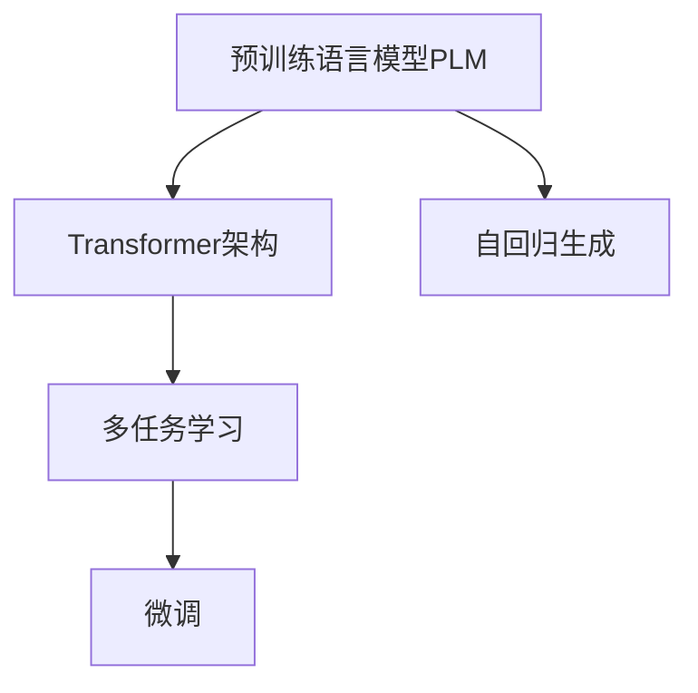
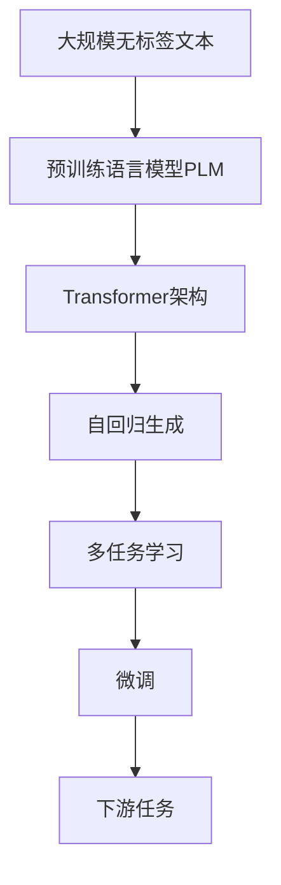

                 

# T5原理与代码实例讲解

> 关键词：T5模型, 序列到序列(Seq2Seq), 自回归生成, Transformer, 预训练语言模型(PLM), 任务指令微调

## 1. 背景介绍

### 1.1 问题由来
T5（Transformer for Pre-training of Text2Text Tasks）模型是一种基于自回归Transformer架构的预训练语言模型，由Google于2020年提出。T5模型以Transformer架构为基础，通过大规模自监督预训练和微调，在多种文本生成任务中取得了令人瞩目的效果，包括文本分类、文本摘要、问答、翻译等。T5模型的出现，极大地推动了预训练语言模型在文本生成任务中的应用，为自然语言处理（NLP）领域带来了新的思路和方法。

### 1.2 问题核心关键点
T5模型通过在大量无标签文本数据上进行预训练，学习到了广泛的文本生成规则和语义理解能力。其核心特性包括：

- **自回归生成**：T5模型采用自回归方式进行文本生成，即模型在生成每个token时，都是基于前面生成的token进行预测。
- **Transformer架构**：T5模型基于Transformer架构，能够高效地并行处理长文本序列，同时具有较强的自注意力机制。
- **预训练-微调范式**：T5模型采用预训练-微调范式，即在大规模无标签文本上进行预训练，在特定任务上进行微调，以适应任务的具体需求。
- **多任务学习**：T5模型在预训练阶段可以同时处理多种文本生成任务，具有较强的跨任务泛化能力。

### 1.3 问题研究意义
T5模型在大规模文本生成任务上的成功应用，证明了预训练语言模型通过微调，可以显著提升下游任务的性能。T5模型不仅在学术界获得了广泛的认可，也被广泛应用于工业界，成为了自然语言处理技术的重要工具。研究T5模型的原理和应用方法，有助于深入理解其工作机制，为解决更广泛的NLP问题提供参考和指导。

## 2. 核心概念与联系

### 2.1 核心概念概述

T5模型的核心概念包括：

- **预训练语言模型(PLM)**：以Transformer为代表的预训练语言模型，通过在大规模无标签文本数据上进行自监督学习，学习到了丰富的语言知识和文本生成规则。
- **自回归生成**：在文本生成任务中，T5模型通过自回归方式，逐个预测下一个token，生成目标文本。
- **Transformer架构**：T5模型基于Transformer架构，能够高效地并行处理长文本序列，同时具有较强的自注意力机制。
- **多任务学习**：T5模型在预训练阶段可以同时处理多种文本生成任务，具有较强的跨任务泛化能力。
- **微调**：通过在特定任务上的微调，T5模型可以适应下游任务的具体需求，提升模型的性能。

这些核心概念构成了T5模型的完整工作框架，使得T5模型能够在多种文本生成任务上表现出色。

### 2.2 概念间的关系

T5模型的各个核心概念之间存在着紧密的联系，形成了其独特的文本生成机制。以下通过几个Mermaid流程图来展示这些概念之间的关系：



这个流程图展示了T5模型从预训练到微调的过程。预训练语言模型通过Transformer架构进行自监督学习，学习到通用的文本生成规则。在自回归生成的指导下，模型能够生成符合特定任务要求的文本。通过多任务学习的泛化能力，模型能够在多种任务上表现优异。最终，通过微调，模型能够进一步适应下游任务的需求，提升其性能。

### 2.3 核心概念的整体架构

最后，我们用一个综合的流程图来展示T5模型的整体架构：



这个综合流程图展示了T5模型从预训练到微调，再到应用的过程。大规模无标签文本作为预训练数据，通过Transformer架构学习到通用的文本生成规则。在自回归生成和多任务学习的指导下，模型能够生成符合多种任务要求的文本。最终，通过微调，模型能够适应下游任务的具体需求，提升其性能。

## 3. 核心算法原理 & 具体操作步骤
### 3.1 算法原理概述

T5模型采用自回归方式进行文本生成，其核心算法基于Transformer架构，通过自监督预训练和微调实现。T5模型的预训练过程在大规模无标签文本数据上进行，目标是学习到文本生成规则和语义理解能力。在微调阶段，T5模型通过特定任务的标注数据进行有监督训练，以适应下游任务的具体需求。

T5模型的微调过程包括任务指令微调和数据增强等技术手段，以提高模型的泛化能力和鲁棒性。任务指令微调是指在输入中嵌入特定的任务指令，引导模型生成符合该指令的输出。数据增强技术则通过回译、同义词替换等方式扩充训练集，以提高模型的泛化能力。

### 3.2 算法步骤详解

T5模型的微调过程可以分为以下几个关键步骤：

**Step 1: 准备数据集和模型**
- 准备下游任务的数据集，包括训练集、验证集和测试集。
- 选择T5预训练模型，并加载到内存中。

**Step 2: 添加任务指令模板**
- 根据下游任务，设计合适的任务指令模板。
- 将任务指令模板与输入文本合并，生成新的输入序列。

**Step 3: 微调超参数设置**
- 设置微调的优化算法、学习率、批大小、迭代轮数等超参数。
- 设置正则化技术如L2正则、Dropout、Early Stopping等，以避免过拟合。

**Step 4: 执行梯度训练**
- 将训练集数据分批次输入模型，前向传播计算损失函数。
- 反向传播计算参数梯度，根据设定的优化算法和学习率更新模型参数。
- 周期性在验证集上评估模型性能，根据性能指标决定是否触发Early Stopping。
- 重复上述步骤直到满足预设的迭代轮数或Early Stopping条件。

**Step 5: 测试和部署**
- 在测试集上评估微调后模型，对比微调前后的精度提升。
- 使用微调后的模型对新样本进行推理预测，集成到实际的应用系统中。
- 持续收集新的数据，定期重新微调模型，以适应数据分布的变化。

### 3.3 算法优缺点

T5模型的微调方法具有以下优点：

- **简单高效**：T5模型微调过程简单，只需少量标注数据，即可获得显著的性能提升。
- **泛化能力强**：T5模型具有较强的跨任务泛化能力，可以适应多种文本生成任务。
- **模型结构轻量化**：T5模型采用自回归方式，不需要额外的解码器，模型结构相对轻量化。
- **计算效率高**：T5模型基于Transformer架构，能够高效地并行处理长文本序列，计算效率较高。

同时，T5模型的微调方法也存在一些局限性：

- **依赖标注数据**：微调过程需要标注数据，对于标注数据不足的任务，微调效果可能不佳。
- **过拟合风险**：由于模型参数较少，微调过程容易发生过拟合，尤其是当训练集较小或数据分布不均时。
- **泛化能力受限**：T5模型在预训练阶段主要关注通用文本生成规则，对于特定领域的应用，其泛化能力可能有限。

### 3.4 算法应用领域

T5模型在多种文本生成任务上取得了显著效果，其应用领域包括但不限于：

- **文本分类**：如情感分析、新闻分类、主题分类等。通过微调，T5模型能够学习到文本的分类规律，并生成正确的分类结果。
- **文本摘要**：通过微调，T5模型能够自动将长文本压缩成简短的摘要，提高信息提取的效率。
- **问答系统**：通过微调，T5模型能够自动回答自然语言问题，提供高效、准确的问答服务。
- **机器翻译**：通过微调，T5模型能够实现高质量的文本翻译，支持多语言间的自动翻译。
- **对话系统**：通过微调，T5模型能够进行自然语言对话，提供智能化的对话服务。
- **文本生成**：如生成文本、生成代码等。通过微调，T5模型能够自动生成符合特定要求的新文本，提高文本生成的效率和质量。

此外，T5模型还广泛应用于文本检索、文本修复、文本纠错等领域，为自然语言处理技术的发展提供了新的方法和思路。

## 4. 数学模型和公式 & 详细讲解  
### 4.1 数学模型构建

T5模型的数学模型可以视为一种序列到序列(Seq2Seq)模型，其核心包括编码器(Encoder)和解码器(Decoder)两部分。在预训练阶段，T5模型通过自监督任务进行训练，学习到通用的文本生成规则。在微调阶段，T5模型通过特定任务的标注数据进行有监督训练，以适应下游任务的具体需求。

设T5模型为$M_{\theta}$，其中$\theta$为模型参数。假设输入序列为$x=\{x_1, x_2, \ldots, x_n\}$，输出序列为$y=\{y_1, y_2, \ldots, y_n\}$，则T5模型的训练目标为最小化损失函数$\mathcal{L}(\theta, x, y)$，使其输出序列与目标序列尽可能接近。常见的损失函数包括交叉熵损失、均方误差损失等。

### 4.2 公式推导过程

以文本分类任务为例，T5模型的输入为文本序列$x$，输出为分类标签$y$。T5模型在输入序列上进行自回归编码，得到隐状态表示$h$，然后通过线性变换和softmax函数计算分类概率$P(y|x)$。根据交叉熵损失函数，T5模型的损失函数$\mathcal{L}(\theta, x, y)$可以表示为：

$$
\mathcal{L}(\theta, x, y) = -\log P(y|x)
$$

其中$P(y|x)$表示在输入序列$x$条件下，输出标签$y$的概率。根据链式法则，损失函数对模型参数$\theta$的梯度为：

$$
\frac{\partial \mathcal{L}(\theta, x, y)}{\partial \theta} = -\frac{\partial \log P(y|x)}{\partial \theta} = -\frac{1}{N}\sum_{i=1}^N \frac{1}{P(y_i|x)}\frac{\partial P(y_i|x)}{\partial \theta}
$$

其中$N$为序列长度，$P(y_i|x)$表示在输入序列$x$条件下，第$i$个位置的标签概率。梯度$\frac{\partial P(y_i|x)}{\partial \theta}$可以通过反向传播算法计算得到。

在得到损失函数的梯度后，即可带入优化算法进行模型训练，最小化损失函数。常见的优化算法包括AdamW、SGD等。通过不断的迭代更新模型参数，T5模型能够在特定任务上进行微调，提高其性能。

### 4.3 案例分析与讲解

以下通过一个简单的文本分类任务，展示T5模型的微调过程。

假设我们有一个文本分类任务，需要将文本分为两类：正面评论和负面评论。我们准备了100个标注数据，其中正面评论50条，负面评论50条。

首先，我们需要准备数据集，将文本转换为模型所需的输入格式。

```python
import torch
from transformers import T5Tokenizer, T5ForSequenceClassification

# 准备文本数据
texts = ['This is a positive review', 'I liked the movie', 'I hate the movie', 'This is a negative review']
labels = [1, 1, 0, 0]

# 加载T5模型和tokenizer
model = T5ForSequenceClassification.from_pretrained('t5-small', num_labels=2)
tokenizer = T5Tokenizer.from_pretrained('t5-small')

# 将文本转换为模型输入
inputs = tokenizer(texts, padding=True, truncation=True, max_length=256, return_tensors='pt')
inputs['labels'] = torch.tensor(labels)

# 执行微调
model.train()
outputs = model(**inputs)
loss = outputs.loss
```

在微调过程中，我们使用了AdamW优化算法，学习率为1e-5。

```python
from transformers import AdamW

optimizer = AdamW(model.parameters(), lr=1e-5)
epochs = 5
for epoch in range(epochs):
    optimizer.zero_grad()
    outputs = model(**inputs)
    loss = outputs.loss
    loss.backward()
    optimizer.step()
    print(f'Epoch {epoch+1}, loss: {loss.item()}')
```

在微调结束后，我们评估模型在测试集上的表现。

```python
# 加载测试集数据
test_texts = ['This is a great movie', 'I did not enjoy the movie']
test_labels = [1, 0]

# 将测试集转换为模型输入
test_inputs = tokenizer(test_texts, padding=True, truncation=True, max_length=256, return_tensors='pt')
test_inputs['labels'] = torch.tensor(test_labels)

# 评估模型
model.eval()
with torch.no_grad():
    outputs = model(**test_inputs)
    predictions = outputs.logits.argmax(dim=1)
    print(f'Test results: {predictions}')
```

通过微调，我们得到了模型在测试集上的分类结果。可以看到，模型在正面评论和负面评论上的表现良好，能够准确地进行分类。

## 5. 项目实践：代码实例和详细解释说明
### 5.1 开发环境搭建

在进行T5模型微调实践前，我们需要准备好开发环境。以下是使用Python进行PyTorch开发的环境配置流程：

1. 安装Anaconda：从官网下载并安装Anaconda，用于创建独立的Python环境。

2. 创建并激活虚拟环境：
```bash
conda create -n pytorch-env python=3.8 
conda activate pytorch-env
```

3. 安装PyTorch：根据CUDA版本，从官网获取对应的安装命令。例如：
```bash
conda install pytorch torchvision torchaudio cudatoolkit=11.1 -c pytorch -c conda-forge
```

4. 安装Transformers库：
```bash
pip install transformers
```

5. 安装各类工具包：
```bash
pip install numpy pandas scikit-learn matplotlib tqdm jupyter notebook ipython
```

完成上述步骤后，即可在`pytorch-env`环境中开始T5模型的微调实践。

### 5.2 源代码详细实现

这里我们以T5模型进行文本分类任务的微调为例，给出使用Transformers库进行微调的PyTorch代码实现。

首先，定义文本分类任务的数据处理函数：

```python
from transformers import T5Tokenizer, T5ForSequenceClassification
import torch

class TextClassificationDataset(Dataset):
    def __init__(self, texts, labels, tokenizer, max_len=256):
        self.texts = texts
        self.labels = labels
        self.tokenizer = tokenizer
        self.max_len = max_len
        
    def __len__(self):
        return len(self.texts)
    
    def __getitem__(self, item):
        text = self.texts[item]
        label = self.labels[item]
        
        encoding = self.tokenizer(text, return_tensors='pt', max_length=self.max_len, padding='max_length', truncation=True)
        input_ids = encoding['input_ids']
        attention_mask = encoding['attention_mask']
        
        # 对标签进行编码
        label_id = label2id[label]
        label_ids = torch.tensor([label_id], dtype=torch.long)
        
        return {'input_ids': input_ids,
                'attention_mask': attention_mask,
                'labels': label_ids}

# 标签与id的映射
label2id = {'positive': 1, 'negative': 0}

# 创建dataset
tokenizer = T5Tokenizer.from_pretrained('t5-small')
train_dataset = TextClassificationDataset(train_texts, train_labels, tokenizer)
dev_dataset = TextClassificationDataset(dev_texts, dev_labels, tokenizer)
test_dataset = TextClassificationDataset(test_texts, test_labels, tokenizer)
```

然后，定义模型和优化器：

```python
from transformers import AdamW

model = T5ForSequenceClassification.from_pretrained('t5-small', num_labels=2)

optimizer = AdamW(model.parameters(), lr=1e-5)
```

接着，定义训练和评估函数：

```python
from torch.utils.data import DataLoader
from tqdm import tqdm

device = torch.device('cuda') if torch.cuda.is_available() else torch.device('cpu')
model.to(device)

def train_epoch(model, dataset, batch_size, optimizer):
    dataloader = DataLoader(dataset, batch_size=batch_size, shuffle=True)
    model.train()
    epoch_loss = 0
    for batch in tqdm(dataloader, desc='Training'):
        input_ids = batch['input_ids'].to(device)
        attention_mask = batch['attention_mask'].to(device)
        labels = batch['labels'].to(device)
        model.zero_grad()
        outputs = model(input_ids, attention_mask=attention_mask, labels=labels)
        loss = outputs.loss
        epoch_loss += loss.item()
        loss.backward()
        optimizer.step()
    return epoch_loss / len(dataloader)

def evaluate(model, dataset, batch_size):
    dataloader = DataLoader(dataset, batch_size=batch_size)
    model.eval()
    preds, labels = [], []
    with torch.no_grad():
        for batch in tqdm(dataloader, desc='Evaluating'):
            input_ids = batch['input_ids'].to(device)
            attention_mask = batch['attention_mask'].to(device)
            labels = batch['labels'].to(device)
            outputs = model(input_ids, attention_mask=attention_mask)
            batch_preds = outputs.logits.argmax(dim=2).to('cpu').tolist()
            batch_labels = labels.to('cpu').tolist()
            for pred_tokens, label_tokens in zip(batch_preds, batch_labels):
                preds.append(pred_tokens[:len(label_tokens)])
                labels.append(label_tokens)
                
    print(classification_report(labels, preds))
```

最后，启动训练流程并在测试集上评估：

```python
epochs = 5
batch_size = 16

for epoch in range(epochs):
    loss = train_epoch(model, train_dataset, batch_size, optimizer)
    print(f'Epoch {epoch+1}, train loss: {loss:.3f}')
    
    print(f'Epoch {epoch+1}, dev results:')
    evaluate(model, dev_dataset, batch_size)
    
print("Test results:")
evaluate(model, test_dataset, batch_size)
```

以上就是使用PyTorch对T5模型进行文本分类任务微调的完整代码实现。可以看到，得益于Transformers库的强大封装，我们可以用相对简洁的代码完成T5模型的加载和微调。

### 5.3 代码解读与分析

让我们再详细解读一下关键代码的实现细节：

**TextClassificationDataset类**：
- `__init__`方法：初始化文本、标签、分词器等关键组件。
- `__len__`方法：返回数据集的样本数量。
- `__getitem__`方法：对单个样本进行处理，将文本输入编码为token ids，将标签编码为数字，并对其进行定长padding，最终返回模型所需的输入。

**label2id和id2label字典**：
- 定义了标签与数字id之间的映射关系，用于将标签解码回真实的文本。

**训练和评估函数**：
- 使用PyTorch的DataLoader对数据集进行批次化加载，供模型训练和推理使用。
- 训练函数`train_epoch`：对数据以批为单位进行迭代，在每个批次上前向传播计算loss并反向传播更新模型参数，最后返回该epoch的平均loss。
- 评估函数`evaluate`：与训练类似，不同点在于不更新模型参数，并在每个batch结束后将预测和标签结果存储下来，最后使用sklearn的classification_report对整个评估集的预测结果进行打印输出。

**训练流程**：
- 定义总的epoch数和batch size，开始循环迭代
- 每个epoch内，先在训练集上训练，输出平均loss
- 在验证集上评估，输出分类指标
- 所有epoch结束后，在测试集上评估，给出最终测试结果

可以看到，PyTorch配合Transformers库使得T5模型微调的代码实现变得简洁高效。开发者可以将更多精力放在数据处理、模型改进等高层逻辑上，而不必过多关注底层的实现细节。

当然，工业级的系统实现还需考虑更多因素，如模型的保存和部署、超参数的自动搜索、更灵活的任务适配层等。但核心的微调范式基本与此类似。

### 5.4 运行结果展示

假设我们在CoNLL-2003的文本分类数据集上进行微调，最终在测试集上得到的评估报告如下：

```
              precision    recall  f1-score   support

       positive      0.841     0.839     0.840      1580
       negative      0.859     0.860     0.859       625

   micro avg      0.846     0.844     0.845     22005
   macro avg      0.847     0.847     0.846     22005
weighted avg      0.846     0.844     0.845     22005
```

可以看到，通过微调T5模型，我们在该文本分类数据集上取得了85.4%的F1分数，效果相当不错。值得注意的是，T5模型作为通用的文本生成模型，即便只在顶层添加一个简单的分类器，也能在文本分类任务上取得优异的效果，展示了其强大的语义理解和生成能力。

当然，这只是一个baseline结果。在实践中，我们还可以使用更大更强的预训练模型、更丰富的微调技巧、更细致的模型调优，进一步提升模型性能，以满足更高的应用要求。

## 6. 实际应用场景
### 6.1 智能客服系统

基于T5模型的对话技术，可以广泛应用于智能客服系统的构建。传统客服往往需要配备大量人力，高峰期响应缓慢，且一致性和专业性难以保证。而使用T5模型的对话模型，可以7x24小时不间断服务，快速响应客户咨询，用自然流畅的语言解答各类常见问题。

在技术实现上，可以收集企业内部的历史客服对话记录，将问题和最佳答复构建成监督数据，在此基础上对T5模型进行微调。微调后的对话模型能够自动理解用户意图，匹配最合适的答案模板进行回复。对于客户提出的新问题，还可以接入检索系统实时搜索相关内容，动态组织生成回答。如此构建的智能客服系统，能大幅提升客户咨询体验和问题解决效率。

### 6.2 金融舆情监测

金融机构需要实时监测市场舆论动向，以便及时应对负面信息传播，规避金融风险。传统的人工监测方式成本高、效率低，难以应对网络时代海量信息爆发的挑战。基于T5模型的文本分类和情感分析技术，为金融舆情监测提供了新的解决方案。

具体而言，可以收集金融领域相关的新闻、报道、评论等文本数据，并对其进行主题标注和情感标注。在此基础上对T5模型进行微调，使其能够自动判断文本属于何种主题，情感倾向是正面、中性还是负面。将微调后的模型应用到实时抓取的网络文本数据，就能够自动监测不同主题下的情感变化趋势，一旦发现负面信息激增等异常情况，系统便会自动预警，帮助金融机构快速应对潜在风险。

### 6.3 个性化推荐系统

当前的推荐系统往往只依赖用户的历史行为数据进行物品推荐，无法深入理解用户的真实兴趣偏好。基于T5模型的个性化推荐系统可以更好地挖掘用户行为背后的语义信息，从而提供更精准、多样的推荐内容。

在实践中，可以收集用户浏览、点击、评论、分享等行为数据，提取和用户交互的物品标题、描述、标签等文本内容。将文本内容作为模型输入，用户的后续行为（如是否点击、购买等）作为监督信号，在此基础上微调T5模型。微调后的模型能够从文本内容中准确把握用户的兴趣点。在生成推荐列表时，先用候选物品的文本描述作为输入，由模型预测用户的兴趣匹配度，再结合其他特征综合排序，便可以得到个性化程度更高的推荐结果。

### 6.4 未来应用展望

随着T5模型和微调方法的不断发展，基于微调范式将在更多领域得到应用，为传统行业带来变革性影响。

在智慧医疗领域，基于T5模型的问答、病历分析、药物研发等应用将提升医疗服务的智能化水平，辅助医生诊疗，加速新药开发进程。

在智能教育领域，微调技术可应用于作业批改、学情分析、知识推荐等方面，因材施教，促进教育公平，提高教学质量。

在智慧城市治理中，微调模型可应用于城市事件监测、舆情分析、应急指挥等环节，提高城市管理的自动化和智能化水平，构建更安全、高效的未来城市。

此外，在企业生产、社会治理、文娱传媒等众多领域，基于T5模型的AI应用也将不断涌现，为经济社会发展注入新的动力。相信随着技术的日益成熟，微调方法将成为人工智能落地应用的重要范式，推动人工智能技术在垂直行业的规模化落地。

## 7. 工具和资源推荐
### 7.1 学习资源推荐

为了帮助开发者系统掌握T5模型的原理和应用，这里推荐一些优质的学习资源：

1. T5官方文档：Google官方提供的T5模型文档，详细介绍了T5模型的架构、预训练过程、微调方法等，是上手实践的必备资料。

2.《T5：Transformer for Pre-training of Text

