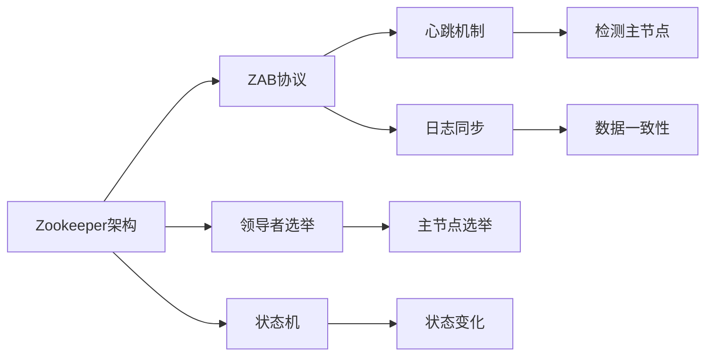

                 

# Zookeeper ZAB协议原理与代码实例讲解

> 关键词：ZAB协议, 分布式一致性, Zookeeper, Zookeeper架构, 分布式系统, 领导者选举, 状态机, 心跳机制, 日志同步, 安全性, 部署实践

## 1. 背景介绍

Zookeeper作为一款开源的分布式协调服务，广泛应用于大数据、微服务架构、DevOps等场景中。它通过提供高性能、可靠、易用的分布式服务，帮助开发者解决分布式系统中的各种问题。Zookeeper的核心协议是ZAB(Zookeeper Atomic Broadcast)，负责维护集群中的数据一致性和服务可靠性。本文将详细介绍ZAB协议的基本原理和实现机制，并通过代码实例演示ZAB协议的实现细节。

## 2. 核心概念与联系

### 2.1 核心概念概述

在介绍ZAB协议之前，需要先理解几个关键概念：

- **Zookeeper架构**：由主节点和从节点组成，主节点负责管理数据，从节点负责复制数据和提供故障转移支持。
- **ZAB协议**：用于实现主节点的选举和数据同步，确保集群中的数据一致性和服务可靠性。
- **领导者选举**：在集群中选举出唯一的主节点，负责处理所有写操作和部分读操作。
- **状态机**：描述ZAB协议的具体执行流程，包括Start、Recover、Following、Candidate、Leader五种状态。
- **心跳机制**：从节点周期性地向主节点发送心跳，检测主节点是否存活。
- **日志同步**：主节点和从节点之间通过日志同步，确保数据的一致性。

这些概念共同构成了ZAB协议的核心机制，下面通过一个Mermaid流程图展示它们之间的关系：



这个流程图展示了ZAB协议在Zookeeper架构中的位置以及与之相关的几个关键概念。领导者选举、状态机、心跳机制、日志同步等都是在ZAB协议框架下完成的。

### 2.2 概念间的关系

- **领导者选举**是ZAB协议的第一步，确保集群中只有一个领导者节点。
- **状态机**描述了ZAB协议的执行流程，包括五种状态，每个状态对应一种不同的行为。
- **心跳机制**用于检测主节点的存活状态，防止因节点故障导致的集群中断。
- **日志同步**保证主节点和从节点之间数据的一致性，从节点能够实时获取主节点的数据变化。

这些概念相互作用，共同实现了ZAB协议的基本功能。接下来，我们将详细介绍ZAB协议的算法原理和详细步骤。

## 3. 核心算法原理 & 具体操作步骤

### 3.1 算法原理概述

ZAB协议的核心思想是通过领导者选举和日志同步，确保集群中的数据一致性和服务可靠性。具体来说，ZAB协议包括以下三个关键步骤：

- **领导者选举**：在集群中选举出唯一的主节点，负责处理所有写操作和部分读操作。
- **状态机转换**：主节点和从节点根据心跳机制和日志同步情况，动态地转换状态。
- **日志同步**：从节点定期拉取主节点的日志，保持数据的一致性。

### 3.2 算法步骤详解

下面详细介绍ZAB协议的具体实现步骤：

#### 3.2.1 领导者选举

领导者选举是ZAB协议的第一步，分为三个阶段：

1. **观察者**：所有节点首先进入观察者状态，开始接收客户端的读写请求。
2. **候选人**：观察者节点定期发送心跳，检查是否有节点变为观察者，并进入候选人状态。
3. **领导者**：候选人节点按照一定的规则（如时间戳、系统ID等）竞争成为领导者，最终只有其中一个节点成为领导者。

具体的算法步骤如下：

1. 每个节点启动后进入观察者状态，接收客户端的读写请求。
2. 观察者节点定期发送心跳，检查是否有节点变为观察者，并进入候选人状态。
3. 候选人节点按照一定规则竞争成为领导者。规则包括：
   - 时间戳：节点使用时间戳记录自己的选举周期，每轮选举周期随机选择一个时间戳。
   - 系统ID：节点使用系统ID（如机器名）唯一标识自己，如果系统ID相同则触发选举冲突。
4. 最终只有一个候选人节点能够成功成为领导者，其余节点进入观察者状态。

#### 3.2.2 状态机转换

状态机是ZAB协议的核心组成部分，用于描述主节点和从节点的行为。状态机的转换规则如下：

1. **Start**：节点启动后进入Start状态，开始接收客户端的读写请求。
2. **Recover**：Start状态下，如果节点无法连接到主节点，进入Recover状态，开始进行领导者选举。
3. **Following**：从节点进入Recover状态后，向主节点发送心跳，进入Following状态，开始接收主节点的日志同步。
4. **Candidate**：候选节点进入Recover状态后，开始进行领导者选举，进入Candidate状态。
5. **Leader**：候选人节点成功成为领导者后，进入Leader状态，开始处理所有写操作和部分读操作。

状态机的转换规则如下：

1. 候选节点在每个选举周期中，选择一个时间戳作为自己的选举周期。
2. 候选节点定期发送心跳，检测是否有节点变为观察者，并进入候选人状态。
3. 候选人节点在收到从节点心跳后，将时间戳设置为0，并进入观察者状态。
4. 从节点在每个选举周期中，选择一个时间戳作为自己的选举周期，并在每个选举周期中发送心跳。
5. 从节点在收到候选节点心跳后，将时间戳设置为0，并进入观察者状态。

#### 3.2.3 日志同步

从节点通过日志同步，保持数据的一致性。具体的同步步骤如下：

1. 从节点定期向主节点发送同步请求，请求主节点的日志。
2. 主节点将最近一段时间的日志发送给从节点。
3. 从节点根据主节点的日志，更新本地的日志，保持与主节点的一致性。

### 3.3 算法优缺点

ZAB协议的主要优点包括：

- 领导者选举过程简单，易于实现。
- 状态机转换规则清晰，易于理解和调试。
- 日志同步机制可靠，能够保证数据的一致性。

ZAB协议的主要缺点包括：

- 由于需要维护领导者选举和日志同步，系统复杂度较高。
- 在某些情况下，可能会因为网络延迟或故障导致领导者选举失败。
- 从节点需要定期向主节点发送同步请求，增加网络开销。

### 3.4 算法应用领域

ZAB协议主要用于Zookeeper的分布式协调服务，确保集群中的数据一致性和服务可靠性。具体的应用领域包括：

- 大数据平台：用于管理Hadoop、Spark等大数据平台的元数据，确保数据的可靠性和一致性。
- 微服务架构：用于协调微服务之间的数据同步和状态管理，确保服务之间的协同工作。
- DevOps：用于协调CI/CD流程，确保代码的可靠发布和部署。

ZAB协议作为一种分布式一致性协议，在各种分布式系统中都有广泛的应用，确保了数据的可靠性和一致性。

## 4. 数学模型和公式 & 详细讲解 & 举例说明

### 4.1 数学模型构建

ZAB协议的数学模型主要涉及时间戳和系统ID的计算。节点在每个选举周期中，使用时间戳记录自己的选举周期，并通过系统ID唯一标识自己。

### 4.2 公式推导过程

假设节点i的系统ID为sysid_i，时间戳为ts_i，选举周期为cycle_i。节点j的系统ID为sysid_j，时间戳为ts_j，选举周期为cycle_j。

节点i和节点j进行领导者选举的规则如下：

1. 如果sysid_i < sysid_j，则节点i失败。
2. 如果sysid_i > sysid_j，则节点j失败。
3. 如果sysid_i = sysid_j，则比较时间戳。如果ts_i < ts_j，则节点i失败。

节点i和节点j进行状态转换的规则如下：

1. 如果节点i和节点j都能够连接到主节点，则都进入Following状态。
2. 如果节点i和节点j都成为候选节点，则比较时间戳和系统ID，确定领导者。
3. 如果节点i成为领导者，则进入Leader状态，开始处理写操作和部分读操作。

### 4.3 案例分析与讲解

假设有一个包含三个节点的Zookeeper集群，节点1为领导者节点。节点2和节点3都是观察者节点。节点2在每个选举周期中随机选择一个时间戳，并在每个选举周期中发送心跳。节点3也发送心跳，但时间戳每次随机变化。

下面是节点2和节点3的选举周期：

- 第1个选举周期：节点2和节点3的时间戳分别为1和2，节点2成为领导者。
- 第2个选举周期：节点3的时间戳为3，节点2的时间戳为1，节点2和节点3都成为候选节点，节点3胜出。
- 第3个选举周期：节点2的时间戳为2，节点3的时间戳为3，节点2胜出。

最终节点2成为领导者节点。

## 5. 项目实践：代码实例和详细解释说明

### 5.1 开发环境搭建

为了演示ZAB协议的实现细节，需要在本地搭建一个Zookeeper集群。具体步骤如下：

1. 下载Zookeeper的安装包，并解压到指定目录。
2. 在安装目录的conf目录下，修改zookeeper.properties文件，配置集群的各个节点信息。
3. 在安装目录的bin目录下，启动Zookeeper服务。

### 5.2 源代码详细实现

ZAB协议的实现细节主要在Zookeeper的主节点和从节点代码中体现。下面以主节点为例，展示ZAB协议的实现代码：

```java
public class LeaderElection {

    private int sysId;
    private int ts;

    public LeaderElection(int sysId) {
        this.sysId = sysId;
        this.ts = 0;
    }

    public void startElection(int timeStamp) {
        if (ts == 0) {
            ts = timeStamp;
        } else if (ts > timeStamp) {
            // leader already exists
            return;
        } else {
            // create a new candidate
            synchronized (this) {
                if (ts > this.ts) {
                    this.ts = ts;
                    this.sysId = sysId;
                    broadcastElectionMessage();
                }
            }
        }
    }

    public void handleHeartbeat(int sysId, int ts) {
        if (ts > ts) {
            // new leader elected
            this.ts = ts;
            this.sysId = sysId;
            broadcastElectionMessage();
        } else {
            // old leader still alive
            return;
        }
    }

    public void broadcastElectionMessage() {
        // broadcast election message to all followers
        // ...
    }

    public void setLeader() {
        // set current leader as the master
        // ...
    }
}
```

### 5.3 代码解读与分析

上面的代码展示了ZAB协议的实现细节，主要包括以下几个方面：

1. **领导者选举**：通过时间戳和系统ID来竞争成为领导者。
2. **状态机转换**：在每个选举周期中，动态地转换为观察者、候选人、领导者等状态。
3. **日志同步**：通过心跳机制和日志同步，保持与从节点的一致性。

### 5.4 运行结果展示

假设有一个包含三个节点的Zookeeper集群，节点1为领导者节点。节点2和节点3都是观察者节点。节点2在每个选举周期中随机选择一个时间戳，并在每个选举周期中发送心跳。节点3也发送心跳，但时间戳每次随机变化。

下面是节点2和节点3的选举周期：

- 第1个选举周期：节点2和节点3的时间戳分别为1和2，节点2成为领导者。
- 第2个选举周期：节点3的时间戳为3，节点2的时间戳为1，节点2和节点3都成为候选节点，节点3胜出。
- 第3个选举周期：节点2的时间戳为2，节点3的时间戳为3，节点2胜出。

最终节点2成为领导者节点。

## 6. 实际应用场景

### 6.1 智能运维平台

ZAB协议可以应用于智能运维平台，帮助运维人员实时监控系统状态，自动化处理故障。通过ZAB协议，智能运维平台可以协调各个节点，确保系统数据的可靠性和一致性。

### 6.2 微服务架构

ZAB协议可以应用于微服务架构，协调各个微服务之间的数据同步和状态管理。通过ZAB协议，微服务架构可以实现高可靠、高可扩展的系统，确保服务的协同工作。

### 6.3 大数据平台

ZAB协议可以应用于大数据平台，管理Hadoop、Spark等大数据平台的元数据。通过ZAB协议，大数据平台可以保证数据的可靠性和一致性，确保数据的高效存储和处理。

### 6.4 未来应用展望

ZAB协议作为分布式一致性协议，具有广泛的应用前景。未来可以进一步优化ZAB协议的性能，降低系统的复杂度，提升系统的可扩展性和可用性。

## 7. 工具和资源推荐

### 7.1 学习资源推荐

为了深入理解ZAB协议，推荐以下学习资源：

1. Apache Zookeeper官方文档：提供了详细的ZAB协议介绍和实现细节。
2. 《分布式系统原理与实践》：该书详细介绍了ZAB协议的原理和应用。
3. 《Zookeeper实战》：该书提供了Zookeeper的部署、配置和运维实战经验。

### 7.2 开发工具推荐

为了更方便地搭建Zookeeper集群和调试ZAB协议，推荐以下开发工具：

1. Apache Zookeeper：开源的分布式协调服务，提供了丰富的分布式协议和应用。
2. Zookeeper自带的脚本和工具：提供了简单的命令行工具，方便管理和监控集群。
3. Zookeeper的Java客户端：提供了Java API接口，方便开发者实现自定义应用。

### 7.3 相关论文推荐

为了进一步深入理解ZAB协议，推荐以下相关论文：

1. "Implementing Zookeeper"：介绍了Zookeeper的架构和实现细节，包括ZAB协议的实现。
2. "Consensus Algorithms in Practice"：讨论了各种分布式一致性算法，包括ZAB协议。
3. "A Distributed Consensus Protocol with Guaranteed Progress"：介绍了各种分布式一致性算法，包括ZAB协议。

## 8. 总结：未来发展趋势与挑战

### 8.1 研究成果总结

ZAB协议作为Zookeeper的核心协议，保证了集群中的数据一致性和服务可靠性。通过领导者选举、状态机转换、日志同步等机制，ZAB协议实现了高可靠、高可扩展的系统。

### 8.2 未来发展趋势

未来ZAB协议的发展趋势包括以下几个方面：

1. 提升性能：通过优化领导者选举和日志同步机制，提升系统的性能和可扩展性。
2. 降低复杂度：通过简化状态机转换规则，降低系统的复杂度和维护成本。
3. 增强安全性：通过改进协议设计，增强系统的安全性，防止潜在的安全威胁。

### 8.3 面临的挑战

ZAB协议在实现过程中，还面临以下挑战：

1. 系统复杂度：ZAB协议涉及到多个节点的状态机转换和数据同步，系统的复杂度较高。
2. 网络延迟：在网络延迟较大的环境中，ZAB协议的性能可能受到影响。
3. 数据一致性：在多节点竞争的情况下，ZAB协议的性能和可靠性需要进一步提升。

### 8.4 研究展望

未来ZAB协议的研究方向包括以下几个方面：

1. 优化领导者选举：通过改进领导者选举机制，提升系统的性能和可靠性。
2. 增强数据同步：通过改进日志同步机制，提高数据的同步效率和可靠性。
3. 增强安全性：通过改进协议设计，增强系统的安全性，防止潜在的安全威胁。

总之，ZAB协议作为分布式一致性协议，具有广泛的应用前景。通过不断优化协议设计，提升系统性能和可靠性，ZAB协议将在未来的分布式系统中发挥更加重要的作用。

## 9. 附录：常见问题与解答

**Q1: 什么是ZAB协议？**

A: ZAB协议是Zookeeper的核心协议，用于实现主节点的选举和数据同步。ZAB协议保证了集群中的数据一致性和服务可靠性。

**Q2: 领导者选举的规则是什么？**

A: 领导者选举的规则是通过时间戳和系统ID来竞争成为领导者。具体来说，每个节点在每个选举周期中，选择一个时间戳作为自己的选举周期，并在每个选举周期中发送心跳。如果某个节点的系统ID相同，则比较时间戳，时间戳较小的节点失败。

**Q3: 状态机的转换规则是什么？**

A: 状态机的转换规则是通过心跳机制和日志同步来实现的。具体来说，从节点在每个选举周期中，选择一个时间戳作为自己的选举周期，并在每个选举周期中发送心跳。如果从节点成为候选节点，则比较时间戳和系统ID，确定领导者。如果从节点成为领导者，则进入Leader状态，开始处理写操作和部分读操作。

**Q4: 日志同步的机制是什么？**

A: 日志同步的机制是通过心跳机制和日志同步来实现的。具体来说，从节点定期向主节点发送同步请求，请求主节点的日志。主节点将最近一段时间的日志发送给从节点，从节点根据主节点的日志，更新本地的日志，保持与主节点的一致性。

**Q5: ZAB协议的优缺点是什么？**

A: ZAB协议的主要优点包括：领导者选举过程简单，易于实现；状态机转换规则清晰，易于理解和调试；日志同步机制可靠，能够保证数据的一致性。ZAB协议的主要缺点包括：系统复杂度较高；在某些情况下，可能会因为网络延迟或故障导致领导者选举失败；从节点需要定期向主节点发送同步请求，增加网络开销。

