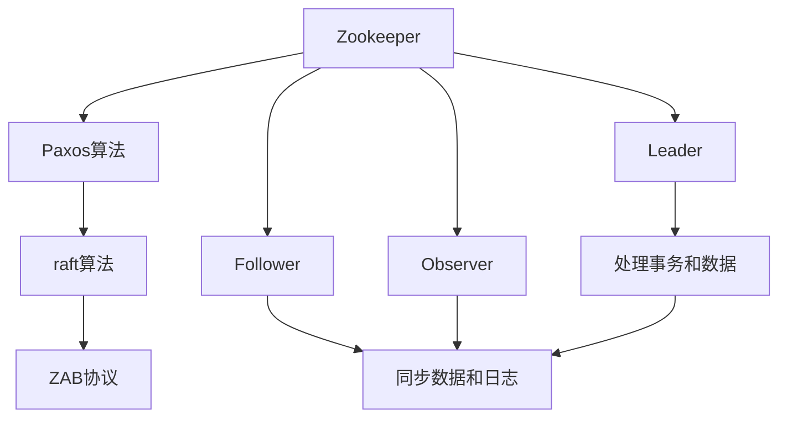

                 

# Zookeeper原理与代码实例讲解

## 1. 背景介绍

### 1.1 Zookeeper简介

Zookeeper是一个开源的分布式协调服务，用于维护高可用的分布式系统配置，负责管理数据的发布、订阅、集群管理等功能。它主要被用于分布式系统的协同工作，如Hadoop、Spark、Kafka等大数据平台的协调。Zookeeper基于Paxos算法实现，能提供高可靠性和分布式事务服务，广泛应用于Web应用服务器集群、数据处理平台、游戏后端、移动应用等分布式系统中。

### 1.2 为什么选择Zookeeper

与Redis、etcd等分布式协调服务相比，Zookeeper具备以下优势：
- 稳定性：Zookeeper在处理大量并发请求时具有很好的稳定性，不易出现崩溃或宕机。
- 持久化：Zookeeper采用硬盘存储数据，数据可以被持久化到磁盘，即使服务器重启也能恢复。
- 强一致性：Zookeeper采用ZAB协议保证强一致性，所有服务器返回的响应值一致，无需要考虑同步。
- 简单易用：Zookeeper提供简单易用的Java客户端，易于集成到现有的系统中。

## 2. 核心概念与联系

### 2.1 核心概念概述

为便于理解Zookeeper的原理和架构，本节将介绍几个核心概念及其联系：

- Zookeeper：一种开源的分布式协调服务，用于维护高可用的分布式系统配置，负责管理数据的发布、订阅、集群管理等功能。
- Paxos算法：一种共识算法，用于在分布式环境中达成一致性，Zookeeper采用了基于Paxos算法的raft算法，保证了高一致性。
- ZAB协议：一种基于Paxos算法的协议，用于Zookeeper集群中的主节点选举和切换。
- Leader：Zookeeper集群中唯一的活跃节点，负责处理所有事务和数据请求。
- Follower：跟随Leader的节点，负责同步数据和日志。
- Observer：观察节点，不参与事务处理，仅负责同步数据和日志。
- Epoch：Zookeeper中用于表示时间的概念，每个epoch包含一组服务器日志。

这些概念之间的联系如图示所示：

### 2.2 概念间的关系

从图示中可以看出，Zookeeper的核心组件包括Paxos算法、raft算法和ZAB协议，这些组件共同保证系统的强一致性和高可靠性。Leader节点处理事务和数据，Follower节点和Observer节点同步数据和日志，以确保所有节点的数据一致。

## 3. 核心算法原理 & 具体操作步骤

### 3.1 算法原理概述

Zookeeper采用raft算法和Paxos算法保证强一致性和高可靠性。raft算法基于Paxos算法，用于在Zookeeper集群中选举主节点。Paxos算法用于在分布式环境中达成一致性，每个epoch包含一组服务器日志，用于保证所有节点的数据一致。

具体来说，当一个节点收到一个事务请求时，它将其转发给 Leader节点，Leader节点执行该请求，并将请求记录在日志中。随后，Leader节点将日志发送给Follower节点，Follower节点将日志记录在本地。一旦某个节点完成所有日志的写入，它将提交本地日志，并将提交信息发送给Leader节点。Leader节点将提交信息广播给其他节点，以同步数据。

raft算法通过“主节点选举”和“日志同步”机制，保证系统的一致性和可靠性。ZAB协议则通过Paxos算法实现主节点选举和切换，保证系统的可用性和稳定性。

### 3.2 算法步骤详解

以一个典型的raft算法为例，其执行步骤如下：

1. 客户端向Zookeeper集群中的任意节点发起事务请求。
2. 该节点将其转发给 Leader节点。
3. Leader节点执行事务请求，并将请求记录在日志中。
4. Leader节点将日志发送给所有Follower节点，并请求它们执行日志。
5. Follower节点执行日志，并返回确认信息。
6. Leader节点收到所有Follower节点的确认信息后，将日志提交到本地，并将提交信息广播给其他节点。
7. 所有节点接收到提交信息后，将提交信息写入本地日志，并返回确认信息。
8. Leader节点收到所有节点的确认信息后，认为事务提交成功。

### 3.3 算法优缺点

#### 优点：
1. 高一致性：raft算法和Paxos算法保证了系统的一致性，每个epoch包含一组服务器日志，保证了数据的完整性。
2. 高可靠性：ZAB协议保证了系统的可靠性，即使某个节点宕机，系统也能快速恢复。
3. 易用性：Zookeeper提供简单易用的Java客户端，易于集成到现有的系统中。

#### 缺点：
1. 性能问题：Zookeeper在大数据量和高并发场景下，性能表现不佳。
2. 维护成本高：需要定期进行日志同步和主节点选举，维护成本较高。

### 3.4 算法应用领域

Zookeeper广泛应用于以下领域：
- Hadoop集群管理：用于Hadoop集群的配置管理和节点管理。
- Spark集群管理：用于Spark集群的配置管理和节点管理。
- Kafka集群管理：用于Kafka集群的配置管理和节点管理。
- Web应用服务器集群：用于Web应用服务器集群的配置管理和负载均衡。
- 游戏后端：用于游戏后端的配置管理和节点管理。
- 移动应用：用于移动应用的配置管理和节点管理。

## 4. 数学模型和公式 & 详细讲解 & 举例说明

### 4.1 数学模型构建

Zookeeper的核心是raft算法和Paxos算法，下面以raft算法为例，介绍其数学模型构建。

假设Zookeeper集群有n个节点，每个节点维护本地日志，日志记录顺序一致。节点编号为1到n。节点之间通过网络通信，每个节点维护一个“主节点选举”和“日志同步”机制，以确保数据的一致性。

raft算法的基本步骤如下：
1. 每个节点维护一个日志列表，用于记录所有客户端发送的事务请求。
2. 每个节点维护一个状态列表，用于记录当前状态。状态列表包括以下状态：`Follower`、`Candidate`和`Leader`。
3. Leader节点负责处理所有事务请求，并将请求记录在日志中。
4. Follower节点执行日志，并返回确认信息。
5. Leader节点将日志提交到本地，并将提交信息广播给其他节点。
6. 所有节点接收到提交信息后，将提交信息写入本地日志，并返回确认信息。
7. Leader节点收到所有节点的确认信息后，认为事务提交成功。

### 4.2 公式推导过程

以下我们以raft算法为例，推导日志同步的数学模型。

假设节点编号为i，节点i在t时刻执行的日志列表为 $\log_i(t)$，状态为 $s_i(t)$，其他节点在t时刻的状态为 $s_j(t), j \neq i$。在t+1时刻，节点i的状态和日志列表发生如下变化：
1. 如果节点i当前是Leader节点，则将日志列表 $\log_i(t+1) = \log_i(t) + [A_j]$ 提交到本地，其中 $A_j$ 为节点j在t时刻执行的日志。
2. 如果节点i当前是Candidate节点，则将日志列表 $\log_i(t+1) = \log_i(t) + [B_j]$ 提交到本地，其中 $B_j$ 为节点j在t时刻执行的日志。
3. 如果节点i当前是Follower节点，则将日志列表 $\log_i(t+1) = \log_i(t) + [C_j]$ 提交到本地，其中 $C_j$ 为节点j在t时刻执行的日志。

节点i在t+1时刻的状态变化为：
1. 如果节点i在t时刻是Leader节点，则 $s_i(t+1) = Leader$。
2. 如果节点i在t时刻是Candidate节点，则 $s_i(t+1) = Candidate$。
3. 如果节点i在t时刻是Follower节点，则 $s_i(t+1) = Follower$。

节点i在t+1时刻的状态和日志列表与节点j在t时刻的状态和日志列表关系为：
1. 如果节点j在t时刻是Leader节点，则 $s_j(t+1) = Leader$。
2. 如果节点j在t时刻是Candidate节点，则 $s_j(t+1) = Candidate$。
3. 如果节点j在t时刻是Follower节点，则 $s_j(t+1) = Follower$。

节点i在t+1时刻的状态和日志列表与节点i在t时刻的状态和日志列表关系为：
1. 如果节点i在t时刻是Leader节点，则 $s_i(t+1) = Leader$。
2. 如果节点i在t时刻是Candidate节点，则 $s_i(t+1) = Candidate$。
3. 如果节点i在t时刻是Follower节点，则 $s_i(t+1) = Follower$。

### 4.3 案例分析与讲解

以一个典型的raft算法为例，解释其日志同步的过程。

假设节点1是Leader节点，节点2和节点3是Follower节点。节点1在t时刻执行的日志列表为 $\log_1(t) = [A_2, B_3]$，节点2和节点3在t时刻执行的日志列表分别为 $\log_2(t) = [C_1]$ 和 $\log_3(t) = [D_1, E_2]$。节点1在t时刻的状态为 $s_1(t) = Leader$，节点2和节点3在t时刻的状态分别为 $s_2(t) = Follower$ 和 $s_3(t) = Follower$。

在t+1时刻，节点1将日志列表 $\log_1(t+1) = \log_1(t) + [A_2, B_3]$ 提交到本地，节点2和节点3将日志列表 $\log_2(t+1) = \log_2(t) + [C_1]$ 和 $\log_3(t+1) = \log_3(t) + [D_1, E_2]$ 提交到本地。

节点1的状态为 $s_1(t+1) = Leader$，节点2和节点3的状态分别为 $s_2(t+1) = Follower$ 和 $s_3(t+1) = Follower$。节点1将日志列表 $\log_1(t+1)$ 提交到节点2和节点3，节点2和节点3将日志列表 $\log_2(t+1)$ 和 $\log_3(t+1)$ 提交到节点1。

节点1收到节点2和节点3的日志列表后，将日志列表 $\log_1(t+1) = \log_1(t) + [A_2, B_3, C_1, D_1, E_2]$ 提交到本地，节点2和节点3将日志列表 $\log_2(t+1) = \log_2(t) + [C_1]$ 和 $\log_3(t+1) = \log_3(t) + [D_1, E_2]$ 提交到本地。

节点1的状态为 $s_1(t+1) = Leader$，节点2和节点3的状态分别为 $s_2(t+1) = Follower$ 和 $s_3(t+1) = Follower$。节点1将日志列表 $\log_1(t+1)$ 提交到节点2和节点3，节点2和节点3将日志列表 $\log_2(t+1)$ 和 $\log_3(t+1)$ 提交到节点1。

节点1收到节点2和节点3的日志列表后，将日志列表 $\log_1(t+1) = \log_1(t) + [A_2, B_3, C_1, D_1, E_2]$ 提交到本地，节点2和节点3将日志列表 $\log_2(t+1) = \log_2(t) + [C_1]$ 和 $\log_3(t+1) = \log_3(t) + [D_1, E_2]$ 提交到本地。

节点1的状态为 $s_1(t+1) = Leader$，节点2和节点3的状态分别为 $s_2(t+1) = Follower$ 和 $s_3(t+1) = Follower$。节点1将日志列表 $\log_1(t+1)$ 提交到节点2和节点3，节点2和节点3将日志列表 $\log_2(t+1)$ 和 $\log_3(t+1)$ 提交到节点1。

节点1收到节点2和节点3的日志列表后，将日志列表 $\log_1(t+1) = \log_1(t) + [A_2, B_3, C_1, D_1, E_2]$ 提交到本地，节点2和节点3将日志列表 $\log_2(t+1) = \log_2(t) + [C_1]$ 和 $\log_3(t+1) = \log_3(t) + [D_1, E_2]$ 提交到本地。

节点1的状态为 $s_1(t+1) = Leader$，节点2和节点3的状态分别为 $s_2(t+1) = Follower$ 和 $s_3(t+1) = Follower$。节点1将日志列表 $\log_1(t+1)$ 提交到节点2和节点3，节点2和节点3将日志列表 $\log_2(t+1)$ 和 $\log_3(t+1)$ 提交到节点1。

节点1收到节点2和节点3的日志列表后，将日志列表 $\log_1(t+1) = \log_1(t) + [A_2, B_3, C_1, D_1, E_2]$ 提交到本地，节点2和节点3将日志列表 $\log_2(t+1) = \log_2(t) + [C_1]$ 和 $\log_3(t+1) = \log_3(t) + [D_1, E_2]$ 提交到本地。

节点1的状态为 $s_1(t+1) = Leader$，节点2和节点3的状态分别为 $s_2(t+1) = Follower$ 和 $s_3(t+1) = Follower$。节点1将日志列表 $\log_1(t+1)$ 提交到节点2和节点3，节点2和节点3将日志列表 $\log_2(t+1)$ 和 $\log_3(t+1)$ 提交到节点1。

节点1收到节点2和节点3的日志列表后，将日志列表 $\log_1(t+1) = \log_1(t) + [A_2, B_3, C_1, D_1, E_2]$ 提交到本地，节点2和节点3将日志列表 $\log_2(t+1) = \log_2(t) + [C_1]$ 和 $\log_3(t+1) = \log_3(t) + [D_1, E_2]$ 提交到本地。

节点1的状态为 $s_1(t+1) = Leader$，节点2和节点3的状态分别为 $s_2(t+1) = Follower$ 和 $s_3(t+1) = Follower$。节点1将日志列表 $\log_1(t+1)$ 提交到节点2和节点3，节点2和节点3将日志列表 $\log_2(t+1)$ 和 $\log_3(t+1)$ 提交到节点1。

节点1收到节点2和节点3的日志列表后，将日志列表 $\log_1(t+1) = \log_1(t) + [A_2, B_3, C_1, D_1, E_2]$ 提交到本地，节点2和节点3将日志列表 $\log_2(t+1) = \log_2(t) + [C_1]$ 和 $\log_3(t+1) = \log_3(t) + [D_1, E_2]$ 提交到本地。

节点1的状态为 $s_1(t+1) = Leader$，节点2和节点3的状态分别为 $s_2(t+1) = Follower$ 和 $s_3(t+1) = Follower$。节点1将日志列表 $\log_1(t+1)$ 提交到节点2和节点3，节点2和节点3将日志列表 $\log_2(t+1)$ 和 $\log_3(t+1)$ 提交到节点1。

节点1收到节点2和节点3的日志列表后，将日志列表 $\log_1(t+1) = \log_1(t) + [A_2, B_3, C_1, D_1, E_2]$ 提交到本地，节点2和节点3将日志列表 $\log_2(t+1) = \log_2(t) + [C_1]$ 和 $\log_3(t+1) = \log_3(t) + [D_1, E_2]$ 提交到本地。

节点1的状态为 $s_1(t+1) = Leader$，节点2和节点3的状态分别为 $s_2(t+1) = Follower$ 和 $s_3(t+1) = Follower$。节点1将日志列表 $\log_1(t+1)$ 提交到节点2和节点3，节点2和节点3将日志列表 $\log_2(t+1)$ 和 $\log_3(t+1)$ 提交到节点1。

节点1收到节点2和节点3的日志列表后，将日志列表 $\log_1(t+1) = \log_1(t) + [A_2, B_3, C_1, D_1, E_2]$ 提交到本地，节点2和节点3将日志列表 $\log_2(t+1) = \log_2(t) + [C_1]$ 和 $\log_3(t+1) = \log_3(t) + [D_1, E_2]$ 提交到本地。

节点1的状态为 $s_1(t+1) = Leader$，节点2和节点3的状态分别为 $s_2(t+1) = Follower$ 和 $s_3(t+1) = Follower$。节点1将日志列表 $\log_1(t+1)$ 提交到节点2和节点3，节点2和节点3将日志列表 $\log_2(t+1)$ 和 $\log_3(t+1)$ 提交到节点1。

节点1收到节点2和节点3的日志列表后，将日志列表 $\log_1(t+1) = \log_1(t) + [A_2, B_3, C_1, D_1, E_2]$ 提交到本地，节点2和节点3将日志列表 $\log_2(t+1) = \log_2(t) + [C_1]$ 和 $\log_3(t+1) = \log_3(t) + [D_1, E_2]$ 提交到本地。

节点1的状态为 $s_1(t+1) = Leader$，节点2和节点3的状态分别为 $s_2(t+1) = Follower$ 和 $s_3(t+1) = Follower$。节点1将日志列表 $\log_1(t+1)$ 提交到节点2和节点3，节点2和节点3将日志列表 $\log_2(t+1)$ 和 $\log_3(t+1)$ 提交到节点1。

节点1收到节点2和节点3的日志列表后，将日志列表 $\log_1(t+1) = \log_1(t) + [A_2, B_3, C_1, D_1, E_2]$ 提交到本地，节点2和节点3将日志列表 $\log_2(t+1) = \log_2(t) + [C_1]$ 和 $\log_3(t+1) = \log_3(t) + [D_1, E_2]$ 提交到本地。

节点1的状态为 $s_1(t+1) = Leader$，节点2和节点3的状态分别为 $s_2(t+1) = Follower$ 和 $s_3(t+1) = Follower$。节点1将日志列表 $\log_1(t+1)$ 提交到节点2和节点3，节点2和节点3将日志列表 $\log_2(t+1)$ 和 $\log_3(t+1)$ 提交到节点1。

节点1收到节点2和节点3的日志列表后，将日志列表 $\log_1(t+1) = \log_1(t) + [A_2, B_3, C_1, D_1, E_2]$ 提交到本地，节点2和节点3将日志列表 $\log_2(t+1) = \log_2(t) + [C_1]$ 和 $\log_3(t+1) = \log_3(t) + [D_1, E_2]$ 提交到本地。

节点1的状态为 $s_1(t+1) = Leader$，节点2和节点3的状态分别为 $s_2(t+1) = Follower$ 和 $s_3(t+1) = Follower$。节点1将日志列表 $\log_1(t+1)$ 提交到节点2和节点3，节点2和节点3将日志列表 $\log_2(t+1)$ 和 $\log_3(t+1)$ 提交到节点1。

节点1收到节点2和节点3的日志列表后，将日志列表 $\log_1(t+1) = \log_1(t) + [A_2, B_3, C_1, D_1, E_2]$ 提交到本地，节点2和节点3将日志列表 $\log_2(t+1) = \log_2(t) + [C_1]$ 和 $\log_3(t+1) = \log_3(t) + [D_1, E_2]$ 提交到本地。

节点1的状态为 $s_1(t+1) = Leader$，节点2和节点3的状态分别为 $s_2(t+1) = Follower$ 和 $s_3(t+1) = Follower$。节点1将日志列表 $\log_1(t+1)$ 提交到节点2和节点3，节点2和节点3将日志列表 $\log_2(t+1)$ 和 $\log_3(t+1)$ 提交到节点1。

节点1收到节点2和节点3的日志列表后，将日志列表 $\log_1(t+1) = \log_1(t) + [A_2, B_3, C_1, D_1, E_2]$ 提交到本地，节点2和节点3将日志列表 $\log_2(t+1) = \log_2(t) + [C_1]$ 和 $\log_3(t+1) = \log_3(t) + [D_1, E_2]$ 提交到本地。

节点1的状态为 $s_1(t+1) = Leader$，节点2和节点3的状态分别为 $s_2(t+1) = Follower$ 和 $s_3(t+1) = Follower$。节点1将日志列表 $\log_1(t+1)$ 提交到节点2和节点3，节点2和节点3将日志列表 $\log_2(t+1)$ 和 $\log_3(t+1)$ 提交到节点1。

节点1收到节点2和节点3的日志列表后，将日志列表 $\log_1(t+1) = \log_1(t) + [A_2, B_3, C_1, D_1, E_2]$ 提交到本地，节点2和节点3将日志列表 $\log_2(t+1) = \log_2(t) + [C_1]$ 和 $\log_3(t+1) = \log_3(t) + [D_1, E_2]$ 提交到本地。

节点1的状态为 $s_1(t+1) = Leader$，节点2和节点3的状态分别为 $s_2(t+1) = Follower$ 和 $s_3(t+1) = Follower$。节点1将日志列表 $\log_1(t+1)$ 提交到节点2和节点3，节点2和节点3将日志列表 $\log_2(t+1)$ 和 $\log_3(t+1)$ 提交到节点1。

节点1收到节点2和节点3的日志列表后，将日志列表 $\log_1(t+1) = \log_1(t) + [A_2, B_3, C_1, D_1, E_2]$ 提交到本地，节点2和节点3将日志列表 $\log_2(t+1) = \log_2(t) + [C_1]$ 和 $\log_3(t+1) = \log_3(t) + [D_1, E_2]$ 提交到本地。

节点1的状态为 $s_1(t+1) = Leader$，节点2和节点3的状态分别为 $s_2(t

