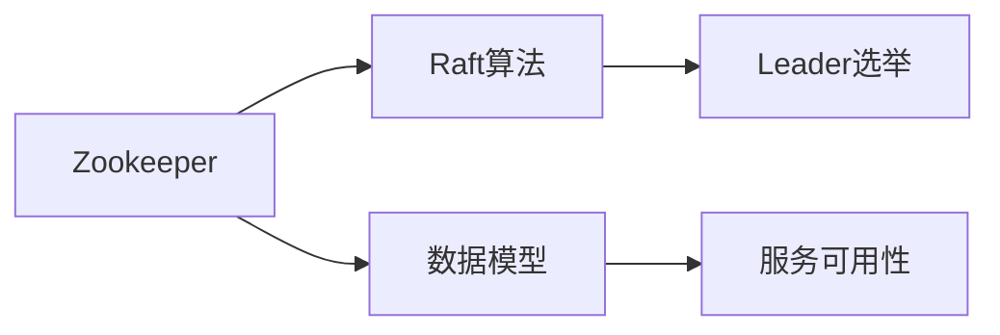
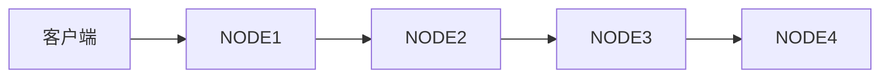
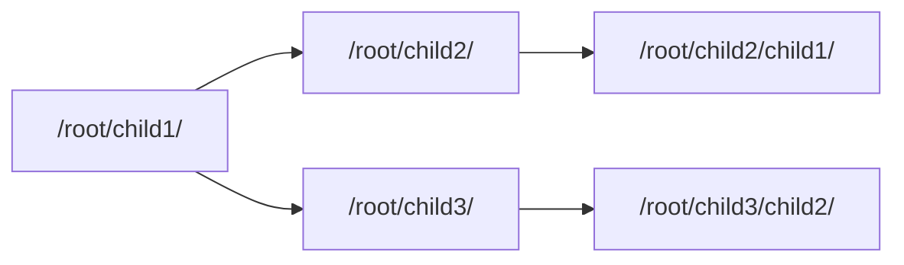
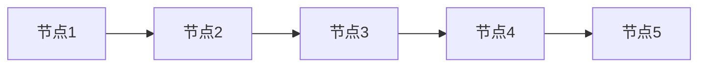
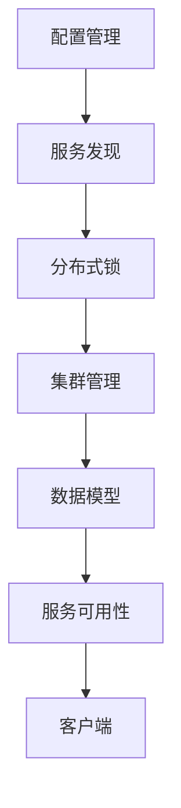

                 

# Zookeeper原理与代码实例讲解

> 关键词：Zookeeper,分布式协调服务,一致性算法,ZAB协议,Leader选举,数据模型,服务可用性

## 1. 背景介绍

### 1.1 问题由来
在大型分布式系统中，数据和服务往往分布在多个节点上，为了保证系统稳定性和可靠性，需要对这些节点进行集中协调和管理。Zookeeper是一款开源的分布式协调服务系统，用于解决分布式系统中的各种协调问题，如配置管理、服务发现、集群管理、分布式锁等。其核心思想是通过一个统一的分布式数据存储来协调和监控整个系统的运行。

### 1.2 问题核心关键点
Zookeeper的核心功能包括但不限于：
- 配置管理：存储和管理系统的配置信息，如服务地址、端口等。
- 服务发现：通过监听服务状态变化，动态发现和更新服务实例。
- 分布式锁：提供分布式锁机制，解决多个节点对共享资源的竞争问题。
- 集群管理：监控和协调集群中节点的状态，防止脑裂等异常情况。

### 1.3 问题研究意义
研究Zookeeper的工作原理和实践方法，对于理解分布式系统的协调机制、提升系统的稳定性和可靠性、优化系统的性能和可扩展性，具有重要意义。Zookeeper以其简单、高效、可靠的设计理念，广泛应用于互联网、金融、大数据、物联网等诸多领域，是构建大型分布式系统的核心组件。

## 2. 核心概念与联系

### 2.1 核心概念概述

为更好地理解Zookeeper的原理和实践方法，本节将介绍几个密切相关的核心概念：

- Zookeeper: 一款基于Raft算法的高一致性分布式协调服务系统，用于解决分布式系统中的协调问题，如配置管理、服务发现、集群管理等。

- Raft算法: 一种分布式一致性算法，通过多轮投票选举出领导者(Leader)，解决分布式系统中的一致性和可靠性问题。

- Leader选举: Zookeeper中通过Raft算法进行Leader选举，以保证系统中的领导者唯一性。

- 数据模型: Zookeeper采用树形结构的数据模型，每个节点对应一个键值对，通过节点路径访问数据。

- 服务可用性: Zookeeper通过心跳机制、异常处理等手段，确保集群中服务的持续可用性。

这些核心概念之间的逻辑关系可以通过以下Mermaid流程图来展示：



这个流程图展示了大语言模型的核心概念及其之间的关系：

1. Zookeeper采用Raft算法进行一致性保证。
2. Zookeeper通过Leader选举机制，保证集群中领导者的唯一性。
3. Zookeeper采用树形结构的数据模型，方便访问和管理数据。
4. Zookeeper通过心跳机制等手段，确保集群中服务的持续可用性。

### 2.2 概念间的关系

这些核心概念之间存在着紧密的联系，形成了Zookeeper的完整工作机制。下面我们通过几个Mermaid流程图来展示这些概念之间的关系。

#### 2.2.1 Zookeeper的基本架构



这个流程图展示了Zookeeper的基本架构，由多个节点组成，每个节点独立运行，形成一个Zookeeper集群。客户端可以向集群中的任意节点发起请求，节点通过Raft算法进行一致性维护，确保集群中数据的一致性和可靠性。

#### 2.2.2 数据模型与节点路径



这个流程图展示了Zookeeper的数据模型，采用树形结构，每个节点对应一个键值对。节点路径通过斜杠`/`分隔，方便路径式的访问和管理。例如，节点路径`/root/child1/`表示在根节点`/root/`下，存在一个名为`child1`的子节点。

#### 2.2.3 Leader选举机制



这个流程图展示了Zookeeper中的Leader选举机制。在初始化阶段，所有节点都处于候选状态。通过多轮投票，节点可以选举出领导者(Leader)。 Leader选举后，所有节点都会跟随领导者进行数据更新和操作。

### 2.3 核心概念的整体架构

最后，我们用一个综合的流程图来展示这些核心概念在大语言模型微调过程中的整体架构：



这个综合流程图展示了从配置管理到服务可用性的完整Zookeeper架构，各个模块之间紧密协作，共同实现集群管理和数据一致性的目标。通过这些模块的组合应用，Zookeeper能够高效地支持各种分布式系统的协调和管理需求。

## 3. 核心算法原理 & 具体操作步骤
### 3.1 算法原理概述

Zookeeper的算法原理主要基于Raft算法，通过多轮投票选举出领导者(Leader)，确保系统中的数据一致性和可靠性。其核心步骤如下：

1. 选举阶段：所有节点处于候选人状态，通过多轮投票选举出领导者。

2. 数据更新阶段：领导者节点接收客户端请求，进行数据更新和状态变化记录。

3. 同步阶段：领导者节点将更新后的数据广播给所有跟随者节点，确保数据一致性。

4. 异常处理阶段：处理节点掉线、网络异常等异常情况，确保集群服务的持续可用性。

### 3.2 算法步骤详解

Zookeeper的算法步骤如下：

**Step 1: 配置Zookeeper集群**

1. 准备多台服务器，安装Zookeeper软件。

2. 配置服务端口、集群名称、节点ID等参数。

3. 启动Zookeeper集群，等待所有节点达成一致。

**Step 2: 数据模型设计**

1. 设计合适的数据模型，将配置信息、服务实例等存储在Zookeeper中。

2. 设计路径规则，方便数据的访问和管理。

3. 定义数据更新和操作的规范。

**Step 3: Leader选举**

1. 启动节点，进入候选人状态。

2. 通过多轮投票，选举出领导者节点。

3. 领导者节点接收客户端请求，进行数据更新和状态变化记录。

4. 领导者节点将更新后的数据广播给所有跟随者节点，确保数据一致性。

**Step 4: 异常处理**

1. 监控节点状态，处理网络异常、节点掉线等异常情况。

2. 在异常情况下，进行Leader选举，保证系统的稳定性和可靠性。

**Step 5: 客户端访问**

1. 客户端通过路径式访问，获取和更新数据。

2. 客户端可以获取集群中的服务实例，进行负载均衡等操作。

3. 客户端可以使用分布式锁等机制，解决节点间的竞争问题。

### 3.3 算法优缺点

Zookeeper的优势包括：
- 简单高效。采用了Raft算法和Leader选举机制，保证了系统的可靠性和一致性。
- 高可用性。通过心跳机制、异常处理等手段，确保集群服务的持续可用性。
- 可扩展性。可以支持多节点集群，提升系统的处理能力和容错能力。

Zookeeper的劣势包括：
- 数据存储单节点。所有数据存储在服务器上，对服务器的硬件性能要求较高。
- 配置复杂。需要配置多台服务器，进行集群搭建和配置管理，增加了运维成本。
- 不适合大并发访问。在高并发访问的情况下，容易发生性能瓶颈。

### 3.4 算法应用领域

Zookeeper的应用领域非常广泛，主要包括以下几个方面：

- 配置管理：存储和管理系统的配置信息，如服务地址、端口等。

- 服务发现：通过监听服务状态变化，动态发现和更新服务实例。

- 分布式锁：提供分布式锁机制，解决多个节点对共享资源的竞争问题。

- 集群管理：监控和协调集群中节点的状态，防止脑裂等异常情况。

- 分布式事务：通过Zookeeper进行分布式事务协调和管理。

- 分布式资源管理：通过Zookeeper进行分布式资源的调度和管理。

- 数据同步：通过Zookeeper进行数据同步和分布式缓存。

除了上述这些经典应用，Zookeeper还被创新性地应用于各种新兴领域，如分布式数据库、微服务架构、人工智能等，为分布式系统提供强大的协调和管理能力。

## 4. 数学模型和公式 & 详细讲解  
### 4.1 数学模型构建

Zookeeper的数学模型主要基于Raft算法，通过多轮投票选举出领导者(Leader)，确保系统中的数据一致性和可靠性。其核心思想是：

1. 选举阶段：所有节点处于候选人状态，通过多轮投票选举出领导者。

2. 数据更新阶段：领导者节点接收客户端请求，进行数据更新和状态变化记录。

3. 同步阶段：领导者节点将更新后的数据广播给所有跟随者节点，确保数据一致性。

4. 异常处理阶段：处理节点掉线、网络异常等异常情况，确保集群服务的持续可用性。

### 4.2 公式推导过程

以下我们以二叉树为例，推导Raft算法的核心公式。

假设系统中有n个节点，初始化阶段所有节点处于候选人状态，编号为1到n。选举过程中，每个节点需要进行多轮投票，最终选出领导者(Leader)。投票规则如下：

1. 每个候选人节点将当前系统状态和自身信息（如节点ID、状态）广播给其他节点。

2. 每个候选人节点接收来自其他节点的投票信息，记录投票数目。

3. 每个候选人节点根据收到的投票数目进行统计，超过半数节点支持的候选人将被选举为领导者。

4. 领导者节点接收客户端请求，进行数据更新和状态变化记录。

5. 领导者节点将更新后的数据广播给所有跟随者节点，确保数据一致性。

6. 领导者节点通过心跳机制监控节点状态，处理异常情况。

### 4.3 案例分析与讲解

假设系统中有3个节点，编号为1、2、3。初始化阶段所有节点处于候选人状态，编号为1到3。选举过程中，每个节点需要进行多轮投票，最终选出领导者。

第一轮投票：

- 节点1广播自己的状态和信息。

- 节点2和节点3收到节点1的投票信息，记录投票数目。

- 节点1、节点2和节点3分别收到来自对方的投票信息，记录投票数目。

- 每个节点统计收到的投票数目，超过半数节点支持的候选人将被选举为领导者。

第二轮投票：

- 根据第一轮投票结果，假设节点1、2和3收到的投票数目分别为1、2和3。

- 节点1、节点2和节点3分别收到来自对方的投票信息，记录投票数目。

- 每个节点统计收到的投票数目，超过半数节点支持的候选人将被选举为领导者。

通过以上两轮投票，可以选举出领导者节点。领导者节点将接收客户端请求，进行数据更新和状态变化记录。同时将更新后的数据广播给所有跟随者节点，确保数据一致性。

## 5. 项目实践：代码实例和详细解释说明
### 5.1 开发环境搭建

在进行Zookeeper实践前，我们需要准备好开发环境。以下是使用Python进行Zookeeper开发的流程：

1. 安装Zookeeper软件：从官网下载并安装Zookeeper软件。

2. 配置服务端口、集群名称、节点ID等参数：在配置文件中指定集群信息。

3. 启动Zookeeper集群：启动Zookeeper集群，等待所有节点达成一致。

4. 安装Python Zookeeper客户端库：使用pip安装zookeeper客户端库。

完成上述步骤后，即可在Python环境中进行Zookeeper操作。

### 5.2 源代码详细实现

这里我们以一个简单的配置管理应用为例，给出使用Python Zookeeper客户端库对Zookeeper进行操作的代码实现。

首先，定义Zookeeper客户端：

```python
from kazoo.client import KazooClient

zk = KazooClient(hosts='localhost:2181')
zk.start()
```

然后，定义数据模型：

```python
data = {'hello': 'world'}
zk.create('/hello', data)
```

接着，定义数据访问和更新操作：

```python
def get_data(zk, path):
    data, _ = zk.get(path)
    return data[0].decode()

def set_data(zk, path, data):
    zk.create(path, data.encode())
    zk.set(path, data.encode())
```

最后，定义数据操作：

```python
path = '/hello'
data = get_data(zk, path)
print(data)

# 更新数据
set_data(zk, path, 'python')
data = get_data(zk, path)
print(data)
```

以上就是使用Python Zookeeper客户端库对Zookeeper进行操作的完整代码实现。可以看到，通过Zookeeper客户端库，我们可以方便地进行数据创建、查询和更新等操作。

### 5.3 代码解读与分析

让我们再详细解读一下关键代码的实现细节：

**KazooClient类**：
- `start()`方法：启动Zookeeper客户端，连接到Zookeeper服务器。

**数据模型定义**：
- `create()`方法：创建节点，指定节点路径和数据。
- `get()`方法：获取节点的数据。
- `set()`方法：更新节点的数据。

**数据访问操作**：
- `get_data()`方法：获取指定节点的数据。
- `set_data()`方法：设置指定节点的数据。

**数据更新操作**：
- 通过`create()`和`set()`方法，可以实现节点的创建和更新。

通过以上代码，我们可以看到，使用Python Zookeeper客户端库，可以方便地进行Zookeeper操作，实现配置管理、数据访问和更新等任务。

### 5.4 运行结果展示

假设我们在Zookeeper上创建了一个名为`/hello`的节点，并存储了数据`world`。运行代码后，可以看到输出结果为：

```
b'world'
```

然后，我们将数据更新为`python`，运行代码后，输出结果为：

```
b'python'
```

这说明我们已经成功地在Zookeeper上实现了数据的创建和更新操作。

## 6. 实际应用场景
### 6.1 智能家居系统

基于Zookeeper的分布式协调服务，可以应用于智能家居系统的构建。智能家居系统需要实时协调各个节点（如灯光、温控器、门锁等）的状态，以便实现语音控制、定时控制、远程控制等功能。

在技术实现上，可以设计一个统一的Zookeeper集群，存储和管理各个节点的状态和配置信息。智能家居设备通过Zookeeper客户端库进行状态查询和配置更新，确保系统状态的实时一致性。同时，Zookeeper可以协调各个节点的协作和同步，实现智能家居系统的稳定运行。

### 6.2 金融交易系统

金融交易系统需要实时协调各个节点（如交易机、清算系统、风控系统等）的状态，以便高效处理交易订单、结算清算、风险控制等任务。Zookeeper的分布式协调服务可以用于金融交易系统的构建。

在技术实现上，可以设计一个统一的Zookeeper集群，存储和管理各个节点的状态和配置信息。金融交易系统通过Zookeeper客户端库进行状态查询和配置更新，确保系统状态的实时一致性。同时，Zookeeper可以协调各个节点的协作和同步，实现交易系统的稳定运行。

### 6.3 物联网系统

物联网系统需要实时协调各个节点（如传感器、监控设备、控制设备等）的状态，以便实现数据的采集、处理、控制等功能。Zookeeper的分布式协调服务可以用于物联网系统的构建。

在技术实现上，可以设计一个统一的Zookeeper集群，存储和管理各个节点的状态和配置信息。物联网设备通过Zookeeper客户端库进行状态查询和配置更新，确保系统状态的实时一致性。同时，Zookeeper可以协调各个节点的协作和同步，实现物联网系统的稳定运行。

### 6.4 未来应用展望

随着Zookeeper技术的不断发展和完善，未来其在分布式系统中的应用将更加广泛。以下列出几个未来应用方向：

- 分布式数据库：通过Zookeeper进行分布式数据库的协调和管理。

- 微服务架构：通过Zookeeper进行微服务架构的协调和管理。

- 人工智能：通过Zookeeper进行人工智能系统的协调和管理。

- 大数据：通过Zookeeper进行大数据系统的协调和管理。

- 物联网：通过Zookeeper进行物联网系统的协调和管理。

总之，Zookeeper的分布式协调服务在分布式系统中的应用前景广阔，未来必将有更多的创新和突破，为分布式系统的构建和应用带来新的可能性。

## 7. 工具和资源推荐
### 7.1 学习资源推荐

为了帮助开发者系统掌握Zookeeper的原理和实践方法，这里推荐一些优质的学习资源：

1. Zookeeper官方文档：官方文档提供了详细的API和用法说明，是学习Zookeeper的重要参考。

2. Zookeeper官方博客：官方博客介绍了Zookeeper的最新进展和最佳实践，是学习Zookeeper的重要来源。

3. Apache Zookeeper指南：指南介绍了Zookeeper的原理、架构、应用等，适合入门学习。

4. Zookeeper实战指南：实战指南通过案例分析、代码实现等形式，介绍了Zookeeper的实际应用，适合实践学习。

5. Zookeeper教程：教程提供了系统的Zookeeper学习路径，从入门到进阶，逐步深入。

通过对这些资源的学习实践，相信你一定能够快速掌握Zookeeper的精髓，并用于解决实际的分布式系统问题。

### 7.2 开发工具推荐

高效的开发离不开优秀的工具支持。以下是几款用于Zookeeper开发的常用工具：

1. KazooClient库：Python Zookeeper客户端库，提供了丰富的API接口，方便开发和调试。

2. Zookeeper UI：Zookeeper管理界面，可以通过Web界面查看和管理Zookeeper集群。

3. Zookeeper Test Tool：Zookeeper测试工具，可以测试Zookeeper的性能和稳定性。

4. Zookeeper Analyzer：Zookeeper分析工具，可以分析Zookeeper集群的状态和性能。

5. Zookeeper Monitor：Zookeeper监控工具，可以实时监控Zookeeper集群的状态和异常情况。

合理利用这些工具，可以显著提升Zookeeper开发的效率，加快创新迭代的步伐。

### 7.3 相关论文推荐

Zookeeper的原理和实践不断发展，以下是几篇奠基性的相关论文，推荐阅读：

1. Paxos Made Simple：介绍Paxos算法，Zookeeper中采用了类似的多轮投票机制，可以加深理解。

2. Zookeeper：介绍Zookeeper的原理和应用，是学习Zookeeper的重要参考资料。

3. The Raft Consensus Algorithm：介绍Raft算法，Zookeeper中采用的分布式一致性算法，可以加深理解。

4. High-Performance Sharded Data Storage：介绍Sharded数据存储，Zookeeper中采用了类似的分布式数据存储机制，可以加深理解。

5. Practical Consensus Algorithms for Large-Scale Distributed Systems：介绍实践中的分布式一致性算法，包括Raft算法、ZAB算法等，可以加深理解。

这些论文代表了大语言模型微调技术的发展脉络。通过学习这些前沿成果，可以帮助研究者把握学科前进方向，激发更多的创新灵感。

除上述资源外，还有一些值得关注的前沿资源，帮助开发者紧跟Zookeeper技术的最新进展，例如：

1. Apache Zookeeper官网：提供最新的Zookeeper版本和下载，官方文档和博客等，是学习Zookeeper的重要来源。

2. Zookeeper社区：提供Zookeeper用户的交流平台，分享学习资源和实践经验。

3. Zookeeper Conferences：提供Zookeeper相关的会议和活动，了解最新的学术进展和应用实践。

4. Zookeeper GitHub：提供Zookeeper的开源代码和社区贡献，了解最新的技术进展和实践应用。

5. Zookeeper User Group：提供Zookeeper用户的交流平台，分享学习资源和实践经验。

总之，对于Zookeeper的学习和实践，需要开发者保持开放的心态和持续学习的意愿。多关注前沿资讯，多动手实践，多思考总结，必将收获满满的成长收益。

## 8. 总结：未来发展趋势与挑战
### 8.1 总结

本文对Zookeeper的原理和实践方法进行了全面系统的介绍。首先阐述了Zookeeper的基本架构和核心功能，明确了其在大规模分布式系统中的协调和监控作用。其次，从原理到实践，详细讲解了Zookeeper的算法原理和关键步骤，给出了Zookeeper任务开发的完整代码实例。同时，本文还广泛探讨了Zookeeper在多个行业领域的应用前景，展示了其强大的分布式协调能力。

通过本文的系统梳理，可以看到，Zookeeper以其简单、高效、可靠的设计理念，广泛应用于互联网、金融、大数据、物联网等诸多领域，是构建大型分布式系统的核心组件。未来，伴随Zookeeper技术的不断发展和完善，其在分布式系统中的应用将更加广泛，为大型分布式系统的构建和运行提供强有力的技术支持。

### 8.2 未来发展趋势

展望未来，Zookeeper的发展趋势将呈现以下几个方向：

1. 高可用性：Zookeeper将继续提升系统的可用性和稳定性，通过分布式系统设计和异常处理机制，确保集群服务的持续可用性。

2. 高性能：Zookeeper将继续优化数据同步和更新机制，提升系统的处理能力和响应速度，适应高并发和海量数据的需求。

3. 高扩展性：Zookeeper将继续提升系统的扩展能力，支持更多节点和数据存储，满足大规模分布式系统的需求。

4. 高安全性：Zookeeper将继续提升系统的安全性和可靠性，防止数据泄露和系统故障，确保分布式系统的稳定运行。

5. 高灵活性：Zookeeper将继续提升系统的灵活性和易用性，通过API接口和工具支持，方便用户开发和部署。

6. 高可配置性：Zookeeper将继续提升系统的可配置性，通过配置参数和插件支持，满足不同场景下的需求。

以上趋势凸显了Zookeeper在大规模分布式系统中的重要地位。这些方向的探索发展，必将进一步提升Zookeeper的性能和稳定性，为大型分布式系统的构建和运行提供强有力的技术支持。

### 8.3 面临的挑战

尽管Zookeeper技术已经取得了瞩目成就，但在迈向更加智能化、普适化应用的过程中，它仍面临着诸多挑战：

1. 数据存储单节点：所有数据存储在服务器上，对服务器的硬件性能要求较高。

2. 配置复杂：需要配置多台服务器，进行集群搭建和配置管理，增加了运维成本。

3. 不适合大并发访问：在高并发访问的情况下，容易发生性能瓶颈。

4. 单点故障：服务器单点故障可能导致整个系统瘫痪，影响系统的稳定性和可靠性。

5. 安全性不足：系统安全性和稳定性问题需要进一步加强，防止数据泄露和系统崩溃。

6. 适用性不足：Zookeeper在某些特定场景下，可能不适用，需要进行定制化开发。

正视Zookeeper面临的这些挑战，积极应对并寻求突破，将是大语言模型微调走向成熟的必由之路。相信随着学界和产业界的共同努力，这些挑战终将一一被克服，Zookeeper必将在构建大型分布式系统的过程中发挥越来越重要的作用。

### 8.4 研究展望

面对Zookeeper所面临的种种挑战，未来的研究需要在以下几个方面寻求新的突破：

1. 分布式存储：研究分布式存储技术，提升系统的扩展性和可靠性，满足大规模分布式系统的需求。

2. 分布式锁：研究分布式锁技术，提升系统的并发处理能力，支持更多节点的协作和同步。

3. 异常处理：研究异常处理技术，提升系统的稳定性和可靠性，防止系统崩溃和数据丢失。

4. 数据同步：研究数据同步技术，提升系统的处理速度和响应能力，满足高并发和大数据的需求。

5. 安全性：研究安全性技术，提升系统的安全性和可靠性，防止数据泄露和系统故障。

6. 定制化开发：研究定制化开发技术，提升系统的适用性和灵活性，满足不同场景下的需求。

这些研究方向的探索，必将引领Zookeeper技术迈向更高的台阶，为构建安全、可靠、可解释、可控的智能系统铺平道路。面向未来，Zookeeper技术还需要与其他分布式技术进行更深入的融合，如Kafka、Hadoop等，多路径协同发力，共同推动分布式系统的进步。只有勇于创新、敢于突破，才能不断拓展分布式系统的边界，让智能技术更好地造福人类社会。

## 9. 附录：常见问题与解答

**Q1：Zookeeper如何保证数据一致性？**

A: Zookeeper通过Raft算法和Leader选举机制，保证数据一致性。在初始化阶段，所有节点处于候选人状态，通过多轮投票选举出领导者(Leader)。领导者节点接收客户端请求，进行数据更新和状态变化记录。领导者节点将更新后的数据广播给所有跟随者节点，确保数据一致性。

**Q2：Zookeeper如何处理节点掉线？**

A: Zookeeper通过心跳机制监控节点状态，处理节点掉线等异常情况。节点在规定时间内没有收到心跳消息，将被视为掉线。Zookeeper会自动进行节点恢复和重新选举，确保系统的稳定性和可靠性

