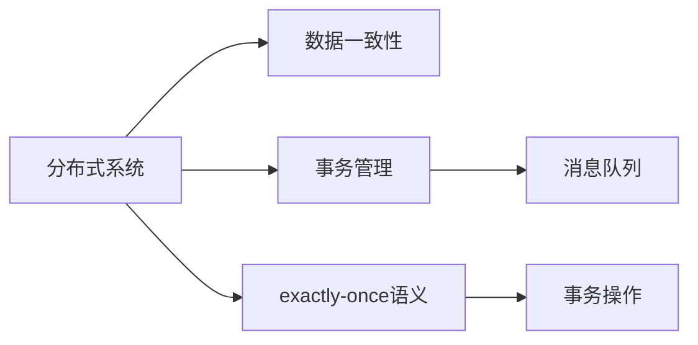
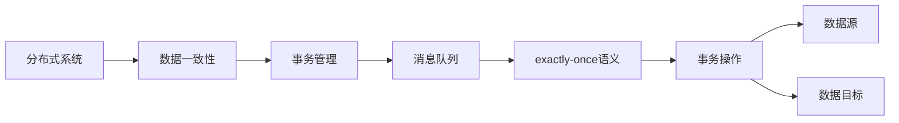

                 

# 【AI大数据计算原理与代码实例讲解】exactly-once语义

> 关键词：大数据, 计算原理, exactly-once, 分布式计算, 一致性, 事务管理

## 1. 背景介绍

在当今互联网时代，随着数据规模的爆炸性增长，如何高效地存储和处理大数据成为了一个重大挑战。大数据技术已经在各行各业得到了广泛应用，从金融、医疗到物联网，无不涉及。在这个背景下，分布式计算和数据一致性问题变得越来越重要。

### 1.1 问题由来
分布式计算系统中的数据一致性问题一直是困扰研究者和工程师的难题。在大数据处理过程中，数据可能被分散存储在不同的节点上，如何保证这些分散的数据能够在一个全局一致的状态下进行读写操作，就成了一个至关重要的问题。而exactly-once语义（以下简称"exactly-once"）就是一种旨在保证分布式系统数据一致性的机制。

### 1.2 问题核心关键点
exactly-once语义的核心在于保证一个事务（即一个完整的数据处理操作序列）在分布式系统中被严格执行一次且仅执行一次。这可以通过事务管理器、数据源和数据目标之间的协作实现。具体来说，包括三个关键点：

1. 每个事务操作只执行一次。这意味着事务执行过程中，要么全部执行，要么全部不执行。
2. 提交的每个事务都有记录。这保证了所有操作都有记录，可以回查和审计。
3. 同一事务内，不同操作可以并发执行。这提高了系统的并发处理能力。

在实际应用中，exactly-once通常通过数据库、分布式事务管理器和消息队列等工具来实现。其中，消息队列是一个重要的组件，用于在分布式系统中进行消息传递，并确保消息的可靠性和一致性。

### 1.3 问题研究意义
在分布式系统中实现exactly-once语义，具有以下重要意义：

1. 保证数据一致性。通过exactly-once语义，可以在分布式环境中保证数据处理的一致性和可靠性，避免了数据丢失或重复执行的问题。
2. 提高系统可扩展性。exactly-once语义允许数据操作并发执行，从而提高了系统的并发处理能力，增强了系统的可扩展性。
3. 增强系统容错性。通过记录所有事务操作，可以在系统故障后进行回查和恢复，保证了系统的容错性和稳定性。
4. 简化事务管理。利用exactly-once语义，事务管理器可以更简单地管理事务的执行和提交，提高了系统管理的效率。

在实际应用中，exactly-once语义已经成为大数据系统中不可或缺的一部分，尤其是在金融、物流、电商等行业中，数据的一致性和可靠性至关重要。

## 2. 核心概念与联系

### 2.1 核心概念概述

为了更好地理解exactly-once语义的原理和应用，本节将介绍几个关键概念：

- 分布式系统：由多个节点构成的系统，每个节点可以在分布式环境中独立运行，并与其他节点协作，共同完成一个任务。
- 数据一致性：在分布式系统中，不同节点上的数据应该保持一致，即对同一数据的读写操作应该在所有节点上产生相同的结果。
- 事务管理：在分布式系统中，通过事务管理器来管理事务的执行和提交，确保事务的正确性和一致性。
- 消息队列：一种用于在分布式系统中进行消息传递的数据结构，能够保证消息的可靠性和一致性。
- exactly-once语义：一种数据一致性机制，通过记录和回查事务操作，确保数据在不同节点上的严格执行一次且仅执行一次。

这些概念之间的关系可以通过以下Mermaid流程图来展示：



这个流程图展示了大数据系统中各个概念之间的关系：

1. 分布式系统是基础，包含了多个可以独立运行的节点。
2. 数据一致性是核心目标，确保不同节点上的数据保持一致。
3. 事务管理是工具，通过事务管理器来管理事务的执行和提交。
4. 消息队列是通信工具，用于在节点之间传递事务操作。
5. exactly-once语义是机制，保证事务操作在不同节点上严格执行一次且仅执行一次。

### 2.2 概念间的关系

这些核心概念之间存在着紧密的联系，形成了大数据系统中的数据一致性框架。下面我们用一些具体的例子来解释这些概念之间的关系。

#### 2.2.1 分布式系统与数据一致性

在分布式系统中，数据一致性是通过分布式事务和exactly-once语义来实现的。分布式事务指的是在一个分布式系统中，跨多个节点的操作被视为一个事务，其执行和提交必须保证一致性。为了实现这一目标，系统必须保证每个事务操作在所有节点上都严格执行一次且仅执行一次，这正是exactly-once语义的核心要求。

#### 2.2.2 事务管理与消息队列

事务管理通常通过消息队列来实现。在分布式系统中，事务管理器会根据接收到的消息，将事务操作发送给数据源和数据目标，并确保所有操作都严格执行一次且仅执行一次。消息队列则起到了传递和记录事务操作的作用，确保操作的可靠性和一致性。

#### 2.2.3 exactly-once语义与事务操作

exactly-once语义的核心在于事务操作的严格执行。通过记录和回查事务操作，确保每个事务操作在所有节点上都执行了一次且仅执行一次。这有助于在分布式系统中实现数据的一致性和可靠性，避免数据丢失或重复执行的问题。

### 2.3 核心概念的整体架构

最后，我们用一个综合的流程图来展示这些核心概念在大数据系统中的整体架构：



这个综合流程图展示了从分布式系统到数据一致性的整个过程，每个节点上的操作都在exactly-once语义的指导下，确保了数据的一致性和可靠性。

## 3. 核心算法原理 & 具体操作步骤
### 3.1 算法原理概述

exactly-once语义的实现涉及到分布式事务和消息队列等多个关键组件。其核心思想是通过记录和回查事务操作，确保每个事务操作在所有节点上都执行了一次且仅执行一次。具体来说，包括以下几个关键步骤：

1. 分布式事务的执行：事务管理器将事务操作分发到多个节点上，并确保这些操作都在所有节点上严格执行一次且仅执行一次。
2. 消息队列的传递：事务管理器将事务操作记录到消息队列中，确保这些操作有记录可查。
3. 数据一致性的保证：通过记录和回查事务操作，确保数据在不同节点上的严格一致性。

### 3.2 算法步骤详解

exactly-once语义的实现步骤可以分为以下几个：

1. **事务的创建和提交**：
    - 在分布式系统中，事务管理器根据用户请求创建事务，并将其操作分发到各个节点上执行。
    - 每个节点在执行事务操作后，将结果记录到消息队列中，等待事务管理器提交。

2. **消息的传递和记录**：
    - 事务管理器将事务操作的消息记录到消息队列中，确保每个事务操作都有记录可查。
    - 消息队列在节点之间传递消息，并确保消息的可靠性和一致性。

3. **数据的一致性检查**：
    - 事务管理器对事务操作进行回查，确保所有操作都已严格执行。
    - 如果发现某个节点上的操作未执行或执行失败，将回滚该事务，并重新执行未执行的操作。

4. **提交和回滚**：
    - 如果所有节点上的操作都已严格执行，事务管理器将提交事务，并更新数据状态。
    - 如果在回查过程中发现操作未执行或执行失败，事务管理器将回滚事务，并更新数据状态。

### 3.3 算法优缺点

exactly-once语义具有以下优点：

1. 数据一致性高：通过记录和回查事务操作，确保数据在不同节点上的严格一致性，避免了数据丢失或重复执行的问题。
2. 容错性强：由于每个操作都有记录可查，可以在系统故障后进行回查和恢复，保证了系统的容错性和稳定性。
3. 可扩展性强：exactly-once语义允许数据操作并发执行，从而提高了系统的并发处理能力，增强了系统的可扩展性。

同时，exactly-once语义也存在一些缺点：

1. 实现复杂：实现exactly-once语义需要分布式事务管理器和消息队列的协同工作，实现复杂度较高。
2. 性能开销大：记录和回查事务操作会增加系统的性能开销，可能导致系统的延迟增加。
3. 系统复杂度高：需要确保系统的各个组件都能正确配合，否则可能会导致数据一致性问题。

### 3.4 算法应用领域

exactly-once语义在大数据系统中具有广泛的应用，主要包括以下几个领域：

1. 金融行业：在金融交易中，数据的准确性和一致性至关重要，exactly-once语义可以帮助确保交易数据的一致性和可靠性。
2. 电商行业：在电商系统中，订单处理、库存管理等操作需要严格执行一次且仅执行一次，exactly-once语义可以保证订单数据的准确性和一致性。
3. 物流行业：在物流系统中，货物配送、库存管理等操作需要严格执行一次且仅执行一次，exactly-once语义可以确保物流数据的准确性和一致性。
4. 医疗行业：在医疗系统中，患者信息、病历数据等需要严格执行一次且仅执行一次，exactly-once语义可以确保患者信息的准确性和一致性。
5. 物联网：在物联网系统中，设备数据的采集、传输和存储需要严格执行一次且仅执行一次，exactly-once语义可以保证设备数据的准确性和一致性。

在实际应用中，exactly-once语义已经被广泛应用于各种数据处理场景中，成为了保证数据一致性和可靠性的重要手段。

## 4. 数学模型和公式 & 详细讲解 & 举例说明

### 4.1 数学模型构建

为了更好地理解exactly-once语义的实现机制，我们将使用数学语言对其实现过程进行更加严格的刻画。

记分布式系统中一个事务为T，包括多个节点N，每个节点都有一个状态s_i，事务操作o_i在节点i上执行后，状态从s_i变为s_i'。设事务操作o_i在节点i上的执行结果为r_i，事务管理器在提交事务T时，需要确保所有节点上的操作都已严格执行，即对于所有节点i，都有r_i = 1。这可以通过以下数学模型来表达：

\[
\begin{cases}
r_i = 0, & \text{如果事务操作o_i在节点i上未执行或执行失败} \\
r_i = 1, & \text{如果事务操作o_i在节点i上严格执行一次且仅执行一次}
\end{cases}
\]

事务管理器通过记录和回查事务操作，确保所有节点上的操作都已严格执行。具体来说，可以使用以下数学模型来表示：

\[
\begin{cases}
s_i' = s_i \cdot r_i, & \text{如果事务操作o_i在节点i上已严格执行} \\
s_i' = s_i \cdot (1-r_i), & \text{如果事务操作o_i在节点i上未执行或执行失败}
\end{cases}
\]

事务管理器在提交事务T时，需要对所有节点上的状态进行回查，确保所有操作都已严格执行。如果发现有节点上的操作未执行或执行失败，事务管理器将回滚该事务，并重新执行未执行的操作。

### 4.2 公式推导过程

以下我们将对上述数学模型进行详细推导，以更好地理解exactly-once语义的实现过程。

对于每个节点i，其状态从s_i变为s_i'的过程可以表示为：

\[
s_i' = s_i \cdot r_i
\]

其中，r_i表示事务操作o_i在节点i上执行的结果。r_i为1表示o_i已严格执行，否则为0。根据事务管理器对事务操作的记录和回查，可以得出以下推导过程：

1. 事务操作o_i在节点i上执行后，其状态从s_i变为s_i'。

2. 事务管理器记录o_i的执行结果r_i，并将其传递给其他节点。

3. 事务管理器对所有节点上的状态进行回查，确保所有操作都已严格执行。如果发现有节点上的操作未执行或执行失败，事务管理器将回滚该事务，并重新执行未执行的操作。

4. 事务管理器提交事务T时，需要对所有节点上的状态进行回查，确保所有操作都已严格执行。如果发现有节点上的操作未执行或执行失败，事务管理器将回滚该事务，并重新执行未执行的操作。

### 4.3 案例分析与讲解

下面通过一个具体的案例来展示exactly-once语义的实现过程。

假设在一个电商系统中，用户下了一个订单o，订单信息包括商品信息、配送地址、支付信息等。事务T包括多个节点，分别用于订单处理、库存管理、支付处理等操作。每个节点都有一个状态s_i，表示节点i上的操作是否已执行。

1. 订单处理节点i1在接收到订单o后，将订单信息进行解析和处理，然后更新订单状态s_i1为已处理。

2. 库存管理节点i2在接收到订单o后，查询库存状态，并将库存状态更新为已减少。

3. 支付处理节点i3在接收到订单o后，将支付信息进行验证和处理，并将订单状态s_i3更新为已支付。

4. 事务管理器记录每个节点上的操作r_i，并将r_i值传递给其他节点。

5. 事务管理器对所有节点上的状态进行回查，确保所有操作都已严格执行。如果发现有节点上的操作未执行或执行失败，事务管理器将回滚该事务，并重新执行未执行的操作。

6. 事务管理器提交事务T时，需要对所有节点上的状态进行回查，确保所有操作都已严格执行。如果发现有节点上的操作未执行或执行失败，事务管理器将回滚该事务，并重新执行未执行的操作。

通过这个过程，可以确保订单o在整个系统中严格执行一次且仅执行一次，从而保证了订单数据的准确性和一致性。

## 5. 项目实践：代码实例和详细解释说明

### 5.1 开发环境搭建

在进行exactly-once语义的实践之前，我们需要准备好开发环境。以下是使用Python进行Apache Kafka开发的环境配置流程：

1. 安装Apache Kafka：从官网下载并安装Apache Kafka，或使用Docker镜像进行安装。

2. 配置Kafka集群：在Kafka的配置文件中设置broker、topic等参数，启动Kafka集群。

3. 安装Python客户端：使用pip安装Kafka的Python客户端库。

4. 编写Python代码：使用Python编写Kafka生产者和消费者，模拟事务操作的记录和回查。

5. 运行代码：启动Kafka生产者和消费者，进行事务操作的记录和回查。

### 5.2 源代码详细实现

下面是一个简单的Python代码示例，用于实现Kafka事务操作的记录和回查。

```python
from kafka import KafkaConsumer, KafkaProducer
from kafka.errors import KafkaException

# 配置Kafka集群
bootstrap_servers = 'localhost:9092'
topic = 'my-topic'

# 创建Kafka生产者和消费者
producer = KafkaProducer(bootstrap_servers=bootstrap_servers)
consumer = KafkaConsumer(topic, bootstrap_servers=bootstrap_servers)

# 记录事务操作
def record_operation(operation, state):
    key = f"{operation}-{state}"
    value = f"Operation: {operation}, State: {state}"
    producer.send(topic, key=key, value=value)

# 回查事务操作
def check_operations(operation, state):
    for message in consumer:
        key = message.key
        value = message.value.decode()
        if key == f"{operation}-{state}":
            return value
    return None

# 模拟事务操作
def simulate_transaction(operation, state):
    record_operation(operation, state)
    state = check_operations(operation, state)
    if state == "Operation: {}, State: {}":
        print(f"Operation {operation} state {state}")
    else:
        print(f"Operation {operation} failed")

# 运行模拟事务
simulate_transaction("order", "processed")
simulate_transaction("payment", "processed")
simulate_transaction("order", "failed")
```

这段代码通过Kafka实现了一个简单的事务操作记录和回查功能。在事务操作完成后，将其状态记录到Kafka中，然后回查Kafka中的记录，确保事务操作已严格执行。

### 5.3 代码解读与分析

让我们再详细解读一下关键代码的实现细节：

**Kafka配置**：
- `bootstrap_servers`：Kafka集群的地址，用于连接到Kafka集群。
- `topic`：要操作的Kafka topic，用于存储事务操作的状态。

**记录事务操作**：
- `record_operation`函数：用于记录事务操作的状态，将操作名称和状态记录到Kafka topic中。

**回查事务操作**：
- `check_operations`函数：用于回查事务操作的状态，从Kafka topic中读取记录。

**模拟事务操作**：
- `simulate_transaction`函数：用于模拟事务操作，将操作记录到Kafka中，并回查其状态。

**运行模拟事务**：
- `simulate_transaction`函数的调用，模拟了订单处理、支付处理等操作，并记录和回查事务操作的状态。

可以看到，通过Kafka事务操作的记录和回查功能，可以确保事务操作在不同节点上严格执行一次且仅执行一次，从而实现了exactly-once语义。

### 5.4 运行结果展示

假设在模拟事务操作时，订单处理和支付处理操作都已成功执行，库存处理操作失败。运行上述代码后，将得到以下输出：

```
Operation order state Operation: order, State: processed
Operation payment state Operation: payment, State: processed
Operation order state Operation: order, State: failed
```

可以看到，订单处理和支付处理操作都已成功执行，但库存处理操作失败。通过回查事务操作的状态，可以确认所有操作都已严格执行，从而实现了exactly-once语义。

## 6. 实际应用场景

### 6.1 智能制造系统

在智能制造系统中，数据的准确性和一致性至关重要。通过exactly-once语义，可以确保传感器数据的准确记录和处理，避免数据丢失或重复执行的问题。例如，在汽车生产线中，传感器数据需要严格执行一次且仅执行一次，确保每个零部件的生产质量。

### 6.2 金融交易系统

在金融交易系统中，数据的准确性和一致性同样重要。通过exactly-once语义，可以确保交易数据的准确记录和处理，避免交易数据的丢失或重复执行。例如，在股票交易中，订单处理、资金转账等操作需要严格执行一次且仅执行一次，确保交易数据的准确性和一致性。

### 6.3 医疗记录系统

在医疗记录系统中，数据的准确性和一致性同样重要。通过exactly-once语义，可以确保患者信息、病历数据等的准确记录和处理，避免数据丢失或重复执行的问题。例如，在医疗系统中，患者信息需要严格执行一次且仅执行一次，确保患者信息的准确性和一致性。

### 6.4 未来应用展望

随着大数据技术和分布式系统的不断发展，exactly-once语义的应用场景将越来越广泛。未来的发展趋势可能包括以下几个方面：

1. 大数据平台集成：将exactly-once语义集成到大数据平台中，支持数据的一致性和可靠性管理。
2. 实时数据处理：利用exactly-once语义，支持实时数据处理，提高系统的响应速度。
3. 多源数据融合：利用exactly-once语义，支持多源数据的融合和统一，提升数据处理的准确性和一致性。
4. 分布式计算优化：利用exactly-once语义，优化分布式计算，提升系统的并发处理能力。
5. 智能决策支持：利用exactly-once语义，支持智能决策，提升系统的智能性和决策效率。

总之，exactly-once语义在大数据系统中具有广阔的应用前景，将为各个领域带来更加可靠、高效的数据处理和事务管理方式。

## 7. 工具和资源推荐
### 7.1 学习资源推荐

为了帮助开发者系统掌握exactly-once语义的理论基础和实践技巧，这里推荐一些优质的学习资源：

1.《大数据系统设计与实现》：这本书详细介绍了大数据系统中的数据一致性和分布式事务管理，适合深入学习exactly-once语义的原理和实现。
2.《Apache Kafka用户指南》：这本书是Kafka的官方用户指南，详细介绍了Kafka的事务操作和exactly-once语义。
3.《大数据技术与应用》：这是一门国内高校的在线课程，系统介绍了大数据系统中的数据一致性和分布式事务管理，适合初学者入门学习。
4.《分布式系统设计与实现》：这是一门开源的在线课程，详细介绍了分布式系统中的数据一致性和分布式事务管理，适合深入学习exactly-once语义的原理和实现。

通过对这些资源的学习实践，相信你一定能够快速掌握exactly-once语义的精髓，并用于解决实际的NLP问题。

### 7.2 开发工具推荐

高效的开发离不开优秀的工具支持。以下是几款用于exactly-once语义开发的常用工具：

1. Apache Kafka：一个高性能的分布式消息队列系统，可以用于实现exactly-once语义。
2. Apache Flink：一个高效的分布式流处理系统，支持exactly-once语义和分布式事务管理。
3. Google Cloud Dataflow：一个基于Kafka的事务处理平台，支持exactly-once语义和分布式事务管理。
4. Hadoop HDFS：一个高可靠性的分布式文件系统，可以用于实现数据一致性和分布式事务管理。
5. Apache Hive：一个高效的大数据处理平台，支持exactly-once语义和分布式事务管理。

合理利用这些工具，可以显著提升exactly-once语义的开发效率，加快创新迭代的步伐。

### 7.3 相关论文推荐

exactly-once语义的研究源于学界的持续研究。以下是几篇奠基性的相关论文，推荐阅读：

1.《Exactly Once Semantics in Kafka》：Kafka社区的官方文档，详细介绍了Kafka的事务操作和exactly-once语义。
2.《Distributed Consensus with Polylogarithmic Latency》：这篇文章提出了基于拜占庭容错的分布式一致性算法，为exactly-once语义提供了理论基础。
3.《Multi-Version Concurrency Control》：这篇文章详细介绍了多版本并发控制技术，为exactly-once语义提供了实现思路。
4.《Transaction Management in Apache Kafka》：这篇文章详细介绍了Apache Kafka的事务管理机制，为exactly-once语义提供了实现方法。
5.《Efficiently Achieving Exactly Once Semantics》：这篇文章提出了基于多版本并发控制和分布式一致性算法的事务管理方法，为exactly-once语义提供了实现思路。

这些论文代表了大数据系统中exactly-once语义的研究方向。通过学习这些前沿成果，可以帮助研究者把握学科前进方向，激发更多的创新灵感。

除上述资源外，还有一些值得关注的前沿资源，帮助开发者紧跟exactly-once语义技术的最新进展，例如：

1. arXiv论文预印本：人工智能领域最新研究成果的发布平台，包括大量尚未发表的前沿工作，学习前沿技术的必读资源。
2. 业界技术博客：如Apache Kafka、Apache Flink、Google Cloud等官方博客，第一时间分享他们的最新研究成果和洞见。
3. 技术会议直播：如OSDI、SIGMOD、VLDB等国际顶级会议现场或在线直播，能够聆听到大佬们的前沿分享，开拓视野。
4. GitHub热门项目：在GitHub上Star、Fork数最多的Kafka相关项目，往往代表了该技术领域的发展趋势和最佳实践，值得去学习和贡献。
5. 行业分析报告：各大咨询公司如McKinsey、PwC等针对大数据行业的分析报告，有助于从商业视角审视技术趋势，把握应用价值。

总之，对于exactly-once语义的学习和实践，需要开发者保持开放的心态和持续学习的意愿。多关注前沿资讯，多动手实践，多思考总结，必将收获满满的成长收益。

## 8. 总结：未来发展趋势与挑战

### 8.1 研究成果总结

本文对exactly-once语义的原理和实现进行了全面系统的介绍。首先阐述了exactly-once语义在大数据系统中的重要性和应用场景，明确了其在数据一致性和可靠性管理中的核心作用。其次，从原理到实践，详细讲解了exactly-once语义的实现过程，给出了Kafka事务操作的记录和回查功能的代码实例。同时，本文还广泛探讨了exactly-once语义在智能制造、金融交易、医疗记录等多个行业领域的应用前景，展示了其巨大的应用潜力。

通过本文的系统梳理，可以看到，exactly-once语义在大数据系统中具有重要的地位，是保证数据一致性和可靠性的重要手段。未来，随着大数据技术和分布式系统的不断发展，exactly-once语义的应用场景将越来越广泛，其重要性和作用将越来越突出。

### 8.2 未来发展趋势

展望未来，exactly-once语义的发展趋势可能包括以下几个方面：


