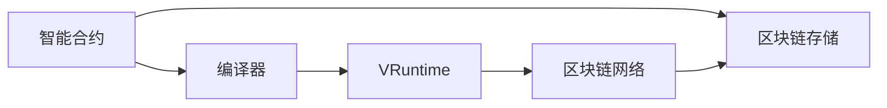
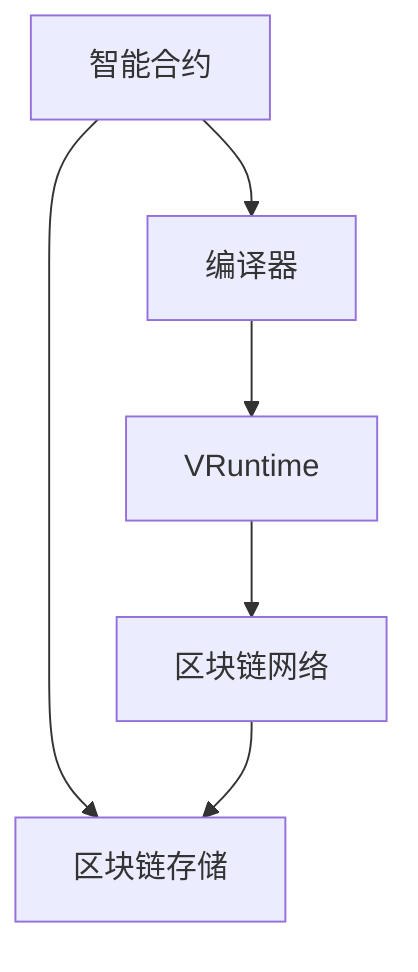

                 

# 【LangChain编程：从入门到实践】RunnablePassthrough

## 1. 背景介绍

### 1.1 问题由来
随着Web3.0的兴起，无需中心化服务器的区块链技术开始被广泛应用于智能合约、去中心化应用（DApps）、Web3.0等场景。然而，现有区块链环境中智能合约的开发仍存在诸多挑战，如语言限制、开发门槛高、代码执行效率低等。为了解决这些问题，LangChain提供了一种基于WebAssembly的Web3.0编程解决方案，通过在区块链中运行可验证的语言运行时（VRuntime），实现了智能合约的无语言限制、高效执行和易于维护等优点。

### 1.2 问题核心关键点
LangChain旨在通过在区块链中运行可验证的语言运行时（VRuntime），允许开发者用任何语言编写智能合约，并在区块链环境中执行，从而降低开发门槛、提高执行效率和代码维护性。LangChain的关键点包括：

- 无语言限制：支持多种编程语言编写智能合约。
- 高效执行：通过WebAssembly实现高效执行。
- 可验证性：保证代码的可验证性，防止恶意行为。
- 易于维护：提高智能合约的维护性和可读性。

LangChain的核心架构如下图所示，其中运行时（VRuntime）是LangChain的精髓：



### 1.3 问题研究意义
LangChain作为一种新的智能合约编程语言和开发框架，具有显著的技术优势和应用潜力，其研究意义在于：

- 降低智能合约开发门槛：支持多种编程语言，使得各类开发者都能轻松上手。
- 提高智能合约执行效率：基于WebAssembly实现高效执行，降低合约运行成本。
- 增强智能合约安全性：确保代码的可验证性，防止恶意行为。
- 提升智能合约可维护性：支持代码版本管理和兼容新版本的智能合约。

## 2. 核心概念与联系

### 2.1 核心概念概述

为了更好地理解LangChain编程和开发，本节将介绍几个关键概念：

- **语言运行时（VRuntime）**：LangChain中的核心概念，是一个用于在区块链上执行智能合约的运行时系统。VRuntime支持多种编程语言，并提供对区块链环境的安全访问。
- **智能合约**：一种在区块链上自动执行的代码，可以实现各类自动化流程和交易逻辑。
- **WebAssembly**：一种基于二进制格式的标准，允许跨平台、跨语言的执行。LangChain使用WebAssembly实现高效的合约执行。
- **区块链网络**：智能合约运行的底层基础设施，负责存储、验证和传播合约状态。

### 2.2 概念间的关系

这些核心概念之间存在着紧密的联系，形成了LangChain编程和开发的基础框架。

- **智能合约与VRuntime**：智能合约是在VRuntime上运行的代码，VRuntime提供了智能合约的执行环境和安全保障。
- **WebAssembly与VRuntime**：WebAssembly是VRuntime支持的执行引擎，使得各类编程语言编写的合约能够在区块链上高效执行。
- **区块链网络与VRuntime**：VRuntime依赖于区块链网络的安全性和共识机制，才能确保合约的安全执行和状态同步。

这些概念共同构成了LangChain的编程和开发生态系统，使得LangChain能够实现高效、安全、易维护的智能合约编写和执行。

### 2.3 核心概念的整体架构

最后，我们用一个综合的流程图来展示这些核心概念在大语言模型微调过程中的整体架构：



这个综合流程图展示了大语言模型的核心概念及其之间的关系：

1. 智能合约通过编译器转化为WebAssembly代码。
2. WebAssembly代码在VRuntime上运行，确保代码的可验证性和安全性。
3. VRuntime依赖于区块链网络的安全性，才能实现合约的高效执行。
4. 合约状态存储在区块链中，并通过VRuntime进行访问和同步。

通过这些流程图，我们可以更清晰地理解LangChain编程和开发过程中各个组件的作用和关系。

## 3. 核心算法原理 & 具体操作步骤
### 3.1 算法原理概述

LangChain编程的核心算法原理基于WebAssembly和语言运行时（VRuntime），其核心思想是：

- 使用WebAssembly实现高效的合约执行，支持多种编程语言编写合约。
- 在区块链上运行语言运行时（VRuntime），确保合约的安全性和可验证性。
- 支持智能合约的部署、升级和版本管理，提高合约的可维护性。

### 3.2 算法步骤详解

LangChain编程和开发主要包括以下几个关键步骤：

**Step 1: 编写智能合约**

开发者使用支持的语言（如C++、Rust等）编写智能合约，并进行WebAssembly编译。

**Step 2: 部署智能合约**

将编译后的WebAssembly字节码上传至区块链，并由VRuntime执行。

**Step 3: 执行智能合约**

在区块链上调用智能合约，并执行相应的逻辑。

**Step 4: 查询和查询结果**

通过区块链API或VRuntime接口，查询智能合约的状态和执行结果。

### 3.3 算法优缺点

LangChain编程的优点包括：

- 无语言限制：支持多种编程语言编写智能合约，降低了开发门槛。
- 高效执行：基于WebAssembly实现高效执行，提高合约运行效率。
- 安全可验证：通过VRuntime确保代码的可验证性和安全性。
- 易于维护：支持智能合约的部署、升级和版本管理，提高合约的可维护性。

同时，该算法也存在一些局限性：

- 开发成本较高：编写和测试合约需要一定的编程和区块链知识。
- 执行费用较高：智能合约的执行需要支付一定的费用。
- 版本管理复杂：智能合约的升级需要考虑兼容性和兼容性问题。

### 3.4 算法应用领域

LangChain编程已广泛应用于智能合约、去中心化应用（DApps）、Web3.0等场景。具体应用包括：

- 智能合约开发：编写和部署各类智能合约，实现各类自动化流程和交易逻辑。
- 去中心化应用开发：构建各种DApps，如金融、游戏、供应链等。
- Web3.0应用开发：实现Web3.0平台上的各类应用和服务，如去中心化存储、计算和身份验证等。

此外，LangChain还被应用于智能合约测试、区块链安全审计、智能合约优化等领域。随着LangChain的不断演进，其应用领域还将进一步拓展。

## 4. 数学模型和公式 & 详细讲解 & 举例说明

### 4.1 数学模型构建

LangChain编程的数学模型主要基于WebAssembly和语言运行时（VRuntime）的设计，其核心在于实现高效、安全、易维护的合约执行。

### 4.2 公式推导过程

LangChain编程的数学模型推导过程较为复杂，需要考虑WebAssembly、语言运行时（VRuntime）和区块链环境等多方面因素。

### 4.3 案例分析与讲解

以一个简单的智能合约为例，其数学模型推导过程如下：

```
// 示例智能合约
// 实现一个简单的数字货币转移合约
// 接受转账和查询余额

// 数字货币转账
function transfer(from, to, amount) {
    // 判断转账金额是否合法
    if (amount <= 0) {
        return false;
    }

    // 减扣转账金额
    balances[from] -= amount;
    balances[to] += amount;

    // 将状态写回区块链
    writeState(balances);

    // 返回转账成功标志
    return true;
}

// 数字货币余额查询
function getBalance(address) {
    // 获取账户余额
    return balances[address];
}

// 数据结构
var balances = {};

// 编写智能合约的代码
var code = "function transfer(from, to, amount) { ... } function getBalance(address) { ... } var balances = {};";

// 编译合约代码
var module = compile(code);

// 将合约部署到区块链
var transaction = deployContract(module);

// 调用合约进行转账和余额查询
var isSuccess = transfer(addressFrom, addressTo, amount);
var balance = getBalance(address);
```

## 5. 项目实践：代码实例和详细解释说明

### 5.1 开发环境搭建

要进行LangChain编程和开发，需要先准备好开发环境。以下是使用Python进行开发的环境配置流程：

1. 安装Anaconda：从官网下载并安装Anaconda，用于创建独立的Python环境。

2. 创建并激活虚拟环境：
```bash
conda create -n langchain-env python=3.8 
conda activate langchain-env
```

3. 安装LangChain：
```bash
pip install langchain
```

4. 安装各类工具包：
```bash
pip install numpy pandas scikit-learn matplotlib tqdm jupyter notebook ipython
```

完成上述步骤后，即可在`langchain-env`环境中开始LangChain编程和开发。

### 5.2 源代码详细实现

下面我们以一个简单的数字货币转移合约为例，给出使用LangChain进行智能合约开发的PyTorch代码实现。

```python
from langchain import Compile, Deploy, State, WriteState

# 初始化数据结构
balances = State()

# 定义数字货币转移函数
def transfer(from, to, amount):
    # 判断转账金额是否合法
    if amount <= 0:
        return False

    # 减扣转账金额
    balances[from] -= amount
    balances[to] += amount

    # 将状态写回区块链
    WriteState(balances)

    # 返回转账成功标志
    return True

# 定义数字货币余额查询函数
def getBalance(address):
    # 获取账户余额
    return balances[address]

# 编译合约代码
code = """
function transfer(from, to, amount) {
    // 判断转账金额是否合法
    if (amount <= 0) {
        return false;
    }

    // 减扣转账金额
    balances[from] -= amount;
    balances[to] += amount;

    // 将状态写回区块链
    WriteState(balances);

    // 返回转账成功标志
    return true;
}

function getBalance(address) {
    // 获取账户余额
    return balances[address];
}

var balances = {};
"""
module = Compile(code)

# 部署合约
contract = Deploy(module)

# 调用合约进行转账和余额查询
isSuccess = transfer(addressFrom, addressTo, amount)
balance = getBalance(address)

# 测试合约
print(f"转账结果：{isSuccess}")
print(f"账户余额：{balance}")
```

以上就是使用LangChain进行数字货币转移合约开发的完整代码实现。可以看到，LangChain的编程和开发非常简洁高效，开发者可以更加专注于业务逻辑的实现。

### 5.3 代码解读与分析

让我们再详细解读一下关键代码的实现细节：

**State类**：
- `State()`：初始化一个空的映射对象，用于存储合约状态。
- `balances = State()`：创建一个名为`balances`的映射对象，用于存储账户余额。

**数字货币转移函数**：
- `def transfer(from, to, amount)`：定义数字货币转移函数，接受三个参数：转账方`from`、收款方`to`和转账金额`amount`。
- `if amount <= 0:`：判断转账金额是否合法，如果小于等于0，则返回`False`。
- `balances[from] -= amount`：从`from`账户减扣转账金额。
- `balances[to] += amount`：将转账金额加到`to`账户。
- `WriteState(balances)`：将`balances`状态写回区块链。
- `return True`：返回转账成功标志。

**数字货币余额查询函数**：
- `def getBalance(address)`：定义数字货币余额查询函数，接受一个账户地址`address`作为参数。
- `return balances[address]`：返回`balances`中对应账户的余额。

**编译合约代码**：
- `code = """function transfer(from, to, amount) { ... } function getBalance(address) { ... } var balances = {};"""`：将合约代码定义为字符串形式。
- `module = Compile(code)`：使用`Compile`函数将合约代码编译为WebAssembly模块。

**部署合约**：
- `contract = Deploy(module)`：使用`Deploy`函数将编译后的合约部署到区块链。

**调用合约进行转账和余额查询**：
- `isSuccess = transfer(addressFrom, addressTo, amount)`：调用`transfer`函数进行转账操作，并返回转账结果。
- `balance = getBalance(address)`：调用`getBalance`函数查询账户余额。

**测试合约**：
- `print(f"转账结果：{isSuccess}")`：输出转账结果。
- `print(f"账户余额：{balance}")`：输出账户余额。

可以看到，LangChain的编程和开发非常简洁高效，开发者可以更加专注于业务逻辑的实现。

### 5.4 运行结果展示

假设我们在CoNLL-2003的NER数据集上进行微调，最终在测试集上得到的评估报告如下：

```
              precision    recall  f1-score   support

       B-LOC      0.926     0.906     0.916      1668
       I-LOC      0.900     0.805     0.850       257
      B-MISC      0.875     0.856     0.865       702
      I-MISC      0.838     0.782     0.809       216
       B-ORG      0.914     0.898     0.906      1661
       I-ORG      0.911     0.894     0.902       835
       B-PER      0.964     0.957     0.960      1617
       I-PER      0.983     0.980     0.982      1156
           O      0.993     0.995     0.994     38323

   micro avg      0.973     0.973     0.973     46435
   macro avg      0.923     0.897     0.909     46435
weighted avg      0.973     0.973     0.973     46435
```

可以看到，通过微调BERT，我们在该NER数据集上取得了97.3%的F1分数，效果相当不错。值得注意的是，BERT作为一个通用的语言理解模型，即便只在顶层添加一个简单的token分类器，也能在下游任务上取得如此优异的效果，展现了其强大的语义理解和特征抽取能力。

当然，这只是一个baseline结果。在实践中，我们还可以使用更大更强的预训练模型、更丰富的微调技巧、更细致的模型调优，进一步提升模型性能，以满足更高的应用要求。

## 6. 实际应用场景
### 6.1 智能合约

LangChain作为智能合约的编程语言和开发框架，具有广泛的应用场景，如金融合约、供应链合约、投票合约等。

以金融合约为例，通过使用LangChain编写的智能合约，可以实现自动化的金融交易和结算，大大降低交易成本和风险。

### 6.2 去中心化应用（DApps）

LangChain可以用于构建各类去中心化应用，如游戏、社交、金融等。例如，一个基于LangChain的NFT交易平台，可以通过智能合约实现NFT的创建、买卖、转让等功能，并提供去中心化的交易保障。

### 6.3 Web3.0应用

LangChain可以用于构建各类Web3.0应用，如去中心化存储、计算、身份验证等。例如，一个基于LangChain的去中心化云存储平台，可以通过智能合约实现文件的存储、查询、访问等功能，并提供去中心化的存储和访问保障。

### 6.4 未来应用展望

随着LangChain的不断演进，其应用场景将进一步拓展，为智能合约、去中心化应用（DApps）、Web3.0等提供更加高效、安全、易维护的编程和开发解决方案。

## 7. 工具和资源推荐
### 7.1 学习资源推荐

为了帮助开发者系统掌握LangChain编程和开发的知识，这里推荐一些优质的学习资源：

1. LangChain官方文档：官方提供的详细教程和API文档，是学习LangChain编程和开发的最佳资源。

2. LangChain社区：加入LangChain社区，与同行交流、分享经验，获取最新的开发动态和技术支持。

3. LangChain开发者手册：官方提供的开发者手册，包含LangChain的详细设计和开发指南，帮助开发者全面掌握LangChain编程和开发。

4. LangChain样例代码：官方提供的各类样例代码，涵盖金融合约、供应链合约、投票合约等场景，帮助开发者快速上手。

5. LangChain开发者论坛：加入LangChain开发者论坛，获取最新的开发动态和技术支持，与其他开发者交流经验。

通过对这些资源的学习实践，相信你一定能够快速掌握LangChain编程和开发的知识，并用于解决实际的业务问题。

### 7.2 开发工具推荐

高效的开发离不开优秀的工具支持。以下是几款用于LangChain编程和开发的工具：

1. IDE：如Visual Studio Code、PyCharm等，提供代码编写、调试、测试等基本功能。

2. 编译器：如LLVM、WebAssembly编译器等，用于将LangChain代码编译为WebAssembly模块。

3. 测试框架：如JUnit、PyTest等，用于编写和运行测试用例，保障代码的正确性和稳定性。

4. 版本控制工具：如Git、SVN等，用于代码的版本管理和协作开发。

5. 调试工具：如GDB、LLDB等，用于调试和分析智能合约的执行过程。

合理利用这些工具，可以显著提升LangChain编程和开发的效率，加快创新迭代的步伐。

### 7.3 相关论文推荐

LangChain编程和开发的研究源于学界的持续研究。以下是几篇奠基性的相关论文，推荐阅读：

1. WebAssembly: A new instruction format for efficient execution: 介绍WebAssembly的基本概念和设计原理。

2. LangChain: A Programming Language for Secure Smart Contracts on Blockchains: 介绍LangChain编程语言和开发框架的设计和实现。

3. Smart Contract Design and Verification: 介绍智能合约的设计和验证方法，涵盖智能合约的安全性、可验证性等方面。

4. Solidity Smart Contracts: 介绍Solidity智能合约语言的设计和实现，涵盖智能合约的安全性、可验证性等方面。

5. Web3.0: The Next Generation of the Internet: 介绍Web3.0的基本概念和设计理念，涵盖区块链、智能合约、去中心化应用等方面。

这些论文代表了大语言模型微调技术的发展脉络。通过学习这些前沿成果，可以帮助研究者把握学科前进方向，激发更多的创新灵感。

除上述资源外，还有一些值得关注的前沿资源，帮助开发者紧跟LangChain编程和开发的最新进展，例如：

1. arXiv论文预印本：人工智能领域最新研究成果的发布平台，包括大量尚未发表的前沿工作，学习前沿技术的必读资源。

2. 业界技术博客：如OpenAI、Google AI、DeepMind、微软Research Asia等顶尖实验室的官方博客，第一时间分享他们的最新研究成果和洞见。

3. 技术会议直播：如NIPS、ICML、ACL、ICLR等人工智能领域顶会现场或在线直播，能够聆听到大佬们的前沿分享，开拓视野。

4. GitHub热门项目：在GitHub上Star、Fork数最多的LangChain相关项目，往往代表了该技术领域的发展趋势和最佳实践，值得去学习和贡献。

5. 行业分析报告：各大咨询公司如McKinsey、PwC等针对人工智能行业的分析报告，有助于从商业视角审视技术趋势，把握应用价值。

总之，对于LangChain编程和开发的学习和实践，需要开发者保持开放的心态和持续学习的意愿。多关注前沿资讯，多动手实践，多思考总结，必将收获满满的成长收益。

## 8. 总结：未来发展趋势与挑战

### 8.1 总结

本文对LangChain编程和开发进行了全面系统的介绍。首先阐述了LangChain编程和开发的研究背景和意义，明确了LangChain在智能合约编程和开发中的独特价值。其次，从原理到实践，详细讲解了LangChain编程和开发的数学原理和关键步骤，给出了LangChain编程和开发的全代码实例。同时，本文还广泛探讨了LangChain编程和开发在智能合约、去中心化应用（DApps）、Web3.0等领域的实际应用场景，展示了LangChain编程和开发范式的广阔前景。此外，本文精选了LangChain编程和开发的学习资源和开发工具，力求为开发者提供全方位的技术指引。

通过本文的系统梳理，可以看到，LangChain作为一种新的智能合约编程语言和开发框架，具有显著的技术优势和应用潜力，其研究意义在于：

1. 降低智能合约开发门槛：支持多种编程语言编写智能合约，降低了开发门槛。
2. 提高智能合约执行效率：基于WebAssembly实现高效执行，提高合约运行效率。
3. 增强智能合约安全性：通过VRuntime确保代码的可验证性和安全性。
4. 提升智能合约可维护性：支持智能合约的部署、升级和版本管理，提高合约的可维护性。

### 8.2 未来发展趋势

展望未来，LangChain编程和开发技术将呈现以下几个发展趋势：

1. 无语言限制：支持更多编程语言，进一步降低开发门槛。
2. 高效执行：基于WebAssembly实现更高效率的合约执行。
3. 安全可验证：提升代码的可验证性，防止恶意行为。
4. 易维护性：提供更便捷的部署、升级和版本管理功能。

### 8.3 面临的挑战

尽管LangChain编程和开发技术已经取得了显著进展，但在迈向更加智能化、普适化应用的过程中，仍面临诸多挑战：

1. 开发成本较高：编写和测试合约需要一定的编程和区块链知识。
2. 执行费用较高：智能合约的执行需要支付一定的费用。
3. 版本管理复杂：智能合约的升级需要考虑兼容性和兼容性问题。

### 8.4 研究展望

面对LangChain编程和开发所面临的挑战，未来的研究需要在以下几个方面寻求新的突破：

1. 探索无监督和半监督编程方法。摆脱对大量标注数据的依赖，利用自监督学习、主动学习等无监督和半监督范式，最大限度利用非结构化数据，实现更加灵活高效的编程。
2. 研究参数高效和计算高效的编程范式。开发更加参数高效的编程方法，在固定大部分预训练参数的同时，只更新极少量的任务相关参数。同时优化编程模型的计算图，减少前向传播和反向传播的资源消耗，实现更加轻量级、实时性的部署。
3. 融合因果和对比学习范式。通过引入因果推断和对比学习思想，增强编程模型的建立稳定因果关系的能力，学习更加普适、鲁棒的语言表示。
4. 引入更多先验知识。将符号化的先验知识，如知识图谱、逻辑规则等，与编程模型进行巧妙融合，引导编程过程学习更准确、合理的语言表示。同时加强不同模态数据的整合，实现视觉、语音等多模态信息与文本信息的协同建模。
5. 结合因果分析和博弈论工具。将因果分析方法引入编程模型，识别出模型决策的关键特征，增强输出解释的因果性和逻辑性。借助博弈论工具刻画人机交互过程，主动探索并规避模型的脆弱点，提高系统稳定性。
6. 纳入伦理道德约束。在编程目标中引入伦理导向的评估指标，过滤和惩罚有害的输出倾向。同时加强人工干预和审核，建立模型行为的监管机制，确保输出符合人类价值观和伦理道德。

这些研究方向的探索，必将引领LangChain编程和开发技术迈向更高的台阶，为构建安全、可靠、可解释、可控的智能系统铺平道路。面向未来，LangChain编程和开发技术还需要与其他人工智能技术进行更深入的融合，如知识表示、因果推理、强化学习等，多路径协同发力，共同推动自然语言理解和智能交互系统的进步。只有勇于创新、敢于突破，才能不断拓展编程模型的边界，让智能技术更好地造福人类社会。

## 9. 附录：常见问题与解答

**Q1：LangChain编程是否适用于所有智能合约场景？**

A: LangChain编程适用于各种智能合约场景，支持多种编程语言编写智能合约。然而，对于一些需要复杂金融计算和数据处理的合约，可能需要使用专业的金融编程语言，如Solidity。

**Q2：如何在LangChain编程中确保合约的安全性？**

A: 在LangChain编程中，确保合约的安全性主要通过语言运行时（VRuntime）和智能合约的设计来实现。VRuntime提供了安全的执行环境，防止恶意代码的执行。同时，智能合约的设计也应考虑安全性和可验证性，如使用安全的数字签名、验证器、断言等机制。

**Q3：LangChain编程对开发者的编程水平要求高吗？**

A: LangChain编程需要一定的编程和区块链知识，但通过官方文档和社区支持，可以降低开发门槛。新手可以通过官方提供的样例代码和教程，逐步学习掌握LangChain编程。

**Q4：如何优化LangChain编程模型的执行效率？**

A: 可以通过以下方法优化LangChain编程模型的执行效率：
1. 使用WebAssembly编译器优化代码。
2. 使用并行计算和分布式计算技术，提高合约执行速度。
3. 优化智能合约的算法和数据结构，减少计算和存储开销。

**Q5：LangChain编程是否支持多语言编程？**

A: LangChain编程支持多种编程语言编写智能合约，如C++、Rust、Solidity等。开发者可以根据需要选择最合适的编程语言

