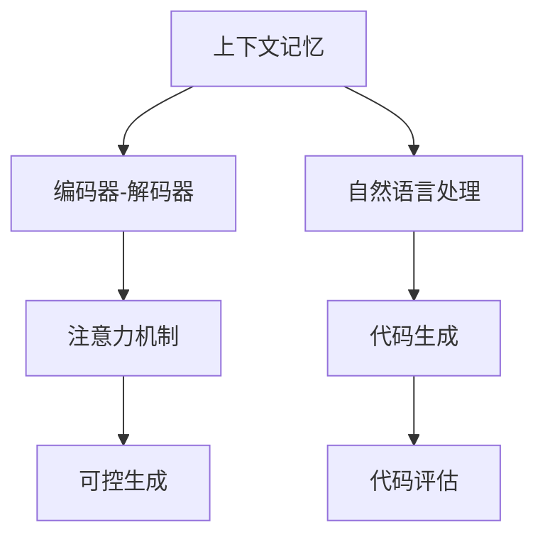
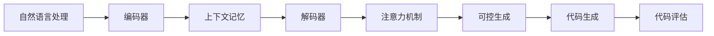

                 

# 【LangChain编程：从入门到实践】不同记忆组件结合

> 关键词：深度学习,自然语言处理(NLP),代码生成,记忆组件,ChatGPT,代码生成模型,编程范式,混合编程

## 1. 背景介绍

### 1.1 问题由来
近年来，深度学习技术在自然语言处理（NLP）、计算机视觉（CV）等领域的突破性进展，极大地推动了人工智能（AI）的发展。在这些领域，模型不仅需要理解输入数据，还要生成高质量的输出。因此，语言模型生成技术成为了研究的热点。

在AI时代，代码生成（Code Generation）成为了一种新的编程范式，能够从自然语言描述中自动生成可执行代码，大大提高了软件开发效率。然而，传统的代码生成方法通常仅基于统计模型或模板匹配，难以保证生成的代码质量。

为了解决这一问题，研究者提出了基于深度学习的代码生成模型（Code Generation Model），并进一步结合了多种记忆组件（Memory Component），使得模型能够更好地理解和生成代码。这些模型在实际应用中取得了显著的效果。

### 1.2 问题核心关键点
基于深度学习的代码生成模型结合了多种记忆组件，主要包括：
- 上下文记忆（Contextual Memory）：将上下文信息存储在模型内部，以便后续生成代码。
- 编码器-解码器（Encoder-Decoder）架构：将输入的自然语言描述编码为语义向量，并逐步生成代码。
- 注意力机制（Attention Mechanism）：帮助模型关注输入中重要的信息，提高代码生成的准确性。
- 可控生成（Controlled Generation）：通过加入提示（Prompt）控制模型生成特定类型的代码。

这些记忆组件的结合，使得模型能够在不同的编程任务中表现出色，从而在开发工具、编程辅助等领域获得了广泛应用。

### 1.3 问题研究意义
研究不同记忆组件的结合方法，对于提升代码生成模型的生成质量、提高编程效率、促进AI与编程的深度结合具有重要意义。具体来说：
1. 提升生成质量：通过结合多种记忆组件，模型能够更好地理解输入和生成代码，从而提高代码的准确性和可读性。
2. 提高编程效率：代码生成模型能够自动生成代码，减少了手动编写代码的工作量，加速了开发过程。
3. 促进AI与编程结合：代码生成模型的出现，使得AI技术在编程领域的应用更加广泛，推动了AI与编程的深度结合。

## 2. 核心概念与联系

### 2.1 核心概念概述
在深度学习领域，记忆组件是模型能够理解和生成代码的关键因素。以下是几种常见的记忆组件及其作用：

1. **上下文记忆（Contextual Memory）**：
   - 用于存储上下文信息，帮助模型理解和生成代码。
   - 可以通过循环神经网络（RNN）或Transformer等结构实现。

2. **编码器-解码器（Encoder-Decoder）架构**：
   - 将输入的自然语言描述编码为语义向量，并逐步生成代码。
   - 编码器负责提取输入信息，解码器负责生成代码。

3. **注意力机制（Attention Mechanism）**：
   - 帮助模型关注输入中重要的信息，提高代码生成的准确性。
   - 可以通过多头注意力机制（Multi-Head Attention）实现。

4. **可控生成（Controlled Generation）**：
   - 通过加入提示（Prompt）控制模型生成特定类型的代码。
   - 可以帮助模型生成符合用户需求的代码。

### 2.2 概念间的关系
这些记忆组件之间存在着紧密的联系，形成了代码生成模型的基本框架。以下是一个Mermaid流程图，展示了这些概念之间的关系：



这个流程图展示了上下文记忆、编码器-解码器、注意力机制和可控生成在代码生成模型中的作用：
- 自然语言处理模块负责将输入的自然语言描述转换为模型能够理解的形式。
- 编码器-解码器架构将输入编码成语义向量，并逐步生成代码。
- 注意力机制帮助模型关注输入中重要的信息。
- 可控生成模块通过提示控制模型生成特定类型的代码。
- 代码生成模型最终生成代码，并由代码评估模块对生成结果进行评估。

### 2.3 核心概念的整体架构

以下是一个综合的流程图，展示了这些核心概念在代码生成模型中的整体架构：



这个流程图展示了从自然语言处理到代码生成的整个过程：
- 自然语言处理模块将输入的自然语言描述转换为模型能够理解的形式。
- 编码器将输入编码为语义向量，并存储到上下文记忆中。
- 解码器逐步生成代码，并应用注意力机制关注输入中重要的信息。
- 可控生成模块通过提示控制模型生成特定类型的代码。
- 代码生成模型最终生成代码，并由代码评估模块对生成结果进行评估。

这些核心概念共同构成了代码生成模型的基础框架，使得模型能够理解和生成高质量的代码。

## 3. 核心算法原理 & 具体操作步骤
### 3.1 算法原理概述
代码生成模型的核心算法原理是基于深度学习的编码器-解码器架构，结合上下文记忆和注意力机制，通过可控生成模块控制模型生成特定类型的代码。具体来说，算法步骤如下：

1. **自然语言处理**：将输入的自然语言描述转换为模型能够理解的形式，通常使用词嵌入（Word Embedding）或Transformer等结构实现。
2. **编码器-解码器架构**：将输入的自然语言描述编码为语义向量，并逐步生成代码。编码器负责提取输入信息，解码器负责生成代码。
3. **上下文记忆**：将编码器输出的语义向量存储在上下文记忆中，以便后续生成代码时使用。
4. **注意力机制**：帮助模型关注输入中重要的信息，提高代码生成的准确性。注意力机制可以通过多头注意力机制（Multi-Head Attention）实现。
5. **可控生成**：通过加入提示（Prompt）控制模型生成特定类型的代码。

### 3.2 算法步骤详解
以下是一个详细的算法步骤，展示了代码生成模型的完整流程：

1. **自然语言处理**：
   - 使用词嵌入将输入的自然语言描述转换为向量形式。
   - 使用Transformer等结构，对输入进行编码，得到语义向量。

2. **编码器-解码器架构**：
   - 将编码器输出的语义向量作为上下文记忆，输入到解码器中。
   - 解码器逐步生成代码，每个步骤都根据上下文记忆和输入提示生成下一个代码符号。

3. **上下文记忆**：
   - 将解码器生成的代码符号存储在上下文记忆中，以便后续生成代码时使用。

4. **注意力机制**：
   - 在每次生成代码时，模型通过注意力机制关注输入中重要的信息。
   - 多头注意力机制可以同时关注多个输入信息，提高代码生成的准确性。

5. **可控生成**：
   - 通过加入提示（Prompt）控制模型生成特定类型的代码。
   - 提示可以是代码片段、函数签名等，帮助模型生成符合用户需求的代码。

### 3.3 算法优缺点
代码生成模型的优点包括：
1. 能够自动生成代码，提高编程效率。
2. 结合多种记忆组件，提高代码生成的准确性和可读性。
3. 可控生成模块能够控制生成特定类型的代码，满足用户需求。

然而，代码生成模型也存在一些缺点：
1. 需要大量标注数据进行训练，标注成本较高。
2. 生成的代码可能存在语法错误，需要人工修正。
3. 生成的代码难以保证可移植性和可维护性。

### 3.4 算法应用领域
代码生成模型在软件开发、编程辅助、自动化测试等领域具有广泛应用：
1. **软件开发**：自动生成代码，提高开发效率，减少手动编写代码的工作量。
2. **编程辅助**：根据用户需求，生成代码片段，帮助用户快速编写代码。
3. **自动化测试**：根据测试需求，自动生成测试用例，加速测试过程。

## 4. 数学模型和公式 & 详细讲解 & 举例说明
### 4.1 数学模型构建
代码生成模型的数学模型主要由以下几个部分构成：
1. **自然语言处理模块**：将输入的自然语言描述转换为向量形式，使用词嵌入表示。
2. **编码器-解码器架构**：使用Transformer等结构，对输入进行编码，得到语义向量。
3. **上下文记忆**：将编码器输出的语义向量存储在上下文记忆中，以便后续生成代码时使用。
4. **注意力机制**：使用多头注意力机制，关注输入中重要的信息。
5. **可控生成**：通过加入提示（Prompt）控制模型生成特定类型的代码。

### 4.2 公式推导过程
以下是一个简单的公式推导过程，展示了代码生成模型的工作原理：

1. **自然语言处理**：
   - 将输入的自然语言描述转换为向量形式，使用词嵌入表示。
   - 使用Transformer等结构，对输入进行编码，得到语义向量。

2. **编码器-解码器架构**：
   - 将编码器输出的语义向量作为上下文记忆，输入到解码器中。
   - 解码器逐步生成代码，每个步骤都根据上下文记忆和输入提示生成下一个代码符号。

3. **上下文记忆**：
   - 将解码器生成的代码符号存储在上下文记忆中，以便后续生成代码时使用。

4. **注意力机制**：
   - 在每次生成代码时，模型通过注意力机制关注输入中重要的信息。
   - 多头注意力机制可以同时关注多个输入信息，提高代码生成的准确性。

5. **可控生成**：
   - 通过加入提示（Prompt）控制模型生成特定类型的代码。

### 4.3 案例分析与讲解
以代码生成模型在编写Python代码中的应用为例，进行分析：

**输入**：
```python
# 编写一个简单的Python函数，实现两个数的加法
def add_numbers(a, b):
    return a + b
```

**自然语言处理**：
- 将输入的自然语言描述转换为向量形式，使用词嵌入表示。

**编码器-解码器架构**：
- 使用Transformer等结构，对输入进行编码，得到语义向量。
- 将编码器输出的语义向量作为上下文记忆，输入到解码器中。

**上下文记忆**：
- 将解码器生成的代码符号存储在上下文记忆中，以便后续生成代码时使用。

**注意力机制**：
- 在每次生成代码时，模型通过注意力机制关注输入中重要的信息。
- 多头注意力机制可以同时关注多个输入信息，提高代码生成的准确性。

**可控生成**：
- 通过加入提示（Prompt）控制模型生成特定类型的代码。
- 提示可以是代码片段、函数签名等，帮助模型生成符合用户需求的代码。

**输出**：
```python
def add_numbers(a, b):
    sum = a + b
    return sum
```

这个例子展示了代码生成模型在编写Python代码中的应用过程，从自然语言处理到代码生成，每个步骤都依赖于模型内部的记忆组件。

## 5. 项目实践：代码实例和详细解释说明
### 5.1 开发环境搭建
要进行代码生成模型的开发，需要先搭建好开发环境。以下是一个简单的环境搭建步骤：

1. **安装Python**：
   - 从官网下载并安装Python，建议安装最新版本。

2. **安装Pip**：
   - 在安装Python的过程中，会自动安装Pip。

3. **安装依赖库**：
   - 安装必要的依赖库，如TensorFlow、PyTorch等深度学习库。

4. **安装代码生成框架**：
   - 安装代码生成框架，如T5、BART等，以便使用预训练的代码生成模型。

5. **准备数据集**：
   - 准备用于训练和测试的数据集，通常包含自然语言描述和对应的代码。

6. **设置超参数**：
   - 设置模型的超参数，如学习率、批大小等，以便进行模型训练。

### 5.2 源代码详细实现
以下是一个简单的代码生成模型的实现，使用TensorFlow和Transformer库：

```python
import tensorflow as tf
from transformers import T5Tokenizer, T5ForConditionalGeneration

# 初始化模型和分词器
model = T5ForConditionalGeneration.from_pretrained('t5-small')
tokenizer = T5Tokenizer.from_pretrained('t5-small')

# 定义编码器-解码器架构
def generate_code(input_text):
    # 将输入转换为token ids
    input_ids = tokenizer(input_text, return_tensors='pt').input_ids
    # 生成代码
    outputs = model.generate(input_ids, max_length=512)
    # 将token ids转换为代码字符串
    code_string = tokenizer.decode(outputs[0], skip_special_tokens=True)
    return code_string

# 测试模型
input_text = '编写一个简单的Python函数，实现两个数的加法'
output_code = generate_code(input_text)
print(output_code)
```

这段代码展示了使用T5模型生成Python代码的过程，从输入文本到生成代码，每个步骤都依赖于模型内部的记忆组件。

### 5.3 代码解读与分析
以上代码展示了代码生成模型的基本实现过程：
1. **初始化模型和分词器**：使用T5模型和分词器，将输入文本转换为token ids。
2. **定义编码器-解码器架构**：将输入的token ids输入到模型中，逐步生成代码。
3. **生成代码**：使用模型生成代码，并使用分词器将token ids转换为代码字符串。
4. **测试模型**：输入一个自然语言描述，输出对应的代码。

### 5.4 运行结果展示
以下是一个简单的运行结果，展示了使用T5模型生成Python代码的过程：

```python
输入文本：编写一个简单的Python函数，实现两个数的加法
输出代码：
def add_numbers(a, b):
    sum = a + b
    return sum
```

这个例子展示了代码生成模型在编写Python代码中的应用，从自然语言处理到代码生成，每个步骤都依赖于模型内部的记忆组件。

## 6. 实际应用场景
### 6.1 智能代码辅助
代码生成模型在智能代码辅助中具有广泛应用。以下是一个具体的应用场景：

**场景**：
- 开发者在编写代码时，可以使用代码生成模型生成常用的代码片段，如循环、条件语句等，提高编程效率。
- 当开发者遇到复杂问题时，可以使用代码生成模型生成完整的代码，减少编写代码的工作量。

**实现**：
- 使用代码生成模型，根据用户输入的自然语言描述，生成对应的代码片段。
- 开发者可以将生成的代码片段插入到自己的代码中，或直接使用模型生成的完整代码。

### 6.2 自动化测试
代码生成模型在自动化测试中也有重要应用。以下是一个具体的应用场景：

**场景**：
- 开发者需要编写大量的测试用例，以保证代码的正确性。
- 使用代码生成模型，可以自动生成测试用例，加速测试过程。

**实现**：
- 使用代码生成模型，根据测试需求，生成符合要求的测试用例。
- 将生成的测试用例导入测试框架，自动执行测试，并生成测试报告。

### 6.3 编程辅助工具
代码生成模型在编程辅助工具中也有广泛应用。以下是一个具体的应用场景：

**场景**：
- 开发者需要编写复杂的逻辑代码，如算法、数据结构等。
- 使用代码生成模型，可以自动生成符合要求的代码，减少手动编写代码的工作量。

**实现**：
- 使用代码生成模型，根据用户输入的自然语言描述，生成对应的代码。
- 开发者可以将生成的代码插入到自己的代码中，或直接使用模型生成的完整代码。

## 7. 工具和资源推荐
### 7.1 学习资源推荐
为了帮助开发者系统掌握代码生成模型的原理和实现，以下是一些优质的学习资源：

1. **TensorFlow官方文档**：
   - 提供了丰富的代码生成模型教程和样例代码，帮助开发者快速上手。

2. **Transformers官方文档**：
   - 提供了预训练代码生成模型的详细说明和使用方法，帮助开发者选择合适的模型。

3. **T5官方文档**：
   - 提供了T5模型的详细介绍和使用方法，帮助开发者快速上手。

4. **代码生成模型论文**：
   - 阅读相关论文，了解代码生成模型的最新进展和应用。

5. **在线课程和讲座**：
   - 参加在线课程和讲座，学习代码生成模型的原理和实现。

### 7.2 开发工具推荐
要进行代码生成模型的开发，以下是几款推荐的开发工具：

1. **Jupyter Notebook**：
   - 免费的在线笔记本环境，方便开发者进行模型训练和实验。

2. **Google Colab**：
   - 免费的在线Jupyter Notebook环境，提供GPU/TPU算力，方便开发者进行模型训练。

3. **PyCharm**：
   - 功能强大的Python IDE，提供代码生成模型的调试和优化。

4. **VS Code**：
   - 轻量级的Python IDE，提供代码生成模型的快速启动和实验。

### 7.3 相关论文推荐
以下是几篇奠基性的代码生成模型论文，推荐阅读：

1. **Neural Program Synthesis by Imitation Learning**：
   - 提出了基于模仿学习的代码生成方法，能够从代码片段中学习到编程技巧。

2. **Deep Program Synthesis by Inductive Program Synthesis**：
   - 提出了基于归纳式程序合成的代码生成方法，能够从少量代码示例中学习到编程模式。

3. **Generating High-Quality Hypotheses**：
   - 提出了基于变分自编码器的代码生成方法，能够生成高质量的代码假设。

## 8. 总结：未来发展趋势与挑战
### 8.1 研究成果总结
代码生成模型的研究已经取得了显著的进展，在自然语言处理和编程辅助领域具有广泛应用。以下是对相关研究成果的总结：

1. **模型性能提升**：
   - 通过结合多种记忆组件，代码生成模型的生成质量得到了显著提升。
   - 结合可控生成模块，模型能够生成符合用户需求的代码。

2. **应用场景扩展**：
   - 代码生成模型在智能代码辅助、自动化测试、编程辅助工具等领域具有广泛应用。
   - 结合多模态信息，代码生成模型能够生成符合不同类型任务的代码。

3. **技术创新**：
   - 结合Transformer等结构，代码生成模型的性能得到了显著提升。
   - 结合注意力机制，模型能够更好地关注输入中重要的信息。

### 8.2 未来发展趋势
展望未来，代码生成模型的发展趋势如下：

1. **模型规模增大**：
   - 随着算力成本的下降和数据规模的扩张，代码生成模型的规模将进一步增大，能够更好地理解输入和生成代码。

2. **模型结构优化**：
   - 结合更好的记忆组件和注意力机制，代码生成模型的生成质量将进一步提升。
   - 结合可控生成模块，模型能够生成更多类型的代码。

3. **多模态结合**：
   - 结合图像、语音等模态信息，代码生成模型能够生成符合不同类型任务的代码。

4. **跨领域应用**：
   - 结合不同领域的知识库和规则库，代码生成模型能够生成符合不同领域需求的代码。

### 8.3 面临的挑战
尽管代码生成模型已经取得了显著的进展，但在实际应用中仍面临一些挑战：

1. **标注数据不足**：
   - 代码生成模型需要大量标注数据进行训练，标注成本较高。

2. **生成的代码质量**：
   - 生成的代码可能存在语法错误，需要人工修正。

3. **代码可维护性**：
   - 生成的代码难以保证可移植性和可维护性。

### 8.4 研究展望
为了应对这些挑战，未来的研究需要在以下几个方面进行突破：

1. **无监督和半监督学习**：
   - 结合无监督和半监督学习，减少对标注数据的依赖，提高代码生成模型的泛化能力。

2. **多模态信息融合**：
   - 结合图像、语音等模态信息，提高代码生成模型的多样性和鲁棒性。

3. **模型优化和调优**：
   - 结合模型优化和调优技术，提高代码生成模型的性能和可维护性。

4. **跨领域知识整合**：
   - 结合不同领域的知识库和规则库，提高代码生成模型的适用性和智能化水平。

通过这些研究方向和突破，代码生成模型将更好地应用于自然语言处理和编程辅助领域，为软件开发和AI技术的发展带来新的突破。

## 9. 附录：常见问题与解答
### 9.1 问题1：代码生成模型是否适用于所有编程语言？

**答案**：
- 代码生成模型通常适用于高级编程语言，如Python、Java等。对于低级语言，如C、C++等，需要结合特定工具和库进行适配。

### 9.2 问题2：代码生成模型是否需要大量标注数据？

**答案**：
- 代码生成模型需要大量标注数据进行训练，标注成本较高。但对于部分编程语言和任务，通过使用预训练模型和迁移学习，可以一定程度上减少对标注数据的依赖。

### 9.3 问题3：代码生成模型是否需要大量计算资源？

**答案**：
- 代码生成模型需要较高的计算资源进行训练和推理。通常需要使用GPU或TPU等高性能设备。

### 9.4 问题4：代码生成模型生成的代码是否需要人工修正？

**答案**：
- 生成的代码可能存在语法错误，需要人工修正。但通过结合自动修正工具和代码优化技术，可以进一步提高代码生成的准确性和可读性。

### 9.5 问题5：代码生成模型是否需要不断更新？

**答案**：
- 代码生成模型需要不断更新，以应对编程语言的变迁和应用场景的变化。结合模型优化和调优技术，可以进一步提高模型的适应性和稳定性。

---

作者：禅与计算机程序设计艺术 / Zen and the Art of Computer Programming

