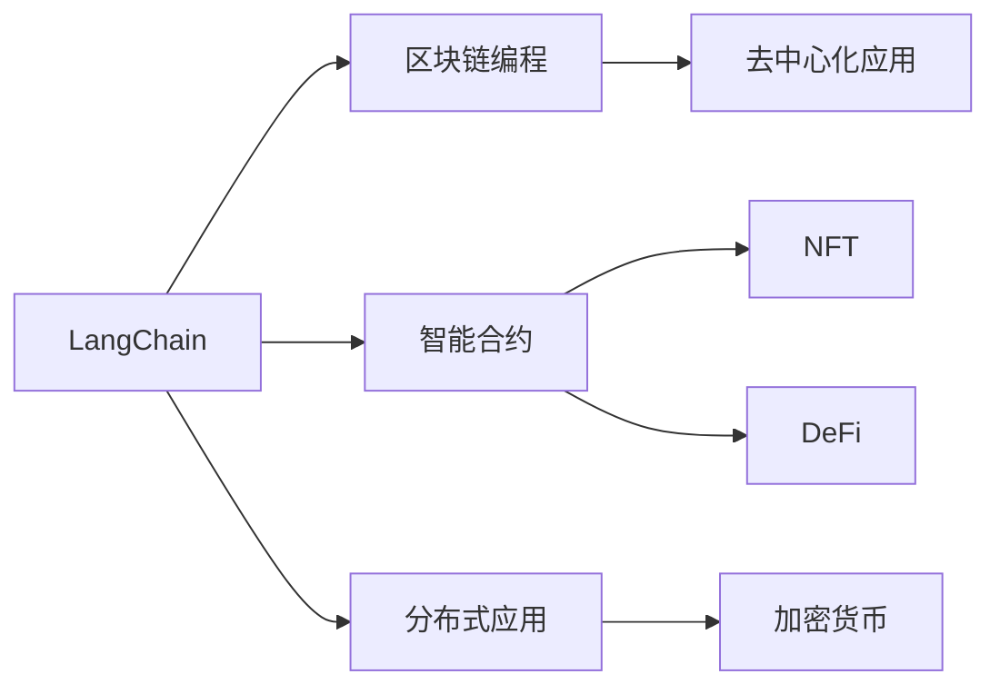

                 

# 【LangChain编程：从入门到实践】参与社区活动

> 关键词：
- LangChain
- 区块链编程
- 智能合约开发
- 分布式应用
- 加密货币
- 社区活动
- 去中心化应用

## 1. 背景介绍

在当今数字化时代，区块链和智能合约技术正迅速改变着我们的生活方式和商业模式。这种去中心化的创新架构为全球各地的创新者提供了巨大的机会，使得他们能够以透明、安全和可信任的方式构建和部署新的应用。LangChain作为一种高级的智能合约编程语言，其简洁的语法和强大的功能，极大地降低了智能合约开发的复杂度，让更多开发者能够轻松参与到区块链社区的建设中来。

本博客旨在为区块链编程初学者提供一个全面而详细的入门指南，使他们能够快速上手LangChain编程，并参与到充满活力与创意的社区活动中。通过本指南，读者将了解到LangChain的基本概念、使用方法以及参与社区活动的最佳实践。

## 2. 核心概念与联系

### 2.1 核心概念概述

LangChain是一种专门为区块链智能合约开发设计的高级编程语言。它基于Solidity，但更加简洁易用，支持丰富的函数、结构体和智能合约模板，旨在降低智能合约的开发门槛。

此外，LangChain还集成了高级的交互接口，支持NFT（非同质化代币）、DeFi（去中心化金融）等多种应用场景。通过使用LangChain，开发者可以构建具有高效、安全、交互性的区块链应用，为各种创新提供了可能。

### 2.2 概念间的关系

为更好地理解LangChain及其核心概念，下面通过一个Mermaid流程图来展示这些概念之间的关系：



这个流程图展示了LangChain编程语言与其所支持的核心概念之间的联系。LangChain作为高级编程语言，支持智能合约的构建，而这些智能合约可以应用于NFT和DeFi等多种区块链应用场景。区块链编程基于区块链技术和加密货币的基础，而分布式应用则进一步扩展了区块链的功能，使之成为去中心化应用的基础。

## 3. 核心算法原理 & 具体操作步骤

### 3.1 算法原理概述

LangChain编程基于Solidity的核心算法，其核心原理包括账户模型、事件机制和交互协议。账户模型允许开发者定义和操作区块链上的账户，事件机制记录智能合约执行的状态变化，而交互协议则允许不同智能合约之间安全、高效地交互。

LangChain使用基于账户的模型，账户被分为外部账户和合约账户。外部账户代表用户，而合约账户代表智能合约本身。所有交互操作都通过账户模型进行，确保了安全性和透明性。

### 3.2 算法步骤详解

LangChain编程通常包括以下几个关键步骤：

1. **设置开发环境**：安装LangChain IDE和相关插件，确保开发环境配置正确。
2. **创建智能合约**：使用LangChain编写智能合约代码，包括定义函数、结构体和事件。
3. **测试和调试**：在开发环境中测试智能合约，使用调试工具查找和修复问题。
4. **部署合约**：将智能合约部署到区块链网络，与现有合约进行交互。
5. **优化和维护**：根据实际需求，对智能合约进行优化和维护，确保其高效、安全地运行。

### 3.3 算法优缺点

LangChain作为一种高级智能合约编程语言，具有以下优点：

- **易用性**：简洁的语法和丰富的库支持，降低了智能合约开发的复杂度。
- **安全性和透明性**：基于账户的模型和事件机制，确保了智能合约的高效和透明。
- **跨平台支持**：支持多个区块链平台和加密货币，提高了智能合约的通用性。

但同时也存在一些缺点：

- **学习曲线**：对于没有区块链背景的开发者，可能需要一定时间适应其语法和概念。
- **性能限制**：在处理大量数据和复杂逻辑时，可能存在性能瓶颈。

### 3.4 算法应用领域

LangChain作为一种通用的智能合约编程语言，广泛应用于以下领域：

- **金融应用**：如DeFi借贷、保险、供应链金融等。
- **游戏应用**：如NFT市场、游戏内货币等。
- **供应链管理**：如智能合约物流、供应链追踪等。
- **身份认证**：如数字身份认证、去中心化认证等。

## 4. 数学模型和公式 & 详细讲解

### 4.1 数学模型构建

在LangChain编程中，数学模型通常基于智能合约的功能和交互逻辑进行构建。智能合约的功能可以通过函数和结构体实现，交互逻辑则通过事件机制和交互协议定义。

例如，以下是一个简单的智能合约，用于管理NFT的创建和转移：

```langchain
// SPDX-License-Identifier: MIT

import "@openzeppelin/contracts/token/ERC721/ERC721.sol";

contract NFTCollection is ERC721 {
    constructor(uint256 initialSupply) ERC721("NFTCollection", initialSupply) {}
    uint256 public totalSupply() view override returns (uint256);
    function createNFT(uint256 id, bytes32 name, bytes32 description) public;
    function transferNFT(uint256 from, uint256 to, uint256 tokenId) public;
    function mint(uint256 tokenId, bytes32 name, bytes32 description) public;
}
```

### 4.2 公式推导过程

在上述示例中，我们定义了一个名为NFTCollection的智能合约，它继承自ERC721标准合约，并重写了createNFT、transferNFT和mint函数。这些函数定义了NFT的创建、转移和铸造操作，通过函数参数实现了对NFT的自定义化操作。

### 4.3 案例分析与讲解

接下来，我们将通过一个具体的案例来讲解LangChain编程的实际应用。假设我们要实现一个简单的投票应用，用于记录和统计用户投票结果。

首先，定义智能合约账户结构体和投票事件：

```langchain
contract Vote {
    struct VoteRecord {
        address voter;
        uint8 choice;
    }

    event Vote(
        address indexed voter,
        uint8 indexed choice
    );

    constructor() {
        // 初始化投票记录
        addRecord(address(0), 0);
    }

    function addRecord(address voter, uint8 choice) public {
        // 记录投票结果
        if (exists(voter)) {
            require(choice != votes[voter], "Already voted");
        }
        votes[voter] = choice;
        emit Vote(voter, choice);
    }

    function getVotes() view public returns (mapping(address => uint8));

    function getVoteCounts() view public returns (uint8[]);

    function getChoiceCounts() view public returns (uint8[]);

    mapping(address => uint8) public votes;
}
```

在上述代码中，我们定义了VoteRecord结构体来存储投票记录，使用addRecord函数记录投票结果，并使用Vote事件记录投票行为。

## 5. 项目实践：代码实例和详细解释说明

### 5.1 开发环境搭建

为了编写和测试LangChain智能合约，我们需要以下开发工具：

- LangChain IDE：用于编写和调试智能合约。
- Truffle框架：用于测试和部署智能合约。
- MetaMask：用于测试智能合约的交互性和安全性。

安装以上工具后，我们可以开始编写智能合约并进行测试。

### 5.2 源代码详细实现

以下是一个简单的投票智能合约代码示例：

```langchain
// SPDX-License-Identifier: MIT

import "@openzeppelin/contracts/token/ERC721/ERC721.sol";

contract Vote {
    struct VoteRecord {
        address voter;
        uint8 choice;
    }

    event Vote(
        address indexed voter,
        uint8 indexed choice
    );

    constructor() {
        // 初始化投票记录
        addRecord(address(0), 0);
    }

    function addRecord(address voter, uint8 choice) public {
        // 记录投票结果
        if (exists(voter)) {
            require(choice != votes[voter], "Already voted");
        }
        votes[voter] = choice;
        emit Vote(voter, choice);
    }

    function getVotes() view public returns (mapping(address => uint8));

    function getVoteCounts() view public returns (uint8[]);

    function getChoiceCounts() view public returns (uint8[]);

    mapping(address => uint8) public votes;
}
```

### 5.3 代码解读与分析

在上述代码中，我们定义了一个名为Vote的智能合约，用于记录和管理投票结果。

- `constructor()`函数：智能合约的构造函数，用于初始化投票记录。
- `addRecord()`函数：记录投票结果，并触发Vote事件。
- `getVotes()`函数：获取所有投票记录。
- `getVoteCounts()`函数：获取每个地址的投票次数。
- `getChoiceCounts()`函数：获取每个投票选项的投票次数。

### 5.4 运行结果展示

使用Truffle框架，我们可以在区块链上部署和测试上述智能合约。以下是在测试环境下使用MetaMask测试智能合约的结果：

```langchain
// 部署合约
truffle compile
truffle migrate

// 添加投票记录
addRecord("0x1234567890", 1);
addRecord("0x23456789ab", 2);

// 获取投票结果
var votes = Vote.getVotes();
var counts = Vote.getVoteCounts();
var choiceCounts = Vote.getChoiceCounts();
```

## 6. 实际应用场景

### 6.1 金融应用

在金融领域，LangChain被广泛应用于DeFi借贷、保险、供应链金融等多个场景。例如，一个智能合约可以用来自动管理贷款，记录借款人还款情况，确保交易的安全性和透明性。

### 6.2 游戏应用

游戏行业是LangChain的一个重要应用领域，许多游戏公司使用NFT和DeFi技术来增强游戏的交互性和可玩性。例如，一个NFT平台可以使用LangChain来管理NFT的创建、转让和铸造等操作，为用户提供更好的游戏体验。

### 6.3 供应链管理

LangChain还可以用于供应链管理，如智能合约物流、供应链追踪等。例如，一个智能合约可以记录货物运输状态和物流信息，确保货物在运输过程中的安全和透明。

## 7. 工具和资源推荐

### 7.1 学习资源推荐

为了帮助开发者快速上手LangChain编程，以下是一些优秀的学习资源：

1. LangChain官方文档：包含LangChain的详细语法和功能说明，是学习LangChain编程的必备资料。
2. Solidity教程：了解Solidity的基础知识和编程技巧，有助于快速掌握LangChain编程。
3. Truffle框架文档：Truffle是LangChain编程的重要工具，提供全面的文档和教程，帮助开发者进行智能合约的测试和部署。
4. MetaMask官方文档：MetaMask是测试智能合约交互性的重要工具，提供详细的文档和教程，帮助开发者进行智能合约测试。

### 7.2 开发工具推荐

LangChain编程通常使用以下开发工具：

1. LangChain IDE：用于编写和调试智能合约。
2. Truffle框架：用于测试和部署智能合约。
3. MetaMask：用于测试智能合约的交互性和安全性。
4. Remix：用于编写和调试智能合约。
5. JavaScript：开发智能合约的前端交互逻辑。

### 7.3 相关论文推荐

以下是一些相关的论文，供读者深入了解LangChain编程：

1. "Solidity: A Domain-Specific Language for Smart Contracts"：介绍Solidity的语法和核心概念。
2. "Smart Contracts on the Ethereum Blockchain: A Survey"：对区块链智能合约进行全面综述，涵盖Solidity和LangChain的发展历程。
3. "Using Solidity for Smart Contracts on the Ethereum Blockchain"：详细讲解Solidity的编程技巧和最佳实践。
4. "LangChain: A High-Level Smart Contract Language"：介绍LangChain的设计思想和编程语法。

## 8. 总结：未来发展趋势与挑战

### 8.1 研究成果总结

LangChain作为一种高级智能合约编程语言，已经展示了强大的潜力和广泛的应用前景。通过简洁的语法和丰富的库支持，LangChain大大降低了智能合约开发的复杂度，使更多开发者能够轻松参与到区块链社区的建设中来。

### 8.2 未来发展趋势

未来，LangChain编程将呈现以下几个发展趋势：

1. **社区和生态系统**：随着LangChain的普及和应用，其社区和生态系统将不断壮大，出现更多的开发工具、框架和库。
2. **跨平台支持**：LangChain将支持更多的区块链平台和加密货币，提高智能合约的通用性和灵活性。
3. **去中心化应用**：LangChain将被广泛应用于DeFi、NFT、游戏等去中心化应用场景，推动区块链技术的创新和发展。

### 8.3 面临的挑战

尽管LangChain编程已经取得了显著进展，但仍面临以下挑战：

1. **学习和适应成本**：对于没有区块链背景的开发者，学习和适应LangChain编程可能需要一定时间。
2. **性能瓶颈**：在处理大量数据和复杂逻辑时，可能存在性能瓶颈。
3. **安全性问题**：智能合约的安全性始终是关注的重点，需要在开发过程中严格遵守安全规范。

### 8.4 研究展望

未来的研究重点将包括：

1. **安全性提升**：通过加强智能合约的安全性分析和测试，减少安全漏洞的风险。
2. **性能优化**：优化智能合约的代码结构，提高其性能和可扩展性。
3. **跨平台支持**：扩展LangChain的支持范围，使其能够支持更多的区块链平台和加密货币。

## 9. 附录：常见问题与解答

**Q1：LangChain和Solidity有什么区别？**

A: LangChain是Solidity的一种高级扩展，具有更简洁的语法和更丰富的库支持。Solidity是区块链领域的基础编程语言，而LangChain则专注于智能合约的开发，使智能合约的编写和维护更加简便。

**Q2：如何测试LangChain智能合约的安全性？**

A: 可以使用Truffle框架进行测试，确保智能合约在各种情况下的安全性。此外，还可以使用第三方工具如OpenZeppelin进行代码审计和安全性分析。

**Q3：如何优化LangChain智能合约的性能？**

A: 可以通过优化代码结构、使用库函数、减少资源消耗等方式提升LangChain智能合约的性能。Truffle框架也提供了优化工具，帮助开发者进行智能合约的优化。

---

作者：禅与计算机程序设计艺术 / Zen and the Art of Computer Programming

