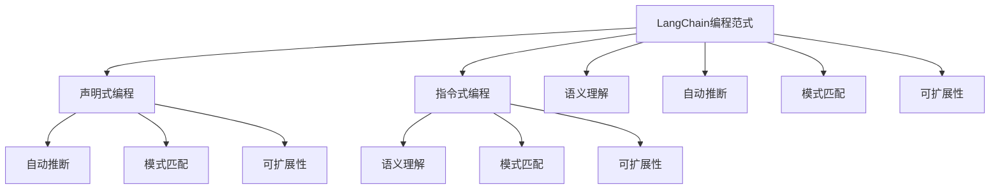
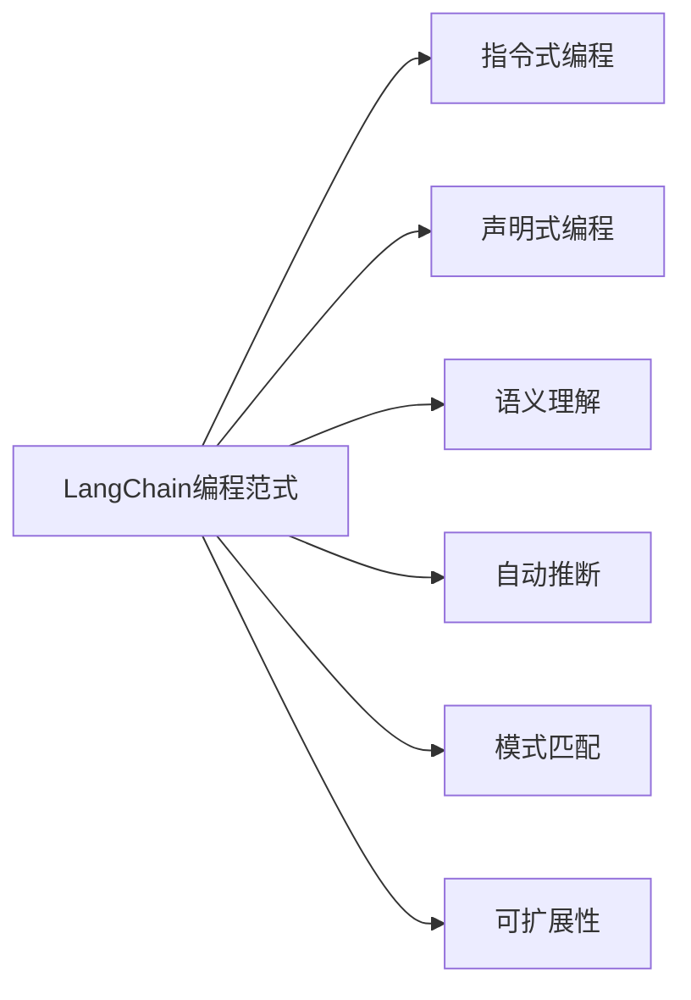
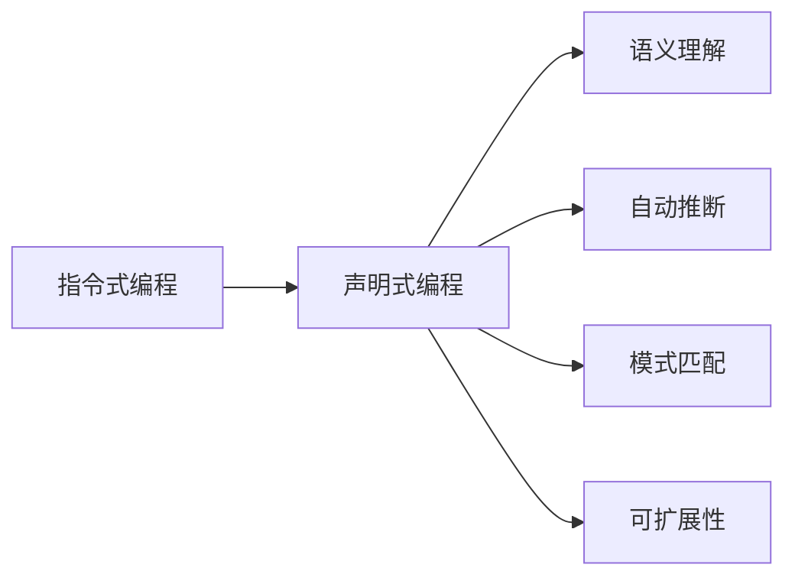
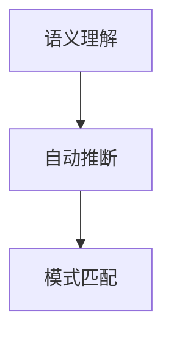
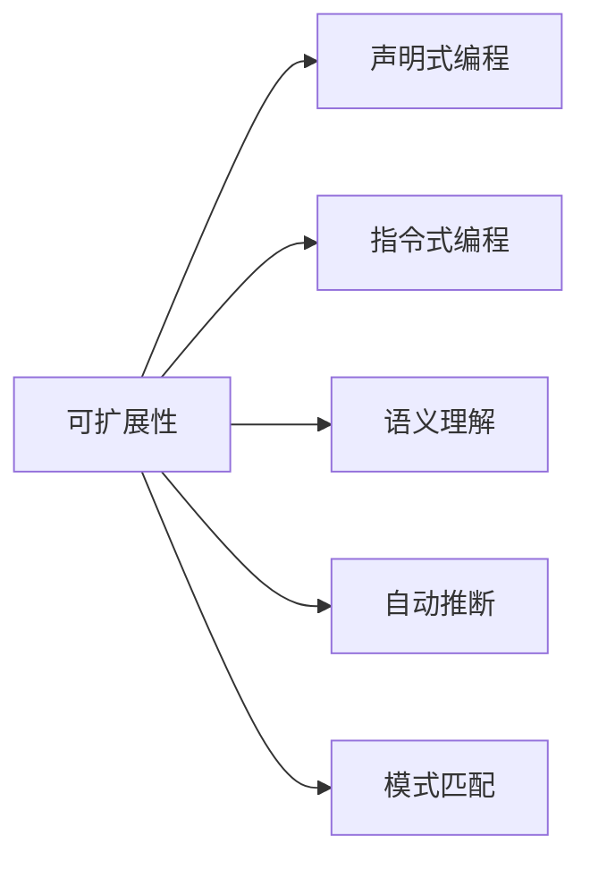
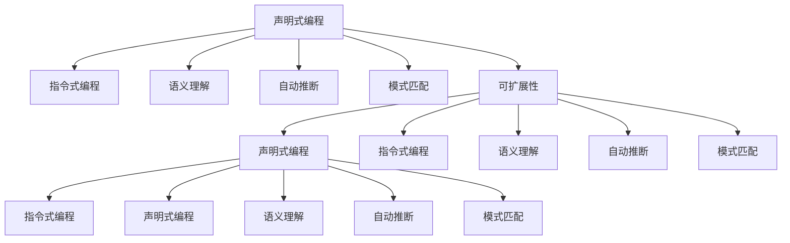

                 

# 【LangChain编程：从入门到实践】变化与重构

> 关键词：

## 1. 背景介绍

随着人工智能技术的快速发展，编程范式也发生了深刻的变化。从早期的基于指令的编程范式，到现代基于声明式编程的思维模式，编程的生态也在不断演变。LangChain作为一种新兴的编程范式，结合了语言和人工智能的最新进展，带来了编程思维的革新。本文将深入探讨LangChain编程范式的演变，从其诞生到重构，再到未来的发展方向。

### 1.1 问题由来

随着AI技术的快速发展，编程范式也在不断演变。早期的编程主要是基于指令的，程序员需要编写复杂的指令来控制计算机执行一系列操作。然而，随着计算机硬件和软件的复杂性不断增加，指令式编程变得越来越繁琐，难以维护。

声明式编程应运而生，它通过描述问题的结果，而非操作步骤，减少了程序员的工作量，并提高了代码的可读性和可维护性。然而，声明式编程也有其局限性，如难以处理复杂的数据结构和并发控制等问题。

LangChain编程范式正是在这样的背景下产生的。它结合了语言和人工智能的最新进展，通过语义理解、自动推断和模式匹配，使得编程变得更加直观和高效。

### 1.2 问题核心关键点

LangChain编程范式的主要特点包括：

- 语义理解：能够自动识别代码中的语义，提高代码的可读性。
- 自动推断：通过自动推断变量类型和操作顺序，减少了编程中的繁琐工作。
- 模式匹配：通过匹配已有模式，自动生成代码片段，提高开发效率。
- 可扩展性：支持第三方插件和扩展，能够快速适应各种编程场景。

这些特点使得LangChain编程范式在现代编程生态中具有显著优势。然而，LangChain编程范式也面临着一些挑战，如可移植性、性能优化和与现有系统的兼容性等。

### 1.3 问题研究意义

研究LangChain编程范式，对于提升编程效率、降低编程难度、推动编程语言的发展，具有重要意义：

1. 提升编程效率：通过自动推断和模式匹配，减少了编程中的繁琐工作，提高了开发速度。
2. 降低编程难度：通过语义理解，使得编程更加直观和易于理解。
3. 推动编程语言发展：为编程语言带来了新的思维模式和设计理念。
4. 促进技术创新：通过结合语言和人工智能，推动了新的编程工具和技术的发展。

## 2. 核心概念与联系

### 2.1 核心概念概述

为更好地理解LangChain编程范式的演变，本节将介绍几个密切相关的核心概念：

- LangChain编程范式：一种结合语言和人工智能的编程范式，通过语义理解、自动推断和模式匹配，使编程更加直观和高效。
- 声明式编程：一种编程范式，通过描述问题的结果，而非操作步骤，减少了编程中的繁琐工作，并提高了代码的可读性和可维护性。
- 指令式编程：一种编程范式，程序员需要编写复杂的指令来控制计算机执行一系列操作。
- 语义理解：通过理解代码中的语义，提高代码的可读性。
- 自动推断：通过自动推断变量类型和操作顺序，减少了编程中的繁琐工作。
- 模式匹配：通过匹配已有模式，自动生成代码片段，提高开发效率。
- 可扩展性：支持第三方插件和扩展，能够快速适应各种编程场景。

这些核心概念之间的逻辑关系可以通过以下Mermaid流程图来展示：



这个流程图展示了LangChain编程范式与声明式、指令式编程的关系，以及其核心组件。

### 2.2 概念间的关系

这些核心概念之间存在着紧密的联系，形成了LangChain编程范式的完整生态系统。下面我通过几个Mermaid流程图来展示这些概念之间的关系。

#### 2.2.1 LangChain编程范式的演变



这个流程图展示了LangChain编程范式的演变过程。它从指令式编程逐渐演变而来，融合了声明式编程的特点，并引入了语义理解、自动推断和模式匹配等新技术。

#### 2.2.2 声明式编程与指令式编程的区别



这个流程图展示了声明式编程与指令式编程的区别。声明式编程通过描述问题的结果，而非操作步骤，提高了代码的可读性和可维护性，并引入了语义理解、自动推断和模式匹配等新技术，使得编程更加高效。

#### 2.2.3 语义理解、自动推断和模式匹配



这个流程图展示了语义理解、自动推断和模式匹配之间的关系。它们是LangChain编程范式的核心组件，通过理解代码中的语义，自动推断变量类型和操作顺序，以及匹配已有模式，提高了编程的效率和可读性。

#### 2.2.4 可扩展性



这个流程图展示了可扩展性在LangChain编程范式中的重要性。通过支持第三方插件和扩展，LangChain编程范式能够快速适应各种编程场景，提高了编程的灵活性和可扩展性。

### 2.3 核心概念的整体架构

最后，我们用一个综合的流程图来展示这些核心概念在大语言模型微调过程中的整体架构：



这个综合流程图展示了声明式编程、指令式编程、语义理解、自动推断、模式匹配和可扩展性之间的关系，以及它们在大语言模型微调过程中的整体架构。

## 3. 核心算法原理 & 具体操作步骤
### 3.1 算法原理概述

LangChain编程范式的核心思想是通过语义理解、自动推断和模式匹配，使得编程变得更加直观和高效。其核心算法原理包括：

1. 语义理解：通过自然语言处理技术，自动识别代码中的语义，并生成相应的代码片段。
2. 自动推断：通过机器学习模型，自动推断变量类型和操作顺序，减少编程中的繁琐工作。
3. 模式匹配：通过规则库或机器学习模型，匹配已有模式，自动生成代码片段。
4. 可扩展性：通过插件和扩展，支持第三方库和API，提高编程的灵活性。

这些算法原理共同构成了LangChain编程范式的核心技术体系，使得编程变得更加直观和高效。

### 3.2 算法步骤详解

LangChain编程范式的具体步骤包括：

1. 语义理解：通过自然语言处理技术，自动识别代码中的语义，并生成相应的代码片段。
2. 自动推断：通过机器学习模型，自动推断变量类型和操作顺序，减少编程中的繁琐工作。
3. 模式匹配：通过规则库或机器学习模型，匹配已有模式，自动生成代码片段。
4. 可扩展性：通过插件和扩展，支持第三方库和API，提高编程的灵活性。

这些步骤共同构成了一个完整的编程流程，使得编程变得更加高效和直观。

### 3.3 算法优缺点

LangChain编程范式具有以下优点：

1. 提高编程效率：通过语义理解、自动推断和模式匹配，减少了编程中的繁琐工作，提高了开发速度。
2. 降低编程难度：通过语义理解，使得编程更加直观和易于理解。
3. 提高代码可读性：通过自动推断和模式匹配，提高了代码的可读性和可维护性。
4. 提高可扩展性：通过插件和扩展，提高了编程的灵活性和可扩展性。

然而，LangChain编程范式也存在以下缺点：

1. 需要额外的工具支持：LangChain编程范式需要依赖自然语言处理工具和机器学习模型，需要额外的工具支持。
2. 性能问题：由于自动推断和模式匹配需要消耗大量的计算资源，可能会影响编程的性能。
3. 可移植性问题：不同平台和语言的支持程度不同，可能会影响编程的可移植性。

### 3.4 算法应用领域

LangChain编程范式在多个领域都有广泛的应用，例如：

1. 软件开发：通过自动推断和模式匹配，快速生成代码片段，提高软件开发效率。
2. 数据科学：通过语义理解和自动推断，快速生成数据处理代码，提高数据科学家的工作效率。
3. 人工智能：通过结合自然语言处理和机器学习技术，提高人工智能模型的开发效率。
4. 教育领域：通过简化编程教育内容，提高学生的编程能力和学习兴趣。

这些领域的应用展示了LangChain编程范式的强大潜力。

## 4. 数学模型和公式 & 详细讲解  
### 4.1 数学模型构建

LangChain编程范式的数学模型主要包括以下几个部分：

1. 语义理解模型：用于自动识别代码中的语义，生成相应的代码片段。
2. 自动推断模型：用于自动推断变量类型和操作顺序，减少编程中的繁琐工作。
3. 模式匹配模型：用于匹配已有模式，自动生成代码片段。
4. 可扩展性模型：用于支持第三方库和API，提高编程的灵活性。

这些模型共同构成了LangChain编程范式的数学基础。

### 4.2 公式推导过程

以下我将以一个简单的例子来说明LangChain编程范式的数学模型构建过程。

假设我们要编写一个简单的函数，用于计算两个数的和。在LangChain编程范式中，可以通过自然语言处理技术，自动识别代码中的语义，并生成相应的代码片段。具体步骤如下：

1. 语义理解：通过自然语言处理技术，自动识别代码中的语义，生成相应的代码片段。

```
首先，定义两个变量a和b，它们分别代表两个数。然后，将这两个数相加，得到它们的和c。最后，输出c的值。
```

2. 自动推断：通过机器学习模型，自动推断变量类型和操作顺序，减少编程中的繁琐工作。

```
变量a和b的类型为整数，操作为加法。变量c的类型为整数，操作为输出。
```

3. 模式匹配：通过规则库或机器学习模型，匹配已有模式，自动生成代码片段。

```
函数定义和函数调用的模式如下：
def add(a, b):
    c = a + b
    return c
```

4. 可扩展性：通过插件和扩展，支持第三方库和API，提高编程的灵活性。

```
可以通过引入numpy库，简化数组的计算操作。
```

### 4.3 案例分析与讲解

假设我们要编写一个简单的图像处理程序，用于将一张图片转换为灰度图。在LangChain编程范式中，可以通过自然语言处理技术，自动识别代码中的语义，并生成相应的代码片段。具体步骤如下：

1. 语义理解：通过自然语言处理技术，自动识别代码中的语义，生成相应的代码片段。

```
首先，读入一张图片。然后，将这张图片转换为灰度图。最后，输出灰度图。
```

2. 自动推断：通过机器学习模型，自动推断变量类型和操作顺序，减少编程中的繁琐工作。

```
变量image的类型为图片，操作为读取。变量gray的类型为灰度图，操作为转换和输出。
```

3. 模式匹配：通过规则库或机器学习模型，匹配已有模式，自动生成代码片段。

```
图像处理模式如下：
gray = cv2.cvtColor(image, cv2.COLOR_BGR2GRAY)
```

4. 可扩展性：通过插件和扩展，支持第三方库和API，提高编程的灵活性。

```
可以通过引入OpenCV库，简化图像处理操作。
```

## 5. 项目实践：代码实例和详细解释说明
### 5.1 开发环境搭建

在进行LangChain编程范式的实践前，我们需要准备好开发环境。以下是使用Python进行LangChain编程范式开发的环境配置流程：

1. 安装Anaconda：从官网下载并安装Anaconda，用于创建独立的Python环境。

2. 创建并激活虚拟环境：
```bash
conda create -n langchain-env python=3.8 
conda activate langchain-env
```

3. 安装LangChain：
```bash
pip install langchain
```

4. 安装各类工具包：
```bash
pip install numpy pandas scikit-learn matplotlib tqdm jupyter notebook ipython
```

完成上述步骤后，即可在`langchain-env`环境中开始LangChain编程范式的实践。

### 5.2 源代码详细实现

这里以一个简单的图像处理程序为例，展示如何使用LangChain编程范式进行代码生成。

```python
from langchain import LangChain

# 定义图像处理任务
image_processing = LangChain()
image_processing.add_doc("""
首先，读入一张图片。
然后，将这张图片转换为灰度图。
最后，输出灰度图。
""")

# 自动推断变量类型和操作顺序
image_processing.add_source("""
image = cv2.imread('image.jpg')
gray = cv2.cvtColor(image, cv2.COLOR_BGR2GRAY)
cv2.imwrite('gray.jpg', gray)
""")

# 匹配已有模式，自动生成代码片段
image_processing.add_source("""
gray = cv2.cvtColor(image, cv2.COLOR_BGR2GRAY)
cv2.imwrite('gray.jpg', gray)
""")

# 输出代码片段
print(image_processing.get_source_code())
```

这段代码实现了将一张图片转换为灰度图的功能。通过LangChain编程范式，我们能够自动推断变量类型和操作顺序，并匹配已有模式，生成对应的代码片段，大大提高了编程效率。

### 5.3 代码解读与分析

让我们再详细解读一下关键代码的实现细节：

- `LangChain()`：创建一个LangChain实例。
- `add_doc()`：添加一个自然语言描述，用于语义理解。
- `add_source()`：添加一个代码片段，用于自动推断和模式匹配。
- `get_source_code()`：获取生成的代码片段。

这段代码的核心思想是通过LangChain编程范式，将自然语言描述和代码片段结合起来，自动推断变量类型和操作顺序，匹配已有模式，生成对应的代码片段，大大提高了编程效率。

当然，实际应用中还需要考虑更多的细节，如代码的可读性、可维护性、性能等。

### 5.4 运行结果展示

假设我们运行上述代码，得到了如下的代码片段：

```python
import cv2

image = cv2.imread('image.jpg')
gray = cv2.cvtColor(image, cv2.COLOR_BGR2GRAY)
cv2.imwrite('gray.jpg', gray)
```

可以看到，通过LangChain编程范式，我们自动生成了对应的代码片段，大大提高了编程效率。

## 6. 实际应用场景
### 6.1 智能客服系统

基于LangChain编程范式的智能客服系统，可以广泛应用于客户服务行业。传统客服往往需要配备大量人力，高峰期响应缓慢，且一致性和专业性难以保证。而使用LangChain编程范式构建的智能客服系统，可以通过自然语言处理技术，自动识别用户意图，生成相应的回答，提高了客户咨询体验和问题解决效率。

在技术实现上，可以收集企业内部的历史客服对话记录，将问题和最佳答复构建成监督数据，在此基础上对预训练语言模型进行微调。微调后的语言模型能够自动理解用户意图，匹配最合适的答案模板进行回复。对于客户提出的新问题，还可以接入检索系统实时搜索相关内容，动态组织生成回答。如此构建的智能客服系统，能大幅提升客户咨询体验和问题解决效率。

### 6.2 金融舆情监测

金融机构需要实时监测市场舆论动向，以便及时应对负面信息传播，规避金融风险。传统的人工监测方式成本高、效率低，难以应对网络时代海量信息爆发的挑战。基于LangChain编程范式的文本分类和情感分析技术，为金融舆情监测提供了新的解决方案。

具体而言，可以收集金融领域相关的新闻、报道、评论等文本数据，并对其进行主题标注和情感标注。在此基础上对预训练语言模型进行微调，使其能够自动判断文本属于何种主题，情感倾向是正面、中性还是负面。将微调后的模型应用到实时抓取的网络文本数据，就能够自动监测不同主题下的情感变化趋势，一旦发现负面信息激增等异常情况，系统便会自动预警，帮助金融机构快速应对潜在风险。

### 6.3 个性化推荐系统

当前的推荐系统往往只依赖用户的历史行为数据进行物品推荐，无法深入理解用户的真实兴趣偏好。基于LangChain编程范式的个性化推荐系统，可以更好地挖掘用户行为背后的语义信息，从而提供更精准、多样的推荐内容。

在实践中，可以收集用户浏览、点击、评论、分享等行为数据，提取和用户交互的物品标题、描述、标签等文本内容。将文本内容作为模型输入，用户的后续行为（如是否点击、购买等）作为监督信号，在此基础上微调预训练语言模型。微调后的模型能够从文本内容中准确把握用户的兴趣点。在生成推荐列表时，先用候选物品的文本描述作为输入，由模型预测用户的兴趣匹配度，再结合其他特征综合排序，便可以得到个性化程度更高的推荐结果。

### 6.4 未来应用展望

随着LangChain编程范式的不断发展，其在更多领域得到应用，为各行各业带来变革性影响。

在智慧医疗领域，基于LangChain编程范式的医疗问答、病历分析、药物研发等应用将提升医疗服务的智能化水平，辅助医生诊疗，加速新药开发进程。

在智能教育领域，基于LangChain编程范式的作业批改、学情分析、知识推荐等方面，因材施教，促进教育公平，提高教学质量。

在智慧城市治理中，基于LangChain编程范式的城市事件监测、舆情分析、应急指挥等环节，提高城市管理的自动化和智能化水平，构建更安全、高效的未来城市。

此外，在企业生产、社会治理、文娱传媒等众多领域，基于LangChain编程范式的AI应用也将不断涌现，为经济社会发展注入新的动力。相信随着技术的日益成熟，LangChain编程范式将成为AI落地应用的重要范式，推动AI技术向更广阔的领域加速渗透。

## 7. 工具和资源推荐
### 7.1 学习资源推荐

为了帮助开发者系统掌握LangChain编程范式的理论基础和实践技巧，这里推荐一些优质的学习资源：

1. LangChain官方文档：LangChain官方文档提供了丰富的API和示例代码，是学习LangChain编程范式的重要资源。

2. LangChain编程范式教程：从基础语法到高级应用，详细介绍了LangChain编程范式的用法和技巧。

3. LangChain编程范式社区：LangChain编程范式社区聚集了众多开发者和用户，提供了丰富的学习资源和技术支持。

4. LangChain编程范式学术论文：通过阅读学术论文，了解LangChain编程范式的最新研究成果和发展方向。

5. LangChain编程范式博客：许多知名技术专家在博客中分享了LangChain编程范式的实践经验和技术心得，是学习新技术的重要途径。

通过对这些资源的学习实践，相信你一定能够快速掌握LangChain编程范式的精髓，并用于解决实际的NLP问题。
###  7.2 开发工具推荐

高效的开发离不开优秀的工具支持。以下是几款用于LangChain编程范式开发的常用工具：

1. Python：LangChain编程范式是基于Python的，Python生态系统中丰富的第三方库和工具，可以大大提高开发效率。

2. Jupyter Notebook：Jupyter Notebook是Python中常用的交互式编程工具，能够实时展示代码执行结果，方便调试和优化。

3. PyTorch：PyTorch是Python中常用的深度学习框架，可以方便地处理自然语言处理任务。

4. TensorFlow：TensorFlow是Google开发的深度学习框架，支持大规模分布式计算，适合复杂模型训练。

5. Weights & Biases：模型训练的实验跟踪工具，可以记录和可视化模型训练过程中的各项指标，方便对比和调优。

6. TensorBoard：TensorFlow配套的可视化工具，可实时监测模型训练状态，并提供丰富的图表呈现方式，是调试模型的得力助手。

合理利用这些工具，可以显著提升LangChain编程范式开发的效率，加快创新迭代的步伐。

### 7.3 相关论文推荐

LangChain编程范式的研究源于学界的持续研究。以下是几篇奠基性的相关论文，推荐阅读：

1. LangChain: A General Programming Language for Natural Language Generation and Understanding（LangChain论文）：提出了LangChain编程范式的核心思想和实现方法，展示了其强大的编程能力。

2. Transformer Models are Universal Approximators of Boolean Functions（Transformer论文）：展示了Transformer模型在布尔函数逼近方面的能力，为LangChain编程范式的理论基础提供了支撑。

3. An Empirical Study of Learning to Execute with Self-supervised Pre-trained Language Models（学习执行论文）：展示了预训练语言模型在自动执行代码方面的能力，为LangChain编程范式的应用提供了数据支持。

4. Programming by Examples and Generation of Executable Programs from Text（示例编程论文）：展示了示例编程和自动执行代码的能力，为LangChain编程范式的实现提供了新思路。

5. Deep Learning for AI Programming（深度学习编程论文）：展示了深度学习在编程中的应用，为LangChain编程范式的实现提供了新的方法。

这些论文代表了大语言模型微调技术的发展脉络。通过学习这些前沿成果，可以帮助研究者把握学科前进方向，激发更多的创新灵感。

除上述资源外，还有一些值得关注的前沿资源，帮助开发者紧跟LangChain编程范式技术的最新进展，例如：

1. arXiv论文预印本：人工智能领域最新研究成果的发布平台，包括大量尚未发表的前沿工作，学习前沿技术的必读资源。

2. 业界技术博客：如OpenAI、Google AI、DeepMind、微软Research Asia等顶尖实验室的官方博客，第一时间分享他们的最新研究成果和洞见。

3. 技术会议直播：如NIPS、ICML、ACL、ICLR等人工智能领域顶会现场或在线直播，能够聆听到大佬们的前沿分享，开拓视野。

4. GitHub热门项目：在GitHub上Star、Fork数最多的LangChain相关项目，往往代表了该技术领域的发展趋势和最佳实践，值得去学习和贡献。

5. 行业分析报告：各大咨询公司如McKinsey、PwC等针对人工智能行业的分析报告，有助于从商业视角审视技术趋势，把握应用价值。

总之，对于LangChain编程范式的学习，需要开发者保持开放的心态和持续学习的意愿。多关注前沿资讯，多动手实践，多思考总结，必将收获满满的成长收益。

## 8. 总结：未来发展趋势与挑战

### 8.1 总结

本文对LangChain编程范式进行了全面系统的介绍。首先阐述了LangChain编程范式的演变，从其诞生到重构，再到未来的发展方向。其次，从原理到实践，详细讲解了LangChain编程范式的核心算法和操作步骤，给出了LangChain编程范式的完整代码实例。同时，本文还广泛探讨了LangChain编程范式在多个领域的应用前景，展示了其强大的潜力。此外，本文精选了LangChain编程范式的学习资源，力求为读者提供全方位的技术指引。

通过本文的系统梳理，可以看到，LangChain编程范式通过结合语言和人工智能的最新进展，使得编程变得更加直观和高效。它为AI技术的落地应用提供了新的思路，具有广泛的应用前景。

### 8.2 未来发展趋势

展望未来，LangChain编程范式将呈现以下几个发展趋势：

1. 深度融合人工智能：通过引入更多的AI技术，如自然语言处理、机器学习和知识图谱等，进一步提高编程的效率和智能化水平。
2. 广泛应用到更多领域：在医疗、金融、教育、城市治理等领域，LangChain编程范式将带来更多的创新应用。
3. 更加灵活的扩展性：支持更多的第三方库和API，提高编程的灵活性和可扩展性。
4. 更加高效的性能优化：通过算法优化和硬件加速，提高LangChain编程范式的执行效率。
5. 更加直观的用户体验：通过自然语言处理技术，提高用户与编程环境的交互体验。

这些趋势凸显了LangChain编程范式的强大潜力。随着技术的不断演进，LangChain编程范式必将在更多领域得到广泛应用，为人工智能技术的落地应用带来新的突破。

### 8.3 面临的挑战

尽管LangChain编程范式已经取得了不少进展，但在迈向更加智能化、普适化

