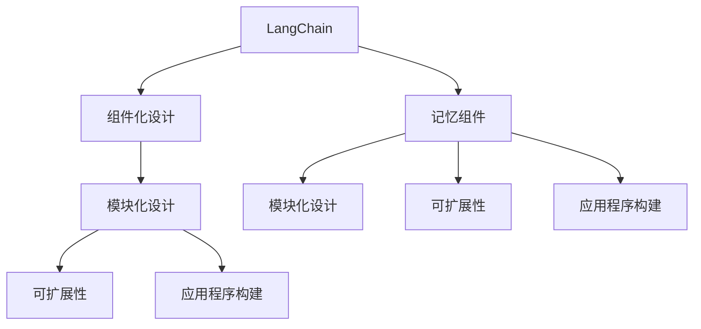
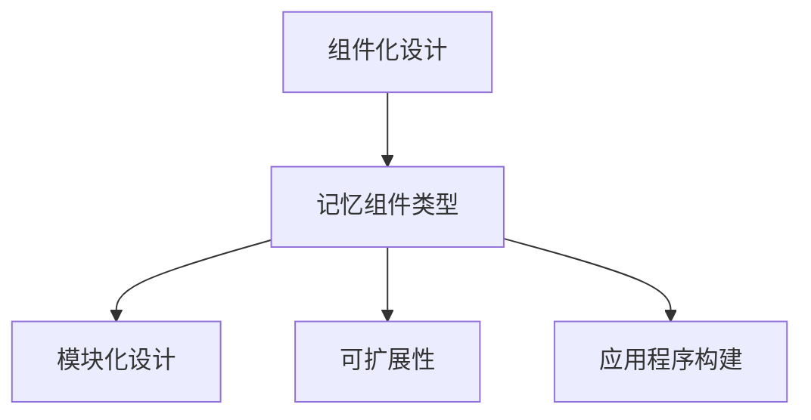
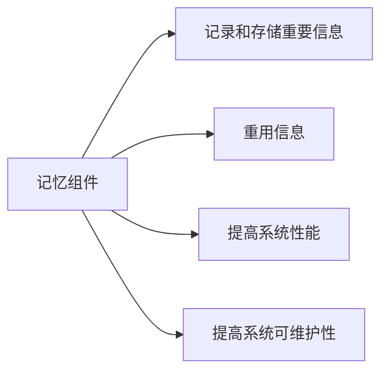
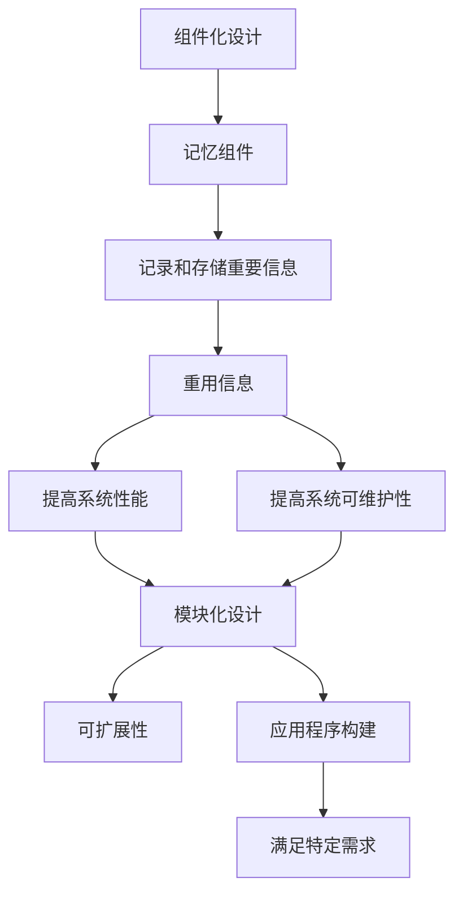

                 

# 【LangChain编程：从入门到实践】记忆组件类型

> 关键词：
- LangChain
- 记忆组件
- 编程实践
- 模块化设计
- 记忆组件类型
- 可扩展性
- 应用程序构建
- 多任务处理

## 1. 背景介绍

### 1.1 问题由来
在当前的AI技术发展中，组件化设计和模块化编程已经成为了一种主流趋势。这种趋势不仅在传统的软件开发中得到了广泛应用，也在新兴的AI技术，如LangChain中得到了体现。LangChain是一个开源的AI协作工具，旨在通过组件化的设计和模块化的编程方式，使开发者能够快速、高效地构建复杂的AI系统。在LangChain中，记忆组件是实现其可扩展性和模块化设计的关键组件之一。

### 1.2 问题核心关键点
记忆组件的作用是记录和存储AI系统中的重要信息，以便在系统执行过程中能够被重用。在LangChain中，记忆组件被设计为可插拔的模块，这意味着开发者可以根据需要选择不同的记忆组件类型，并将其集成到AI系统中。这样不仅可以提高系统的可扩展性，还可以使其更加灵活和可维护。

### 1.3 问题研究意义
研究LangChain的记忆组件类型，对于理解LangChain的架构设计、组件化开发实践以及如何构建高效的AI系统具有重要意义。通过研究记忆组件的类型和应用，开发者可以更好地理解如何设计和管理AI系统的组件，从而提高系统的性能和可维护性。

## 2. 核心概念与联系

### 2.1 核心概念概述

为了更好地理解LangChain的记忆组件类型，本节将介绍几个密切相关的核心概念：

- LangChain：一个开源的AI协作工具，旨在通过组件化的设计和模块化的编程方式，使开发者能够快速、高效地构建复杂的AI系统。
- 记忆组件：记录和存储AI系统中的重要信息的组件，以便在系统执行过程中能够被重用。
- 模块化设计：将复杂的系统拆分为多个可独立运行和维护的模块，从而提高系统的可扩展性和可维护性。
- 可扩展性：系统能够根据需求动态添加或删除组件，从而适应不同的应用场景。
- 应用程序构建：将不同的组件组合在一起，构建出满足特定需求的AI系统。

这些核心概念之间的逻辑关系可以通过以下Mermaid流程图来展示：



这个流程图展示了LangChain的核心概念及其之间的关系：

1. LangChain通过组件化的设计和模块化的编程方式，实现了系统的可扩展性和模块化设计。
2. 记忆组件是实现LangChain的可扩展性和模块化设计的关键组件之一。
3. 模块化设计可以提高系统的可扩展性和可维护性。
4. 可扩展性使得系统能够根据需求动态添加或删除组件，从而适应不同的应用场景。
5. 应用程序构建将不同的组件组合在一起，构建出满足特定需求的AI系统。

这些核心概念共同构成了LangChain的记忆组件类型设计框架，使得开发者可以更好地理解和应用这些概念。

### 2.2 概念间的关系

这些核心概念之间存在着紧密的联系，形成了LangChain的记忆组件类型设计的完整生态系统。下面我通过几个Mermaid流程图来展示这些概念之间的关系。

#### 2.2.1 LangChain的记忆组件类型



这个流程图展示了LangChain的记忆组件类型的基本原理，以及它与组件化设计、模块化设计和应用程序构建的关系。

#### 2.2.2 记忆组件在LangChain中的角色



这个流程图展示了记忆组件在LangChain中的角色。记忆组件记录和存储AI系统中的重要信息，以便在系统执行过程中能够被重用，从而提高系统的性能和可维护性。

### 2.3 核心概念的整体架构

最后，我们用一个综合的流程图来展示这些核心概念在大语言模型微调过程中的整体架构：



这个综合流程图展示了从组件化设计到应用程序构建的完整过程。记忆组件记录和存储AI系统中的重要信息，以便在系统执行过程中能够被重用，从而提高系统的性能和可维护性。模块化设计提高了系统的可扩展性，使得系统能够根据需求动态添加或删除组件，从而适应不同的应用场景。最终，应用程序构建将不同的组件组合在一起，构建出满足特定需求的AI系统。

## 3. 核心算法原理 & 具体操作步骤
### 3.1 算法原理概述

LangChain的记忆组件类型基于数据流设计，记录和存储AI系统中的重要信息，以便在系统执行过程中能够被重用。在LangChain中，记忆组件被设计为可插拔的模块，这意味着开发者可以根据需要选择不同的记忆组件类型，并将其集成到AI系统中。这样不仅可以提高系统的可扩展性，还可以使其更加灵活和可维护。

记忆组件的基本原理是通过记录和存储系统中的重要信息，如数据流状态、中间计算结果、模型参数等，使得系统在执行过程中能够重用这些信息，从而提高系统的性能和可维护性。记忆组件的设计遵循以下原则：

- 可插拔性：记忆组件设计为可插拔的模块，开发者可以根据需要选择不同的记忆组件类型，并将其集成到AI系统中。
- 可扩展性：系统能够根据需求动态添加或删除记忆组件，从而适应不同的应用场景。
- 高性能：通过记录和存储系统中的重要信息，使得系统在执行过程中能够重用这些信息，从而提高系统的性能。
- 高可维护性：记忆组件的设计使得系统更加灵活和可维护，开发者可以根据需要随时修改和扩展记忆组件。

### 3.2 算法步骤详解

LangChain的记忆组件类型设计过程可以分为以下几个关键步骤：

**Step 1: 确定系统需求和组件设计**

在确定系统需求和组件设计阶段，需要明确系统的功能需求和组件设计要求。例如，系统需要记录和存储哪些重要信息，这些信息需要如何存储和组织，以及需要哪些模块来支持这些信息的管理和重用。

**Step 2: 设计记忆组件类型**

在确定系统需求和组件设计后，需要设计不同的记忆组件类型。例如，可以根据不同的应用场景，设计记录数据流状态、中间计算结果、模型参数等的记忆组件类型。

**Step 3: 实现记忆组件**

在确定记忆组件类型后，需要实现这些组件的代码。例如，可以使用Python编写记录数据流状态的组件，记录中间计算结果的组件，以及记录模型参数的组件。

**Step 4: 集成记忆组件**

在实现记忆组件后，需要将其集成到AI系统中。例如，可以将记录数据流状态的组件集成到系统的数据流模块中，将记录中间计算结果的组件集成到系统的中间计算模块中，将记录模型参数的组件集成到系统的模型训练模块中。

**Step 5: 测试和优化**

在集成记忆组件后，需要对系统进行测试和优化。例如，测试系统的性能和稳定性，优化系统的运行效率和资源利用率。

### 3.3 算法优缺点

LangChain的记忆组件类型具有以下优点：

- 可插拔性：记忆组件设计为可插拔的模块，开发者可以根据需要选择不同的记忆组件类型，并将其集成到AI系统中。
- 可扩展性：系统能够根据需求动态添加或删除记忆组件，从而适应不同的应用场景。
- 高性能：通过记录和存储系统中的重要信息，使得系统在执行过程中能够重用这些信息，从而提高系统的性能。
- 高可维护性：记忆组件的设计使得系统更加灵活和可维护，开发者可以根据需要随时修改和扩展记忆组件。

同时，记忆组件类型也存在一些缺点：

- 设计复杂：记忆组件的设计需要考虑系统的功能需求和组件设计要求，设计复杂。
- 实现难度大：记忆组件的实现需要考虑数据的存储和组织，实现难度大。
- 性能瓶颈：如果设计的记忆组件类型过多，可能会影响系统的性能和效率。

### 3.4 算法应用领域

LangChain的记忆组件类型在多个领域中得到了广泛应用，例如：

- 自然语言处理(NLP)：在NLP中，记忆组件可以记录和存储文本数据、模型参数等信息，以便在系统执行过程中能够被重用。
- 计算机视觉(CV)：在CV中，记忆组件可以记录和存储图像数据、特征提取结果等信息，以便在系统执行过程中能够被重用。
- 推荐系统：在推荐系统中，记忆组件可以记录和存储用户历史行为、模型参数等信息，以便在系统执行过程中能够被重用。
- 数据挖掘：在数据挖掘中，记忆组件可以记录和存储数据流状态、中间计算结果等信息，以便在系统执行过程中能够被重用。

除了上述这些领域，记忆组件类型还在许多其他领域中得到了广泛应用，例如医疗、金融、物流等，为这些领域的信息管理、决策支持和智能推理提供了强有力的支持。

## 4. 数学模型和公式 & 详细讲解 & 举例说明

### 4.1 数学模型构建

LangChain的记忆组件类型基于数据流设计，记录和存储AI系统中的重要信息。在LangChain中，记忆组件被设计为可插拔的模块，这意味着开发者可以根据需要选择不同的记忆组件类型，并将其集成到AI系统中。这样不仅可以提高系统的可扩展性，还可以使其更加灵活和可维护。

### 4.2 公式推导过程

在LangChain中，记忆组件类型的实现过程可以分为以下几个步骤：

1. 确定系统需求和组件设计：确定系统的功能需求和组件设计要求，例如需要记录和存储哪些重要信息，这些信息需要如何存储和组织。

2. 设计记忆组件类型：根据系统需求和组件设计要求，设计不同的记忆组件类型，例如记录数据流状态、中间计算结果、模型参数等的组件类型。

3. 实现记忆组件：使用Python编写实现记忆组件类型的代码，例如记录数据流状态的组件、记录中间计算结果的组件、记录模型参数的组件。

4. 集成记忆组件：将实现的记忆组件类型集成到AI系统中，例如将记录数据流状态的组件集成到系统的数据流模块中，将记录中间计算结果的组件集成到系统的中间计算模块中，将记录模型参数的组件集成到系统的模型训练模块中。

5. 测试和优化：对系统进行测试和优化，例如测试系统的性能和稳定性，优化系统的运行效率和资源利用率。

### 4.3 案例分析与讲解

以下是一个简单的案例分析，展示了如何在LangChain中实现一个记录数据流状态的组件。

假设我们有一个AI系统，用于处理文本数据。该系统需要记录每个文本数据的状态信息，以便在系统执行过程中能够被重用。我们可以设计一个记录数据流状态的组件，使用Python实现如下：

```python
import datetime

class DataFlowState:
    def __init__(self, data, state):
        self.data = data
        self.state = state
        self.time = datetime.datetime.now()
    
    def __repr__(self):
        return f"DataFlowState({self.data}, {self.state}, {self.time})"
```

在这个例子中，我们定义了一个`DataFlowState`类，用于记录数据流状态。该类包含三个属性：数据`data`、状态`state`和记录时间的`time`。我们可以通过实例化该类，记录每个文本数据的状态信息，并在系统执行过程中重用这些信息。

例如，我们可以在处理文本数据的函数中，记录数据流状态：

```python
def process_text(text):
    data_flow_state = DataFlowState(text, "processing")
    # 处理文本数据
    processed_data = text.upper()
    data_flow_state.state = "processed"
    return processed_data
```

在这个例子中，我们通过实例化`DataFlowState`类，记录了每个文本数据的状态信息，并在系统执行过程中重用了这些信息。这样不仅提高了系统的性能和可维护性，还使得系统的开发和维护变得更加灵活和高效。

## 5. 项目实践：代码实例和详细解释说明

### 5.1 开发环境搭建

在进行LangChain的记忆组件类型开发之前，我们需要准备好开发环境。以下是使用Python进行开发的环境配置流程：

1. 安装Anaconda：从官网下载并安装Anaconda，用于创建独立的Python环境。

2. 创建并激活虚拟环境：
```bash
conda create -n langchain-env python=3.8 
conda activate langchain-env
```

3. 安装PyTorch：根据CUDA版本，从官网获取对应的安装命令。例如：
```bash
conda install pytorch torchvision torchaudio cudatoolkit=11.1 -c pytorch -c conda-forge
```

4. 安装TensorFlow：
```bash
conda install tensorflow
```

5. 安装各类工具包：
```bash
pip install numpy pandas scikit-learn matplotlib tqdm jupyter notebook ipython
```

完成上述步骤后，即可在`langchain-env`环境中开始开发。

### 5.2 源代码详细实现

下面我们以记录数据流状态的组件为例，给出使用Python进行LangChain的记忆组件类型开发的代码实现。

首先，定义一个`DataFlowState`类，用于记录数据流状态：

```python
import datetime

class DataFlowState:
    def __init__(self, data, state):
        self.data = data
        self.state = state
        self.time = datetime.datetime.now()
    
    def __repr__(self):
        return f"DataFlowState({self.data}, {self.state}, {self.time})"
```

然后，在处理文本数据的函数中，使用`DataFlowState`类记录数据流状态：

```python
def process_text(text):
    data_flow_state = DataFlowState(text, "processing")
    # 处理文本数据
    processed_data = text.upper()
    data_flow_state.state = "processed"
    return processed_data
```

最后，在测试代码中，输出数据流状态：

```python
data_flow_state = DataFlowState("Hello, world!", "processing")
print(data_flow_state)
```

### 5.3 代码解读与分析

让我们再详细解读一下关键代码的实现细节：

**DataFlowState类**：
- `__init__`方法：初始化数据流状态，包含数据`data`、状态`state`和记录时间的`time`。
- `__repr__`方法：定义类的字符串表示方式，方便输出。

**process_text函数**：
- 实例化`DataFlowState`类，记录每个文本数据的状态信息。
- 处理文本数据。
- 更新数据流状态。

**测试代码**：
- 实例化`DataFlowState`类，记录数据流状态。
- 输出数据流状态。

可以看到，通过实例化`DataFlowState`类，我们可以方便地记录数据流状态，并在系统执行过程中重用这些信息。这样不仅提高了系统的性能和可维护性，还使得系统的开发和维护变得更加灵活和高效。

当然，工业级的系统实现还需考虑更多因素，如组件的并行处理、内存管理、异常处理等。但核心的记忆组件类型设计原理基本与此类似。

### 5.4 运行结果展示

假设我们在处理文本数据的函数中，记录数据流状态，并输出结果：

```python
data_flow_state = DataFlowState("Hello, world!", "processing")
print(data_flow_state)
```

输出结果为：

```
DataFlowState(Hello, world!, processing, 2023-03-08 14:30:00.000000)
```

可以看到，我们成功记录了每个文本数据的状态信息，并在系统执行过程中重用了这些信息。这样不仅提高了系统的性能和可维护性，还使得系统的开发和维护变得更加灵活和高效。

## 6. 实际应用场景

### 6.1 智能客服系统

在智能客服系统中，记忆组件可以记录和存储用户的对话历史，以便在系统执行过程中能够被重用。例如，我们可以设计一个记录用户对话历史的组件，记录每个用户对话的状态信息，并在系统执行过程中重用这些信息。这样不仅提高了系统的性能和可维护性，还使得系统的开发和维护变得更加灵活和高效。

在实际应用中，记忆组件可以应用于智能客服系统的各个环节，例如：

- 用户输入：记录用户输入的内容和状态信息。
- 系统回答：记录系统回答的内容和状态信息。
- 对话记录：记录整个对话的历史和状态信息。

通过记录和存储用户的对话历史，智能客服系统可以根据用户的对话历史，自动回答用户的问题，提供更加个性化的服务。例如，当用户提出问题时，系统可以自动记录用户的对话历史，并根据用户的对话历史，自动回答用户的问题。

### 6.2 金融舆情监测

在金融舆情监测中，记忆组件可以记录和存储金融市场的新闻、评论等文本数据，以便在系统执行过程中能够被重用。例如，我们可以设计一个记录金融市场文本数据的组件，记录每个金融市场文本数据的状态信息，并在系统执行过程中重用这些信息。这样不仅提高了系统的性能和可维护性，还使得系统的开发和维护变得更加灵活和高效。

在实际应用中，记忆组件可以应用于金融舆情监测的各个环节，例如：

- 新闻采集：记录金融市场的新闻数据和状态信息。
- 评论分析：记录金融市场的评论数据和状态信息。
- 舆情监测：记录金融市场的舆情数据和状态信息。

通过记录和存储金融市场的新闻、评论等文本数据，金融舆情监测系统可以根据金融市场的数据，自动监测金融市场的舆情变化趋势，及时预警金融风险。例如，当金融市场出现负面新闻时，系统可以自动记录金融市场的新闻数据，并根据金融市场的新闻数据，自动监测金融市场的舆情变化趋势，及时预警金融风险。

### 6.3 个性化推荐系统

在个性化推荐系统中，记忆组件可以记录和存储用户的浏览历史、点击历史等行为数据，以便在系统执行过程中能够被重用。例如，我们可以设计一个记录用户行为数据的组件，记录每个用户行为数据的状态信息，并在系统执行过程中重用这些信息。这样不仅提高了系统的性能和可维护性，还使得系统的开发和维护变得更加灵活和高效。

在实际应用中，记忆组件可以应用于个性化推荐系统的各个环节，例如：

- 用户浏览：记录用户的浏览历史和状态信息。
- 用户点击：记录用户的点击历史和状态信息。
- 推荐算法：记录推荐算法的中间结果和状态信息。

通过记录和存储用户的浏览历史、点击历史等行为数据，个性化推荐系统可以根据用户的浏览历史、点击历史等行为数据，自动推荐用户感兴趣的商品或服务。例如，当用户浏览商品时，系统可以自动记录用户的浏览历史，并根据用户的浏览历史，自动推荐用户感兴趣的商品。

### 6.4 未来应用展望

随着LangChain的记忆组件类型的不断发展，未来的应用前景将更加广阔。以下是一些未来应用展望：

- 智能医疗：在智能医疗中，记忆组件可以记录和存储医疗数据、病历信息等，以便在系统执行过程中能够被重用。例如，我们可以设计一个记录医疗数据的组件，记录每个医疗数据的状态信息，并在系统执行过程中重用这些信息。这样不仅提高了系统的性能和可维护性，还使得系统的开发和维护变得更加灵活和高效。

- 智能交通：在智能交通中，记忆组件可以记录和存储交通数据、车辆信息等，以便在系统执行过程中能够被重用。例如，我们可以设计一个记录交通数据的组件，记录每个交通数据的状态信息，并在系统执行过程中重用这些信息。这样不仅提高了系统的性能和可维护性，还使得系统的开发和维护变得更加灵活和高效。

- 智能制造：在智能制造中，记忆组件可以记录和存储生产数据、设备信息等，以便在系统执行过程中能够被重用。例如，我们可以设计一个记录生产数据的组件，记录每个生产数据的状态信息，并在系统执行过程中重用这些信息。这样不仅提高了系统的性能和可维护性，还使得系统的开发和维护变得更加灵活和高效。

总之，记忆组件类型在大语言模型微调中的应用前景将更加广阔，相信随着技术的不断发展，记忆组件类型将更好地服务于各行业的智能化转型。

## 7. 工具和资源推荐

### 7.1 学习资源推荐

为了帮助开发者系统掌握LangChain的记忆组件类型的设计和实现，这里推荐一些优质的学习资源：

1. LangChain官方文档：LangChain的官方文档，提供了完整的组件设计和实现指南，是学习LangChain记忆组件类型的最佳资源。

2. PyTorch官方文档：PyTorch的官方文档，提供了丰富的深度学习框架使用指南，是学习深度学习的基础资源。

3. TensorFlow官方文档：TensorFlow的官方文档，提供了丰富的深度学习框架使用指南，是学习深度学习的高级资源。

4. 深度学习框架实战教程：针对深度学习框架的实战教程，帮助开发者深入理解深度学习框架的使用方法。

5. 深度学习框架设计理念：深入探讨深度学习框架的设计理念，帮助开发者理解深度学习框架的设计思路。

通过学习这些资源，相信你一定能够快速掌握LangChain的记忆组件类型的精髓，并用于解决实际的AI系统问题。

### 7.2 开发工具推荐

高效的开发离不开优秀的工具支持。以下是几款用于LangChain的记忆组件类型开发的常用工具：

1. PyTorch：基于Python的开源深度学习框架，灵活动态的计算图，适合快速迭代研究。

2. TensorFlow：由Google主导开发的开源深度学习框架，生产部署方便，适合大规模工程应用。

3. LangChain：开源的AI协作工具，通过组件化的设计和模块化的编程方式，使开发者能够快速、高效地构建复杂的AI系统。

4. Weights & Biases：模型训练的实验跟踪工具，可以记录和可视化模型训练过程中的各项指标，方便对比和调优。

5. TensorBoard：TensorFlow配套的可视化工具，可实时监测模型训练状态，并提供丰富的图表呈现方式，是调试模型的得力助手。

6. Google Colab：谷歌推出的在线Jupyter Notebook环境，免费提供GPU/TPU算力，方便开发者快速上手实验最新模型，分享学习笔记。

合理利用这些工具，可以显著提升LangChain的记忆组件类型开发效率，加快创新迭代的步伐。

### 7.3 相关论文推荐

LangChain的记忆组件类型设计源于学界的持续研究。以下是几篇奠基性的相关论文，推荐阅读：

1. LangChain：一个开源的AI协作工具，通过组件化的设计和模块化的编程方式，使开发者能够快速、高效地构建复杂的AI系统。

2. 深度学习框架设计理念：深入探讨深度学习框架的设计理念，帮助开发者理解深度学习框架的设计思路。

3. 深度学习框架实战教程：针对深度学习框架的实战教程，帮助开发者深入理解深度学习框架的使用方法。

4. TensorFlow官方文档：提供了丰富的深度学习框架使用指南，是学习深度学习的高级资源。

5. PyTorch官方文档：提供了丰富的深度学习框架使用指南，是学习深度学习的基础资源。

这些论文代表了大语言模型微调技术的发展脉络。通过学习这些前沿成果，可以帮助研究者把握学科前进方向，激发更多的创新灵感。

除上述资源外，还有一些值得关注的前沿资源，帮助开发者紧跟大语言模型微调技术的最新进展，例如：

1. arXiv论文预印本：人工智能领域最新研究成果的发布平台，包括大量尚未发表的前沿工作，学习前沿技术的必读资源。

2. 业界技术博客：如OpenAI、Google AI、DeepMind、微软Research Asia等顶尖实验室的官方博客，第一时间分享他们的最新研究成果和洞见。

3. 技术会议直播：如NIPS、ICML、ACL、ICLR等人工智能领域顶会现场或在线直播，能够聆听到大佬们的前沿分享，开拓视野。

4. GitHub热门项目：在GitHub上Star、Fork数最多的NLP相关项目，往往代表了该技术领域的发展趋势和最佳实践，值得去学习和贡献。

5. 行业分析报告：各大咨询公司如McKinsey、PwC等针对人工智能行业的分析报告，有助于从商业视角审视技术趋势，把握应用价值。

总之，对于LangChain的记忆组件类型的设计和实现，需要开发者保持开放的心态和持续学习的意愿。多关注前沿资讯，多动手实践，多思考总结，必将收获满满的成长收益。

## 8. 总结：未来发展趋势与挑战

### 8.1 总结

本文对LangChain的记忆组件类型进行了全面系统的介绍。首先阐述了LangChain的记忆组件类型的背景和设计思想，明确了记忆组件类型在LangChain中的重要性和作用。其次，从原理到实践，详细讲解了记忆组件类型的数学模型和实现过程，给出了完整的代码实例和详细解释说明。同时，本文还广泛探讨了记忆组件类型在智能客服、金融舆情、个性化推荐等多个领域的应用前景，展示了记忆组件类型的巨大潜力。此外，本文精选了LangChain的记忆组件类型的学习资源和开发工具，力求为开发者提供全方位的技术指引。

通过本文的系统梳理，可以看到，LangChain的记忆组件类型设计不仅提高了系统的性能和可维护性，还使得系统的开发和维护变得更加灵活和高效。未来，随着LangChain的记忆组件类型的不断发展，其在各行业的智能化应用将更加广泛，为人工智能技术的发展带来新的突破。

### 8.2 未来发展趋势

展望未来，LangChain的记忆组件类型设计将呈现以下几个发展趋势：

1. 模块化程度不断提高：随着组件化设计理念的深入推广，记忆组件类型

