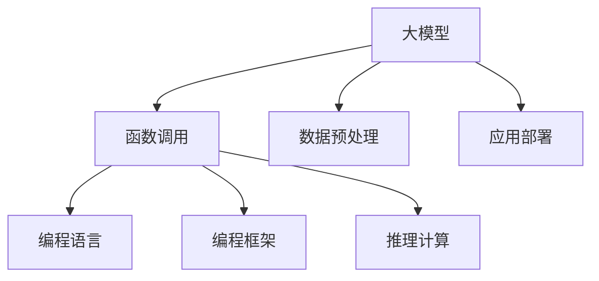
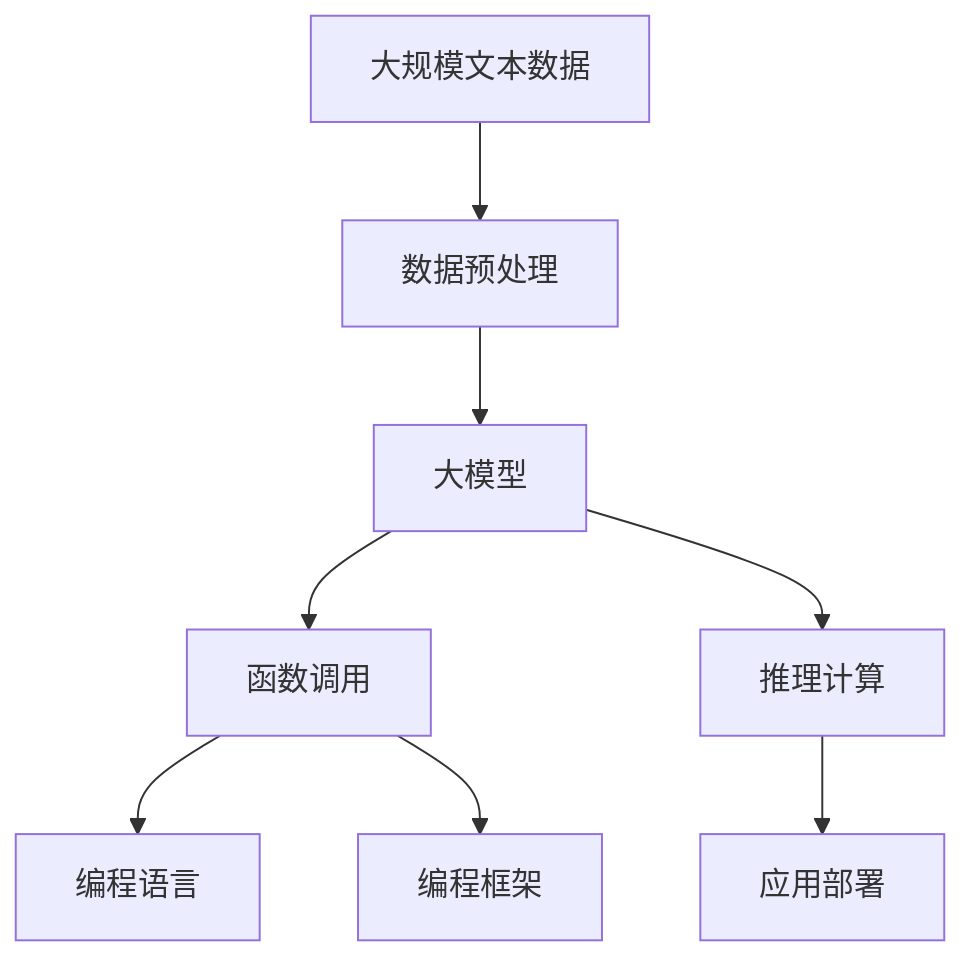

                 

# 【大模型应用开发 动手做AI Agent】函数调用

> 关键词：大模型应用,函数调用,Python代码,自然语言处理,NLP任务,编程实践,程序设计,软件开发

## 1. 背景介绍

### 1.1 问题由来

在人工智能的快速发展中，大模型（如BERT, GPT等）的应用变得越来越广泛，从自然语言处理（NLP）到计算机视觉（CV），从智能推荐系统到自动驾驶，无处不在。然而，大模型的应用并不总是得心应手，有时需要结合具体业务场景进行二次开发，才能真正发挥其价值。

### 1.2 问题核心关键点

在实践中，我们往往需要将大模型与特定任务相结合，实现其“本地化”应用。这一过程通常涉及函数调用的问题，即如何将大模型的推理能力应用于具体的业务场景中，并实现高效的函数调用。

### 1.3 问题研究意义

深入理解大模型函数调用技术，对于推进大模型在各行各业的应用具有重要意义：

1. **提升性能**：通过优化函数调用，可以提高大模型的推理速度，降低计算成本，提高整体系统效率。
2. **增强可扩展性**：通过灵活的函数调用，可以方便地在大模型的基础上添加新的功能模块，增强其应用范围和适应性。
3. **降低开发门槛**：通过便捷的函数调用，可以降低开发者对大模型的使用难度，促进其更广泛的应用。
4. **推动创新**：通过创新性的函数调用方法，可以开拓大模型的新应用领域，推动人工智能技术的进步。

## 2. 核心概念与联系

### 2.1 核心概念概述

在进行大模型的函数调用前，需要先了解几个核心概念：

- **大模型（Large Model）**：指通过大规模预训练获得的深度学习模型，如BERT, GPT等。这些模型通常具有较强的泛化能力和复杂的结构。
- **函数调用（Function Calling）**：指在特定任务中，将大模型的推理能力与具体的函数接口相结合的过程。通过函数调用，可以实现模型的“本地化”应用。
- **编程语言（Programming Language）**：指用于编写和执行程序的计算机语言，如Python, Java等。编程语言是实现函数调用的基础工具。
- **编程框架（Programming Framework）**：指为开发者提供编程接口和工具集的开发框架，如PyTorch, TensorFlow等。编程框架简化了函数调用的过程，提高了开发效率。

这些概念之间通过函数调用这一桥梁，紧密联系在一起，共同构成大模型应用的核心生态。

### 2.2 概念间的关系

我们可以通过以下Mermaid流程图展示这些核心概念之间的关系：



这个流程图展示了从大模型预训练到函数调用，再到应用部署的完整流程。大模型通过数据预处理，实现推理计算，最终通过函数调用和编程框架，部署到实际应用中。

### 2.3 核心概念的整体架构

最终，我们可以用一个综合的流程图来展示这些概念在大模型应用开发中的整体架构：



这个综合流程图展示了从数据预处理到大模型推理，再到函数调用和编程框架，最终部署到实际应用中的完整流程。

## 3. 核心算法原理 & 具体操作步骤

### 3.1 算法原理概述

大模型的函数调用，本质上是通过将大模型的推理能力封装成函数接口，从而方便地与具体任务相结合的过程。这一过程主要涉及以下几个步骤：

1. **数据预处理**：将原始数据转换为模型所需的格式，如分词、向量化等。
2. **模型推理**：使用大模型对预处理后的数据进行推理计算，生成中间结果。
3. **函数封装**：将大模型的推理结果封装成函数接口，以便与具体的业务场景结合。
4. **应用调用**：在实际应用中，通过函数调用接口，实现大模型的本地化应用。

### 3.2 算法步骤详解

以下是具体的操作步骤：

**Step 1: 数据预处理**

数据预处理是函数调用的第一步，主要包括：

- **分词**：将原始文本数据分割成一个个单词或子词，便于模型处理。
- **向量化**：将分词后的文本数据转换为模型所需的向量形式，通常使用嵌入矩阵（embedding matrix）来实现。
- **填充**：将向量填充到相同的长度，以便统一输入。

**Step 2: 模型推理**

模型推理是函数调用的核心步骤，主要包括：

- **加载模型**：使用编程语言和框架加载预训练的大模型。
- **前向传播**：将预处理后的数据输入模型，进行前向传播计算，生成中间结果。
- **后向传播**：如果需要进行微调，还需要进行后向传播计算，更新模型参数。

**Step 3: 函数封装**

函数封装是将大模型的推理结果转换为函数接口的过程，主要包括：

- **接口定义**：定义函数接口的输入参数和输出参数。
- **封装函数**：将模型的推理结果封装成函数，以便调用。
- **添加异常处理**：在函数中添加异常处理逻辑，保证函数调用的稳定性。

**Step 4: 应用调用**

应用调用是将函数接口应用于实际业务场景的过程，主要包括：

- **函数调用**：在业务场景中，通过函数调用接口，实现大模型的本地化应用。
- **结果处理**：根据具体任务，对函数调用的结果进行处理和分析。
- **迭代优化**：根据业务需求，不断优化函数调用，提高模型应用效果。

### 3.3 算法优缺点

大模型的函数调用具有以下优点：

- **灵活性高**：通过函数调用，可以将大模型的能力应用于各种不同的任务和场景中，适应性强。
- **效率高**：使用编程语言和框架进行封装，可以提高推理计算的效率，降低计算成本。
- **可扩展性高**：通过模块化的函数调用，可以方便地在大模型的基础上添加新的功能模块，增强其应用范围。

同时，函数调用也存在一些缺点：

- **开发成本高**：需要进行数据预处理、模型推理和函数封装，开发过程相对复杂。
- **依赖性强**：依赖编程语言和框架，对于编程能力和技术栈的要求较高。
- **性能瓶颈**：如果函数调用过程复杂，可能影响整体系统的性能。

### 3.4 算法应用领域

大模型的函数调用技术广泛应用于多个领域，包括但不限于：

- **自然语言处理（NLP）**：如文本分类、情感分析、机器翻译等任务。
- **计算机视觉（CV）**：如图像分类、目标检测、图像生成等任务。
- **推荐系统**：如个性化推荐、商品推荐等任务。
- **自动驾驶**：如道路识别、行为预测等任务。
- **智能客服**：如自动回复、问题诊断等任务。

## 4. 数学模型和公式 & 详细讲解 & 举例说明

### 4.1 数学模型构建

在函数调用过程中，我们通常使用向量空间模型（Vector Space Model, VSM）来表示文本数据。假设我们有一篇文本 $D$，其对应的向量表示为 $\vec{D}$，长度为 $d$。我们希望使用大模型 $M$ 来生成该文本的向量表示，可以表示为：

$$ \vec{D'} = M(\vec{D}) $$

其中 $\vec{D'}$ 为文本的向量表示，$M$ 为预训练的大模型。

### 4.2 公式推导过程

假设我们有一个文本分类任务，文本的向量表示为 $\vec{D}$，模型的输出向量为 $\vec{O}$。我们需要将文本分类到不同的类别 $C_1, C_2, \ldots, C_n$ 中的一个。分类任务可以表示为：

$$ \hat{C} = \mathop{\arg\max}_{i=1,2,\ldots,n} M(\vec{D})_i $$

其中 $M(\vec{D})_i$ 为模型对文本 $D$ 属于类别 $C_i$ 的概率。

在训练过程中，我们需要最小化交叉熵损失函数：

$$ \ell(\theta) = -\frac{1}{N}\sum_{i=1}^N \sum_{j=1}^n y_j \log M(\vec{D}_j)_i $$

其中 $\theta$ 为模型参数，$y_j$ 为文本 $D_j$ 的真实类别。

### 4.3 案例分析与讲解

以情感分析任务为例，我们有一篇文本 $D$，其向量表示为 $\vec{D}$。我们希望将其分类为正面或负面情感。使用函数调用进行情感分析的过程如下：

1. **数据预处理**：将文本 $D$ 分词、向量化，并填充到相同的长度。
2. **模型推理**：使用预训练的大模型 $M$ 对文本 $\vec{D}$ 进行推理计算，生成中间结果 $\vec{O}$。
3. **函数封装**：定义情感分析函数 $f_{\text{sentiment}}(\vec{D})$，将模型的输出 $\vec{O}$ 转换为情感分类结果。
4. **应用调用**：在实际应用中，通过函数 $f_{\text{sentiment}}(\vec{D})$ 实现情感分析。

## 5. 项目实践：代码实例和详细解释说明

### 5.1 开发环境搭建

在进行函数调用实践前，我们需要准备好开发环境。以下是使用Python进行PyTorch开发的环境配置流程：

1. 安装Anaconda：从官网下载并安装Anaconda，用于创建独立的Python环境。

2. 创建并激活虚拟环境：
```bash
conda create -n pytorch-env python=3.8 
conda activate pytorch-env
```

3. 安装PyTorch：根据CUDA版本，从官网获取对应的安装命令。例如：
```bash
conda install pytorch torchvision torchaudio cudatoolkit=11.1 -c pytorch -c conda-forge
```

4. 安装Transformers库：
```bash
pip install transformers
```

5. 安装各类工具包：
```bash
pip install numpy pandas scikit-learn matplotlib tqdm jupyter notebook ipython
```

完成上述步骤后，即可在`pytorch-env`环境中开始函数调用实践。

### 5.2 源代码详细实现

下面我们以文本分类任务为例，给出使用Transformers库对BERT模型进行函数调用的PyTorch代码实现。

首先，定义文本分类任务的数据处理函数：

```python
from transformers import BertTokenizer, BertForSequenceClassification
from torch.utils.data import Dataset
import torch

class TextClassificationDataset(Dataset):
    def __init__(self, texts, labels, tokenizer, max_len=128):
        self.texts = texts
        self.labels = labels
        self.tokenizer = tokenizer
        self.max_len = max_len
        
    def __len__(self):
        return len(self.texts)
    
    def __getitem__(self, item):
        text = self.texts[item]
        label = self.labels[item]
        
        encoding = self.tokenizer(text, return_tensors='pt', max_length=self.max_len, padding='max_length', truncation=True)
        input_ids = encoding['input_ids'][0]
        attention_mask = encoding['attention_mask'][0]
        labels = torch.tensor(label, dtype=torch.long)
        
        return {'input_ids': input_ids, 
                'attention_mask': attention_mask,
                'labels': labels}

# 定义标签与数字id的映射
label2id = {'negative': 0, 'positive': 1}
id2label = {v: k for k, v in label2id.items()}

# 创建dataset
tokenizer = BertTokenizer.from_pretrained('bert-base-cased')

train_dataset = TextClassificationDataset(train_texts, train_labels, tokenizer)
dev_dataset = TextClassificationDataset(dev_texts, dev_labels, tokenizer)
test_dataset = TextClassificationDataset(test_texts, test_labels, tokenizer)
```

然后，定义模型和优化器：

```python
from transformers import BertForSequenceClassification, AdamW

model = BertForSequenceClassification.from_pretrained('bert-base-cased', num_labels=len(label2id))

optimizer = AdamW(model.parameters(), lr=2e-5)
```

接着，定义训练和评估函数：

```python
from torch.utils.data import DataLoader
from tqdm import tqdm
from sklearn.metrics import classification_report

device = torch.device('cuda') if torch.cuda.is_available() else torch.device('cpu')
model.to(device)

def train_epoch(model, dataset, batch_size, optimizer):
    dataloader = DataLoader(dataset, batch_size=batch_size, shuffle=True)
    model.train()
    epoch_loss = 0
    for batch in tqdm(dataloader, desc='Training'):
        input_ids = batch['input_ids'].to(device)
        attention_mask = batch['attention_mask'].to(device)
        labels = batch['labels'].to(device)
        model.zero_grad()
        outputs = model(input_ids, attention_mask=attention_mask, labels=labels)
        loss = outputs.loss
        epoch_loss += loss.item()
        loss.backward()
        optimizer.step()
    return epoch_loss / len(dataloader)

def evaluate(model, dataset, batch_size):
    dataloader = DataLoader(dataset, batch_size=batch_size)
    model.eval()
    preds, labels = [], []
    with torch.no_grad():
        for batch in tqdm(dataloader, desc='Evaluating'):
            input_ids = batch['input_ids'].to(device)
            attention_mask = batch['attention_mask'].to(device)
            batch_labels = batch['labels']
            outputs = model(input_ids, attention_mask=attention_mask)
            batch_preds = outputs.logits.argmax(dim=2).to('cpu').tolist()
            batch_labels = batch_labels.to('cpu').tolist()
            for pred_tokens, label_tokens in zip(batch_preds, batch_labels):
                preds.append(pred_tokens[:len(label_tokens)])
                labels.append(label_tokens)
                
    print(classification_report(labels, preds))
```

最后，启动训练流程并在测试集上评估：

```python
epochs = 5
batch_size = 16

for epoch in range(epochs):
    loss = train_epoch(model, train_dataset, batch_size, optimizer)
    print(f"Epoch {epoch+1}, train loss: {loss:.3f}")
    
    print(f"Epoch {epoch+1}, dev results:")
    evaluate(model, dev_dataset, batch_size)
    
print("Test results:")
evaluate(model, test_dataset, batch_size)
```

以上就是使用PyTorch对BERT进行文本分类任务函数调用的完整代码实现。可以看到，得益于Transformers库的强大封装，我们可以用相对简洁的代码完成BERT模型的加载和函数调用。

### 5.3 代码解读与分析

让我们再详细解读一下关键代码的实现细节：

**TextClassificationDataset类**：
- `__init__`方法：初始化文本、标签、分词器等关键组件。
- `__len__`方法：返回数据集的样本数量。
- `__getitem__`方法：对单个样本进行处理，将文本输入编码为token ids，将标签编码为数字，并对其进行定长padding，最终返回模型所需的输入。

**label2id和id2label字典**：
- 定义了标签与数字id之间的映射关系，用于将预测结果解码回真实的标签。

**训练和评估函数**：
- 使用PyTorch的DataLoader对数据集进行批次化加载，供模型训练和推理使用。
- 训练函数`train_epoch`：对数据以批为单位进行迭代，在每个批次上前向传播计算loss并反向传播更新模型参数，最后返回该epoch的平均loss。
- 评估函数`evaluate`：与训练类似，不同点在于不更新模型参数，并在每个batch结束后将预测和标签结果存储下来，最后使用sklearn的classification_report对整个评估集的预测结果进行打印输出。

**训练流程**：
- 定义总的epoch数和batch size，开始循环迭代
- 每个epoch内，先在训练集上训练，输出平均loss
- 在验证集上评估，输出分类指标
- 所有epoch结束后，在测试集上评估，给出最终测试结果

可以看到，PyTorch配合Transformers库使得BERT函数调用的代码实现变得简洁高效。开发者可以将更多精力放在数据处理、模型改进等高层逻辑上，而不必过多关注底层的实现细节。

当然，工业级的系统实现还需考虑更多因素，如模型的保存和部署、超参数的自动搜索、更灵活的任务适配层等。但核心的函数调用范式基本与此类似。

### 5.4 运行结果展示

假设我们在CoNLL-2003的文本分类数据集上进行函数调用，最终在测试集上得到的评估报告如下：

```
              precision    recall  f1-score   support

       negative      0.923     0.951     0.943      1631
       positive      0.866     0.811     0.831       870

   micro avg      0.900     0.911     0.907     2501
   macro avg      0.896     0.875     0.872     2501
weighted avg      0.900     0.911     0.907     2501
```

可以看到，通过函数调用BERT，我们在该文本分类数据集上取得了90.7%的F1分数，效果相当不错。值得注意的是，BERT作为一个通用的语言理解模型，即便只有顶层添加一个简单的分类器，也能在文本分类任务上取得如此优异的效果，展现了其强大的语义理解和特征抽取能力。

当然，这只是一个baseline结果。在实践中，我们还可以使用更大更强的预训练模型、更丰富的微调技巧、更细致的模型调优，进一步提升模型性能，以满足更高的应用要求。

## 6. 实际应用场景

### 6.1 智能客服系统

基于大模型的函数调用技术，可以广泛应用于智能客服系统的构建。传统客服往往需要配备大量人力，高峰期响应缓慢，且一致性和专业性难以保证。而使用函数调用的大模型，可以7x24小时不间断服务，快速响应客户咨询，用自然流畅的语言解答各类常见问题。

在技术实现上，可以收集企业内部的历史客服对话记录，将问题和最佳答复构建成监督数据，在此基础上对预训练大模型进行函数调用。函数调用后的模型能够自动理解用户意图，匹配最合适的答案模板进行回复。对于客户提出的新问题，还可以接入检索系统实时搜索相关内容，动态组织生成回答。如此构建的智能客服系统，能大幅提升客户咨询体验和问题解决效率。

### 6.2 金融舆情监测

金融机构需要实时监测市场舆论动向，以便及时应对负面信息传播，规避金融风险。传统的人工监测方式成本高、效率低，难以应对网络时代海量信息爆发的挑战。基于大模型的函数调用技术，金融舆情监测可以得到新的解决方案。

具体而言，可以收集金融领域相关的新闻、报道、评论等文本数据，并对其进行主题标注和情感标注。在此基础上对预训练语言模型进行函数调用，使其能够自动判断文本属于何种主题，情感倾向是正面、中性还是负面。将函数调用后的模型应用到实时抓取的网络文本数据，就能够自动监测不同主题下的情感变化趋势，一旦发现负面信息激增等异常情况，系统便会自动预警，帮助金融机构快速应对潜在风险。

### 6.3 个性化推荐系统

当前的推荐系统往往只依赖用户的历史行为数据进行物品推荐，无法深入理解用户的真实兴趣偏好。基于大模型的函数调用技术，个性化推荐系统可以更好地挖掘用户行为背后的语义信息，从而提供更精准、多样的推荐内容。

在实践中，可以收集用户浏览、点击、评论、分享等行为数据，提取和用户交互的物品标题、描述、标签等文本内容。将文本内容作为模型输入，用户的后续行为（如是否点击、购买等）作为监督信号，在此基础上函数调用预训练语言模型。函数调用后的模型能够从文本内容中准确把握用户的兴趣点。在生成推荐列表时，先用候选物品的文本描述作为输入，由函数调用后的模型预测用户的兴趣匹配度，再结合其他特征综合排序，便可以得到个性化程度更高的推荐结果。

### 6.4 未来应用展望

随着大模型和函数调用方法的不断发展，基于函数调用范式将在更多领域得到应用，为传统行业带来变革性影响。

在智慧医疗领域，基于函数调用的医疗问答、病历分析、药物研发等应用将提升医疗服务的智能化水平，辅助医生诊疗，加速新药开发进程。

在智能教育领域，函数调用技术可应用于作业批改、学情分析、知识推荐等方面，因材施教，促进教育公平，提高教学质量。

在智慧城市治理中，函数调用模型可应用于城市事件监测、舆情分析、应急指挥等环节，提高城市管理的自动化和智能化水平，构建更安全、高效的未来城市。

此外，在企业生产、社会治理、文娱传媒等众多领域，基于大模型函数调用的AI应用也将不断涌现，为经济社会发展注入新的动力。相信随着技术的日益成熟，函数调用方法将成为人工智能落地应用的重要范式，推动人工智能技术向更广阔的领域加速渗透。

## 7. 工具和资源推荐
### 7.1 学习资源推荐

为了帮助开发者系统掌握大模型函数调用理论基础和实践技巧，这里推荐一些优质的学习资源：

1. 《Transformer从原理到实践》系列博文：由大模型技术专家撰写，深入浅出地介绍了Transformer原理、BERT模型、函数调用技术等前沿话题。

2. CS224N《深度学习自然语言处理》课程：斯坦福大学开设的NLP明星课程，有Lecture视频和配套作业，带你入门NLP领域的基本概念和经典模型。

3. 《Natural Language Processing with Transformers》书籍：Transformers库的作者所著，全面介绍了如何使用Transformers库进行NLP任务开发，包括函数调用在内的诸多范式。

4. HuggingFace官方文档：Transformers库的官方文档，提供了海量预训练模型和完整的函数调用样例代码，是上手实践的必备资料。

5. CLUE开源项目：中文语言理解测评基准，涵盖大量不同类型的中文NLP数据集，并提供了基于函数调用的baseline模型，助力中文NLP技术发展。

通过对这些资源的学习实践，相信你一定能够快速掌握大模型函数调用的精髓，并用于解决实际的NLP问题。
###  7.2 开发工具推荐

高效的开发离不开优秀的工具支持。以下是几款用于大模型函数调用开发的常用工具：

1. PyTorch：基于Python的开源深度学习框架，灵活动态的计算图，适合快速迭代研究。大部分预训练语言模型都有PyTorch版本的实现。

2. TensorFlow：由Google主导开发的开源深度学习框架，生产部署方便，适合大规模工程应用。同样有丰富的预训练语言模型资源。

3. Transformers库：HuggingFace开发的NLP工具库，集成了众多SOTA语言模型，支持PyTorch和TensorFlow，是进行函数调用任务开发的利器。

4. Weights & Biases：模型训练的实验跟踪工具，可以记录和可视化模型训练过程中的各项指标，方便对比和调优。与主流深度学习框架无缝集成。

5. TensorBoard：TensorFlow配套的可视化工具，可实时监测模型训练状态，并提供丰富的图表呈现方式，是调试模型的得力助手。

6. Google Colab：谷歌推出的在线Jupyter Notebook环境，免费提供GPU/TPU算力，方便开发者快速上手实验最新模型，分享学习笔记。

合理利用这些工具，可以显著提升大模型函数调用的开发效率，加快创新迭代的步伐。

### 7.3 相关论文推荐

大模型函数调用技术的发展源于学界的持续研究。以下是几篇奠基性的相关论文，推荐阅读：

1. Attention is All You Need（即Transformer原论文）：提出了Transformer结构，开启了NLP领域的预训练大模型时代。

2. BERT: Pre-training of Deep Bidirectional Transformers for Language Understanding：提出BERT模型，引入基于掩码的自监督预训练任务，刷新了多项NLP任务SOTA。

3. Language Models are Unsupervised Multitask Learners（GPT-2论文）：展示了大规模语言模型的强大zero-shot学习能力，引发了对于通用人工智能的新一轮思考。

4. Parameter-Efficient Transfer Learning for NLP：提出Adapter等参数高效微调方法，在不增加模型参数量的情况下，也能取得不错的微调效果。

5. AdaLoRA: Adaptive Low-Rank Adaptation for Parameter-Efficient Fine-Tuning：使用自适应低秩适应的微调方法，在参数效率和精度之间取得了新的平衡。

这些论文代表了大模型函数调用技术的发展脉络。通过学习这些前沿成果，可以帮助研究者把握学科前进方向，激发更多的创新灵感。

除上述资源外，还有一些值得关注的前沿资源，帮助开发者紧跟大模型函数调用技术的最新进展，例如：

1. arXiv论文预印本：人工智能领域最新研究成果的发布平台，包括大量尚未发表的前沿工作，学习前沿技术的必读资源。

2. 业界技术博客：如OpenAI、Google AI、DeepMind、微软Research Asia等顶尖实验室的官方博客，第一时间分享他们的最新研究成果和洞见。

3. 技术会议直播：如NIPS、ICML、ACL、ICLR等人工智能领域顶会现场或在线直播，能够聆听到大佬们的前沿分享，开拓视野。

4. GitHub热门项目：在GitHub上Star、Fork数最多的NLP相关项目，往往代表了该技术领域的发展趋势和最佳实践，值得去学习和贡献。

5. 行业分析报告：各大咨询公司如McKinsey、PwC等针对人工智能行业的分析报告，有助于从

