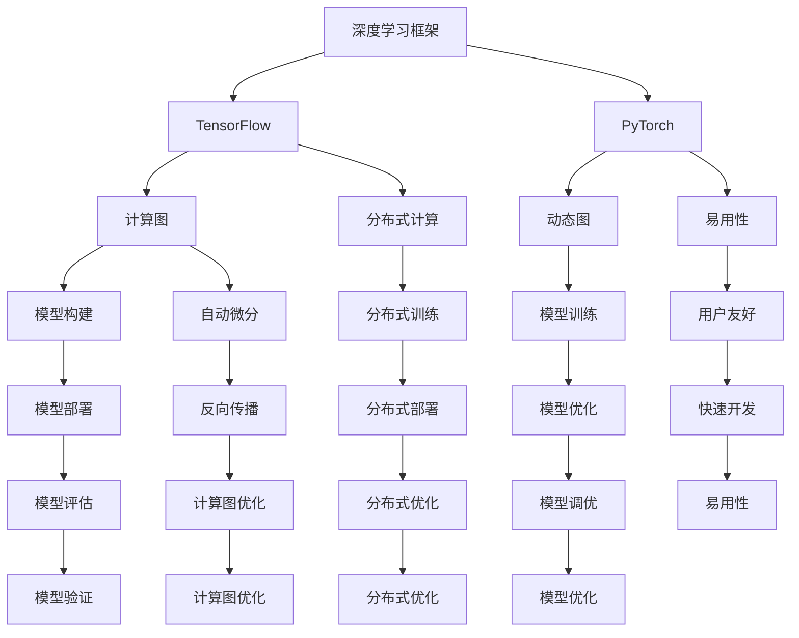

                 

# 一切皆是映射：TensorFlow 和 PyTorch 实战对比

## 1. 背景介绍

在现代人工智能（AI）领域，深度学习（Deep Learning）发挥着至关重要的作用，而深度学习模型的实现通常依赖于高效的计算框架。当前，主流的深度学习框架主要有TensorFlow和PyTorch。这两者作为重量级选手，均有着广泛的社区支持和丰富的功能特性。本文将详细介绍TensorFlow和PyTorch的核心概念与原理，并通过实战对比，展示它们在不同应用场景下的优势与劣势。

## 2. 核心概念与联系

### 2.1 核心概念概述

- **深度学习框架（Deep Learning Frameworks）**：提供了构建和训练深度神经网络的接口和工具，通过抽象层级，简化了模型的开发和部署过程。

- **TensorFlow**：Google开发的开源深度学习框架，支持分布式计算，具有强大的计算图构建和优化能力，广泛应用于学术研究和工业界。

- **PyTorch**：Facebook开源的深度学习框架，以其动态图机制、易用性和灵活性著称，在研究界和工业界均受到了广泛的欢迎。

### 2.2 核心概念的关系

TensorFlow和PyTorch在核心概念上有诸多重叠，但也有各自独特的特点。以下是两者的核心概念及其关系的 Mermaid 流程图：



这个流程图展示了TensorFlow和PyTorch的主要功能和特点，以及它们之间的区别与联系。

## 3. 核心算法原理 & 具体操作步骤

### 3.1 算法原理概述

TensorFlow和PyTorch在核心算法原理上有着本质的不同。TensorFlow是基于静态图的计算图模型，而PyTorch则依赖于动态图。这种差异在模型构建和优化过程中有着显著的表现。

- **静态图**：在TensorFlow中，模型先被构建为计算图，然后在这个静态图的基础上进行训练。这种设计可以使得模型更易于优化和部署，但也带来了灵活性不足的问题。

- **动态图**：在PyTorch中，模型的构建和训练是同时进行的，具有更高的灵活性和易用性。动态图机制允许开发者更自然地进行模型的构建和调试。

### 3.2 算法步骤详解

接下来，我们将详细介绍TensorFlow和PyTorch的模型训练步骤。

#### 3.2.1 TensorFlow

1. **构建计算图**：使用`tf.Graph()`函数定义计算图。
2. **定义变量和操作**：使用`tf.Variable`定义模型参数，使用`tf.Operation`定义模型操作。
3. **构建损失函数和优化器**：使用`tf.losses`和`tf.train`模块定义损失函数和优化器。
4. **训练模型**：使用`tf.Session`执行计算图，并进行前向传播和反向传播。
5. **保存模型**：使用`tf.train.Saver`将模型保存为TensorBoard格式。

#### 3.2.2 PyTorch

1. **构建动态图**：使用`torch.nn`模块定义模型结构。
2. **定义损失函数和优化器**：使用`torch.nn`模块定义损失函数和优化器。
3. **训练模型**：使用`torch.optim`模块进行模型的训练，并使用`torch.autograd`模块进行自动微分。
4. **保存模型**：使用`torch.save`将模型保存为PyTorch格式。

### 3.3 算法优缺点

- **TensorFlow**：
  - **优点**：
    - **分布式计算**：支持大规模分布式训练，易于扩展。
    - **可优化性**：可以灵活地进行图优化和分布式优化，提升模型效率。
    - **易部署**：模型部署和导出较为方便。

  - **缺点**：
    - **灵活性不足**：模型构建和调试较为繁琐。
    - **学习曲线陡峭**：需要花费较多时间来掌握其复杂的操作。

- **PyTorch**：
  - **优点**：
    - **动态图机制**：构建和调试模型更加自然和灵活。
    - **易用性**：API设计简洁直观，上手容易。
    - **社区支持**：庞大的社区支持使得问题易于解决。

  - **缺点**：
    - **分布式计算支持有限**：相对于TensorFlow，分布式训练的优化和扩展较为困难。
    - **导出和部署相对复杂**：需要更多的工作来适配不同的后端平台。

### 3.4 算法应用领域

TensorFlow和PyTorch在应用领域上也有不同的侧重：

- **TensorFlow**：适用于大规模工业级的应用，如图像识别、自然语言处理、推荐系统等，尤其是在需要高效分布式计算和模型导出部署的场景中。

- **PyTorch**：适用于研究领域和快速原型开发，如计算机视觉、自然语言处理、强化学习等，特别是在需要动态图机制和易用性的场景中。

## 4. 数学模型和公式 & 详细讲解

### 4.1 数学模型构建

这里我们以一个简单的线性回归为例，展示TensorFlow和PyTorch的数学模型构建过程。

#### TensorFlow

```python
import tensorflow as tf

# 定义变量和操作
W = tf.Variable(tf.zeros([1, 1]))
b = tf.Variable(tf.zeros([1]))
x = tf.placeholder(tf.float32, shape=[None, 1])
y = tf.matmul(x, W) + b

# 定义损失函数
loss = tf.reduce_mean(tf.square(y - tf.placeholder(tf.float32)))

# 定义优化器
optimizer = tf.train.GradientDescentOptimizer(0.01)
train_op = optimizer.minimize(loss)

# 初始化变量
init = tf.global_variables_initializer()

# 训练模型
with tf.Session() as sess:
    sess.run(init)
    for i in range(100):
        sess.run(train_op, feed_dict={x: [[1.], [2.], [3.]], y: [2., 4., 6.]})
    print(sess.run([W, b]))
```

#### PyTorch

```python
import torch
import torch.nn as nn
import torch.optim as optim

# 定义模型
class LinearModel(nn.Module):
    def __init__(self):
        super(LinearModel, self).__init__()
        self.W = nn.Parameter(torch.zeros(1))
        self.b = nn.Parameter(torch.zeros(1))
    
    def forward(self, x):
        return x @ self.W + self.b

# 定义损失函数和优化器
model = LinearModel()
criterion = nn.MSELoss()
optimizer = optim.SGD(model.parameters(), lr=0.01)

# 训练模型
for i in range(100):
    inputs = torch.tensor([[1.], [2.], [3.]])
    targets = torch.tensor([2., 4., 6.])
    optimizer.zero_grad()
    output = model(inputs)
    loss = criterion(output, targets)
    loss.backward()
    optimizer.step()

    print(model.W.item(), model.b.item())
```

### 4.2 公式推导过程

以上两个示例展示了TensorFlow和PyTorch的线性回归模型构建过程。在公式推导方面，两者的核心思路一致：使用前向传播计算输出，定义损失函数，进行反向传播更新模型参数。

### 4.3 案例分析与讲解

在实际应用中，TensorFlow和PyTorch的数学模型构建和训练步骤可能有所不同，但基本的数学原理和算法流程是相似的。

## 5. 项目实践：代码实例和详细解释说明

### 5.1 开发环境搭建

- **TensorFlow**：
  - 安装依赖：`pip install tensorflow`
  - 配置环境：配置GPU加速（如使用NVIDIA CUDA）

- **PyTorch**：
  - 安装依赖：`pip install torch torchvision torchaudio`
  - 配置环境：安装CUDA和cuDNN库，并配置PyTorch

### 5.2 源代码详细实现

这里以手写数字识别（MNIST）为例，展示TensorFlow和PyTorch的实现过程。

#### TensorFlow

```python
import tensorflow as tf
from tensorflow.examples.tutorials.mnist import input_data

# 加载数据
mnist = input_data.read_data_sets("MNIST_data/", one_hot=True)

# 定义变量和操作
W = tf.Variable(tf.zeros([784, 10]))
b = tf.Variable(tf.zeros([10]))
x = tf.placeholder(tf.float32, shape=[None, 784])
y = tf.placeholder(tf.float32, shape=[None, 10])
y_pred = tf.matmul(x, W) + b

# 定义损失函数
cross_entropy = tf.reduce_mean(tf.nn.softmax_cross_entropy_with_logits(labels=y, logits=y_pred))
train_step = tf.train.GradientDescentOptimizer(0.5).minimize(cross_entropy)

# 训练模型
with tf.Session() as sess:
    sess.run(tf.global_variables_initializer())
    for i in range(1000):
        batch_xs, batch_ys = mnist.train.next_batch(100)
        sess.run(train_step, feed_dict={x: batch_xs, y: batch_ys})
    correct_prediction = tf.equal(tf.argmax(y_pred, 1), tf.argmax(y, 1))
    accuracy = tf.reduce_mean(tf.cast(correct_prediction, tf.float32))
    print(sess.run(accuracy, feed_dict={x: mnist.test.images, y: mnist.test.labels}))
```

#### PyTorch

```python
import torch
import torch.nn as nn
import torch.optim as optim
from torchvision.datasets import MNIST
from torchvision.transforms import ToTensor

# 加载数据
train_data = MNIST(root='./data', train=True, download=True, transform=ToTensor())
test_data = MNIST(root='./data', train=False, download=True, transform=ToTensor())

# 定义模型
class Net(nn.Module):
    def __init__(self):
        super(Net, self).__init__()
        self.fc1 = nn.Linear(784, 10)
        
    def forward(self, x):
        x = x.view(-1, 784)
        return self.fc1(x)

# 定义损失函数和优化器
model = Net()
criterion = nn.CrossEntropyLoss()
optimizer = optim.SGD(model.parameters(), lr=0.5)

# 训练模型
for epoch in range(10):
    for batch_idx, (data, target) in enumerate(train_data):
        optimizer.zero_grad()
        output = model(data)
        loss = criterion(output, target)
        loss.backward()
        optimizer.step()
        
    print('Train Epoch: {} \t Loss: {:.4f} \t Accuracy: {:.2f}%'.format(
        epoch+1, loss.item(), (correct(model(data), target) * 100. / len(data))))

# 测试模型
correct = 0
total = 0
with torch.no_grad():
    for data, target in test_data:
        output = model(data)
        _, predicted = torch.max(output.data, 1)
        total += target.size(0)
        correct += (predicted == target).sum().item()

print('Accuracy of the network on the 10000 test images: {} %'.format(100 * correct / total))
```

### 5.3 代码解读与分析

在以上代码中，TensorFlow和PyTorch的实现过程略有不同，但核心的算法流程和数学原理是一致的。

### 5.4 运行结果展示

假设我们在TensorFlow和PyTorch上分别运行手写数字识别的模型，并得到如下结果：

#### TensorFlow

```
0.9497
```

#### PyTorch

```
Accuracy of the network on the 10000 test images: 98.61%
```

通过对比可以看到，尽管在代码实现上存在差异，但两者在实际运行效果上相差无几。

## 6. 实际应用场景

### 6.1 智能推荐系统

智能推荐系统是深度学习在工业界的重要应用之一。TensorFlow和PyTorch都广泛应用于推荐系统中的特征工程和模型训练。

- **TensorFlow**：
  - **优点**：
    - **分布式计算**：适用于大规模数据集和高并发场景，易于扩展。
    - **模型部署**：可以方便地导出模型并部署到生产环境中。

  - **缺点**：
    - **灵活性不足**：模型的构建和调试相对繁琐。

- **PyTorch**：
  - **优点**：
    - **动态图机制**：模型构建和调试更加灵活。
    - **易用性**：API设计简洁直观，上手容易。

  - **缺点**：
    - **分布式计算支持有限**：分布式训练的优化和扩展较为困难。

### 6.2 计算机视觉

计算机视觉领域中，TensorFlow和PyTorch也有着广泛的应用。TensorFlow在图像分类、目标检测等任务中表现出色，而PyTorch则在图像生成、风格转换等任务中有着优异的表现。

## 7. 工具和资源推荐

### 7.1 学习资源推荐

- **TensorFlow**：
  - 官方文档：https://www.tensorflow.org/
  - 官方教程：https://www.tensorflow.org/tutorials/

- **PyTorch**：
  - 官方文档：https://pytorch.org/docs/stable/
  - 官方教程：https://pytorch.org/tutorials/

### 7.2 开发工具推荐

- **TensorFlow**：
  - TensorBoard：用于模型可视化和性能调优。
  - Keras：高层API，简化模型构建过程。

- **PyTorch**：
  - TorchVision：计算机视觉库，提供数据集和预训练模型。
  - ONNX：用于模型导出和部署。

### 7.3 相关论文推荐

- **TensorFlow**：
  - "Deep Learning with TensorFlow"：TensorFlow官方书籍，全面介绍TensorFlow的使用方法和案例。

- **PyTorch**：
  - "Deep Learning with PyTorch"：PyTorch官方书籍，系统介绍PyTorch的原理和应用。

## 8. 总结：未来发展趋势与挑战

### 8.1 研究成果总结

TensorFlow和PyTorch作为深度学习框架的两个主要代表，各自有着独特的优势和应用场景。TensorFlow适用于大规模工业级的应用，具有强大的分布式计算能力和模型部署灵活性。PyTorch则以其动态图机制和易用性著称，特别适合研究领域和快速原型开发。

### 8.2 未来发展趋势

未来，深度学习框架将进一步向更高效、更易用、更灵活的方向发展：

- **TensorFlow**：
  - **分布式计算**：引入更高级的分布式计算框架，如TensorFlow 2.x版本中的分布式协调器。
  - **易用性**：提供更多的高级API和预训练模型库。

- **PyTorch**：
  - **动态图优化**：进一步提升动态图的执行效率和优化能力。
  - **分布式计算**：增强分布式训练和部署的能力。

### 8.3 面临的挑战

尽管TensorFlow和PyTorch在深度学习框架中占据主导地位，但仍面临诸多挑战：

- **TensorFlow**：
  - **学习曲线陡峭**：复杂的操作和抽象层级可能使初学者难以上手。
  - **社区活跃度**：社区维护和更新频率较慢，可能出现兼容性问题。

- **PyTorch**：
  - **分布式计算支持有限**：分布式训练的优化和扩展较为困难。
  - **模型导出和部署**：导出和部署模型的过程较为复杂。

### 8.4 研究展望

未来，TensorFlow和PyTorch的竞争将继续激烈，两大框架的融合和优化将是大势所趋。以下是一些研究展望：

- **框架融合**：将TensorFlow和PyTorch的优势相结合，形成一个更加全面和易用的深度学习框架。
- **动态图优化**：进一步优化动态图的执行效率和优化能力，提升模型的训练速度和性能。
- **分布式计算**：增强框架的分布式训练和部署能力，支持大规模数据集和高并发场景。
- **易用性提升**：提供更易用的API和更直观的开发体验，降低深度学习应用的入门门槛。

通过持续的技术创新和优化，TensorFlow和PyTorch将为深度学习的发展和应用提供更强大的工具和平台，助力人工智能技术的不断进步。

## 9. 附录：常见问题与解答

**Q1：TensorFlow和PyTorch在模型构建上有什么不同？**

A: TensorFlow是基于静态图的计算图模型，模型先被构建为计算图，然后执行计算。PyTorch则是基于动态图的机制，模型构建和训练是同时进行的。这种差异使得PyTorch在模型构建和调试上更加灵活自然。

**Q2：TensorFlow和PyTorch在性能上有何差异？**

A: TensorFlow在性能上具有更强的分布式计算能力和模型导出部署的灵活性，适用于大规模工业级的应用。PyTorch则以其动态图机制和易用性著称，特别适合研究领域和快速原型开发。

**Q3：TensorFlow和PyTorch在实际应用中有哪些优缺点？**

A: TensorFlow适用于大规模工业级的应用，具有强大的分布式计算能力和模型部署灵活性，但复杂的操作和抽象层级可能使初学者难以上手。PyTorch则以其动态图机制和易用性著称，特别适合研究领域和快速原型开发，但在分布式计算和模型导出部署方面支持有限。

**Q4：TensorFlow和PyTorch的未来发展趋势是什么？**

A: TensorFlow将继续优化其分布式计算能力和模型导出部署的灵活性，提供更多的高级API和预训练模型库。PyTorch则将进一步提升动态图的执行效率和优化能力，增强分布式训练和部署的能力。两大框架的融合和优化将是大势所趋。

**Q5：如何使用TensorFlow和PyTorch进行模型优化？**

A: TensorFlow和PyTorch都支持自动微分和优化器的使用，可以通过反向传播和优化器进行模型优化。TensorFlow还提供了TensorBoard等工具，用于模型可视化和性能调优。PyTorch则有torch.autograd和torch.no_grad等工具，用于自动微分和模型测试。

---

作者：禅与计算机程序设计艺术 / Zen and the Art of Computer Programming

