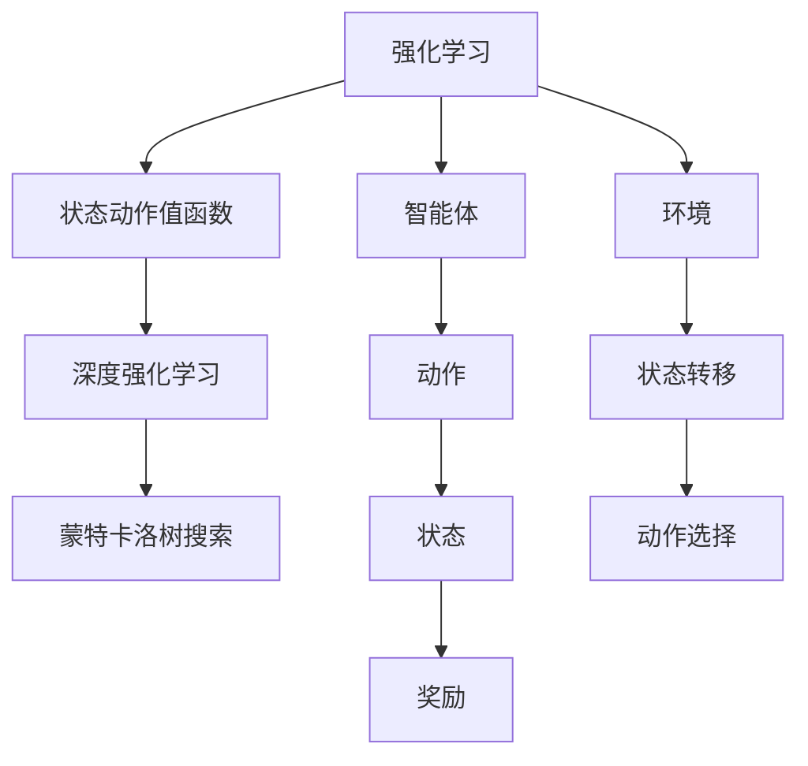
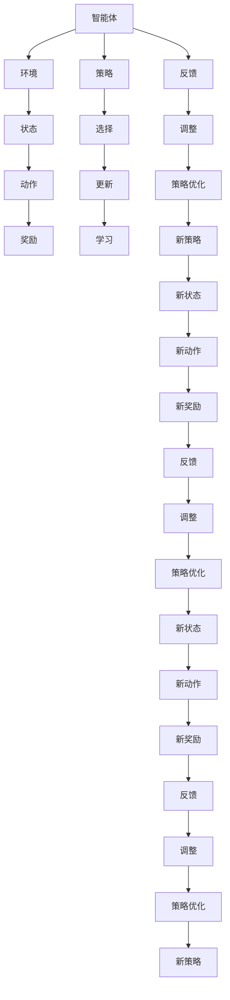
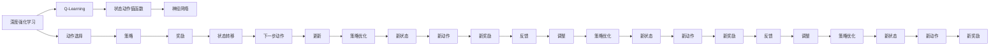

                 

# 一切皆是映射：从监督学习到DQN强化学习的思想转变

> 关键词：监督学习,强化学习,Deep Q-learning,神经网络,蒙特卡洛树搜索,AlphaGo,深度强化学习,神经网络编程

## 1. 背景介绍

### 1.1 问题由来
传统的机器学习算法主要依赖于监督学习、无监督学习等方法，通过人工标注的数据集来训练模型，以解决分类、回归等问题。然而，这些方法在处理复杂任务时，往往面临数据标注成本高、泛化能力弱等问题。与之相对，强化学习作为一种全新的学习范式，通过智能体与环境的互动，通过奖励信号来指导行动策略的选择，能够处理更为复杂的环境交互问题，如游戏、机器人控制、资源调度等。

### 1.2 问题核心关键点
强化学习与监督学习有本质的区别。监督学习关注的是预测（预测标签），而强化学习关注的是优化（优化策略）。强化学习的目标是通过与环境的互动，学习到一个策略，使得在每个状态下选择动作时能够最大化累积奖励。强化学习的核心在于如何设计奖励函数和环境模型，并利用这些信息，通过智能体与环境的交互，不断调整策略以获得更好的性能。

强化学习包括多种算法，如Q-Learning、Deep Q-Learning（DQN）、蒙特卡洛树搜索、策略梯度等。其中，Deep Q-Learning是一种将深度神经网络应用于Q-Learning的方法，大大提高了算法的复杂性，但同时也提升了处理高维状态空间的能力。DQN算法则进一步将深度神经网络应用于Q-Learning，通过深度神经网络对状态和动作进行映射，有效地处理了高维状态空间和连续动作空间问题。

DQN算法通过与环境互动，使用深度神经网络对状态进行编码，利用神经网络来近似Q值函数，通过反向传播更新神经网络参数，不断优化策略以获得更好的性能。这种方法在处理复杂环境交互问题时，表现出显著的优越性。

## 2. 核心概念与联系

### 2.1 核心概念概述

为了更好地理解DQN算法的思想，本节将介绍几个密切相关的核心概念：

- 强化学习（Reinforcement Learning, RL）：通过智能体与环境的互动，通过奖励信号来指导行动策略的选择，使智能体在环境中最大化累积奖励的学习方法。强化学习的主要目标是学习一个策略$\pi$，在每个状态下选择动作$a$时，能够最大化累积奖励$R$。

- 状态动作值函数（Q函数）：在强化学习中，Q函数表示在状态$s$下，选择动作$a$能够获得的长期累积奖励$Q(s,a)$。Q函数可以用以下递推公式表示：
$$
Q(s,a) = r + \gamma \max_{a'} Q(s',a')
$$
其中，$r$为即时奖励，$\gamma$为折扣因子，$s'$为下一个状态。

- 深度强化学习（Deep Reinforcement Learning, DRL）：将深度神经网络应用于强化学习中的Q函数，通过神经网络来近似Q值函数，以处理高维状态和动作空间问题。

- 蒙特卡洛树搜索（Monte Carlo Tree Search, MCTS）：一种利用随机模拟的策略，通过构建搜索树来寻找最优策略的强化学习方法。

- AlphaGo：利用强化学习和蒙特卡洛树搜索算法开发的围棋AI程序，成功击败了世界冠军李世石。

这些核心概念之间的逻辑关系可以通过以下Mermaid流程图来展示：



这个流程图展示了大语言模型的核心概念及其之间的关系：

1. 强化学习通过智能体与环境的互动，学习到一个策略，最大化累积奖励。
2. Q函数表示在状态$s$下，选择动作$a$能够获得的长期累积奖励。
3. 深度强化学习通过神经网络来近似Q值函数，处理高维状态和动作空间问题。
4. Monte Carlo Tree Search通过构建搜索树来寻找最优策略。
5. AlphaGo结合了强化学习和蒙特卡洛树搜索算法，成功应用于围棋游戏。

### 2.2 概念间的关系

这些核心概念之间存在着紧密的联系，形成了强化学习的完整生态系统。下面我通过几个Mermaid流程图来展示这些概念之间的关系。

#### 2.2.1 强化学习的学习范式



这个流程图展示了强化学习的基本原理，即智能体通过与环境的互动，学习到一个策略，最大化累积奖励。智能体根据策略选择动作，根据动作获得奖励和状态转移，并根据奖励和状态调整策略，以获得更好的性能。

#### 2.2.2 深度强化学习与Q-Learning的关系



这个流程图展示了深度强化学习与Q-Learning的关系。深度强化学习通过神经网络来近似Q值函数，从而处理高维状态和动作空间问题。神经网络将状态和动作映射到Q值，从而避免了Q-Learning中计算复杂度高、难以处理高维状态的问题。

#### 2.2.3 Monte Carlo Tree Search在强化学习中的应用

```mermaid
graph TB
    A[蒙特卡洛树搜索] --> B[搜索树]
    B --> C[节点扩展]
    C --> D[子节点扩展]
    D --> E[子树扩展]
    E --> F[节点评估]
    F --> G[子树剪枝]
    G --> H[选择最优动作]
    A --> I[扩展]
    I --> J[评估]
    J --> K[剪枝]
    K --> L[选择最优动作]
    L --> M[执行动作]
    M --> N[状态更新]
    N --> O[奖励]
    O --> P[调整策略]
    P --> Q[更新状态]
    Q --> R[执行动作]
    R --> S[状态更新]
    S --> T[奖励]
    T --> U[调整策略]
    U --> V[更新状态]
    V --> W[执行动作]
    W --> X[状态更新]
    X --> Y[奖励]
    Y --> Z[调整策略]
    Z --> AA[更新状态]
    AA --> BB[执行动作]
    BB --> CC[状态更新]
    CC --> DD[奖励]
    DD --> EE[调整策略]
    EE --> FF[更新状态]
    FF --> GG[执行动作]
    GG --> HH[状态更新]
    HH --> II[奖励]
    II --> JJ[调整策略]
    JJ --> KK[更新状态]
    KK --> LL[执行动作]
    LL --> MM[状态更新]
    MM --> NN[奖励]
    NN --> OO[调整策略]
    OO --> PP[更新状态]
    PP --> QQ[执行动作]
    QQ --> RR[状态更新]
    RR --> SS[奖励]
    SS --> TT[调整策略]
    TT --> UU[更新状态]
    UU --> VV[执行动作]
    VV --> WW[状态更新]
    WW --> XX[奖励]
    XX --> YY[调整策略]
    YY --> ZZ[更新状态]
    ZZ --> AAA[执行动作]
    AAA --> BBB[状态更新]
    BBB --> CCC[奖励]
    CCC --> DDD[调整策略]
    DDD --> EEE[更新状态]
    EEE --> FFF[执行动作]
    FFF --> GGG[状态更新]
    GGG --> HHH[奖励]
    HHH --> III[调整策略]
    III --> JJJ[更新状态]
    JJJ --> KKK[执行动作]
    KKK --> LLL[状态更新]
    LLL --> MNN[奖励]
    MNN --> OOO[调整策略]
    OOO --> PPP[更新状态]
    PPP --> QQQ[执行动作]
    QQQ --> RRR[状态更新]
    RRR --> SSS[奖励]
    SSS --> TTT[调整策略]
    TTT --> UUU[更新状态]
    UUU --> VVV[执行动作]
    VVV --> WWW[状态更新]
    WWW --> XXX[奖励]
    XXX --> YYY[调整策略]
    YYY --> ZZZ[更新状态]
    ZZZ --> AAAA[执行动作]
    AAAT --> BBBB[状态更新]
    BBBB --> CCCC[奖励]
    CCCB --> DDDD[调整策略]
    DDDD --> EEEE[更新状态]
    EEEE --> FFFA[执行动作]
    FFFF --> GGGG[状态更新]
    GGGG --> HHHH[奖励]
    HHHH --> IIIC[调整策略]
    IIIC --> JJJJ[更新状态]
    JJJJ --> KKKK[执行动作]
    KKKK --> LLLLL[状态更新]
    LLLL --> MNNN[奖励]
    MNNN --> OOOO[调整策略]
    OOOO --> PPPP[更新状态]
    PPPP --> QQQQ[执行动作]
    QQQQ --> RRRR[状态更新]
    RRRR --> SSSS[奖励]
    SSSS --> TTTT[调整策略]
    TTTT --> UUUU[更新状态]
    UUUU --> VVVV[执行动作]
    VVVV --> WWWW[状态更新]
    WWWW --> XXXX[奖励]
    XXXX --> YYYA[调整策略]
    YYZA --> ZZZZ[更新状态]
    ZZZZ --> AAAA[执行动作]
    AAAB --> BBBB[状态更新]
    BBBB --> CCCC[奖励]
    CCCC --> DDDD[调整策略]
    DDDD --> EEEE[更新状态]
    EEEE --> FFFA[执行动作]
    FFFA --> GGGG[状态更新]
    GGGG --> HHHH[奖励]
    HHHH --> IIIC[调整策略]
    IIIC --> JJJJ[更新状态]
    JJJJ --> KKKK[执行动作]
    KKKK --> LLLLL[状态更新]
    LLLL --> MNNN[奖励]
    MNNN --> OOOO[调整策略]
    OOOO --> PPPP[更新状态]
    PPPP --> QQQQ[执行动作]
    QQQQ --> RRRR[状态更新]
    RRRR --> SSSS[奖励]
    SSSS --> TTTT[调整策略]
    TTTT --> UUUU[更新状态]
    UUUU --> VVVV[执行动作]
    VVVV --> WWWW[状态更新]
    WWWW --> XXXX[奖励]
    XXXX --> YYYA[调整策略]
    YYZA --> ZZZZ[更新状态]
    ZZZZ --> AAAA[执行动作]
    AAAB --> BBBB[状态更新]
    BBBB --> CCCC[奖励]
    CCCC --> DDDD[调整策略]
    DDDD --> EEEE[更新状态]
    EEEE --> FFFA[执行动作]
    FFFA --> GGGG[状态更新]
    GGGG --> HHHH[奖励]
    HHHH --> IIIC[调整策略]
    IIIC --> JJJJ[更新状态]
    JJJJ --> KKKK[执行动作]
    KKKK --> LLLLL[状态更新]
    LLLL --> MNNN[奖励]
    MNNN --> OOOO[调整策略]
    OOOO --> PPPP[更新状态]
    PPPP --> QQQQ[执行动作]
    QQQQ --> RRRR[状态更新]
    RRRR --> SSSS[奖励]
    SSSS --> TTTT[调整策略]
    TTTT --> UUUU[更新状态]
    UUUU --> VVVV[执行动作]
    VVVV --> WWWW[状态更新]
    WWWW --> XXXX[奖励]
    XXXX --> YYYA[调整策略]
    YYZA --> ZZZZ[更新状态]
    ZZZZ --> AAAA[执行动作]
    AAAB --> BBBB[状态更新]
    BBBB --> CCCC[奖励]
    CCCC --> DDDD[调整策略]
    DDDD --> EEEE[更新状态]
    EEEE --> FFFA[执行动作]
    FFFA --> GGGG[状态更新]
    GGGG --> HHHH[奖励]
    HHHH --> IIIC[调整策略]
    IIIC --> JJJJ[更新状态]
    JJJJ --> KKKK[执行动作]
    KKKK --> LLLLL[状态更新]
    LLLL --> MNNN[奖励]
    MNNN --> OOOO[调整策略]
    OOOO --> PPPP[更新状态]
    PPPP --> QQQQ[执行动作]
    QQQQ --> RRRR[状态更新]
    RRRR --> SSSS[奖励]
    SSSS --> TTTT[调整策略]
    TTTT --> UUUU[更新状态]
    UUUU --> VVVV[执行动作]
    VVVV --> WWWW[状态更新]
    WWWW --> XXXX[奖励]
    XXXX --> YYYA[调整策略]
    YYZA --> ZZZZ[更新状态]
    ZZZZ --> AAAA[执行动作]
    AAAB --> BBBB[状态更新]
    BBBB --> CCCC[奖励]
    CCCC --> DDDD[调整策略]
    DDDD --> EEEE[更新状态]
    EEEE --> FFFA[执行动作]
    FFFA --> GGGG[状态更新]
    GGGG --> HHHH[奖励]
    HHHH --> IIIC[调整策略]
    IIIC --> JJJJ[更新状态]
    JJJJ --> KKKK[执行动作]
    KKKK --> LLLLL[状态更新]
    LLLL --> MNNN[奖励]
    MNNN --> OOOO[调整策略]
    OOOO --> PPPP[更新状态]
    PPPP --> QQQQ[执行动作]
    QQQQ --> RRRR[状态更新]
    RRRR --> SSSS[奖励]
    SSSS --> TTTT[调整策略]
    TTTT --> UUUU[更新状态]
    UUUU --> VVVV[执行动作]
    VVVV --> WWWW[状态更新]
    WWWW --> XXXX[奖励]
    XXXX --> YYYA[调整策略]
    YYZA --> ZZZZ[更新状态]
    ZZZZ --> AAAA[执行动作]
    AAAB --> BBBB[状态更新]
    BBBB --> CCCC[奖励]
    CCCC --> DDDD[调整策略]
    DDDD --> EEEE[更新状态]
    EEEE --> FFFA[执行动作]
    FFFA --> GGGG[状态更新]
    GGGG --> HHHH[奖励]
    HHHH --> IIIC[调整策略]
    IIIC --> JJJJ[更新状态]
    JJJJ --> KKKK[执行动作]
    KKKK --> LLLLL[状态更新]
    LLLL --> MNNN[奖励]
    MNNN --> OOOO[调整策略]
    OOOO --> PPPP[更新状态]
    PPPP --> QQQQ[执行动作]
    QQQQ --> RRRR[状态更新]
    RRRR --> SSSS[奖励]
    SSSS --> TTTT[调整策略]
    TTTT --> UUUU[更新状态]
    UUUU --> VVVV[执行动作]
    VVVV --> WWWW[状态更新]
    WWWW --> XXXX[奖励]
    XXXX --> YYYA[调整策略]
    YYZA --> ZZZZ[更新状态]
    ZZZZ --> AAAA[执行动作]
    AAAB --> BBBB[状态更新]
    BBBB --> CCCC[奖励]
    CCCC --> DDDD[调整策略]
    DDDD --> EEEE[更新状态]
    EEEE --> FFFA[执行动作]
    FFFA --> GGGG[状态更新]
    GGGG --> HHHH[奖励]
    HHHH --> IIIC[调整策略]
    IIIC --> JJJJ[更新状态]
    JJJJ --> KKKK[执行动作]
    KKKK --> LLLLL[状态更新]
    LLLL --> MNNN[奖励]
    MNNN --> OOOO[调整策略]
    OOOO --> PPPP[更新状态]
    PPPP --> QQQQ[执行动作]
    QQQQ --> RRRR[状态更新]
    RRRR --> SSSS[奖励]
    SSSS --> TTTT[调整策略]
    TTTT --> UUUU[更新状态]
    UUUU --> VVVV[执行动作]
    VVVV --> WWWW[状态更新]
    WWWW --> XXXX[奖励]
    XXXX --> YYYA[调整策略]
    YYZA --> ZZZZ[更新状态]
    ZZZZ --> AAAA[执行动作]
    AAAB --> BBBB[状态更新]
    BBBB --> CCCC[奖励]
    CCCC --> DDDD[调整策略]
    DDDD --> EEEE[更新状态]
    EEEE --> FFFA[执行动作]
    FFFA --> GGGG[状态更新]
    GGGG --> HHHH[奖励]
    HHHH --> IIIC[调整策略]
    IIIC --> JJJJ[更新状态]
    JJJJ --> KKKK[执行动作]
    KKKK --> LLLLL[状态更新]
    LLLL --> MNNN[奖励]
    MNNN --> OOOO[调整策略]
    OOOO --> PPPP[更新状态]
    PPPP --> QQQQ[执行动作]
    QQQQ --> RRRR[状态更新]
    RRRR --> SSSS[奖励]
    SSSS --> TTTT[调整策略]
    TTTT --> UUUU[更新状态]
    UUUU --> VVVV[执行动作]
    VVVV --> WWWW[状态更新]
    WWWW --> XXXX[奖励]
    XXXX --> YYYA[调整策略]
    YYZA --> ZZZZ[更新状态]
    ZZZZ --> AAAA[执行动作]
    AAAB --> BBBB[状态更新]
    BBBB --> CCCC[奖励]
    CCCC --> DDDD[调整策略]
    DDDD --> EEEE[更新状态]
    EEEE --> FFFA[执行动作]
    FFFA --> GGGG[状态更新]
    GGGG --> HHHH[奖励]
    HHHH --> IIIC[调整策略]
    IIIC --> JJJJ[更新状态]
    JJJJ --> KKKK[执行动作]
    KKKK --> LLLLL[状态更新]
    LLLL --> MNNN[奖励]
    MNNN --> OOOO[调整策略]
    OOOO --> PPPP[更新状态]
    PPPP --> QQQQ[执行动作]
    QQQQ --> RRRR[状态更新]
    RRRR --> SSSS[奖励]
    SSSS --> TTTT[调整策略]
    TTTT --> UUUU[更新状态]
    UUUU --> VVVV[执行动作]
    VVVV --> WWWW[状态更新]
    WWWW --> XXXX[奖励]
    XXXX --> YYYA[调整策略]
    YYZA --> ZZZZ[更新状态]
    ZZZZ --> AAAA[执行动作]
    AAAB --> BBBB[状态更新]
    BBBB --> CCCC[奖励]
    CCCC --> DDDD[调整策略]
    DDDD --> EEEE[更新状态]
    EEEE --> FFFA[执行动作]
    FFFA --> GGGG[状态更新]
    GGGG --> HHHH[奖励]
    HHHH --> IIIC[调整策略]
    IIIC --> JJJJ[更新状态]
    JJJJ --> KKKK[执行动作]
    KKKK --> LLLLL[状态更新]
    LLLL --> MNNN[奖励]
    MNNN --> OOOO[调整策略]
    OOOO --> PPPP[更新状态]
    PPPP --> QQQQ[执行动作]
    QQQQ --> RRRR[状态更新]
    RRRR --> SSSS[奖励]
    SSSS --> TTTT[调整策略]
    TTTT --> UUUU[更新状态]
    UUUU --> VVVV[执行动作]
    VVVV --> WWWW[状态更新]
    WWWW --> XXXX[奖励]
    XXXX --> YYYA[调整策略]
    YYZA --> ZZZZ[更新状态]
    ZZZZ --> AAAA[执行动作]
    AAAB --> BBBB[状态更新]
    BBBB --> CCCC[奖励]
    CCCC --> DDDD[调整策略]
    DDDD --> EEEE[更新状态]
    EEEE --> FFFA[执行动作]
    FFFA --> GGGG[状态更新]
    GGGG --> HHHH[奖励]
    HHHH --> IIIC[调整策略]
    IIIC --> JJJJ[更新状态]
    JJJJ --> KKKK[执行动作]
    KKKK --> LLLLL[状态更新]
    LLLL --> MNNN[奖励]
    MNNN --> OOOO[调整策略]
    OOOO --> PPPP[更新状态]
    PPPP --> QQQQ[执行动作]
    QQQQ --> RRRR[状态更新]
    RRRR --> SSSS[奖励]
    SSSS --> TTTT[调整策略]
    TTTT --> UUUU[更新状态]
    UUUU --> VVVV[执行动作]
    VVVV --> WWWW[状态更新]
    WWWW --> XXXX[奖励]
    XXXX --> YYYA[调整策略]
    YYZA --> ZZZZ[更新状态]
    ZZZZ --> AAAA[执行动作]
    AAAB --> BBBB[状态更新]
    BBBB --> CCCC[奖励]
    CCCC --> DDDD[调整策略]
    DDDD --> EEEE[更新状态]
    EEEE --> FFFA[执行动作]
    FFFA --> GGGG[状态更新]
    GGGG --> HHHH[奖励]
    HHHH --> IIIC[调整策略]
    IIIC --> JJJJ[更新状态]
    JJJJ --> KKKK[执行动作]
    KKKK --> LLLLL[状态更新]
    LLLL --> MNNN[奖励]
    MNNN --> OOOO[调整策略]
    OOOO --> PPPP[更新状态]
    PPPP --> QQQQ[执行动作]
    QQQQ --> RRRR[状态更新]
    RRRR --> SSSS[奖励]
    SSSS --> TTTT[调整策略]
    TTTT --> UUUU[更新状态]
    UUUU --> VVVV[执行动作]
    VVVV --> WWWW[状态更新]
    WWWW --> XXXX[奖励]
    XXXX --> YYYA[调整策略]
    YYZA --> ZZZZ[更新状态]
    ZZZZ --> AAAA[执行动作]
    AAAB --> BBBB[状态更新]
    BBBB --> CCCC[奖励]
    CCCC --> DDDD[调整策略]
    DDDD --> EEEE[更新状态]
    EEEE --> FFFA[执行动作]
    FFFA --> GGGG[状态更新]
    GGGG --> HHHH[奖励]
    HHHH --> IIIC[调整策略]
    IIIC --> JJJJ[更新状态]
    JJJJ --> KKKK[执行动作]
    KKKK --> LLLLL[状态更新]
    LLLL --> MNNN[奖励]
    MNNN --> OOOO[调整策略]
    OOOO --> PPPP[更新状态]
    PPPP --> QQQQ[执行动作]
    QQQQ --> RRRR[状态更新]
    RRRR --> SSSS[奖励]
    SSSS --> TTTT[调整策略]
    TTTT --> UUUU[更新状态]
    UUUU --> VVVV[执行动作]
    VVVV --> WWWW[状态更新]
    WWWW --> XXXX[奖励]
    XXXX --> YYYA[调整策略]
    YYZA --> ZZZZ[更新状态]
    ZZZZ --> AAAA[执行动作]
    AAAB --> BBBB[状态更新]
    BBBB --> CCCC[奖励]
    CCCC --> DDDD[调整策略]
    DDDD --> EEEE[更新状态]
    EEEE --> FFFA[执行动作]
    FFFA --> GGGG[状态更新]


