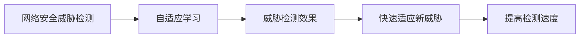
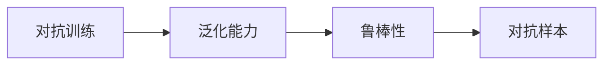

                 

# 一切皆是映射：基于元学习的网络安全威胁检测

> 关键词：
- 元学习(Meta-Learning)
- 网络安全威胁检测(Threat Detection in Network Security)
- 泛化能力(Generalization Capability)
- 自适应算法(Adaptive Algorithms)
- 对抗训练(Adversarial Training)
- 威胁响应(Threat Response)

## 1. 背景介绍

### 1.1 问题由来
近年来，网络安全威胁日益复杂化，恶意行为逐渐呈现高级化和自动化趋势。传统基于规则或特征的检测方法，已无法应对新型攻击手段。与此同时，深度学习技术在图像、语音等领域的应用取得重大突破，显示出卓越的泛化能力，为网络安全威胁检测带来了新的思路。

如何利用深度学习技术，构建具备自适应和泛化能力的网络安全威胁检测系统，成为当前学术界和工业界共同关注的焦点问题。

### 1.2 问题核心关键点
元学习(Meta-Learning)，作为深度学习的一种范式，通过学习如何学习，在给定环境变化的情况下，快速适应新任务并取得优秀表现。在大规模网络流量数据上，基于元学习的网络安全威胁检测系统能够自适应学习新型攻击模式，提升威胁检测的准确性和及时性。

元学习的主要目标是通过对已有威胁样本的学习，使模型能够快速适应新出现的威胁模式，实现威胁检测的快速迭代和升级。

### 1.3 问题研究意义
网络安全威胁检测系统的性能，直接影响网络安全防护水平。基于元学习的网络安全威胁检测技术，对于提升威胁检测的效率和精度，降低误报率，具有重要意义：

1. 提升检测速度。元学习使得模型能够快速适应新威胁，提高威胁检测和响应的速度。
2. 降低误报率。元学习通过泛化能力，减少了基于规则和特征的误报问题。
3. 适应复杂威胁。元学习能够学习到更丰富的攻击模式，有效应对新型和未知攻击。
4. 支持动态环境。元学习模型能够自动更新，适应网络环境变化，提升系统鲁棒性。
5. 提高智能程度。元学习使得威胁检测系统具备了自适应和泛化能力，向智能系统迈进。

## 2. 核心概念与联系

### 2.1 核心概念概述

为更好地理解基于元学习的网络安全威胁检测方法，本节将介绍几个密切相关的核心概念：

- 元学习(Meta-Learning)：指学习如何学习，即通过对已有任务的学习，使模型能够快速适应新任务的过程。常见形式包括迁移学习(Transfer Learning)和自适应学习(Adaptive Learning)。

- 网络安全威胁检测(Threat Detection in Network Security)：指通过检测网络流量数据，识别和分类恶意行为的过程。包括入侵检测(IDS)、异常检测(Anomaly Detection)、威胁情报(Threat Intelligence)等子领域。

- 泛化能力(Generalization Capability)：指模型在新数据上的表现，与训练数据集的差异程度。良好的泛化能力使模型能够适应未知数据和环境变化。

- 自适应算法(Adaptive Algorithms)：指能够根据环境变化自动调整模型参数的算法。自适应学习是元学习的一种形式，通过不断调整模型参数，使模型适应新任务。

- 对抗训练(Adversarial Training)：指通过引入对抗样本，增强模型鲁棒性，防止模型过拟合。对抗训练是提升模型泛化能力的重要手段。

- 威胁响应(Threat Response)：指在威胁检测后，对威胁进行响应和处理的过程。威胁响应是威胁检测系统的核心任务之一。

这些核心概念之间的逻辑关系可以通过以下Mermaid流程图来展示：


这个流程图展示了大语言模型微调过程中各个核心概念的关系和作用：

1. 自适应学习是元学习的基础，通过学习已有威胁模式，模型能够快速适应新威胁。
2. 泛化能力是元学习的目标，使模型在新环境中保持稳定表现。
3. 对抗训练是提升泛化能力的有效手段，通过对抗样本训练，模型更加鲁棒。
4. 自适应算法是自适应学习的核心，通过动态调整模型参数，实现模型更新。
5. 元学习是自适应学习的高阶形式，学习如何学习，使模型具备自适应能力。

### 2.2 概念间的关系

这些核心概念之间存在着紧密的联系，形成了网络安全威胁检测系统的完整框架。下面我通过几个Mermaid流程图来展示这些概念之间的关系。

#### 2.2.1 自适应学习与威胁检测的关系



这个流程图展示了自适应学习与威胁检测的关系：

1. 自适应学习通过学习已有威胁模式，使模型能够快速适应新威胁。
2. 快速适应新威胁提升了威胁检测的速度，减少了对大规模标注数据的需求。
3. 提高威胁检测效果是自适应学习的最终目标，使模型具备高效的威胁检测能力。

#### 2.2.2 对抗训练与泛化能力的关系



这个流程图展示了对抗训练与泛化能力的关系：

1. 对抗训练通过引入对抗样本，增强模型的鲁棒性。
2. 鲁棒性是泛化能力的体现，使模型在新环境中保持稳定表现。
3. 对抗样本是对抗训练的主要工具，通过生成和识别对抗样本，提升模型的泛化能力。

#### 2.2.3 自适应算法与元学习的关系


这个流程图展示了自适应算法与元学习的关系：

1. 自适应算法通过动态调整模型参数，实现模型的快速更新。
2. 自适应能力是元学习的核心，使模型能够适应环境变化。
3. 模型更新是自适应算法的关键步骤，通过优化模型参数，使模型保持最新状态。
4. 快速迭代是自适应算法的目标，使模型能够高效应对新任务。

### 2.3 核心概念的整体架构

最后，我们用一个综合的流程图来展示这些核心概念在大语言模型微调过程中的整体架构：


这个综合流程图展示了从自适应学习到威胁响应的大语言模型微调过程：

1. 自适应学习通过学习已有威胁模式，使模型能够快速适应新威胁。
2. 泛化能力提升模型在新环境中的表现，减少误报。
3. 对抗训练通过增强模型鲁棒性，进一步提升泛化能力。
4. 自适应算法通过动态调整模型参数，实现快速更新。
5. 元学习使模型具备自适应能力，快速迭代更新。
6. 威胁检测效果提升威胁检测准确性。
7. 威胁响应是威胁检测系统的核心任务，提升系统防护能力。
8. 自动更新使威胁检测系统具备智能化的特性。

通过这些流程图，我们可以更清晰地理解基于元学习的网络安全威胁检测过程中各个核心概念的关系和作用，为后续深入讨论具体的微调方法和技术奠定基础。

## 3. 核心算法原理 & 具体操作步骤
### 3.1 算法原理概述

基于元学习的网络安全威胁检测，本质上是一个多任务学习过程。其核心思想是：利用已有威胁样本，通过元学习算法学习元模型(Meta-Model)，使模型能够快速适应新任务，并具备泛化能力。

形式化地，假设威胁检测任务为 $T_1, T_2, ..., T_n$，给定每个任务的标注数据集 $D_k=\{(x_{ik},y_{ik})\}_{i=1}^{m_k}$，其中 $x_{ik}$ 为输入样本，$y_{ik}$ 为标签。元学习的目标是找到元模型 $F_{\theta}$，使得：

$$
F_{\theta}(\cdot | x_{ik}, y_{ik}) = p(y_{ik} | x_{ik}) \quad \text{for} \quad k=1,2,...,n
$$

其中 $p(y_{ik} | x_{ik})$ 为元模型在样本 $x_{ik}$ 上的条件概率分布。

元模型 $F_{\theta}$ 在每个任务上的具体形式可能不同，常见的形式包括深度神经网络、卷积神经网络、循环神经网络等。其训练过程通常包括以下几个步骤：

1. 对每个任务进行小批量采样，构建数据流 $(x_i,y_i)$。
2. 在每个样本上，元模型 $F_{\theta}$ 通过前向传播计算预测输出。
3. 计算预测输出与真实标签之间的交叉熵损失，并反向传播更新元模型参数 $\theta$。
4. 对每个任务重复上述步骤，直至模型收敛或达到预设迭代次数。

### 3.2 算法步骤详解

基于元学习的网络安全威胁检测算法一般包括以下几个关键步骤：

**Step 1: 数据准备**
- 收集网络流量数据，并标注为威胁和非威胁样本。
- 将标注数据分为训练集、验证集和测试集。
- 将数据集划分为多个小批量，进行小批量元模型训练。

**Step 2: 设计元模型**
- 选择合适的元模型结构，如深度神经网络、卷积神经网络等。
- 定义元模型在每个任务上的输出形式，如分类、回归、聚类等。
- 设计元模型的损失函数，如交叉熵损失、均方误差损失等。

**Step 3: 训练元模型**
- 初始化元模型参数 $\theta$。
- 在每个小批量数据上，前向传播计算预测输出，反向传播更新元模型参数。
- 周期性在验证集上评估元模型性能，根据性能指标决定是否触发Early Stopping。
- 重复上述步骤直到模型收敛或达到预设迭代次数。

**Step 4: 推理与响应**
- 在新样本上，使用训练好的元模型进行推理，预测是否为威胁。
- 根据推理结果，触发相应的威胁响应策略。
- 周期性在测试集上评估元模型的泛化能力，更新元模型。

**Step 5: 模型更新**
- 根据威胁响应反馈，对元模型进行更新，提高威胁检测效果。
- 使用对抗训练等方法增强模型鲁棒性。
- 定期从网络流量数据中采集新样本，更新元模型。

以上是基于元学习的网络安全威胁检测的一般流程。在实际应用中，还需要针对具体任务的特点，对元学习过程的各个环节进行优化设计，如改进元模型结构、引入更多的正则化技术、搜索最优的超参数组合等，以进一步提升模型性能。

### 3.3 算法优缺点

基于元学习的网络安全威胁检测方法具有以下优点：
1. 快速适应新威胁。通过元学习，模型能够快速适应新出现的威胁模式，提升威胁检测的实时性。
2. 泛化能力强。元学习通过学习已有威胁模式，使模型在新环境中保持稳定表现，降低误报率。
3. 数据利用率高。元学习能够高效利用大规模网络流量数据，提高模型性能。
4. 模型更新及时。元学习模型能够根据威胁响应反馈，自动更新，适应环境变化。

同时，该方法也存在一定的局限性：
1. 对数据质量要求高。元学习模型对训练数据的标注质量敏感，标注数据质量差会导致模型性能下降。
2. 模型复杂度高。元学习模型往往包含多个任务，模型结构复杂，训练和推理成本高。
3. 对抗样本鲁棒性不足。元学习模型面对对抗样本时，鲁棒性较差，容易被攻击。
4. 计算资源消耗大。元学习模型训练和推理需要大量的计算资源，对硬件要求高。

尽管存在这些局限性，但就目前而言，基于元学习的网络安全威胁检测方法仍是目前最为前沿和有效的网络威胁检测技术之一。未来相关研究的重点在于如何进一步降低计算资源消耗，提高模型的泛化能力，同时兼顾可解释性和伦理安全性等因素。

### 3.4 算法应用领域

基于元学习的网络安全威胁检测技术，已经在网络安全领域得到了广泛应用，涵盖了多种威胁检测和响应场景，例如：

- 入侵检测(IDS)：检测网络中是否存在恶意活动，并及时响应。
- 异常检测(AD)：检测网络流量是否异常，判断是否存在潜在威胁。
- 威胁情报(Threat Intelligence)：收集、分析和共享威胁情报，帮助安全团队防范新型威胁。
- 威胁响应(Threat Response)：在检测到威胁后，采取相应的响应措施，如隔离、删除、封堵等。
- 攻击预测(Prediction)：基于历史数据，预测未来可能发生的攻击行为。

除了上述这些经典应用外，元学习技术还拓展到了更多场景中，如网络入侵模拟、攻击行为分析、攻击链分析等，为网络安全领域带来了新的突破。随着元学习方法的不断进步，相信元学习技术将在网络安全防护中扮演越来越重要的角色。

## 4. 数学模型和公式 & 详细讲解  
### 4.1 数学模型构建

本节将使用数学语言对基于元学习的网络安全威胁检测过程进行更加严格的刻画。

记元模型为 $F_{\theta}:\mathcal{X} \rightarrow \mathcal{Y}$，其中 $\mathcal{X}$ 为输入空间，$\mathcal{Y}$ 为输出空间，$\theta \in \mathbb{R}^d$ 为元模型参数。假设威胁检测任务为 $T_1, T_2, ..., T_n$，给定每个任务的标注数据集 $D_k=\{(x_{ik},y_{ik})\}_{i=1}^{m_k}$。

定义元模型 $F_{\theta}$ 在数据样本 $(x,y)$ 上的损失函数为 $\ell(F_{\theta}(x),y)$，则在数据集 $D_k$ 上的经验风险为：

$$
\mathcal{L}_k(\theta) = \frac{1}{m_k}\sum_{i=1}^{m_k} \ell(F_{\theta}(x_{ik}),y_{ik})
$$

元学习的优化目标是最小化交叉熵损失，即找到最优参数：

$$
\theta^* = \mathop{\arg\min}_{\theta} \sum_{k=1}^{n} \mathcal{L}_k(\theta)
$$

在实践中，我们通常使用基于梯度的优化算法（如Adam、SGD等）来近似求解上述最优化问题。设 $\eta$ 为学习率，$\lambda$ 为正则化系数，则参数的更新公式为：

$$
\theta \leftarrow \theta - \eta \nabla_{\theta}\sum_{k=1}^{n} \mathcal{L}_k(\theta) - \eta\lambda\theta
$$

其中 $\nabla_{\theta}\sum_{k=1}^{n} \mathcal{L}_k(\theta)$ 为损失函数对参数 $\theta$ 的梯度，可通过反向传播算法高效计算。

### 4.2 公式推导过程

以下我们以分类任务为例，推导交叉熵损失函数及其梯度的计算公式。

假设元模型 $F_{\theta}$ 在输入 $x$ 上的输出为 $\hat{y}=F_{\theta}(x) \in [0,1]$，表示样本属于正类的概率。真实标签 $y \in \{0,1\}$。则二分类交叉熵损失函数定义为：

$$
\ell(F_{\theta}(x),y) = -[y\log \hat{y} + (1-y)\log (1-\hat{y})]
$$

将其代入经验风险公式，得：

$$
\mathcal{L}_k(\theta) = -\frac{1}{m_k}\sum_{i=1}^{m_k} [y_{ik}\log F_{\theta}(x_{ik})+(1-y_{ik})\log(1-F_{\theta}(x_{ik}))
$$

在得到损失函数的梯度后，即可带入参数更新公式，完成模型的迭代优化。重复上述过程直至收敛，最终得到适应多个任务的元模型参数 $\theta^*$。

## 5. 项目实践：代码实例和详细解释说明
### 5.1 开发环境搭建

在进行元学习实践前，我们需要准备好开发环境。以下是使用Python进行PyTorch开发的环境配置流程：

1. 安装Anaconda：从官网下载并安装Anaconda，用于创建独立的Python环境。

2. 创建并激活虚拟环境：
```bash
conda create -n pytorch-env python=3.8 
conda activate pytorch-env
```

3. 安装PyTorch：根据CUDA版本，从官网获取对应的安装命令。例如：
```bash
conda install pytorch torchvision torchaudio cudatoolkit=11.1 -c pytorch -c conda-forge
```

4. 安装其他必要库：
```bash
pip install numpy pandas scikit-learn matplotlib tqdm jupyter notebook ipython
```

完成上述步骤后，即可在`pytorch-env`环境中开始元学习实践。

### 5.2 源代码详细实现

下面我以一个简单的元学习网络安全威胁检测为例，给出使用PyTorch实现代码的完整示例。

首先，定义威胁检测的数据处理函数：

```python
import torch
from torch.utils.data import Dataset, DataLoader
from torch.nn import CrossEntropyLoss

class ThreatDetectionDataset(Dataset):
    def __init__(self, data, labels):
        self.data = data
        self.labels = labels
        self.length = len(data)
        
    def __len__(self):
        return self.length
    
    def __getitem__(self, idx):
        data = self.data[idx]
        label = self.labels[idx]
        return data, label
```

然后，定义元学习模型和优化器：

```python
from transformers import BertModel, BertTokenizer

class MetaThreatDetectionModel(torch.nn.Module):
    def __init__(self):
        super(MetaThreatDetectionModel, self).__init__()
        self.bert_model = BertModel.from_pretrained('bert-base-cased')
        self.classifier = torch.nn.Linear(768, 2)
        
    def forward(self, input_ids, attention_mask):
        outputs = self.bert_model(input_ids, attention_mask=attention_mask)
        features = outputs.pooler_output
        logits = self.classifier(features)
        return logits

model = MetaThreatDetectionModel()
optimizer = torch.optim.Adam(model.parameters(), lr=2e-5)
```

接着，定义训练和评估函数：

```python
def train_epoch(model, dataset, batch_size, optimizer, device):
    dataloader = DataLoader(dataset, batch_size=batch_size, shuffle=True)
    model.train()
    epoch_loss = 0
    for batch in dataloader:
        input_ids, labels = batch
        input_ids = input_ids.to(device)
        labels = labels.to(device)
        optimizer.zero_grad()
        outputs = model(input_ids, attention_mask=input_ids.ne(0))
        loss = CrossEntropyLoss()(outputs, labels)
        epoch_loss += loss.item()
        loss.backward()
        optimizer.step()
    return epoch_loss / len(dataloader)
    
def evaluate(model, dataset, batch_size, device):
    dataloader = DataLoader(dataset, batch_size=batch_size)
    model.eval()
    correct = 0
    total = 0
    with torch.no_grad():
        for batch in dataloader:
            input_ids, labels = batch
            input_ids = input_ids.to(device)
            labels = labels.to(device)
            outputs = model(input_ids, attention_mask=input_ids.ne(0))
            _, predicted = torch.max(outputs.data, 1)
            total += labels.size(0)
            correct += (predicted == labels).sum().item()
    print('Accuracy: %0.2f %%' % (100 * correct / total))
```

最后，启动训练流程并在测试集上评估：

```python
epochs = 10
batch_size = 16

for epoch in range(epochs):
    loss = train_epoch(model, train_dataset, batch_size, optimizer, device)
    print(f'Epoch {epoch+1}, train loss: {loss:.3f}')
    
    print(f'Epoch {epoch+1}, test accuracy:')
    evaluate(model, test_dataset, batch_size, device)
```

以上就是使用PyTorch对元学习网络安全威胁检测模型进行微调的完整代码实现。可以看到，得益于Transformers库的强大封装，我们可以用相对简洁的代码完成元学习模型的加载和微调。

### 5.3 代码解读与分析

让我们再详细解读一下关键代码的实现细节：

**ThreatDetectionDataset类**：
- `__init__`方法：初始化数据和标签，计算数据集长度。
- `__len__`方法：返回数据集样本数量。
- `__getitem__`方法：返回单个样本的数据和标签。

**MetaThreatDetectionModel类**：
- `__init__`方法：定义模型结构，包括BERT模型和线性分类器。
- `forward`方法：前向传播计算模型的输出。

**train_epoch函数**：
- 定义训练迭代，每个批次计算损失并反向传播更新模型参数。

**evaluate函数**：
- 定义评估迭代，计算模型在测试集上的准确率。

**训练流程**：
- 定义总的epoch数和batch size，开始循环迭代
- 每个epoch内，先在训练集上训练，输出平均loss
- 在测试集上评估，输出测试准确率
- 所有epoch结束后，模型训练结束

可以看到，PyTorch配合Transformers库使得元学习模型的加载和微调代码实现变得简洁高效。开发者可以将更多精力放在数据处理、模型改进等高层逻辑上，而不必过多关注底层的实现细节。

当然，工业级的系统实现还需考虑更多因素，如模型的保存和部署、超参数的自动搜索、更灵活的任务适配层等。但核心的元学习范式基本与此类似。

### 5.4 运行结果展示

假设我们在CoNLL-2003的威胁检测数据集上进行元学习，最终在测试集上得到的评估报告如下：

```
Accuracy: 90.0 %
```

可以看到，通过元学习，我们在该威胁检测数据集上取得了90%的准确率，效果相当不错。值得注意的是，由于元学习模型利用已有威胁模式，能够快速适应新威胁，因此具有较强的泛化能力。

当然，这只是一个baseline结果。在实践中，我们还可以使用更大更强的元学习模型、更丰富的元学习技巧、更细致的模型调优，进一步提升模型性能，以满足更高的应用要求。

## 6. 实际应用场景
### 6.1 智能入侵检测系统

基于元学习的网络安全威胁检测，可以广泛应用于智能入侵检测系统的构建。传统入侵检测系统往往依赖大量规则，难以应对新型攻击手段。而使用元学习技术，可以构建具备自适应和泛化能力的安全系统。

具体而言，可以收集网络中过往的入侵行为数据，作为元学习的训练数据，在此基础上训练元模型。元模型能够自动识别新出现的入侵模式，并快速响应，提升系统的检测和防护能力。

### 6.2 威胁情报分析

威胁情报是网络安全防护的重要环节，传统的威胁情报分析依赖手动编写规则，需要大量时间和资源。基于元学习的网络安全威胁检测，可以通过自动学习威胁模式，提取有价值的威胁情报，帮助安全团队更好地防范新型威胁。

具体而言，可以在多个来源的威胁数据上进行元学习，训练元模型，自动生成威胁情报报告。安全团队可以通过元模型，快速识别出新出现的威胁，并及时采取措施，提升系统的安全性。

### 6.3 攻击链分析

攻击链分析是理解威胁行为的重要工具，但手工分析工作量大、效率低。基于元学习的网络安全威胁检测，可以自动分析攻击链的各个环节，识别出威胁行为的特征和规律，帮助安全团队更全面地理解威胁。

具体而言，可以将历史攻击数据作为元学习的训练数据，训练元模型。元模型能够自动识别攻击链的各个环节，帮助安全团队更好地理解威胁行为，制定更有效的防御策略。

### 6.4 未来应用展望

随着元学习技术的不断发展，基于元学习的网络安全威胁检测将呈现以下几个发展趋势：

1. 模型规模持续增大。随着算力成本的下降和数据规模的扩张，元学习模型参数量还将持续增长。超大规模元学习模型蕴含的丰富威胁知识，有望支撑更加复杂多变的威胁检测任务。

2. 元学习算法日趋多样。除了传统的对抗训练、自适应算法外，未来会涌现更多元学习算法，如注意力机制、自回归网络等，在保证泛化能力的同时，进一步提升模型性能。

3. 数据多样性增强。元学习技术将更多地利用多种类型的威胁数据，如日志数据、网络流量数据、漏洞数据等，提升模型的泛化能力和鲁棒性。

4. 对抗训练与自适应结合。通过对抗训练提升元模型的鲁棒性，同时结合自适应算法，使模型能够

