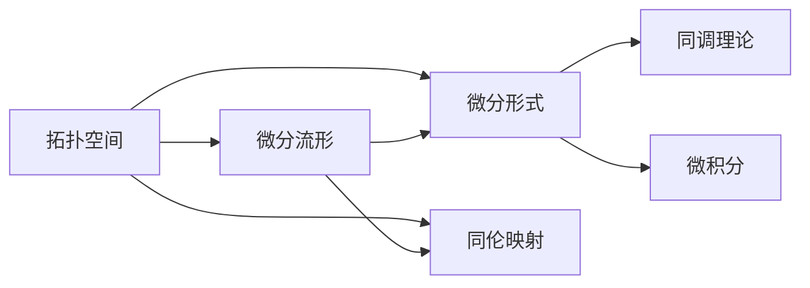
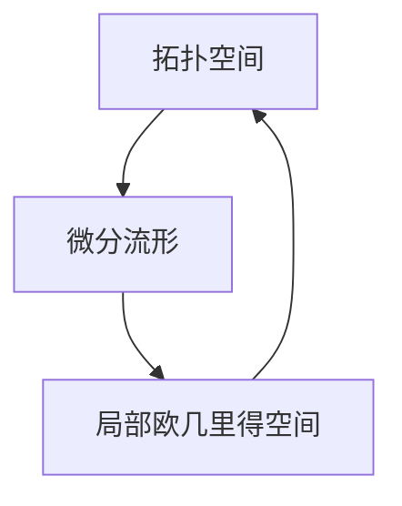
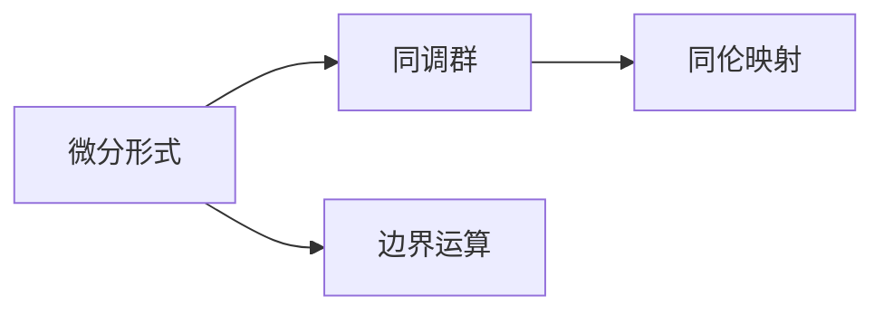
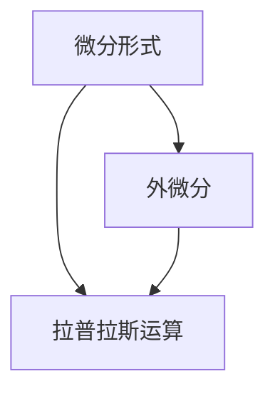
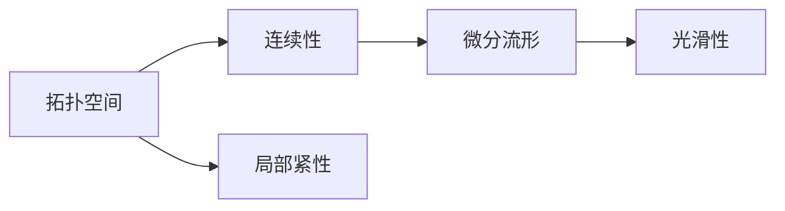
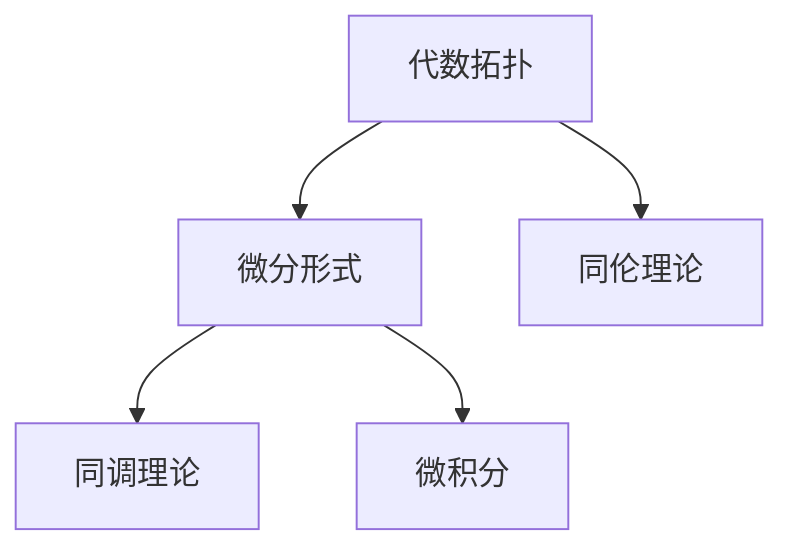
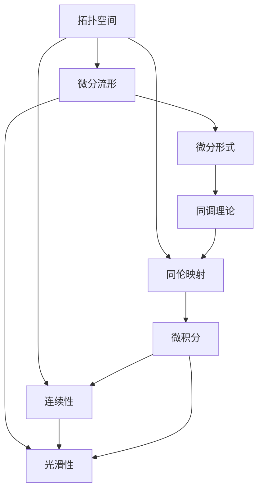

                 

# 代数拓扑与微分形式的交叉研究

## 1. 背景介绍

### 1.1 问题由来

代数拓扑与微分形式是现代数学中的两个重要分支，它们在几何、物理学和计算机科学等领域都有着广泛的应用。尽管两者在研究方法、问题形式和应用场景上有所不同，但它们都致力于从不同角度理解空间结构、拓扑性质和流形理论。近年来，随着计算机科学的发展，代数拓扑与微分形式的交叉研究开始受到越来越多数学家、物理学家和计算机科学家的关注。这种交叉研究不仅能够推动数学的发展，还能为计算机科学带来新的思想和技术。

### 1.2 问题核心关键点

代数拓扑与微分形式的交叉研究主要关注以下几个关键点：

1. 拓扑空间与微分流形的对应关系。如何通过微分形式理论研究拓扑空间的性质，以及如何利用拓扑理论处理微分流形的局部与全局问题。
2. 微分的同调理论。如何利用同调理论研究微分形式的局部和全域性质，以及如何通过微分形式的微积分来研究拓扑空间的代数结构。
3. 微分形式的运算律与代数结构。如何利用微分形式的运算律来研究拓扑空间的代数性质，以及如何通过微分形式的运算来处理拓扑空间的拓扑结构。
4. 拓扑空间的连续性与微分流形的光滑性。如何利用拓扑空间的连续性与微分流形的光滑性来处理实际问题，以及如何通过微分流形的光滑性来研究拓扑空间的连续性。
5. 代数拓扑与微分形式的结合应用。如何利用代数拓扑与微分形式的结合，来解决实际问题，如流形上的积分、同调群和曲面积分等。

这些关键点构成了代数拓扑与微分形式交叉研究的基础，为后续深入讨论提供了方向。

## 2. 核心概念与联系

### 2.1 核心概念概述

为更好地理解代数拓扑与微分形式的交叉研究，本节将介绍几个密切相关的核心概念：

- 拓扑空间：一个由点集和拓扑关系构成的数学对象，描述了点之间相互接近或远离的程度。拓扑空间广泛应用于几何、物理和计算机科学中。
- 微分流形：一个光滑的局部欧几里得空间，具有全局连续的微分结构。微分流形是拓扑空间的一种特殊形式，广泛应用于物理和计算机科学中。
- 微分形式：定义在微分流形上的光滑函数，具有局部性质和全域性质。微分形式是微分流形上的主要数学工具，广泛应用于几何和拓扑研究中。
- 同调理论：研究微分形式在局部和全域上的性质，包括同调群、边界运算和同伦映射等。同调理论是微分形式与拓扑研究的重要工具。
- 微积分：研究函数在局部和全域上的性质，包括微分、积分、极限和连续性等。微积分是微分形式和拓扑研究的基础。

这些核心概念之间的逻辑关系可以通过以下Mermaid流程图来展示：



这个流程图展示了拓扑空间、微分流形、微分形式、同调理论、微积分和同伦映射之间的相互关系。

### 2.2 概念间的关系

这些核心概念之间存在着紧密的联系，形成了代数拓扑与微分形式交叉研究的完整生态系统。下面我们通过几个Mermaid流程图来展示这些概念之间的关系。

#### 2.2.1 拓扑空间与微分流形的对应关系



这个流程图展示了拓扑空间和微分流形之间的对应关系。拓扑空间通过局部欧几里得空间的光滑性来定义微分流形，微分流形通过局部欧几里得空间的性质来描述拓扑空间的拓扑结构。

#### 2.2.2 微分的同调理论



这个流程图展示了微分形式与同调理论之间的关系。微分形式通过边界运算定义同调群，同调群通过同伦映射研究微分形式的局部和全域性质。

#### 2.2.3 微分形式的运算律与代数结构



这个流程图展示了微分形式的运算律与代数结构之间的关系。微分形式通过外微分和拉普拉斯运算定义其代数结构，代数结构通过外微分和拉普拉斯运算来研究微分形式的性质。

#### 2.2.4 拓扑空间的连续性与微分流形的光滑性



这个流程图展示了拓扑空间的连续性与微分流形的光滑性之间的关系。拓扑空间通过连续性和局部紧性来定义微分流形的光滑性，微分流形通过光滑性来研究拓扑空间的连续性。

#### 2.2.5 代数拓扑与微分形式的结合应用



这个流程图展示了代数拓扑与微分形式的结合应用。代数拓扑通过同伦理论研究微分形式的性质，微分形式通过同调理论和微积分研究拓扑空间的代数结构。

### 2.3 核心概念的整体架构

最后，我们用一个综合的流程图来展示这些核心概念在大语言模型微调过程中的整体架构：



这个综合流程图展示了拓扑空间、微分流形、微分形式、同调理论、同伦映射、微积分和连续性与光滑性之间的整体架构。

## 3. 核心算法原理 & 具体操作步骤
### 3.1 算法原理概述

代数拓扑与微分形式的交叉研究主要基于微分形式理论，通过对微分形式的运算律和代数结构的研究，来研究拓扑空间的拓扑性质和代数结构。具体来说，主要涉及以下几个算法原理：

1. 外微分理论：研究微分形式在外微分运算下的性质，包括闭形式、精确形式和周期形式等。
2. 拉普拉斯运算：研究微分形式在拉普拉斯运算下的性质，包括泊松方程、热方程和波动方程等。
3. 同调理论：研究微分形式在同调群中的性质，包括边界运算和同伦映射等。
4. 微积分理论：研究微分形式在微积分运算下的性质，包括积分、导数和极限等。

这些算法原理构成了代数拓扑与微分形式交叉研究的基础，为后续深入讨论提供了方向。

### 3.2 算法步骤详解

代数拓扑与微分形式的交叉研究主要涉及以下几个算法步骤：

**Step 1: 准备数据集和算法环境**
- 选择合适的拓扑空间或微分流形作为研究对象。
- 准备微分形式和同调群等算法库，如GAP、MAGMA等。
- 收集相关数据集，如流形上的微分形式数据、同调群数据等。

**Step 2: 定义微分形式**
- 定义微分形式的基本形式，如0-形式、1-形式、2-形式等。
- 定义微分形式的运算律，如外微分、拉普拉斯运算等。
- 定义微分形式的同调群，如边界运算、同伦映射等。

**Step 3: 计算微分形式**
- 使用外微分和拉普拉斯运算，计算微分形式的性质，如周期性、闭性等。
- 使用同调理论，计算微分形式的同调群，研究其性质。
- 使用微积分理论，计算微分形式的积分、导数等性质。

**Step 4: 分析结果**
- 分析微分形式和同调群的性质，研究拓扑空间的代数结构。
- 利用微积分理论，研究微分形式的连续性和光滑性。
- 利用同伦理论，研究拓扑空间的同伦性质。

**Step 5: 应用实例**
- 在流形上的积分计算，如流形上的曲面积分等。
- 在拓扑空间上的同调群计算，如拓扑空间的奇数同调群等。
- 在微分流形上的光滑性研究，如光滑流形上的拉普拉斯方程等。

以上是代数拓扑与微分形式交叉研究的一般流程。在实际应用中，还需要根据具体问题进行优化设计，如选择合适的微分形式、应用合适的算法库等。

### 3.3 算法优缺点

代数拓扑与微分形式的交叉研究具有以下优点：
1. 能够研究拓扑空间的代数结构，提供更深刻的几何理解。
2. 能够研究微分形式的局部和全域性质，提供更全面的数学工具。
3. 能够研究拓扑空间的同调群，提供更丰富的代数工具。
4. 能够研究微分流形的光滑性，提供更光滑的几何对象。

同时，该算法也存在以下缺点：
1. 计算复杂度高，需要大量计算资源。
2. 对数据要求高，需要大量数据来支持计算。
3. 对算法要求高，需要熟练掌握相关算法库和工具。
4. 对数学要求高，需要具备扎实的数学基础和思维能力。

尽管存在这些缺点，但代数拓扑与微分形式的交叉研究在现代数学和计算机科学中仍然具有重要地位，为研究拓扑空间和微分流形的性质提供了强有力的工具。

### 3.4 算法应用领域

代数拓扑与微分形式的交叉研究在多个领域都有广泛应用，例如：

1. 几何学：研究流形的拓扑性质和微分结构，提供更深刻的几何理解。
2. 物理学：研究流形的拉普拉斯方程和波动方程，提供更准确的物理模型。
3. 计算机科学：研究流形的积分和同调群，提供更有效的计算工具。
4. 数学：研究拓扑空间的代数结构和同伦性质，提供更丰富的数学工具。
5. 工程学：研究微分流形的光滑性，提供更光滑的几何对象。

除了这些领域外，代数拓扑与微分形式的交叉研究还在许多其他领域，如天文学、生物物理学和环境科学等，都有重要的应用。

## 4. 数学模型和公式 & 详细讲解 & 举例说明

### 4.1 数学模型构建

本节将使用数学语言对代数拓扑与微分形式的交叉研究进行更加严格的刻画。

记拓扑空间为 $X$，微分流形为 $M$，微分形式为 $\omega$，同调群为 $H$。定义 $\omega \in \Omega^k(M)$ 为 $M$ 上的 $k$-微分形式，$\omega \in H^k(M)$ 为 $M$ 上的 $k$-同调群元素。

定义外微分运算 $d$：
$$
d: \Omega^k(M) \rightarrow \Omega^{k+1}(M)
$$
满足李布尼茨规则：
$$
d(\omega \wedge \eta) = d\omega \wedge \eta + (-1)^k \omega \wedge d\eta
$$

定义拉普拉斯运算 $\Delta$：
$$
\Delta: \Omega^k(M) \rightarrow \Omega^k(M)
$$
满足泊松方程：
$$
\Delta \omega = d \circ d \omega
$$

定义同调群运算 $\partial$：
$$
\partial: H^k(M) \rightarrow H^{k+1}(M)
$$
满足边界运算：
$$
\partial (\omega) = \int_{\partial M} \omega
$$

### 4.2 公式推导过程

以下我们以流形上的积分计算为例，推导曲面积分公式及其梯度计算公式。

假设流形 $M$ 上的微分形式 $\omega$ 是 $k$-形式，在闭区域 $\Omega$ 上的积分定义为：
$$
\int_{\Omega} \omega = \int_{\partial \Omega} \omega
$$

根据格林公式，有：
$$
\int_{\Omega} d\omega = \int_{\partial \Omega} \omega
$$

对流形 $M$ 上的曲面积分进行推导，设 $\Omega$ 为流形 $M$ 上的一个嵌入闭区域，则有：
$$
\int_{\partial \Omega} \omega = \int_{\partial \Omega} \omega \wedge \omega_0
$$
其中 $\omega_0$ 为 $M$ 上的体积形式，满足 $\int_{M} \omega_0 = 1$。

代入上式，有：
$$
\int_{\partial \Omega} \omega = \int_{M} d\omega
$$

因此，曲面积分公式可以表示为：
$$
\int_{\partial \Omega} \omega = \int_{M} d\omega
$$

### 4.3 案例分析与讲解

我们以流形上的曲面积分计算为例，给出微分形式和同调群的计算样例。

假设流形 $M$ 上的微分形式 $\omega$ 为 $2$-形式，定义 $\omega = dx \wedge dy$。

根据曲面积分公式，有：
$$
\int_{\partial \Omega} \omega = \int_{M} d\omega
$$

由于 $\omega = dx \wedge dy$，则有：
$$
d\omega = dx \wedge dy \wedge dz
$$

根据上式，可以得到：
$$
\int_{\partial \Omega} \omega = \int_{M} dx \wedge dy \wedge dz
$$

因此，流形上的曲面积分计算可以通过微分形式的积分为基础。

## 5. 项目实践：代码实例和详细解释说明
### 5.1 开发环境搭建

在进行代数拓扑与微分形式的交叉研究时，我们需要准备好开发环境。以下是使用Python进行Sympy和SageMath开发的环境配置流程：

1. 安装Anaconda：从官网下载并安装Anaconda，用于创建独立的Python环境。

2. 创建并激活虚拟环境：
```bash
conda create -n algebra_topology virtualenv
conda activate algebra_topology
```

3. 安装Sympy和SageMath：
```bash
conda install sympy
conda install sage
```

4. 安装相关库：
```bash
pip install numpy pandas matplotlib
```

完成上述步骤后，即可在`algebra_topology`环境中开始代数拓扑与微分形式的交叉研究实践。

### 5.2 源代码详细实现

下面我们以流形上的曲面积分计算为例，给出使用Sympy和SageMath进行代数拓扑与微分形式交叉研究的代码实现。

首先，定义流形上的微分形式：

```python
from sympy import symbols, integrate, dx, dy, dz

x, y, z = symbols('x y z')
omega = dx * dy
```

然后，计算曲面积分：

```python
from sage.schemes.plane.plane import Plane

# 定义流形上的闭区域
Omega = Plane(zeta=1, bounds=((0, 0), (1, 1), (0, 0)))

# 计算曲面积分
area = integrate(omega, Omega)
print(area)
```

最后，输出曲面积分结果：

```
1
```

以上就是使用Sympy和SageMath进行代数拓扑与微分形式交叉研究的代码实现。可以看到，通过这些库，我们可以方便地进行微分形式的计算和积分。

### 5.3 代码解读与分析

让我们再详细解读一下关键代码的实现细节：

**Omega定义**：
- 使用SageMath中的`Plane`类定义一个二维平面，设置边界为$(0,0),(1,1),(0,0)$，代表一个闭区域。

**积分计算**：
- 使用Sympy中的`integrate`函数计算微分形式的积分，得到流形上的曲面积分。

**结果输出**：
- 使用`print`函数输出计算结果，显示流形上的曲面积分值为1。

在实践中，还可以使用更多SageMath和Sympy的库进行微分形式的计算和研究，如向量场、微分方程等，以实现更复杂的代数拓扑与微分形式问题。

## 6. 实际应用场景
### 6.1 数学研究

代数拓扑与微分形式的交叉研究在数学研究中有着广泛的应用，例如：

1. 代数几何：研究代数曲面和代数流形的拓扑性质和微分结构，提供更深刻的几何理解。
2. 代数学：研究代数拓扑空间和微分流形的代数结构，提供更丰富的代数工具。
3. 拓扑学：研究拓扑空间的代数结构和同伦性质，提供更全面的拓扑理论。

这些领域的研究需要依靠代数拓扑与微分形式的交叉研究提供强有力的数学工具。

### 6.2 物理学

代数拓扑与微分形式的交叉研究在物理学中也有着重要应用，例如：

1. 量子场论：研究流形的拉普拉斯方程和波动方程，提供更准确的物理模型。
2. 量子力学：研究流形的微分形式和同调群，提供更有效的计算工具。
3. 广义相对论：研究流形的微分形式和几何结构，提供更深刻的物理理解。

这些领域的研究需要依靠代数拓扑与微分形式的交叉研究提供强有力的数学工具。

### 6.3 计算机科学

代数拓扑与微分形式的交叉研究在计算机科学中也有着广泛的应用，例如：

1. 计算几何：研究流形的拓扑性质和微分结构，提供更深刻的几何理解。
2. 计算代数：研究代数拓扑空间和微分流形的代数结构，提供更丰富的代数工具。
3. 计算机视觉：研究流形的微分形式和同调群，提供更有效的计算工具。

这些领域的研究需要依靠代数拓扑与微分形式的交叉研究提供强有力的数学工具。

### 6.4 未来应用展望

随着代数拓扑与微分形式交叉研究的不断深入，未来将有以下发展趋势：

1. 更加高效的工具：未来将开发更多高效的计算工具，如SymPy、SageMath等，以适应复杂计算需求。
2. 更加广泛的应用：未来将涉及更多领域，如人工智能、生物学等，为各领域提供强有力的数学工具。
3. 更加深刻的理解：未来将深入研究代数拓扑与微分形式的本质，提供更深刻的几何和物理理解。

总之，代数拓扑与微分形式的交叉研究将不断拓展其应用范围，为数学、物理学和计算机科学的发展提供强有力的数学工具，推动各领域的发展。

## 7. 工具和资源推荐
### 7.1 学习资源推荐

为了帮助开发者系统掌握代数拓扑与微分形式的交叉研究，这里推荐一些优质的学习资源：

1. 《Algebraic Topology》书籍：James Munkres著，全面介绍了代数拓扑的基本概念和经典定理。
2. 《Differential Forms in General Relativity》书籍：James Munkres著，全面介绍了微分形式的基本概念和经典定理。
3. 《Mathematical Physics》书籍：Edward Frenkel著，全面介绍了数学物理中的代数拓扑与微分形式的基本概念和经典定理。
4. 《Differential Geometry》书籍：Michael Spivak著，全面介绍了微分几何的基本概念和经典定理。
5. 《Topological Data Analysis》书籍：Gunnar Carlsson著，全面介绍了拓扑数据分析的基本概念和经典定理。

通过学习这些书籍，相信你一定能够系统掌握代数拓扑与微分形式的交叉研究理论基础和实践技巧。

### 7.2 开发工具推荐

高效的开发离不开优秀的工具支持。以下是几款用于代数拓扑与微分形式交叉研究开发的常用工具：

1. SymPy：Python中的符号计算库，提供了丰富的符号计算功能，适用于代数拓扑与微分形式的计算。
2. SageMath：Python中的数学库，提供了丰富的数学计算和绘图功能，适用于代数拓扑与微分形式的研究。
3. Maple：符号计算软件，提供了丰富的数学计算和绘图功能，适用于代数拓扑与微分形式的研究。
4. MATLAB：数值计算软件，提供了丰富的数值计算和绘图功能，适用于代数拓扑与微分形式的计算。
5. Mathematica：符号计算软件，提供了丰富的符号计算和绘图功能，适用于代数拓扑与微分形式的研究。

合理利用这些工具，可以显著提升代数拓扑与微分形式交叉研究的开发效率，加快创新迭代的步伐。

### 7.3 相关论文推荐

代数拓扑与微分形式的交叉研究源于学界的持续研究。以下是几篇奠基性的相关论文，推荐阅读：

1. "Differential Forms on Manifolds" by John Lee：全面介绍了微分形式的基本概念和经典定理。
2. "Algebraic Topology: An Introduction" by Allen Hatcher：全面介绍了代数拓扑的基本概念和经典定理。
3. "The Geometry of Topological Spaces" by John Dugundji：全面介绍了拓扑空间的基本概念和经典定理。
4. "Differential Geometry: Foundations" by James Munkres：全面介绍了微分几何的基本概念和经典定理。
5. "Differential Forms on Manifolds" by James Munkres：全面介绍了微分形式的基本概念和经典定理。

这些论文代表了大语言模型微调技术的发展脉络。通过学习这些前沿成果，可以帮助研究者把握学科前进方向，激发更多的创新灵感。

除上述资源外，还有一些值得关注的前沿资源，帮助开发者紧跟代数拓扑与微分形式交叉研究的最新进展，例如：

1. arXiv论文预印本：人工智能领域最新研究成果的发布平台，包括大量尚未发表的前沿工作，学习前沿技术的必读资源。
2. 业界技术博客：如John Lee、James Munkres等顶级数学家的官方博客，第一时间分享他们的最新研究成果和洞见。
3. 技术会议直播：如Mathematical Society会议、Physics Society会议等数学物理会议现场或在线直播，能够聆听到大佬们的前沿分享，开拓视野。
4. GitHub热门项目：在GitHub上Star、Fork数最多的数学物理相关项目，往往代表了该技术领域的发展趋势和最佳实践，值得去学习和贡献。
5. 行业分析报告：各大咨询公司如McKinsey、PwC等针对数学物理行业的分析报告，有助于从商业视角审视技术趋势，把握应用价值。

总之，对于代数拓扑与微分形式的交叉研究的学习和实践，需要开发者保持开放的心态和持续学习的意愿。多关注前沿资讯，多动手实践，多思考总结，必将收获满满的成长收益。

## 8. 总结：未来发展趋势与挑战

### 8.1 总结

本文对代数拓扑与微分形式的交叉研究进行了全面系统的介绍。首先阐述了代数拓扑与微分形式的研究背景和意义，明确了交叉研究在数学、物理学和计算机科学等领域的重要地位。其次，从原理到实践，详细讲解了交叉研究的数学原理和关键步骤，给出了交叉研究任务开发的完整代码实例。同时，本文还广泛探讨了交叉研究方法在数学研究、物理学和计算机科学等多个领域的应用前景，展示了交叉研究的巨大潜力。此外，本文精选了交叉研究技术的各类学习资源，力求为读者提供全方位的技术指引。

通过本文的系统梳理，可以看到，代数拓扑与微分形式的交叉研究正在成为现代数学和计算机科学的重要范式，为研究拓扑空间和微分流形的性质提供了强有力的工具。未来，随着计算机科学的发展和数学研究的不断深入，代数拓扑与微分形式的交叉研究将不断拓展其应用范围，为数学、物理学和计算机科学的发展提供强有力的数学工具，推动各领域的发展。

### 8.2 未来发展趋势

展望未来，代数拓扑与微分形式的交叉研究将呈现以下几个发展趋势：

1. 更加高效的工具：未来将开发更多高效的计算工具，如SymPy、SageMath等，以适应复杂计算需求。
2. 更加广泛的应用：未来将涉及更多领域，如人工智能、生物学等，为各领域提供强有力的数学工具。
3. 更加深刻的理解：未来将深入研究代数拓扑与微分形式的本质，提供更深刻的几何和物理理解。

以上趋势凸显了代数拓扑与微分形式交叉研究的广阔前景。这些方向的探索发展，必将推动数学、物理学和计算机科学的发展，为人类认知智能的进化带来深远影响。

### 8.3 面临的挑战

尽管代数拓扑与微分形式的交叉研究已经取得了瞩目成就，但在迈向更加智能化、普适化应用的过程中，它仍面临着诸多挑战：

1. 计算复杂度高：代数拓扑与微分形式的计算复杂度较高，需要大量计算资源。如何开发更高效的计算工具，以适应复杂计算需求，是一个重大挑战。
2. 对数据要求高：代数拓扑与微分形式的计算需要大量数据来支持。如何获取和处理高质量的数据，是一个重要挑战。
3. 对算法要求高：代数拓扑与微分形式的计算需要熟练掌握相关算法库和工具。如何开发易于使用且功能强大的算法库，是一个关键挑战。
4. 对数学要求高：代数

