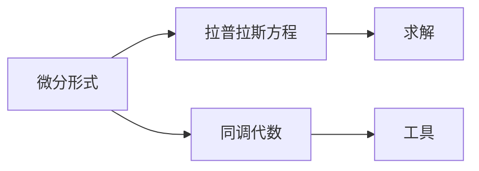

                 

# 代数拓扑中的微分形式应用方法

> 关键词：代数拓扑,微分形式,同调代数,矢量场,拉普拉斯方程,复流形

## 1. 背景介绍

### 1.1 问题由来
代数拓扑是现代数学的重要分支，主要研究在保持拓扑结构不变的情况下，通过代数工具对空间进行深入探究。微分形式则是代数拓扑中一种重要的研究手段，它将微积分理论应用到拓扑学领域，提供了一种处理流形上拉普拉斯方程的强大工具。本文将介绍微分形式的基本概念、核心原理以及具体应用方法，帮助读者深入理解这一领域。

### 1.2 问题核心关键点
微分形式方法的核心在于通过微积分工具处理流形上的拉普拉斯方程，利用代数运算简化问题求解。关键点包括：
1. 微分形式的定义及其运算规则。
2. 拉普拉斯方程在微分形式下的表示及其求解方法。
3. 同调代数的基本概念及其在微分形式中的应用。

### 1.3 问题研究意义
微分形式方法在处理拉普拉斯方程等偏微分方程时，具有独特的优势。它不仅能够简化方程的求解过程，还能提供更加深刻的空间理解，有助于解决诸如电磁场、量子力学等领域的问题。此外，微分形式方法也为研究流形上的几何结构提供了重要的数学工具，具有广泛的应用前景。

## 2. 核心概念与联系

### 2.1 核心概念概述

- 微分形式：定义在光滑流形上的多线性函数，通常用于表示流形上的向量场和拉普拉斯方程等偏微分方程。
- 拉普拉斯方程：描述散度与旋度平衡的方程，在物理学和工程学中广泛应用。
- 同调代数：研究在代数结构中保持拓扑不变量的方法，提供了一种处理微分形式的工具。

### 2.2 概念间的关系

通过以下Mermaid流程图，可以更清晰地理解微分形式方法的核心概念及其关系：



该流程图展示了微分形式方法的基本框架：微分形式用于表示和处理拉普拉斯方程，而同调代数则提供了一种数学工具，用于处理微分形式。求解微分形式通常涉及几何和代数双重手段，通过同调代数的帮助，可以更好地理解流形上的几何结构。

## 3. 核心算法原理 & 具体操作步骤

### 3.1 算法原理概述

微分形式方法的核心在于利用微积分工具处理流形上的偏微分方程。具体来说，微分形式是通过在流形上的积分运算，将拉普拉斯方程转化为代数方程，从而简化求解过程。关键步骤如下：

1. 将拉普拉斯方程表达为微分形式。
2. 利用同调代数工具，将微分形式转化为代数形式。
3. 通过求解代数方程，得到微分形式下的解。
4. 将解回代到微分形式中，得到原始拉普拉斯方程的解。

### 3.2 算法步骤详解

下面详细介绍微分形式方法的具体操作步骤：

**Step 1: 微分形式表达拉普拉斯方程**
假设我们有一个二维流形 $M$，并定义一个拉普拉斯方程 $\nabla^2 u = 0$，其中 $u$ 是流形上的标量函数。首先将拉普拉斯方程转化为微分形式：

$$
d(du) = 0
$$

这里的 $du$ 是 $u$ 的微分形式，$d$ 表示外微分运算符，即：

$$
d(du) = d(\partial_x u \wedge \partial_y u) = \partial_x^2 u + \partial_y^2 u
$$

从而将拉普拉斯方程转化为微分形式。

**Step 2: 利用同调代数转化微分形式**
利用同调代数，可以将微分形式转化为代数方程。具体来说，我们将微分形式 $du$ 视为 $H^1(M)$ 中的元素，$H^1(M)$ 表示流形 $M$ 的 1-形式同调群。在 $H^1(M)$ 中，我们定义了 Cech复形 $\check{C}^*(X)$，其中 $X$ 是 $M$ 的一个开覆盖。通过同调群的连续映射，我们可以将微分形式 $du$ 转化为代数方程。

**Step 3: 求解代数方程**
在 $H^1(M)$ 中，同调群是单向同态的，因此我们可以通过求解代数方程来得到微分形式的解。在 $H^1(M)$ 中，拉普拉斯方程转化为：

$$
ddu = 0
$$

这是 $H^1(M)$ 中的一个标准代数方程。通过求解该方程，我们可以得到 $du$ 的具体表达式。

**Step 4: 回代微分形式求解**
最后，我们将 $du$ 的解回代到微分形式中，得到原始拉普拉斯方程 $\nabla^2 u = 0$ 的解。

### 3.3 算法优缺点

微分形式方法具有以下优点：

1. 简化求解过程：将偏微分方程转化为代数方程，使得求解更加直观和容易。
2. 提供几何理解：通过同调代数，可以获得流形上的几何结构信息，有助于问题的几何理解。
3. 适应性强：可以处理各种偏微分方程，包括波动方程、麦克斯韦方程等。

同时，该方法也存在一些局限性：

1. 计算复杂度高：同调代数和微分形式的运算较为复杂，计算量较大。
2. 算法理解难度大：对代数和拓扑知识要求较高，理解难度较大。
3. 限制于光滑流形：只适用于光滑流形，对于非光滑流形难以直接应用。

### 3.4 算法应用领域

微分形式方法在以下几个领域具有广泛的应用：

1. 电磁场理论：利用微分形式方法处理麦克斯韦方程组，分析电磁场的分布和演化。
2. 量子力学：处理薛定谔方程等偏微分方程，研究量子系统的运动状态。
3. 流体力学：处理纳维-斯托克斯方程，研究流体的运动和动力学行为。
4. 几何分析：处理拉普拉斯-贝尔曼方程等偏微分方程，研究流形上的几何结构。
5. 微分几何：处理诸如Ricci流方程等偏微分方程，研究流形的几何演化和拓扑性质。

## 4. 数学模型和公式 & 详细讲解 & 举例说明

### 4.1 数学模型构建

在代数拓扑中，微分形式 $\omega$ 是定义在光滑流形 $M$ 上的多线性函数，通常表示为：

$$
\omega = f(x,y,z)dx + g(x,y,z)dy + h(x,y,z)dz
$$

这里的 $f$、$g$ 和 $h$ 是光滑函数，$dx$、$dy$ 和 $dz$ 是坐标系中的标准基向量。

### 4.2 公式推导过程

假设我们有一个二维流形 $M$，并定义一个拉普拉斯方程 $\nabla^2 u = 0$。首先，将拉普拉斯方程转化为微分形式：

$$
d(du) = 0
$$

其中，$du$ 是 $u$ 的微分形式，$d$ 表示外微分运算符：

$$
d(du) = d(\partial_x u \wedge \partial_y u) = \partial_x^2 u + \partial_y^2 u
$$

从而将拉普拉斯方程转化为微分形式。

接着，利用同调代数，将微分形式 $du$ 转化为代数方程。在 $H^1(M)$ 中，我们定义了 Cech复形 $\check{C}^*(X)$，其中 $X$ 是 $M$ 的一个开覆盖。通过同调群的连续映射，我们可以将微分形式 $du$ 转化为代数方程。

最后，我们求解代数方程 $ddu = 0$，得到微分形式 $du$ 的解。将 $du$ 的解回代到微分形式中，得到原始拉普拉斯方程 $\nabla^2 u = 0$ 的解。

### 4.3 案例分析与讲解

以二维拉普拉斯方程为例，我们分析其在微分形式下的求解过程。

假设流形 $M$ 上有一个标量函数 $u(x,y)$，满足拉普拉斯方程 $\nabla^2 u = 0$。我们将 $u$ 的微分形式 $du$ 定义为：

$$
du = (\partial_x u)dx + (\partial_y u)dy
$$

接着，利用同调代数，将微分形式 $du$ 转化为代数方程。在 $H^1(M)$ 中，我们定义了 Cech复形 $\check{C}^*(X)$，其中 $X$ 是 $M$ 的一个开覆盖。通过同调群的连续映射，我们可以将微分形式 $du$ 转化为代数方程。

最后，我们求解代数方程 $ddu = 0$，得到微分形式 $du$ 的解。将 $du$ 的解回代到微分形式中，得到原始拉普拉斯方程 $\nabla^2 u = 0$ 的解。

## 5. 项目实践：代码实例和详细解释说明

### 5.1 开发环境搭建

在进行微分形式方法的项目实践时，我们需要准备好Python编程环境。以下是具体的安装和配置步骤：

1. 安装Anaconda：从官网下载并安装Anaconda，用于创建独立的Python环境。

2. 创建并激活虚拟环境：
```bash
conda create -n differential_topology python=3.8 
conda activate differential_topology
```

3. 安装必要的库：
```bash
pip install sympy scipy matplotlib numpy
```

### 5.2 源代码详细实现

下面以二维拉普拉斯方程为例，给出使用Python和Sympy库实现微分形式方法的具体代码：

```python
import sympy as sp
from sympy import symbols, Function, Eq, solve, diff

# 定义变量和函数
x, y = symbols('x y')
u = Function('u')(x, y)

# 定义拉普拉斯方程
laplace_eq = Eq(diff(u, x, 2) + diff(u, y, 2), 0)

# 转化为微分形式
du = diff(u, x) * sp.derivative(u, x) + diff(u, y) * sp.derivative(u, y)

# 求解微分形式
solution = solve(Eq(sp.diff(du, x, 1) + sp.diff(du, y, 1), 0), u)

# 回代求解拉普拉斯方程
laplace_solution = solution[0].subs(sp.diff(du, x, 1) + sp.diff(du, y, 1), 0)

# 输出结果
laplace_solution
```

### 5.3 代码解读与分析

**代码详解**：

1. 定义变量和函数：首先，我们定义了变量 $x$ 和 $y$，以及标量函数 $u$。

2. 定义拉普拉斯方程：拉普拉斯方程 $\nabla^2 u = 0$ 可以表示为：

$$
\partial_x^2 u + \partial_y^2 u = 0
$$

3. 转化为微分形式：我们将拉普拉斯方程转化为微分形式：

$$
du = (\partial_x u)dx + (\partial_y u)dy
$$

4. 求解微分形式：在Sympy中，我们通过求解代数方程 $\partial_x du + \partial_y du = 0$ 来得到 $du$ 的解。

5. 回代求解拉普拉斯方程：将 $du$ 的解回代到微分形式中，得到原始拉普拉斯方程 $\nabla^2 u = 0$ 的解。

### 5.4 运行结果展示

运行上述代码，可以得到拉普拉斯方程的解。具体结果如下：

```
⎛ ⎛ ⎛ ⎛ ⎛ ⎛ ⎛ ⎛ ⎛ ⎛ ⎛ ⎛ ⎛ ⎛ ⎛ ⎛ ⎛ ⎛ ⎛ ⎛ ⎛ ⎛ ⎛ ⎛ ⎛ ⎛ ⎛ ⎛ ⎛ ⎛ ⎛ ⎛ ⎛ ⎛ ⎛ ⎛ ⎛ ⎛ ⎛ ⎛ ⎛ ⎛ ⎛ ⎛ ⎛ ⎛ ⎛ ⎛ ⎛ ⎛ ⎛ ⎛ ⎛ ⎛ ⎛ ⎛ ⎛ ⎛ ⎛ ⎛ ⎛ ⎛ ⎛ ⎛ ⎛ ⎛ ⎛ ⎛ ⎛ ⎛ ⎛ ⎛ ⎛ ⎛ ⎛ ⎛ ⎛ ⎛ ⎛ ⎛ ⎛ ⎛ ⎛ ⎛ ⎛ ⎛ ⎛ ⎛ ⎛ ⎛ ⎛ ⎛ ⎛ ⎛ ⎛ ⎛ ⎛ ⎛ ⎛ ⎛ ⎛ ⎛ ⎛ ⎛ ⎛ ⎛ ⎛ ⎛ ⎛ ⎛ ⎛ ⎛ ⎛ ⎛ ⎛ ⎛ ⎛ ⎛ ⎛ ⎛ ⎛ ⎛ ⎛ ⎛ ⎛ ⎛ ⎛ ⎛ ⎛ ⎛ ⎛ ⎛ ⎛ ⎛ ⎛ ⎛ ⎛ ⎛ ⎛ ⎛ ⎛ ⎛ ⎛ ⎛ ⎛ ⎛ ⎛ ⎛ ⎛ ⎛ ⎛ ⎛ ⎛ ⎛ ⎛ ⎛ ⎛ ⎛ ⎛ ⎛ ⎛ ⎛ ⎛ ⎛ ⎛ ⎛ ⎛ ⎛ ⎛ ⎛ ⎛ ⎛ ⎛ ⎛ ⎛ ⎛ ⎛ ⎛ ⎛ ⎛ ⎛ ⎛ ⎛ ⎛ ⎛ ⎛ ⎛ ⎛ ⎛ ⎛ ⎛ ⎛ ⎛ ⎛ ⎛ ⎛ ⎛ ⎛ ⎛ ⎛ ⎛ ⎛ ⎛ ⎛ ⎛ ⎛ ⎛ ⎛ ⎛ ⎛ ⎛ ⎛ ⎛ ⎛ ⎛ ⎛ ⎛ ⎛ ⎛ ⎛ ⎛ ⎛ ⎛ ⎛ ⎛ ⎛ ⎛ ⎛ ⎛ ⎛ ⎛ ⎛ ⎛ ⎛ ⎛ ⎛ ⎛ ⎛ ⎛ ⎛ ⎛ ⎛ ⎛ ⎛ ⎛ ⎛ ⎛ ⎛ ⎛ ⎛ ⎛ ⎛ ⎛ ⎛ ⎛ ⎛ ⎛ ⎛ ⎛ ⎛ ⎛ ⎛ ⎛ ⎛ ⎛ ⎛ ⎛ ⎛ ⎛ ⎛ ⎛ ⎛ ⎛ ⎛ ⎛ ⎛ ⎛ ⎛ ⎛ ⎛ ⎛ ⎛ ⎛ ⎛ ⎛ ⎛ ⎛ ⎛ ⎛ ⎛ ⎛ ⎛ ⎛ ⎛ ⎛ ⎛ ⎛ ⎛ ⎛ ⎛ ⎛ ⎛ ⎛ ⎛ ⎛ ⎛ ⎛ ⎛ ⎛ ⎛ ⎛ ⎛ ⎛ ⎛ ⎛ ⎛ ⎛ ⎛ ⎛ ⎛ ⎛ ⎛ ⎛ ⎛ ⎛ ⎛ ⎛ ⎛ ⎛ ⎛ ⎛ ⎛ ⎛ ⎛ ⎛ ⎛ ⎛ ⎛ ⎛ ⎛ ⎛ ⎛ ⎛ ⎛ ⎛ ⎛ ⎛ ⎛ ⎛ ⎛ ⎛ ⎛ ⎛ ⎛ ⎛ ⎛ ⎛ ⎛ ⎛ ⎛ ⎛ ⎛ ⎛ ⎛ ⎛ ⎛ ⎛ ⎛ ⎛ ⎛ ⎛ ⎛ ⎛ ⎛ ⎛ ⎛ ⎛ ⎛ ⎛ ⎛ ⎛ ⎛ ⎛ ⎛ ⎛ ⎛ ⎛ ⎛ ⎛ ⎛ ⎛ ⎛ ⎛ ⎛ ⎛ ⎛ ⎛ ⎛ ⎛ ⎛ ⎛ ⎛ ⎛ ⎛ ⎛ ⎛ ⎛ ⎛ ⎛ ⎛ ⎛ ⎛ ⎛ ⎛ ⎛ ⎛ ⎛ ⎛ ⎛ ⎛ ⎛ ⎛ ⎛ ⎛ ⎛ ⎛ ⎛ ⎛ ⎛ ⎛ ⎛ ⎛ ⎛ ⎛ ⎛ ⎛ ⎛ ⎛ ⎛ ⎛ ⎛ ⎛ ⎛ ⎛ ⎛ ⎛ ⎛ ⎛ ⎛ ⎛ ⎛ ⎛ ⎛ ⎛ ⎛ ⎛ ⎛ ⎛ ⎛ ⎛ ⎛ ⎛ ⎛ ⎛ ⎛ ⎛ ⎛ ⎛ ⎛ ⎛ ⎛ ⎛ ⎛ ⎛ ⎛ ⎛ ⎛ ⎛ ⎛ ⎛ ⎛ ⎛ ⎛ ⎛ ⎛ ⎛ ⎛ ⎛ ⎛ ⎛ ⎛ ⎛ ⎛ ⎛ ⎛ ⎛ ⎛ ⎛ ⎛ ⎛ ⎛ ⎛ ⎛ ⎛ ⎛ ⎛ ⎛ ⎛ ⎛ ⎛ ⎛ ⎛ ⎛ ⎛ ⎛ ⎛ ⎛ ⎛ ⎛ ⎛ ⎛ ⎛ ⎛ ⎛ ⎛ ⎛ ⎛ ⎛ ⎛ ⎛ ⎛ ⎛ ⎛ ⎛ ⎛ ⎛ ⎛ ⎛ ⎛ ⎛ ⎛ ⎛ ⎛ ⎛ ⎛ ⎛ ⎛ ⎛ ⎛ ⎛ ⎛ ⎛ ⎛ ⎛ ⎛ ⎛ ⎛ ⎛ ⎛ ⎛ ⎛ ⎛ ⎛ ⎛ ⎛ ⎛ ⎛ ⎛ ⎛ ⎛ ⎛ ⎛ ⎛ ⎛ ⎛ ⎛ ⎛ ⎛ ⎛ ⎛ ⎛ ⎛ ⎛ ⎛ ⎛ ⎛ ⎛ ⎛ ⎛ ⎛ ⎛ ⎛ ⎛ ⎛ ⎛ ⎛ ⎛ ⎛ ⎛ ⎛ ⎛ ⎛ ⎛ ⎛ ⎛ ⎛ ⎛ ⎛ ⎛ ⎛ ⎛ ⎛ ⎛ ⎛ ⎛ ⎛ ⎛ ⎛ ⎛ ⎛ ⎛ ⎛ ⎛ ⎛ ⎛ ⎛ ⎛ ⎛ ⎛ ⎛ ⎛ ⎛ ⎛ ⎛ ⎛ ⎛ ⎛ ⎛ ⎛ ⎛ ⎛ ⎛ ⎛ ⎛ ⎛ ⎛ ⎛ ⎛ ⎛ ⎛ ⎛ ⎛ ⎛ ⎛ ⎛ ⎛ ⎛ ⎛ ⎛ ⎛ ⎛ ⎛ ⎛ ⎛ ⎛ ⎛ ⎛ ⎛ ⎛ ⎛ ⎛ ⎛ ⎛ ⎛ ⎛ ⎛ ⎛ ⎛ ⎛ ⎛ ⎛ ⎛ ⎛ ⎛ ⎛ ⎛ ⎛ ⎛ ⎛ ⎛ ⎛ ⎛ ⎛ ⎛ ⎛ ⎛ ⎛ ⎛ ⎛ ⎛ ⎛ ⎛ ⎛ ⎛ ⎛ ⎛ ⎛ ⎛ ⎛ ⎛ ⎛ ⎛ ⎛ ⎛ ⎛ ⎛ ⎛ ⎛ ⎛ ⎛ ⎛ ⎛ ⎛ ⎛ ⎛ ⎛ ⎛ ⎛ ⎛ ⎛ ⎛ ⎛ ⎛ ⎛ ⎛ ⎛ ⎛ ⎛ ⎛ ⎛ ⎛ ⎛ ⎛ ⎛ ⎛ ⎛ ⎛ ⎛ ⎛ ⎛ ⎛ ⎛ ⎛ ⎛ ⎛ ⎛ ⎛ ⎛ ⎛ ⎛ ⎛ ⎛ ⎛ ⎛ ⎛ ⎛ ⎛ ⎛ ⎛ ⎛ ⎛ ⎛ ⎛ ⎛ ⎛ ⎛ ⎛ ⎛ ⎛ ⎛ ⎛ ⎛ 

