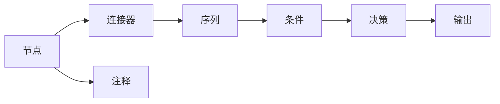
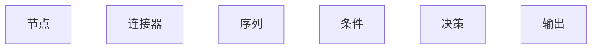

                 

## 1. 背景介绍

### 1.1 问题由来

随着信息技术的发展，图形化的流程描述在软件开发、项目管理、数据分析等领域的应用越来越广泛。传统的流程图，如UML（统一建模语言）、BPMN（业务流程建模和规范）等，虽然功能强大，但学习曲线陡峭，语法复杂，难以快速上手。

近年来，Mermaid语法作为一种轻量级的流程图表表示方式，受到了广泛关注。它支持链图、流程图、时序图等多种类型的图表，能够快速生成清晰的流程描述，适用于日常开发中的需求分析、项目规划、代码审查等场景。

本文将从Mermaid语法的核心概念入手，详细介绍其语法规则、应用场景和优化技巧，为读者提供一份全面系统的学习指南。

### 1.2 问题核心关键点

- **核心概念**：流程、活动、决策、连接器、序列、条件等。
- **语法规则**：节点语法、连接器语法、注释语法、模块化语法等。
- **应用场景**：需求分析、项目规划、代码审查、数据分析、用户故事等。
- **优化技巧**：提高图表可读性、维护效率、重用性等。

## 2. 核心概念与联系

### 2.1 核心概念概述

Mermaid语法的主要概念包括节点、连接器、序列、条件等。以下对每个核心概念进行简要说明：

- **节点(Node)**：代表图表中的活动或决策，通常表示为一个带边框的矩形。
- **连接器(Connector)**：用于连接节点，表示活动之间的逻辑关系。
- **序列(Sequence)**：表示活动执行的顺序，通常用斜杠（`//`）表示。
- **条件(Condition)**：表示活动之间的分支选择，通常用双斜杠（`///`）表示。

这些概念相互关联，共同构成了Mermaid语法的核心体系。下面以一个简单的流程为例，展示它们之间的联系：

```mermaid
graph TB
    A[开始]
    B[检查输入]
    C[处理数据]
    D[输出结果]
    A->B
    B->C
    C->D
```

在这个流程图中，`A` 表示流程的起点，`B` 表示输入检查，`C` 表示数据处理，`D` 表示输出结果。箭头表示流程的流动方向，即从`A`到`B`，从`B`到`C`，最后到`D`。

### 2.2 概念间的关系

Mermaid语法的核心概念之间的关系，可以通过以下Mermaid流程图来展示：



这个流程图展示了节点、连接器、序列、条件等概念之间的关系：

- 节点和连接器构成图表的基本元素。
- 序列用于表示活动执行的顺序。
- 条件用于表示分支选择。
- 注释用于解释图表中的细节。

## 3. 核心算法原理 & 具体操作步骤

### 3.1 算法原理概述

Mermaid语法是一种文本描述语言，能够将流程图中的元素用简单的文本表示出来，并通过特定的语法规则解析为图形化展示。其原理可以总结如下：

- **语法解析**：将Mermaid语法文本解析为图表元素和连接器。
- **图表渲染**：根据解析结果，生成最终的流程图。

### 3.2 算法步骤详解

使用Mermaid语法创建流程图的步骤主要包括以下几个环节：

1. **定义节点和连接器**：使用`graph`、`graph LR`等语法定义图表的基本结构和元素。
2. **指定节点类型和名称**：使用`A[节点名称]`、`A[]`等语法定义节点的名称和类型。
3. **定义连接器和关系**：使用`A->B`、`A-->B`、`A..>B`等语法定义连接器和节点之间的关系。
4. **添加注释和样式**：使用`[A]`、`//`、`///`、`==`等语法添加注释和样式。
5. **执行渲染**：将定义好的Mermaid代码保存为`.md`文件，使用在线工具或本地工具（如`mermaid-cli`）渲染生成图形。

### 3.3 算法优缺点

Mermaid语法的优点包括：

- **简单易用**：语法规则直观，易于学习和上手。
- **灵活性高**：支持多种类型的图表，适用于不同的应用场景。
- **可扩展性**：可以通过插件扩展，支持更多的语法和功能。

其缺点包括：

- **渲染依赖环境**：需要依赖特定的渲染工具或环境，可能存在兼容性问题。
- **代码可读性**：对于复杂的流程，代码可能显得冗长，难以维护。
- **样式和颜色支持有限**：部分样式和颜色设置需要额外配置，可能不够灵活。

### 3.4 算法应用领域

Mermaid语法主要应用于以下领域：

- **需求分析**：用于描述软件需求、功能点等。
- **项目管理**：用于规划项目任务、里程碑等。
- **代码审查**：用于描述代码流程、调用关系等。
- **数据分析**：用于展示数据流、处理步骤等。
- **用户故事**：用于描述用户操作、系统交互等。

## 4. 数学模型和公式 & 详细讲解 & 举例说明

### 4.1 数学模型构建

Mermaid语法本身并不涉及数学模型，但其核心概念可以类比为数学中的图论模型。以下以一个简单的流程图为例，展示其核心概念的数学模型构建：



在这个数学模型中，`A` 和 `F` 表示节点，`B`、`C`、`D`、`E` 表示连接器和条件。通过节点和连接器的组合，可以构建任意复杂的流程图。

### 4.2 公式推导过程

由于Mermaid语法不涉及数学公式，这里主要介绍如何使用Sympy库推导数学公式，以及其与Mermaid语法的联系。

- **节点与连接器**：节点和连接器可以看作图论中的节点和边，使用Sympy可以表示为一个有向图。
- **序列和条件**：序列和条件可以视为图论中的路径和分支，使用Sympy可以表示为图论中的路径表达式和分支条件。

### 4.3 案例分析与讲解

以下是一个简单的案例，展示如何使用Mermaid语法描述一个顺序流程图，并使用Sympy进行数学模型构建：

```mermaid
graph TB
    A[节点1]
    B[节点2]
    C[节点3]
    A->B
    B->C
```

对应的Sympy模型为：

```python
from sympy import Graph

G = Graph()
G.add_node('A')
G.add_node('B')
G.add_node('C')
G.add_edge('A', 'B')
G.add_edge('B', 'C')
```

在这个例子中，节点和连接器分别对应图论中的节点和边。通过Sympy的Graph类，可以方便地构建和操作有向图。

## 5. 项目实践：代码实例和详细解释说明

### 5.1 开发环境搭建

使用Mermaid语法创建流程图，一般不需要搭建复杂的开发环境。只需要准备好一个文本编辑器（如VSCode、Atom等）即可。

### 5.2 源代码详细实现

以下是一个简单的Mermaid代码示例，展示如何使用Mermaid语法描述一个顺序流程图：

```mermaid
graph TB
    A[开始]
    B[检查输入]
    C[处理数据]
    D[输出结果]
    A->B
    B->C
    C->D
```

### 5.3 代码解读与分析

在这个例子中，`graph TB`表示定义一个有向图，`A`、`B`、`C`、`D`表示节点的名称，`A->B`、`B->C`、`C->D`表示连接器。

### 5.4 运行结果展示

保存以上代码为一个`.md`文件，使用在线工具（如Mermaid.js、Mermaid-cli等）或本地工具（如VSCode的Markdown插件）渲染生成图形。

## 6. 实际应用场景

### 6.1 需求分析

在需求分析阶段，使用Mermaid语法可以快速描述系统的功能需求、业务流程等。例如，以下代码展示了一个简单的需求分析图：

```mermaid
graph LR
    A[需求一]
    B[需求二]
    C[需求三]
    A->B
    B->C
```

这个图表示三个需求之间的关系，即需求一->需求二->需求三。

### 6.2 项目管理

在项目管理阶段，使用Mermaid语法可以规划项目的里程碑、任务分配等。例如，以下代码展示了一个简单的项目管理图：

```mermaid
graph LR
    A[启动]
    B[需求分析]
    C[设计]
    D[开发]
    E[测试]
    F[部署]
    A->B
    B->C
    C->D
    D->E
    E->F
```

这个图表示项目的各个阶段和任务，从启动到需求分析、设计、开发、测试、部署的顺序。

### 6.3 代码审查

在代码审查阶段，使用Mermaid语法可以描述代码的调用关系、依赖关系等。例如，以下代码展示了一个简单的代码审查图：

```mermaid
graph LR
    A[模块A]
    B[模块B]
    C[模块C]
    A->B
    B->C
```

这个图表示模块A->模块B->模块C的依赖关系。

### 6.4 数据分析

在数据分析阶段，使用Mermaid语法可以展示数据流、处理步骤等。例如，以下代码展示了一个简单的数据分析图：

```mermaid
graph LR
    A[数据输入]
    B[数据清洗]
    C[数据分析]
    D[数据可视化]
    A->B
    B->C
    C->D
```

这个图表示数据的输入、清洗、分析和可视化的流程。

## 7. 工具和资源推荐

### 7.1 学习资源推荐

以下是一些推荐的学习资源，帮助你快速上手Mermaid语法：

1. [Mermaid官方文档](https://mermaid-js.org/)：详细介绍了Mermaid语法的语法规则和应用场景。
2. [Mermaid教程](https://mermaid-js.org/tutorial/)：提供了丰富的案例和示例，适合新手学习。
3. [Mermaid插件](https://marketplace.visualstudio.com/items?itemName=ITCu.PreviewMMD)：VSCode的Markdown插件，支持Mermaid语法预览和渲染。
4. [Mermaid.js](https://mermaid-js.org/)：在线工具，支持Mermaid语法的语法定义和渲染。

### 7.2 开发工具推荐

以下是一些推荐的开发工具，帮助你高效使用Mermaid语法：

1. VSCode：支持Markdown插件，方便预览和渲染Mermaid代码。
2. Atom：支持Markdown插件，提供丰富的编辑和渲染功能。
3. Mermaid.js：在线工具，支持Mermaid语法的语法定义和渲染。

### 7.3 相关论文推荐

以下是一些推荐的论文，帮助你深入理解Mermaid语法的原理和应用：

1. [Graph-based Visualization Techniques for Big Data](https://arxiv.org/abs/1911.13333)：介绍基于图论的可视化技术，与Mermaid语法有相似之处。
2. [GraphViz: A General PurposE](https://www.graphviz.org/)：GraphViz是Graph的实现工具，提供了丰富的图论算法和可视化方法。
3. [Visualization of Data Science and Knowledge Graphs](https://link.springer.com/chapter/10.1007/978-3-030-69134-5_3)：介绍数据科学和知识图的可视化方法，与Mermaid语法有一定关联。

## 8. 总结：未来发展趋势与挑战

### 8.1 总结

本文详细介绍了Mermaid语法的基本概念、语法规则和应用场景，展示了其在游戏化、易用性和可扩展性方面的优势。Mermaid语法已经成为一种流行的流程图表表示方式，广泛应用于软件开发、项目管理、数据分析等多个领域。

通过学习和应用Mermaid语法，读者可以更高效地描述和管理复杂的流程，提升工作效率和团队协作能力。

### 8.2 未来发展趋势

展望未来，Mermaid语法的应用将更加广泛和深入，其趋势包括以下几个方面：

1. **应用场景多样化**：除了传统的软件开发、项目管理等领域，Mermaid语法将在更多场景中得到应用，如数据科学、教育培训、金融分析等。
2. **工具和插件丰富化**：更多的开发工具和插件将支持Mermaid语法，提高其易用性和适用性。
3. **社区和生态系统成熟化**：Mermaid语法将吸引更多的开发者和用户参与，形成一个活跃的社区和生态系统。

### 8.3 面临的挑战

尽管Mermaid语法在实际应用中表现出强大的优势，但也面临一些挑战：

1. **复杂流程描述难度**：对于复杂的流程，使用Mermaid语法可能显得冗长和难以维护。
2. **样式和颜色配置复杂**：部分样式和颜色设置需要额外配置，可能不够灵活。
3. **代码可读性问题**：对于新手来说，理解和编写复杂的Mermaid代码可能有一定难度。

### 8.4 研究展望

未来的研究需要在以下几个方面寻求突破：

1. **简化复杂流程描述**：开发更简洁、易用的流程描述语法，降低复杂流程的描述难度。
2. **增强样式和颜色配置**：提供更灵活、易用的样式和颜色配置工具，提高用户的使用体验。
3. **增强代码可读性**：提供更好的代码提示和自动完成功能，降低新手的学习难度。

总之，Mermaid语法作为一种轻量级的流程图表表示方式，具有广阔的应用前景。通过持续的技术创新和社区支持，未来必将在更多的场景中发挥重要作用，推动流程管理、数据可视化等领域的发展。

## 9. 附录：常见问题与解答

**Q1：Mermaid语法能否跨平台使用？**

A: Mermaid语法本身是一种文本表示语言，适用于多种平台和环境，包括Web、桌面应用和移动应用等。只需配置好渲染工具，即可在任何平台上使用。

**Q2：Mermaid语法如何支持中文？**

A: Mermaid语法本身不限制语言，可以支持任何语言的文本描述。使用中文字符时，只需要保证渲染工具支持中文字符即可。

**Q3：Mermaid语法是否可以用于商业项目？**

A: Mermaid语法是一种开源的流程图表表示方式，可以用于商业项目。但需要注意，在商业项目中，可能需要对语法进行定制或扩展，以满足特定的需求。

**Q4：Mermaid语法是否支持SVG输出？**

A: Mermaid语法支持将生成的图表导出为SVG格式，方便在网页和其他环境中使用。

**Q5：Mermaid语法是否可以与其他流程管理工具结合使用？**

A: Mermaid语法本身并不依赖于特定的流程管理工具，可以与多种工具结合使用。例如，在JIRA、Trello等项目管理工具中，可以使用Mermaid语法生成流程图表，方便团队协作和管理。

总之，Mermaid语法作为一种轻量级的流程图表表示方式，具有广泛的应用前景和灵活的定制能力。通过学习和应用Mermaid语法，开发者可以更高效地描述和管理复杂的流程，提升工作效率和团队协作能力。

