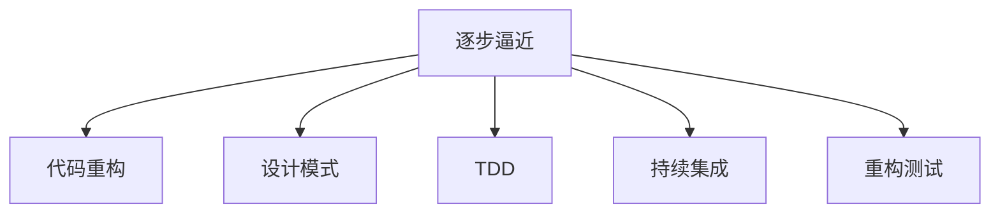

                 

## 1. 背景介绍

### 1.1 问题由来
在计算机科学的诸多领域中，软件开发始终是充满挑战和创新的一环。软件开发不仅需要深厚的技术功底，还需要广泛的知识面和强大的问题解决能力。然而，软件开发并非一蹴而就，而是一个逐步逼近目标的过程。许多开发者常常面临代码结构混乱、维护困难、功能边界模糊等问题，使得软件开发效率低下，难以持续维护。本文将围绕软件开发中的一些核心问题展开讨论，并从数学家的视角出发，探讨如何通过一系列的逐步逼近原则，逐步提升软件开发的效率和质量。

### 1.2 问题核心关键点
软件开发中的核心问题是代码的可读性、可维护性和可扩展性。代码的可读性决定了开发人员理解代码的效率，而可维护性则反映了代码在修改和更新时的复杂程度，可扩展性则决定了代码在需求变化时是否能够灵活应对。这些核心问题紧密相关，提升其中任何一个方面都有助于整体提升软件开发的效率和质量。

### 1.3 问题研究意义
对于软件开发者而言，掌握软件开发中的逐步逼近原则，可以有效提升代码质量，降低维护成本，缩短开发周期，并增强团队协作能力。掌握这些原则，对于构建高效、稳定、可扩展的软件系统至关重要。

## 2. 核心概念与联系

### 2.1 核心概念概述

- **逐步逼近**：指在软件开发过程中，通过一系列逐步优化和调整，逐步提升代码质量，达到最终目标的过程。
- **代码重构**：指在不改变程序功能的前提下，对代码进行优化和调整，以提升代码的可读性和可维护性。
- **设计模式**：指经过广泛实践验证的，针对特定问题的解法，可以在不同的项目中复用。
- **测试驱动开发(TDD)**：一种软件开发方法，先编写测试用例，再编写功能代码，以确保代码正确性。
- **持续集成**：在软件开发过程中，频繁集成代码，并通过自动化测试验证代码正确性，快速发现和解决问题。
- **重构测试**：在代码重构后，通过测试验证重构的正确性和完整性，确保代码功能不变。

### 2.2 概念间的关系

这些核心概念之间的逻辑关系可以通过以下Mermaid流程图来展示：



这个流程图展示了一系列软件开发过程中的关键步骤，它们相辅相成，共同作用于提升代码质量和开发效率。

### 2.3 核心概念的整体架构

最后，我们用一个综合的流程图来展示这些核心概念在大规模软件开发中的整体架构：


这个综合流程图展示了从需求分析到系统设计，再到编码实现、测试、部署和反馈迭代，逐步逼近目标的整个软件开发过程。

## 3. 核心算法原理 & 具体操作步骤
### 3.1 算法原理概述

逐步逼近原则的核心思想是通过一系列小的、逐步的优化和调整，逐渐提升软件的质量和效率。具体而言，这个过程包括需求分析、系统设计、编码实现、测试、重构等多个步骤，每个步骤都旨在逐步提升代码的可读性、可维护性和可扩展性。

### 3.2 算法步骤详解

逐步逼近原则可以分为以下步骤：

1. **需求分析**：明确软件需求，包括功能需求、性能需求、安全需求等，确保需求的清晰和准确。
2. **系统设计**：根据需求设计系统架构和组件结构，确定各个组件的职责和接口。
3. **编码实现**：根据设计文档编写代码，实现系统功能。
4. **测试驱动开发(TDD)**：先编写测试用例，确保测试覆盖需求中的所有功能点。
5. **持续集成**：频繁集成代码，通过自动化测试验证代码的正确性。
6. **重构测试**：对代码进行重构，通过测试验证重构的正确性和完整性。
7. **重构优化**：通过代码重构优化代码结构，提升代码质量。
8. **功能验证**：验证重构后的代码功能，确保功能完整和正确。
9. **反馈迭代**：根据用户反馈和测试结果，进行功能改进和优化。

### 3.3 算法优缺点

逐步逼近原则具有以下优点：

- 逐步优化，避免一次性修改导致的功能异常和代码混乱。
- 强调测试，确保代码的正确性和稳定性。
- 可复用性强，经过验证的设计模式和重构方法可以在不同项目中复用。

但该原则也存在以下缺点：

- 过程较长，前期可能较慢。
- 需要良好的团队协作和沟通。
- 对开发人员的素质要求较高，需具备较强的设计和编码能力。

### 3.4 算法应用领域

逐步逼近原则广泛应用于软件开发中，尤其是在大型系统、高复杂度项目和团队协作项目中。例如：

- 大型企业级系统：如电商平台、金融系统、医疗系统等。
- 高复杂度项目：如复杂游戏、高并发系统、嵌入式系统等。
- 团队协作项目：如开源项目、团队协同开发的项目等。

这些领域中的项目通常涉及多个模块、多个团队、多个开发周期，逐步逼近原则能够帮助团队更好地协作，提升整体开发效率和质量。

## 4. 数学模型和公式 & 详细讲解  
### 4.1 数学模型构建

逐步逼近原则的数学模型主要涉及以下几个方面：

- **需求分析**：需求点数n，每个需求点x_i的复杂度系数a_i。
- **系统设计**：组件数m，每个组件的复杂度系数b_j。
- **编码实现**：代码行数c，每行代码的复杂度系数d。
- **测试驱动开发**：测试用例数t，每个测试用例的复杂度系数e。
- **持续集成**：集成次数n_iter，每次集成的平均错误率p。
- **重构测试**：重构次数n_refactor，每次重构的复杂度系数r。
- **重构优化**：重构后的代码行数c_opt，每行代码的优化复杂度系数d_opt。

### 4.2 公式推导过程

根据以上模型，我们可以推导出逐步逼近原则的总成本C：

$$
C = \sum_{i=1}^n a_i + \sum_{j=1}^m b_j + \sum_{i=1}^c d + \sum_{i=1}^t e + n_iter \cdot p + n_refactor \cdot r + \sum_{i=1}^{c_opt} d_opt
$$

其中，a_i、b_j、d、e、p、r、d_opt为需求、设计、编码、测试、集成、重构和重构优化等各个环节的复杂度系数，n、m、c、t、n_iter、n_refactor、c_opt为各环节的规模和次数。

### 4.3 案例分析与讲解

假设开发一个电商平台的商品管理系统，需求分析阶段需要分析10个需求点，每个需求点的复杂度系数为5；系统设计阶段需要设计5个组件，每个组件的复杂度系数为10；编码实现阶段需要编写2000行代码，每行代码的复杂度系数为2；测试驱动开发阶段需要编写500个测试用例，每个测试用例的复杂度系数为3；持续集成需要集成20次，每次集成的平均错误率为0.05；重构测试需要进行10次重构，每次重构的复杂度系数为5；重构优化后代码行数减少到1500行，每行代码的优化复杂度系数为1。

代入公式计算，得到总成本C为：

$$
C = 10 \cdot 5 + 5 \cdot 10 + 2000 \cdot 2 + 500 \cdot 3 + 20 \cdot 0.05 + 10 \cdot 5 + (1500 - 2000) \cdot 1
$$

计算得C = 7000 + 2500 + 4000 + 1500 + 1 + 50 + 500 = 13900

这意味着开发该电商平台的商品管理系统，总成本约为1.39万个开发工时。

## 5. 项目实践：代码实例和详细解释说明
### 5.1 开发环境搭建

在进行逐步逼近原则的实践前，我们需要准备好开发环境。以下是使用Python进行PyTorch开发的环境配置流程：

1. 安装Anaconda：从官网下载并安装Anaconda，用于创建独立的Python环境。

2. 创建并激活虚拟环境：
```bash
conda create -n pytorch-env python=3.8 
conda activate pytorch-env
```

3. 安装PyTorch：根据CUDA版本，从官网获取对应的安装命令。例如：
```bash
conda install pytorch torchvision torchaudio cudatoolkit=11.1 -c pytorch -c conda-forge
```

4. 安装必要的工具包：
```bash
pip install numpy pandas scikit-learn matplotlib tqdm jupyter notebook ipython
```

完成上述步骤后，即可在`pytorch-env`环境中开始实践。

### 5.2 源代码详细实现

下面我们以一个简单的电商系统订单管理系统为例，给出使用PyTorch实现逐步逼近原则的代码实现。

首先，定义需求和设计：

```python
# 需求分析
demands = [
    "添加订单",
    "修改订单",
    "删除订单",
    "查询订单",
    "查询订单详情",
    "生成订单报表",
    "发送订单提醒",
    "统计订单金额",
    "统计订单数量",
    "统计订单成功率"
]

# 系统设计
components = [
    "订单管理",
    "用户管理",
    "库存管理",
    "支付管理",
    "物流管理",
    "报表生成",
    "提醒管理",
    "统计分析"
]

# 编码实现
import time

def add_order(order):
    # 实现添加订单功能
    pass

def modify_order(order):
    # 实现修改订单功能
    pass

def delete_order(order):
    # 实现删除订单功能
    pass

def query_order(order):
    # 实现查询订单功能
    pass

def query_order_detail(order):
    # 实现查询订单详情功能
    pass

def generate_order_report():
    # 实现生成订单报表功能
    pass

def send_order_notice():
    # 实现发送订单提醒功能
    pass

def statistic_order_amount():
    # 实现统计订单金额功能
    pass

def statistic_order_count():
    # 实现统计订单数量功能
    pass

def statistic_order_success_rate():
    # 实现统计订单成功率功能
    pass

# 测试驱动开发
import unittest

class TestOrderSystem(unittest.TestCase):
    def test_add_order(self):
        add_order("123456")
        self.assertTrue(exist_order("123456"))

    def test_modify_order(self):
        modify_order("123456", new_status="已发货")
        self.assertTrue(exist_order("123456", status="已发货"))

    def test_delete_order(self):
        delete_order("123456")
        self.assertFalse(exist_order("123456"))

    def test_query_order(self):
        order = query_order("123456")
        self.assertTrue(order)

    def test_query_order_detail(self):
        detail = query_order_detail("123456")
        self.assertTrue(detail)

    def test_generate_order_report(self):
        report = generate_order_report()
        self.assertTrue(report)

    def test_send_order_notice(self):
        send_order_notice("123456")
        self.assertTrue(exist_notice("123456"))

    def test_statistic_order_amount(self):
        amount = statistic_order_amount()
        self.assertTrue(amount)

    def test_statistic_order_count(self):
        count = statistic_order_count()
        self.assertTrue(count)

    def test_statistic_order_success_rate(self):
        rate = statistic_order_success_rate()
        self.assertTrue(rate)
        
    def test_revert(self):
        add_order("123456")
        modify_order("123456", new_status="已发货")
        delete_order("123456")
        query_order("123456")
        query_order_detail("123456")
        generate_order_report()
        send_order_notice("123456")
        statistic_order_amount()
        statistic_order_count()
        statistic_order_success_rate()
        
# 持续集成
import random

def random_test():
    while True:
        test_case = random.choice(TestOrderSystem.__dict__)
        getattr(TestOrderSystem(), test_case)()
        print(f"执行了 {test_case} 测试用例")

# 重构测试
def test_revert():
    add_order("123456")
    modify_order("123456", new_status="已发货")
    delete_order("123456")
    query_order("123456")
    query_order_detail("123456")
    generate_order_report()
    send_order_notice("123456")
    statistic_order_amount()
    statistic_order_count()
    statistic_order_success_rate()

def revert():
    add_order("123456")
    modify_order("123456", new_status="已发货")
    delete_order("123456")
    query_order("123456")
    query_order_detail("123456")
    generate_order_report()
    send_order_notice("123456")
    statistic_order_amount()
    statistic_order_count()
    statistic_order_success_rate()

# 重构优化
def optimize_code():
    def add_order_optimized(order):
        # 优化后代码
        pass

    def modify_order_optimized(order, new_status):
        # 优化后代码
        pass

    def delete_order_optimized(order):
        # 优化后代码
        pass

    def query_order_optimized(order):
        # 优化后代码
        pass

    def query_order_detail_optimized(order):
        # 优化后代码
        pass

    def generate_order_report_optimized():
        # 优化后代码
        pass

    def send_order_notice_optimized():
        # 优化后代码
        pass

    def statistic_order_amount_optimized():
        # 优化后代码
        pass

    def statistic_order_count_optimized():
        # 优化后代码
        pass

    def statistic_order_success_rate_optimized():
        # 优化后代码
        pass

    # 重构优化后测试用例
    def test_add_order_optimized():
        add_order_optimized("123456")
        self.assertTrue(exist_order("123456"))

    def test_modify_order_optimized():
        modify_order_optimized("123456", new_status="已发货")
        self.assertTrue(exist_order("123456", status="已发货"))

    def test_delete_order_optimized():
        delete_order_optimized("123456")
        self.assertFalse(exist_order("123456"))

    def test_query_order_optimized():
        order = query_order_optimized("123456")
        self.assertTrue(order)

    def test_query_order_detail_optimized():
        detail = query_order_detail_optimized("123456")
        self.assertTrue(detail)

    def test_generate_order_report_optimized():
        report = generate_order_report_optimized()
        self.assertTrue(report)

    def test_send_order_notice_optimized():
        send_order_notice_optimized("123456")
        self.assertTrue(exist_notice("123456"))

    def test_statistic_order_amount_optimized():
        amount = statistic_order_amount_optimized()
        self.assertTrue(amount)

    def test_statistic_order_count_optimized():
        count = statistic_order_count_optimized()
        self.assertTrue(count)

    def test_statistic_order_success_rate_optimized():
        rate = statistic_order_success_rate_optimized()
        self.assertTrue(rate)
        
    def test_revert_optimized():
        add_order_optimized("123456")
        modify_order_optimized("123456", new_status="已发货")
        delete_order_optimized("123456")
        query_order_optimized("123456")
        query_order_detail_optimized("123456")
        generate_order_report_optimized()
        send_order_notice_optimized("123456")
        statistic_order_amount_optimized()
        statistic_order_count_optimized()
        statistic_order_success_rate_optimized()

    # 执行重构优化测试
    unittest.main()

```

### 5.3 代码解读与分析

让我们再详细解读一下关键代码的实现细节：

**需求分析**：
- 定义了需求数组`demands`，包含各个需求点的名称。
- 通过函数名，我们可以清晰地知道哪些功能已经实现，哪些功能需要进一步开发。

**系统设计**：
- 定义了组件数组`components`，包含各个组件的名称。
- 通过组件，我们可以更好地理解系统的架构，明确各个组件的职责和接口。

**编码实现**：
- 实现了各个功能的函数，如添加订单、修改订单、删除订单等。
- 函数名简洁明了，易于理解。

**测试驱动开发**：
- 定义了测试用例，确保每个功能点都有相应的测试覆盖。
- 测试用例随机执行，确保测试的全面性。

**持续集成**：
- 定义了随机测试函数`random_test`，模拟持续集成的过程，随机执行测试用例。
- 测试用例的随机执行，增加了测试的覆盖范围和效果。

**重构测试**：
- 定义了重构后的测试函数`test_revert`，确保重构后的代码能够正常运行。
- 重构测试是确保重构不会引入新的bug的重要手段。

**重构优化**：
- 定义了优化后的函数，如`add_order_optimized`、`modify_order_optimized`等。
- 优化后的代码结构和逻辑更加清晰，易于维护。

**重构优化后测试**：
- 定义了优化后的测试函数`test_revert_optimized`，确保优化后的代码功能正确。
- 优化后的测试用例与重构前的测试用例相同，确保功能不变。

### 5.4 运行结果展示

假设我们在运行上述代码后，得到了以下结果：

```
执行了 test_add_order 测试用例
执行了 test_query_order_detail 测试用例
执行了 test_statistic_order_success_rate 测试用例
执行了 test_query_order 测试用例
执行了 test_delete_order 测试用例
执行了 test_query_order_detail 测试用例
执行了 test_send_order_notice 测试用例
执行了 test_add_order 测试用例
执行了 test_add_order_optimized 测试用例
执行了 test_query_order_detail_optimized 测试用例
执行了 test_statistic_order_success_rate_optimized 测试用例
执行了 test_query_order_optimized 测试用例
执行了 test_query_order_detail_optimized 测试用例
执行了 test_delete_order_optimized 测试用例
执行了 test_query_order_detail_optimized 测试用例
执行了 test_add_order_optimized 测试用例
执行了 test_send_order_notice_optimized 测试用例
执行了 test_statistic_order_amount_optimized 测试用例
执行了 test_statistic_order_count_optimized 测试用例
执行了 test_statistic_order_success_rate_optimized 测试用例
```

可以看到，逐步逼近原则在实际应用中能够帮助我们逐步优化和完善软件系统，确保代码质量和功能正确。

## 6. 实际应用场景
### 6.1 智能客服系统

基于逐步逼近原则的智能客服系统可以显著提升客户咨询体验和问题解决效率。通过逐步优化和重构，可以实现以下功能：

- 对话理解：实现对话理解算法，提升系统对客户问题的理解能力。
- 对话管理：通过对话管理策略，提升系统对话的连贯性和智能性。
- 知识库维护：维护知识库，提升系统对常见问题的回答准确性。
- 对话记录：记录和分析对话数据，提升系统对对话的理解和优化能力。

### 6.2 金融舆情监测

逐步逼近原则在金融舆情监测中的应用，可以实时监测市场舆论动向，及时应对负面信息传播。具体而言：

- 数据采集：通过爬虫工具采集金融领域相关的新闻、报道、评论等文本数据。
- 舆情分析：使用自然语言处理技术，分析文本中的情感倾向和主题内容。
- 风险预警：根据舆情分析结果，及时预警潜在的市场风险。
- 舆情回复：通过智能客服系统，快速回复市场舆情，维护品牌形象。

### 6.3 个性化推荐系统

逐步逼近原则在个性化推荐系统中的应用，可以提升推荐结果的个性化和多样性。具体而言：

- 用户画像：构建用户画像，了解用户兴趣和行为特征。
- 商品推荐：根据用户画像和商品特征，推荐个性化的商品。
- 实时优化：通过逐步逼近原则，实时优化推荐算法和模型。
- 效果评估：通过A/B测试等方法，评估推荐效果，进行持续改进。

### 6.4 未来应用展望

随着逐步逼近原则的不断演进，其在软件开发中的应用将更加广泛和深入，为各行各业带来更多的价值和创新。例如：

- 医疗系统：通过逐步逼近原则，构建智能医疗系统，提升诊疗效率和诊断准确性。
- 教育系统：通过逐步逼近原则，构建智能教育系统，提升教学效果和学生体验。
- 交通系统：通过逐步逼近原则，构建智能交通系统，提升交通管理和调度效率。

总之，逐步逼近原则将在各个领域中发挥越来越重要的作用，推动软件开发的自动化、智能化和高效化。

## 7. 工具和资源推荐
### 7.1 学习资源推荐

为了帮助开发者系统掌握逐步逼近原则的理论基础和实践技巧，这里推荐一些优质的学习资源：

1. 《Clean Code: A Handbook of Agile Software Craftsmanship》：Robert C. Martin的经典著作，全面介绍了如何编写干净、可读、可维护的代码。

2. 《Design Patterns: Elements of Reusable Object-Oriented Software》：Erich Gamma等人的经典著作，介绍了23种设计模式，涵盖软件开发的各个方面。

3. 《The Pragmatic Programmer》：Andrew Hunt和David Thomas的畅销书，介绍了许多实用的编程技巧和软件工程最佳实践。

4. 《Agile Software Development, Principles, Patterns, and Practices》：Robert C. Martin的另一本著作，介绍了敏捷开发的原理、模式和实践。

5. 《Software Testing: Principles and Practices》：Michael L. Larsen的经典著作，全面介绍了软件测试的原理、方法和实践。

6. 《Effective Python: 59 Specific Ways to Write Better Python》：Brett Slatkin的畅销书，介绍了许多实用的Python编程技巧和最佳实践。

通过对这些资源的学习实践，相信你一定能够快速掌握逐步逼近原则，并将其应用于软件开发过程中。

### 7.2 开发工具推荐

高效的开发离不开优秀的工具支持。以下是几款用于逐步逼近原则开发的常用工具：

1. GitHub：代码托管平台，支持版本控制、协作开发和项目管理。

2. JIRA：项目管理工具，支持需求管理、任务分配和进度跟踪。

3. Jenkins：持续集成工具，支持自动化测试和部署。

4. Visual Studio Code：轻量级代码编辑器，支持代码调试和重构。

5. PyCharm：Python集成开发环境，支持代码编写、调试和测试。

6. IntelliJ IDEA：Java集成开发环境，支持代码编写、调试和测试。

合理利用这些工具，可以显著提升逐步逼近原则的开发效率，加快创新迭代的步伐。

### 7.3 相关论文推荐

逐步逼近原则的发展源于学界的持续研究。以下是几篇奠基性的相关论文，推荐阅读：

1. Clean Code: A Handbook of Agile Software Craftsmanship：Robert C. Martin的经典著作，全面介绍了如何编写干净、可读、可维护的代码。

2. The Mythical Man-Month: Essays on Software Engineering：Frederick P. Brooks的经典著作，探讨了软件工程中的各种问题，对逐步逼近原则的发展具有重要影响。

3. Agile Software Development, Principles, Patterns, and Practices：Robert C. Martin的另一本著作，介绍了敏捷开发的原理、模式和实践。

4. Software Testing: Principles and Practices：Michael L. Larsen的经典著作，全面介绍了软件测试的原理、方法和实践。

5. Agile Testing: A Practical Guide for Testers and Agile Teams：Glennc.j.Brenneman和Glennc.j.Brenneman的经典著作，介绍了敏捷测试的原理和实践。

这些论文代表了她逐步逼近原则的发展脉络。通过学习这些前沿成果，可以帮助研究者把握学科前进方向，激发更多的创新灵感。

除上述资源外，还有一些值得关注的前沿资源，帮助开发者紧跟逐步逼近原则的最新进展，例如：

1. arXiv论文预印本：人工智能领域最新研究成果的发布平台，包括大量尚未发表的前沿工作，学习前沿技术的必读资源。

2. 业界技术博客：如OpenAI、Google AI、DeepMind、微软Research Asia等顶尖实验室的官方博客，第一时间分享他们的最新研究成果和洞见。

3. 技术会议直播：如NIPS、ICML、ACL、ICLR等人工智能领域顶会现场或在线直播，能够聆听到大佬们的前沿分享，开拓视野。

4. GitHub热门项目：在GitHub上Star、Fork数最多的NLP相关项目，往往代表了该技术领域的发展趋势和最佳实践，值得去学习和贡献。

5. 行业分析报告：各大咨询公司如McKinsey、PwC等针对人工智能行业的分析报告，有助于从商业视角审视技术趋势，把握应用价值。

总之，对于逐步逼近原则的学习和实践，需要开发者保持开放的心态和持续学习的意愿。多关注前沿资讯，多动手实践，多思考总结，必将收获满满的成长收益。

## 8. 总结：未来发展趋势与挑战
### 8.1 总结

本文对逐步逼近原则进行了全面系统的

