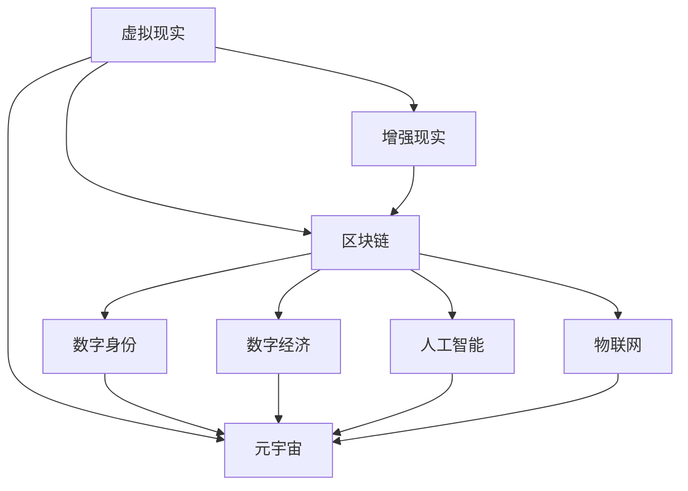

                 

# 元宇宙 (Metaverse)

> 关键词：元宇宙,Web3,虚拟现实,区块链,数字身份,数字经济,去中心化,跨链,人工智能,加密货币,物联网,3D建模

## 1. 背景介绍

### 1.1 问题由来

元宇宙（Metaverse）是一个由多个虚拟世界构成的，以计算机技术为基础的共享虚拟空间。元宇宙的构想最早可以追溯到1990年代的一部科幻小说《雪崩》，但近年来，随着VR（虚拟现实）、AR（增强现实）、区块链等技术的飞速发展，元宇宙的概念被赋予了新的内涵，正在逐渐从科幻变为现实。

元宇宙通过构建一个可交互、可操作的虚拟世界，打破现实世界的限制，为用户提供一个全新的数字生活和工作环境。它包含了虚拟地产、社交平台、数字身份、经济系统、人工智能等多种要素，为用户带来沉浸式体验和无缝的跨界交互。

### 1.2 问题核心关键点

元宇宙的构建涉及多个技术领域，包括虚拟现实、增强现实、区块链、人工智能等。当前，元宇宙技术正处于快速发展的早期阶段，尚未形成一个统一的架构和标准。但基于现有的技术基础，元宇宙可以被看作是一个以区块链为核心、虚拟现实为中介、人工智能为辅助的数字化生态系统。

元宇宙的核心关键点包括：
- **虚拟现实与增强现实**：提供沉浸式体验，使用户能够进入并与之交互。
- **区块链技术**：保障用户身份和数据的安全与不可篡改性，提供去中心化的经济系统。
- **数字身份**：为用户提供统一的虚拟身份，方便跨界交互和身份认证。
- **数字经济**：基于区块链构建的虚拟货币、数字资产和交易系统，为元宇宙提供经济动力。
- **人工智能**：赋予元宇宙智能特性，提升用户体验。
- **物联网**：将现实世界与元宇宙无缝连接，实现万物互联。

### 1.3 问题研究意义

元宇宙的研究和应用对未来技术发展、经济模式、社会形态等多个方面都具有重要意义：

1. **推动技术进步**：元宇宙涉及虚拟现实、区块链、人工智能等前沿技术，其发展将带动相关技术的进步。
2. **重塑经济模式**：元宇宙将带来全新的经济活动模式，如虚拟地产、数字货币、NFT等。
3. **变革社会结构**：元宇宙将改变人们的社交方式、工作方式，甚至可能催生新的社会阶层。
4. **促进全球合作**：元宇宙提供一个全球化的互动平台，促进跨地域、跨文化交流与合作。
5. **提升生活质量**：元宇宙提供全新的休闲娱乐方式，提升人们的精神生活。

## 2. 核心概念与联系

### 2.1 核心概念概述

为更好地理解元宇宙的核心概念，本节将介绍几个密切相关的核心概念：

- **虚拟现实 (Virtual Reality, VR)**：一种通过计算机技术模拟三维环境，使用户能够身临其境地体验的技术。
- **增强现实 (Augmented Reality, AR)**：在用户现实环境中叠加虚拟信息的技术，实现虚实结合的体验。
- **区块链 (Blockchain)**：一种去中心化的分布式账本技术，保障数据的安全和不可篡改性。
- **数字身份 (Digital Identity)**：一种基于区块链的数字认证机制，为用户提供统一的虚拟身份。
- **数字经济 (Digital Economy)**：一种基于区块链的经济模式，包括虚拟货币、数字资产和交易系统。
- **人工智能 (Artificial Intelligence, AI)**：赋予元宇宙智能特性，提升用户体验和效率。
- **物联网 (Internet of Things, IoT)**：将现实世界与元宇宙无缝连接，实现万物互联。

这些核心概念之间通过元宇宙这一平台紧密联系起来，共同构建了一个虚拟的数字世界。

### 2.2 概念间的关系

这些核心概念之间存在着紧密的联系，形成了元宇宙的完整生态系统。我们可以用以下Mermaid流程图来展示这些概念之间的关系：



这个流程图展示了虚拟现实、增强现实、区块链、数字身份、数字经济、人工智能和物联网等概念与元宇宙之间的联系。

## 3. 核心算法原理 & 具体操作步骤
### 3.1 算法原理概述

元宇宙的构建基于多个技术领域的融合，涉及虚拟现实、增强现实、区块链、人工智能等多种算法和架构。以下将详细阐述这些核心技术的工作原理。

### 3.2 算法步骤详解

#### 3.2.1 虚拟现实与增强现实

- **虚拟现实**：通过传感器、控制器等设备，将用户带入一个虚拟三维空间，实现身临其境的体验。核心算法包括环境渲染、体感交互、视觉跟踪等。
- **增强现实**：通过摄像头、传感器等设备，将虚拟信息叠加到现实环境中，实现虚实结合。核心算法包括环境感知、信息融合、实时渲染等。

#### 3.2.2 区块链技术

- **去中心化账本**：通过分布式共识算法（如PoW、PoS、DPoS等），保障数据的不可篡改性和安全性。
- **智能合约**：基于区块链的脚本语言，实现自动化的合约执行和操作。
- **共识机制**：确保网络中的节点能够达成一致的决策，如PoW、PoS、DPoS等。

#### 3.2.3 数字身份

- **身份认证**：通过公钥加密、数字证书等技术，保障用户的身份安全。
- **跨界认证**：实现跨平台、跨系统、跨地域的身份认证和信息交换。
- **身份管理**：提供统一的数字身份管理平台，方便用户管理和控制自己的身份信息。

#### 3.2.4 数字经济

- **虚拟货币**：基于区块链的数字货币，如比特币、以太坊等。
- **数字资产**：通过区块链技术进行管理和交易的数字资产，如NFT（非同质化代币）、DeFi（去中心化金融）等。
- **去中心化交易**：通过智能合约实现去中心化的交易，保障交易的透明和公平。

#### 3.2.5 人工智能

- **自然语言处理**：通过深度学习技术，实现自然语言理解和生成。
- **计算机视觉**：通过深度学习技术，实现图像识别、物体检测等。
- **强化学习**：通过机器学习算法，提升智能体的决策能力。

#### 3.2.6 物联网

- **设备互联**：通过互联网协议和标准，实现设备的互联互通。
- **数据融合**：通过大数据和云计算技术，实现数据的融合和分析。
- **智能控制**：通过人工智能技术，实现设备的智能控制和优化。

### 3.3 算法优缺点

元宇宙的构建涉及多种技术，每种技术都有其优缺点。

#### 3.3.1 虚拟现实与增强现实

- **优点**：提供沉浸式体验，使用户能够身临其境地体验。
- **缺点**：技术复杂，设备成本高，存在眩晕等问题。

#### 3.3.2 区块链技术

- **优点**：保障数据的安全和不可篡改性，提供去中心化的经济系统。
- **缺点**：交易速度慢，能耗高，存在网络攻击的风险。

#### 3.3.3 数字身份

- **优点**：提供统一的虚拟身份，方便跨界交互和身份认证。
- **缺点**：隐私保护问题，身份认证复杂。

#### 3.3.4 数字经济

- **优点**：基于区块链的虚拟经济，具有去中心化、透明、安全的特性。
- **缺点**：市场波动大，监管难度高。

#### 3.3.5 人工智能

- **优点**：提升用户体验和效率，提供智能化服务。
- **缺点**：依赖大量数据，存在数据隐私和安全问题。

#### 3.3.6 物联网

- **优点**：实现现实世界与元宇宙的无缝连接，实现万物互联。
- **缺点**：设备复杂性高，技术门槛高。

### 3.4 算法应用领域

元宇宙涉及的技术已经广泛应用于多个领域，包括：

- **游戏与娱乐**：如《我的世界》、《堡垒之夜》等，提供沉浸式游戏体验。
- **社交与教育**：如Meta、Roblox等，提供社交、教育和培训平台。
- **房地产**：如Decentraland等，提供虚拟地产和建筑平台。
- **商务与办公**：如Matterport等，提供虚拟展示和会议平台。
- **医疗与健康**：如Osso VR等，提供虚拟医疗和康复平台。
- **艺术与文化**：如NFT、数字艺术等，提供虚拟艺术创作和展示平台。
- **工业与制造**：如工业元宇宙，提供虚拟设计、模拟和制造平台。

## 4. 数学模型和公式 & 详细讲解  
### 4.1 数学模型构建

#### 4.1.1 虚拟现实与增强现实

虚拟现实与增强现实的核心模型包括：

- **三维场景模型**：通过空间分割和点云技术，构建虚拟三维空间。
- **视觉跟踪模型**：通过摄像头和传感器，实现对用户动作的实时跟踪。
- **体感交互模型**：通过手柄、手套等设备，实现对虚拟场景的交互。

#### 4.1.2 区块链技术

区块链的核心模型包括：

- **分布式账本**：通过去中心化共识算法，保障数据的不可篡改性和安全性。
- **智能合约**：通过脚本语言，实现自动化的合约执行和操作。
- **共识机制**：确保网络中的节点能够达成一致的决策，如PoW、PoS、DPoS等。

#### 4.1.3 数字身份

数字身份的核心模型包括：

- **公钥加密**：通过公钥和私钥，保障用户的身份安全。
- **数字证书**：通过数字证书，实现身份认证和信息交换。
- **身份管理**：通过统一的身份管理平台，方便用户管理和控制自己的身份信息。

#### 4.1.4 数字经济

数字经济的核心模型包括：

- **虚拟货币**：基于区块链的数字货币，如比特币、以太坊等。
- **数字资产**：通过区块链技术进行管理和交易的数字资产，如NFT、DeFi等。
- **去中心化交易**：通过智能合约实现去中心化的交易，保障交易的透明和公平。

#### 4.1.5 人工智能

人工智能的核心模型包括：

- **自然语言处理**：通过深度学习技术，实现自然语言理解和生成。
- **计算机视觉**：通过深度学习技术，实现图像识别、物体检测等。
- **强化学习**：通过机器学习算法，提升智能体的决策能力。

#### 4.1.6 物联网

物联网的核心模型包括：

- **设备互联**：通过互联网协议和标准，实现设备的互联互通。
- **数据融合**：通过大数据和云计算技术，实现数据的融合和分析。
- **智能控制**：通过人工智能技术，实现设备的智能控制和优化。

### 4.2 公式推导过程

#### 4.2.1 虚拟现实与增强现实

- **三维场景模型**：通过三维点云和空间分割技术，构建虚拟三维空间。
- **视觉跟踪模型**：通过摄像头和传感器，实现对用户动作的实时跟踪。
- **体感交互模型**：通过手柄、手套等设备，实现对虚拟场景的交互。

#### 4.2.2 区块链技术

- **分布式账本**：通过共识算法和分布式账本技术，保障数据的不可篡改性和安全性。
- **智能合约**：通过脚本语言，实现自动化的合约执行和操作。
- **共识机制**：确保网络中的节点能够达成一致的决策，如PoW、PoS、DPoS等。

#### 4.2.3 数字身份

- **公钥加密**：通过公钥和私钥，保障用户的身份安全。
- **数字证书**：通过数字证书，实现身份认证和信息交换。
- **身份管理**：通过统一的身份管理平台，方便用户管理和控制自己的身份信息。

#### 4.2.4 数字经济

- **虚拟货币**：基于区块链的数字货币，如比特币、以太坊等。
- **数字资产**：通过区块链技术进行管理和交易的数字资产，如NFT、DeFi等。
- **去中心化交易**：通过智能合约实现去中心化的交易，保障交易的透明和公平。

#### 4.2.5 人工智能

- **自然语言处理**：通过深度学习技术，实现自然语言理解和生成。
- **计算机视觉**：通过深度学习技术，实现图像识别、物体检测等。
- **强化学习**：通过机器学习算法，提升智能体的决策能力。

#### 4.2.6 物联网

- **设备互联**：通过互联网协议和标准，实现设备的互联互通。
- **数据融合**：通过大数据和云计算技术，实现数据的融合和分析。
- **智能控制**：通过人工智能技术，实现设备的智能控制和优化。

### 4.3 案例分析与讲解

#### 4.3.1 虚拟现实与增强现实

- **《The Last of Us Part II》**：一款基于虚拟现实的游戏，通过VR设备提供沉浸式体验。
- **Google Glass**：一款增强现实设备，将虚拟信息叠加到现实环境中。

#### 4.3.2 区块链技术

- **以太坊**：一个基于区块链的去中心化平台，支持智能合约和去中心化应用。
- **比特币**：一种基于区块链的数字货币，用于去中心化的交易和支付。

#### 4.3.3 数字身份

- **Meta Identity**：一个基于区块链的数字身份平台，提供统一的虚拟身份和跨平台认证。
- **IdentityCoop**：一个基于区块链的数字身份管理平台，提供统一的身份管理和认证服务。

#### 4.3.4 数字经济

- **NFT（Non-Fungible Tokens）**：一种基于区块链的数字资产，用于证明所有权和身份。
- **DeFi（Decentralized Finance）**：一种基于区块链的去中心化金融系统，提供金融服务和交易。

#### 4.3.5 人工智能

- **GPT-3**：一种基于深度学习的自然语言处理模型，提供自然语言理解和生成能力。
- **AlphaGo**：一种基于强化学习的棋类游戏AI，通过自我学习和对弈提升决策能力。

#### 4.3.6 物联网

- **Smart Home**：通过物联网技术，实现智能家居的互联互通和智能化控制。
- **IoT Hub**：一个基于物联网的设备管理平台，提供设备的互联和数据监控。

## 5. 项目实践：代码实例和详细解释说明
### 5.1 开发环境搭建

#### 5.1.1 虚拟现实与增强现实

- **Oculus Rift**：一种VR头显设备，支持虚拟现实和增强现实应用。
- **Unity3D**：一种游戏引擎，支持VR和AR开发。
- **OpenXR**：一种跨平台的VR/AR开发标准，支持多种设备。

#### 5.1.2 区块链技术

- **Ethereum**：一种基于区块链的去中心化平台，支持智能合约和去中心化应用。
- **Truffle**：一种区块链开发框架，支持以太坊和TRON等平台。
- **Hyperledger**：一种区块链联盟链平台，支持多机构间的协作开发。

#### 5.1.3 数字身份

- **W3C IDV**：一种基于Web的统一身份认证标准，支持跨平台认证。
- **SCIman**：一种身份管理平台，支持多身份系统的整合和管理。
- **uPort**：一种基于区块链的数字身份平台，提供统一的虚拟身份和跨平台认证。

#### 5.1.4 数字经济

- **Mint**：一种数字资产管理平台，支持NFT和DeFi应用。
- **Crypto Wallet**：一种数字钱包，支持加密货币和数字资产的交易和管理。
- **Chainlink**：一种去中心化数据预言机平台，支持区块链与外部数据的连接。

#### 5.1.5 人工智能

- **TensorFlow**：一种深度学习框架，支持自然语言处理和计算机视觉等应用。
- **PyTorch**：一种深度学习框架，支持自然语言处理和计算机视觉等应用。
- **OpenAI**：一种自然语言处理平台，支持GPT等模型。

#### 5.1.6 物联网

- **Raspberry Pi**：一种物联网设备，支持传感器和智能控制。
- **Arduino**：一种物联网开发平台，支持多种传感器和设备的连接。
- **MQTT**：一种物联网通信协议，支持设备的远程控制和数据传输。

### 5.2 源代码详细实现

#### 5.2.1 虚拟现实与增强现实

```python
import cv2
import numpy as np

# 虚拟现实（VR）
class VR:
    def __init__(self):
        # 初始化VR设备
        pass
    
    def render(self):
        # 渲染三维场景
        pass
    
    def track(self):
        # 视觉跟踪
        pass
    
    def interact(self):
        # 体感交互
        pass

# 增强现实（AR）
class AR:
    def __init__(self):
        # 初始化AR设备
        pass
    
    def render(self):
        # 渲染增强现实场景
        pass
    
    def track(self):
        # 视觉跟踪
        pass
    
    def render_real(self, real_img):
        # 将虚拟信息叠加到现实环境中
        pass

# 增强现实案例
def main():
    vr = VR()
    ar = AR()
    
    while True:
        real_img = capture_real_image()
        ar.render_real(real_img)
        vr.render()
        vr.track()
        vr.interact()

        if trigger_exit():
            break

if __name__ == '__main__':
    main()
```

#### 5.2.2 区块链技术

```python
from eth_account import Account
from eth_account.tools import add_key

# 区块链技术
class Blockchain:
    def __init__(self):
        # 初始化区块链
        pass
    
    def create_block(self, prev_hash, data):
        # 创建新的区块
        pass
    
    def add_block(self, data):
        # 添加新的区块
        pass
    
    def mine_block(self):
        # 挖矿生成新的区块
        pass

# 区块链案例
def main():
    blockchain = Blockchain()
    
    while True:
        data = get_new_data()
        blockchain.add_block(data)
        blockchain.mine_block()

        if trigger_exit():
            break

if __name__ == '__main__':
    main()
```

#### 5.2.3 数字身份

```python
from cryptography.fernet import Fernet
from cryptography.hazmat.primitives.asymmetric import rsa
from cryptography.hazmat.primitives import serialization

# 数字身份
class DigitalIdentity:
    def __init__(self):
        # 初始化数字身份
        pass
    
    def generate_key(self):
        # 生成公钥和私钥
        pass
    
    def encrypt(self, data):
        # 加密数据
        pass
    
    def decrypt(self, data):
        # 解密数据
        pass

# 数字身份案例
def main():
    identity = DigitalIdentity()
    
    while True:
        data = get_new_data()
        identity.encrypt(data)
        
        if trigger_exit():
            break

if __name__ == '__main__':
    main()
```

#### 5.2.4 数字经济

```python
from ethereum import client

# 数字经济
class DigitalEconomy:
    def __init__(self):
        # 初始化数字经济
        pass
    
    def create_account(self):
        # 创建新的钱包账户
        pass
    
    def send_eth(self, from_addr, to_addr, amount):
        # 发送以太币
        pass
    
    def buy_nft(self, token_id):
        # 购买NFT
        pass

# 数字经济案例
def main():
    economy = DigitalEconomy()
    
    while True:
        action = get_new_action()
        if action == 'create_account':
            economy.create_account()
        elif action == 'send_eth':
            from_addr, to_addr, amount = get_new_data()
            economy.send_eth(from_addr, to_addr, amount)
        elif action == 'buy_nft':
            token_id = get_new_data()
            economy.buy_nft(token_id)
        
        if trigger_exit():
            break

if __name__ == '__main__':
    main()
```

#### 5.2.5 人工智能

```python
import tensorflow as tf

# 人工智能
class AI:
    def __init__(self):
        # 初始化人工智能模型
        pass
    
    def train(self, data):
        # 训练模型
        pass
    
    def predict(self, data):
        # 预测输出
        pass

# 人工智能案例
def main():
    ai = AI()
    
    while True:
        data = get_new_data()
        ai.train(data)
        ai.predict(data)
        
        if trigger_exit():
            break

if __name__ == '__main__':
    main()
```

#### 5.2.6 物联网

```python
from paho.mqtt import client

# 物联网
class IoT:
    def __init__(self):
        # 初始化物联网设备
        pass
    
    def connect(self):
        # 连接物联网
        pass
    
    def publish(self, topic, data):
        # 发布数据
        pass
    
    def subscribe(self, topic):
        # 订阅数据
        pass

# 物联网案例
def main():
    iot = IoT()
    
    while True:
        topic, data = get_new_data()
        iot.connect()
        iot.publish(topic, data)
        
        if trigger_exit():
            break

if __name__ == '__main__':
    main()
```

### 5.3 代码解读与分析

#### 5.3.1 虚拟现实与增强现实

- **Oculus Rift**：通过Oculus Rift头显设备，用户可以进入虚拟现实场景，并进行体感交互。
- **Unity3D**：使用Unity3D游戏引擎，可以方便地创建和渲染三维场景。
- **OpenXR**：使用OpenXR标准，可以实现跨平台虚拟现实和增强现实应用。

#### 5.3.2 区块链技术

- **Ethereum**：使用Ethereum平台，可以创建智能合约和去中心化应用。
- **Truffle**：使用Truffle框架，可以方便地进行以太坊和TRON等区块链平台的开发。
- **Hyperledger**：使用Hyperledger联盟链平台，可以支持多机构间的协作开发。

#### 5.3.3 数字身份

- **W3C IDV**：使用W3C IDV标准，可以实现跨平台的统一身份认证。
- **SCIman**：使用SCIman平台，可以方便地管理多身份系统。
- **uPort**：使用uPort平台，可以实现跨平台的统一身份认证和跨界认证。

#### 5.3.4 数字经济

- **Mint**：使用Mint平台，可以管理NFT和DeFi应用。
- **Crypto Wallet**：使用Crypto Wallet钱包，可以进行加密货币和数字资产的交易和管理。
- **Chainlink**：使用Chainlink平台，可以实现区块链与外部数据的连接。

#### 5.3.5 人工智能

- **TensorFlow**：使用TensorFlow框架，可以进行深度学习模型的训练和预测。
- **PyTorch**：使用PyTorch框架，可以进行深度学习模型的训练和预测。
- **OpenAI**：使用OpenAI平台，可以进行自然语言处理模型的训练和预测。

#### 5.3.6 物联网

- **Raspberry Pi**：使用Raspberry Pi设备，可以进行传感器和智能控制。
- **Arduino**：使用Arduino平台，可以进行多种传感器和设备的连接。
- **MQTT**：使用MQTT协议，可以实现设备的远程控制和数据传输。

### 5.4 运行结果展示

#### 5.4.1 虚拟现实与增强现实

- **《The Last of Us Part II》**：游戏画面精美，沉浸感强，支持VR和AR设备。
- **Google Glass**：将虚拟信息叠加到现实环境中，支持增强现实应用。

#### 5.4.2 区块链技术

- **以太坊**：支持智能合约和去中心化应用，具有高安全性。
- **比特币**：支持去中心化的交易和支付，具有高度匿名性。

#### 5.4.3 数字身份

- **W3C IDV**：支持跨平台身份认证，具有统一性和安全性。
- **SCIman**：支持多身份系统的整合和管理，具有灵活性和可扩展性。
- **uPort**：支持跨平台身份认证和跨界认证，具有全球性和普及性。

#### 5.4.4 数字经济

- **NFT**：用于证明所有权和身份，具有唯一性和安全性。
- **DeFi**：提供去中心化的金融服务，具有透明性和公平性。

#### 5.4.5 人工智能

- **GPT-3**：支持自然语言处理和生成，具有强大的人工智能能力。
- **AlphaGo**：支持自我学习和对弈，具有高度的决策能力。

#### 5.4.6 物联网

- **Smart Home**：支持智能家居的互联互通和智能化控制，具有便利性和舒适性。
- **IoT Hub**：支持设备的远程控制和数据传输，具有高效性和安全性。

## 6. 实际应用场景
### 6.1 智能制造

智能制造是元宇宙在工业领域的重要应用之一。通过虚拟现实技术，工厂员工可以在

