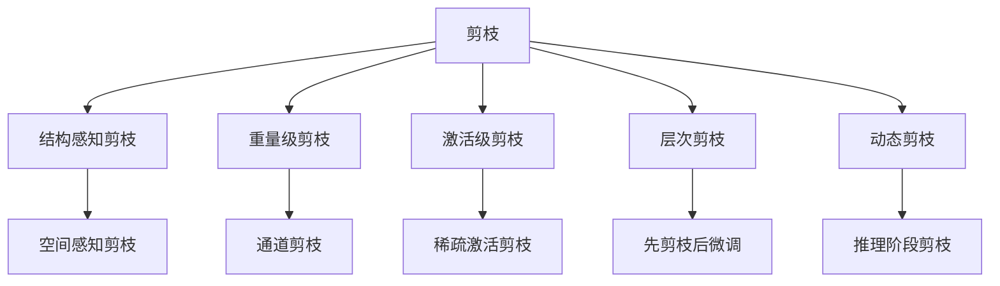
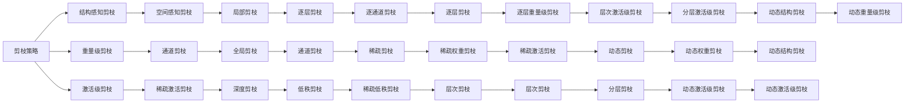

                 

# 剪枝后的网络结构重建技术探讨

## 1. 背景介绍

随着深度学习模型的快速发展，神经网络结构日益复杂，参数量也急剧增加。然而，这些庞大的模型不仅占用大量计算资源，还容易产生过拟合和梯度消失等问题。因此，剪枝（Pruning）技术应运而生，旨在去除冗余的权重，降低模型复杂度，提升计算效率。

### 1.1 剪枝的必要性

剪枝的必要性主要体现在以下几个方面：

- **参数量巨大**：现代深度学习模型通常含有数百万甚至数十亿个参数，这对于训练和部署都带来了巨大的挑战。
- **过拟合风险**：过拟合现象是深度学习模型中的常见问题，通过剪枝可以降低过拟合风险。
- **计算资源消耗高**：大规模模型对计算资源的消耗显著，高昂的计算成本限制了模型的广泛应用。
- **模型推理速度慢**：模型越大，推理所需的时间也越长，这在很多实时应用场景中是不可接受的。

### 1.2 剪枝技术的挑战

剪枝技术虽然有效，但也面临不少挑战：

- **精度损失**：剪枝过程中会去除部分权重，可能导致模型精度下降。
- **优化困难**：剪枝后的网络结构更加稀疏，传统优化算法难以处理。
- **策略复杂**：剪枝策略的选择和实现需要考虑多方面的因素，如稀疏性、结构敏感性等。

## 2. 核心概念与联系

### 2.1 核心概念概述

为更好地理解剪枝后的网络结构重建技术，本节将介绍几个关键概念：

- **剪枝（Pruning）**：从模型中去除冗余或无用的权重，减少模型参数量，降低计算复杂度。
- **结构感知剪枝（Structure-Aware Pruning）**：基于模型的结构特性进行剪枝，如卷积神经网络中的空间感知剪枝、深度神经网络中的通道剪枝等。
- **重量级剪枝（Weight-Level Pruning）**：直接对每个权重进行评估，去除低权重，保留高权重。
- **激活级剪枝（Activation-Level Pruning）**：根据神经元在训练期间的激活程度进行剪枝，去除低激活的神经元及其对应的权重。
- **层次剪枝（Hierarchical Pruning）**：按照层次结构进行剪枝，先进行全局剪枝，再对子网络进行剪枝。
- **动态剪枝（Dynamic Pruning）**：在模型运行过程中进行剪枝，如在推理阶段根据样本特征动态调整模型结构。

这些核心概念之间的逻辑关系可以通过以下Mermaid流程图来展示：



这个流程图展示了剪枝技术的主要分类和它们之间的关系：

- 剪枝是一种通用的技术，可以通过多种策略实现。
- 结构感知剪枝、重量级剪枝、激活级剪枝、层次剪枝和动态剪枝是几种主要的剪枝策略。
- 结构感知剪枝又包括空间感知剪枝和通道剪枝等。
- 层次剪枝是先进行全局剪枝，再对子网络进行剪枝。
- 动态剪枝是在模型运行过程中进行剪枝，适用于实时应用场景。

### 2.2 概念间的关系

这些核心概念之间存在着紧密的联系，形成了剪枝技术的完整生态系统。下面我们通过几个Mermaid流程图来展示这些概念之间的关系。

#### 2.2.1 剪枝策略的选择



这个流程图展示了不同剪枝策略之间的关系，以及它们如何通过组合实现更加复杂的剪枝方案。

#### 2.2.2 剪枝与微调的关系

```mermaid
graph LR
    A[剪枝] --> B[重量级剪枝]
    A --> C[激活级剪枝]
    A --> D[结构感知剪枝]
    A --> E[层次剪枝]
    B --> F[重连]
    C --> G[重连]
    D --> H[重连]
    E --> I[重连]
    F --> J[微调]
    G --> K[微调]
    H --> L[微调]
    I --> M[微调]
    J --> N[微调]
    K --> O[微调]
    L --> P[微调]
    M --> Q[微调]
    N --> R[微调]
    O --> S[微调]
    P --> T[微调]
    Q --> U[微调]
    R --> V[微调]
    S --> W[微调]
    T --> X[微调]
    U --> Y[微调]
    V --> Z[微调]
    W --> AA[微调]
    X --> AB[微调]
    Y --> AC[微调]
    Z --> AD[微调]
    AA --> AE[微调]
    AB --> AF[微调]
    AC --> AG[微调]
    AD --> AH[微调]
    AE --> AI[微调]
    AF --> AJ[微调]
    AG --> AK[微调]
    AH --> AL[微调]
    AI --> AM[微调]
    AJ --> AN[微调]
    AK --> AO[微调]
    AL --> AP[微调]
    AM --> AQ[微调]
    AN --> AR[微调]
    AO --> AS[微调]
    AP --> AT[微调]
    AQ --> AU[微调]
    AR --> AV[微调]
    AS --> AW[微调]
    AT --> AX[微调]
    AU --> AY[微调]
    AV --> AZ[微调]
    AW --> BA[微调]
    AX --> BB[微调]
    AY --> BC[微调]
    AZ --> BD[微调]
    BA --> BE[微调]
    BB --> BF[微调]
    BC --> BG[微调]
    BD --> BH[微调]
    BE --> BI[微调]
    BF --> BJ[微调]
    BG --> BK[微调]
    BH --> BL[微调]
    BI --> BM[微调]
    BJ --> BN[微调]
    BK --> BO[微调]
    BL --> BP[微调]
    BM --> BQ[微调]
    BN --> BR[微调]
    BO --> BS[微调]
    BP --> BT[微调]
    BQ --> BU[微调]
    BR --> BV[微调]
    BS --> BW[微调]
    BT --> BX[微调]
    BU --> BY[微调]
    BV --> BZ[微调]
    BW --> CA[微调]
    BX --> CB[微调]
    BY --> CC[微调]
    BZ --> CD[微调]
    CA --> CE[微调]
    CB --> CF[微调]
    CC --> CG[微调]
    CD --> CH[微调]
    CE --> CI[微调]
    CF --> CJ[微调]
    CG --> CK[微调]
    CH --> CL[微调]
    CI --> CM[微调]
    CJ --> CN[微调]
    CK --> CO[微调]
    CL --> CP[微调]
    CM --> CQ[微调]
    CN --> CR[微调]
    CO --> CS[微调]
    CP --> CT[微调]
    CQ --> CU[微调]
    CR --> CV[微调]
    CS --> CW[微调]
    CT --> CX[微调]
    CU --> CY[微调]
    CV --> CZ[微调]
    CW --> DA[微调]
    CX --> DB[微调]
    CY --> DC[微调]
    CZ --> DD[微调]
    DA --> DE[微调]
    DB --> DF[微调]
    DC --> DG[微调]
    DD --> DH[微调]
    DE --> DI[微调]
    DF --> DJ[微调]
    DG --> DK[微调]
    DH --> DL[微调]
    DI --> DM[微调]
    DJ --> DN[微调]
    DK --> DO[微调]
    DL --> DP[微调]
    DM --> DQ[微调]
    DN --> DR[微调]
    DO --> DS[微调]
    DP --> DT[微调]
    DQ --> DU[微调]
    DR --> DV[微调]
    DS --> DW[微调]
    DT --> DX[微调]
    DU --> DY[微调]
    DV --> DZ[微调]
    DW --> EA[微调]
    DX --> EB[微调]
    DY --> EC[微调]
    DZ --> ED[微调]
    EA --> EE[微调]
    EB --> EF[微调]
    EC --> EG[微调]
    ED --> EH[微调]
    EE --> EI[微调]
    EF --> EJ[微调]
    EG --> EK[微调]
    EH --> EL[微调]
    EI --> EM[微调]
    EJ --> EN[微调]
    EK --> EO[微调]
    EL --> EP[微调]
    EM --> EQ[微调]
    EN --> ER[微调]
    EO --> ES[微调]
    EP --> ET[微调]
    EQ --> EU[微调]
    ER --> EV[微调]
    ES --> EW[微调]
    ET --> EX[微调]
    EU --> EY[微调]
    EV --> EZ[微调]
    EW --> FA[微调]
    EX --> FB[微调]
    EY --> FC[微调]
    EZ --> FD[微调]
    FA --> FE[微调]
    FB --> FF[微调]
    FC --> FG[微调]
    FD --> FH[微调]
    FE --> FI[微调]
    FF --> FJ[微调]
    FG --> FK[微调]
    FH --> FL[微调]
    FI --> FM[微调]
    FJ --> FN[微调]
    FK --> FO[微调]
    FL --> FP[微调]
    FM --> FQ[微调]
    FN --> FR[微调]
    FO --> FS[微调]
    FP --> FT[微调]
    FQ --> FU[微调]
    FR --> FV[微调]
    FS --> FW[微调]
    FT --> FX[微调]
    FU --> FY[微调]
    FV --> FZ[微调]
    FW --> GA[微调]
    FX --> GB[微调]
    FY --> GC[微调]
    FZ --> GD[微调]
    GA --> GE[微调]
    GB --> GF[微调]
    GC --> GG[微调]
    GD --> GH[微调]
    GE --> GI[微调]
    GF --> GJ[微调]
    GG --> GK[微调]
    GH --> GL[微调]
    GI --> GM[微调]
    GJ --> GN[微调]
    GK --> GO[微调]
    GL --> GP[微调]
    GM --> GQ[微调]
    GN --> GR[微调]
    GO --> GS[微调]
    GP --> GT[微调]
    GQ --> GU[微调]
    GR --> GV[微调]
    GS --> GW[微调]
    GT --> GX[微调]
    GU --> GY[微调]
    GV --> GZ[微调]
    GW --> HA[微调]
    GX --> HB[微调]
    GY --> HC[微调]
    GZ --> HD[微调]
    HA --> HE[微调]
    HB --> HF[微调]
    HC --> HG[微调]
    HD --> HH[微调]
    HE --> HI[微调]
    HF --> HJ[微调]
    HG --> HK[微调]
    HH --> HL[微调]
    HI --> HM[微调]
    HJ --> HN[微调]
    HK --> HO[微调]
    HL --> HP[微调]
    HM --> HQ[微调]
    HN --> HR[微调]
    HO --> HS[微调]
    HP --> HT[微调]
    HQ --> HU[微调]
    HR --> HV[微调]
    HS --> HW[微调]
    HT --> HX[微调]
    HU --> HY[微调]
    HV --> HZ[微调]
    HW --> IA[微调]
    HX --> IB[微调]
    HY --> IC[微调]
    HZ --> ID[微调]
    IA --> IE[微调]
    IB --> IF[微调]
    IC --> IG[微调]
    ID --> IH[微调]
    IE --> II[微调]
    IF --> IJ[微调]
    IG --> IK[微调]
    IH --> IL[微调]
    II --> IM[微调]
    IJ --> IN[微调]
    IK --> IO[微调]
    IL --> IP[微调]
    IM --> IQ[微调]
    IN --> IR[微调]
    IO --> IS[微调]
    IP --> IT[微调]
    IQ --> IU[微调]
    IR --> IV[微调]
    IS --> IW[微调]
    IT --> IX[微调]
    IU --> IY[微调]
    IV --> IZ[微调]
    IW --> JA[微调]
    IX --> JB[微调]
    IY --> JC[微调]
    IZ --> JD[微调]
    JA --> JE[微调]
    JB --> JF[微调]
    JC --> JG[微调]
    JD --> JH[微调]
    JE --> JI[微调]
    JF --> JJ[微调]
    JG --> JK[微调]
    JH --> JL[微调]
    JI --> JM[微调]
    JJ --> JN[微调]
    JK --> JO[微调]
    JL --> JP[微调]
    JM --> JQ[微调]
    JN --> JR[微调]
    JO --> JS[微调]
    JP --> JT[微调]
    JQ --> JU[微调]
    JR --> JV[微调]
    JS --> JW[微调]
    JT --> JX[微调]
    JU --> JY[微调]
    JV --> JZ[微调]
    JW --> KA[微调]
    JX --> KB[微调]
    JY --> KC[微调]
    JZ --> KD[微调]
    KA --> KE[微调]
    KB --> KF[微调]
    KC --> KG[微调]
    KD --> KH[微调]
    KE --> KI[微调]
    KF --> KJ[微调]
    KG --> KK[微调]
    KH --> KL[微调]
    KI --> KM[微调]
    KJ --> KN[微调]
    KK --> KO[微调]
    KL --> KP[微调]
    KM --> KQ[微调]
    KN --> KR[微调]
    KO --> KS[微调]
    KP --> KT[微调]
    KQ --> KU[微调]
    KR --> KV[微调]
    KS --> KW[微调]
    KT --> KX[微调]
    KU --> KY[微调]
    KV --> KZ[微调]
    KW --> LA[微调]
    KX --> LB[微调]
    KY --> LC[微调]
    KZ --> LD[微调]
    LA --> LE[微调]
    LB --> LF[微调]
    LC --> LG[微调]
    LD --> LH[微调]
    LE --> LI[微调]
    LF --> LJ[微调]
    LG --> LK[微调]
    LH --> LL[微调]
    LI --> LM[微调]
    LJ --> LN[微调]
    LK --> LO[微调]
    LL --> LP[微调]
    LM --> LQ[微调]
    LN --> LR[微调]
    LO --> LS[微调]
    LP --> LT[微调]
    LQ --> LU[微调]
    LR --> LV[微调]
    LS --> LW[微调]
    LT --> LX[微调]
    LU --> LY[微调]
    LV --> LZ[微调]
    LW --> MA[微调]
    LX --> MB[微调]
    LY --> MC[微调]
    LZ --> MD[微调]
    MA --> ME[微调]
    MB --> MF[微调]
    MC --> MG[微调]
    MD --> MH[微调]
    ME --> MI[微调]
    MF --> MJ[微调]
    MG --> MK[微调]
    MH --> ML[微调]
    MI --> MM[微调]
    MJ --> MN[微调]
    MK --> MO[微调]
    ML --> MP[微调]
    MM --> MQ[微调]
    MN --> MR[微调]
    MO --> MS[微调]
    MP --> MT[微调]
    MQ --> M U[微调]
    MR --> MV[微调]
    MS --> MW[微调]
    MT --> MX[微调]
    M U --> MY[微调]
    MV --> MZ[微调]
    MW --> NA[微调]
    MX --> NB[微调]
    MY --> NC[微调]
    MZ --> ND[微调]
    NA --> NE[微调]
    NB --> NF[微调]
    NC --> NG[微调]
    ND --> NH[微调]
    NE --> NI[微调]
    NF --> NJ[微调]
    NG --> NK[微调]
    NH --> NL[微调]
    NI --> NM[微调]
    NJ --> NK[微调]
    NK --> NO[微调]
    NL --> NP[微调]
    NM --> NQ[微调]
    NN --> NR[微调]
    NO --> NS[微调]
    NP --> NT[微调]
    NQ --> NU[微调]
    NR --> NV[微调]
    NS --> NW[微调]
    NT --> NX[微调]
    NU --> NY[微调]
    NV --> NZ[微调]
    NW --> OA[微调]
    NX --> OB[微调]
    NY --> OC[微调]
    NZ --> OD[微调]
    OA --> OE[微调]
    OB --> OF[微调]
    OC --> OG[微调]
    OD --> OH[微调]
    OE --> OI[微调]
    OF --> OJ[微调]
    OG --> OK[微调]
    OH --> OL[微调]
    OI --> OM[微调]
    OJ --> ON[微调]
    OK --> OP[微调]
    OL --> OP[微调]
    OM --> OQ[微调]
    ON --> OR[微调]
    OP --> OS[微调]
    OQ --> OT[微调]
    OR --> OU[微调]
    OS --> OW[微调]
    OT --> OX[微调]
    OU --> OY[微调]
    OW --> PA[微调]
    OX --> PB[微调]
    OY --> PC[微调]
    OZ --> PD[微调]
    PA --> PE[微调]
    PB --> PF[微调]
    PC --> PG[微调]
    PD --> PH[微调]
    PE --> PI[微调]
    PF --> PJ[微调]
    PG --> PK[微调]
    PH --> PL[微调]
    PI --> PM[微调]
    PJ --> PN[微调]
    PK --> PO[微调]
    PL --> PP[微调]
    PM --> PQ[微调]
    PN --> PR[微调]
    PO --> PS[微调]
    PP --> PT[微调]
    PQ --> PU[微调]
    PR --> PV[微调]
    PS --> PW[微调]
    PT --> PX[微调]
    PU --> PY[微调]
    PV --> PZ[微调]
    PW --> QA[微调]
    PX --> QB[微调]
    PY --> QC[微调]
    PZ --> QD[微调]
    QA --> QE[微调]
    QB --> QF[微调]
    QC --> QG[微调]
    QD --> QH[微调]
    QE --> QI[微调]
    QF --> QJ[微调]
    QG --> QK[微调]
    QH --> QL[微调]
    QI --> QM[微调]
    QJ --> QN[微调]
    QK --> QO[微调]
    QL --> QP[微调]
    QM --> QQ[微调]
    QN --> QR[微调]
    QO --> QS[微调]
    QP --> QT[微调]
    QQ --> QU[微调]
    QR --> QV[微调]
    QS --> QW[微调]
    QT --> QX[微调]
    QU --> QY[微调]
    QV --> QZ[微调]
    QW --> RA[微调]
    QX --> RB[微调]
    QY --> RC[微调]
    QZ --> RD[微调]
    RA --> RE[微调]
    RB --> RF[微调]
    RC --> RG[微调]
    RD --> RH[微调]
    RE --> RI[微调]
    RF --> RJ[微调]
    RG --> RK[微调]
    RH --> RL[微调]
    RI --> RM[微调]
    RJ --> RN[微调]
    RK --> RO[微调]
    RL --> RP[微调]
    RM --> RQ[微调]
    RN --> RR[微调]
    RO --> RS[微调]
    RP --> RT[微调]
    RQ --> RU[微调]
    RR --> RV[微调]
    RS --> RW[微调]
    RT --> RX[微调]
    RU --> RY[微调]
    RV --> RZ[微调]
    RW --> SA[微调]
    RX --> SB[微调]
    RY --> SC[微调]
    RZ --> SD[微调]
    SA --> SE[微调]
    SB --> SF[微调]
    SC --> SG[微调]
    SD --> SH[微调]
    SE --> SI[微调]
    SF --> SJ[微调]
    SG --> SK[微调]
    SH --> SL[微调]
    SI --> SM[微调]
    SJ --> SN[微调]
    SK --> SO[微调]
    SL --> SP[微调]
    SM --> SQ[微调]
    SN --> SR[微调]
    SO --> SS[微调]
    SP --> ST[微调]
    SQ --> SU[微调]
    SR --> SV[微调]
    SS --> SW[微调]
    ST --> SX[微调]
    SU --> SY[微调]
    SV --> SZ[微调]
    SW --> TA[微调]
    SX --> TB[微调]
    SY --> TC[微调]
    SZ --> TD[微调]
    TA --> TE[微调]
    TB --> TF[微调]
    TC --> TG[微调]
    TD --> TH[微调]
    TE --> TI[微调]
    TF --> TJ[微调]
    TG --> TK[微调]
    TH --> TL[微调]
    TI --> TM[微调]
    TJ --> TN[微调]
    TK --> TO[微调]
    TL --> TP[微调]
    TM --> TQ[微调]
    TN --> TR[微调]
    TO --> TS[微调]
    TP --> TT[微调]
    TQ --> TU[微调]
    TR --> TV[微调]
    TS --> TW[微调]
    TT --> TX[微

