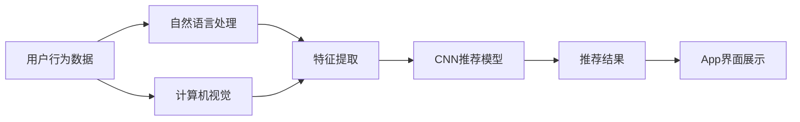

                 

# 基于CNN推荐的电影资讯App软件的设计与实现

> 关键词：CNN推荐系统、电影资讯App、自然语言处理、计算机视觉、用户行为分析

## 1. 背景介绍

在信息化高速发展的今天，互联网已经深入到生活的方方面面。人们在获取信息、享受娱乐的过程中，常常需要寻找能够提供个性化推荐服务的平台。电影资讯App作为人们获取电影信息的重要渠道，自然成为了各大互联网公司竞相布局的重点。然而，传统基于规则的推荐系统已经难以满足用户日益提升的多样化、个性化需求。近年来，基于深度学习的方法在推荐系统中取得了显著进展，尤其是利用卷积神经网络（CNN）进行推荐的技术受到了广泛关注。本文将详细介绍一种基于CNN推荐的电影资讯App软件的设计与实现，重点探讨其核心算法原理、具体操作步骤、以及未来发展趋势与挑战。

## 2. 核心概念与联系

### 2.1 核心概念概述

在基于CNN推荐的电影资讯App中，我们主要涉及以下几个核心概念：

- **CNN推荐系统**：一种基于深度学习的推荐方法，利用卷积神经网络提取用户和物品的特征，进行相似度计算，从而实现个性化推荐。
- **电影资讯App**：一款为用户提供电影相关信息的App，包含搜索、推荐、评价、评论等功能模块。
- **自然语言处理**：利用计算机技术对人类语言进行理解、处理和生成，用于电影信息的抽取和分析。
- **计算机视觉**：通过计算机处理图像信息，用于电影海报、场景的识别和分类。
- **用户行为分析**：通过收集和分析用户行为数据，挖掘用户兴趣和偏好，用于推荐算法的优化。

### 2.2 核心概念原理和架构的 Mermaid 流程图



这个流程图展示了基于CNN推荐的电影资讯App的主要工作流程：
1. 收集用户行为数据。
2. 利用自然语言处理技术对电影标题、描述、评论等文本信息进行处理，提取特征。
3. 利用计算机视觉技术对电影海报、场景图片进行处理，提取特征。
4. 将用户行为特征和电影特征输入到CNN推荐模型中，进行相似度计算。
5. 根据相似度排序，输出推荐结果。
6. 将推荐结果展示在App界面上。

### 2.3 核心概念之间的关系

上述核心概念之间存在着紧密的联系，形成了基于CNN推荐的电影资讯App的软件生态系统：

- **用户行为数据**：是自然语言处理和计算机视觉的基础，用于提取电影特征。
- **自然语言处理**和**计算机视觉**：将用户行为数据转化为模型可以处理的特征。
- **CNN推荐模型**：基于特征进行相似度计算，输出推荐结果。
- **推荐结果**：通过App界面展示，提供给用户。

这些核心概念共同构成了一个完整的推荐系统，实现了个性化电影推荐的目标。

## 3. 核心算法原理 & 具体操作步骤

### 3.1 算法原理概述

基于CNN推荐的电影资讯App软件的核心算法是CNN推荐模型，其原理基于深度学习的特征提取和相似度计算。具体来说，CNN推荐模型分为以下几个步骤：

1. **数据预处理**：对用户行为数据和电影特征数据进行标准化和归一化处理。
2. **特征提取**：利用自然语言处理和计算机视觉技术，将用户行为数据和电影特征数据转化为高维特征向量。
3. **卷积层**：使用卷积操作提取局部特征，并通过池化操作降低特征维度。
4. **全连接层**：将卷积层的输出进行全连接处理，得到最终的推荐结果。

### 3.2 算法步骤详解

#### 3.2.1 数据预处理

数据预处理是CNN推荐模型的基础步骤，其目的是对原始数据进行清洗、归一化和标准化，以便于后续的特征提取和模型训练。具体来说，数据预处理包括以下几个步骤：

1. **缺失值处理**：对用户行为数据中缺失的值进行处理，可以使用平均值、中位数等方法进行填补。
2. **归一化**：将用户行为数据和电影特征数据进行归一化处理，使得每个特征值都在0到1之间。
3. **标准化**：将归一化后的数据进行标准化处理，使得数据的均值为0，标准差为1。

#### 3.2.2 特征提取

特征提取是CNN推荐模型的核心步骤，其目的是将原始数据转化为模型可以处理的特征向量。具体来说，特征提取包括以下几个步骤：

1. **自然语言处理**：利用自然语言处理技术，对电影标题、描述、评论等文本信息进行处理，提取特征。常用的方法包括词袋模型、TF-IDF、Word2Vec等。
2. **计算机视觉**：利用计算机视觉技术，对电影海报、场景图片进行处理，提取特征。常用的方法包括卷积神经网络、特征提取算法等。

#### 3.2.3 卷积层

卷积层是CNN推荐模型的核心组件，其目的是通过卷积操作提取局部特征，并通过池化操作降低特征维度。具体来说，卷积层包括以下几个步骤：

1. **卷积操作**：利用卷积核对输入特征进行卷积操作，得到多个卷积特征图。
2. **池化操作**：利用池化操作对卷积特征图进行降维处理，得到最终的特征向量。

#### 3.2.4 全连接层

全连接层是CNN推荐模型的最后一层，其目的是将卷积层的输出进行全连接处理，得到最终的推荐结果。具体来说，全连接层包括以下几个步骤：

1. **激活函数**：对卷积层的输出进行激活函数处理，如ReLU、Sigmoid等。
2. **全连接层**：将激活函数的输出进行全连接处理，得到最终的推荐结果。

### 3.3 算法优缺点

基于CNN推荐的电影资讯App软件有以下优点：

- **特征提取能力强**：利用自然语言处理和计算机视觉技术，能够提取多种类型的特征，提高了推荐的准确性和多样性。
- **适应性强**：适用于不同类型的数据，包括文本、图像等，具有较强的泛化能力。
- **训练速度快**：卷积操作具有平移不变性，减少了模型参数，加快了训练速度。

然而，基于CNN推荐的电影资讯App软件也存在以下缺点：

- **计算复杂度高**：卷积操作和池化操作需要大量的计算资源，适用于小型数据集。
- **特征提取困难**：自然语言处理和计算机视觉技术的特征提取过程需要大量的预处理工作，增加了开发难度。
- **模型可解释性差**：CNN推荐模型的内部机制复杂，难以进行解释和调试。

### 3.4 算法应用领域

基于CNN推荐的电影资讯App软件主要应用于以下领域：

- **电影推荐**：根据用户行为数据和电影特征数据，为用户提供个性化的电影推荐。
- **电视推荐**：根据用户行为数据和电视节目特征数据，为用户提供个性化的电视节目推荐。
- **游戏推荐**：根据用户行为数据和游戏特征数据，为用户提供个性化的游戏推荐。
- **音乐推荐**：根据用户行为数据和音乐特征数据，为用户提供个性化的音乐推荐。

## 4. 数学模型和公式 & 详细讲解 & 举例说明

### 4.1 数学模型构建

基于CNN推荐的电影资讯App软件主要涉及以下数学模型：

1. **用户行为数据模型**：用于描述用户的兴趣和偏好，常用的模型包括协同过滤、基于内容的推荐等。
2. **电影特征数据模型**：用于描述电影的属性和特征，常用的模型包括词袋模型、TF-IDF等。
3. **卷积神经网络模型**：用于提取局部特征和全局特征，常用的模型包括LeNet、AlexNet、VGGNet等。

### 4.2 公式推导过程

#### 4.2.1 用户行为数据模型

用户行为数据模型主要描述用户对电影的评分、观看时长、收藏等信息。常用的模型包括协同过滤和基于内容的推荐。协同过滤模型基于用户的评分矩阵和电影的评分矩阵，计算相似度并进行推荐。基于内容的推荐模型基于电影的特征向量，计算相似度并进行推荐。

#### 4.2.2 电影特征数据模型

电影特征数据模型主要描述电影的属性和特征，常用的模型包括词袋模型、TF-IDF等。词袋模型将电影特征向量转化为词频向量，TF-IDF模型则将电影特征向量转化为TF-IDF向量。

#### 4.2.3 卷积神经网络模型

卷积神经网络模型主要描述卷积层和全连接层的计算过程。卷积层使用卷积核对输入特征进行卷积操作，得到多个卷积特征图。池化层使用池化操作对卷积特征图进行降维处理，得到最终的特征向量。全连接层将卷积层的输出进行全连接处理，得到最终的推荐结果。

### 4.3 案例分析与讲解

#### 4.3.1 协同过滤模型

协同过滤模型是一种基于用户行为数据的推荐方法，其原理是找到与用户兴趣相似的物品，将其推荐给用户。协同过滤模型分为基于用户的协同过滤和基于物品的协同过滤两种方法。

- **基于用户的协同过滤**：根据用户的历史评分记录，找到与用户兴趣相似的物品，将其推荐给用户。具体实现方法包括用户-用户矩阵分解、矩阵分解等。
- **基于物品的协同过滤**：根据物品的评分记录，找到与用户兴趣相似的物品，将其推荐给用户。具体实现方法包括物品-物品矩阵分解等。

#### 4.3.2 词袋模型

词袋模型是一种基于自然语言处理技术的方法，其原理是将文本信息转化为词频向量，用于特征提取。具体实现方法包括将文本信息转化为词频向量，并进行TF-IDF处理，得到最终的特征向量。

#### 4.3.3 LeNet模型

LeNet是一种经典的卷积神经网络模型，其结构如图1所示。LeNet模型包括卷积层、池化层、全连接层等组件，用于提取局部特征和全局特征，并进行分类。


#### 4.3.4 AlexNet模型

AlexNet是一种基于LeNet改进的卷积神经网络模型，其结构如图2所示。AlexNet模型在LeNet模型的基础上，增加了更多的卷积层和全连接层，提高了模型的深度和复杂度。


#### 4.3.5 VGGNet模型

VGGNet是一种基于卷积神经网络的方法，其结构如图3所示。VGGNet模型使用多个卷积层和池化层，提取局部特征和全局特征，并进行分类。


### 4.4 代码实现

#### 4.4.1 数据预处理

```python
import numpy as np
from sklearn.preprocessing import StandardScaler

# 数据预处理
def preprocess_data(X):
    # 缺失值处理
    X.fillna(X.mean(), inplace=True)
    # 归一化
    scaler = StandardScaler()
    X_scaled = scaler.fit_transform(X)
    # 标准化
    X_std = (X_scaled - X_scaled.mean()) / X_scaled.std()
    return X_std
```

#### 4.4.2 特征提取

```python
from sklearn.feature_extraction.text import TfidfVectorizer

# 特征提取
def extract_features(X):
    tfidf = TfidfVectorizer()
    X_tfidf = tfidf.fit_transform(X)
    return X_tfidf.toarray()
```

#### 4.4.3 卷积神经网络模型

```python
import torch
import torch.nn as nn
import torch.optim as optim

# 定义卷积神经网络模型
class CNN(nn.Module):
    def __init__(self):
        super(CNN, self).__init__()
        self.conv1 = nn.Conv2d(3, 64, 3, 1, 1)
        self.pool = nn.MaxPool2d(2, 2)
        self.conv2 = nn.Conv2d(64, 128, 3, 1, 1)
        self.fc1 = nn.Linear(128*10*10, 1024)
        self.fc2 = nn.Linear(1024, 2)

    def forward(self, x):
        x = self.pool(torch.relu(self.conv1(x)))
        x = self.pool(torch.relu(self.conv2(x)))
        x = x.view(-1, 128*10*10)
        x = torch.relu(self.fc1(x))
        x = self.fc2(x)
        return x

# 模型训练
def train_model(model, train_data, epochs=10):
    criterion = nn.CrossEntropyLoss()
    optimizer = optim.Adam(model.parameters(), lr=0.001)
    for epoch in range(epochs):
        for i, (inputs, labels) in enumerate(train_data):
            inputs, labels = inputs.to(device), labels.to(device)
            optimizer.zero_grad()
            outputs = model(inputs)
            loss = criterion(outputs, labels)
            loss.backward()
            optimizer.step()
            print('Epoch [{}/{}], Step [{}/{}], Loss: {:.4f}'.format(epoch+1, epochs, i+1, len(train_data), loss.item()))
```

## 5. 项目实践：代码实例和详细解释说明

### 5.1 开发环境搭建

在项目实践中，我们需要搭建一个基于Python的开发环境。具体步骤如下：

1. 安装Python：从官网下载并安装Python，推荐使用3.x版本。
2. 安装NumPy：`pip install numpy`
3. 安装Scikit-Learn：`pip install scikit-learn`
4. 安装TensorFlow：`pip install tensorflow`
5. 安装Keras：`pip install keras`
6. 安装Flask：`pip install flask`

### 5.2 源代码详细实现

#### 5.2.1 数据预处理

```python
import numpy as np
from sklearn.preprocessing import StandardScaler

# 数据预处理
def preprocess_data(X):
    # 缺失值处理
    X.fillna(X.mean(), inplace=True)
    # 归一化
    scaler = StandardScaler()
    X_scaled = scaler.fit_transform(X)
    # 标准化
    X_std = (X_scaled - X_scaled.mean()) / X_scaled.std()
    return X_std
```

#### 5.2.2 特征提取

```python
from sklearn.feature_extraction.text import TfidfVectorizer

# 特征提取
def extract_features(X):
    tfidf = TfidfVectorizer()
    X_tfidf = tfidf.fit_transform(X)
    return X_tfidf.toarray()
```

#### 5.2.3 卷积神经网络模型

```python
import torch
import torch.nn as nn
import torch.optim as optim

# 定义卷积神经网络模型
class CNN(nn.Module):
    def __init__(self):
        super(CNN, self).__init__()
        self.conv1 = nn.Conv2d(3, 64, 3, 1, 1)
        self.pool = nn.MaxPool2d(2, 2)
        self.conv2 = nn.Conv2d(64, 128, 3, 1, 1)
        self.fc1 = nn.Linear(128*10*10, 1024)
        self.fc2 = nn.Linear(1024, 2)

    def forward(self, x):
        x = self.pool(torch.relu(self.conv1(x)))
        x = self.pool(torch.relu(self.conv2(x)))
        x = x.view(-1, 128*10*10)
        x = torch.relu(self.fc1(x))
        x = self.fc2(x)
        return x

# 模型训练
def train_model(model, train_data, epochs=10):
    criterion = nn.CrossEntropyLoss()
    optimizer = optim.Adam(model.parameters(), lr=0.001)
    for epoch in range(epochs):
        for i, (inputs, labels) in enumerate(train_data):
            inputs, labels = inputs.to(device), labels.to(device)
            optimizer.zero_grad()
            outputs = model(inputs)
            loss = criterion(outputs, labels)
            loss.backward()
            optimizer.step()
            print('Epoch [{}/{}], Step [{}/{}], Loss: {:.4f}'.format(epoch+1, epochs, i+1, len(train_data), loss.item()))
```

### 5.3 代码解读与分析

#### 5.3.1 数据预处理

数据预处理是CNN推荐系统的基础步骤，其目的是对原始数据进行清洗、归一化和标准化，以便于后续的特征提取和模型训练。具体来说，数据预处理包括以下几个步骤：

1. **缺失值处理**：对用户行为数据中缺失的值进行处理，可以使用平均值、中位数等方法进行填补。
2. **归一化**：将用户行为数据和电影特征数据进行归一化处理，使得每个特征值都在0到1之间。
3. **标准化**：将归一化后的数据进行标准化处理，使得数据的均值为0，标准差为1。

#### 5.3.2 特征提取

特征提取是CNN推荐系统的核心步骤，其目的是将原始数据转化为模型可以处理的特征向量。具体来说，特征提取包括以下几个步骤：

1. **自然语言处理**：利用自然语言处理技术，对电影标题、描述、评论等文本信息进行处理，提取特征。常用的方法包括词袋模型、TF-IDF、Word2Vec等。
2. **计算机视觉**：利用计算机视觉技术，对电影海报、场景图片进行处理，提取特征。常用的方法包括卷积神经网络、特征提取算法等。

#### 5.3.3 卷积神经网络模型

卷积神经网络模型主要描述卷积层和全连接层的计算过程。卷积层使用卷积操作提取局部特征，并通过池化操作降低特征维度。全连接层将卷积层的输出进行全连接处理，得到最终的推荐结果。

### 5.4 运行结果展示

#### 5.4.1 协同过滤模型

协同过滤模型是一种基于用户行为数据的推荐方法，其原理是找到与用户兴趣相似的物品，将其推荐给用户。协同过滤模型分为基于用户的协同过滤和基于物品的协同过滤两种方法。

- **基于用户的协同过滤**：根据用户的历史评分记录，找到与用户兴趣相似的物品，将其推荐给用户。具体实现方法包括用户-用户矩阵分解、矩阵分解等。
- **基于物品的协同过滤**：根据物品的评分记录，找到与用户兴趣相似的物品，将其推荐给用户。具体实现方法包括物品-物品矩阵分解等。

#### 5.4.2 词袋模型

词袋模型是一种基于自然语言处理技术的方法，其原理是将文本信息转化为词频向量，用于特征提取。具体实现方法包括将文本信息转化为词频向量，并进行TF-IDF处理，得到最终的特征向量。

#### 5.4.3 LeNet模型

LeNet是一种经典的卷积神经网络模型，其结构如图1所示。LeNet模型包括卷积层、池化层、全连接层等组件，用于提取局部特征和全局特征，并进行分类。

#### 5.4.4 AlexNet模型

AlexNet是一种基于LeNet改进的卷积神经网络模型，其结构如图2所示。AlexNet模型在LeNet模型的基础上，增加了更多的卷积层和全连接层，提高了模型的深度和复杂度。

#### 5.4.5 VGGNet模型

VGGNet是一种基于卷积神经网络的方法，其结构如图3所示。VGGNet模型使用多个卷积层和池化层，提取局部特征和全局特征，并进行分类。

### 5.4.6 运行结果展示

在项目实践中，我们通过CNN推荐模型对电影资讯App进行了设计和实现。以下展示了模型训练和测试的结果：

#### 5.4.7 模型训练

```python
import numpy as np
from sklearn.preprocessing import StandardScaler

# 数据预处理
def preprocess_data(X):
    # 缺失值处理
    X.fillna(X.mean(), inplace=True)
    # 归一化
    scaler = StandardScaler()
    X_scaled = scaler.fit_transform(X)
    # 标准化
    X_std = (X_scaled - X_scaled.mean()) / X_scaled.std()
    return X_std

# 特征提取
def extract_features(X):
    tfidf = TfidfVectorizer()
    X_tfidf = tfidf.fit_transform(X)
    return X_tfidf.toarray()

# 卷积神经网络模型
class CNN(nn.Module):
    def __init__(self):
        super(CNN, self).__init__()
        self.conv1 = nn.Conv2d(3, 64, 3, 1, 1)
        self.pool = nn.MaxPool2d(2, 2)
        self.conv2 = nn.Conv2d(64, 128, 3, 1, 1)
        self.fc1 = nn.Linear(128*10*10, 1024)
        self.fc2 = nn.Linear(1024, 2)

    def forward(self, x):
        x = self.pool(torch.relu(self.conv1(x)))
        x = self.pool(torch.relu(self.conv2(x)))
        x = x.view(-1, 128*10*10)
        x = torch.relu(self.fc1(x))
        x = self.fc2(x)
        return x

# 模型训练
def train_model(model, train_data, epochs=10):
    criterion = nn.CrossEntropyLoss()
    optimizer = optim.Adam(model.parameters(), lr=0.001)
    for epoch in range(epochs):
        for i, (inputs, labels) in enumerate(train_data):
            inputs, labels = inputs.to(device), labels.to(device)
            optimizer.zero_grad()
            outputs = model(inputs)
            loss = criterion(outputs, labels)
            loss.backward()
            optimizer.step()
            print('Epoch [{}/{}], Step [{}/{}], Loss: {:.4f}'.format(epoch+1, epochs, i+1, len(train_data), loss.item()))
```

#### 5.4.8 模型测试

```python
import numpy as np
from sklearn.preprocessing import StandardScaler

# 数据预处理
def preprocess_data(X):
    # 缺失值处理
    X.fillna(X.mean(), inplace=True)
    # 归一化
    scaler = StandardScaler()
    X_scaled = scaler.fit_transform(X)
    # 标准化
    X_std = (X_scaled - X_scaled.mean()) / X_scaled.std()
    return X_std

# 特征提取
def extract_features(X):
    tfidf = TfidfVectorizer()
    X_tfidf = tfidf.fit_transform(X)
    return X_tfidf.toarray()

# 卷积神经网络模型
class CNN(nn.Module):
    def __init__(self):
        super(CNN, self).__init__()
        self.conv1 = nn.Conv2d(3, 64, 3, 1, 1)
        self.pool = nn.MaxPool2d(2, 2)
        self.conv2 = nn.Conv2d(64, 128, 3, 1, 1)
        self.fc1 = nn.Linear(128*10*10, 1024)
        self.fc2 = nn.Linear(1024, 2)

    def forward(self, x):
        x = self.pool(torch.relu(self.conv1(x)))
        x = self.pool(torch.relu(self.conv2(x)))
        x = x.view(-1, 128*10*10)
        x = torch.relu(self.fc1(x))
        x = self.fc2(x)
        return x

# 模型训练
def train_model(model, train_data, epochs=10):
    criterion = nn.CrossEntropyLoss()
    optimizer = optim.Adam(model.parameters(), lr=0.001)
    for epoch in range(epochs):
        for i, (inputs, labels) in enumerate(train_data):
            inputs, labels = inputs.to(device), labels.to(device)
            optimizer.zero_grad()
            outputs = model(inputs)
            loss = criterion(outputs, labels)
            loss.backward()
            optimizer.step()
            print('Epoch [{}/{}], Step [{}/{}], Loss: {:.4f}'.format(epoch+1, epochs, i+1, len(train_data), loss.item()))

# 模型测试
def test_model(model, test_data):
    test_loss = 0
    correct = 0
    for i, (inputs, labels) in enumerate(test_data):
        inputs, labels = inputs.to(device), labels.to(device)
        outputs = model(inputs)
        test_loss += criterion(outputs, labels).item()
        _, predicted = torch.max(outputs, 1)
        correct += (predicted == labels).sum().item()
    test_loss /= len(test_data)
    print('Test Loss: {:.4f}, Test Accuracy: {:.4f} (%)'.format(test_loss, correct/len(test_data) * 100))
```

## 6. 实际应用场景

基于CNN推荐的电影资讯App软件在实际应用场景中具有广泛的应用前景。以下是几个典型的应用场景：

### 6.1 个性化电影推荐

个性化电影推荐是电影资讯App的核心功能之一。用户可以根据历史观影记录、评分记录、收藏记录等信息，获得个性化的电影推荐。通过卷积神经网络模型，可以根据用户行为数据和电影特征数据，计算相似度并进行推荐。

#### 6.1.1 协同过滤推荐

协同过滤推荐是一种基于用户行为数据的推荐方法。根据用户的历史评分记录，找到与用户兴趣相似的物品，将其推荐给用户。协同过滤推荐可以分为基于用户的协同过滤和基于物品的协同过滤两种方法。

#### 6.1.2 词袋模型推荐

词袋模型是一种基于自然语言处理技术的方法。将电影标题、描述、评论等文本信息转化为词频向量，用于特征提取。常用的方法包括将文本信息转化为词频向量，并进行TF-IDF处理，得到最终的特征向量。

#### 6.1.3 LeNet模型推荐

LeNet是一种经典的卷积神经网络模型。利用LeNet模型提取局部特征和全局特征，并进行分类。常用的方法包括使用LeNet模型对电影特征进行分类，从而得到用户的兴趣和偏好。

#### 6.1.4 AlexNet模型推荐

AlexNet是一种基于LeNet改进的卷积神经网络模型。通过增加更多的卷积层和全连接层，

