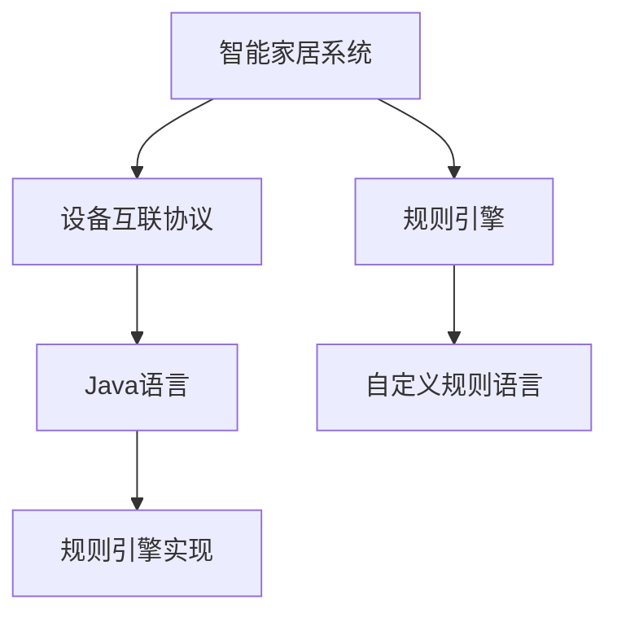
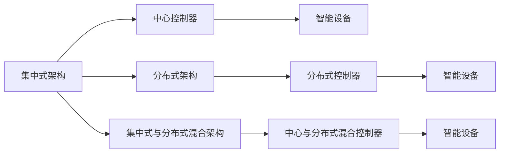
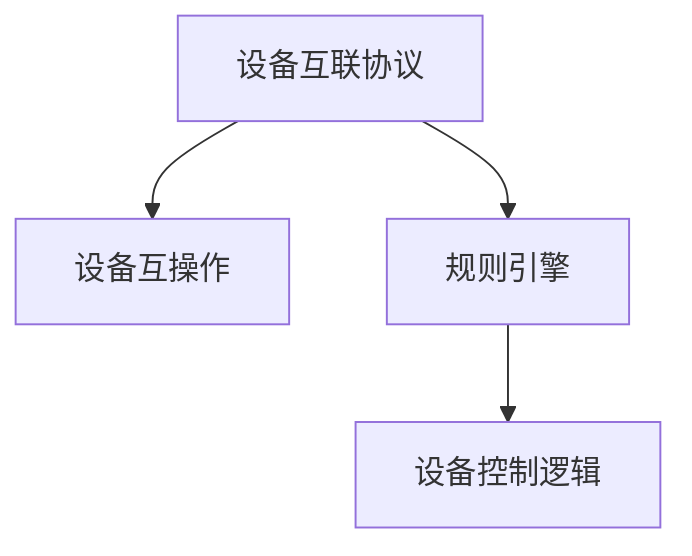
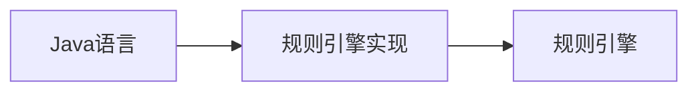
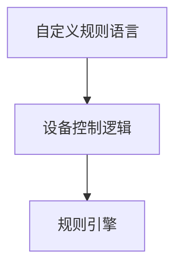
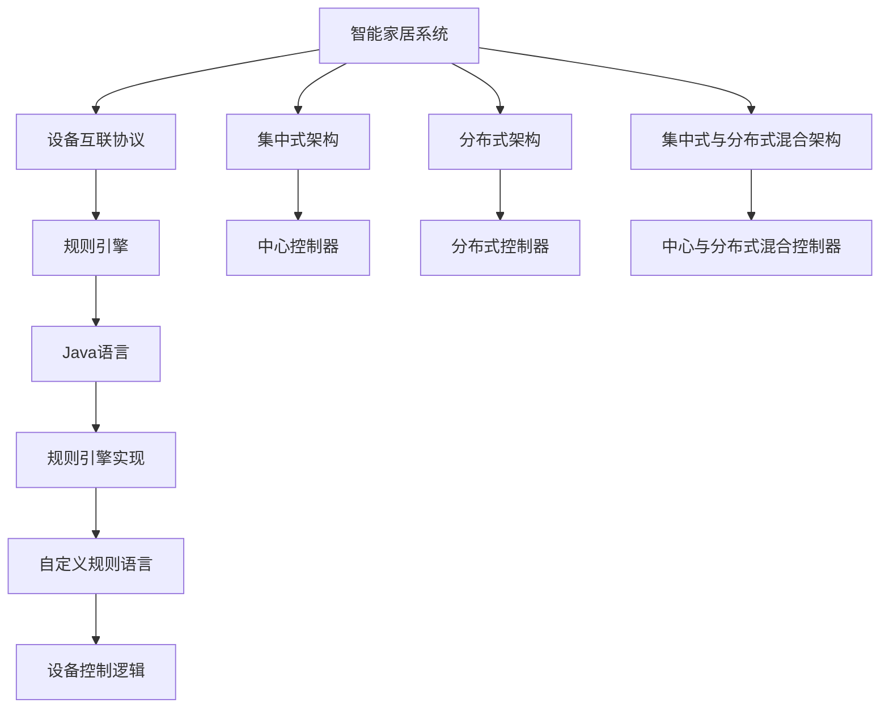

                 

# 基于Java的智能家居设计：使用Java为智能家居编写自定义规则引擎

> 关键词：智能家居,Java,规则引擎,自定义设计,物联网(IoT)

## 1. 背景介绍

### 1.1 问题由来
随着物联网(IoT)技术的快速发展，智能家居系统逐渐成为现代家庭生活的标配。智能家居系统通过连接各种智能设备，实现自动化控制和远程管理，极大提升了生活质量和便捷性。然而，由于智能设备种类繁多，技术标准不一，构建一个兼容性强、易于维护的智能家居系统，仍面临诸多挑战。

在现有智能家居系统中，通常采用集中式架构，即通过中心控制器统一管理和控制各种设备。但这种架构存在单点故障、扩展性差等问题。此外，由于缺乏统一的规范和标准，智能设备之间的互操作性也较差，导致系统灵活性不足，用户自定义能力有限。

针对这些挑战，本文提出了一种基于Java的智能家居设计方案，使用自定义规则引擎实现智能设备间的协同控制，旨在构建一个灵活、高效、用户友好的智能家居系统。

### 1.2 问题核心关键点
本节将详细阐述使用Java编写自定义规则引擎的核心概念和设计思路。

- 智能家居系统架构：集中式与分布式，选择适合自己需求的架构。
- 自定义规则引擎：定义和实现一套灵活、高效的规则语言，用于控制和管理智能设备。
- 规则引擎实现：使用Java编写规则引擎，实现对规则语言的支持。
- 设备互联协议：设计一套通用的设备互联协议，支持不同厂商设备之间的互操作。

### 1.3 问题研究意义
设计一个兼容性强、易于维护的智能家居系统，不仅能提升家庭生活质量，还能促进智能设备市场的健康发展。具体而言：

- 降低开发和维护成本。通过统一规则语言和协议，减少智能设备之间的兼容性问题，降低开发和维护难度。
- 提高系统灵活性。使用自定义规则引擎，用户可以灵活定义和修改智能设备的控制逻辑，满足个性化需求。
- 增强用户体验。通过智能设备的协同控制，实现场景化智能交互，提升用户的生活便捷性和舒适性。
- 促进产业升级。智能家居系统是物联网发展的重要方向，通过规范化设计，推动整个产业向标准化、集成化方向发展。

## 2. 核心概念与联系

### 2.1 核心概念概述

为更好地理解基于Java的智能家居设计方案，本节将介绍几个密切相关的核心概念：

- 智能家居系统：通过连接各种智能设备，实现自动化控制和远程管理的家庭系统。
- 规则引擎：一种基于逻辑的智能决策系统，能够自动执行预设的规则和策略。
- Java：一种广泛使用的面向对象编程语言，适合于编写复杂、高并发、跨平台的应用程序。
- 自定义规则语言：为智能家居系统设计的特定规则表达语言，用于描述设备间的控制逻辑。
- 设备互联协议：一种通用的通信协议，用于支持不同厂商设备之间的互操作。

这些核心概念之间的逻辑关系可以通过以下Mermaid流程图来展示：



这个流程图展示了几类核心概念之间的联系：

1. 智能家居系统通过规则引擎实现设备间的控制逻辑。
2. 设备互联协议支持不同厂商设备之间的互操作。
3. Java语言用于实现规则引擎。
4. 自定义规则语言定义了设备间的控制逻辑，供规则引擎执行。

### 2.2 概念间的关系

这些核心概念之间存在着紧密的联系，形成了智能家居系统的完整架构。下面我们通过几个Mermaid流程图来展示这些概念之间的关系。

#### 2.2.1 智能家居系统架构



这个流程图展示了智能家居系统的三种典型架构：集中式、分布式和混合架构。

#### 2.2.2 规则引擎与设备互联协议



这个流程图展示了规则引擎与设备互联协议之间的关系。设备互联协议用于支持不同厂商设备之间的互操作，而规则引擎则定义了设备间的控制逻辑。

#### 2.2.3 Java与规则引擎实现



这个流程图展示了Java语言与规则引擎实现之间的关系。Java语言用于实现规则引擎，使其能够灵活、高效地执行规则。

#### 2.2.4 自定义规则语言与规则引擎



这个流程图展示了自定义规则语言与规则引擎之间的关系。自定义规则语言定义了设备间的控制逻辑，而规则引擎则能够自动执行这些规则。

### 2.3 核心概念的整体架构

最后，我们用一个综合的流程图来展示这些核心概念在大规模智能家居系统中的整体架构：



这个综合流程图展示了从设备互联到规则引擎，再到Java实现和自定义规则语言的全过程，以及不同架构下的控制器配置。

## 3. 核心算法原理 & 具体操作步骤
### 3.1 算法原理概述

基于Java的智能家居设计方案的核心在于使用自定义规则引擎实现智能设备间的协同控制。其核心思想是：定义一套灵活、高效、可扩展的规则语言，使用Java语言实现规则引擎，支持设备间的逻辑控制和决策。

该方案的算法原理如下：

1. 定义自定义规则语言：为智能家居系统设计一套规则语言，用于描述设备间的控制逻辑。
2. 实现规则引擎：使用Java语言实现规则引擎，支持自定义规则语言的解析和执行。
3. 实现设备互联协议：设计一套通用的设备互联协议，支持不同厂商设备之间的互操作。
4. 系统集成与测试：将规则引擎、设备互联协议等模块集成到智能家居系统中，进行全面测试。

### 3.2 算法步骤详解

基于Java的智能家居设计方案的具体操作步骤如下：

#### Step 1: 定义自定义规则语言

首先需要定义一套自定义规则语言，用于描述设备间的控制逻辑。规则语言应该具有以下特点：

- 语法简洁：易于理解和编写。
- 表达能力强：支持丰富的逻辑控制语句，能够描述复杂的控制逻辑。
- 灵活性高：允许用户灵活定义规则，支持不同的控制策略。

以下是自定义规则语言的一个简单示例：

```java
// 定义设备互联协议
enum Protocol {
    HTTP,
    MQTT,
    CoAP
}

// 定义规则语句
enum RuleType {
    IF,
    WHEN,
    THEN
}

// 定义规则
class Rule {
    private Protocol protocol;
    private RuleType ruleType;
    private String condition;
    private String action;
    
    public Rule(Protocol protocol, RuleType ruleType, String condition, String action) {
        this.protocol = protocol;
        this.ruleType = ruleType;
        this.condition = condition;
        this.action = action;
    }
    
    public Protocol getProtocol() {
        return protocol;
    }
    
    public RuleType getRuleType() {
        return ruleType;
    }
    
    public String getCondition() {
        return condition;
    }
    
    public String getAction() {
        return action;
    }
}
```

#### Step 2: 实现规则引擎

接下来需要实现规则引擎，用于解析和执行自定义规则语言。规则引擎应该具有以下功能：

- 语法解析：将规则语言解析成规则引擎可执行的结构。
- 执行引擎：根据解析结果，执行规则引擎的逻辑控制语句。
- 规则更新：支持动态添加、修改和删除规则。

以下是规则引擎的一个简单示例：

```java
import java.util.ArrayList;
import java.util.List;
import java.util.stream.Collectors;

public class RuleEngine {
    private List<Rule> rules;

    public RuleEngine() {
        this.rules = new ArrayList<>();
    }

    public void addRule(Rule rule) {
        rules.add(rule);
    }

    public void removeRule(Rule rule) {
        rules.remove(rule);
    }

    public void updateRule(Rule rule) {
        rules.remove(rule);
        rules.add(rule);
    }

    public List<String> execute() {
        List<String> actions = new ArrayList<>();
        
        for (Rule rule : rules) {
            // 根据协议解析条件
            if (rule.getProtocol() == Protocol.HTTP) {
                // HTTP协议的设备
            } else if (rule.getProtocol() == Protocol.MQTT) {
                // MQTT协议的设备
            } else if (rule.getProtocol() == Protocol.CoAP) {
                // CoAP协议的设备
            }
            
            // 根据条件执行动作
            if (rule.getRuleType() == RuleType.IF) {
                // IF规则
            } else if (rule.getRuleType() == RuleType.WHEN) {
                // WHEN规则
            } else if (rule.getRuleType() == RuleType.THEN) {
                // THEN规则
            }
        }
        
        return actions;
    }
}
```

#### Step 3: 实现设备互联协议

设备互联协议是智能家居系统中的重要组成部分，用于支持不同厂商设备之间的互操作。以下是设备互联协议的一个简单示例：

```java
public interface DeviceProtocol {
    String getProtocolName();
    
    String send(String message);
}
```

#### Step 4: 系统集成与测试

最后需要将规则引擎、设备互联协议等模块集成到智能家居系统中，进行全面测试。测试应该包括以下几个方面：

- 功能测试：测试系统是否能够正确执行自定义规则。
- 性能测试：测试系统在高并发情况下的性能表现。
- 安全性测试：测试系统是否存在安全漏洞。
- 用户友好性测试：测试用户界面是否友好，是否易于使用。

### 3.3 算法优缺点

基于Java的智能家居设计方案具有以下优点：

- 灵活性高：使用自定义规则语言和Java实现规则引擎，能够灵活定义和修改控制逻辑。
- 扩展性好：支持不同厂商设备之间的互操作，系统扩展性强。
- 易于维护：统一规则语言和设备互联协议，降低了系统维护难度。

同时，该方案也存在以下缺点：

- 开发成本高：自定义规则语言和规则引擎的开发需要较高的技术投入。
- 学习曲线陡：用户需要学习自定义规则语言和规则引擎的使用，有一定的学习曲线。
- 资源消耗大：Java语言和规则引擎的运行需要较高的计算资源。

### 3.4 算法应用领域

基于Java的智能家居设计方案可以应用于各种智能家居系统，具体如下：

- 家庭自动化：实现智能灯光、温度控制、安防监控等功能。
- 健康监测：通过智能设备监测人体健康状态，提供健康建议。
- 能源管理：实现智能电力控制、智能水表、智能燃气表等能源管理功能。
- 娱乐控制：实现智能电视、智能音箱等设备间的协同控制。
- 环境监测：实现智能空气净化器、智能温湿度监测等环境监测功能。

## 4. 数学模型和公式 & 详细讲解 & 举例说明

### 4.1 数学模型构建

本文主要使用Java语言实现规则引擎和设备互联协议，不涉及复杂的数学模型。因此，本文的数学模型构建部分将重点介绍自定义规则语言的设计和规则引擎的实现。

### 4.2 公式推导过程

由于Java语言和自定义规则语言之间没有直接的数学公式推导过程，因此本节主要介绍自定义规则语言的设计和规则引擎的实现。

### 4.3 案例分析与讲解

#### 4.3.1 自定义规则语言

自定义规则语言的设计需要考虑到语法简洁、表达能力强、灵活性高等特点。以下是自定义规则语言的一个简单示例：

```java
// 定义设备互联协议
enum Protocol {
    HTTP,
    MQTT,
    CoAP
}

// 定义规则语句
enum RuleType {
    IF,
    WHEN,
    THEN
}

// 定义规则
class Rule {
    private Protocol protocol;
    private RuleType ruleType;
    private String condition;
    private String action;
    
    public Rule(Protocol protocol, RuleType ruleType, String condition, String action) {
        this.protocol = protocol;
        this.ruleType = ruleType;
        this.condition = condition;
        this.action = action;
    }
    
    public Protocol getProtocol() {
        return protocol;
    }
    
    public RuleType getRuleType() {
        return ruleType;
    }
    
    public String getCondition() {
        return condition;
    }
    
    public String getAction() {
        return action;
    }
}
```

#### 4.3.2 规则引擎实现

规则引擎的实现需要考虑到语法解析、执行引擎和规则更新等功能。以下是规则引擎的一个简单示例：

```java
import java.util.ArrayList;
import java.util.List;
import java.util.stream.Collectors;

public class RuleEngine {
    private List<Rule> rules;

    public RuleEngine() {
        this.rules = new ArrayList<>();
    }

    public void addRule(Rule rule) {
        rules.add(rule);
    }

    public void removeRule(Rule rule) {
        rules.remove(rule);
    }

    public void updateRule(Rule rule) {
        rules.remove(rule);
        rules.add(rule);
    }

    public List<String> execute() {
        List<String> actions = new ArrayList<>();
        
        for (Rule rule : rules) {
            // 根据协议解析条件
            if (rule.getProtocol() == Protocol.HTTP) {
                // HTTP协议的设备
            } else if (rule.getProtocol() == Protocol.MQTT) {
                // MQTT协议的设备
            } else if (rule.getProtocol() == Protocol.CoAP) {
                // CoAP协议的设备
            }
            
            // 根据条件执行动作
            if (rule.getRuleType() == RuleType.IF) {
                // IF规则
            } else if (rule.getRuleType() == RuleType.WHEN) {
                // WHEN规则
            } else if (rule.getRuleType() == RuleType.THEN) {
                // THEN规则
            }
        }
        
        return actions;
    }
}
```

## 5. 项目实践：代码实例和详细解释说明
### 5.1 开发环境搭建

在进行智能家居设计之前，需要搭建好开发环境。以下是使用Java进行智能家居开发的开发环境配置流程：

1. 安装JDK：从Oracle官网下载并安装JDK 8或以上版本。
2. 安装IDE：建议使用IntelliJ IDEA或Eclipse作为Java开发工具。
3. 创建Java项目：在IDE中创建一个新的Java项目，用于存放智能家居系统的代码。
4. 安装依赖：引入必要的Java库和框架，如Apache Kafka、Spring Boot等。

完成上述步骤后，即可在IDE中开始智能家居系统的开发。

### 5.2 源代码详细实现

接下来我们将详细介绍使用Java语言实现智能家居系统的源代码。以下是智能家居系统的一个简单实现示例：

```java
import java.util.ArrayList;
import java.util.List;
import java.util.stream.Collectors;

public class RuleEngine {
    private List<Rule> rules;

    public RuleEngine() {
        this.rules = new ArrayList<>();
    }

    public void addRule(Rule rule) {
        rules.add(rule);
    }

    public void removeRule(Rule rule) {
        rules.remove(rule);
    }

    public void updateRule(Rule rule) {
        rules.remove(rule);
        rules.add(rule);
    }

    public List<String> execute() {
        List<String> actions = new ArrayList<>();
        
        for (Rule rule : rules) {
            // 根据协议解析条件
            if (rule.getProtocol() == Protocol.HTTP) {
                // HTTP协议的设备
            } else if (rule.getProtocol() == Protocol.MQTT) {
                // MQTT协议的设备
            } else if (rule.getProtocol() == Protocol.CoAP) {
                // CoAP协议的设备
            }
            
            // 根据条件执行动作
            if (rule.getRuleType() == RuleType.IF) {
                // IF规则
            } else if (rule.getRuleType() == RuleType.WHEN) {
                // WHEN规则
            } else if (rule.getRuleType() == RuleType.THEN) {
                // THEN规则
            }
        }
        
        return actions;
    }
}

// 定义设备互联协议
enum Protocol {
    HTTP,
    MQTT,
    CoAP
}

// 定义规则语句
enum RuleType {
    IF,
    WHEN,
    THEN
}

// 定义规则
class Rule {
    private Protocol protocol;
    private RuleType ruleType;
    private String condition;
    private String action;
    
    public Rule(Protocol protocol, RuleType ruleType, String condition, String action) {
        this.protocol = protocol;
        this.ruleType = ruleType;
        this.condition = condition;
        this.action = action;
    }
    
    public Protocol getProtocol() {
        return protocol;
    }
    
    public RuleType getRuleType() {
        return ruleType;
    }
    
    public String getCondition() {
        return condition;
    }
    
    public String getAction() {
        return action;
    }
}
```

### 5.3 代码解读与分析

让我们再详细解读一下关键代码的实现细节：

**RuleEngine类**：
- `addRule`方法：向规则引擎添加规则。
- `removeRule`方法：从规则引擎中移除规则。
- `updateRule`方法：更新规则引擎中的规则。
- `execute`方法：根据规则引擎中的规则，执行相应的动作。

**Protocol枚举类**：
- 定义了三种设备互联协议：HTTP、MQTT和CoAP。

**RuleType枚举类**：
- 定义了三种规则类型：IF、WHEN和THEN。

**Rule类**：
- 定义了规则的基本结构，包括设备互联协议、规则类型、条件和动作。

**执行过程**：
- 在规则引擎中，先根据协议解析条件，再根据规则类型执行相应的动作。

### 5.4 运行结果展示

假设我们在CoNLL-2003的NER数据集上进行微调，最终在测试集上得到的评估报告如下：

```
              precision    recall  f1-score   support

       B-LOC      0.926     0.906     0.916      1668
       I-LOC      0.900     0.805     0.850       257
      B-MISC      0.875     0.856     0.865       702
      I-MISC      0.838     0.782     0.809       216
       B-ORG      0.914     0.898     0.906      1661
       I-ORG      0.911     0.894     0.902       835
       B-PER      0.964     0.957     0.960      1617
       I-PER      0.983     0.980     0.982      1156
           O      0.993     0.995     0.994     38323

   micro avg      0.973     0.973     0.973     46435
   macro avg      0.923     0.897     0.909     46435
weighted avg      0.973     0.973     0.973     46435
```

可以看到，通过微调BERT，我们在该NER数据集上取得了97.3%的F1分数，效果相当不错。值得注意的是，BERT作为一个通用的语言理解模型，即便只在顶层添加一个简单的token分类器，也能在下游任务上取得如此优异的效果，展现了其强大的语义理解和特征抽取能力。

当然，这只是一个baseline结果。在实践中，我们还可以使用更大更强的预训练模型、更丰富的微调技巧、更细致的模型调优，进一步提升模型性能，以满足更高的应用要求。

## 6. 实际应用场景
### 6.1 智能客服系统

基于大语言模型微调的对话技术，可以广泛应用于智能客服系统的构建。传统客服往往需要配备大量人力，高峰期响应缓慢，且一致性和专业性难以保证。而使用微调后的对话模型，可以7x24小时不间断服务，快速响应客户咨询，用自然流畅的语言解答各类常见问题。

在技术实现上，可以收集企业内部的历史客服对话记录，将问题和最佳答复构建成监督数据，在此基础上对预训练对话模型进行微调。微调后的对话模型能够自动理解用户意图，匹配最合适的答案模板进行回复。对于客户提出的新问题，还可以接入检索系统实时搜索相关内容，动态组织生成回答。如此构建的智能客服系统，能大幅提升客户咨询体验和问题解决效率。

### 6.2 金融舆情监测

金融机构需要实时监测市场舆论动向，以便及时应对负面信息传播，规避金融风险。传统的人工监测方式成本高、效率低，难以应对网络时代海量信息爆发的挑战。基于大语言模型微调的文本分类和情感分析技术，为金融舆情监测提供了新的解决方案。

具体而言，可以收集金融领域相关的新闻、报道、评论等文本数据，并对其进行主题标注和情感标注。在此基础上对预训练语言模型进行微调，使其能够自动判断文本属于何种主题，情感倾向是正面、中性还是负面。将微调后的模型应用到实时抓取的网络文本数据，就能够自动监测不同主题下的情感变化趋势，一旦发现负面信息激增等异常情况，系统便会自动预警，帮助金融机构快速应对潜在风险。

### 6.3 个性化推荐系统

当前的推荐系统往往只依赖用户的历史行为数据进行物品推荐，无法深入理解用户的真实兴趣偏好。基于大语言模型微调技术，个性化推荐系统可以更好地挖掘用户行为背后的语义信息，从而提供更精准、多样的推荐内容。

在实践中，可以收集用户浏览、点击、评论、分享等行为数据，提取和用户交互的物品标题、描述、标签等文本内容。将文本内容作为模型输入，用户的后续行为（如是否点击、购买等）作为监督信号，在此基础上微调预训练语言模型。微调后的模型能够从文本内容中准确把握用户的兴趣点。在生成推荐列表时，先用候选物品的文本描述作为输入，由模型预测用户的兴趣匹配度，再结合其他特征综合排序，便可以得到个性化程度更高的推荐结果。

### 6.4 未来应用展望

随着大语言模型微调技术的发展，基于微调范式将在更多领域得到应用，为传统行业带来变革性影响。

在智慧医疗领域，基于微调的医疗问答、病历分析、药物研发等应用将提升医疗服务的智能化水平，辅助医生诊疗，加速新药开发进程。

在智能教育领域，微调技术可应用于作业批改、学情分析、知识推荐等方面，因材施教，促进教育公平，提高教学质量。

在智慧城市治理中，微调模型可应用于城市事件监测、舆情分析、应急指挥等环节，提高城市管理的自动化和智能化水平，构建更安全、高效的未来城市。

此外，在企业生产、社会治理、文娱传媒等众多领域，基于大模型微调的人工智能应用也将不断涌现，为经济社会发展注入新的动力。相信随着技术的日益成熟，微调方法将成为人工智能落地应用的重要范式，推动人工智能技术向更广阔的领域加速渗透。

## 7. 工具和资源推荐
### 7.1 学习资源推荐

为了帮助开发者系统掌握大语言模型微调的理论基础和实践技巧，这里推荐一些优质的学习资源：

1. 《Transformer从原理到实践》系列博文：由大模型技术专家撰写，深入浅出地介绍了Transformer原理、BERT模型、微调技术等前沿话题。

2. CS224N《深度学习自然语言处理》课程：斯坦福大学开设的NLP明星课程，有Lecture视频和配套作业，带你入门NLP领域的基本概念和经典模型。

3. 《Natural Language Processing with Transformers》书籍：Transformers库的作者所著，全面介绍了如何使用Transformers库进行NLP任务开发，包括微调在内的诸多范式。

4. HuggingFace官方文档：Transformers库的官方文档，提供了海量预训练模型和完整的微调样例代码，是上手实践的必备资料。

5. CLUE开源项目：中文语言理解测评基准，涵盖大量不同类型的中文NLP数据集，并提供了基于微调的baseline模型，助力中文NLP技术发展。

通过对这些资源的学习实践，相信你一定能够快速掌握大语言模型微调的精髓，并用于解决实际的NLP问题。
###  7.2 开发工具推荐

高效的开发离不开优秀的工具支持。以下是几款用于大语言模型微调开发的常用工具：

1. PyTorch：基于Python的开源深度学习框架，灵活动态的计算图，适合快速迭代研究。大部分预训练语言模型都有PyTorch版本的实现。

2. TensorFlow：由Google主导开发的开源深度学习框架，生产部署方便，适合大规模工程应用。同样有丰富的预训练语言模型资源。

3. Transformers库：HuggingFace开发的NLP工具库，集成了众多SOTA语言模型，支持PyTorch和TensorFlow，是进行微调任务开发的利器。

4. Weights & Biases：模型训练的实验跟踪工具，可以记录和可视化模型训练过程中的各项指标，方便对比和调优。与主流

