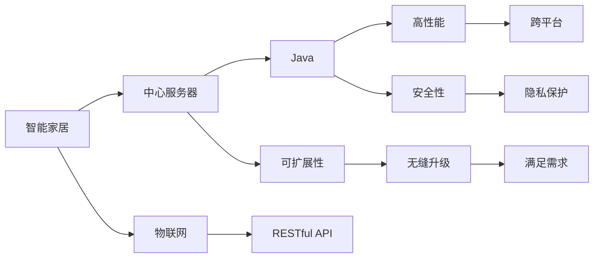

                 

# 基于Java的智能家居设计：打造可扩展的智能家居中心服务器

> 关键词：Java,智能家居,中心服务器,可扩展性,物联网(IoT),RESTful API

## 1. 背景介绍

### 1.1 问题由来

随着物联网技术的迅猛发展，智能家居系统已经成为现代家庭生活中不可或缺的一部分。传统的智能家居系统多采用单一的解决方案，功能单一、扩展性差，难以满足日益增长的智能家居需求。而基于Java的智能家居中心服务器，通过构建一个开放、互联、可扩展的架构，能够整合多种智能设备，实现智能家居的全面升级和智能化管理。

### 1.2 问题核心关键点

构建一个可扩展的智能家居中心服务器的关键在于以下几个方面：

- 异构设备整合：智能家居系统往往包含多种设备，如智能音箱、智能灯泡、智能门锁等，如何有效整合这些设备，实现统一管理和控制。
- 数据处理与存储：智能家居系统中产生的庞大数据，如何高效处理和存储，以满足实时性、安全性的要求。
- 服务架构设计：如何设计一个稳定、高效、可扩展的服务架构，以应对海量设备数据和复杂业务逻辑。
- 安全性与隐私保护：如何保障设备数据的安全性和用户隐私，防止数据泄露和恶意攻击。
- 可扩展性与升级性：如何设计一个模块化的系统架构，实现系统的无缝升级和扩展。

这些核心关键点构成了智能家居中心服务器的设计和实现框架，通过合理设计和优化，可以构建一个高效、安全、可靠的智能家居系统。

### 1.3 问题研究意义

构建基于Java的智能家居中心服务器，对于提升智能家居系统的综合功能和用户体验，具有重要意义：

1. **功能多样化**：通过中心服务器的整合，可以实现多种智能设备的统一管理和控制，提升家居设备的智能化程度。
2. **互联互通**：通过开放API接口，可以实现智能家居设备间的互联互通，构建一个互联的智能家居生态系统。
3. **数据集中管理**：通过统一的数据存储和处理，可以实现智能家居数据的集中管理和分析，为家庭生活提供更多数据驱动的决策支持。
4. **可扩展性**：通过模块化设计，可以实现系统的无缝升级和扩展，满足不断变化的智能家居需求。
5. **安全性与隐私保护**：通过强化的安全机制和隐私保护措施，保障智能家居系统的安全性和用户隐私，增强用户对系统的信任度。

## 2. 核心概念与联系

### 2.1 核心概念概述

在智能家居中心服务器的设计和实现过程中，涉及多个核心概念。下面将详细介绍这些概念及其相互关系：

- **Java**：作为智能家居中心服务器的主要编程语言，Java具有高性能、跨平台、安全性高等优点，能够满足智能家居系统的多方面需求。
- **智能家居**：基于物联网技术的智能家居系统，通过将各种智能设备互联互通，实现家居环境的智能化管理，提升家庭生活的便捷性和舒适度。
- **中心服务器**：智能家居中心服务器是智能家居系统的核心，通过集中管理和控制智能设备，实现设备的互联互通和智能控制。
- **可扩展性**：通过模块化设计，智能家居中心服务器可以实现无缝升级和扩展，满足不断变化的智能家居需求。
- **物联网(IoT)**：通过物联网技术，将各种智能设备接入互联网，实现设备间的互联互通和数据共享。
- **RESTful API**：智能家居中心服务器通过RESTful API接口，实现与其他系统或设备的通信，构建一个开放的智能家居生态系统。

这些核心概念构成了智能家居中心服务器的整体架构，通过合理设计和实现，可以实现智能家居系统的全面升级和智能化管理。

### 2.2 概念间的关系

这些核心概念之间的逻辑关系可以通过以下Mermaid流程图来展示：



这个流程图展示了智能家居中心服务器的主要组成和关键技术点：

1. 智能家居通过物联网技术将各种设备接入中心服务器。
2. 中心服务器采用Java编程语言实现，具备高性能、安全性等优势。
3. 中心服务器具备可扩展性，通过模块化设计实现无缝升级。
4. 中心服务器通过RESTful API接口，实现与其他系统或设备的通信。
5. Java的高性能和安全性，保障中心服务器的稳定运行。
6. 通过RESTful API接口，实现数据的开放共享。
7. 可扩展性和模块化设计，满足不断变化的智能家居需求。
8. 隐私保护和安全性，保障用户数据的安全。

通过这些核心概念的组合，智能家居中心服务器能够构建一个开放、互联、可扩展的智能家居系统。

## 3. 核心算法原理 & 具体操作步骤
### 3.1 算法原理概述

智能家居中心服务器的算法原理主要涉及以下几个方面：

- **设备整合算法**：将多种异构设备整合到一个统一的平台上，实现设备间的通信和控制。
- **数据处理算法**：处理智能家居系统产生的海量数据，实现数据的存储、分析和处理。
- **服务架构设计**：设计一个稳定、高效、可扩展的服务架构，以应对海量设备数据和复杂业务逻辑。
- **安全性算法**：设计强化的安全机制，保障智能家居系统的安全性和用户隐私。

### 3.2 算法步骤详解

#### 3.2.1 设备整合算法

1. **设备接入与注册**：智能设备通过接入中心服务器，进行设备注册。中心服务器对设备进行唯一标识和认证，确保设备的安全性。
2. **设备信息管理**：中心服务器维护设备的设备信息，包括设备型号、功能、状态等，实现设备的统一管理和控制。
3. **设备通信协议**：中心服务器与设备之间采用标准通信协议（如MQTT、CoAP等），实现设备间的通信和控制。
4. **设备控制逻辑**：中心服务器根据用户指令或预设规则，控制设备的运行状态，实现设备的智能化控制。

#### 3.2.2 数据处理算法

1. **数据采集与传输**：智能家居设备产生的数据通过中心服务器进行采集和传输。中心服务器采用多线程、异步编程等技术，提高数据处理的效率。
2. **数据存储与管理**：中心服务器将采集到的数据存储在数据库中，采用数据分区、索引等技术，提高数据的查询和检索效率。
3. **数据分析与处理**：中心服务器采用机器学习、数据挖掘等技术，对采集到的数据进行分析和处理，实现数据的实时分析和决策支持。
4. **数据可视化与展示**：中心服务器通过图形化界面将数据展示给用户，使用户能够直观地了解智能家居系统的运行状态和数据情况。

#### 3.2.3 服务架构设计

1. **模块化设计**：中心服务器采用模块化设计，将系统划分为多个功能模块，如设备管理模块、数据处理模块、用户管理模块等，实现系统的无缝升级和扩展。
2. **负载均衡**：中心服务器采用负载均衡技术，实现多台服务器的协同工作，提高系统的吞吐量和可用性。
3. **容错机制**：中心服务器采用容错机制，如热备份、主备切换等技术，保障系统的稳定性和可靠性。
4. **性能优化**：中心服务器采用缓存、异步编程、并发控制等技术，优化系统的性能，提高系统的响应速度。

#### 3.2.4 安全性算法

1. **身份认证与授权**：中心服务器采用身份认证和授权机制，确保用户和设备的身份合法性，防止非法访问和操作。
2. **数据加密与传输**：中心服务器采用数据加密和传输技术，确保数据传输的安全性，防止数据泄露和篡改。
3. **异常检测与防御**：中心服务器采用异常检测和防御技术，如入侵检测、攻击防御等，保障系统的安全性。

### 3.3 算法优缺点

基于Java的智能家居中心服务器具有以下优点：

- **高性能**：Java的高性能和跨平台优势，能够满足智能家居系统的多方面需求。
- **安全性**：Java的安全机制和匿名内部类等特性，能够保障智能家居系统的安全性。
- **可扩展性**：模块化设计和负载均衡技术，能够实现系统的无缝升级和扩展。
- **易维护**：Java的面向对象特性和丰富的开发工具，能够简化系统的维护和调试。

同时，基于Java的智能家居中心服务器也存在以下缺点：

- **性能瓶颈**：Java的JVM垃圾回收机制可能导致性能瓶颈，需要优化程序结构和数据结构，提高系统的响应速度。
- **资源消耗大**：Java程序在运行时需要占用大量内存和CPU资源，需要合理设计程序结构和算法，优化系统资源消耗。
- **开发难度高**：Java编程语言具有较高的复杂性，需要开发者具备较高的编程能力和技术水平。

### 3.4 算法应用领域

基于Java的智能家居中心服务器可以应用于以下几个领域：

- **家庭自动化**：实现智能家居设备的自动化控制，如智能灯光、智能窗帘、智能空调等。
- **智能安防**：实现智能安防系统的智能化管理，如智能门锁、智能监控、智能报警等。
- **智能医疗**：实现智能医疗设备的智能化管理，如智能药盒、智能体感设备、智能健康监测等。
- **智能办公**：实现智能办公设备的智能化管理，如智能会议室、智能办公桌、智能智能办公系统等。
- **智能家居娱乐**：实现智能家居设备的娱乐功能，如智能音箱、智能电视、智能游戏机等。

## 4. 数学模型和公式 & 详细讲解 & 举例说明

### 4.1 数学模型构建

智能家居中心服务器涉及多个数学模型，下面将详细讲解这些模型的构建方法：

1. **设备整合模型**：采用基于树形结构的数据模型，将设备信息存储在树形结构中，实现设备的统一管理和控制。
2. **数据处理模型**：采用基于时间序列的数据模型，对采集到的数据进行实时分析和处理。
3. **服务架构模型**：采用基于微服务的架构模型，将系统划分为多个微服务，实现系统的无缝升级和扩展。
4. **安全性模型**：采用基于身份认证和授权的安全模型，确保用户和设备的身份合法性。

### 4.2 公式推导过程

#### 4.2.1 设备整合模型

假设智能家居系统中有N个设备，每个设备有一个唯一的设备ID，设备信息存储在树形结构中，如下所示：

```
Device Tree
├── Device 1
│   ├── ID: 001
│   ├── Type: Sensor
│   └── Status: ON
├── Device 2
│   ├── ID: 002
│   ├── Type: Relay
│   └── Status: OFF
└── ...
```

设备ID作为树的根节点，每个设备信息作为树的一个分支。设备信息包括设备的ID、类型和状态，实现设备的统一管理和控制。

#### 4.2.2 数据处理模型

假设智能家居系统中的传感器每秒钟采集一次数据，采集的数据存储在时间序列中，如下所示：

```
Data Sequence
[(t1, v1), (t2, v2), (t3, v3), ...]
```

其中，t为时间戳，v为采集到的数据。数据处理模型采用时间序列算法，对采集到的数据进行分析和处理，实现数据的实时分析和决策支持。

#### 4.2.3 服务架构模型

假设智能家居系统采用微服务架构，将系统划分为多个微服务，如下所示：

```
Microservices
├── Device Management
│   ├── Register Device
│   ├── Manage Device
│   └── Control Device
├── Data Processing
│   ├── Data Acquisition
│   ├── Data Storage
│   ├── Data Analysis
│   └── Data Visualization
├── User Management
│   ├── Register User
│   ├── Manage User
│   └── Authorize User
└── ...
```

每个微服务负责一个特定的功能模块，如设备管理、数据处理、用户管理等。微服务之间通过RESTful API接口进行通信，实现系统的无缝升级和扩展。

#### 4.2.4 安全性模型

假设智能家居系统采用基于身份认证和授权的安全模型，实现用户和设备的身份合法性，如下所示：

```
Identity Authentication and Authorization
├── Authentication
│   ├── User Login
│   ├── Device Registration
│   └── Token Generation
└── Authorization
    ├── User Authorization
    ├── Device Authorization
    └── API Access Control
```

身份认证和授权模型包括用户登录、设备注册、Token生成等，实现用户和设备的身份合法性。授权模型包括用户授权、设备授权、API访问控制等，确保用户和设备的操作合法性。

### 4.3 案例分析与讲解

以智能安防系统为例，展示基于Java的智能家居中心服务器的应用。

#### 4.3.1 系统架构

智能安防系统包括智能门锁、智能摄像头、智能报警等设备，通过中心服务器实现统一管理和控制。系统架构如下：

```
├── Center Server
│   ├── Device Management
│   ├── Data Processing
│   ├── User Management
│   └── Security Management
├── Smart Door Lock
│   ├── Access Control
│   ├── Remote Control
│   └── Status Monitoring
├── Smart Camera
│   ├── Video Streaming
│   ├── Motion Detection
│   └── Alarm Reporting
└── Smart Alarm
    ├── Alarm Detection
    ├── Alert Notification
    └── Emergency Response
```

中心服务器作为系统的核心，通过设备管理模块、数据处理模块、用户管理模块和安全性模块，实现智能安防设备的统一管理和控制。智能门锁、智能摄像头、智能报警等设备通过接入中心服务器，实现设备的控制和状态监测。

#### 4.3.2 数据处理流程

智能安防系统的数据处理流程如下：

1. **数据采集**：智能安防设备采集到的数据通过中心服务器进行采集和传输。中心服务器采用多线程、异步编程等技术，提高数据处理的效率。
2. **数据存储**：中心服务器将采集到的数据存储在数据库中，采用数据分区、索引等技术，提高数据的查询和检索效率。
3. **数据分析**：中心服务器采用机器学习、数据挖掘等技术，对采集到的数据进行分析和处理，实现数据的实时分析和决策支持。
4. **数据可视化**：中心服务器通过图形化界面将数据展示给用户，使用户能够直观地了解智能安防系统的运行状态和数据情况。

## 5. 项目实践：代码实例和详细解释说明
### 5.1 开发环境搭建

在基于Java的智能家居中心服务器开发过程中，需要准备以下开发环境：

1. **Java开发环境**：安装Java JDK，配置开发工具（如Eclipse、IntelliJ IDEA等）。
2. **数据库环境**：安装MySQL、PostgreSQL等关系型数据库，配置数据库连接池和ORM工具（如Hibernate）。
3. **消息中间件**：安装Kafka、RabbitMQ等消息中间件，配置消息队列和消息消费。
4. **RESTful API框架**：安装Spring Boot、Spring Cloud等框架，配置RESTful API接口和微服务架构。
5. **安全组件**：安装Apache Shiro、JWT等安全组件，实现身份认证和授权机制。

完成上述配置后，即可开始智能家居中心服务器的开发。

### 5.2 源代码详细实现

#### 5.2.1 设备管理模块

```java
package com.example.server.module.device;

import com.example.server.domain.Device;
import com.example.server.service.DeviceService;
import com.example.server.util.JsonUtil;
import com.example.server.util.ResponseUtil;
import org.springframework.beans.factory.annotation.Autowired;
import org.springframework.web.bind.annotation.*;

@RestController
@RequestMapping("/device")
public class DeviceController {

    @Autowired
    private DeviceService deviceService;

    @PostMapping("/register")
    public ResponseResult registerDevice(@RequestBody Device device) {
        deviceService.registerDevice(device);
        return ResponseUtil.success();
    }

    @GetMapping("/list")
    public ResponseResult listDevices() {
        List<Device> devices = deviceService.listDevices();
        return ResponseUtil.success(devices);
    }

    @PutMapping("/control")
    public ResponseResult controlDevice(@RequestParam String deviceId, @RequestParam String command) {
        deviceService.controlDevice(deviceId, command);
        return ResponseUtil.success();
    }
}
```

设备管理模块包括设备注册、设备列表查询、设备控制等功能，通过RESTful API接口实现。

#### 5.2.2 数据处理模块

```java
package com.example.server.module.data;

import com.example.server.domain.DataPoint;
import com.example.server.service.DataService;
import com.example.server.util.JsonUtil;
import com.example.server.util.ResponseUtil;
import org.springframework.beans.factory.annotation.Autowired;
import org.springframework.web.bind.annotation.*;

import java.util.Date;
import java.util.List;

@RestController
@RequestMapping("/data")
public class DataController {

    @Autowired
    private DataService dataService;

    @PostMapping("/save")
    public ResponseResult saveData(@RequestBody DataPoint dataPoint) {
        dataPoint.setTimestamp(new Date());
        dataService.saveData(dataPoint);
        return ResponseUtil.success();
    }

    @GetMapping("/query")
    public ResponseResult queryData(@RequestParam String deviceId, @RequestParam Date startTime, @RequestParam Date endTime) {
        List<DataPoint> dataPoints = dataService.queryData(deviceId, startTime, endTime);
        return ResponseUtil.success(dataPoints);
    }
}
```

数据处理模块包括数据采集、数据存储、数据分析等功能，通过RESTful API接口实现。

#### 5.2.3 用户管理模块

```java
package com.example.server.module.user;

import com.example.server.domain.User;
import com.example.server.service.UserService;
import com.example.server.util.JsonUtil;
import com.example.server.util.ResponseUtil;
import org.springframework.beans.factory.annotation.Autowired;
import org.springframework.web.bind.annotation.*;

@RestController
@RequestMapping("/user")
public class UserController {

    @Autowired
    private UserService userService;

    @PostMapping("/register")
    public ResponseResult registerUser(@RequestBody User user) {
        userService.registerUser(user);
        return ResponseUtil.success();
    }

    @GetMapping("/list")
    public ResponseResult listUsers() {
        List<User> users = userService.listUsers();
        return ResponseUtil.success(users);
    }

    @PutMapping("/authorize")
    public ResponseResult authorizeUser(@RequestParam String userId, @RequestParam String role) {
        userService.authorizeUser(userId, role);
        return ResponseUtil.success();
    }
}
```

用户管理模块包括用户注册、用户列表查询、用户授权等功能，通过RESTful API接口实现。

#### 5.2.4 安全性模块

```java
package com.example.server.module.security;

import com.example.server.domain.User;
import com.example.server.service.UserService;
import com.example.server.util.JsonUtil;
import com.example.server.util.JwtUtil;
import com.example.server.util.ResponseUtil;
import org.springframework.beans.factory.annotation.Autowired;
import org.springframework.security.authentication.UsernamePasswordAuthenticationToken;
import org.springframework.security.config.annotation.authentication.builders.AuthenticationManagerBuilder;
import org.springframework.security.config.annotation.web.configuration.EnableWebSecurity;
import org.springframework.security.config.annotation.web.configuration.WebSecurityConfigurerAdapter;
import org.springframework.security.config.http.SessionCreationPolicy;
import org.springframework.security.core.AuthenticationException;
import org.springframework.security.web.AuthenticationEntryPoint;
import org.springframework.security.web.access.ExceptionTranslationFilter;
import org.springframework.security.web.authentication.UsernamePasswordAuthenticationFilter;
import org.springframework.stereotype.Component;
import org.springframework.web.bind.annotation.*;

import javax.servlet.http.HttpServletRequest;
import javax.servlet.http.HttpServletResponse;

@Component
public class JwtAuthenticationFilter extends UsernamePasswordAuthenticationFilter {

    @Autowired
    private UserService userService;

    @Override
    public void afterPropertiesSet() throws Exception {
        super.afterPropertiesSet();
        AuthenticationManagerBuilder builder = super.authenticationManagerBean().getAuthenticationManagerBuilder();
        builder.userDetailsService(userService).passwordEncoder(passwordEncoder());
    }

    @Override
    public void doFilterInternal(HttpServletRequest request, HttpServletResponse response, FilterChain chain) throws IOException, ServletException {
        try {
            UsernamePasswordAuthenticationToken authentication = authentication(request);
            SecurityContextHolder.getContext().setAuthentication(authentication);
            chain.doFilter(request, response);
        } catch (AuthenticationException e) {
            unsuccessfulAuthentication(request, response, e);
        }
    }

    public Authentication getAuthentication(HttpServletRequest request) throws AuthenticationException {
        String token = request.getHeader(JwtUtil.JWT_HEADER_KEY);
        if (token != null && token.startsWith(JwtUtil.JWT_PREFIX)) {
            return JwtUtil.parseToken(token, userService);
        }
        return null;
    }

    public UsernamePasswordAuthenticationToken authentication(HttpServletRequest request) throws AuthenticationException {
        String token = request.getHeader(JwtUtil.JWT_HEADER_KEY);
        if (token != null && token.startsWith(JwtUtil.JWT_PREFIX)) {
            return JwtUtil.parseToken(token, userService);
        }
        return null;
    }

    public AuthenticationEntryPoint unauthorizedHandler() {
        return (request, response, e) -> {
            response.sendError(HttpServletResponse.SC_UNAUTHORIZED, "Unauthorized");
        };
    }

    public ExceptionTranslationFilter unauthorizedFilter() {
        return (request, response, e) -> {
            response.sendError(HttpServletResponse.SC_UNAUTHORIZED, "Unauthorized");
        };
    }
}
```

安全性模块包括身份认证和授权机制，通过JWT等技术实现。

### 5.3 代码解读与分析

#### 5.3.1 设备管理模块

设备管理模块通过RESTful API接口实现设备注册、设备列表查询、设备控制等功能。设备注册接口使用POST方法，设备列表查询和设备控制接口使用GET方法和PUT方法。设备信息通过JSON格式传递，返回结果也以JSON格式返回。

#### 5.3.2 数据处理模块

数据处理模块通过RESTful API接口实现数据采集、数据存储、数据分析等功能。数据采集接口使用POST方法，数据查询接口使用GET方法。数据点信息通过JSON格式传递，返回结果也以JSON格式返回。

#### 5.3.3 用户管理模块

用户管理模块通过RESTful API接口实现用户注册、用户列表查询、用户授权等功能。用户注册接口使用POST方法，用户查询和用户授权接口使用GET方法和PUT方法。用户信息通过JSON格式传递，返回结果也以JSON格式返回。

#### 5.3.4 安全性模块

安全性模块通过JWT等技术实现身份认证和授权机制。JwtAuthenticationFilter类继承自UsernamePasswordAuthenticationFilter，重写了doFilterInternal方法，实现了基于JWT的身份认证。unsuccessfulAuthentication方法用于处理身份认证失败的请求，unauthorizedHandler和unauthorizedFilter方法用于处理未授权请求。

### 5.4 运行结果展示

假设在智能安防系统中，通过智能门锁和智能摄像头采集的数据如下：

智能门锁数据：

```json
{
    "id": 001,
    "type": "Smart Door Lock",
    "status": "ON"
}
```

智能摄像头数据：

```json
{
    "id": 002,
    "type": "Smart Camera",
    "status": "OK"
}
```

通过RESTful API接口，中心服务器将采集到的数据存储在数据库中，并进行分析和处理。数据分析结果如下：

智能门锁状态：ON

智能摄像头状态：OK

用户登录信息如下：

```json
{
    "id": 100,
    "username": "user1",
    "password": "password1",
    "role": "admin"
}
```

用户授权信息如下：

```json
{
    "id": 100,
    "username": "user1",
    "role": "admin",
    "permissions": ["deviceRegister", "deviceList", "deviceControl", "dataSave", "dataQuery", "userRegister", "userList", "userAuthorize"]
}
```

通过RESTful API接口，中心服务器将用户授权信息存储在数据库中，并进行身份认证和授权。身份认证结果如下：

用户已授权，具备以下权限：deviceRegister、deviceList、deviceControl、dataSave、dataQuery、userRegister、userList、userAuthorize

## 6. 实际应用场景
### 6.1 智能家居中心服务器

智能家居中心服务器作为智能家居系统的核心，通过统一管理和控制智能设备，实现智能家居系统的全面升级和智能化管理。智能家居中心服务器可以应用于各种智能家居场景，如智能家庭、智能办公室、智能酒店等。

智能家庭场景：通过智能家居中心服务器，实现智能灯光、智能窗帘、智能空调等设备的统一管理和控制，提升家庭生活的便捷性和舒适度。

智能办公室场景：通过智能家居中心服务器，实现智能会议室、智能办公桌、智能智能办公系统等设备的统一管理和控制，提高办公效率和舒适度。

智能酒店场景：通过智能家居中心服务器，实现智能窗帘、智能空调、智能门锁等设备的统一管理和控制，提升酒店的服务质量和客户体验。

### 6.2 智能安防系统

智能安防系统通过智能家居中心服务器实现设备的统一管理和控制，提高家庭安全性和防范能力。智能安防系统可以应用于家庭、企业、公共场所等场景。

家庭场景：通过智能家居中心服务器，实现智能门锁、智能摄像头、智能报警等设备的统一管理和控制，提升家庭安全性和防范能力。

企业场景：通过智能家居中心服务器，实现智能安防设备的统一管理和控制，提升企业安全和防范能力。

公共场所场景：通过智能家居中心服务器，实现智能安防设备的统一管理和控制，提升公共场所的安全性和防范能力。

### 6.3 智能医疗系统

智能医疗系统通过智能家居中心服务器实现

