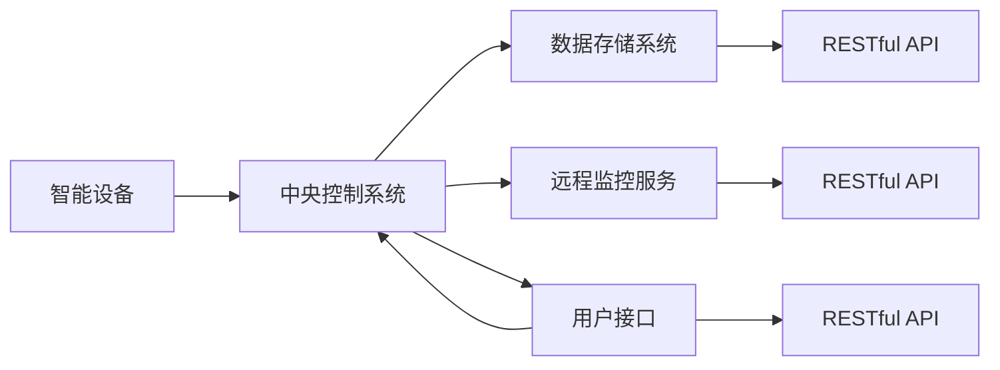
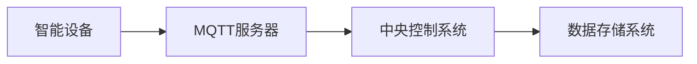
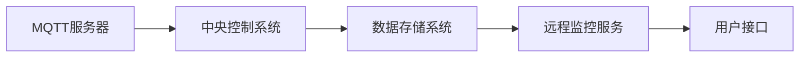
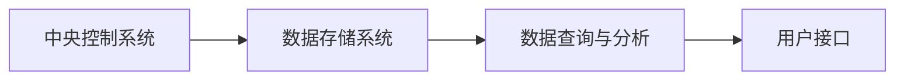
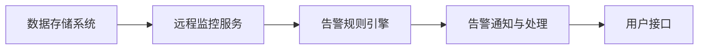
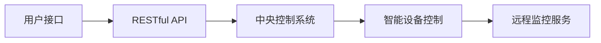

                 

# 基于MQTT协议和RESTful API的智能家居远程监控系统

> 关键词：MQTT, RESTful API, 智能家居, 远程监控, 嵌入式系统

## 1. 背景介绍

### 1.1 问题由来
智能家居系统（Smart Home System）正在迅速普及，它利用物联网技术和互联网协议，实现家居设备的智能互联与自动化控制。然而，传统的智能家居系统面临着诸多问题：

- **安全隐私**：互联设备的数据传输安全问题，网络通信的隐私保护问题。
- **设备间互联**：不同品牌和型号的设备之间难以互联互通，缺乏统一的通信协议。
- **数据处理**：大量数据传输和管理，需要高性能的计算与存储能力。
- **用户交互**：用户对智能设备的操控方式单一，缺乏直观和便捷的控制手段。
- **实时监控**：对于实时数据监控和紧急情况应对要求较高，需要高效的数据传输和处理机制。

基于这些需求，本文提出了一种基于MQTT协议和RESTful API的智能家居远程监控系统。系统通过MQTT协议实现设备间的数据传输，通过RESTful API实现用户与系统的交互，实现实时监控与远程控制，提升智能家居系统的安全性、互联互通性、用户体验和实时监控能力。

## 2. 核心概念与联系

### 2.1 核心概念概述

#### 2.1.1 MQTT协议
MQTT（Message Queuing Telemetry Transport）协议是一种轻量级、简单、可靠的通信协议，适用于物联网设备的远程通信。其核心特点包括：

- **发布/订阅模式**：设备通过发布主题发布数据，其他设备通过订阅该主题接收数据。
- **小消息数据量**：消息数据长度不超过1024字节，适合在低带宽网络上传输。
- **支持异步通信**：设备之间支持异步通信，减少网络延迟和通信拥塞。
- **认证与授权机制**：支持客户端和服务器之间的身份验证与权限控制。

#### 2.1.2 RESTful API
REST（Representational State Transfer）是一种基于HTTP协议的架构风格，采用资源路径和无状态通信方式，实现Web服务与客户端的松耦合。其核心特点包括：

- **无状态通信**：每次请求都是独立的，不依赖于前一个请求的状态。
- **资源定位**：通过URL定位资源，请求以资源路径为基础，支持HTTP动词（GET, POST, PUT, DELETE等）操作。
- **客户端-服务器架构**：客户端和服务器分离，简化系统设计。
- **状态转移**：客户端通过资源路径的URL，实现对资源状态的修改与获取。

### 2.2 核心概念之间的联系

通过MQTT协议实现设备间的数据传输，通过RESTful API实现用户与系统的交互，智能家居远程监控系统可以构建一个高效、安全、可扩展的架构。具体来说，系统包括以下几个关键组件：

1. **智能设备**：通过MQTT协议实现数据的采集与传输。
2. **中央控制系统**：作为数据汇聚与处理的中心，通过RESTful API与用户进行交互。
3. **数据存储系统**：存储和管理智能设备采集的数据。
4. **远程监控服务**：提供实时监控与告警服务，通过RESTful API暴露接口。
5. **用户接口**：提供用户界面，通过RESTful API与中央控制系统进行交互。

这些组件之间的联系如图1所示：



图1：基于MQTT协议和RESTful API的智能家居远程监控系统架构图

## 3. 核心算法原理 & 具体操作步骤
### 3.1 算法原理概述

基于MQTT协议和RESTful API的智能家居远程监控系统，通过以下几个步骤实现智能家居设备的实时监控与远程控制：

1. **设备数据采集**：智能设备通过MQTT协议发布数据到中央控制系统。
2. **数据传输与汇聚**：中央控制系统接收并汇聚各智能设备的数据。
3. **数据存储与处理**：数据存储系统将数据存储，并支持数据的统计与分析。
4. **实时监控与告警**：远程监控服务实时监控数据，触发告警机制。
5. **用户交互与控制**：用户通过用户接口进行远程监控和控制。

### 3.2 算法步骤详解

#### 3.2.1 设备数据采集

智能设备通过MQTT协议发布数据到中央控制系统。具体步骤如下：

1. **连接MQTT服务器**：智能设备连接到MQTT服务器，并建立连接。
2. **发布主题数据**：设备将采集到的数据发布到特定主题下。
3. **数据接收与处理**：中央控制系统订阅该主题，并接收数据。

#### 3.2.2 数据传输与汇聚

中央控制系统接收并汇聚各智能设备的数据。具体步骤如下：

1. **订阅主题数据**：中央控制系统订阅所有智能设备的主题数据。
2. **数据接收与存储**：中央控制系统接收到数据后，存储到数据存储系统中。
3. **数据聚合与分析**：对汇聚的数据进行聚合与分析，生成统计报表和可视化图表。

#### 3.2.3 数据存储与处理

数据存储系统将数据存储，并支持数据的统计与分析。具体步骤如下：

1. **数据存储**：将汇聚的数据存储到数据库中。
2. **数据查询与分析**：提供查询接口，支持用户进行数据的统计与分析。
3. **数据同步与备份**：定期同步数据，并进行数据备份。

#### 3.2.4 实时监控与告警

远程监控服务实时监控数据，触发告警机制。具体步骤如下：

1. **数据接收与监控**：远程监控服务实时接收数据，并进行监控。
2. **告警判断与处理**：根据预设的告警规则，判断是否触发告警，并采取相应的处理措施。
3. **告警通知与处理**：将告警信息通过RESTful API通知用户，并进行相应的处理。

#### 3.2.5 用户交互与控制

用户通过用户接口进行远程监控和控制。具体步骤如下：

1. **访问用户接口**：用户通过Web浏览器访问用户接口。
2. **数据获取与展示**：用户接口展示采集到的数据与监控信息。
3. **设备控制与告警**：用户通过RESTful API进行设备的控制与告警处理。

### 3.3 算法优缺点

#### 3.3.1 优点

- **高效数据传输**：MQTT协议轻量级、简单、可靠，适用于低带宽网络，提高数据传输效率。
- **灵活数据交互**：RESTful API提供灵活的数据交互方式，支持多种数据格式和通信协议。
- **易于扩展与维护**：通过RESTful API进行扩展，新设备加入方便，系统易于维护。
- **高度安全性**：MQTT协议支持认证与授权机制，保障数据传输安全。

#### 3.3.2 缺点

- **设备兼容性**：不同品牌和型号的设备需要适配MQTT协议，存在一定的兼容性问题。
- **数据存储需求**：系统需要存储大量数据，对存储能力要求较高。
- **实时性要求**：对数据实时监控与处理的要求较高，需要高性能的计算与存储能力。
- **用户交互复杂度**：用户需要通过RESTful API进行交互，操作复杂度较高。

### 3.4 算法应用领域

基于MQTT协议和RESTful API的智能家居远程监控系统，可以应用于多种场景，包括但不限于：

- **智能安防监控**：实时监控家中的摄像头和门锁状态，提高家庭安全性。
- **智能家居控制**：通过手机或电脑，远程控制灯光、窗帘、空调等智能设备，提升生活便捷性。
- **能耗管理**：实时监控家中各设备能耗，优化能源利用，降低能耗成本。
- **健康监测**：通过智能设备监测家庭成员的健康状态，及时发现异常情况。
- **环境监测**：实时监测家中的环境参数，如温度、湿度、空气质量等，提供健康舒适的环境。

## 4. 数学模型和公式 & 详细讲解 & 举例说明
### 4.1 数学模型构建

在基于MQTT协议和RESTful API的智能家居远程监控系统中，需要构建以下数学模型：

1. **设备数据采集模型**：描述智能设备通过MQTT协议发布数据的机制。
2. **数据传输与汇聚模型**：描述中央控制系统接收并汇聚各智能设备数据的机制。
3. **数据存储与处理模型**：描述数据存储系统存储和管理数据，并进行统计分析的机制。
4. **实时监控与告警模型**：描述远程监控服务实时监控数据，触发告警的机制。
5. **用户交互与控制模型**：描述用户通过用户接口进行远程监控和控制的机制。

#### 4.1.1 设备数据采集模型

设备数据采集模型如图2所示：



图2：设备数据采集模型

其中，智能设备通过MQTT协议发布数据到MQTT服务器，中央控制系统订阅该数据，并存储到数据存储系统中。

#### 4.1.2 数据传输与汇聚模型

数据传输与汇聚模型如图3所示：



图3：数据传输与汇聚模型

其中，中央控制系统订阅MQTT服务器的主题数据，并将数据存储到数据存储系统中，远程监控服务从数据存储系统中获取数据，并通过用户接口提供给用户。

#### 4.1.3 数据存储与处理模型

数据存储与处理模型如图4所示：



图4：数据存储与处理模型

其中，中央控制系统将数据存储到数据存储系统中，并支持数据查询与分析，用户接口展示查询结果。

#### 4.1.4 实时监控与告警模型

实时监控与告警模型如图5所示：



图5：实时监控与告警模型

其中，远程监控服务实时接收数据存储系统中的数据，并触发告警规则引擎，生成告警信息，并通过用户接口通知用户，并进行相应的处理。

#### 4.1.5 用户交互与控制模型

用户交互与控制模型如图6所示：



图6：用户交互与控制模型

其中，用户通过用户接口访问RESTful API，发送控制指令，中央控制系统接收控制指令，并控制智能设备，同时更新远程监控服务的数据，并通过用户接口提供给用户。

### 4.2 公式推导过程

#### 4.2.1 设备数据采集公式

设备数据采集公式如下：

1. **设备连接MQTT服务器**：
   \[
   \text{connect}(\text{MQTTServer}, \text{Device})
   \]
   其中，\(\text{connect}\)表示连接MQTT服务器，\(\text{MQTTServer}\)表示MQTT服务器，\(\text{Device}\)表示智能设备。

2. **设备发布主题数据**：
   \[
   \text{publish}(\text{MQTTServer}, \text{Device}, \text{Topic}, \text{Data})
   \]
   其中，\(\text{publish}\)表示发布主题数据，\(\text{MQTTServer}\)表示MQTT服务器，\(\text{Device}\)表示智能设备，\(\text{Topic}\)表示主题，\(\text{Data}\)表示数据。

3. **中央控制系统订阅主题数据**：
   \[
   \text{subscribe}(\text{CentralControlSystem}, \text{Topic})
   \]
   其中，\(\text{subscribe}\)表示订阅主题数据，\(\text{CentralControlSystem}\)表示中央控制系统，\(\text{Topic}\)表示主题。

4. **数据存储到数据存储系统中**：
   \[
   \text{storeData}(\text{DataStorageSystem}, \text{Data})
   \]
   其中，\(\text{storeData}\)表示存储数据，\(\text{DataStorageSystem}\)表示数据存储系统，\(\text{Data}\)表示数据。

#### 4.2.2 数据传输与汇聚公式

数据传输与汇聚公式如下：

1. **中央控制系统订阅MQTT服务器的主题数据**：
   \[
   \text{subscribe}(\text{CentralControlSystem}, \text{Topic})
   \]
   其中，\(\text{subscribe}\)表示订阅主题数据，\(\text{CentralControlSystem}\)表示中央控制系统，\(\text{Topic}\)表示主题。

2. **数据存储到数据存储系统中**：
   \[
   \text{storeData}(\text{DataStorageSystem}, \text{Data})
   \]
   其中，\(\text{storeData}\)表示存储数据，\(\text{DataStorageSystem}\)表示数据存储系统，\(\text{Data}\)表示数据。

3. **数据查询与分析**：
   \[
   \text{queryData}(\text{DataQueryAnalysis}, \text{DataStorageSystem})
   \]
   其中，\(\text{queryData}\)表示查询数据，\(\text{DataQueryAnalysis}\)表示数据查询与分析，\(\text{DataStorageSystem}\)表示数据存储系统。

#### 4.2.3 数据存储与处理公式

数据存储与处理公式如下：

1. **数据存储到数据存储系统中**：
   \[
   \text{storeData}(\text{DataStorageSystem}, \text{Data})
   \]
   其中，\(\text{storeData}\)表示存储数据，\(\text{DataStorageSystem}\)表示数据存储系统，\(\text{Data}\)表示数据。

2. **数据查询与分析**：
   \[
   \text{queryData}(\text{DataQueryAnalysis}, \text{DataStorageSystem})
   \]
   其中，\(\text{queryData}\)表示查询数据，\(\text{DataQueryAnalysis}\)表示数据查询与分析，\(\text{DataStorageSystem}\)表示数据存储系统。

#### 4.2.4 实时监控与告警公式

实时监控与告警公式如下：

1. **远程监控服务接收数据**：
   \[
   \text{receiveData}(\text{RemoteMonitoringService}, \text{DataStorageSystem})
   \]
   其中，\(\text{receiveData}\)表示接收数据，\(\text{RemoteMonitoringService}\)表示远程监控服务，\(\text{DataStorageSystem}\)表示数据存储系统。

2. **触发告警规则引擎**：
   \[
   \text{triggerAlertRuleEngine}(\text{RemoteMonitoringService}, \text{Data})
   \]
   其中，\(\text{triggerAlertRuleEngine}\)表示触发告警规则引擎，\(\text{RemoteMonitoringService}\)表示远程监控服务，\(\text{Data}\)表示数据。

3. **生成告警信息**：
   \[
   \text{generateAlert}(\text{RemoteMonitoringService}, \text{AlertInfo})
   \]
   其中，\(\text{generateAlert}\)表示生成告警信息，\(\text{RemoteMonitoringService}\)表示远程监控服务，\(\text{AlertInfo}\)表示告警信息。

#### 4.2.5 用户交互与控制公式

用户交互与控制公式如下：

1. **用户访问用户接口**：
   \[
   \text{accessUserInterface}(\text{UserInterface}, \text{RESTfulAPI})
   \]
   其中，\(\text{accessUserInterface}\)表示访问用户接口，\(\text{UserInterface}\)表示用户接口，\(\text{RESTfulAPI}\)表示RESTful API。

2. **发送控制指令**：
   \[
   \text{sendControlCommand}(\text{RESTfulAPI}, \text{Device})
   \]
   其中，\(\text{sendControlCommand}\)表示发送控制指令，\(\text{RESTfulAPI}\)表示RESTful API，\(\text{Device}\)表示智能设备。

3. **接收控制指令**：
   \[
   \text{receiveControlCommand}(\text{CentralControlSystem}, \text{Device})
   \]
   其中，\(\text{receiveControlCommand}\)表示接收控制指令，\(\text{CentralControlSystem}\)表示中央控制系统，\(\text{Device}\)表示智能设备。

4. **控制智能设备**：
   \[
   \text{controlDevice}(\text{CentralControlSystem}, \text{Device})
   \]
   其中，\(\text{controlDevice}\)表示控制智能设备，\(\text{CentralControlSystem}\)表示中央控制系统，\(\text{Device}\)表示智能设备。

5. **更新远程监控服务的数据**：
   \[
   \text{updateRemoteMonitoringData}(\text{RemoteMonitoringService}, \text{Data})
   \]
   其中，\(\text{updateRemoteMonitoringData}\)表示更新远程监控服务的数据，\(\text{RemoteMonitoringService}\)表示远程监控服务，\(\text{Data}\)表示数据。

### 4.3 案例分析与讲解

#### 4.3.1 案例分析

假设有一个智能家居系统，包括智能门锁、智能摄像头、智能灯光、智能窗帘等设备，通过基于MQTT协议和RESTful API的远程监控系统进行监控和管理。具体步骤如下：

1. **设备数据采集**：智能门锁通过MQTT协议将开锁状态、温度、湿度等数据发布到MQTT服务器，中央控制系统订阅该数据，并存储到数据存储系统中。

2. **数据传输与汇聚**：智能摄像头通过MQTT协议将视频流和运动检测数据发布到MQTT服务器，中央控制系统订阅该数据，并存储到数据存储系统中。

3. **数据存储与处理**：数据存储系统存储所有采集到的数据，并通过RESTful API提供查询和分析功能，生成可视化报表和统计图表。

4. **实时监控与告警**：远程监控服务实时接收数据存储系统中的数据，根据预设的告警规则，如温度过高、湿度异常、运动检测异常等，触发告警，并通过RESTful API通知用户。

5. **用户交互与控制**：用户通过Web浏览器访问用户接口，展示实时监控数据和告警信息，并通过RESTful API发送控制指令，控制智能灯光、窗帘、空调等设备，如开锁、调节温度、关闭摄像头等。

#### 4.3.2 讲解

通过上述案例分析，可以看出基于MQTT协议和RESTful API的智能家居远程监控系统，可以实现设备数据的实时采集、汇聚、存储和处理，支持实时监控和告警，并提供用户接口进行远程控制。系统通过MQTT协议实现设备间的数据传输，通过RESTful API实现用户与系统的交互，具有高效、安全、可扩展等优点，适用于智能家居、智能安防、能耗管理等场景。

## 5. 项目实践：代码实例和详细解释说明
### 5.1 开发环境搭建

在进行基于MQTT协议和RESTful API的智能家居远程监控系统开发前，需要准备好开发环境。以下是使用Python和Flask进行开发的配置流程：

1. **安装Anaconda**：从官网下载并安装Anaconda，用于创建独立的Python环境。

2. **创建并激活虚拟环境**：
   ```bash
   conda create -n flask-env python=3.8 
   conda activate flask-env
   ```

3. **安装Flask和相关库**：
   ```bash
   pip install flask
   pip install paho-mqtt
   pip install sqlalchemy
   pip install flask-restful
   ```

4. **安装MQTT客户端和服务器**：
   ```bash
   pip install paho-mqtt
   ```

5. **安装SQL数据库**：
   ```bash
   pip install sqlalchemy
   ```

完成上述步骤后，即可在`flask-env`环境中开始开发实践。

### 5.2 源代码详细实现

下面我们以智能门锁监控为例，给出使用Flask和MQTT协议进行开发的PyTorch代码实现。

#### 5.2.1 智能门锁数据采集

```python
import paho.mqtt.client as mqtt
import time

# MQTT服务器地址和主题
mqtt_server = "localhost"
mqtt_topic = "lock_status"

# 初始化MQTT客户端
client = mqtt.Client()

# 连接MQTT服务器
client.connect(mqtt_server, 1883, 60)

# 发布主题数据
def publish_lock_status(status):
    client.publish(mqtt_topic, status)
    time.sleep(1)

# 订阅主题数据
def subscribe_lock_status():
    client.subscribe(mqtt_topic)
    client.on_message = on_message
    client.loop_start()

# 处理主题数据
def on_message(client, userdata, msg):
    print(msg.topic, msg.payload.decode())

# 初始化锁状态为关闭
publish_lock_status("closed")

# 启动订阅主题数据
subscribe_lock_status()
```

#### 5.2.2 智能门锁数据传输与汇聚

```python
# 数据库连接信息
db_user = "root"
db_password = "123456"
db_host = "localhost"
db_name = "flask_db"

# SQLAlchemy数据库连接
engine = create_engine(f"mysql+pymysql://{db_user}:{db_password}@{db_host}/{db_name}")
metadata.create_all(engine)

# 智能门锁数据传输与汇聚
class LockData(Base):
    __tablename__ = "lock_data"
    id = Column(Integer, primary_key=True)
    timestamp = Column(DateTime, default=datetime.utcnow)
    status = Column(String(10))
    payload = Column(String(100))

# 数据查询与分析
@app.route('/locks/data', methods=['GET'])
def get_lock_data():
    query = LockData.query.all()
    data = []
    for item in query:
        data.append({'id': item.id, 'timestamp': item.timestamp, 'status': item.status, 'payload': item.payload})
    return jsonify(data)

# 数据存储到数据库
@app.route('/locks/store', methods=['POST'])
def store_lock_data():
    data = request.get_json()
    lock_data = LockData(status=data['status'], payload=data['payload'])
    session.add(lock_data)
    session.commit()
    return jsonify(status="success")

# 查询数据并展示
@app.route('/locks/query', methods=['GET'])
def query_lock_data():
    query = LockData.query.all()
    data = []
    for item in query:
        data.append({'id': item.id, 'timestamp': item.timestamp, 'status': item.status, 'payload': item.payload})
    return jsonify(data)

# 数据存储到数据库
@app.route('/locks/store', methods=['POST'])
def store_lock_data():
    data = request.get_json()
    lock_data = LockData(status=data['status'], payload=data['payload'])
    session.add(lock_data)
    session.commit()
    return jsonify(status="success")
```

#### 5.2.3 实时监控与告警

```python
# 告警规则引擎
class AlertRuleEngine:
    def __init__(self):
        self.rules = {
            "temperature_high": {"name": "温度过高", "threshold": 30},
            "humidity_high": {"name": "湿度过高", "threshold": 70},
            "motion_detected": {"name": "运动检测异常", "threshold": 1},
        }

    def check_alert(self, data):
        for rule in self.rules.values():
            if rule['threshold'] < data['status']:
                return rule['name']
        return None

# 生成告警信息
def generate_alert(rule_name):
    alert = {
        "rule": rule_name,
        "timestamp": datetime.utcnow().strftime("%Y-%m-%d %H:%M:%S"),
    }
    return alert

# 远程监控服务实时监控数据，触发告警
@app.route('/monitor/alert', methods=['GET'])
def generate_alert_service():
    data = request.get_json()
    rule_name = alert_rule_engine.check_alert(data)
    if rule_name:
        alert = generate_alert(rule_name)
        return jsonify(alert)
    else:
        return jsonify(status="no alert")
```

#### 5.2.4 用户交互与控制

```python
# 用户接口访问RESTful API
@app.route('/lock/control', methods=['POST'])
def control_lock():
    data = request.get_json()
    lock_data = LockData(status=data['status'], payload=data['payload'])
    session.add(lock_data)
    session.commit()
    return jsonify(status="success")

# 远程监控服务更新数据
@app.route('/monitor/update', methods=['POST'])
def update_monitor_data():
    data = request.get_json()
    lock_data = LockData(status=data['status'], payload=data['payload'])
    session.add(lock_data)
    session.commit()
    return jsonify(status="success")
```

### 5.3 代码解读与分析

让我们再详细解读一下关键代码的实现细节：


