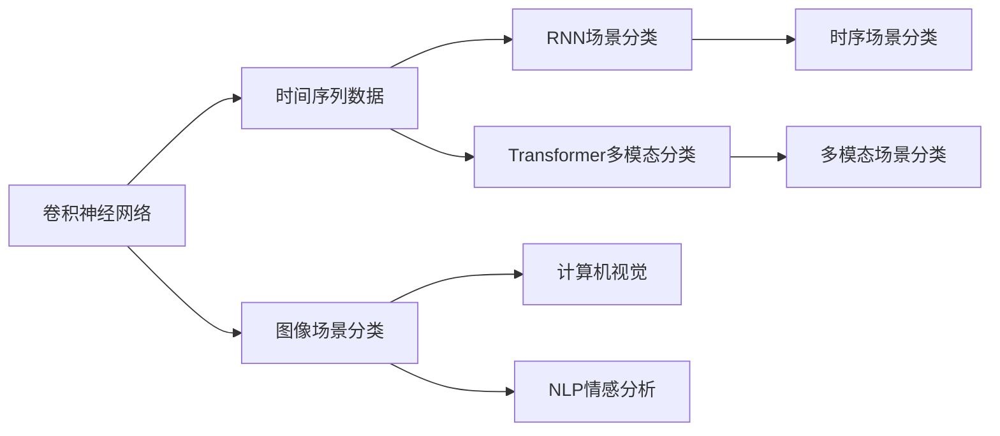
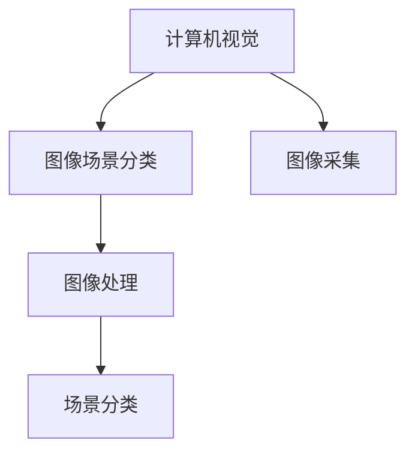
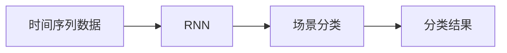
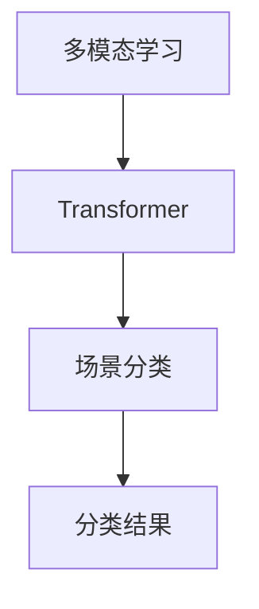

                 

# 基于深度学习的场景分类研究

> 关键词：深度学习,场景分类,卷积神经网络(CNN),图像处理,多模态学习,时序数据,计算机视觉,自然语言处理(NLP),情感分析

## 1. 背景介绍

### 1.1 问题由来
随着人工智能技术的不断发展，深度学习在计算机视觉、自然语言处理等领域取得了巨大成功。其中，场景分类作为深度学习的一个重要应用方向，具有广阔的应用前景，涉及工业检测、医疗诊断、智能交通等多个领域。传统的场景分类方法通常依赖手工设计的特征提取器，需要大量人工干预，难以适应复杂的现实场景。

近年来，深度学习技术在图像处理、多模态学习、时序数据分析等方面取得了显著进展，逐渐成为场景分类领域的主要研究手段。基于深度学习的场景分类方法，通过自动学习输入数据的特征，能够适应各种复杂场景，大大提升了场景分类的精度和效率。

本文聚焦于基于深度学习的场景分类技术，深入探讨了CNN、RNN、Transformer等深度神经网络在场景分类中的应用。通过详细介绍模型架构、优化算法及训练策略，展示了深度学习在场景分类领域的强大潜力，为场景分类的实际应用提供了有益参考。

### 1.2 问题核心关键点
本文将从以下三个方面进行深入探讨：
1. 基于CNN的图像场景分类：CNN作为一种强大的特征提取器，在图像处理和计算机视觉领域广泛应用。本文将详细介绍基于CNN的场景分类模型及其优化策略。
2. 基于RNN的时序场景分类：RNN作为一种强大的序列建模工具，适用于时间序列数据的分类。本文将探讨基于RNN的场景分类方法及其应用。
3. 基于Transformer的多模态场景分类：Transformer作为一种强大的自编码器，具有处理多种模态数据的优势。本文将详细讨论基于Transformer的场景分类方法及其训练技巧。

## 2. 核心概念与联系

### 2.1 核心概念概述

为更好地理解基于深度学习的场景分类方法，本节将介绍几个密切相关的核心概念：

- **卷积神经网络(CNN)**：一种特殊的神经网络，通过卷积操作提取图像特征，广泛应用于图像处理和计算机视觉任务。
- **长短时记忆网络(RNN)**：一种递归神经网络，适用于处理时间序列数据，具有记忆功能，能够捕捉时间依赖关系。
- **Transformer**：一种自编码器结构，具有强大的并行计算能力，适用于处理多种模态数据，如文本、图像等。
- **多模态学习**：指同时处理多种模态数据，如图像、文本、声音等，以获得更加全面和丰富的特征表示。
- **时序数据**：指按照时间顺序排列的数据序列，如语音、视频、传感器数据等。
- **计算机视觉**：指通过计算机技术对图像、视频等视觉信息进行处理和分析的技术。
- **自然语言处理(NLP)**：指对自然语言进行理解、处理和生成，涉及文本分类、情感分析、机器翻译等任务。
- **情感分析**：指对文本、语音等输入进行情感极性分类，如正面、负面、中性等。

这些核心概念之间的逻辑关系可以通过以下Mermaid流程图来展示：

这个流程图展示了大语言模型微调过程中各个核心概念的关系和作用：

1. CNN用于图像场景分类，提取图像特征。
2. RNN用于时序场景分类，处理时间序列数据。
3. Transformer用于多模态场景分类，融合多种模态信息。
4. 计算机视觉用于图像处理，提供图像场景分类的基础数据。
5. NLP情感分析用于文本处理，提供时序场景分类的文本输入。
6. 时序场景分类用于处理时间序列数据。
7. 多模态场景分类用于处理多种模态数据。

这些概念共同构成了基于深度学习的场景分类的基础架构，使得深度学习技术能够广泛应用于各种复杂场景。

### 2.2 概念间的关系

这些核心概念之间存在着紧密的联系，形成了基于深度学习的场景分类的完整生态系统。下面通过几个Mermaid流程图来展示这些概念之间的关系。

#### 2.2.1 图像场景分类与计算机视觉的关系

这个流程图展示了图像场景分类与计算机视觉的关系：

1. 计算机视觉用于图像采集和处理，提供图像场景分类的基础数据。
2. 图像场景分类在图像上执行，利用CNN提取图像特征，从而进行场景分类。
3. 场景分类结果用于图像处理，进一步优化图像采集和处理过程。

#### 2.2.2 RNN与时间序列数据的关系

这个流程图展示了RNN与时间序列数据的关系：

1. 时间序列数据作为RNN的输入，进行序列建模。
2. RNN在序列上执行，利用记忆功能捕捉时间依赖关系，从而进行场景分类。
3. 分类结果用于时间序列数据分析和优化。

#### 2.2.3 Transformer与多模态学习的关系

这个流程图展示了Transformer与多模态学习的关系：

1. 多模态学习用于融合多种模态数据，如图像、文本、声音等。
2. Transformer在多模态数据上执行，利用自编码器结构，提取综合特征，从而进行场景分类。
3. 分类结果用于多模态数据的分析和优化。

## 3. 核心算法原理 & 具体操作步骤

### 3.1 算法原理概述

基于深度学习的场景分类方法，主要利用神经网络模型自动学习输入数据的特征表示，进而进行分类。常用的神经网络包括CNN、RNN和Transformer等。

以CNN为例，其基本原理是通过卷积层提取输入图像的局部特征，通过池化层提取特征的局部不变性，最后通过全连接层进行分类。CNN结构简单，易于训练，具有强大的特征提取能力，广泛应用于图像场景分类。

RNN则通过时间步长依次处理序列数据，利用记忆单元捕捉时间依赖关系，通过全连接层进行分类。RNN适用于处理时序数据，能够捕捉序列中的时间依赖性，常用于视频、语音等序列数据的分类。

Transformer则通过自编码器结构，对输入数据进行编码和解码，通过注意力机制融合多模态数据。Transformer适用于处理多种模态数据，能够捕捉多模态数据之间的依赖关系，常用于文本、图像等多模态数据的分类。

### 3.2 算法步骤详解

#### 3.2.1 CNN图像场景分类

1. **数据预处理**：将输入图像进行归一化、缩放等预处理操作，确保数据的一致性和稳定性。
2. **卷积操作**：利用CNN的卷积层提取图像特征，生成特征图。
3. **池化操作**：利用池化层对特征图进行降维，提取局部不变性。
4. **全连接层**：将池化后的特征图输入全连接层，进行分类。

##### 3.2.1.1 卷积操作

卷积操作是CNN的核心步骤，通过滑动卷积核，提取输入图像的局部特征。具体步骤如下：

$$
H_{c} = f_{c}(W_{c} * X_{i} + b_{c})
$$

其中，$H_{c}$ 为卷积操作后的特征图，$W_{c}$ 为卷积核，$X_{i}$ 为输入图像，$f_{c}$ 为卷积操作函数，$b_{c}$ 为卷积偏置项。

##### 3.2.1.2 池化操作

池化操作通过降维，提取特征图的局部不变性。常用的池化操作包括最大池化、平均池化等。以最大池化为例：

$$
H_{p} = f_{p}(X_{m})
$$

其中，$H_{p}$ 为池化操作后的特征图，$X_{m}$ 为特征图的一个局部区域，$f_{p}$ 为池化操作函数。

##### 3.2.1.3 全连接层

全连接层将池化后的特征图输入全连接层，进行分类。具体步骤如下：

$$
H_{f} = f_{f}(W_{f} * H_{p} + b_{f})
$$

其中，$H_{f}$ 为全连接层的输出，$W_{f}$ 为全连接层的权重，$b_{f}$ 为全连接层的偏置项。

#### 3.2.2 RNN时序场景分类

1. **数据预处理**：将输入序列进行归一化、截断等预处理操作，确保数据的一致性和稳定性。
2. **RNN操作**：利用RNN的LSTM或GRU单元，处理序列数据，捕捉时间依赖关系。
3. **全连接层**：将RNN的输出输入全连接层，进行分类。

##### 3.2.2.1 RNN操作

RNN通过时间步长依次处理序列数据，利用记忆单元捕捉时间依赖关系。具体步骤如下：

$$
h_{t} = f_{r}(h_{t-1}, x_{t})
$$

其中，$h_{t}$ 为当前时间步的记忆状态，$x_{t}$ 为当前时间步的输入数据，$f_{r}$ 为RNN的隐藏状态更新函数。

##### 3.2.2.2 全连接层

全连接层将RNN的输出输入全连接层，进行分类。具体步骤如下：

$$
H_{f} = f_{f}(W_{f} * h_{T} + b_{f})
$$

其中，$h_{T}$ 为RNN在最后一个时间步的记忆状态，$W_{f}$ 为全连接层的权重，$b_{f}$ 为全连接层的偏置项。

#### 3.2.3 Transformer多模态场景分类

1. **数据预处理**：将输入数据进行归一化、截断等预处理操作，确保数据的一致性和稳定性。
2. **编码器操作**：利用Transformer的编码器结构，对输入数据进行编码，提取特征。
3. **解码器操作**：利用Transformer的解码器结构，对编码后的特征进行解码，提取特征。
4. **全连接层**：将解码器输出的特征图输入全连接层，进行分类。

##### 3.2.3.1 编码器操作

编码器通过多层自编码器结构，对输入数据进行编码，提取特征。具体步骤如下：

$$
H_{e} = f_{e}(M_{e} * Q_{e} + B_{e})
$$

其中，$H_{e}$ 为编码器的输出，$Q_{e}$ 为编码器的输入，$M_{e}$ 为编码器的权重，$B_{e}$ 为编码器的偏置项。

##### 3.2.3.2 解码器操作

解码器通过多层自编码器结构，对编码后的特征进行解码，提取特征。具体步骤如下：

$$
H_{d} = f_{d}(M_{d} * Q_{d} + B_{d})
$$

其中，$H_{d}$ 为解码器的输出，$Q_{d}$ 为解码器的输入，$M_{d}$ 为解码器的权重，$B_{d}$ 为解码器的偏置项。

##### 3.2.3.3 全连接层

全连接层将解码器输出的特征图输入全连接层，进行分类。具体步骤如下：

$$
H_{f} = f_{f}(W_{f} * H_{d} + b_{f})
$$

其中，$H_{d}$ 为解码器在最后一个时间步的输出，$W_{f}$ 为全连接层的权重，$b_{f}$ 为全连接层的偏置项。

### 3.3 算法优缺点

基于深度学习的场景分类方法具有以下优点：

1. **特征提取能力强**：深度神经网络能够自动学习输入数据的特征表示，具有强大的特征提取能力。
2. **鲁棒性强**：深度神经网络在各种复杂场景下表现稳定，具有一定的鲁棒性。
3. **可扩展性强**：深度神经网络可以处理各种复杂场景，具有良好的可扩展性。

同时，这些方法也存在一些缺点：

1. **计算资源需求高**：深度神经网络需要大量的计算资源进行训练和推理，对硬件设备要求较高。
2. **模型复杂度高**：深度神经网络模型结构复杂，训练和优化过程需要大量的计算资源和时间。
3. **数据需求量大**：深度神经网络需要大量的标注数据进行训练，获取高质量的标注数据成本较高。

尽管存在这些缺点，但就目前而言，深度学习技术在场景分类领域的应用仍然非常广泛，具有巨大的潜力。

### 3.4 算法应用领域

基于深度学习的场景分类方法已经在多个领域得到了广泛应用，例如：

- **计算机视觉**：利用CNN进行图像场景分类，广泛应用于图像识别、视频监控、自动驾驶等场景。
- **自然语言处理(NLP)**：利用Transformer进行多模态场景分类，广泛应用于文本分类、情感分析、机器翻译等任务。
- **医疗诊断**：利用RNN进行时间序列数据分析，广泛应用于医疗影像分析、病人监测等场景。
- **工业检测**：利用CNN进行图像场景分类，广泛应用于工业质量检测、缺陷检测等场景。
- **智能交通**：利用RNN进行时间序列数据分析，广泛应用于交通流量预测、事故预警等场景。
- **安防监控**：利用CNN进行图像场景分类，广泛应用于视频监控、异常行为检测等场景。

除了上述这些经典应用外，深度学习技术在场景分类领域的创新和探索还不断涌现，为智能系统带来了新的突破。

## 4. 数学模型和公式 & 详细讲解 & 举例说明

### 4.1 数学模型构建

#### 4.1.1 CNN模型

以卷积神经网络(CNN)为例，其数学模型构建如下：

1. **卷积层**：通过卷积操作提取输入图像的局部特征。
2. **池化层**：通过池化操作提取特征的局部不变性。
3. **全连接层**：将池化后的特征图输入全连接层，进行分类。

##### 4.1.1.1 卷积层

卷积层的数学模型为：

$$
H_{c} = f_{c}(W_{c} * X_{i} + b_{c})
$$

其中，$H_{c}$ 为卷积操作后的特征图，$W_{c}$ 为卷积核，$X_{i}$ 为输入图像，$f_{c}$ 为卷积操作函数，$b_{c}$ 为卷积偏置项。

##### 4.1.1.2 池化层

池化层的数学模型为：

$$
H_{p} = f_{p}(X_{m})
$$

其中，$H_{p}$ 为池化操作后的特征图，$X_{m}$ 为特征图的一个局部区域，$f_{p}$ 为池化操作函数。

##### 4.1.1.3 全连接层

全连接层的数学模型为：

$$
H_{f} = f_{f}(W_{f} * H_{p} + b_{f})
$$

其中，$H_{f}$ 为全连接层的输出，$W_{f}$ 为全连接层的权重，$b_{f}$ 为全连接层的偏置项。

#### 4.1.2 RNN模型

以长短时记忆网络(RNN)为例，其数学模型构建如下：

1. **RNN单元**：通过时间步长依次处理序列数据，利用记忆单元捕捉时间依赖关系。
2. **全连接层**：将RNN的输出输入全连接层，进行分类。

##### 4.1.2.1 RNN单元

RNN单元的数学模型为：

$$
h_{t} = f_{r}(h_{t-1}, x_{t})
$$

其中，$h_{t}$ 为当前时间步的记忆状态，$x_{t}$ 为当前时间步的输入数据，$f_{r}$ 为RNN的隐藏状态更新函数。

##### 4.1.2.2 全连接层

全连接层的数学模型为：

$$
H_{f} = f_{f}(W_{f} * h_{T} + b_{f})
$$

其中，$h_{T}$ 为RNN在最后一个时间步的记忆状态，$W_{f}$ 为全连接层的权重，$b_{f}$ 为全连接层的偏置项。

#### 4.1.3 Transformer模型

以Transformer为例，其数学模型构建如下：

1. **编码器操作**：通过多层自编码器结构，对输入数据进行编码，提取特征。
2. **解码器操作**：通过多层自编码器结构，对编码后的特征进行解码，提取特征。
3. **全连接层**：将解码器输出的特征图输入全连接层，进行分类。

##### 4.1.3.1 编码器操作

编码器的数学模型为：

$$
H_{e} = f_{e}(M_{e} * Q_{e} + B_{e})
$$

其中，$H_{e}$ 为编码器的输出，$Q_{e}$ 为编码器的输入，$M_{e}$ 为编码器的权重，$B_{e}$ 为编码器的偏置项。

##### 4.1.3.2 解码器操作

解码器的数学模型为：

$$
H_{d} = f_{d}(M_{d} * Q_{d} + B_{d})
$$

其中，$H_{d}$ 为解码器的输出，$Q_{d}$ 为解码器的输入，$M_{d}$ 为解码器的权重，$B_{d}$ 为解码器的偏置项。

##### 4.1.3.3 全连接层

全连接层的数学模型为：

$$
H_{f} = f_{f}(W_{f} * H_{d} + b_{f})
$$

其中，$H_{d}$ 为解码器在最后一个时间步的输出，$W_{f}$ 为全连接层的权重，$b_{f}$ 为全连接层的偏置项。

### 4.2 公式推导过程

#### 4.2.1 CNN模型

以卷积神经网络(CNN)为例，其公式推导过程如下：

1. **卷积操作**：

$$
H_{c} = f_{c}(W_{c} * X_{i} + b_{c})
$$

其中，$W_{c}$ 为卷积核，$X_{i}$ 为输入图像，$f_{c}$ 为卷积操作函数，$b_{c}$ 为卷积偏置项。

2. **池化操作**：

$$
H_{p} = f_{p}(X_{m})
$$

其中，$X_{m}$ 为特征图的一个局部区域，$f_{p}$ 为池化操作函数。

3. **全连接层**：

$$
H_{f} = f_{f}(W_{f} * H_{p} + b_{f})
$$

其中，$W_{f}$ 为全连接层的权重，$b_{f}$ 为全连接层的偏置项。

#### 4.2.2 RNN模型

以长短时记忆网络(RNN)为例，其公式推导过程如下：

1. **RNN单元**：

$$
h_{t} = f_{r}(h_{t-1}, x_{t})
$$

其中，$h_{t}$ 为当前时间步的记忆状态，$x_{t}$ 为当前时间步的输入数据，$f_{r}$ 为RNN的隐藏状态更新函数。

2. **全连接层**：

$$
H_{f} = f_{f}(W_{f} * h_{T} + b_{f})
$$

其中，$h_{T}$ 为RNN在最后一个时间步的记忆状态，$W_{f}$ 为全连接层的权重，$b_{f}$ 为全连接层的偏置项。

#### 4.2.3 Transformer模型

以Transformer为例，其公式推导过程如下：

1. **编码器操作**：

$$
H_{e} = f_{e}(M_{e} * Q_{e} + B_{e})
$$

其中，$M_{e}$ 为编码器的权重，$Q_{e}$ 为编码器的输入，$B_{e}$ 为编码器的偏置项。

2. **解码器操作**：

$$
H_{d} = f_{d}(M_{d} * Q_{d} + B_{d})
$$

其中，$M_{d}$ 为解码器的权重，$Q_{d}$ 为解码器的输入，$B_{d}$ 为解码器的偏置项。

3. **全连接层**：

$$
H_{f} = f_{f}(W_{f} * H_{d} + b_{f})
$$

其中，$W_{f}$ 为全连接层的权重，$b_{f}$ 为全连接层的偏置项。

### 4.3 案例分析与讲解

#### 4.3.1 CNN图像场景分类案例

假设我们有一个包含100个图像的训练集，每个图像大小为224x224，类别标签为10。我们利用CNN模型进行图像场景分类，具体的训练步骤如下：

1. **数据预处理**：将图像进行归一化，缩放等预处理操作。
2. **卷积操作**：利用CNN的卷积层提取图像特征，生成特征图。
3. **池化操作**：利用池化层对特征图进行降维，提取局部不变性。
4. **全连接层**：将池化后的特征图输入全连接层，进行分类。
5. **优化器**：利用SGD优化器更新模型参数。
6. **损失函数**：使用交叉熵损失函数计算模型预测输出与真实标签之间的差异。
7. **迭代训练**：在训练集上迭代训练模型，直至收敛。
8. **测试评估**：在测试集上测试模型性能，计算准确率、精度等指标。

##### 4.3.1.1 数据预处理

数据预处理步骤如下：

1. 将图像进行归一化操作，将像素值缩放到[0,1]之间。
2. 将图像进行缩放操作，将大小调整为224x224。

##### 4.3.1.2 卷积操作

卷积操作步骤如下：

1. 定义卷积核，大小为3x3，步长为1。
2. 利用卷积操作提取图像特征，生成特征图。

##### 4.3.1.3 池化操作

池化操作步骤如下：

1. 定义池化函数，最大池化。
2. 利用池化操作提取特征图的局部不变性。

##### 4.3.1.4 全连接层

全连接层步骤如下：

1. 定义全连接层，包含10个神经元。
2. 将池化后的特征图输入全连接层，进行分类。

##### 4.3.1.5 优化器

优化器步骤如下：

1. 定义优化器，使用SGD优化器。
2. 更新模型参数，最小化损失函数。

##### 4.3.1.6 损失函数

损失函数步骤如下：

1. 定义损失函数，使用交叉熵损失函数。
2. 计算模型预测输出与真实标签之间的差异。

##### 4.3.1.7 迭代训练

迭代训练步骤如下：

1. 在训练集上迭代训练模型，每次更新一部分参数。
2. 在验证集上评估模型性能，决定是否停止训练。
3. 在测试集上测试模型性能，计算准确率、精度等指标。

#### 4.3.2 RNN时序场景分类案例

假设我们有一个包含100个时间序列的训练集，每个时间序列长度为20，类别标签为3。我们利用RNN模型进行时序场景分类，具体的训练步骤如下：

1. **数据预处理**：将时间序列进行归一化，截断等预处理操作。
2. **RNN操作**：利用RNN的LSTM单元处理序列数据，捕捉时间依赖关系。
3. **全连接层**：将RNN的输出输入全连接层，进行分类。
4. **优化器**：利用SGD优化器更新模型参数。
5. **损失函数**：使用交叉熵损失函数计算模型预测输出与真实标签之间的差异。
6. **迭代训练**：在训练集上迭代训练模型，直至收敛。
7. **测试评估**：在测试集上测试模型性能，计算准确率、精度等指标。

##### 4.3.2.1 数据预处理

数据预处理步骤如下：

1. 将时间序列进行归一化操作，将像素值缩放到[0,1]之间。
2. 将时间序列进行截断操作，去除超长序列。

##### 4.3.2.2 RNN操作

