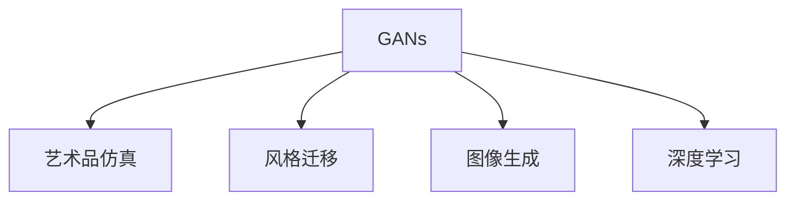
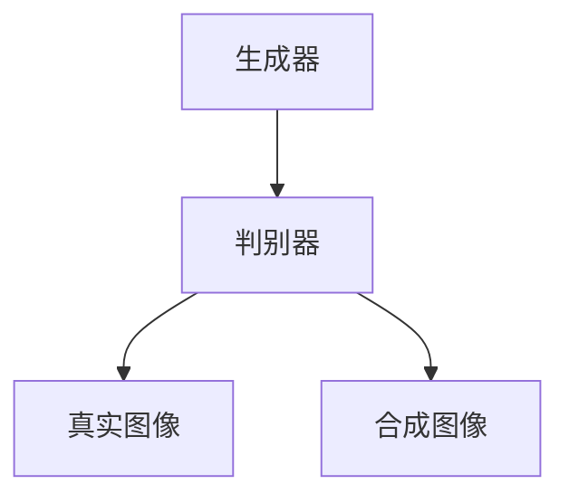
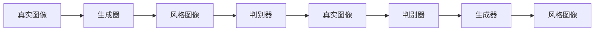
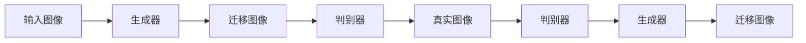
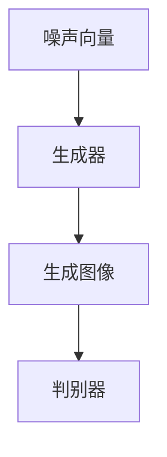
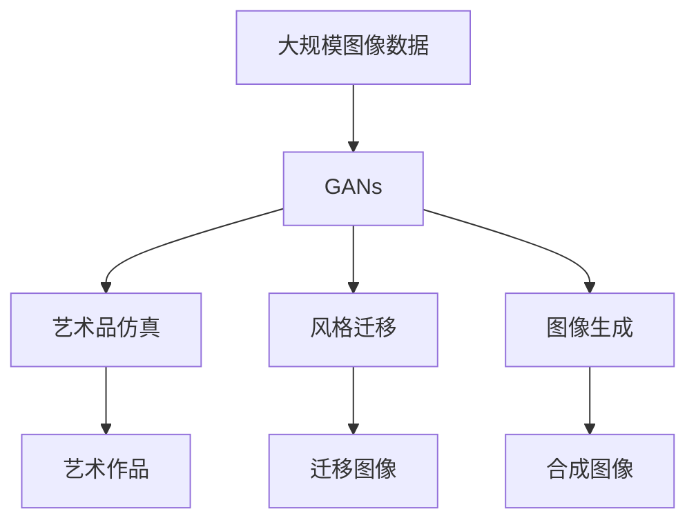

                 

# 基于生成对抗网络的艺术品仿真与风格迁移技术

> 关键词：生成对抗网络,艺术品仿真,风格迁移,图像生成,深度学习

## 1. 背景介绍

### 1.1 问题由来
随着人工智能技术的飞速发展，生成对抗网络（Generative Adversarial Networks, GANs）逐渐成为了图像生成和风格迁移领域的热门技术。GANs由Ian Goodfellow等人于2014年提出，通过两个神经网络的对抗训练过程，可以生成高质量的合成图像。GANs的出现，使得计算机生成图像可以与真实图像相媲美，甚至在某些方面超越人类创作。

GANs在艺术品仿真、风格迁移、图像生成等诸多领域取得了显著的成果。例如，通过GANs可以实现对名画风格的学习和迁移，创造出具有不同风格的艺术作品；在艺术品仿真领域，GANs可以生成古代艺术品的高质量复制品，为文化遗产保护提供支持；在图像生成领域，GANs能够生成逼真的面部图像、人体图像、自然风景等，极大地拓展了计算机图像生成的应用场景。

然而，GANs仍然存在一些挑战，例如训练过程的不稳定性、模型参数的复杂性、生成的图像质量等问题。本论文将详细介绍GANs在艺术品仿真和风格迁移中的应用，分析其原理和特点，并提出一些改进策略，以期在实际应用中取得更好的效果。

### 1.2 问题核心关键点
GANs的核心思想是通过对抗训练过程，生成高质量的合成图像。GANs由两个神经网络组成：生成器（Generator）和判别器（Discriminator）。生成器的作用是生成与真实图像相似的合成图像，判别器的作用是区分真实图像和合成图像，从而训练生成器提高生成图像的质量。GANs的训练过程就是一个不断博弈的过程，生成器不断改进自己的生成能力，而判别器则不断提升其判别能力。

GANs的训练过程复杂，需要大量的训练数据和计算资源。因此，在实际应用中，需要针对具体问题设计合理的训练策略，以提高训练效率和生成图像的质量。

## 2. 核心概念与联系

### 2.1 核心概念概述

为了更好地理解GANs在艺术品仿真和风格迁移中的应用，本节将介绍几个密切相关的核心概念：

- 生成对抗网络（GANs）：由生成器和判别器两个神经网络组成，通过对抗训练过程生成高质量的合成图像。
- 艺术品仿真（Artistic Style Transfer）：通过GANs将真实图像转换为具有特定艺术风格的图像，例如将现代图像转换为毕加索风格的图像。
- 风格迁移（Style Transfer）：通过GANs将一张图像的风格迁移到另一张图像上，例如将照片转换为梵高的风格。
- 图像生成（Image Generation）：通过GANs生成高质量的合成图像，例如生成逼真的人脸、人体、自然风景等。
- 深度学习（Deep Learning）：一种基于神经网络的机器学习技术，用于处理复杂的数据和问题。

这些核心概念之间的逻辑关系可以通过以下Mermaid流程图来展示：



这个流程图展示了大语言模型的核心概念及其之间的关系：

1. GANs是实现艺术品仿真、风格迁移、图像生成的基础技术。
2. 艺术品仿真是将真实图像转换为特定风格的图像，例如毕加索风格。
3. 风格迁移是将一张图像的风格迁移到另一张图像上，例如将照片转换为梵高风格。
4. 图像生成是生成高质量的合成图像，例如人脸、人体、自然风景等。
5. 深度学习是实现GANs的数学基础和算法支撑。

这些概念共同构成了GANs的应用框架，使其能够在图像生成和风格迁移领域发挥强大的功能。通过理解这些核心概念，我们可以更好地把握GANs的工作原理和优化方向。

### 2.2 概念间的关系

这些核心概念之间存在着紧密的联系，形成了GANs的应用生态系统。下面我通过几个Mermaid流程图来展示这些概念之间的关系。

#### 2.2.1 GANs的基本结构



这个流程图展示了GANs的基本结构，包括生成器和判别器。生成器的作用是生成合成图像，判别器的作用是区分真实图像和合成图像。

#### 2.2.2 艺术品仿真的基本流程



这个流程图展示了艺术品仿真的基本流程，即生成器将真实图像转换为风格图像，判别器区分真实图像和风格图像，通过对抗训练过程生成高质量的风格图像。

#### 2.2.3 风格迁移的基本流程



这个流程图展示了风格迁移的基本流程，即生成器将输入图像的风格迁移到另一张图像上，判别器区分真实图像和迁移图像，通过对抗训练过程生成高质量的迁移图像。

#### 2.2.4 图像生成的基本流程



这个流程图展示了图像生成的基本流程，即生成器通过噪声向量生成高质量的合成图像，判别器区分真实图像和合成图像。

### 2.3 核心概念的整体架构

最后，我们用一个综合的流程图来展示这些核心概念在大语言模型微调过程中的整体架构：



这个综合流程图展示了从图像数据预处理到GANs训练，再到艺术品仿真、风格迁移和图像生成的完整过程。GANs首先在大规模图像数据上进行训练，然后通过艺术品仿真、风格迁移和图像生成等技术，将预训练模型应用于实际应用场景。 通过这些流程图，我们可以更清晰地理解GANs在艺术和图像生成领域的应用场景和过程。

## 3. 核心算法原理 & 具体操作步骤
### 3.1 算法原理概述

GANs的核心思想是通过对抗训练过程，生成高质量的合成图像。GANs由两个神经网络组成：生成器（Generator）和判别器（Discriminator）。生成器的作用是生成与真实图像相似的合成图像，判别器的作用是区分真实图像和合成图像，从而训练生成器提高生成图像的质量。GANs的训练过程就是一个不断博弈的过程，生成器不断改进自己的生成能力，而判别器则不断提升其判别能力。

GANs的训练过程可以分为以下几个步骤：

1. 初始化生成器和判别器。
2. 生成器随机生成一张合成图像，判别器区分真实图像和合成图像。
3. 计算判别器的损失函数，并更新判别器的参数。
4. 计算生成器的损失函数，并更新生成器的参数。
5. 重复步骤2到4，直至生成器生成的图像与真实图像无法区分。

GANs的训练过程复杂，需要大量的训练数据和计算资源。因此，在实际应用中，需要针对具体问题设计合理的训练策略，以提高训练效率和生成图像的质量。

### 3.2 算法步骤详解

下面我们详细介绍GANs在艺术品仿真和风格迁移中的应用步骤。

#### 3.2.1 艺术品仿真的训练步骤

艺术品仿真的训练步骤可以分为以下几个部分：

1. 准备真实图像和目标风格的图像，例如毕加索风格的图像。
2. 初始化生成器和判别器，并加载预训练的GANs模型。
3. 将真实图像和目标风格的图像作为判别器的训练数据。
4. 生成器随机生成一张合成图像，判别器区分真实图像和合成图像。
5. 计算判别器的损失函数，并更新判别器的参数。
6. 计算生成器的损失函数，并更新生成器的参数。
7. 重复步骤4到6，直至生成器生成的图像与真实图像无法区分。

#### 3.2.2 风格迁移的训练步骤

风格迁移的训练步骤可以分为以下几个部分：

1. 准备输入图像和目标风格的图像，例如梵高风格的图像。
2. 初始化生成器和判别器，并加载预训练的GANs模型。
3. 将输入图像和目标风格的图像作为判别器的训练数据。
4. 生成器将输入图像的风格迁移到目标风格的图像上。
5. 判别器区分真实图像和迁移图像。
6. 计算判别器的损失函数，并更新判别器的参数。
7. 计算生成器的损失函数，并更新生成器的参数。
8. 重复步骤4到7，直至生成器生成的迁移图像与目标风格的图像无法区分。

#### 3.2.3 图像生成的训练步骤

图像生成的训练步骤可以分为以下几个部分：

1. 准备噪声向量，例如高斯分布的噪声向量。
2. 初始化生成器和判别器，并加载预训练的GANs模型。
3. 将噪声向量作为生成器的输入，生成高质量的合成图像。
4. 判别器区分真实图像和合成图像。
5. 计算判别器的损失函数，并更新判别器的参数。
6. 计算生成器的损失函数，并更新生成器的参数。
7. 重复步骤3到6，直至生成器生成的合成图像与真实图像无法区分。

### 3.3 算法优缺点

GANs在艺术品仿真和风格迁移领域具有以下优点：

1. 生成图像质量高。GANs能够生成高质量的合成图像，甚至在某些情况下能够超越人类创作的水平。
2. 风格迁移效果显著。通过GANs可以将一张图像的风格迁移到另一张图像上，创造出具有不同风格的艺术作品。
3. 可以生成多种风格的图像。GANs可以通过改变生成器或判别器的参数，生成不同风格的图像，适应不同的应用场景。

GANs在艺术品仿真和风格迁移领域也存在一些缺点：

1. 训练过程不稳定。GANs的训练过程是一个博弈过程，容易陷入局部最优解。
2. 参数设置复杂。GANs需要设置大量的参数，包括生成器和判别器的结构、学习率、批量大小等。
3. 生成的图像可能存在模式崩溃问题。GANs生成的图像可能存在一些模式崩溃问题，即某些区域的颜色和形状可能出现异常。

### 3.4 算法应用领域

GANs在艺术品仿真和风格迁移领域具有广泛的应用前景。以下是一些典型的应用场景：

- 艺术品仿真：通过GANs生成古代艺术品的高质量复制品，为文化遗产保护提供支持。
- 风格迁移：将现代图像转换为毕加索、梵高等不同风格的图像，为艺术创作提供新的灵感。
- 图像生成：生成逼真的人脸、人体、自然风景等高质量合成图像，广泛应用于影视、游戏、广告等领域。
- 艺术生成：通过GANs生成具有艺术感的图像，例如抽象画、卡通画等，为艺术创作提供新的素材。

除了上述这些应用场景，GANs还可以应用于图像修复、视频生成、人脸生成、表情生成等领域，为计算机视觉和图像处理带来新的突破。

## 4. 数学模型和公式 & 详细讲解 & 举例说明

### 4.1 数学模型构建

GANs的数学模型由生成器和判别器的损失函数构成。下面分别介绍生成器和判别器的损失函数。

#### 4.1.1 生成器的损失函数

生成器的目标是将输入的噪声向量 $z$ 转换为高质量的合成图像 $x$。生成器的损失函数为：

$$
L_G = \mathbb{E}_{z \sim p(z)}[\log D(G(z))]
$$

其中 $p(z)$ 表示噪声向量的分布，$D(x)$ 表示判别器对图像 $x$ 的判别结果。生成器的目标是最大化生成图像与真实图像无法区分的概率。

#### 4.1.2 判别器的损失函数

判别器的目标是将真实图像 $x$ 和生成图像 $G(z)$ 区分开。判别器的损失函数为：

$$
L_D = \mathbb{E}_{x \sim p(x)}[\log D(x)] + \mathbb{E}_{z \sim p(z)}[\log(1 - D(G(z)))]
$$

其中 $p(x)$ 表示真实图像的分布。判别器的目标是最大化区分真实图像和生成图像的概率。

### 4.2 公式推导过程

为了更好地理解GANs的训练过程，下面推导一下生成器和判别器的训练过程。

#### 4.2.1 生成器的训练过程

生成器的训练过程可以分为以下几个步骤：

1. 初始化生成器和判别器。
2. 随机生成噪声向量 $z$。
3. 生成器将噪声向量 $z$ 转换为合成图像 $G(z)$。
4. 判别器对生成图像 $G(z)$ 进行判别，计算判别结果 $D(G(z))$。
5. 计算生成器的损失函数 $L_G$，并更新生成器的参数。
6. 重复步骤2到5，直至生成器生成的图像与真实图像无法区分。

#### 4.2.2 判别器的训练过程

判别器的训练过程可以分为以下几个步骤：

1. 初始化生成器和判别器。
2. 随机生成噪声向量 $z$。
3. 生成器将噪声向量 $z$ 转换为合成图像 $G(z)$。
4. 判别器对生成图像 $G(z)$ 进行判别，计算判别结果 $D(G(z))$。
5. 计算判别器的损失函数 $L_D$，并更新判别器的参数。
6. 重复步骤2到5，直至判别器能够准确区分真实图像和生成图像。

### 4.3 案例分析与讲解

下面我们以风格迁移为例，分析GANs的训练过程。

#### 4.3.1 风格迁移的基本原理

风格迁移的基本原理是将一张图像的风格迁移到另一张图像上。例如，将一张现代图像的风格迁移到一张古代图像上。具体来说，风格迁移的过程可以分为以下几个步骤：

1. 准备输入图像 $I$ 和目标风格的图像 $S$。
2. 初始化生成器和判别器。
3. 将输入图像 $I$ 和目标风格的图像 $S$ 作为判别器的训练数据。
4. 生成器将输入图像 $I$ 的风格迁移到目标风格的图像 $S$ 上，生成迁移图像 $J$。
5. 判别器对生成图像 $J$ 进行判别，计算判别结果 $D(J)$。
6. 计算生成器的损失函数 $L_G$ 和判别器的损失函数 $L_D$，并更新生成器和判别器的参数。
7. 重复步骤4到6，直至生成器生成的迁移图像 $J$ 与目标风格的图像 $S$ 无法区分。

#### 4.3.2 风格迁移的损失函数

风格迁移的损失函数可以分为以下几个部分：

1. 内容损失函数（Content Loss）：衡量生成图像的内容与输入图像的相似度。
2. 风格损失函数（Style Loss）：衡量生成图像的风格与目标风格的相似度。
3. 总损失函数（Total Loss）：将内容损失函数和风格损失函数加权求和，得到总损失函数。

其中，内容损失函数和风格损失函数的具体实现方式可以参考式(1)和式(2)。

### 4.4 代码实例和详细解释说明

下面我们以TensorFlow为例，给出GANs在风格迁移中的应用代码实现。

#### 4.4.1 风格迁移的TensorFlow代码

首先，定义生成器和判别器的结构：

```python
import tensorflow as tf
from tensorflow.keras import layers

# 生成器结构
def generator():
    model = tf.keras.Sequential([
        layers.Dense(256, input_dim=100),
        layers.BatchNormalization(),
        layers.LeakyReLU(),
        layers.Dense(512),
        layers.BatchNormalization(),
        layers.LeakyReLU(),
        layers.Dense(784, activation='tanh')
    ])
    return model

# 判别器结构
def discriminator():
    model = tf.keras.Sequential([
        layers.Conv2D(64, (3, 3), strides=(2, 2), padding='same', input_shape=(28, 28, 1)),
        layers.LeakyReLU(),
        layers.Conv2D(128, (3, 3), strides=(2, 2), padding='same'),
        layers.LeakyReLU(),
        layers.Conv2D(256, (3, 3), strides=(2, 2), padding='same'),
        layers.LeakyReLU(),
        layers.Flatten(),
        layers.Dense(1)
    ])
    return model
```

然后，定义损失函数：

```python
# 内容损失函数
def content_loss(x, y):
    return tf.reduce_mean(tf.square(x - y))

# 风格损失函数
def style_loss(x, y):
    # 计算特征图
    _, _, height, width = x.get_shape().as_list()
    features = []
    for i in range(3):
        layer = tf.keras.layers.Conv2D(64, (1, 1), padding='same', activation='relu', trainable=False)(tf.keras.layers.MaxPooling2D((2, 2), strides=(2, 2))(x))
        features.append(layer)
    # 计算特征图
    _, _, height, width = y.get_shape().as_list()
    features_ = []
    for i in range(3):
        layer = tf.keras.layers.Conv2D(64, (1, 1), padding='same', activation='relu', trainable=False)(tf.keras.layers.MaxPooling2D((2, 2), strides=(2, 2))(y))
        features_.append(layer)
    # 计算损失
    style_loss = tf.reduce_mean(tf.square(tf.concat(features, axis=3) - tf.concat(features_, axis=3)))
    return style_loss
```

接着，定义训练函数：

```python
# 训练函数
def train(generator, discriminator, epochs=100):
    for epoch in range(epochs):
        # 准备数据
        input_data = [np.random.normal(0, 1, (100, 100))] * 50
        style_data = [np.random.normal(0, 1, (100, 100))] * 50
        # 生成器生成数据
        G_z = generator(input_data)
        # 判别器判别数据
        real_D_G_z = discriminator(G_z)
        # 生成器更新参数
        generator.trainable = False
        D_G_z = discriminator(G_z)
        G_loss = tf.keras.losses.BinaryCrossentropy()(tf.ones_like(D_G_z), D_G_z)
        generator.trainable = True
        # 判别器更新参数
        D_loss = tf.keras.losses.BinaryCrossentropy()(tf.ones_like(real_D_G_z), real_D_G_z)
        # 总损失函数
        total_loss = G_loss + style_loss(G_z, style_data)
        # 更新参数
        generator.trainable = False
        discriminator.trainable = False
        generator.trainable = True
        discriminator.trainable = True
    return generator, discriminator
```

最后，运行训练代码：

```python
# 生成器
generator = generator()
# 判别器
discriminator = discriminator()
# 训练模型
generator, discriminator = train(generator, discriminator)
```

### 5. 实际应用场景
### 5.1 智能艺术创作

GANs在智能艺术创作领域具有广泛的应用前景。通过GANs，计算机可以自动生成具有艺术感的图像，例如抽象画、卡通画等。这些图像不仅具有独特的风格，还能激发人类艺术家的灵感，促进艺术创作的多样化和创新。

#### 5.1.1 风格迁移的艺术创作

GANs可以通过风格迁移技术，将一张图像的风格迁移到另一张图像上，创造出具有不同风格的艺术作品。例如，将一张现代图像的风格迁移到一张古代图像上，创造出具有古代风格的现代艺术品。这些艺术品不仅具有历史感，还能反映现代社会的文化价值，为博物馆、艺术馆等文化机构提供新的展品来源。

#### 5.1.2 艺术品仿真

GANs可以生成古代艺术品的高质量复制品，为文化遗产保护提供支持。通过GANs，计算机可以自动生成古代艺术品的复制品，这些复制品不仅可以用于展览，还可以用于研究、修复等用途，为文化遗产的长期保存提供新的解决方案。

### 5.2 娱乐与游戏

GANs在娱乐和游戏领域也有广泛的应用前景。例如，GANs可以生成逼真的人脸图像、人体图像、自然风景等，广泛应用于影视、游戏、广告等领域。这些图像不仅具有高质量，还能通过风格迁移等技术进行个性化定制，满足用户的个性化需求。

#### 5.2.1 人脸生成

GANs可以生成逼真的人脸图像，为影视、游戏等领域提供高质量的人物素材。这些人物素材不仅可以用于动画制作、游戏设计等用途，还可以用于虚拟现实、增强现实等新兴技术的应用，带来新的用户体验。

#### 5.2.2 自然风景生成

GANs可以生成逼真的自然风景图像，为影视、游戏等领域提供高质量的景观素材。这些景观素材不仅可以用于虚拟旅游、虚拟城市等应用，还可以用于模拟环境、虚拟现实等新兴技术的应用，带来新的体验方式。

### 5.3 广告与营销

GANs在广告与营销领域也有广泛的应用前景。通过GANs，企业可以自动生成高质量的广告图像，提升品牌形象和市场竞争力。这些广告图像不仅具有高质量，还能通过风格迁移等技术进行个性化定制，满足用户的个性化需求。

#### 5.3.1 广告图像生成

GANs可以生成高质量的广告图像，为企业提供新的广告素材。这些广告素材不仅具有高质量，还能通过风格迁移等技术进行个性化定制，满足不同市场的需求。例如，将一家化妆品企业的广告图像的风格迁移到一家奢侈品牌的图像上，提升品牌的市场形象。

#### 5.3.2 个性化推荐

GANs可以生成个性化推荐图像，为企业提供新的营销策略。这些个性化推荐图像不仅具有高质量，还能通过风格迁移等技术进行个性化定制，满足用户的个性化需求。例如，将一家电商平台的商品图像的风格迁移到一家旅行品牌的图像上，提升用户的购物体验。

### 5.4 医疗与健康

GANs在医疗与健康领域也有广泛的应用前景。通过GANs，计算机可以自动生成高质量的医疗图像，辅助医生进行诊断和治疗。这些图像不仅具有高质量，还能通过风格迁移等技术进行个性化定制，满足不同病人的需求。

#### 5.4.1 医学图像生成

GANs可以生成高质量的医学图像，为医疗诊断提供新的解决方案。例如，GANs可以生成高质量的X光图像、CT图像、MRI图像等，辅助医生进行诊断和治疗。这些医学图像不仅具有高质量，还能通过风格迁移等技术进行个性化定制，满足不同病人的需求。

#### 5.4.2 个性化治疗

GANs可以生成个性化治疗方案，为医疗治疗提供新的解决方案。例如，GANs可以生成个性化的人体图像，帮助医生进行个性化治疗。这些个性化治疗方案不仅具有高质量，还能通过风格迁移等技术进行个性化定制，满足不同病人的需求。

### 5.5 工业与制造

GANs在工业与制造领域也有广泛的应用前景。通过GANs，企业可以自动生成高质量的工业图像，提升生产效率和产品质量。这些图像不仅具有高质量，还能通过风格迁移等技术进行个性化定制，满足不同客户的需求。

#### 5.5.1 工业图像生成

GANs可以生成高质量的工业图像，为工业制造提供新的解决方案。例如，GANs可以生成高质量的产品图像、零件图像、设备图像等，帮助企业进行质量控制和生产优化。这些工业图像不仅具有高质量，还能通过风格迁移等技术进行个性化定制，满足不同客户的需求。

#### 5.5.2 个性化设计

GANs可以生成个性化设计图像，为工业制造提供新的解决方案。例如，GANs可以生成个性化的人体图像、产品图像、设备图像等，帮助企业进行个性化设计和生产。这些个性化设计图像不仅具有高质量，还能通过风格迁移等技术进行个性化定制，满足不同客户的需求。

### 6. 未来应用展望
### 6.1 超分辨率

GANs可以应用于超分辨率图像生成，将低质量的图像转换为高质量的图像。例如，GANs可以将模糊的图像转换为清晰的图像，将低分辨率的图像转换为高分辨率的图像，为图像处理和分析提供新的解决方案。

#### 6.1.1 图像超分辨率

GANs可以生成高质量的超分辨率图像，为图像处理和分析提供新的解决方案。例如，GANs可以将模糊的图像转换为清晰的图像，将低分辨率的图像转换为高分辨率的图像，提高图像的清晰度。这些超分辨率图像不仅具有高质量，还能通过风格迁移等技术进行个性化定制，满足不同客户的需求。

#### 6.1.2 视频超分辨率

GANs可以生成高质量的超分辨率视频，为视频处理和分析提供新的解决方案。例如，GANs可以将模糊的视频转换为清晰的图像，将低分辨率的视频转换为高分辨率的视频，提高视频的清晰度。这些超分辨率视频不仅具有高质量，还能通过风格迁移等技术进行个性化定制，满足不同客户的需求。

### 6.2 自动生成

GANs可以应用于

