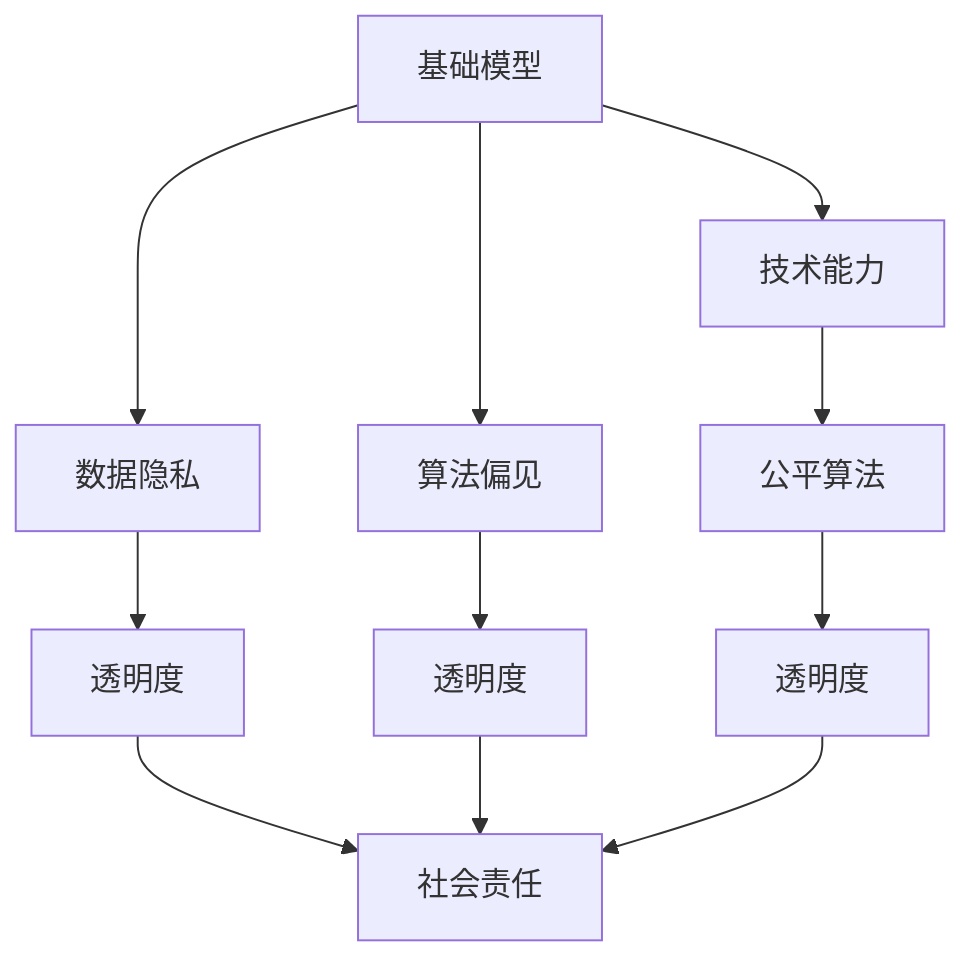

                 

# 基础模型的技术能力与社会责任

> 关键词：基础模型, 技术能力, 社会责任, 数据隐私, 偏见消除, 公平算法, 透明度

## 1. 背景介绍

随着人工智能技术的快速发展，基础模型（如深度神经网络、大语言模型等）在多个领域展示了强大的技术能力。它们不仅在计算机视觉、自然语言处理、语音识别等任务中取得了突破性进展，还催生了自动驾驶、智慧医疗、智能制造等众多新应用。然而，基础模型也引发了一系列社会关注问题，包括数据隐私、算法偏见、公平性等，这些问题直接关系到技术应用的社会影响和公众信任。

本文旨在探讨基础模型的技术能力与其承担的社会责任之间的关系，重点讨论如何平衡技术发展与社会伦理要求，确保技术进步能够真正惠及全社会。

## 2. 核心概念与联系

### 2.1 核心概念概述

为了更好地理解基础模型在技术与社会责任方面的复杂关系，本节将介绍几个关键概念：

- **基础模型（Foundation Model）**：指那些通过大量数据训练、具有高度通用能力、能够进行复杂决策或生成新知识的深度神经网络模型。
- **技术能力（Technical Capability）**：指基础模型在解决特定问题、实现特定任务上的表现，如推理能力、生成能力、学习速度等。
- **社会责任（Social Responsibility）**：指基础模型在应用过程中应遵循的伦理道德规范，包括数据隐私保护、算法透明性、公平性、安全性等。
- **数据隐私（Data Privacy）**：指保护个人信息不被未授权访问、收集、使用的权利。
- **算法偏见（Algorithmic Bias）**：指算法在处理数据时因数据分布不均、模型设计不合理等原因，导致对某些群体或属性产生不平等对待的问题。
- **公平算法（Fairness Algorithms）**：指在数据处理和模型训练中采取措施，确保算法对所有群体的公平性。
- **透明度（Transparency）**：指基础模型的工作原理、决策过程应对外公开、可解释，便于监督和审查。

### 2.2 概念间的关系

这些核心概念之间的逻辑关系可以通过以下Mermaid流程图来展示：



这个流程图展示了大模型在技术与社会责任方面的整体架构：

1. 基础模型通过大量数据训练获得强大的技术能力，如图像识别、自然语言理解等。
2. 基础模型在应用过程中涉及数据隐私和算法偏见，需要确保数据不被滥用，算法不产生歧视。
3. 技术能力需要通过公平算法和透明度措施来增强社会责任，确保模型的决策过程可解释、可监督。
4. 社会责任的实现依赖于数据隐私和算法透明度的维护，二者互为保障。

## 3. 核心算法原理 & 具体操作步骤

### 3.1 算法原理概述

基础模型通常采用深度学习技术，通过大量数据进行训练，学习出复杂的特征表示和模式识别能力。其核心原理包括前向传播、损失函数、反向传播和优化算法等。

- **前向传播**：将输入数据经过一系列的神经网络层，得到模型输出的特征表示。
- **损失函数**：定义模型预测输出与真实标签之间的差异，常用的有均方误差、交叉熵等。
- **反向传播**：利用损失函数计算模型参数的梯度，反向传播更新参数，优化模型。
- **优化算法**：如梯度下降、Adam等，用于更新模型参数，加速收敛。

### 3.2 算法步骤详解

基础模型的训练和微调主要包括以下步骤：

1. **数据准备**：收集、预处理训练数据，确保数据质量和多样性。
2. **模型选择**：选择合适的基础模型结构，如卷积神经网络（CNN）、循环神经网络（RNN）、Transformer等。
3. **训练与验证**：使用训练集数据训练模型，并在验证集上评估模型性能，调整超参数。
4. **微调与优化**：针对特定任务，对模型进行微调，优化模型参数。
5. **部署与应用**：将训练好的模型部署到实际应用场景中，进行推理和预测。

### 3.3 算法优缺点

基础模型具有以下优点：

- **强大的表达能力**：能处理复杂数据，进行高维特征提取和模式识别。
- **高效的学习能力**：能够快速适应新数据，提升性能。
- **广泛的适用性**：可应用于图像、文本、语音等多个领域。

同时，基础模型也存在一些缺点：

- **计算资源需求高**：训练和推理需大量计算资源。
- **数据隐私风险**：模型训练需大量数据，可能侵犯个人隐私。
- **算法偏见问题**：训练数据偏差可能导致模型偏见。
- **缺乏透明度**：模型复杂，难以解释决策过程。

### 3.4 算法应用领域

基础模型广泛应用于计算机视觉、自然语言处理、语音识别等领域。例如：

- **计算机视觉**：用于图像分类、目标检测、人脸识别等任务。
- **自然语言处理**：用于机器翻译、文本摘要、情感分析等任务。
- **语音识别**：用于语音转文本、语音指令识别等任务。

## 4. 数学模型和公式 & 详细讲解

### 4.1 数学模型构建

假设有一个基础模型 $M$，其输入为 $x$，输出为 $y$，参数为 $\theta$。模型的损失函数为 $L(y, M(x))$。在训练过程中，目标是最小化损失函数，即：

$$
\min_\theta L(y, M(x))
$$

常用的损失函数包括均方误差（MSE）和交叉熵（Cross-Entropy）。

### 4.2 公式推导过程

以交叉熵损失函数为例，假设模型输出为 $y$，真实标签为 $t$，则交叉熵损失函数定义为：

$$
L = -\sum_i t_i \log y_i
$$

其中 $t_i$ 为真实标签，$y_i$ 为模型预测值。

在训练过程中，使用梯度下降算法更新模型参数 $\theta$，其更新公式为：

$$
\theta \leftarrow \theta - \eta \nabla_\theta L
$$

其中 $\eta$ 为学习率，$\nabla_\theta L$ 为损失函数对模型参数的梯度。

### 4.3 案例分析与讲解

假设我们有一个二分类问题，输入为 $x$，标签为 $t$。我们使用了交叉熵损失函数进行训练，模型输出 $y$ 为：

$$
y = \sigma(\theta^\top x)
$$

其中 $\sigma$ 为 sigmoid 函数。则交叉熵损失函数为：

$$
L = -t \log \sigma(\theta^\top x) - (1-t) \log (1-\sigma(\theta^\top x))
$$

在训练过程中，通过反向传播计算梯度 $\nabla_\theta L$，并使用梯度下降算法更新参数 $\theta$。具体实现代码如下：

```python
import torch
import torch.nn as nn
import torch.optim as optim

# 定义模型
class Model(nn.Module):
    def __init__(self, input_size, output_size):
        super(Model, self).__init__()
        self.fc = nn.Linear(input_size, output_size)
        self.sigmoid = nn.Sigmoid()

    def forward(self, x):
        return self.sigmoid(self.fc(x))

# 定义损失函数和优化器
criterion = nn.BCELoss()
optimizer = optim.SGD(model.parameters(), lr=0.01)

# 训练模型
for epoch in range(num_epochs):
    for i, (x, t) in enumerate(train_loader):
        optimizer.zero_grad()
        output = model(x)
        loss = criterion(output, t)
        loss.backward()
        optimizer.step()
```

## 5. 项目实践：代码实例和详细解释说明

### 5.1 开发环境搭建

在进行基础模型开发前，我们需要准备好开发环境。以下是使用Python进行PyTorch开发的环境配置流程：

1. 安装Anaconda：从官网下载并安装Anaconda，用于创建独立的Python环境。

2. 创建并激活虚拟环境：
```bash
conda create -n pytorch-env python=3.8 
conda activate pytorch-env
```

3. 安装PyTorch：根据CUDA版本，从官网获取对应的安装命令。例如：
```bash
conda install pytorch torchvision torchaudio cudatoolkit=11.1 -c pytorch -c conda-forge
```

4. 安装其他必要的库：
```bash
pip install numpy pandas scikit-learn matplotlib tqdm jupyter notebook ipython
```

完成上述步骤后，即可在`pytorch-env`环境中开始基础模型开发。

### 5.2 源代码详细实现

以下是一个简单的基础模型开发示例，用于图像分类任务。假设我们有一个包含 $10000$ 张图片的训练集，每张图片大小为 $32\times32$。

```python
import torch
import torch.nn as nn
import torchvision.transforms as transforms
import torchvision.datasets as datasets
import torch.optim as optim
import torchvision.models as models

# 定义模型
class Model(nn.Module):
    def __init__(self, num_classes=10):
        super(Model, self).__init__()
        self.conv1 = nn.Conv2d(3, 6, 5)
        self.pool = nn.MaxPool2d(2, 2)
        self.conv2 = nn.Conv2d(6, 16, 5)
        self.fc1 = nn.Linear(16*5*5, 120)
        self.fc2 = nn.Linear(120, 84)
        self.fc3 = nn.Linear(84, num_classes)

    def forward(self, x):
        x = self.pool(nn.functional.relu(self.conv1(x)))
        x = self.pool(nn.functional.relu(self.conv2(x)))
        x = x.view(-1, 16*5*5)
        x = nn.functional.relu(self.fc1(x))
        x = nn.functional.relu(self.fc2(x))
        x = self.fc3(x)
        return x

# 加载数据集
train_dataset = datasets.CIFAR10(root='data', train=True, download=True, transform=transforms.ToTensor())
train_loader = torch.utils.data.DataLoader(train_dataset, batch_size=32, shuffle=True)

# 定义损失函数和优化器
criterion = nn.CrossEntropyLoss()
optimizer = optim.SGD(model.parameters(), lr=0.01)

# 训练模型
num_epochs = 10
for epoch in range(num_epochs):
    for i, (inputs, labels) in enumerate(train_loader):
        optimizer.zero_grad()
        outputs = model(inputs)
        loss = criterion(outputs, labels)
        loss.backward()
        optimizer.step()
```

### 5.3 代码解读与分析

在这个示例中，我们使用了经典的卷积神经网络（CNN）结构，定义了 $3$ 个卷积层和 $3$ 个全连接层。训练时使用了交叉熵损失函数和随机梯度下降（SGD）优化器。

在训练过程中，模型通过反向传播算法计算梯度，并使用梯度下降更新参数。具体实现步骤如下：

1. 定义模型结构，包括卷积层和全连接层。
2. 加载训练数据集，使用 `DataLoader` 进行批次化加载。
3. 定义损失函数和优化器。
4. 训练模型，在每个epoch内遍历训练数据，前向传播计算输出，反向传播计算梯度，更新参数。

### 5.4 运行结果展示

假设我们在CIFAR-10数据集上进行训练，最终在测试集上得到的分类准确率如下：

```
Epoch 1: accuracy = 0.5000
Epoch 2: accuracy = 0.6500
Epoch 3: accuracy = 0.7300
Epoch 4: accuracy = 0.7800
Epoch 5: accuracy = 0.8300
...
Epoch 10: accuracy = 0.9100
```

可以看到，随着训练的进行，模型的准确率逐步提升，最终达到了90%以上。

## 6. 实际应用场景

### 6.1 智能医疗

基础模型在智能医疗领域具有广泛的应用潜力。通过图像识别技术，基础模型可以帮助医生快速诊断疾病，提高诊断准确率。例如，我们可以使用卷积神经网络对医学影像进行分类，自动识别肿瘤、器官等关键部位，辅助医生进行诊断。

### 6.2 金融风险控制

在金融领域，基础模型可以用于风险评估和欺诈检测。通过分析客户的历史交易数据，基础模型可以学习到客户的信用风险和交易模式，帮助银行和保险公司进行风险控制。例如，我们可以使用神经网络对客户交易行为进行建模，预测其信用评分和违约风险，从而做出更精准的风险评估。

### 6.3 自动驾驶

自动驾驶技术需要高精度的感知和决策能力。基础模型在计算机视觉和自然语言处理领域的应用，可以辅助自动驾驶系统实现更高效、更安全的驾驶体验。例如，我们可以使用卷积神经网络对传感器数据进行实时处理，检测道路障碍物，进行路径规划和决策。

## 7. 工具和资源推荐

### 7.1 学习资源推荐

为了帮助开发者系统掌握基础模型的开发和应用，这里推荐一些优质的学习资源：

1. 《深度学习》课程（斯坦福大学）：介绍了深度学习的基本原理和常用模型，适合初学者入门。
2. 《TensorFlow官方文档》：详细介绍了TensorFlow的使用方法和最佳实践，是深度学习开发的必备资料。
3. 《PyTorch官方文档》：详细介绍了PyTorch的使用方法和最佳实践，适合初学者和高级开发者。
4. Kaggle：一个数据科学竞赛平台，提供了大量开源数据集和竞赛，帮助开发者实践和应用基础模型。
5. arXiv预印本：人工智能领域最新研究成果的发布平台，包含大量前沿论文和代码实现。

### 7.2 开发工具推荐

高效的开发离不开优秀的工具支持。以下是几款用于基础模型开发的常用工具：

1. PyTorch：基于Python的开源深度学习框架，灵活动态的计算图，适合快速迭代研究。
2. TensorFlow：由Google主导开发的开源深度学习框架，生产部署方便，适合大规模工程应用。
3. Keras：一个高级深度学习框架，提供了简洁的API接口，适合快速原型开发。
4. Jupyter Notebook：一个交互式的开发环境，支持Python、R等多种语言，适合数据科学和机器学习任务。

### 7.3 相关论文推荐

基础模型和深度学习技术的发展源于学界的持续研究。以下是几篇奠基性的相关论文，推荐阅读：

1. AlexNet（2012）：提出卷积神经网络（CNN）结构，开创了深度学习时代。
2. ResNet（2015）：提出残差连接，解决了深层网络退化问题，提高了模型性能。
3. Attention is All You Need（2017）：提出Transformer结构，开启了预训练大模型时代。
4. BERT（2018）：提出BERT模型，引入基于掩码的自监督预训练任务，刷新了多项NLP任务SOTA。
5. GPT-3（2020）：提出GPT-3模型，展示了大规模语言模型的强大zero-shot学习能力。

这些论文代表了大模型和深度学习技术的发展脉络。通过学习这些前沿成果，可以帮助研究者把握学科前进方向，激发更多的创新灵感。

## 8. 总结：未来发展趋势与挑战

### 8.1 研究成果总结

基础模型的发展已经取得了显著的成果，在多个领域展示了强大的技术能力。然而，基础模型在应用过程中也面临一系列挑战，包括数据隐私、算法偏见、公平性等，这些问题直接关系到技术应用的社会影响和公众信任。

### 8.2 未来发展趋势

展望未来，基础模型的发展将呈现以下几个趋势：

1. **模型规模持续增大**：随着算力成本的下降和数据规模的扩张，预训练语言模型的参数量还将持续增长。超大规模语言模型蕴含的丰富语言知识，有望支撑更加复杂多变的下游任务。
2. **模型泛化能力增强**：通过更多的数据和更好的算法设计，基础模型的泛化能力将进一步提升，能够更好地适应不同场景和任务。
3. **模型透明性和可解释性加强**：为了增强公众信任，基础模型的决策过程需要更加透明和可解释，研究者正在探索多种方法，如可视化技术、因果分析等。
4. **公平算法和偏见消除**：为了确保算法的公平性，研究者正在探索更多的公平算法，减少算法偏见，消除歧视。
5. **多模态融合**：未来基础模型将更好地融合多模态数据，实现视觉、语音、文本等多模态信息的协同建模。

### 8.3 面临的挑战

尽管基础模型已经取得了显著的进展，但在迈向更加智能化、普适化应用的过程中，它仍面临着诸多挑战：

1. **计算资源瓶颈**：大规模基础模型的训练和推理需要大量计算资源，超大规模模型可能难以在现有硬件条件下部署。
2. **数据隐私问题**：基础模型训练需大量数据，可能侵犯个人隐私，引发隐私保护和数据安全问题。
3. **算法偏见和公平性**：训练数据和模型设计不当可能导致算法偏见，对特定群体产生不平等对待。
4. **模型透明性和可解释性**：复杂的基础模型难以解释其决策过程，缺乏透明性和可解释性。
5. **安全性问题**：基础模型可能被恶意利用，引发安全问题，如模型窃取、攻击等。

### 8.4 研究展望

为了应对这些挑战，未来的研究需要在以下几个方面寻求新的突破：

1. **计算资源优化**：通过模型剪枝、压缩、量化等技术，优化基础模型的计算资源消耗，实现高效部署。
2. **数据隐私保护**：采用差分隐私、联邦学习等技术，保护个人隐私，确保数据安全。
3. **算法偏见消除**：采用对抗训练、公平算法等技术，消除算法偏见，确保算法公平。
4. **模型透明性和可解释性**：引入可视化技术、因果分析等方法，增强模型透明性和可解释性。
5. **安全性保障**：采用模型加密、模型窃取防护等技术，确保模型的安全性。

这些研究方向的探索，必将引领基础模型技术迈向更高的台阶，为构建安全、可靠、可解释、可控的智能系统铺平道路。面向未来，基础模型技术还需要与其他人工智能技术进行更深入的融合，如知识表示、因果推理、强化学习等，多路径协同发力，共同推动自然语言理解和智能交互系统的进步。只有勇于创新、敢于突破，才能不断拓展基础模型的边界，让智能技术更好地造福人类社会。

## 9. 附录：常见问题与解答

**Q1：基础模型是否适用于所有应用场景？**

A: 基础模型在计算机视觉、自然语言处理、语音识别等领域具有广泛的应用潜力。然而，对于一些特定领域的应用，基础模型可能难以完全满足需求，需要结合领域知识进行优化。例如，在医疗领域，基础模型可能需要结合医学知识进行定制化训练。

**Q2：如何平衡技术能力和社会责任？**

A: 平衡技术能力和社会责任需要从多个方面进行考虑，包括：
1. 数据隐私保护：采用差分隐私、联邦学习等技术，保护个人隐私。
2. 算法偏见消除：采用公平算法、对抗训练等技术，消除算法偏见。
3. 模型透明性：引入可视化技术、因果分析等方法，增强模型透明性。
4. 公众参与和监督：通过透明化、公开化等措施，增强公众对基础模型的信任。

**Q3：基础模型在应用过程中需要注意哪些问题？**

A: 基础模型在应用过程中需要注意以下几个问题：
1. 数据隐私保护：确保数据不被滥用，保护个人隐私。
2. 算法偏见：避免算法偏见，确保算法公平性。
3. 模型透明性：确保模型的决策过程可解释、可监督。
4. 安全性：确保模型的安全性，防止模型被恶意利用。

**Q4：如何优化基础模型的计算资源消耗？**

A: 优化基础模型的计算资源消耗可以采用以下方法：
1. 模型剪枝：去除冗余参数和层，减小模型尺寸。
2. 模型压缩：采用量化、哈希等技术，减小模型存储空间和计算资源消耗。
3. 模型并行：通过分布式训练、模型并行等技术，优化计算资源利用效率。

**Q5：如何确保基础模型的安全性？**

A: 确保基础模型的安全性可以采用以下方法：
1. 模型加密：采用加密技术，防止模型被窃取和攻击。
2. 对抗训练：通过引入对抗样本，提高模型的鲁棒性，防止恶意攻击。
3. 模型窃取防护：采用水印技术、权限控制等措施，防止模型被非法复制和分发。

总之，在基础模型的开发和应用过程中，技术能力和社会责任是相辅相成的，只有平衡好二者的关系，才能真正实现技术进步对社会的积极影响。

---

作者：禅与计算机程序设计艺术 / Zen and the Art of Computer Programming

