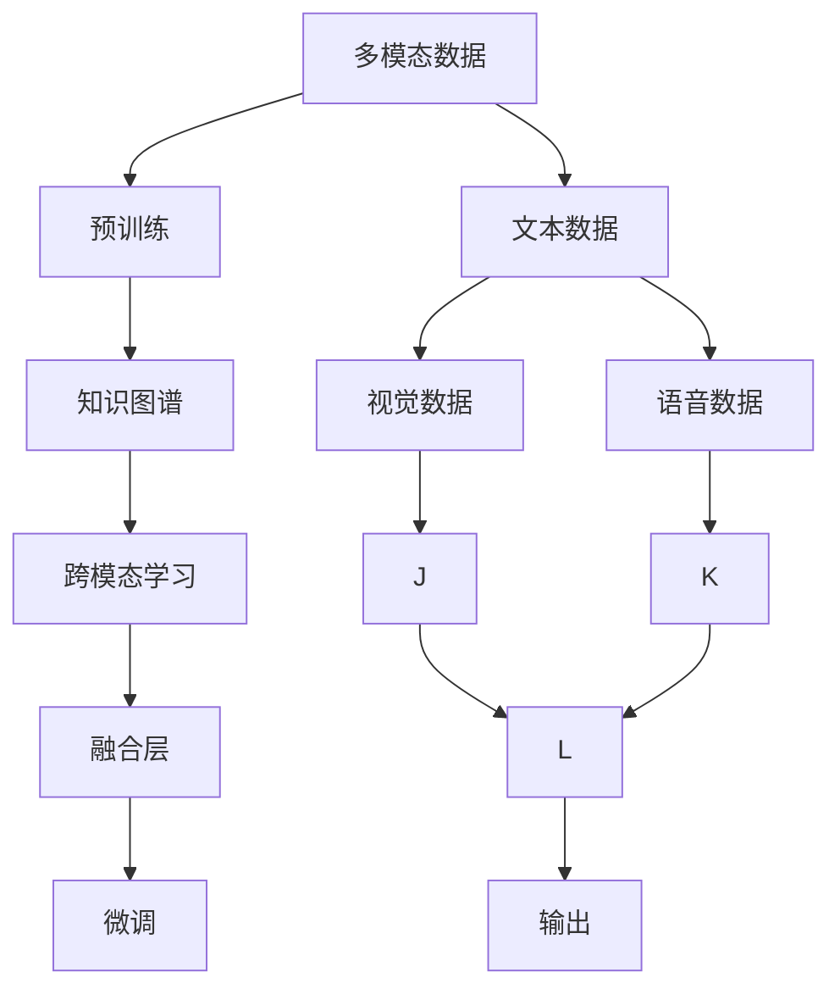
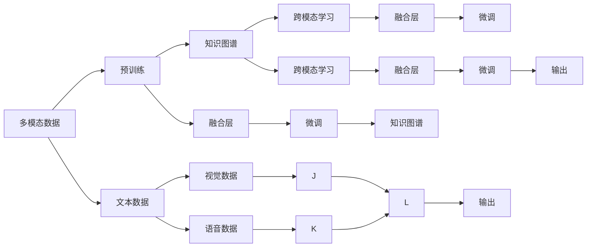

                 

# 多模态大模型的应用前景

> 关键词：多模态大模型,模型融合,知识图谱,自然语言处理(NLP),计算机视觉(CV),跨模态学习

## 1. 背景介绍

### 1.1 问题由来
随着人工智能技术的不断发展，单一模态的模型已经难以适应复杂多样的现实世界数据。面对丰富而异构的多模态数据，如何整合这些数据信息，构建更加强大的智能模型，成为了当前AI领域的一个重要研究方向。

多模态大模型（Multi-modal Large Models, MLMs）的出现，为解决这一问题提供了新的思路。MLMs不仅能融合视觉、文本、语音等多种数据模态，还能在庞大的参数空间中高效训练，具备强大的跨模态理解能力和泛化能力。

多模态大模型在自然语言处理（Natural Language Processing, NLP）、计算机视觉（Computer Vision, CV）、语音识别等多个领域展现出了前所未有的潜力。本文将系统介绍多模态大模型的核心概念、算法原理、操作步骤以及应用场景，探讨其在未来技术发展中的广阔前景。

### 1.2 问题核心关键点
多模态大模型通过整合不同模态的信息，形成了更加全面的知识表示。其主要特点包括：

1. **跨模态理解能力**：能够从不同模态数据中提取出丰富的特征，进行多模态融合，构建统一的知识表示。
2. **泛化能力强**：在处理多模态数据时，具备较强的泛化能力，能够在不同场景下进行高效推理。
3. **参数量庞大**：通常具有数十亿甚至数百亿的参数，需要大规模的计算资源进行训练。
4. **应用范围广**：可以应用于自然语言处理、计算机视觉、语音识别等多个领域，为各种复杂任务提供强有力的支持。

多模态大模型的构建和应用，极大地推动了人工智能技术的进步，拓展了AI模型的应用边界。本文将详细阐述多模态大模型构建的理论基础，并结合实际项目，展示其强大的应用潜力。

### 1.3 问题研究意义
多模态大模型在多个领域的成功应用，为解决复杂的实际问题提供了新的解决方案。其研究意义体现在以下几个方面：

1. **提升智能交互体验**：通过多模态数据融合，智能系统能够更加准确地理解用户需求，提供更加自然、流畅的交互体验。
2. **推动行业数字化转型**：多模态大模型能够在不同领域实现高效的应用，如智能医疗、智能制造、智能家居等，推动各行各业的数字化转型升级。
3. **拓展AI模型应用场景**：多模态大模型具有强大的跨模态理解能力，可以应用于更多复杂的任务，如情感分析、图像识别、语音翻译等。
4. **增强AI模型的泛化能力**：多模态大模型通过融合多种数据模态，能够更好地适应未知数据，提升模型的泛化能力。
5. **促进AI技术的产业化**：多模态大模型为各类行业提供了解决方案，加速了AI技术的产业化进程，推动了经济效益和社会效益的双重提升。

## 2. 核心概念与联系

### 2.1 核心概念概述

多模态大模型融合了不同数据模态，通过深度学习框架进行建模。其核心概念包括：

- **多模态数据**：包括文本、图像、语音等多种数据形式，通过传感器、摄像头、麦克风等设备采集。
- **知识图谱**：用于构建领域知识，通过实体和关系连接，形成语义网络，辅助模型进行推理。
- **跨模态学习**：通过学习不同模态数据之间的关联，实现跨模态特征融合，构建统一的知识表示。
- **预训练**：在大规模无标签数据上预训练模型，学习通用的语言和视觉表示。
- **微调**：在预训练模型基础上，使用少量有标签数据进行有监督学习，优化模型在特定任务上的性能。
- **融合层**：用于将不同模态的数据进行特征映射和拼接，实现跨模态融合。
- **多任务学习**：在模型训练时，同时优化多个相关任务的性能，提高模型泛化能力。

这些核心概念通过以下Mermaid流程图进行展示：



该流程图展示了多模态大模型的构建过程，包括数据获取、预训练、跨模态学习、特征融合、微调和输出等多个步骤。通过这些步骤，模型能够学习多种数据模态的特征，并最终输出期望的结果。

### 2.2 概念间的关系

多模态大模型的构建和应用涉及多个关键概念，其关系如图：



该流程图展示了多模态大模型的构建过程，以及各个组件之间的依赖关系。其中，融合层、跨模态学习、知识图谱等组件都是多模态大模型中的重要组成部分，共同构成了模型的核心能力。

## 3. 核心算法原理 & 具体操作步骤
### 3.1 算法原理概述

多模态大模型的构建过程主要包括以下几个步骤：

1. **数据预处理**：对不同模态的数据进行清洗、归一化和增强，确保数据的质量和多样性。
2. **跨模态学习**：通过深度学习框架，学习不同模态数据之间的关联，构建跨模态特征表示。
3. **知识图谱构建**：构建领域知识图谱，用于辅助模型进行推理和决策。
4. **融合层设计**：设计融合层，将不同模态的数据进行特征映射和拼接，实现跨模态融合。
5. **微调**：在预训练模型基础上，使用少量有标签数据进行微调，优化模型在特定任务上的性能。
6. **模型输出**：根据任务需求，将模型输出进行后处理，得到最终结果。

### 3.2 算法步骤详解

以下将以图像分类和文本情感分析为例，详细讲解多模态大模型的构建和应用过程。

#### 3.2.1 数据预处理
数据预处理是构建多模态大模型的第一步，其主要目标是清洗和增强数据，确保数据的质量和多样性。

对于图像数据，需要进行裁剪、旋转、缩放等操作，去除噪声和干扰。例如，可以使用OpenCV库对图像进行预处理：

```python
import cv2

# 加载图像
img = cv2.imread('image.jpg')

# 转换为灰度图
gray = cv2.cvtColor(img, cv2.COLOR_BGR2GRAY)

# 高斯模糊
blur = cv2.GaussianBlur(gray, (5, 5), 0)

# 边缘检测
edges = cv2.Canny(blur, 100, 200)

# 保存处理后的图像
cv2.imwrite('processed_image.jpg', edges)
```

对于文本数据，需要进行分词、去除停用词、词干提取等操作，确保文本的语义质量。例如，可以使用NLTK库进行文本预处理：

```python
import nltk
from nltk.corpus import stopwords
from nltk.stem import WordNetLemmatizer

# 分词
text = 'This is a sample text.'
tokens = nltk.word_tokenize(text)

# 去除停用词
stop_words = set(stopwords.words('english'))
tokens = [token for token in tokens if token.lower() not in stop_words]

# 词干提取
lemmatizer = WordNetLemmatizer()
tokens = [lemmatizer.lemmatize(token) for token in tokens]

# 输出处理后的文本
print(tokens)
```

#### 3.2.2 跨模态学习
跨模态学习是构建多模态大模型的核心步骤，主要通过深度学习框架进行不同模态数据之间的特征学习。

以图像分类为例，可以使用卷积神经网络（CNN）对图像进行特征提取，再通过全连接层学习图像特征与文本特征之间的关联。例如，可以使用PyTorch框架实现跨模态学习：

```python
import torch
import torch.nn as nn
import torch.optim as optim
from torchvision import transforms
from torchvision.models import resnet50

# 加载图像数据集
train_dataset = datasets.ImageFolder('path/to/train', transform=transforms.Compose([
    transforms.RandomResizedCrop(224),
    transforms.RandomHorizontalFlip(),
    transforms.ToTensor(),
]))

# 加载预训练模型
model = resnet50(pretrained=True)

# 替换全连接层
model.fc = nn.Linear(model.fc.in_features, num_classes)

# 定义交叉熵损失函数和优化器
criterion = nn.CrossEntropyLoss()
optimizer = optim.SGD(model.parameters(), lr=0.001, momentum=0.9)

# 训练模型
for epoch in range(num_epochs):
    for inputs, labels in train_loader:
        # 前向传播
        outputs = model(inputs)
        loss = criterion(outputs, labels)
        
        # 反向传播
        optimizer.zero_grad()
        loss.backward()
        optimizer.step()
```

对于文本数据，可以使用循环神经网络（RNN）或Transformer模型进行特征提取，再通过全连接层学习文本特征与图像特征之间的关联。例如，可以使用PyTorch框架实现跨模态学习：

```python
import torch
import torch.nn as nn
import torch.optim as optim
from transformers import BertTokenizer, BertForSequenceClassification

# 加载文本数据集
train_dataset = datasets.SequenceClassificationDataset(train_texts, train_labels, tokenizer)

# 加载预训练模型
model = BertForSequenceClassification.from_pretrained('bert-base-uncased', num_labels=num_labels)

# 定义交叉熵损失函数和优化器
criterion = nn.CrossEntropyLoss()
optimizer = optim.AdamW(model.parameters(), lr=2e-5)

# 训练模型
for epoch in range(num_epochs):
    for batch in train_loader:
        # 前向传播
        inputs = tokenizer(batch.texts, return_tensors='pt', padding=True)
        outputs = model(inputs['input_ids'], attention_mask=inputs['attention_mask'])
        loss = criterion(outputs.logits, batch.labels)
        
        # 反向传播
        optimizer.zero_grad()
        loss.backward()
        optimizer.step()
```

#### 3.2.3 知识图谱构建
知识图谱用于构建领域知识，辅助模型进行推理和决策。其主要构建过程包括以下几个步骤：

1. **实体抽取**：从文本和图像中提取实体，建立实体与实体之间的关联。
2. **关系抽取**：从文本和图像中抽取实体之间的关系，建立实体与关系之间的关联。
3. **构建图谱**：使用图数据库或图形神经网络构建知识图谱。

例如，可以使用GATE库进行实体抽取和关系抽取：

```python
from gate import GATEParser

# 加载模型
model = GATEParser('path/to/model')

# 抽取实体和关系
entities, relations = model.parse(text)

# 输出抽取结果
print(entities)
print(relations)
```

#### 3.2.4 融合层设计
融合层用于将不同模态的数据进行特征映射和拼接，实现跨模态融合。其主要设计过程包括以下几个步骤：

1. **特征映射**：将不同模态的数据映射到相同的特征空间。
2. **特征拼接**：将映射后的特征进行拼接，得到跨模态特征表示。
3. **融合操作**：对拼接后的特征进行融合操作，得到最终融合特征。

例如，可以使用PyTorch框架设计融合层：

```python
import torch
import torch.nn as nn

# 定义融合层
class FusionLayer(nn.Module):
    def __init__(self, feature_dim):
        super(FusionLayer, self).__init__()
        self.fc1 = nn.Linear(feature_dim, feature_dim)
        self.fc2 = nn.Linear(feature_dim, feature_dim)
        self.fc3 = nn.Linear(feature_dim, 2 * feature_dim)

    def forward(self, x1, x2):
        x1 = self.fc1(x1)
        x2 = self.fc2(x2)
        x = torch.cat([x1, x2], dim=1)
        x = self.fc3(x)
        return x
```

#### 3.2.5 微调
微调是优化模型在特定任务上的性能的重要步骤。其主要操作包括：

1. **设置超参数**：选择合适的学习率、批大小、迭代轮数等超参数。
2. **执行梯度训练**：在训练集上进行梯度训练，更新模型参数。
3. **评估模型性能**：在验证集上评估模型性能，防止过拟合。
4. **保存模型参数**：保存最优模型参数，以便后续使用。

例如，可以使用PyTorch框架进行微调：

```python
import torch
import torch.nn as nn
import torch.optim as optim
from torchvision import datasets, transforms
from torchvision.models import resnet50

# 加载图像数据集
train_dataset = datasets.ImageFolder('path/to/train', transform=transforms.Compose([
    transforms.RandomResizedCrop(224),
    transforms.RandomHorizontalFlip(),
    transforms.ToTensor(),
]))

# 加载预训练模型
model = resnet50(pretrained=True)

# 替换全连接层
model.fc = nn.Linear(model.fc.in_features, num_classes)

# 定义交叉熵损失函数和优化器
criterion = nn.CrossEntropyLoss()
optimizer = optim.SGD(model.parameters(), lr=0.001, momentum=0.9)

# 训练模型
for epoch in range(num_epochs):
    for inputs, labels in train_loader:
        # 前向传播
        outputs = model(inputs)
        loss = criterion(outputs, labels)
        
        # 反向传播
        optimizer.zero_grad()
        loss.backward()
        optimizer.step()

# 评估模型性能
model.eval()
with torch.no_grad():
    for inputs, labels in test_loader:
        outputs = model(inputs)
        loss = criterion(outputs, labels)
        acc = accuracy_score(labels, outputs.argmax(dim=1))
        print('Test Loss: {:.4f}, Accuracy: {:.2f}%'.format(loss.item(), acc * 100))

# 保存模型参数
torch.save(model.state_dict(), 'model.pth')
```

#### 3.2.6 模型输出
模型输出是构建多模态大模型的最后一步，其主要目标是将模型输出的结果进行后处理，得到最终结果。

例如，对于图像分类任务，可以将模型输出的类别概率进行归一化，并根据阈值进行分类。例如：

```python
import torch
import torch.nn as nn

# 加载模型参数
model = ResNet()
model.load_state_dict(torch.load('model.pth'))

# 加载测试数据
test_data = torch.load('test_data.pth')

# 前向传播
with torch.no_grad():
    outputs = model(test_data)

# 归一化输出
probs = torch.softmax(outputs, dim=1)

# 设定阈值
threshold = 0.5

# 分类结果
labels = torch.where(probs > threshold, 1, 0).int()

# 输出分类结果
print(labels)
```

### 3.3 算法优缺点

多模态大模型在融合不同模态数据、构建跨模态表示方面具有显著优势，但同时也存在一些缺点：

1. **参数量庞大**：多模态大模型通常具有数十亿甚至数百亿的参数，需要大规模的计算资源进行训练。这使得模型的部署和应用成本较高。
2. **数据依赖性高**：多模态大模型依赖于高质量的多模态数据进行训练，数据获取和标注成本较高。
3. **模型复杂度高**：多模态大模型的结构复杂，涉及多种模态数据的融合和跨模态学习，训练和推理过程较为复杂。
4. **泛化能力有限**：多模态大模型在特定领域的应用效果较好，但在跨领域泛化能力上仍存在一定局限。
5. **解释性不足**：多模态大模型通常是"黑盒"系统，难以解释其内部工作机制和决策逻辑，在实际应用中可能存在一定的风险。

尽管存在这些缺点，但多模态大模型在处理多模态数据方面具有显著优势，能够提供更加全面、准确的知识表示，为复杂任务提供强有力的支持。

### 3.4 算法应用领域

多模态大模型在多个领域具有广泛的应用前景，以下是一些典型应用场景：

1. **智能医疗**：多模态大模型能够融合医疗影像、病历、基因数据等多种数据，提供精准的疾病诊断和个性化治疗方案。例如，可以使用多模态大模型进行医学影像分类和病变识别，辅助医生进行诊断和治疗决策。
2. **智能制造**：多模态大模型能够融合生产过程的图像、声音、传感器数据等多种模态信息，实现智能生产监控和故障诊断。例如，可以使用多模态大模型进行生产设备异常检测和故障预测，提升生产效率和设备可靠性。
3. **智能家居**：多模态大模型能够融合语音、图像、环境传感器等多种数据，实现智能家居的自动化和个性化管理。例如，可以使用多模态大模型进行家庭环境监控和智能安防，提升家庭生活的安全和舒适度。
4. **智能交通**：多模态大模型能够融合交通图像、传感器数据、车联网数据等多种数据，实现智能交通管理和自动驾驶。例如，可以使用多模态大模型进行交通流量预测和路径规划，提升交通管理和自动驾驶的安全性和效率。
5. **智能零售**：多模态大模型能够融合客户行为数据、商品图像、声音等多种数据，实现智能推荐和客户分析。例如，可以使用多模态大模型进行客户需求分析和个性化推荐，提升零售业务的销售和客户满意度。

## 4. 数学模型和公式 & 详细讲解 & 举例说明

### 4.1 数学模型构建

多模态大模型的数学模型主要包括以下几个部分：

1. **多模态数据表示**：将不同模态的数据表示为向量或矩阵，以便于模型进行特征提取和融合。
2. **跨模态学习模型**：使用深度学习框架，构建跨模态学习模型，学习不同模态数据之间的关联。
3. **融合层模型**：设计融合层，将不同模态的数据进行特征映射和拼接，实现跨模态融合。
4. **微调模型**：在预训练模型基础上，使用少量有标签数据进行微调，优化模型在特定任务上的性能。
5. **输出模型**：根据任务需求，将模型输出进行后处理，得到最终结果。

### 4.2 公式推导过程

以下以图像分类和文本情感分析为例，详细推导多模态大模型的数学公式。

#### 4.2.1 图像分类

对于图像分类任务，可以使用卷积神经网络（CNN）对图像进行特征提取，再通过全连接层学习图像特征与文本特征之间的关联。

假设输入图像为 $x \in \mathbb{R}^{C\times H\times W}$，文本输入为 $y \in \mathbb{R}^{N\times d}$，其中 $C$ 为图像通道数，$H$ 和 $W$ 分别为图像高度和宽度，$N$ 为文本长度，$d$ 为文本维度。

图像特征提取器为 $f_{img}(\cdot)$，文本特征提取器为 $f_{text}(\cdot)$，融合层为 $g(\cdot)$，输出层为 $h(\cdot)$。

图像分类模型的数学公式如下：

$$
y = h(g(f_{img}(x), f_{text}(y)))
$$

其中 $g(\cdot)$ 表示跨模态融合操作，$f_{img}(\cdot)$ 和 $f_{text}(\cdot)$ 分别表示图像特征提取和文本特征提取，$h(\cdot)$ 表示输出层。

#### 4.2.2 文本情感分析

对于文本情感分析任务，可以使用循环神经网络（RNN）或Transformer模型对文本进行特征提取，再通过全连接层学习文本特征与图像特征之间的关联。

假设输入文本为 $x \in \mathbb{R}^{N\times d}$，图像输入为 $y \in \mathbb{R}^{H\times W\times C}$，其中 $N$ 为文本长度，$d$ 为文本维度，$H$ 和 $W$ 分别为图像高度和宽度，$C$ 为图像通道数。

文本特征提取器为 $f_{text}(\cdot)$，图像特征提取器为 $f_{img}(\cdot)$，融合层为 $g(\cdot)$，输出层为 $h(\cdot)$。

文本情感分析模型的数学公式如下：

$$
y = h(g(f_{text}(x), f_{img}(y)))
$$

其中 $g(\cdot)$ 表示跨模态融合操作，$f_{text}(\cdot)$ 和 $f_{img}(\cdot)$ 分别表示文本特征提取和图像特征提取，$h(\cdot)$ 表示输出层。

### 4.3 案例分析与讲解

#### 4.3.1 图像分类案例

以下以图像分类任务为例，展示多模态大模型的实际应用。

假设使用预训练的ResNet模型对图像进行特征提取，再通过全连接层学习图像特征与文本特征之间的关联。

1. **数据预处理**：对图像数据进行裁剪、旋转、缩放等操作，确保数据的质量和多样性。
2. **跨模态学习**：使用预训练的ResNet模型对图像进行特征提取，再通过全连接层学习图像特征与文本特征之间的关联。
3. **知识图谱构建**：构建领域知识图谱，辅助模型进行推理和决策。
4. **融合层设计**：设计融合层，将不同模态的数据进行特征映射和拼接，实现跨模态融合。
5. **微调**：在预训练模型基础上，使用少量有标签数据进行微调，优化模型在特定任务上的性能。
6. **模型输出**：将模型输出的类别概率进行归一化，并根据阈值进行分类。

#### 4.3.2 文本情感分析案例

以下以文本情感分析任务为例，展示多模态大模型的实际应用。

假设使用预训练的BERT模型对文本进行特征提取，再通过全连接层学习文本特征与图像特征之间的关联。

1. **数据预处理**：对文本数据进行分词、去除停用词、词干提取等操作，确保文本的语义质量。
2. **跨模态学习**：使用预训练的BERT模型对文本进行特征提取，再通过全连接层学习文本特征与图像特征之间的关联。
3. **知识图谱构建**：构建领域知识图谱，辅助模型进行推理和决策。
4. **融合层设计**：设计融合层，将不同模态的数据进行特征映射和拼接，实现跨模态融合。
5. **微调**：在预训练模型基础上，使用少量有标签数据进行微调，优化模型在特定任务上的性能。
6. **模型输出**：将模型输出的类别概率进行归一化，并根据阈值进行分类。

## 5. 项目实践：代码实例和详细解释说明

### 5.1 开发环境搭建

在进行多模态大模型的项目实践前，我们需要准备好开发环境。以下是使用Python进行PyTorch开发的环境配置流程：

1. 安装Anaconda：从官网下载并安装Anaconda，用于创建独立的Python环境。

2. 创建并激活虚拟环境：
```bash
conda create -n pytorch-env python=3.8 
conda activate pytorch-env
```

3. 安装PyTorch：根据CUDA版本，从官网获取对应的安装命令。例如：
```bash
conda install pytorch torchvision torchaudio cudatoolkit=11.1 -c pytorch -c conda-forge
```

4. 安装Transformers库：
```bash
pip install transformers
```

5. 安装各类工具包：
```bash
pip install numpy pandas scikit-learn matplotlib tqdm jupyter notebook ipython
```

完成上述步骤后，即可在`pytorch-env`环境中开始项目实践。

### 5.2 源代码详细实现

下面我们以图像分类和文本情感分析为例，给出使用Transformers库对预训练模型进行多模态大模型构建的PyTorch代码实现。

首先，定义数据处理函数：

```python
from transformers import BertTokenizer
from torch.utils.data import Dataset
import torch

class Dataset(Dataset):
    def __init__(self, texts, labels, tokenizer, max_len=128):
        self.texts = texts
        self.labels = labels
        self.tokenizer = tokenizer
        self.max_len = max_len
        
    def __len__(self):
        return len(self.texts)
    
    def __getitem__(self, item):
        text = self.texts[item]
        label = self.labels[item]
        
        encoding = self.tokenizer(text, return_tensors='pt', max_length=self.max_len, padding='max_length', truncation=True)
        input_ids = encoding['input_ids'][0]
        attention_mask = encoding['attention_mask'][0]
        
        # 对token-wise的标签进行编码
        encoded_labels = [label2id[label] for

