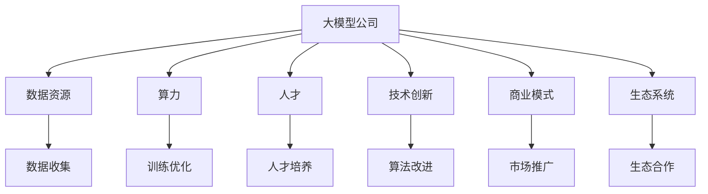
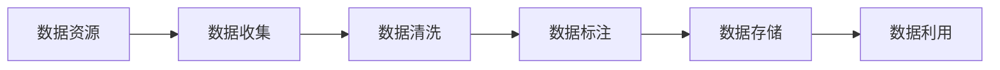
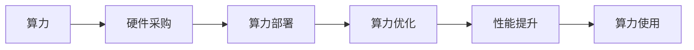
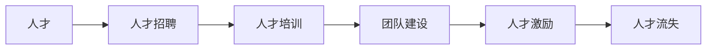
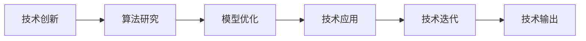
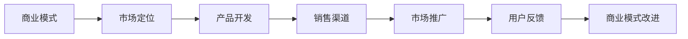
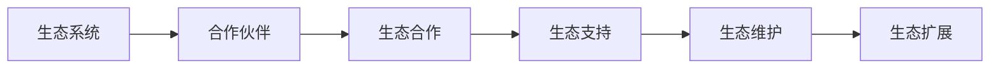

                 

## 1. 背景介绍

### 1.1 问题由来
近年来，随着人工智能技术的迅猛发展，大模型公司在AI领域的地位越来越重要。这些公司拥有强大的研发实力，丰富的数据资源，以及高效的人才管理，通过大规模训练语言模型，如BERT、GPT-3等，不断推出高质量的NLP模型，引领行业发展。

然而，随着越来越多的公司投入到语言模型的开发和应用中，市场竞争逐渐激烈。如何在众多对手中保持竞争优势，构建强大的防御壁垒，成为大模型公司面临的重要挑战。本文将深入探讨大模型公司如何通过多层次的策略，保持其在AI领域的领先地位。

### 1.2 问题核心关键点
大模型公司在保持竞争优势的过程中，需要关注以下几个关键点：

- 数据资源的获取与利用。高质量的数据是构建优秀模型的基础，大模型公司需积极获取、管理和利用数据资源。
- 算力的投入与优化。大模型训练需要大量的计算资源，如何高效利用算力是保证模型质量和性能的关键。
- 人才的培养与吸引。优秀的人才团队是推动模型发展的动力，大模型公司需制定合理的人才战略，吸引并留住顶尖人才。
- 技术的创新与持续改进。持续的技术创新和模型优化，是保持竞争力的重要保障。
- 商业模式的构建与扩展。构建稳定的商业模式，拓展应用场景，是实现商业成功的重要手段。
- 生态系统的构建与维护。构建完善的生态系统，增强模型的适用性，是大模型公司长期发展的关键。

这些关键点互相影响，共同构成了大模型公司保持竞争优势的全面战略。本文将从这几个方面进行详细探讨。

## 2. 核心概念与联系

### 2.1 核心概念概述

为更好地理解大模型公司如何保持竞争优势，我们首先需要明确一些核心概念：

- **大模型公司**：指拥有先进AI技术，通过大规模训练语言模型，构建高性能AI模型的公司。如Google、Microsoft、Facebook等。
- **语言模型**：指使用机器学习算法，通过大量文本数据训练得到的模型，如BERT、GPT等。
- **数据资源**：指用于训练和优化模型的大量文本数据，如Wikipedia、新闻网站、社交媒体等。
- **算力**：指训练大模型所需的计算资源，包括GPU、TPU等硬件设备。
- **人才**：指拥有深度学习、自然语言处理等相关专业知识的研发团队。
- **技术创新**：指持续进行算法和模型的改进，推出领先的技术解决方案。
- **商业模式**：指通过提供AI服务、销售产品等实现商业价值的模式。
- **生态系统**：指围绕AI模型的开发、应用、部署等形成的完整的生态链，包括上下游企业、用户、合作伙伴等。

这些概念之间的逻辑关系可以通过以下Mermaid流程图来展示：

这个流程图展示了数据资源、算力、人才、技术创新、商业模式和生态系统在大模型公司构建防御壁垒中的作用。通过这些关键因素的协同工作，大模型公司才能在激烈的市场竞争中保持领先地位。

### 2.2 概念间的关系

这些核心概念之间存在着紧密的联系，形成了大模型公司保持竞争优势的完整生态系统。下面我通过几个Mermaid流程图来展示这些概念之间的关系。

#### 2.2.1 数据资源的获取与利用

这个流程图展示了从数据收集到数据利用的全过程。大模型公司需要从各种渠道获取高质量的数据，并进行清洗、标注和存储，才能有效地用于模型的训练和优化。

#### 2.2.2 算力的投入与优化

这个流程图展示了算力从采购到优化再到使用的全过程。算力的优化和大规模训练是保持模型质量和性能的重要环节。

#### 2.2.3 人才的培养与吸引

这个流程图展示了人才从招聘到激励的全过程。大模型公司需要建立完善的人才培养和激励机制，吸引和留住顶尖人才，构建优秀的研发团队。

#### 2.2.4 技术的创新与持续改进

这个流程图展示了从算法研究到技术迭代的整个过程。持续的技术创新和模型优化是大模型公司保持竞争优势的关键。

#### 2.2.5 商业模式的构建与扩展

这个流程图展示了从市场定位到商业模式改进的全过程。大模型公司需要构建稳定的商业模式，拓展应用场景，实现商业成功。

#### 2.2.6 生态系统的构建与维护

这个流程图展示了从合作伙伴到生态维护的全过程。构建完善的生态系统，增强模型的适用性，是大模型公司长期发展的关键。

## 3. 核心算法原理 & 具体操作步骤
### 3.1 算法原理概述

大模型公司在保持竞争优势的过程中，涉及多个算法和技术原理。这里重点介绍一些核心算法及其原理。

#### 3.1.1 数据预处理

数据预处理是大模型公司获取和利用数据资源的重要环节。主要包括数据清洗、数据标注和数据存储等步骤。

**数据清洗**：通过去除噪声数据和异常数据，提高数据质量。常用方法包括去除低质量的文本、过滤敏感信息等。

**数据标注**：为模型训练提供高质量的标注数据。常用方法包括手动标注、自动标注和半自动标注等。

**数据存储**：选择合适的数据存储方案，保证数据的可用性和安全性。常用方法包括分布式存储和备份机制等。

#### 3.1.2 模型训练

模型训练是大模型公司保持竞争优势的核心环节。主要包括模型设计、模型优化和模型部署等步骤。

**模型设计**：设计合适的模型架构，满足具体任务的要求。常用方法包括自回归模型、自编码模型和注意力机制等。

**模型优化**：通过优化算法和超参数，提高模型性能。常用方法包括梯度下降、Adam算法和正则化等。

**模型部署**：将训练好的模型部署到实际应用中，提供高质量的服务。常用方法包括云部署和边缘计算等。

#### 3.1.3 人才管理

人才管理是大模型公司保持竞争优势的关键环节。主要包括人才培养、团队建设和人才激励等步骤。

**人才培养**：通过培训、学习和交流，提升员工的专业能力和技术水平。常用方法包括内部培训、外部学习和学术交流等。

**团队建设**：构建高效协作的研发团队，推动模型的持续改进。常用方法包括项目管理、团队协作和绩效评估等。

**人才激励**：通过合理的激励机制，吸引和留住顶尖人才。常用方法包括薪酬激励、股权激励和职业发展等。

#### 3.1.4 技术创新

技术创新是大模型公司保持竞争优势的驱动力。主要包括算法研究、模型优化和技术应用等步骤。

**算法研究**：研究新的算法和技术，推动模型的性能提升。常用方法包括深度学习、强化学习和生成对抗网络等。

**模型优化**：通过模型压缩、迁移学习和微调等方法，提高模型的效率和精度。常用方法包括模型压缩、微调和推理优化等。

**技术应用**：将最新技术应用于实际应用场景，提升模型的实用性。常用方法包括自然语言处理、计算机视觉和语音识别等。

#### 3.1.5 商业模式

商业模式是大模型公司保持竞争优势的重要保障。主要包括市场定位、产品开发和销售渠道等步骤。

**市场定位**：确定合适的市场定位，满足用户需求。常用方法包括市场调研、竞争分析和用户反馈等。

**产品开发**：开发高质量的AI产品，满足用户需求。常用方法包括敏捷开发、持续集成和持续交付等。

**销售渠道**：选择合适的销售渠道，实现商业成功。常用方法包括线上销售、合作伙伴和直销等。

#### 3.1.6 生态系统

生态系统是大模型公司保持竞争优势的长期保障。主要包括合作伙伴、生态合作和生态维护等步骤。

**合作伙伴**：选择合适的合作伙伴，构建完整的生态链。常用方法包括供应商、客户和合作伙伴等。

**生态合作**：与其他公司或机构进行合作，推动技术的普及和应用。常用方法包括战略合作、技术交流和项目合作等。

**生态维护**：维护生态系统的健康和稳定，确保生态合作伙伴的利益。常用方法包括生态协议、生态支持和生态监控等。

### 3.2 算法步骤详解

大模型公司在保持竞争优势的过程中，涉及多个算法步骤。这里重点介绍一些核心步骤。

#### 3.2.1 数据预处理步骤详解

**数据清洗**：
1. **数据筛选**：通过定义筛选规则，去除噪声数据和异常数据。常用方法包括去除低质量的文本、过滤敏感信息等。
2. **数据标注**：为数据集添加标注信息，提高数据质量。常用方法包括手动标注、自动标注和半自动标注等。
3. **数据存储**：选择合适的数据存储方案，保证数据的可用性和安全性。常用方法包括分布式存储和备份机制等。

**数据标注**：
1. **标注数据收集**：从各种渠道收集标注数据，保证数据的多样性和代表性。
2. **标注数据清洗**：去除噪声数据和异常数据，提高数据质量。
3. **标注数据标注**：为数据集添加标注信息，保证标注的正确性和一致性。

**数据存储**：
1. **选择合适的存储方案**：根据数据量和存储需求，选择合适的存储方案。
2. **分布式存储**：将数据存储在多个节点上，提高数据处理的效率。
3. **备份机制**：定期备份数据，防止数据丢失和损坏。

#### 3.2.2 模型训练步骤详解

**模型设计**：
1. **选择模型架构**：根据具体任务，选择适合的模型架构。常用方法包括自回归模型、自编码模型和注意力机制等。
2. **确定模型参数**：确定模型的超参数，如学习率、批大小和迭代轮数等。
3. **选择优化算法**：选择适合的优化算法，如梯度下降、Adam算法等。

**模型优化**：
1. **优化算法**：通过优化算法和超参数，提高模型性能。常用方法包括梯度下降、Adam算法和正则化等。
2. **模型压缩**：通过模型压缩技术，减少模型的计算量和内存占用。常用方法包括剪枝、量化和参数共享等。
3. **模型微调**：通过微调技术，进一步提升模型的性能。常用方法包括全参数微调和参数高效微调等。

**模型部署**：
1. **选择合适的部署平台**：根据需求，选择合适的部署平台。常用方法包括云平台和边缘计算等。
2. **模型优化**：对模型进行优化，提高模型的推理速度和资源利用率。常用方法包括推理加速、分布式计算和模型压缩等。
3. **监控和维护**：对模型进行实时监控和维护，确保模型的稳定性和可靠性。常用方法包括日志记录、性能监控和异常检测等。

#### 3.2.3 人才管理步骤详解

**人才培养**：
1. **内部培训**：通过内部培训，提升员工的专业能力和技术水平。
2. **外部学习**：通过参加学术会议、培训课程等方式，学习最新的技术进展。
3. **学术交流**：通过与其他公司或机构的交流合作，促进技术的共享和应用。

**团队建设**：
1. **项目管理**：通过项目管理和团队协作，提高项目的效率和质量。
2. **绩效评估**：通过绩效评估，激励员工的工作积极性和创新能力。
3. **团队协作**：通过团队协作，促进知识的共享和创新。

**人才激励**：
1. **薪酬激励**：通过合理的薪酬激励，吸引和留住顶尖人才。
2. **股权激励**：通过股权激励，绑定员工与公司的利益。
3. **职业发展**：通过职业发展计划，提升员工的工作满意度和忠诚度。

#### 3.2.4 技术创新步骤详解

**算法研究**：
1. **研究新技术**：通过学术研究和技术创新，掌握最新的算法和技术。
2. **技术合作**：与其他公司或机构进行技术合作，推动技术的普及和应用。
3. **技术交流**：通过学术会议、技术沙龙等方式，促进技术的共享和应用。

**模型优化**：
1. **模型压缩**：通过模型压缩技术，减少模型的计算量和内存占用。
2. **模型微调**：通过微调技术，进一步提升模型的性能。
3. **模型推理优化**：对模型进行优化，提高模型的推理速度和资源利用率。

**技术应用**：
1. **自然语言处理**：将最新技术应用于自然语言处理领域，提升模型的性能和实用性。
2. **计算机视觉**：将最新技术应用于计算机视觉领域，提升模型的性能和实用性。
3. **语音识别**：将最新技术应用于语音识别领域，提升模型的性能和实用性。

#### 3.2.5 商业模式步骤详解

**市场定位**：
1. **市场调研**：通过市场调研，了解市场需求和竞争环境。
2. **竞争分析**：通过竞争分析，确定公司的市场定位和竞争策略。
3. **用户反馈**：通过用户反馈，调整和优化公司的市场定位。

**产品开发**：
1. **敏捷开发**：通过敏捷开发，提高产品的开发效率和质量。
2. **持续集成**：通过持续集成，保证产品的稳定性和可靠性。
3. **持续交付**：通过持续交付，快速响应用户需求和市场变化。

**销售渠道**：
1. **线上销售**：通过线上销售渠道，扩大产品的市场覆盖范围。
2. **合作伙伴**：通过合作伙伴，拓展产品的销售渠道和市场空间。
3. **直销**：通过直销渠道，提供高质量的产品和服务。

#### 3.2.6 生态系统步骤详解

**合作伙伴**：
1. **供应商**：选择可靠的供应商，提供高质量的硬件和软件支持。
2. **客户**：选择优质的客户，建立长期稳定的合作关系。
3. **合作伙伴**：选择优质的合作伙伴，构建完整的生态链。

**生态合作**：
1. **战略合作**：通过战略合作，推动技术的普及和应用。
2. **技术交流**：通过技术交流，促进技术的共享和应用。
3. **项目合作**：通过项目合作，共同开发和应用新技术。

**生态维护**：
1. **生态协议**：通过生态协议，保护合作伙伴的利益和权益。
2. **生态支持**：通过生态支持，提升合作伙伴的竞争力和市场地位。
3. **生态监控**：通过生态监控，保证生态系统的健康和稳定。

## 4. 数学模型和公式 & 详细讲解 & 举例说明
### 4.1 数学模型构建

在介绍核心算法原理时，我们需要引入一些数学模型和公式来更好地描述和解释这些算法。

#### 4.1.1 数据预处理模型

数据预处理模型包括数据清洗、数据标注和数据存储等步骤。这里以数据清洗为例，介绍数据预处理模型的构建。

**数据清洗模型**：
1. **数据筛选模型**：定义数据筛选规则，去除低质量文本和敏感信息。
2. **数据标注模型**：定义标注规则，为数据集添加标注信息。
3. **数据存储模型**：选择合适的存储方案，保证数据的可用性和安全性。

#### 4.1.2 模型训练模型

模型训练模型包括模型设计、模型优化和模型部署等步骤。这里以模型优化为例，介绍模型训练模型的构建。

**模型优化模型**：
1. **优化算法模型**：选择适合的优化算法，如梯度下降、Adam算法等。
2. **模型压缩模型**：通过剪枝、量化和参数共享等方法，减少模型的计算量和内存占用。
3. **模型微调模型**：通过全参数微调和参数高效微调等方法，进一步提升模型的性能。

#### 4.1.3 人才管理模型

人才管理模型包括人才培养、团队建设和人才激励等步骤。这里以人才激励为例，介绍人才管理模型的构建。

**人才激励模型**：
1. **薪酬激励模型**：通过合理的薪酬激励，吸引和留住顶尖人才。
2. **股权激励模型**：通过股权激励，绑定员工与公司的利益。
3. **职业发展模型**：通过职业发展计划，提升员工的工作满意度和忠诚度。

#### 4.1.4 技术创新模型

技术创新模型包括算法研究、模型优化和技术应用等步骤。这里以算法研究为例，介绍技术创新模型的构建。

**算法研究模型**：
1. **研究新技术模型**：通过学术研究和技术创新，掌握最新的算法和技术。
2. **技术合作模型**：与其他公司或机构进行技术合作，推动技术的普及和应用。
3. **技术交流模型**：通过学术会议、技术沙龙等方式，促进技术的共享和应用。

#### 4.1.5 商业模式模型

商业模式模型包括市场定位、产品开发和销售渠道等步骤。这里以市场定位为例，介绍商业模式模型的构建。

**市场定位模型**：
1. **市场调研模型**：通过市场调研，了解市场需求和竞争环境。
2. **竞争分析模型**：通过竞争分析，确定公司的市场定位和竞争策略。
3. **用户反馈模型**：通过用户反馈，调整和优化公司的市场定位。

#### 4.1.6 生态系统模型

生态系统模型包括合作伙伴、生态合作和生态维护等步骤。这里以生态合作为例，介绍生态系统模型的构建。

**生态合作模型**：
1. **战略合作模型**：通过战略合作，推动技术的普及和应用。
2. **技术交流模型**：通过技术交流，促进技术的共享和应用。
3. **项目合作模型**：通过项目合作，共同开发和应用新技术。

### 4.2 公式推导过程

为了更好地理解这些模型，下面我将进行一些公式的推导和讲解。

#### 4.2.1 数据清洗模型公式

**数据筛选公式**：
$$
D_{\text{筛选}} = D_{\text{原始}} \cap D_{\text{规则}}
$$

其中 $D_{\text{原始}}$ 为原始数据集，$D_{\text{规则}}$ 为数据筛选规则。

**数据标注公式**：
$$
D_{\text{标注}} = D_{\text{筛选}} \times D_{\text{标注}}
$$

其中 $D_{\text{标注}}$ 为标注后的数据集，$D_{\text{标注}}$ 为标注信息。

**数据存储公式**：
$$
D_{\text{存储}} = D_{\text{标注}} \cap D_{\text{备份}}
$$

其中 $D_{\text{存储}}$ 为存储后的数据集，$D_{\text{备份}}$ 为备份机制。

#### 4.2.2 模型优化模型公式

**优化算法公式**：
$$
\theta_{\text{更新}} = \theta_{\text{当前}} - \eta \nabla_{\theta}\mathcal{L}(\theta_{\text{当前}})
$$

其中 $\theta_{\text{更新}}$ 为更新后的模型参数，$\theta_{\text{当前}}$ 为当前模型参数，$\eta$ 为学习率，$\nabla_{\theta}\mathcal{L}(\theta_{\text{当前}})$ 为损失函数对模型参数的梯度。

**模型压缩公式**：
$$
\theta_{\text{压缩}} = \theta_{\text{原始}} \cap D_{\text{规则}}
$$

其中 $\theta_{\text{压缩}}$ 为压缩后的模型参数，$\theta_{\text{原始}}$ 为原始模型参数，$D_{\text{规则}}$ 为模型压缩规则。

**模型微调公式**：
$$
\theta_{\text{微调}} = \theta_{\text{压缩}} \times D_{\text{微调}}
$$

其中 $\theta_{\text{微调}}$ 为微调后的模型参数，$\theta_{\text{压缩}}$ 为压缩后的模型参数，$D_{\text{微调}}$ 为微调数据集。

#### 4.2.3 人才管理模型公式

**薪酬激励公式**：
$$
\text{薪酬} = \text{基本工资} + \text{绩效奖金} + \text{股票期权}
$$

其中 $\text{薪酬}$ 为薪酬总额，$\text{基本工资}$ 为基本工资，$\text{绩效奖金}$ 为绩效奖金，$\text{股票期权}$ 为股票期权。

**股权激励公式**：
$$
\text{股权} = \text{原始股数} + \text{增发股数}
$$

其中 $\text{股权}$ 为股权总额，$\text{原始股数}$ 为原始股数，$\text{增发股数}$ 为增发股数。

**职业发展公式**：
$$
\text{职业发展} = \text{培训计划} + \text{晋升机制} + \text{轮岗制度}
$$

其中 $\text{职业发展}$ 为职业发展计划，$\text{培训计划}$ 为培训计划，$\text{晋升机制}$ 为晋升机制，$\text{轮岗制度}$ 为轮岗制度。

#### 4.2.4 技术创新模型公式

**算法研究公式**：
$$
\text{算法} = \text{学术研究} + \text{技术合作} + \text{技术交流}
$$

其中 $\text{算法}$ 为算法集合，$\text{学术研究}$ 为学术研究集合，$\text{技术合作}$ 为技术合作集合，$\text{技术交流}$ 为技术交流集合。

**模型优化公式**：
$$
\theta_{\text{优化}} = \theta_{\text{原始}} \cap D_{\text{规则}}
$$

其中 $\theta_{\text{优化}}$ 为优化后的模型参数，$\theta_{\text{原始}}$ 为原始模型参数，$D_{\text{规则}}$ 为模型压缩规则。

**模型微调公式**：
$$
\theta_{\text{微调}} = \theta_{\text{优化}} \times D_{\text{微调}}
$$

其中 $\theta_{\text{微调}}$ 为微调后的模型参数，$\theta_{\text{优化}}$ 为优化后的模型参数，$D_{\text{微调}}$ 为微调数据集。

#### 4.2.5 商业模式模型公式

**市场调研公式**：
$$
\text{市场调研} = \text{市场需求} + \text{竞争环境} + \text{用户反馈}
$$

其中 $\text{市场调研}$ 为市场调研集合，$\text{市场需求}$ 为市场需求集合，$\text{竞争环境}$ 为竞争环境集合，$\text{用户反馈}$ 为用户反馈集合。

**产品开发公式**：
$$
\text{产品} = \text{敏捷开发} + \text{持续集成} + \text{持续交付}
$$

其中 $\text{产品}$ 为产品集合，$\text{敏捷开发}$ 为敏捷开发集合，$\text{持续集成}$ 为持续集成集合，$\text{持续交付}$ 为持续交付集合。

**销售渠道公式**：
$$
\text{销售渠道} = \text{线上销售} + \text{合作伙伴} + \text{直销}
$$

其中 $\text{销售渠道}$ 为销售渠道集合，$\text{线上销售}$ 为线上销售集合，$\text{合作伙伴}$ 为合作伙伴集合，$\text{直销}$ 为直销集合。

#### 4.2.6 生态系统模型公式

**生态合作公式**：
$$
\text{生态合作} = \text{战略合作} + \text{技术交流} + \text{项目合作}
$$

其中 $\text{生态合作}$ 为生态合作集合，$\text{战略合作}$ 为战略合作集合，$\text{技术交流}$ 为技术交流集合，$\text{项目合作}$ 为项目合作集合。

**生态维护公式**：
$$
\text{生态维护} = \text{生态协议} + \text{生态支持} + \text{生态监控}
$$

其中 $\text{生态维护}$ 为生态维护集合，$\text{生态协议}$ 为生态协议集合，$\text

