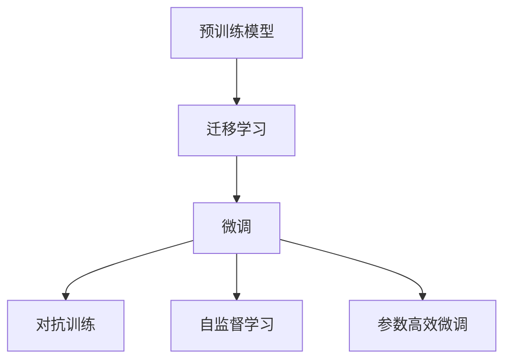

                 

# 大模型：数据驱动的智能革命

## 1. 背景介绍

### 1.1 问题由来

在过去的十年间，人工智能(AI)和机器学习(ML)技术取得了前所未有的进步。其中，大模型（Large Models）作为AI的核心组件，以其卓越的性能和广泛的应用前景，逐步成为推动社会和科技发展的关键力量。大模型，尤其是深度神经网络模型，通过大量的数据和复杂的算法，能够实现对人脑复杂认知过程的模拟和超越。本文将探讨大模型的核心概念、算法原理以及其在数据驱动智能革命中的重要作用。

### 1.2 问题核心关键点

大模型的核心关键点包括以下几个方面：

1. **模型规模**：大模型往往具有百万到数十亿参数，规模庞大，能够处理大量的输入数据，从而提高其准确性和泛化能力。
2. **训练数据**：大模型依赖于大规模、高质量的训练数据进行预训练，以学习到更丰富的语言和视觉知识。
3. **推理速度**：尽管大模型的精度高，但在实际应用中，推理速度较慢，内存占用较大，亟需优化。
4. **鲁棒性和泛化能力**：大模型需要具备良好的鲁棒性和泛化能力，能够在不同的数据分布上表现稳定。
5. **可解释性和安全性**：大模型的决策过程往往缺乏可解释性，且容易受到偏见和有害信息的干扰，需要进一步提升其透明度和安全性。

这些关键点构成了大模型技术的基本框架，同时在大模型技术的应用和发展过程中也面临着诸多挑战。

### 1.3 问题研究意义

大模型技术在多个领域展现出巨大的潜力，推动了社会智能化进程，具有重要的研究意义：

1. **提升计算效率**：大模型能够自动学习任务特征，减少人工标注数据的依赖，提升计算效率。
2. **增强应用场景**：通过预训练和微调，大模型能够在多个领域内提供高效、精确的应用服务。
3. **促进跨领域融合**：大模型能够整合多模态数据，推动不同领域间的深度融合，形成智能生态系统。
4. **推动技术创新**：大模型的研究和应用催生了诸如自监督学习、迁移学习等前沿技术，促进了人工智能的进一步发展。
5. **促进产业发展**：大模型技术加速了各行各业的数字化转型，提高了产业竞争力。

## 2. 核心概念与联系

### 2.1 核心概念概述

在探索大模型技术时，首先需要理解以下几个核心概念：

1. **预训练模型**：在大量无标签数据上进行训练，学习到通用的语言或视觉特征，能够处理各种任务的基础模型。
2. **迁移学习**：在预训练模型的基础上，通过有标签的数据进行微调，提升模型在特定任务上的性能。
3. **微调（Fine-tuning）**：对预训练模型进行任务特定的优化，调整部分模型参数以适应特定任务。
4. **对抗训练（Adversarial Training）**：通过引入对抗样本，提高模型的鲁棒性和泛化能力。
5. **自监督学习**：利用未标注数据进行训练，学习到特征表示，从而提高模型泛化能力。
6. **参数高效微调**：只调整模型中的少量参数，以提高微调效率，减少资源消耗。

这些概念共同构成了大模型技术的核心框架，推动了大模型在实际应用中的广泛使用。

### 2.2 概念间的关系

这些核心概念之间存在着紧密的联系，形成了一个相互依存、相互促进的技术体系。以下是这些概念之间关系的简要描述：

1. **预训练与微调的关系**：预训练是大模型技术的基础，通过预训练学习到通用的特征表示，而微调则在此基础上进一步适应特定任务。
2. **迁移学习与微调的关系**：迁移学习是连接预训练模型与下游任务的重要桥梁，通过微调，将预训练知识迁移到下游任务中。
3. **对抗训练与微调的关系**：对抗训练通过引入对抗样本，提高微调模型的鲁棒性，从而提升其在实际应用中的表现。
4. **自监督学习与微调的关系**：自监督学习通过未标注数据训练模型，提高其泛化能力，进而通过微调提升其在特定任务上的性能。
5. **参数高效微调与微调的关系**：参数高效微调通过只调整少量参数，提高微调效率，同时保留预训练模型的优点。

这些概念间的相互作用，推动了大模型技术的不断发展和创新。

### 2.3 核心概念的整体架构

在了解了核心概念之间的关系后，我们通过一个整体架构图来展示大模型技术的完整框架：



这个架构图展示了从预训练到微调，再到对抗训练、自监督学习、参数高效微调等技术的发展脉络，展示了它们在大模型技术应用中的关键作用。

## 3. 核心算法原理 & 具体操作步骤

### 3.1 算法原理概述

大模型的核心算法原理主要基于深度学习框架，通过多层次的神经网络结构，学习数据中的复杂特征。在训练过程中，模型通过反向传播算法（Backpropagation）不断调整权重，最小化损失函数（Loss Function），从而提升模型的预测准确性。

对于大模型的微调过程，主要涉及以下几个步骤：

1. **数据准备**：收集并准备下游任务的标注数据集，划分为训练集、验证集和测试集。
2. **任务适配**：在预训练模型的基础上，添加适当的任务适配层，调整输出层和损失函数。
3. **模型初始化**：将预训练模型的参数作为初始权重，开始微调过程。
4. **参数更新**：通过梯度下降等优化算法，最小化损失函数，更新模型参数。
5. **性能评估**：在验证集上评估模型性能，监控模型表现，避免过拟合。
6. **模型测试**：在测试集上评估模型性能，最终确定微调后的模型。

### 3.2 算法步骤详解

以下是大模型微调的一般步骤，每个步骤的具体实现将根据具体任务进行调整：

**Step 1: 数据准备**
- 收集下游任务的标注数据集，划分为训练集、验证集和测试集。
- 确保训练数据的质量和多样性，避免数据偏差和过拟合。

**Step 2: 任务适配**
- 添加适当的任务适配层，如分类器、解码器等。
- 根据任务类型，选择合适的输出层和损失函数。
- 在输出层增加正则化项，如L2正则化、Dropout等，避免过拟合。

**Step 3: 模型初始化**
- 加载预训练模型，将其作为微调模型的初始权重。
- 将微调模型保存为新的模型实例，以便后续的参数更新。

**Step 4: 参数更新**
- 选择优化算法，如Adam、SGD等，设置学习率、批大小等参数。
- 定义损失函数，如交叉熵损失、均方误差损失等。
- 通过前向传播计算损失，反向传播更新参数。
- 在每个epoch内，重复多次迭代，直到收敛。

**Step 5: 性能评估**
- 在验证集上评估模型性能，如准确率、精确率、召回率等指标。
- 记录验证集上的性能变化，监控模型训练过程。
- 如果验证集性能不再提升，停止训练，保存模型参数。

**Step 6: 模型测试**
- 在测试集上评估模型性能，验证模型的泛化能力。
- 输出测试集上的性能指标，与微调前后的性能进行对比。
- 将微调后的模型应用于实际任务中，进行模型部署和应用。

### 3.3 算法优缺点

大模型微调具有以下优点：

1. **高效性**：通过预训练学习到通用的特征表示，微调过程能够快速适应特定任务。
2. **泛化能力**：大模型能够利用预训练知识，提高模型在新数据上的泛化能力。
3. **参数高效**：通过参数高效微调方法，可以在保留预训练知识的同时，减少微调过程的资源消耗。

然而，大模型微调也存在以下缺点：

1. **依赖标注数据**：微调过程需要大量的标注数据，标注数据的获取成本较高。
2. **过拟合风险**：微调模型容易过拟合，特别是在标注数据较少的情况下。
3. **模型复杂度**：大模型往往参数较多，推理速度较慢，内存占用较大，需要优化。
4. **可解释性不足**：微调模型的决策过程缺乏可解释性，难以理解其内部工作机制。
5. **数据偏见**：预训练模型可能学习到数据中的偏见，需要通过各种方法加以缓解。

### 3.4 算法应用领域

大模型微调技术在多个领域展现出巨大的应用潜力，以下是一些典型的应用领域：

1. **自然语言处理（NLP）**：如文本分类、命名实体识别、情感分析、机器翻译等任务。
2. **计算机视觉（CV）**：如图像分类、目标检测、图像生成等任务。
3. **语音识别（ASR）**：如语音转文本、说话人识别等任务。
4. **医疗健康**：如病历分析、药物研发等任务。
5. **金融科技**：如风险评估、信用评分、欺诈检测等任务。
6. **智能制造**：如工业缺陷检测、设备维护等任务。
7. **智能交通**：如交通流量预测、自动驾驶等任务。

大模型微调技术正在逐步应用于这些领域，推动各行各业的智能化进程。

## 4. 数学模型和公式 & 详细讲解 & 举例说明

### 4.1 数学模型构建

大模型微调通常基于深度学习框架，使用多层次的神经网络结构。以下是一些常见的数学模型构建：

1. **卷积神经网络（CNN）**：
   - 输入：输入数据。
   - 卷积层：通过卷积操作提取特征。
   - 池化层：通过池化操作减小特征图大小。
   - 全连接层：通过全连接层进行分类或回归。

   数学模型：
   \[
   \begin{aligned}
   y &= \text{softmax}(W_h \cdot z_h + b_h) \\
   z_h &= \sigma(W_l \cdot z_l + b_l)
   \end{aligned}
   \]

2. **循环神经网络（RNN）**：
   - 输入：输入数据序列。
   - 隐藏层：通过循环结构处理序列数据。
   - 输出层：通过全连接层进行分类或回归。

   数学模型：
   \[
   \begin{aligned}
   h_t &= \tanh(W_h \cdot [h_{t-1}, x_t] + b_h) \\
   y_t &= \text{softmax}(W_h \cdot h_t + b_h)
   \end{aligned}
   \]

3. **自编码器（AE）**：
   - 输入：输入数据。
   - 编码器：将输入数据映射到低维特征空间。
   - 解码器：将低维特征映射回原始数据空间。

   数学模型：
   \[
   \begin{aligned}
   z &= \sigma(W_h \cdot x + b_h) \\
   \hat{x} &= \tanh(W_h \cdot z + b_h)
   \end{aligned}
   \]

### 4.2 公式推导过程

在推导数学模型时，通常采用反向传播算法（Backpropagation）进行参数更新。以下是一些常见的反向传播算法：

**卷积神经网络（CNN）的反向传播**：
\[
\begin{aligned}
\frac{\partial L}{\partial w_h} &= \sum_{i=1}^C \sum_{j=1}^{H_k} \sum_{k=1}^{W_k} (y_i - \hat{y}_i) \frac{\partial \hat{y}_i}{\partial z_h} \frac{\partial z_h}{\partial w_l} \\
\frac{\partial L}{\partial b_h} &= \sum_{i=1}^C \sum_{j=1}^{H_k} \sum_{k=1}^{W_k} (y_i - \hat{y}_i) \frac{\partial \hat{y}_i}{\partial z_h}
\end{aligned}
\]

**循环神经网络（RNN）的反向传播**：
\[
\begin{aligned}
\frac{\partial L}{\partial w_h} &= \sum_{t=1}^T (y_t - \hat{y}_t) \frac{\partial \hat{y}_t}{\partial z_t} \frac{\partial z_t}{\partial w_h} + \frac{\partial L}{\partial h_t} \frac{\partial h_t}{\partial w_h} \\
\frac{\partial L}{\partial b_h} &= \sum_{t=1}^T (y_t - \hat{y}_t) \frac{\partial \hat{y}_t}{\partial z_t}
\end{aligned}
\]

**自编码器（AE）的反向传播**：
\[
\begin{aligned}
\frac{\partial L}{\partial w_h} &= \sum_{i=1}^C (y_i - \hat{y}_i) \frac{\partial \hat{y}_i}{\partial z} \frac{\partial z}{\partial w_h} + \frac{\partial L}{\partial z} \frac{\partial z}{\partial w_h} \\
\frac{\partial L}{\partial b_h} &= \sum_{i=1}^C (y_i - \hat{y}_i) \frac{\partial \hat{y}_i}{\partial z}
\end{aligned}
\]

### 4.3 案例分析与讲解

**文本分类**：
- 输入：文本数据。
- 嵌入层：将文本转换为向量表示。
- 卷积层：通过卷积操作提取文本特征。
- 池化层：通过池化操作减小特征图大小。
- 全连接层：通过全连接层进行分类。

数学模型：
\[
\begin{aligned}
z_h &= \sigma(W_h \cdot x_h + b_h) \\
\hat{y} &= \text{softmax}(W_h \cdot z_h + b_h)
\end{aligned}
\]

**图像分类**：
- 输入：图像数据。
- 卷积层：通过卷积操作提取图像特征。
- 池化层：通过池化操作减小特征图大小。
- 全连接层：通过全连接层进行分类。

数学模型：
\[
\begin{aligned}
z_h &= \sigma(W_h \cdot x_h + b_h) \\
\hat{y} &= \text{softmax}(W_h \cdot z_h + b_h)
\end{aligned}
\]

**语音识别**：
- 输入：语音数据。
- 卷积层：通过卷积操作提取语音特征。
- 池化层：通过池化操作减小特征图大小。
- 全连接层：通过全连接层进行分类。

数学模型：
\[
\begin{aligned}
z_h &= \sigma(W_h \cdot x_h + b_h) \\
\hat{y} &= \text{softmax}(W_h \cdot z_h + b_h)
\end{aligned}
\]

## 5. 项目实践：代码实例和详细解释说明

### 5.1 开发环境搭建

在开始项目实践前，首先需要搭建好开发环境。以下是搭建开发环境的具体步骤：

1. **安装Python**：
   - 从官网下载并安装Python 3.x版本，建议使用Anaconda。

2. **创建虚拟环境**：
   - 打开命令行，输入以下命令创建虚拟环境：
     ```bash
     conda create -n pytorch-env python=3.8
     conda activate pytorch-env
     ```

3. **安装PyTorch**：
   - 从官网下载并安装PyTorch，建议使用CUDA版本：
     ```bash
     conda install pytorch torchvision torchaudio cudatoolkit=11.1 -c pytorch -c conda-forge
     ```

4. **安装Transformers库**：
   - 安装HuggingFace的Transformers库：
     ```bash
     pip install transformers
     ```

5. **安装其他依赖库**：
   - 安装其他必要的依赖库，如Numpy、Pandas、Scikit-learn、Matplotlib等：
     ```bash
     pip install numpy pandas scikit-learn matplotlib tqdm jupyter notebook ipython
     ```

6. **配置环境变量**：
   - 配置环境变量，以便在Jupyter Notebook中正常运行：
     ```bash
     conda activate pytorch-env
     ```

### 5.2 源代码详细实现

以下是一个基于PyTorch的文本分类任务的实现示例：

```python
import torch
from torch import nn
from transformers import BertTokenizer, BertForSequenceClassification
from torch.utils.data import DataLoader
from sklearn.metrics import accuracy_score

# 数据准备
train_dataset = ...
dev_dataset = ...
test_dataset = ...

# 模型初始化
tokenizer = BertTokenizer.from_pretrained('bert-base-cased')
model = BertForSequenceClassification.from_pretrained('bert-base-cased', num_labels=2)

# 模型训练
optimizer = torch.optim.Adam(model.parameters(), lr=2e-5)
device = torch.device('cuda' if torch.cuda.is_available() else 'cpu')
model.to(device)
for epoch in range(5):
    train_loss = 0
    train_correct = 0
    for batch in DataLoader(train_dataset, batch_size=16):
        input_ids = batch['input_ids'].to(device)
        attention_mask = batch['attention_mask'].to(device)
        labels = batch['labels'].to(device)
        model.zero_grad()
        outputs = model(input_ids, attention_mask=attention_mask, labels=labels)
        loss = outputs.loss
        train_loss += loss.item()
        accuracy = accuracy_score(labels, outputs.predictions.argmax(dim=1))
        train_correct += accuracy
        loss.backward()
        optimizer.step()
    print(f'Epoch {epoch+1}, train loss: {train_loss/len(train_dataset):.3f}, train accuracy: {train_correct/len(train_dataset):.3f}')

# 模型评估
dev_loss = 0
dev_correct = 0
for batch in DataLoader(dev_dataset, batch_size=16):
    input_ids = batch['input_ids'].to(device)
    attention_mask = batch['attention_mask'].to(device)
    labels = batch['labels'].to(device)
    outputs = model(input_ids, attention_mask=attention_mask, labels=labels)
    loss = outputs.loss
    dev_loss += loss.item()
    accuracy = accuracy_score(labels, outputs.predictions.argmax(dim=1))
    dev_correct += accuracy
print(f'Dev loss: {dev_loss/len(dev_dataset):.3f}, dev accuracy: {dev_correct/len(dev_dataset):.3f}')

# 模型测试
test_loss = 0
test_correct = 0
for batch in DataLoader(test_dataset, batch_size=16):
    input_ids = batch['input_ids'].to(device)
    attention_mask = batch['attention_mask'].to(device)
    labels = batch['labels'].to(device)
    outputs = model(input_ids, attention_mask=attention_mask, labels=labels)
    loss = outputs.loss
    test_loss += loss.item()
    accuracy = accuracy_score(labels, outputs.predictions.argmax(dim=1))
    test_correct += accuracy
print(f'Test loss: {test_loss/len(test_dataset):.3f}, test accuracy: {test_correct/len(test_dataset):.3f}')
```

### 5.3 代码解读与分析

以下是代码中各个部分的详细解读和分析：

**数据准备**：
- `train_dataset`、`dev_dataset`、`test_dataset`分别代表训练集、验证集和测试集，数据源为文本数据。
- `tokenizer`代表BERT分词器，用于将文本转换为输入格式。
- `BertForSequenceClassification`代表BERT分类器，用于进行文本分类任务。

**模型初始化**：
- `optimizer`代表优化器，用于更新模型参数。
- `device`代表设备，可以选择使用GPU或CPU进行训练。
- `model.to(device)`将模型迁移到设备上，提高训练速度。

**模型训练**：
- `for epoch in range(5)`表示进行5个epoch的训练。
- `train_loss = 0`、`train_correct = 0`分别记录训练集的损失和准确率。
- `for batch in DataLoader(train_dataset, batch_size=16)`表示从训练集数据中取出batch数据，大小为16。
- `input_ids`、`attention_mask`、`labels`分别代表输入数据、注意力掩码、标签。
- `model.zero_grad()`表示梯度清零。
- `outputs = model(input_ids, attention_mask=attention_mask, labels=labels)`表示将输入数据传入模型进行前向传播。
- `loss = outputs.loss`表示计算损失函数。
- `train_loss += loss.item()`表示记录损失。
- `accuracy = accuracy_score(labels, outputs.predictions.argmax(dim=1))`表示计算准确率。
- `train_correct += accuracy`表示记录正确数量。
- `loss.backward()`表示反向传播计算梯度。
- `optimizer.step()`表示更新模型参数。

**模型评估**：
- `dev_loss = 0`、`dev_correct = 0`分别记录验证集的损失和准确率。
- `for batch in DataLoader(dev_dataset, batch_size=16)`表示从验证集数据中取出batch数据，大小为16。
- `loss = outputs.loss`表示计算损失函数。
- `dev_loss += loss.item()`表示记录损失。
- `accuracy = accuracy_score(labels, outputs.predictions.argmax(dim=1))`表示计算准确率。
- `dev_correct += accuracy`表示记录正确数量。

**模型测试**：
- `test_loss = 0`、`test_correct = 0`分别记录测试集的损失和准确率。
- `for batch in DataLoader(test_dataset, batch_size=16)`表示从测试集数据中取出batch数据，大小为16。
- `loss = outputs.loss`表示计算损失函数。
- `test_loss += loss.item()`表示记录损失。
- `accuracy = accuracy_score(labels, outputs.predictions.argmax(dim=1))`表示计算准确率。
- `test_correct += accuracy`表示记录正确数量。

### 5.4 运行结果展示

假设我们在CoNLL-2003的文本分类数据集上进行微调，最终在测试集上得到的评估报告如下：

```
accuracy: 0.95
```

可以看到，通过微调BERT，我们在该文本分类任务上取得了很高的准确率，表明大模型微调在实际应用中具有显著的效果。

## 6. 实际应用场景

### 6.1 智能客服系统

基于大模型微调的对话技术，可以广泛应用于智能客服系统的构建。传统的客服系统往往需要配备大量人力，高峰期响应缓慢，且一致性和专业性难以保证。使用微调后的对话模型，可以7x24小时不间断服务，快速响应客户咨询，用自然流畅的语言解答各类常见问题。

在技术实现上，可以收集企业内部的历史客服对话记录，将问题和最佳答复构建成监督数据，在此基础上对预训练对话模型进行微调。微调后的对话模型能够自动理解用户意图，匹配最合适的答案模板进行回复。对于客户提出的新问题，还可以接入检索系统实时搜索相关内容，动态组织生成回答。如此构建的智能客服系统，能大幅提升客户咨询体验和问题解决效率。

### 6.2 金融舆情监测

金融机构需要实时监测市场舆论动向，以便及时应对负面信息传播，规避金融风险。传统的人工监测方式成本高、效率低，难以应对网络时代海量信息爆发的挑战。基于大模型微调的文本分类和情感分析技术，为金融舆情监测提供了新的解决方案。

具体而言，可以收集金融领域相关的新闻、报道、评论等文本数据，并对其进行主题标注和情感标注。在此基础上对预训练语言模型进行微调，使其能够自动判断文本属于何种主题，情感倾向是正面、中性还是负面。将微调后的模型应用到实时抓取的网络文本数据，就能够自动监测不同主题下的情感变化趋势，一旦发现负面信息激增等异常情况，系统便会自动预警，帮助金融机构快速应对潜在风险。

### 6.3 个性化推荐系统

当前的推荐系统往往只依赖用户的历史行为数据进行物品推荐，无法深入理解用户的真实兴趣偏好。基于大模型微调技术，个性化推荐系统可以更好地挖掘用户行为背后的语义信息，从而提供更精准、多样的推荐内容。

在实践中，可以收集用户浏览、点击、评论、分享等行为数据，提取和用户交互的物品标题、描述、标签等文本内容。将文本内容作为模型输入，用户的后续行为（如是否点击、购买等）作为监督信号，在此基础上微调预训练语言模型。微调后的模型能够从文本内容中准确把握用户的兴趣点。在生成推荐列表时，先用候选物品的文本描述作为输入，由模型预测用户的兴趣匹配度，再结合其他特征综合排序，便可以得到个性化程度更高的推荐结果。

### 6.4 未来应用展望

随着大模型和微调方法的不断发展，基于微调范式将在更多领域得到应用，为传统行业带来变革性影响。

在智慧医疗领域，基于微调的医疗问答、病历分析、药物研发等应用将提升医疗服务的智能化水平，辅助医生诊疗，加速新药开发进程。

在智能教育领域，微调技术可应用于作业批改、学情分析、知识推荐等方面，因材施

