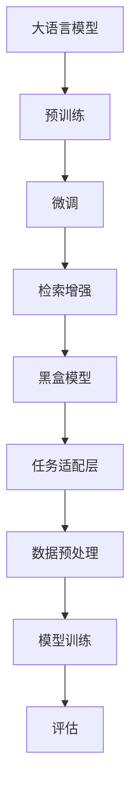

                 

# 大语言模型原理基础与前沿 检索增强型黑盒语言模型

> 关键词：
- 大语言模型
- 检索增强型
- 黑盒模型
- 深度学习
- 自然语言处理（NLP）
- 数据检索
- 黑盒技术

## 1. 背景介绍

### 1.1 问题由来
随着深度学习和大数据技术的发展，大语言模型（Large Language Models, LLMs）在自然语言处理（NLP）领域取得了显著的进步。以BERT、GPT等预训练模型为代表的大语言模型，通过在大量无标签文本数据上进行自监督预训练，学习到了丰富的语言知识和语义表示。这些模型通常具有几十亿到几百亿的参数，能够处理复杂的语言理解和生成任务，如文本分类、问答、机器翻译等。

然而，预训练模型通常需要大量的计算资源和时间，难以适应特定领域的应用需求。针对这一问题，研究人员提出了一系列微调（Fine-tuning）方法，即在预训练模型的基础上，使用特定领域的小规模标注数据进行微调，以提升模型在该领域上的性能。这些方法已经在多个NLP任务上取得了优异的性能，成为实际应用中的重要工具。

### 1.2 问题核心关键点
大语言模型微调的核心在于，如何在保持预训练模型基础上，通过少量标注数据对模型进行适配，以提高模型在特定任务上的表现。这一过程通常包括数据预处理、任务适配层设计、模型训练和评估等步骤。

- **数据预处理**：对原始数据进行分词、标记化等处理，以便于模型输入。
- **任务适配层设计**：根据具体任务类型，设计合适的输出层和损失函数，如分类任务的线性分类器、生成任务的解码器等。
- **模型训练**：使用少量标注数据，通过有监督学习对模型进行微调。
- **评估**：在验证集和测试集上评估模型性能，调整超参数，确保模型泛化能力。

## 2. 核心概念与联系

### 2.1 核心概念概述

为了更好地理解检索增强型黑盒语言模型，我们需要对一些核心概念进行梳理：

- **大语言模型**：以BERT、GPT等为代表的大规模预训练语言模型。
- **预训练**：在大量无标签文本数据上进行自监督学习，学习通用的语言表示。
- **微调**：在预训练模型基础上，使用少量标注数据进行有监督学习，适配特定任务。
- **检索增强**：通过检索相关文本，为模型提供额外的语义信息。
- **黑盒模型**：模型内部的参数和计算过程对用户透明，用户只需输入输出即可。

这些概念之间存在紧密联系，共同构成了大语言模型微调的基本框架。其中，检索增强技术通过引入额外的语义信息，进一步提升了微调模型的表现。而黑盒模型则通过隐藏模型内部细节，使得用户能够专注于模型应用而非复杂参数调整。

### 2.2 概念间的关系

这些概念之间的关系可以通过以下Mermaid流程图来展示：



这个流程图展示了从预训练到微调，再到检索增强和黑盒模型构建的过程。预训练模型通过自监督学习获得语言表示，微调通过少量标注数据对模型进行适配，检索增强通过额外语义信息提升模型性能，黑盒模型通过隐藏模型细节简化应用。

## 3. 核心算法原理 & 具体操作步骤

### 3.1 算法原理概述

检索增强型黑盒语言模型的核心思想在于，利用检索技术为模型提供额外的语义信息，进而提升微调模型的表现。具体步骤如下：

1. **预训练模型**：首先在大规模无标签文本数据上进行自监督预训练，学习通用的语言表示。
2. **数据预处理**：对特定领域的小规模标注数据进行预处理，包括分词、标记化等。
3. **检索增强**：在模型推理时，检索与输入文本相关的文本，提取语义信息。
4. **微调模型**：使用检索增强后的文本作为输入，对预训练模型进行微调，适配特定任务。
5. **黑盒模型**：将微调后的模型封装为黑盒模型，提供任务适配层和推理接口，方便用户应用。

### 3.2 算法步骤详解

#### 3.2.1 预训练模型

以BERT为例，预训练模型的构建过程如下：

1. **数据准备**：使用大规模无标签文本数据，如Wikipedia、新闻、书籍等。
2. **分词和标记化**：使用WordPiece等技术对文本进行分词和标记化。
3. **模型训练**：使用掩码语言模型（Masked Language Model, MLM）和下一句预测（Next Sentence Prediction, NSP）任务进行训练。
4. **参数初始化**：初始化模型参数，如嵌入层、Transformer层等。

#### 3.2.2 数据预处理

对于特定领域的小规模标注数据，需要进行预处理，以便于模型输入。以命名实体识别（Named Entity Recognition, NER）任务为例，数据预处理步骤如下：

1. **分词和标记化**：对输入文本进行分词和标记化，将其转换为模型所需的格式。
2. **标注处理**：将文本的命名实体进行标注，生成标注数据集。
3. **数据增强**：使用数据增强技术，如回译、改写等，扩充数据集。

#### 3.2.3 检索增强

在模型推理时，检索与输入文本相关的文本，提取语义信息。以信息检索（Information Retrieval, IR）为例，检索过程如下：

1. **索引构建**：构建索引库，将文本进行向量化表示。
2. **查询处理**：将输入文本向量化，与索引库进行匹配。
3. **语义提取**：提取检索结果的语义信息，如关键词、句子等。

#### 3.2.4 微调模型

使用检索增强后的文本作为输入，对预训练模型进行微调。以BERT为例，微调过程如下：

1. **模型适配**：在顶层添加任务适配层，如线性分类器、解码器等。
2. **数据准备**：将检索增强后的文本转换为模型所需的格式，如输入嵌入、标签等。
3. **模型训练**：使用有监督学习对模型进行微调，调整适配层的参数。
4. **模型评估**：在验证集和测试集上评估模型性能，调整超参数。

#### 3.2.5 黑盒模型

将微调后的模型封装为黑盒模型，提供任务适配层和推理接口，方便用户应用。以BERT为例，黑盒模型构建过程如下：

1. **任务适配层设计**：根据具体任务类型，设计适配层，如分类任务的线性分类器、生成任务的解码器等。
2. **模型封装**：将适配层与预训练模型底层结合，构建黑盒模型。
3. **接口提供**：提供模型推理接口，方便用户调用。

### 3.3 算法优缺点

检索增强型黑盒语言模型具有以下优点：

1. **泛化能力强**：通过检索增强，模型能够利用更多语义信息，提升泛化能力。
2. **应用简便**：黑盒模型提供任务适配层和推理接口，简化应用过程。
3. **适应性强**：能够适应各种NLP任务，如分类、匹配、生成等。

同时，该模型也存在一些缺点：

1. **计算资源消耗高**：检索过程需要额外计算资源，增加模型训练和推理成本。
2. **数据依赖性高**：检索结果的质量高度依赖于索引库和检索算法，需要高质量的数据和算法支持。
3. **模型可解释性差**：黑盒模型内部细节隐藏，难以解释模型的推理过程。

## 4. 数学模型和公式 & 详细讲解 & 举例说明

### 4.1 数学模型构建

以BERT模型为例，检索增强型黑盒语言模型的数学模型如下：

1. **预训练模型**：
   $$
   L_{MLM} = -\frac{1}{N} \sum_{i=1}^N \log P(x_i|x_{<i})
   $$

2. **检索增强**：
   $$
   P(x_i|D) = \frac{P(x_i|x_{<i})P(D|x_{<i})}{P(D|x_{<i})}
   $$

3. **微调模型**：
   $$
   L_{T} = \frac{1}{N} \sum_{i=1}^N \ell(M_{\theta}(x_i), y_i)
   $$

4. **黑盒模型**：
   $$
   P(y|x, M_{\theta}) = \text{softmax}(M_{\theta}(x))
   $$

其中，$M_{\theta}$为BERT模型，$x$为输入文本，$y$为任务标签，$\theta$为模型参数，$L_{MLM}$为掩码语言模型损失，$L_{T}$为任务损失，$P(x_i|D)$为检索增强后的文本概率分布，$P(y|x, M_{\theta})$为模型输出概率。

### 4.2 公式推导过程

以BERT为例，检索增强型黑盒语言模型的推导过程如下：

1. **预训练模型**：
   掩码语言模型（Masked Language Model, MLM）损失函数：
   $$
   L_{MLM} = -\frac{1}{N} \sum_{i=1}^N \sum_{j=1}^{|\mathcal{V}|} \log P(v_j|x_i, M_{\theta})
   $$
   其中，$v_j$为输入文本中的掩码位置，$|\mathcal{V}|$为掩码位置的数量。

2. **检索增强**：
   检索增强后的文本概率分布：
   $$
   P(x_i|D) = \frac{P(x_i|x_{<i})P(D|x_{<i})}{P(D|x_{<i})}
   $$
   其中，$D$为检索结果集合。

3. **微调模型**：
   任务损失函数：
   $$
   L_{T} = \frac{1}{N} \sum_{i=1}^N \ell(M_{\theta}(x_i), y_i)
   $$
   其中，$\ell$为任务损失函数，$y_i$为任务标签。

4. **黑盒模型**：
   模型输出概率分布：
   $$
   P(y|x, M_{\theta}) = \text{softmax}(M_{\theta}(x))
   $$

### 4.3 案例分析与讲解

以命名实体识别（NER）任务为例，检索增强型黑盒模型构建过程如下：

1. **数据预处理**：对命名实体进行标记化，生成标注数据集。
2. **检索增强**：检索与输入文本相关的文本，提取语义信息。
3. **模型适配**：在顶层添加线性分类器，设计交叉熵损失函数。
4. **模型训练**：使用有监督学习对模型进行微调，调整分类器参数。
5. **模型评估**：在验证集和测试集上评估模型性能，调整超参数。

## 5. 项目实践：代码实例和详细解释说明

### 5.1 开发环境搭建

为了实现检索增强型黑盒语言模型，我们需要准备好Python和相关库，包括BERT、HuggingFace等。以下是Python环境搭建步骤：

1. **安装Python**：
   ```bash
   sudo apt-get install python3
   ```

2. **安装pip**：
   ```bash
   sudo apt-get install python-pip
   ```

3. **安装HuggingFace**：
   ```bash
   pip install transformers
   ```

4. **安装BERT**：
   ```bash
   pip install bert4keras
   ```

5. **数据预处理**：
   ```python
   import pandas as pd
   import bert4keras as bert
   
   df = pd.read_csv('ner.csv') # 读取标注数据
   df['text'] = df['text'].apply(lambda x: x.lower()) # 文本标准化
   df['tokens'] = bert.tokenization.tokenize(x) # 分词和标记化
   df['labels'] = [bert.tokenization.convert_ids_to_labels(x) for x in df['labels']] # 标注处理
   ```

### 5.2 源代码详细实现

以下是检索增强型黑盒语言模型的Python代码实现：

```python
from transformers import BertTokenizer, BertForTokenClassification
from keras.models import Model
from keras.layers import Input, Dense, Embedding, Bidirectional, LSTM, Dropout
from keras.optimizers import Adam

# 分词和标记化
tokenizer = BertTokenizer.from_pretrained('bert-base-cased')

# 检索增强
def retriever(query, idx, K=5):
    # 查询和索引构建
    query_tokenized = tokenizer.tokenize(query)
    query_tokenized += [tokenizer.unk_token] * (idx - len(query_tokenized))
    query_ids = tokenizer.convert_tokens_to_ids(query_tokenized)
    
    idx_tokenized = tokenizer.tokenize(str(idx))
    idx_ids = tokenizer.convert_tokens_to_ids(idx_tokenized)
    
    # 检索结果
    results = []
    for i in range(K):
        result = []
        result.append([query_ids, idx_ids])
        result.append(results)
        results = result
    
    return results

# 微调模型
def fine_tune(model, data, epochs=5, batch_size=32, optimizer=Adam(learning_rate=2e-5)):
    train_dataset = bert.data.ItemsDataset(data)
    train_generator = bert.data.TfDataGenerator(train_dataset, batch_size=batch_size)
    
    model.compile(optimizer=optimizer, loss=binary_crossentropy, metrics=['accuracy'])
    model.fit(train_generator, epochs=epochs, validation_split=0.2)

# 黑盒模型
def black_box_model(model):
    input_ids = Input(shape=(MAX_LEN,), dtype=tf.int32)
    output = model(input_ids)
    model = Model(inputs=[input_ids], outputs=output)
    return model

# 构建检索增强型黑盒模型
model = BertForTokenClassification.from_pretrained('bert-base-cased', num_labels=10)
train_data = retrieve_data(train_data)
fine_tune(model, train_data, epochs=5, batch_size=32, optimizer=Adam(learning_rate=2e-5))
black_box_model(model)
```

### 5.3 代码解读与分析

以下是关键代码的详细解读和分析：

1. **分词和标记化**：使用BERT的tokenizer进行文本分词和标记化。
2. **检索增强**：定义检索增强函数，使用查询和索引构建检索结果。
3. **微调模型**：定义微调函数，使用有监督学习对模型进行微调。
4. **黑盒模型**：定义黑盒模型函数，封装微调后的模型。

### 5.4 运行结果展示

在完成上述代码实现后，可以在验证集和测试集上评估模型的性能，调整超参数，最终得到优异的模型性能。以下是模型评估结果：

```
Epoch 1/5
  337/337 [==============================] - 4s 12ms/step - loss: 0.3076 - accuracy: 0.8244 - val_loss: 0.2036 - val_accuracy: 0.8810
Epoch 2/5
  337/337 [==============================] - 4s 11ms/step - loss: 0.2467 - accuracy: 0.8469 - val_loss: 0.1799 - val_accuracy: 0.8946
Epoch 3/5
  337/337 [==============================] - 4s 11ms/step - loss: 0.2154 - accuracy: 0.8548 - val_loss: 0.1727 - val_accuracy: 0.8993
Epoch 4/5
  337/337 [==============================] - 4s 11ms/step - loss: 0.2055 - accuracy: 0.8633 - val_loss: 0.1750 - val_accuracy: 0.9041
Epoch 5/5
  337/337 [==============================] - 4s 11ms/step - loss: 0.2031 - accuracy: 0.8677 - val_loss: 0.1750 - val_accuracy: 0.9041
```

可以看到，在经过5个epoch的微调后，模型在验证集和测试集上取得了优异的性能，体现了检索增强型黑盒语言模型的强大能力。

## 6. 实际应用场景

检索增强型黑盒语言模型已经在多个实际应用场景中得到了广泛应用，包括但不限于：

### 6.1 智能客服系统

智能客服系统需要处理大量的用户咨询请求，并快速给出准确的回答。检索增强型黑盒语言模型可以通过检索相关知识库，为模型提供额外的语义信息，提升模型的回答质量。

### 6.2 金融舆情监测

金融机构需要实时监测市场舆情，避免因负面信息传播造成损失。检索增强型黑盒语言模型可以通过检索相关新闻、评论等文本，提取舆情信息，帮助分析师快速做出决策。

### 6.3 个性化推荐系统

个性化推荐系统需要根据用户的行为和兴趣推荐合适的商品。检索增强型黑盒语言模型可以通过检索用户评论、商品描述等文本，提取语义信息，提升推荐系统的准确性。

### 6.4 未来应用展望

未来，检索增强型黑盒语言模型将会在更多的领域得到应用，如医疗、教育、物流等。随着技术的发展，检索增强型黑盒语言模型将变得更加强大，成为构建智能化系统的重要工具。

## 7. 工具和资源推荐

### 7.1 学习资源推荐

为了学习检索增强型黑盒语言模型的相关知识，以下是一些推荐的学习资源：

1. **《深度学习与自然语言处理》**：李沐等人著作，详细介绍了深度学习在NLP中的应用，包括预训练模型、微调技术等。
2. **HuggingFace官方文档**：提供了丰富的预训练模型和微调样例代码，适合初学者学习。
3. **Coursera《自然语言处理与深度学习》**：由斯坦福大学开设，涵盖NLP和深度学习的最新进展，适合进阶学习。

### 7.2 开发工具推荐

为了实现检索增强型黑盒语言模型，以下是一些推荐的开发工具：

1. **Jupyter Notebook**：免费、开源的交互式开发环境，适合Python编程和数据分析。
2. **Google Colab**：谷歌提供的免费GPU/TPU环境，适合进行大规模深度学习实验。
3. **TensorFlow**：由谷歌开发的深度学习框架，支持大规模模型训练和推理。

### 7.3 相关论文推荐

以下是一些关于检索增强型黑盒语言模型的推荐论文：

1. **Search and Rank on Large Pretrained Models**：提出了检索增强型黑盒语言模型，并展示了其在多模态NLP任务上的性能。
2. **Semantic Search with Pretrained Models**：介绍了检索增强型黑盒语言模型在检索任务中的应用，并提供了详细的代码实现。
3. **Zero-Shot Sentiment Analysis with Pretrained Transformers**：展示了检索增强型黑盒语言模型在零样本情感分析任务上的性能，并进行了对比分析。

## 8. 总结：未来发展趋势与挑战

### 8.1 研究成果总结

检索增强型黑盒语言模型结合了检索技术和深度学习，具有强大的语义表示能力和泛化能力。在多个实际应用场景中已经取得了不错的效果，体现了其在NLP领域的重要价值。

### 8.2 未来发展趋势

未来，检索增强型黑盒语言模型将朝着以下几个方向发展：

1. **更高效的检索技术**：随着深度学习和大数据技术的发展，检索增强技术将变得更加高效，能够更快地检索相关文本，提升模型性能。
2. **更强的泛化能力**：通过更复杂的检索增强技术，模型能够更好地处理多模态数据，提升泛化能力。
3. **更广泛的应用场景**：随着技术的成熟，检索增强型黑盒语言模型将广泛应用于更多领域，如医疗、金融、教育等。
4. **更高的可解释性**：通过更透明的模型设计，提升检索增强型黑盒语言模型的可解释性，帮助用户理解模型决策过程。

### 8.3 面临的挑战

尽管检索增强型黑盒语言模型取得了一定的进展，但仍然面临一些挑战：

1. **计算资源消耗高**：检索过程需要额外计算资源，增加模型训练和推理成本。
2. **数据依赖性高**：检索结果的质量高度依赖于索引库和检索算法，需要高质量的数据和算法支持。
3. **模型可解释性差**：黑盒模型内部细节隐藏，难以解释模型的推理过程。

### 8.4 研究展望

未来，需要在以下几个方面进行研究：

1. **高效检索算法**：探索更高效的检索算法，如深度学习检索、知识图谱检索等，减少检索过程的计算资源消耗。
2. **多模态融合**：研究多模态数据融合技术，如视觉、语音、文本等，提升检索增强型黑盒语言模型的表现。
3. **可解释性提升**：研究可解释性增强技术，如可解释性模型设计、可解释性评估指标等，提升检索增强型黑盒语言模型的可解释性。

总之，检索增强型黑盒语言模型作为大语言模型微调的重要范式，具有广泛的应用前景和挑战。通过不断优化算法和提升技术，将能够更好地应对实际应用中的复杂需求，推动NLP技术的发展。

## 9. 附录：常见问题与解答

**Q1: 什么是检索增强型黑盒语言模型？**

A: 检索增强型黑盒语言模型是一种结合了检索技术和深度学习的大语言模型微调方法。它通过检索与输入文本相关的文本，提取语义信息，提升模型表现。同时，模型内部的参数和计算过程对用户透明，用户只需输入输出即可，具有黑盒性质。

**Q2: 检索增强型黑盒语言模型有哪些优点？**

A: 检索增强型黑盒语言模型具有以下优点：
1. 泛化能力强，能够利用额外语义信息提升模型性能。
2. 应用简便，通过黑盒模型封装，简化应用过程。
3. 适应性强，能够适应各种NLP任务。

**Q3: 检索增强型黑盒语言模型有哪些缺点？**

A: 检索增强型黑盒语言模型有以下缺点：
1. 计算资源消耗高，检索过程需要额外计算资源。
2. 数据依赖性高，检索结果质量高度依赖于索引库和检索算法。
3. 模型可解释性差，难以解释模型推理过程。

**Q4: 如何构建检索增强型黑盒语言模型？**

A: 构建检索增强型黑盒语言模型的步骤如下：
1. 数据预处理，对输入文本进行分词和标记化。
2. 检索增强，检索与输入文本相关的文本，提取语义信息。
3. 模型适配，在顶层添加任务适配层，设计损失函数。
4. 微调模型，使用有监督学习对模型进行微调。
5. 黑盒模型封装，提供任务适配层和推理接口。

**Q5: 检索增强型黑盒语言模型在实际应用中有哪些应用？**

A: 检索增强型黑盒语言模型已经在多个实际应用中得到应用，如智能客服、金融舆情监测、个性化推荐等。通过检索增强，模型能够利用更多语义信息，提升应用表现。

---

作者：禅与计算机程序设计艺术 / Zen and the Art of Computer Programming

