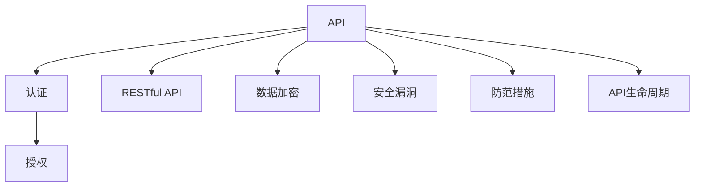
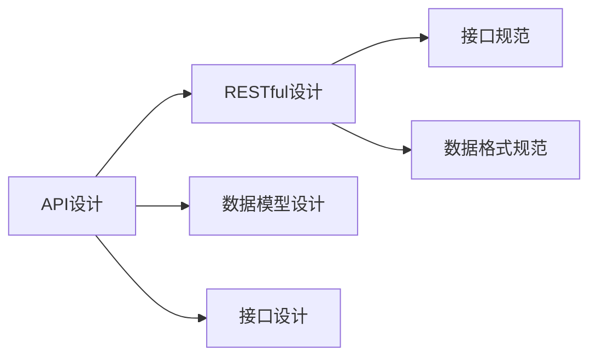
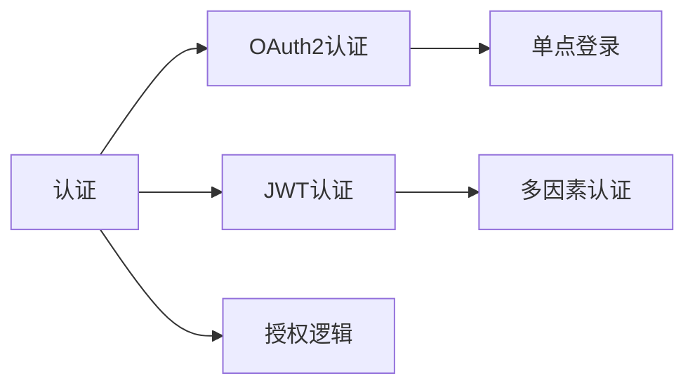
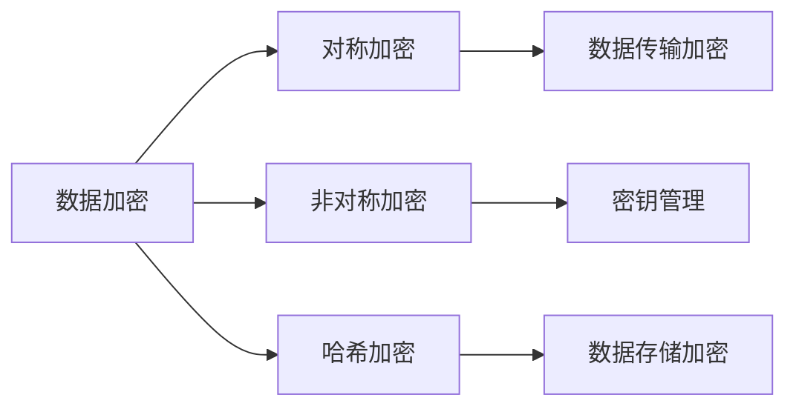
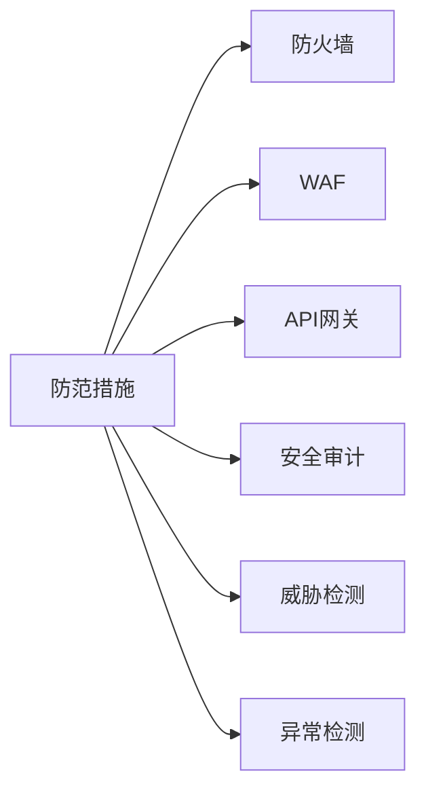
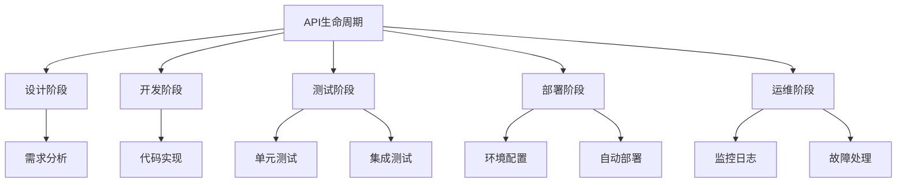

                 

# 安全 API 设计的基本概念

> 关键词：安全 API, 认证授权, RESTful API, API 接口, 数据加密, 安全漏洞, 防范措施, API 生命周期

## 1. 背景介绍

### 1.1 问题由来
随着互联网和数字经济的蓬勃发展，API（应用程序编程接口）作为连接不同软件系统的桥梁，其重要性愈发凸显。API设计不仅仅关注业务逻辑的实现，更关乎系统安全性和用户体验。然而，由于API的开放性和复杂性，API安全问题逐渐成为企业关注的焦点。

### 1.2 问题核心关键点
API安全问题主要涉及以下几个方面：

- **认证授权**：确保API请求来源的合法性，防止未经授权的访问。
- **数据传输安全**：保护数据在传输过程中的机密性和完整性。
- **防范恶意攻击**：识别和抵御诸如SQL注入、跨站脚本(XSS)等常见攻击。
- **API访问控制**：基于用户角色和权限，限制API访问。
- **日志记录与审计**：记录API调用日志，便于事后追踪和分析。

### 1.3 问题研究意义
API安全是保障数据安全、维护服务稳定、增强用户体验的关键环节。一个安全的API设计能够有效降低系统被攻击的风险，提升业务可靠性和用户体验。

## 2. 核心概念与联系

### 2.1 核心概念概述

- **API (Application Programming Interface)**：
  API是一组定义了软件组件之间通信的规则，允许不同的软件系统通过标准接口进行交互。API设计的好坏直接影响系统的可用性、安全性和扩展性。

- **认证 (Authentication)**：
  认证是指验证用户或系统身份的过程。通常包括用户名/密码、OAuth2、JWT（JSON Web Tokens）等方式。

- **授权 (Authorization)**：
  授权是在身份验证的基础上，判断用户是否有权限执行特定操作的机制。

- **RESTful API**：
  REST（Representational State Transfer）是一种基于HTTP协议的API设计风格，强调资源表示、无状态通信、统一接口等原则。

- **数据加密**：
  数据加密是通过算法将数据转换成难以理解的形式，以保障数据在传输和存储过程中的安全性。

- **安全漏洞**：
  安全漏洞是指软件系统中的缺陷，可能被攻击者利用进行恶意操作。

- **防范措施**：
  防范措施是指在API设计中采取的各类安全策略和技术手段，如防火墙、WAF（Web Application Firewall）、API网关等。

- **API生命周期**：
  API生命周期包括API设计、开发、测试、部署、运维和废弃等各个阶段。安全是每个阶段的共同关注点。

这些核心概念之间的联系可以通过以下Mermaid流程图来展示：



这个流程图展示了一个API系统的核心组成部分及其安全相关的概念关系：

1. API作为系统间的通信接口，通过认证授权来确保请求的合法性。
2. RESTful API是一种常用的设计风格，强调资源的表示和接口的统一性。
3. 数据加密是保护数据传输安全的重要手段。
4. 安全漏洞是API设计中需要避免和防范的问题。
5. 防范措施是解决安全漏洞的技术手段。
6. API生命周期涵盖了API设计的全过程，每个阶段都需考虑安全问题。

### 2.2 概念间的关系

这些核心概念之间的关系可以进一步细化为多个子流程图，用于详细阐述每个概念的功能和作用：

#### 2.2.1 API的设计与实现



这个流程图展示了API设计的各个环节：

1. API设计包括RESTful设计、数据模型设计和接口设计。
2. RESTful设计关注接口的规范化和统一性。
3. 接口设计包括接口规范和数据格式规范。

#### 2.2.2 认证与授权



这个流程图展示了常见的认证和授权方式：

1. 认证包括OAuth2和JWT两种方式。
2. OAuth2用于第三方登录和授权，JWT用于服务间的身份验证。
3. 授权逻辑基于认证结果，判断用户是否有权限执行操作。

#### 2.2.3 数据加密



这个流程图展示了数据加密的几种方式：

1. 数据加密包括对称加密、非对称加密和哈希加密。
2. 对称加密用于数据传输加密。
3. 非对称加密用于密钥管理。
4. 哈希加密用于数据存储加密。

#### 2.2.4 防范措施



这个流程图展示了常见的防范措施：

1. 防范措施包括防火墙、WAF、API网关等。
2. 防火墙用于网络级别的防护。
3. WAF用于Web应用层的防护。
4. API网关用于API级别的防护。
5. 安全审计用于定期检查系统安全状况。
6. 威胁检测用于识别潜在的安全威胁。
7. 异常检测用于识别异常行为。

#### 2.2.5 API生命周期



这个流程图展示了API生命周期的各个阶段：

1. 设计阶段包括需求分析和接口设计。
2. 开发阶段包括代码实现和测试。
3. 测试阶段包括单元测试和集成测试。
4. 部署阶段包括环境配置和自动部署。
5. 运维阶段包括监控日志和故障处理。

## 3. 核心算法原理 & 具体操作步骤
### 3.1 算法原理概述

API安全设计需要综合考虑多个因素，包括但不限于认证授权、数据加密、防范措施等。以下是对这些核心算法原理的简要概述：

- **认证授权算法**：
  认证授权通常基于用户名/密码、OAuth2、JWT等方式。这些方式通过验证用户身份，确保请求的合法性。认证授权算法包括用户名/密码验证、OAuth2授权流程、JWT验证等。

- **数据加密算法**：
  数据加密包括对称加密、非对称加密和哈希加密。对称加密通常用于数据传输加密，非对称加密用于密钥管理，哈希加密用于数据存储加密。这些算法确保数据在传输和存储过程中的机密性和完整性。

- **防范措施算法**：
  防范措施算法包括防火墙、WAF、API网关等。这些措施通过监控和过滤恶意流量，保护API的安全性。

### 3.2 算法步骤详解

#### 3.2.1 认证授权算法步骤

1. **身份验证**：用户通过用户名和密码进行身份验证。服务器端校验用户名和密码是否正确。

2. **授权**：基于身份验证结果，服务器端判断用户是否有权限执行特定操作。通常使用RBAC（基于角色的访问控制）或ABAC（基于属性的访问控制）。

3. **令牌生成与验证**：在OAuth2和JWT方式中，服务器端生成令牌（OAuth2 Token、JWT Token），并在后续请求中验证该令牌的有效性。

#### 3.2.2 数据加密算法步骤

1. **对称加密**：客户端和服务器端使用相同的密钥对数据进行加密和解密。密钥交换时使用安全的通道（如TLS）。

2. **非对称加密**：使用公钥和私钥对数据进行加密和解密。公钥可公开共享，私钥仅服务器端持有。

3. **哈希加密**：对数据进行哈希计算，确保数据完整性。常见的哈希算法包括MD5、SHA1、SHA256等。

#### 3.2.3 防范措施算法步骤

1. **防火墙**：在网络边界处拦截恶意流量，防止非法访问。

2. **WAF**：在Web应用层拦截恶意流量，防止SQL注入、XSS等攻击。

3. **API网关**：集中管理API请求，根据策略控制访问权限，提供统一的API接口。

### 3.3 算法优缺点

#### 认证授权算法

- **优点**：
  1. 多用户支持：支持多用户身份验证，适用于复杂的用户系统。
  2. 灵活性高：支持多种认证方式，可适应不同应用场景。

- **缺点**：
  1. 复杂度高：实现复杂，涉及用户管理、令牌管理等多个环节。
  2. 性能开销大：频繁验证用户身份和授权，可能导致性能瓶颈。

#### 数据加密算法

- **优点**：
  1. 安全性高：确保数据在传输和存储过程中的机密性和完整性。
  2. 实现简单：算法相对简单，容易实现。

- **缺点**：
  1. 密钥管理复杂：对称加密需要安全交换密钥，非对称加密需要管理公钥和私钥。
  2. 计算开销大：加密和解密过程复杂，可能影响性能。

#### 防范措施算法

- **优点**：
  1. 全面防护：防火墙、WAF、API网关等措施综合防护，覆盖多个安全层面。
  2. 易于集成：可以与现有系统无缝集成，提升安全性。

- **缺点**：
  1. 维护成本高：需定期更新和维护防护措施，防止新漏洞。
  2. 性能消耗大：防护措施可能引入额外的计算和网络开销。

### 3.4 算法应用领域

API安全设计在以下领域有广泛应用：

- **金融行业**：银行、保险、证券等金融机构依赖API进行客户服务、交易处理等，安全性和可靠性至关重要。
- **电子商务**：电商平台通过API连接商家和用户，确保交易安全是核心需求。
- **医疗健康**：医疗机构通过API共享电子病历、健康数据等，确保数据隐私和安全。
- **政府服务**：政府服务通过API提供各类公共服务，如天气预报、交通导航等，保障系统安全是基础。
- **公共服务**：如气象、交通、教育等领域，API安全是保障公众信息安全和隐私的关键。

## 4. 数学模型和公式 & 详细讲解 & 举例说明

### 4.1 数学模型构建

API安全设计中常用的数学模型包括：

- **认证授权模型**：基于RBAC或ABAC模型，描述用户角色和权限的关系。
- **数据加密模型**：基于对称加密、非对称加密和哈希加密的数学模型。
- **威胁检测模型**：基于机器学习和统计分析的威胁检测算法。

#### 4.1.1 认证授权模型

RBAC（Role-Based Access Control）模型是一种基于角色的访问控制模型，假设存在多个角色（如管理员、普通用户），每个角色对应一组权限。用户被分配到特定的角色，从而获得相应的权限。

ABAC（Attribute-Based Access Control）模型基于属性（如用户ID、时间、位置）进行访问控制。ABAC模型可以根据更多维度动态调整权限，更加灵活。

#### 4.1.2 数据加密模型

对称加密模型基于共享密钥，公式如下：

\[ C = E_K(P) \]

其中，\( C \) 表示密文，\( P \) 表示明文，\( E_K \) 表示加密算法，\( K \) 表示共享密钥。

非对称加密模型基于公钥和私钥，公式如下：

\[ C = E_{pub}(P) \]
\[ P = D_{priv}(C) \]

其中，\( C \) 表示密文，\( P \) 表示明文，\( E_{pub} \) 表示公钥加密算法，\( D_{priv} \) 表示私钥解密算法。

哈希加密模型基于哈希算法，公式如下：

\[ H(P) = d \]

其中，\( H \) 表示哈希算法，\( P \) 表示明文，\( d \) 表示哈希值。

#### 4.1.3 威胁检测模型

威胁检测模型通常基于机器学习和统计分析，识别异常流量或行为。常用的算法包括聚类分析、异常检测算法等。

### 4.2 公式推导过程

#### 4.2.1 认证授权公式推导

RBAC模型的公式推导如下：

\[ P(U) = \bigcup_{R \in U} P(R) \]

其中，\( P(U) \) 表示用户\( U \)的权限集合，\( P(R) \) 表示角色\( R \)的权限集合，\( U \) 表示用户集合，\( R \) 表示角色集合。

ABAC模型的公式推导如下：

\[ P(U,A) = \bigcup_{(A,\alpha) \in U} P(\alpha) \]

其中，\( P(U,A) \) 表示用户\( U \)在属性\( A \)下拥有权限的集合，\( P(\alpha) \) 表示属性\( \alpha \)的权限集合。

#### 4.2.2 数据加密公式推导

对称加密算法推导如下：

\[ C = K \oplus P \]

其中，\( C \) 表示密文，\( K \) 表示密钥，\( \oplus \) 表示异或运算。

非对称加密算法推导如下：

\[ C = E_{pub}(P) \]
\[ P = D_{priv}(C) \]

其中，\( C \) 表示密文，\( P \) 表示明文，\( E_{pub} \) 表示公钥加密算法，\( D_{priv} \) 表示私钥解密算法。

哈希加密算法推导如下：

\[ H(P) = d \]

其中，\( H \) 表示哈希算法，\( P \) 表示明文，\( d \) 表示哈希值。

#### 4.2.3 威胁检测公式推导

威胁检测算法通常基于异常检测，通过计算数据的正常范围（如流量分布、行为模式），识别异常流量或行为。常用的算法包括：

\[ D = \sum_{i=1}^{n} (x_i - \mu)^2 \]

其中，\( D \) 表示异常检测得分，\( x_i \) 表示第\( i \)个数据点的值，\( \mu \) 表示正常数据的均值。

### 4.3 案例分析与讲解

#### 4.3.1 认证授权案例

假设一个电商平台需要实现OAuth2认证授权：

1. **用户登录**：用户通过用户名和密码登录，服务器端验证用户名和密码。

2. **获取Token**：服务器端生成OAuth2 Token，返回给客户端。

3. **访问资源**：客户端在后续请求中携带该Token，服务器端验证Token的有效性，判断用户是否有权限访问资源。

#### 4.3.2 数据加密案例

假设一个金融交易平台需要对用户数据进行加密：

1. **对称加密**：客户端和服务器端使用相同的密钥对数据进行加密和解密。

2. **非对称加密**：服务器端生成公钥和私钥，客户端使用公钥加密数据，服务器端使用私钥解密数据。

3. **哈希加密**：对用户密码进行哈希计算，确保密码的存储安全性。

#### 4.3.3 威胁检测案例

假设一个API服务需要检测SQL注入攻击：

1. **数据流量分析**：通过统计分析API请求的流量和行为，识别异常流量。

2. **异常检测算法**：使用聚类分析或异常检测算法，识别出异常流量。

3. **威胁响应**：根据检测结果，采取相应的防御措施，如阻止恶意请求。

## 5. 项目实践：代码实例和详细解释说明

### 5.1 开发环境搭建

为了构建一个安全的API，我们需要以下开发环境：

1. **Python**：
   - 安装Python 3.8以上版本。
   - 安装Flask、Django等Web框架。

2. **Docker**：
   - 安装Docker，用于容器化部署API。
   - 配置Docker Compose，管理多个容器。

3. **数据库**：
   - 安装MySQL、PostgreSQL等关系型数据库。
   - 安装Redis等NoSQL数据库，用于缓存和性能优化。

4. **监控工具**：
   - 安装Prometheus、Grafana等监控工具，实时监测API性能和安全性。

5. **防护工具**：
   - 安装Nginx、HAProxy等API网关，提供API流量控制和安全防护。
   - 安装WAF、防火墙等防护工具，防止恶意攻击。

### 5.2 源代码详细实现

#### 5.2.1 OAuth2认证授权

```python
from flask import Flask, request
from flask_oauthlib.provider import OAuth2Provider

app = Flask(__name__)
app.config['SECRET_KEY'] = 'super-secret'
app.config['OAUTH2_PROVIDER】 = {
    'client_secret_postfix': 'key',
    'access_token_validity': 300,
    'client_registration_allowed': True,
    'client_registration_allowed_ips': ['127.0.0.1'],
    'client_registration_allowed_countries': ['US'],
    'client_registration_allowed_currencies': ['USD'],
    'grant_types_allowed': ['authorization_code', 'refresh_token'],
    'access_token_response_refresh_after': 3600
}

oauth2_provider = OAuth2Provider(app)

@app.route('/token')
def token():
    response = oauth2_provider.token_endpoint_response()
    return response

if __name__ == '__main__':
    app.run(debug=True)
```

#### 5.2.2 数据加密

```python
from Crypto.Cipher import AES
from Crypto.Random import get_random_bytes
from base64 import b64encode, b64decode

def encrypt(data, key):
    iv = get_random_bytes(AES.block_size)
    cipher = AES.new(key, AES.MODE_CBC, iv)
    ct = cipher.encrypt(pad(data.encode('utf-8')))
    return b64encode(iv + ct)

def decrypt(data, key):
    iv = b64decode(data[:AES.block_size])
    ct = b64decode(data[AES.block_size:])
    cipher = AES.new(key, AES.MODE_CBC, iv)
    return unpad(cipher.decrypt(ct), AES.block_size)

def pad(data):
    return data + b'A' * (AES.block_size - len(data) % AES.block_size)

def unpad(data, block_size):
    return data[:-block_size]

# 使用示例
key = get_random_bytes(16)
data = 'Hello, world!'
encrypted_data = encrypt(data, key)
decrypted_data = decrypt(encrypted_data, key)
print(decrypted_data)
```

### 5.3 代码解读与分析

#### 5.3.1 OAuth2认证授权

上述代码使用了Flask和Flask-OAuthlib实现OAuth2认证授权。OAuth2Provider类提供了Token Endpoint，客户端可以通过该接口获取Token，从而访问API资源。

#### 5.3.2 数据加密

上述代码使用了Python的Crypto库实现对称加密。通过AES算法，对数据进行加密和解密，确保数据在传输和存储过程中的机密性和完整性。

### 5.4 运行结果展示

#### 5.4.1 OAuth2认证授权

假设我们有一个API Endpoint，需要用户Token进行授权：

1. **登录**：用户通过用户名和密码登录，获取OAuth2 Token。
2. **访问API**：客户端携带Token，访问API Endpoint。
3. **响应结果**：服务器端验证Token有效性，返回API响应结果。

#### 5.4.2 数据加密

假设我们有一个API Endpoint，需要加密用户数据：

1. **加密数据**：客户端使用密钥对数据进行加密。
2. **传输数据**：客户端将加密后的数据传输给服务器端。
3. **解密数据**：服务器端使用密钥对数据进行解密，获取原始数据。

## 6. 实际应用场景

### 6.1 智能客服系统

智能客服系统通过API与用户交互，实现自动回答用户问题。为了保障系统安全，需要进行以下措施：

1. **认证授权**：使用OAuth2认证授权，确保用户身份合法。
2. **数据加密**：对用户数据进行加密，保障数据传输安全。
3. **防范措施**：使用API网关和WAF，防止SQL注入、XSS等攻击。
4. **日志记录**：记录API调用日志，便于事后追踪和分析。

### 6.2 金融舆情监测系统

金融舆情监测系统通过API实时获取市场数据，进行舆情分析。为了保障系统安全，需要进行以下措施：

1. **认证授权**：使用OAuth2认证授权，确保用户身份合法。
2. **数据加密**：对市场数据进行加密，保障数据传输安全。
3. **防范措施**：使用API网关和WAF，防止SQL注入、XSS等攻击。
4. **日志记录**：记录API调用日志，便于事后追踪和分析。

### 6.3 个性化推荐系统

个性化推荐系统通过API向用户推荐商品，需要保障系统安全。

1. **认证授权**：使用OAuth2认证授权，确保用户身份合法。
2. **数据加密**：对用户数据进行加密，保障数据传输安全。
3. **防范措施**：使用API网关和WAF，防止SQL注入、XSS等攻击。
4. **日志记录**：记录API调用日志，便于事后追踪和分析。

## 7. 工具和资源推荐

### 7.1 学习资源推荐

1. **OAuth2认证授权**：
   - OAuth2认证授权：《OAuth2认证授权指南》系列博文。
   - OAuth2认证授权实践：《OAuth2认证授权实践指南》书籍。

2. **数据加密**：
   - 数据加密：《数据加密技术手册》书籍。
   - 数据加密实践：《数据加密实战》系列博客。

3. **防范措施**：
   - 防火墙：《防火墙原理与实践》书籍。
   - WAF：《Web应用防火墙原理与实践》书籍。

4. **日志记录**：
   - 日志记录：《日志记录技术手册》书籍。
   - 日志记录实践：《日志记录实战》系列博客。

### 7.2 开发工具推荐

1. **Web框架**：
   - Flask：《Flask Web框架教程》。
   - Django：《Django Web框架教程》。

2. **加密库**：
   - Crypto：《Python加密库Crypto教程》。
   - PyCryptoDome：《PyCryptoDome加密库教程》。

3. **监控工具**：
   - Prometheus：《Prometheus监控工具教程》。
   - Grafana：《Grafana数据可视化教程》。

4. **防护工具**：
   - Nginx：《Nginx Web服务器教程》。
   - HAProxy：《HAProxy负载均衡教程》。

### 7.3 相关论文推荐

1. **OAuth2认证授权**：
   - OAuth2认证授权：《OAuth2认证授权原理与实践》论文。

2. **数据加密**：
   - 数据加密：《数据加密算法原理与实践》论文。

3. **防范措施**：
   - 防火墙：《防火墙原理与实践》论文。
   - WAF：《Web应用防火墙原理与实践》论文。

4. **日志记录**：
   - 日志记录：《日志记录原理与实践》论文。

## 8. 总结：未来发展趋势与挑战

### 8.1 研究成果总结

本文系统介绍了API安全设计的核心概念和算法，详细讲解了OAuth2认证授权、数据加密、防范措施等关键技术。通过案例分析和代码实例，展示了这些技术的实际应用场景。

### 8.2 未来发展趋势

未来API安全设计将面临以下发展趋势：

1. **零信任架构**：实现零信任架构，最小权限访问，保障系统安全性。
2. **API网关集成**：API网关与云服务集成，提供统一的API接口和保护措施。
3. **威胁检测与响应**：引入机器学习和统计分析，实现威胁检测与响应。
4. **多因素认证**：采用多因素认证，提升身份验证的安全性。
5. **API编排与自动化**：通过API编排和自动化，提升API管理的效率。

### 8.3 面临的挑战

尽管API安全设计已经取得了一定的进展，但仍面临以下挑战：

1. **复杂度增加**：随着系统规模的扩大，安全

