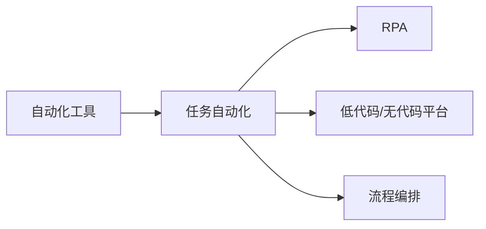

                 

# 工具使用在任务自动化中的应用

在现代数字化时代，自动化技术成为各行各业提升效率、降低成本、增强竞争力的关键。自动化工具的应用，不仅能够显著提高任务执行的效率，还能确保一致性和准确性。本文将深入探讨几种典型的自动化工具及其在任务自动化中的应用，分析其工作原理和操作步骤，并展望未来发展趋势和面临的挑战。

## 1. 背景介绍

随着人工智能（AI）技术的飞速发展，自动化工具在各个领域得到了广泛应用。从制造业的机器人自动化到金融行业的算法交易，再到医疗行业的影像诊断，自动化工具已成为推动行业发展的强大动力。自动化工具的广泛应用，使得企业能够快速响应市场变化，提高生产效率，优化资源配置。本文旨在通过几个核心关键词，深入探讨工具在任务自动化中的应用。

## 2. 核心概念与联系

### 2.1 核心概念概述

在本节中，我们将详细介绍几个核心概念及其相互联系。这些概念包括：

- **自动化工具**：指能够自动执行特定任务的软件或系统，减少人工干预，提高任务效率和质量。
- **任务自动化**：指将传统的人工操作转变为由工具或系统自动执行的过程，旨在提高任务执行的效率和一致性。
- **机器人流程自动化（RPA）**：指使用软件机器人模拟人类操作，自动执行重复性、规则性任务的技术。
- **低代码/无代码平台**：提供可视化的编程界面，使非技术用户也能轻松创建和部署应用。
- **流程编排**：通过编排不同应用和组件，构建复杂自动化工作流，实现业务流程的自动化。

这些概念相互关联，共同构成了自动化工具在任务自动化中的应用框架。

### 2.2 核心概念间的关系

我们可以使用Mermaid流程图来展示这些核心概念之间的关系：



这个流程图表明，自动化工具是实现任务自动化的基础，RPA、低代码/无代码平台和流程编排都是基于自动化工具，用于构建和部署自动化工作流，最终实现任务自动化。

## 3. 核心算法原理 & 具体操作步骤

### 3.1 算法原理概述

自动化工具的核心原理是通过算法实现任务自动化。这些算法包括但不限于机器学习、自然语言处理、图像识别等，能够自动分析任务要求，执行相应的操作。

### 3.2 算法步骤详解

以下是几种典型自动化工具的工作流程：

#### 3.2.1 机器人流程自动化（RPA）

1. **任务识别**：通过规则和模板，识别需要自动化的任务。
2. **流程设计**：设计任务执行的流程，包括数据输入、处理和输出等步骤。
3. **机器人训练**：通过模拟操作，训练软件机器人，使其能够执行特定任务。
4. **执行任务**：将机器人部署到指定环境中，自动执行任务。
5. **监控与优化**：实时监控机器人执行情况，根据反馈不断优化任务执行流程。

#### 3.2.2 低代码/无代码平台

1. **业务建模**：通过可视化界面，用户可以定义业务流程、数据模型等。
2. **组件拖放**：用户可以从平台上拖拽、组合不同的组件（如数据源、计算、API等）。
3. **参数配置**：用户可以配置组件的参数，实现特定的业务逻辑。
4. **应用部署**：用户可以将配置好的应用部署到生产环境，并监控其运行状态。
5. **持续迭代**：根据用户反馈，不断迭代优化应用。

#### 3.2.3 流程编排

1. **任务定义**：定义需要自动化的任务和组件。
2. **编排工作流**：使用编排工具，将任务和组件按照业务逻辑编排，形成工作流。
3. **测试与调试**：通过模拟测试，检查工作流是否符合预期。
4. **部署与监控**：将编排好的工作流部署到生产环境，并实时监控其执行情况。
5. **优化与调整**：根据监控数据，不断优化和调整工作流。

### 3.3 算法优缺点

#### RPA的优缺点

**优点**：
- 快速部署：不需要复杂的编程技能，能够快速创建自动化任务。
- 成本低廉：相比于传统软件开发，RPA的部署和维护成本较低。
- 高准确性：通过规则和模板，RPA能够执行高准确性的任务。

**缺点**：
- 适用范围有限：适用于规则明确、重复性高的任务，对复杂任务和逻辑处理能力有限。
- 依赖系统环境：RPA依赖于系统的稳定性和可靠性，系统异常可能导致任务执行失败。
- 缺乏灵活性：一旦设计完成，RPA的流程难以动态调整。

#### 低代码/无代码平台的优缺点

**优点**：
- 易用性高：无需编程基础，用户可以通过拖拽、配置的方式构建应用。
- 快速迭代：能够快速响应业务需求，快速迭代开发。
- 易于维护：维护工作量小，非技术用户也能轻松使用。

**缺点**：
- 功能受限：由于无代码平台通常是轻量级应用，无法处理复杂业务逻辑。
- 依赖平台：依赖特定的平台和生态，迁移成本较高。
- 安全风险：非技术用户可能缺乏对代码的理解，导致安全性问题。

#### 流程编排的优缺点

**优点**：
- 灵活性强：能够处理复杂的业务逻辑，支持多种任务组合。
- 可扩展性好：可以通过添加新组件和任务，动态扩展工作流。
- 可视化管理：提供可视化界面，便于管理和监控。

**缺点**：
- 复杂度高：流程编排通常涉及多个组件和任务，配置和管理较为复杂。
- 学习成本高：需要掌握一定的编排工具和技术。
- 资源消耗大：编排任务通常需要较长的配置和调试时间，初期投资较高。

### 3.4 算法应用领域

自动化工具广泛应用于各个领域，以下是几个典型应用场景：

- **金融行业**：自动化交易、风险管理、客户服务等领域，通过RPA和低代码平台，提高业务处理的效率和准确性。
- **制造业**：自动化生产线、设备维护、质量检测等领域，通过RPA和流程编排，实现生产流程的自动化。
- **医疗行业**：电子病历管理、影像诊断、患者信息查询等领域，通过低代码平台和流程编排，提高医疗服务的效率和质量。
- **零售行业**：库存管理、客户服务、销售预测等领域，通过低代码平台和RPA，优化业务流程，提升运营效率。
- **能源行业**：自动化监控、数据分析、设备管理等领域，通过流程编排和低代码平台，实现能源管理的自动化。

## 4. 数学模型和公式 & 详细讲解

### 4.1 数学模型构建

自动化工具的数学模型通常基于机器学习和自然语言处理等算法构建。例如，机器学习算法可以用于数据分类、预测等任务，自然语言处理算法可以用于文本分析、语义理解等任务。

### 4.2 公式推导过程

以机器学习中的线性回归模型为例，推导其公式过程如下：

假设有一个输入特征向量 $x=[x_1,x_2,...,x_n]$，一个输出变量 $y$，目标是最小化误差平方和：

$$
J(\theta) = \frac{1}{2m} \sum_{i=1}^m(y^{(i)} - \theta_0 - \theta_1x_1^{(i)} - ... - \theta_nx_n^{(i)})^2
$$

其中 $m$ 为样本数量，$\theta$ 为模型参数。通过最小化上述误差平方和，可以求解出最优的模型参数 $\theta$。

### 4.3 案例分析与讲解

以金融行业中的自动化交易系统为例，分析其应用流程和数学模型。

1. **任务定义**：定义交易策略和参数，如买入、卖出价格、数量等。
2. **数据获取**：通过API获取市场数据，包括股票价格、交易量等。
3. **模型训练**：使用历史数据训练线性回归模型，预测未来的价格变化。
4. **交易执行**：根据模型预测结果，自动执行交易操作，如买入、卖出股票。
5. **结果评估**：通过实时监控交易结果，评估模型的准确性和效率。

## 5. 项目实践：代码实例和详细解释说明

### 5.1 开发环境搭建

在使用自动化工具进行项目实践前，首先需要搭建开发环境。以下是在Python中使用UiPath搭建RPA项目的步骤：

1. 安装UiPath Studio：从UiPath官网下载并安装UiPath Studio。
2. 安装UiPath Robotics Framework：使用NuGet包管理器安装UiPath Robotics Framework。
3. 编写RPA脚本：在UiPath Studio中，使用Visual Studio IDE编写RPA脚本。
4. 测试和调试：在模拟器或实际环境中测试和调试RPA脚本。
5. 部署RPA机器人：将RPA脚本部署到实际环境中，监控任务执行情况。

### 5.2 源代码详细实现

以金融行业中的自动化交易系统为例，展示RPA脚本的实现过程。

```python
import time
from UiPath import Activities

def TradeStock(stock_symbol, buy_price, sell_price, volume):
    # 获取股票价格
    price = GetStockPrice(stock_symbol)
    
    # 如果当前价格低于买入价格，则买入
    if price < buy_price:
        BuyStock(stock_symbol, volume)
    
    # 如果当前价格高于卖出价格，则卖出
    if price > sell_price:
        SellStock(stock_symbol, volume)
        
def GetStockPrice(stock_symbol):
    # 调用API获取股票价格
    price = StockAPI.GetPrice(stock_symbol)
    return price

def BuyStock(stock_symbol, volume):
    # 调用交易API进行买入操作
    TradeAPI.Buy(stock_symbol, volume)
    
def SellStock(stock_symbol, volume):
    # 调用交易API进行卖出操作
    TradeAPI.Sell(stock_symbol, volume)
```

### 5.3 代码解读与分析

以上代码实现了自动化交易系统的核心功能，包括获取股票价格、买入和卖出股票等。在RPA脚本中，通过调用UiPath提供的Activity库，实现了对外部API的调用，从而实现了股票交易的自动化。

### 5.4 运行结果展示

在实际应用中，通过不断优化交易策略和模型参数，自动化交易系统能够实现更高的收益和更低的风险。

## 6. 实际应用场景

### 6.1 金融行业

在金融行业中，自动化工具已经广泛应用于股票交易、风险管理、客户服务等领域。通过RPA和低代码平台，金融企业能够实现高效率、高准确性的业务处理。

### 6.2 制造业

制造业中的自动化工具主要应用于生产线自动化、设备维护、质量检测等领域。通过RPA和流程编排，制造企业能够实现生产流程的自动化，提高生产效率和质量。

### 6.3 医疗行业

医疗行业中的自动化工具主要应用于电子病历管理、影像诊断、患者信息查询等领域。通过低代码平台和流程编排，医疗机构能够实现医疗服务的自动化，提高服务效率和质量。

## 7. 工具和资源推荐

### 7.1 学习资源推荐

为了更好地掌握自动化工具的应用，以下是一些推荐的学习资源：

1. UiPath官方文档：UiPath Studio和UiPath Robotics Framework的官方文档，提供了详细的使用指南和示例。
2. UiPath Academy：UiPath提供的在线培训课程，涵盖RPA开发的各个方面。
3. IBM Watson AI：IBM提供的AI和机器学习工具，支持自动化任务的开发。
4. Microsoft Power Automate：Microsoft提供的低代码平台，支持自动化工作流的构建。
5. Zapier：Zapier提供的自动化工具，支持各种应用的集成和自动化。

### 7.2 开发工具推荐

以下是一些推荐的开发工具：

1. UiPath Studio：UiPath提供的RPA开发工具，支持可视化脚本编写。
2. UiPath Robotics Framework：UiPath提供的RPA运行时环境，支持RPA脚本的部署和执行。
3. Microsoft Power Automate：Microsoft提供的低代码平台，支持自动化任务的构建和部署。
4. Zapier：Zapier提供的自动化工具，支持各种应用的集成和自动化。
5. IBM Watson Studio：IBM提供的AI和机器学习平台，支持自动化任务的开发和部署。

### 7.3 相关论文推荐

以下是几篇自动化工具领域的经典论文，推荐阅读：

1. "Robotic Process Automation: A Survey of the State-of-the-Art"：综述了RPA技术的发展和应用。
2. "Low-Code/No-Code Development: From Ideation to Production"：探讨了低代码/无代码平台的开发和应用。
3. "Automating Business Processes Using Workflow Automation"：介绍了流程编排工具的应用。

## 8. 总结：未来发展趋势与挑战

### 8.1 研究成果总结

自动化工具在各个行业中的应用已经取得了显著的成果，极大地提升了业务处理效率和质量。然而，自动化工具的发展也面临着诸多挑战，如系统集成、安全性、可扩展性等。

### 8.2 未来发展趋势

未来，自动化工具将继续在各个领域发挥重要作用。随着技术的不断进步，自动化工具将具备更强的智能化和自适应能力，能够更好地应对复杂多变的业务需求。

### 8.3 面临的挑战

尽管自动化工具在应用中取得了显著成果，但也面临以下挑战：

1. **系统集成**：自动化工具需要与现有系统和应用进行无缝集成，这对系统架构提出了更高的要求。
2. **安全性**：自动化工具需要确保系统的安全性和数据隐私，避免潜在的安全风险。
3. **可扩展性**：自动化工具需要具备良好的可扩展性，能够支持大规模、复杂的应用需求。
4. **维护成本**：自动化工具的维护和更新成本较高，需要不断优化和改进。
5. **用户接受度**：非技术用户可能对自动化工具的接受度较低，需要提供易用性和可视化界面。

### 8.4 研究展望

未来的研究将集中在以下几个方向：

1. **智能化升级**：通过引入AI和机器学习技术，提高自动化工具的智能化和自适应能力。
2. **自动化编排**：通过自动化编排工具，实现复杂业务流程的自动化。
3. **低代码/无代码**：继续探索低代码/无代码平台的开发和应用，降低开发门槛。
4. **安全与隐私**：研究自动化工具的安全性和隐私保护措施，确保系统安全可靠。
5. **跨平台集成**：研究自动化工具的跨平台集成技术，支持多种系统和应用环境。

总之，自动化工具的应用前景广阔，但在应用过程中需要不断优化和改进，才能充分发挥其价值，推动行业发展的数字化转型。

## 9. 附录：常见问题与解答

**Q1：自动化工具的优势有哪些？**

A: 自动化工具的优势包括：
- 提高效率：自动执行重复性、规则性任务，减少人工操作。
- 降低成本：减少人工成本，提高资源利用率。
- 提高质量：减少人为错误，保证任务执行的准确性和一致性。
- 灵活性强：能够应对复杂多变的业务需求。

**Q2：自动化工具在开发和维护中需要注意哪些问题？**

A: 在开发和维护自动化工具时，需要注意以下问题：
- 系统集成：确保自动化工具与现有系统和应用无缝集成。
- 安全性：确保系统的安全性和数据隐私。
- 可扩展性：保证自动化工具具备良好的可扩展性，支持大规模应用。
- 维护成本：定期优化和改进自动化工具，降低维护成本。
- 用户接受度：提供易用性和可视化界面，提高用户接受度。

**Q3：自动化工具的未来发展趋势是什么？**

A: 自动化工具的未来发展趋势包括：
- 智能化升级：引入AI和机器学习技术，提高自动化工具的智能化和自适应能力。
- 自动化编排：通过自动化编排工具，实现复杂业务流程的自动化。
- 低代码/无代码：继续探索低代码/无代码平台的开发和应用，降低开发门槛。
- 安全与隐私：研究自动化工具的安全性和隐私保护措施，确保系统安全可靠。
- 跨平台集成：研究自动化工具的跨平台集成技术，支持多种系统和应用环境。

---

作者：禅与计算机程序设计艺术 / Zen and the Art of Computer Programming

