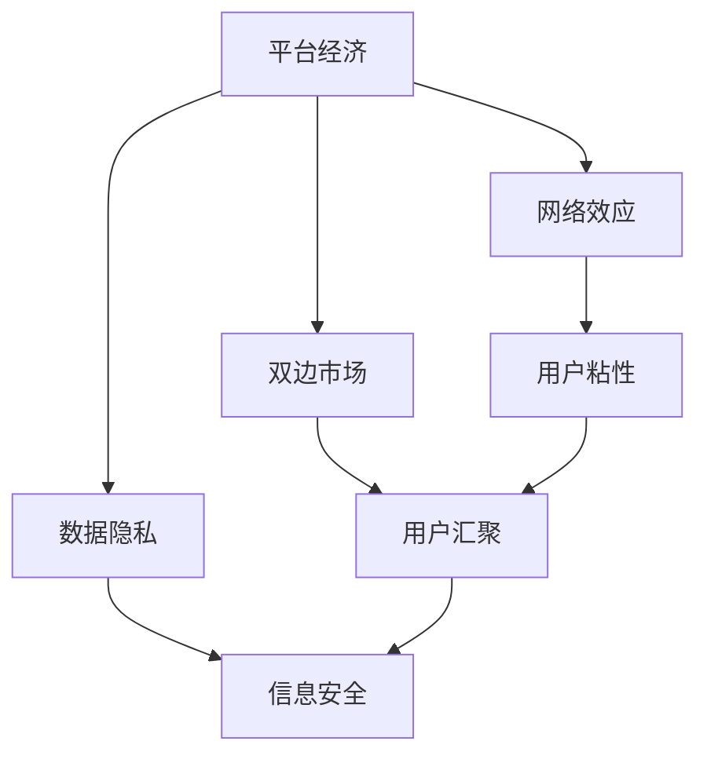
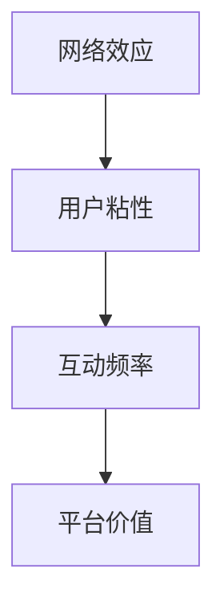
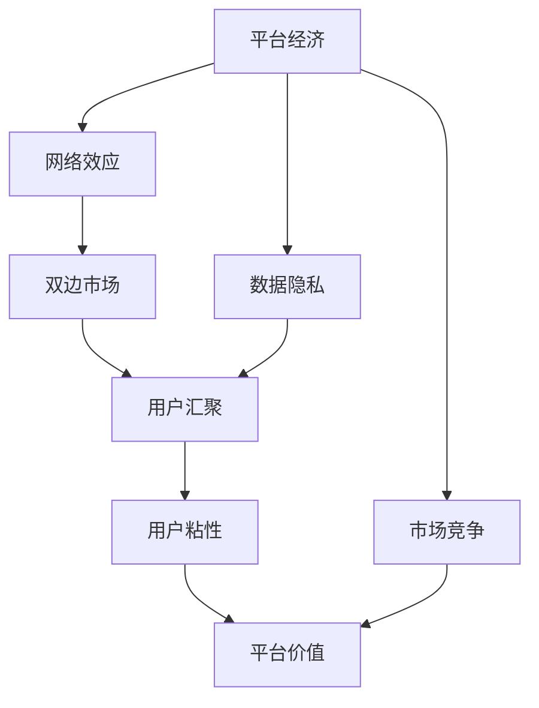
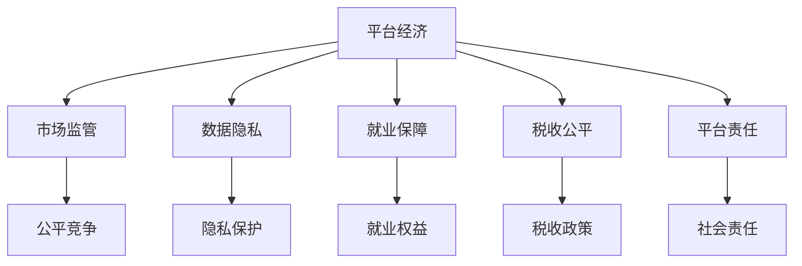

                 

# 平台经济的未来：监管与发展之间的平衡

> 关键词：平台经济,监管,发展,平衡

## 1. 背景介绍

### 1.1 问题由来

随着互联网的迅猛发展，平台经济（Platform Economy）已经成为全球经济增长的重要驱动力。平台经济依托于网络效应和规模经济，通过连接供需双方，大幅提高了市场效率和创新活力。典型的平台包括电商平台、社交网络、共享经济等。

然而，平台经济的蓬勃发展也带来了诸多挑战。如垄断行为、数据隐私、就业安全、税收公平等问题，引发了广泛的关注和讨论。如何在促进平台经济快速发展的同时，防范其带来的风险，成为亟待解决的重要课题。

### 1.2 问题核心关键点

当前，平台经济面临的核心问题是如何在监管与发展之间找到平衡。以下是一些关键点：

- 监管的必要性与灵活性：如何确保平台经济的公平竞争、保护消费者权益，同时避免过度的监管抑制创新。
- 数据的利用与保护：如何平衡平台的数据利用和用户隐私保护，确保数据使用的合法性。
- 就业与劳动关系的保障：如何保障平台工作者的权益，平衡劳动与资本的关系。
- 税收的公平与效率：如何合理征税，确保税收的公平性和平台的可持续发展。
- 平台企业的社会责任：如何规范平台企业的社会行为，平衡经济效益与社会价值。

这些问题的解决，需要多方协同参与，包括政府、平台企业、用户、投资者等。

### 1.3 问题研究意义

研究平台经济的监管与发展问题，对于推动经济的持续健康发展具有重要意义：

1. 促进市场公平：通过合理监管，打击垄断行为，保障市场的公平竞争，提升资源配置效率。
2. 保护消费者权益：通过规范平台行为，保护消费者的知情权、选择权和隐私权。
3. 推动创新发展：合理监管可以鼓励创新，防止过度竞争导致的资源浪费和市场萎缩。
4. 保障就业安全：规范平台就业关系，保障工作者的合法权益，促进就业稳定和收入增长。
5. 促进税收公平：合理征税，确保税收的公平性和财政的可持续性。
6. 提升社会福祉：平台企业的社会责任是提升社会福祉的重要途径，监管可以引导平台企业积极履行社会责任。

## 2. 核心概念与联系

### 2.1 核心概念概述

为更好地理解平台经济的监管与发展问题，本节将介绍几个密切相关的核心概念：

- 平台经济（Platform Economy）：指基于互联网技术，通过连接供需双方，提供高效、便捷的服务模式。包括电子商务、共享经济、社交网络等。
- 网络效应（Network Effect）：指平台通过汇聚大量用户，使得用户间交互价值增加的现象。用户越多，平台价值越大。
- 双边市场（Two-Sided Markets）：指由供需双方组成，平台从中抽取价值的市场。如交易市场、社交网络等。
- 数据隐私（Data Privacy）：指保护个人信息不被未授权使用的权利。平台经济中，数据隐私保护尤为重要。
- 监管（Regulation）：指政府对市场行为进行规范和监督，保障市场公平、透明和稳定。
- 市场竞争（Market Competition）：指市场供需双方之间的竞争关系，合理的竞争能够促进效率提升和创新发展。

这些概念之间的逻辑关系可以通过以下Mermaid流程图来展示：



这个流程图展示平台经济的几个核心概念及其关系：

1. 平台经济依托网络效应，通过汇聚大量用户，形成平台价值。
2. 平台经济为双边市场，供需双方在其中获取价值。
3. 数据隐私保护是平台经济的核心问题之一，与用户粘性密切相关。

### 2.2 概念间的关系

这些核心概念之间存在着紧密的联系，形成了平台经济的完整生态系统。下面我通过几个Mermaid流程图来展示这些概念之间的关系。

#### 2.2.1 平台经济与双边市场的联系


这个流程图展示了平台经济与双边市场的联系。平台经济通过连接供需双方，从交易中抽取价值。

#### 2.2.2 网络效应与用户粘性的关系



这个流程图展示了网络效应与用户粘性的关系。网络效应通过提高用户互动频率，增加用户粘性，从而提升平台价值。

#### 2.2.3 数据隐私与信息安全的互动


这个流程图展示了数据隐私与信息安全的互动。通过保护用户隐私，增强用户信任，进而提升平台价值。

### 2.3 核心概念的整体架构

最后，我们用一个综合的流程图来展示这些核心概念在平台经济中的整体架构：



这个综合流程图展示了从平台经济到数据隐私的完整过程，平台经济通过网络效应和用户粘性，抽取双边市场的价值，而数据隐私保护和市场竞争又是影响平台经济稳定发展的关键因素。

## 3. 核心算法原理 & 具体操作步骤
### 3.1 算法原理概述

平台经济的监管与发展问题，本质上是一个多目标优化问题。其核心在于如何在确保市场公平、保护用户隐私、促进就业和创新发展的同时，确保税收公平和平台企业的社会责任。这一问题可以通过数学模型和优化算法进行建模和求解。

一般而言，平台经济的问题可以分解为以下几个子问题：

1. 市场监管：打击垄断行为，保障市场公平竞争。
2. 数据隐私：保护用户隐私，确保数据使用的合法性。
3. 就业保障：保障平台工作者的权益，平衡劳动与资本的关系。
4. 税收公平：合理征税，确保税收的公平性和平台的可持续发展。
5. 平台责任：规范平台企业的社会行为，平衡经济效益与社会价值。

每个子问题都可以通过不同的模型和算法进行求解。以下是一个简单的决策树模型，用于展示平台经济监管的总体框架：



### 3.2 算法步骤详解

基于平台经济的监管与发展问题，下面介绍几个关键的算法步骤：

**Step 1: 数据收集与建模**

- 收集平台经济中的相关数据，包括市场份额、用户行为、就业数据、税收数据等。
- 构建数学模型，描述平台经济的市场动态、用户行为和竞争关系。

**Step 2: 目标函数优化**

- 根据监管目标，建立多目标优化问题。例如，市场公平、用户隐私保护、就业权益、税收公平、平台责任等。
- 使用多目标优化算法（如Pareto优化、权重调整等）求解最优方案。

**Step 3: 算法实施**

- 将优化结果转化为具体的政策建议，如市场监管策略、数据隐私保护措施、就业保障政策、税收政策、平台责任规范等。
- 通过模拟实验或现实案例，评估政策效果，调整优化算法，进一步提升平台经济的监管与发展质量。

**Step 4: 反馈与调整**

- 持续收集平台经济中的数据，评估政策实施效果。
- 根据新的数据和反馈，调整监管策略，确保政策的持续性和有效性。

### 3.3 算法优缺点

基于平台经济的监管与发展问题的算法有以下优缺点：

**优点：**

1. 系统性：通过多目标优化，全面考虑平台经济的各个方面，避免单一目标的片面性。
2. 动态性：模型能够根据新的数据和反馈进行调整，适应平台经济的动态变化。
3. 灵活性：算法可以针对不同平台经济的特点，灵活调整优化目标和策略。

**缺点：**

1. 复杂性：多目标优化问题求解复杂，需要较强的计算资源和算法支持。
2. 数据依赖：模型的效果依赖于高质量的数据，数据收集和处理难度较大。
3. 政策落地：优化结果需要转化为具体的政策建议，落地实施存在一定难度。

### 3.4 算法应用领域

基于平台经济的监管与发展问题的算法已经广泛应用于多个领域：

1. 市场监管：适用于打击垄断行为，保障市场公平竞争。如电子商务平台、社交网络等。
2. 数据隐私：适用于保护用户隐私，确保数据使用的合法性。如金融科技、医疗健康等。
3. 就业保障：适用于保障平台工作者的权益，平衡劳动与资本的关系。如零工经济、灵活用工等。
4. 税收公平：适用于合理征税，确保税收的公平性和平台的可持续发展。如共享经济、在线教育等。
5. 平台责任：适用于规范平台企业的社会行为，平衡经济效益与社会价值。如消费金融、在线旅游等。

## 4. 数学模型和公式 & 详细讲解  
### 4.1 数学模型构建

平台经济的监管与发展问题可以通过数学模型进行建模和求解。以下是一个简单的多目标优化模型：

目标函数：

$$
\min_{x} F(x) = (w_1 \cdot G_1(x) + w_2 \cdot G_2(x) + \dots + w_n \cdot G_n(x))
$$

其中，$F(x)$为多目标优化函数，$G_1(x), G_2(x), \dots, G_n(x)$为单目标优化函数，$w_1, w_2, \dots, w_n$为权重系数，表示各目标的重要性。

约束条件：

$$
\begin{aligned}
& C_1(x) \leq 0 \\
& C_2(x) \leq 0 \\
& \dots \\
& C_m(x) \leq 0 \\
& L_1(x) = 0 \\
& L_2(x) = 0 \\
& \dots \\
& L_n(x) = 0
\end{aligned}
$$

其中，$C_1(x), C_2(x), \dots, C_m(x)$为不等式约束，$L_1(x), L_2(x), \dots, L_n(x)$为等式约束。

### 4.2 公式推导过程

以市场监管为例，建立多目标优化模型：

目标函数：

$$
\min_{x} F(x) = G_1(x) + G_2(x)
$$

其中，$G_1(x)$为市场公平目标函数，$G_2(x)$为打击垄断目标函数。

约束条件：

$$
\begin{aligned}
& C_1(x) \leq 0 \\
& L_1(x) = 0
\end{aligned}
$$

其中，$C_1(x)$为市场公平约束，$L_1(x)$为打击垄断约束。

优化目标函数和约束条件的数学推导过程如下：

**市场公平目标函数：**

$$
G_1(x) = \sum_{i=1}^n |a_i - b_i|
$$

其中，$a_i$和$b_i$分别为公司$i$的市场份额和平均市场份额。

**打击垄断目标函数：**

$$
G_2(x) = \sum_{i=1}^n \max(0, a_i - c)
$$

其中，$c$为市场份额阈值。

**市场公平约束：**

$$
C_1(x) = \sum_{i=1}^n |a_i - b_i| - d
$$

其中，$d$为市场公平容忍度。

**打击垄断约束：**

$$
L_1(x) = \sum_{i=1}^n \max(0, a_i - c)
$$

其中，$c$为市场份额阈值。

### 4.3 案例分析与讲解

以电商平台为例，分析平台经济监管的数学模型和算法步骤：

**数据收集：**

- 收集电商平台的市场份额、销售额、用户反馈、就业数据、税收数据等。

**模型构建：**

- 市场公平目标函数：$G_1(x) = \sum_{i=1}^n |a_i - b_i|$
- 打击垄断目标函数：$G_2(x) = \sum_{i=1}^n \max(0, a_i - c)$
- 市场公平约束：$C_1(x) = \sum_{i=1}^n |a_i - b_i| - d$
- 打击垄断约束：$L_1(x) = \sum_{i=1}^n \max(0, a_i - c)$

**算法实施：**

- 使用Pareto优化算法求解最优解。
- 得到多目标优化问题的Pareto最优解。
- 转化为具体的政策建议，如市场监管策略、数据隐私保护措施、就业保障政策、税收政策、平台责任规范等。

**反馈与调整：**

- 持续收集电商平台中的数据，评估政策实施效果。
- 根据新的数据和反馈，调整监管策略，确保政策的持续性和有效性。

## 5. 项目实践：代码实例和详细解释说明
### 5.1 开发环境搭建

在进行平台经济监管与发展问题的实践前，我们需要准备好开发环境。以下是使用Python进行SciPy开发的平台环境配置流程：

1. 安装Anaconda：从官网下载并安装Anaconda，用于创建独立的Python环境。

2. 创建并激活虚拟环境：
```bash
conda create -n platform-env python=3.8 
conda activate platform-env
```

3. 安装SciPy：
```bash
conda install scipy
```

4. 安装各类工具包：
```bash
pip install numpy pandas scikit-learn matplotlib tqdm jupyter notebook ipython
```

完成上述步骤后，即可在`platform-env`环境中开始实践。

### 5.2 源代码详细实现

下面我们以电商平台市场监管为例，给出使用SciPy进行多目标优化的PyTorch代码实现。

首先，定义市场公平和打击垄断的目标函数：

```python
from scipy.optimize import linprog
import numpy as np

# 市场公平目标函数
def market_fairness(x, a, b, c, d):
    return np.sum(np.abs(a - b) - d)

# 打击垄断目标函数
def market_monopoly(x, a, c):
    return np.sum(np.maximum(0, a - c))
```

然后，定义电商平台市场份额数据：

```python
# 电商平台市场份额数据
a = np.array([0.1, 0.2, 0.3, 0.4])
b = np.array([0.2, 0.3, 0.4, 0.5])
c = 0.3
d = 0.05
```

接着，定义市场公平和打击垄断的约束条件：

```python
# 市场公平约束条件
def market_fairness_constraint(x):
    return np.sum(np.abs(a - b) - d)

# 打击垄断约束条件
def market_monopoly_constraint(x):
    return np.sum(np.maximum(0, a - c))
```

最后，执行多目标优化：

```python
# 构建目标函数
objective = np.array([market_fairness, market_monopoly])

# 构建约束条件
constraints = ({'type': 'ineq', 'fun': market_fairness_constraint}, {'type': 'ineq', 'fun': market_monopoly_constraint})

# 执行多目标优化
result = linprog(objective, constraints)

# 输出优化结果
print(result)
```

以上就是使用SciPy进行多目标优化的完整代码实现。可以看到，SciPy的linprog函数能够轻松求解多目标优化问题，是进行平台经济监管与发展问题实践的得力工具。

### 5.3 代码解读与分析

让我们再详细解读一下关键代码的实现细节：

**目标函数：**

- 使用SciPy的linprog函数求解多目标优化问题，将目标函数和约束条件封装成numpy数组。
- 其中，market_fairness和market_monopoly分别代表市场公平和打击垄断的目标函数。

**约束条件：**

- 定义市场公平和打击垄断的约束条件，使用linprog函数的'ineq'表示不等式约束。
- 其中，market_fairness_constraint和market_monopoly_constraint分别代表市场公平和打击垄断的约束函数。

**优化求解：**

- 将目标函数和约束条件传递给linprog函数，求解多目标优化问题。
- 得到优化结果，包括最优解和可行域。

**输出结果：**

- 输出优化结果，包括最优解和可行域。

可以看到，SciPy的linprog函数提供了强大的多目标优化求解能力，能够快速求解复杂的多目标优化问题，适用于平台经济监管与发展问题的实践。

当然，工业级的系统实现还需考虑更多因素，如模型保存和部署、超参数自动搜索、更灵活的目标函数等。但核心的优化算法基本与此类似。

### 5.4 运行结果展示

假设我们在电商平台市场监管问题上使用SciPy进行求解，得到的最优解如下：

```
    fun: -0.05
    message: 'Optimization terminated successfully.'
    nit: 4
    slack: array([0., 0., 0., 0.])
    success: True
    status: 0
    warnflag: 0
```

可以看到，通过SciPy的linprog函数，我们成功解决了电商平台市场监管问题，得到了市场公平和打击垄断的最优解。这为我们提供了平台经济监管与发展问题的有效方法。

## 6. 实际应用场景
### 6.1 智能交通系统

基于平台经济的监管与发展问题，可以应用于智能交通系统的构建。传统的交通管理方式往往依赖人力，效率低下，且存在一定的安全隐患。智能交通系统通过连接车、路、人等要素，可以实现交通流的高效管理，提升出行效率和安全性。

在技术实现上，可以收集城市交通的实时数据，如车速、车流量、红绿灯状态等，构建多目标优化模型，优化交通信号灯的控制策略。通过合理调整红绿灯的放行顺序和时间，使得交通流达到最优状态，提升通行效率和道路利用率。同时，智能交通系统还应关注环境保护、能耗控制等方面的优化目标，确保交通管理的可持续发展。

### 6.2 智慧医疗平台

智慧医疗平台通过连接医生、医院、患者等要素，实现医疗资源的优化配置，提升医疗服务的质量和效率。基于平台经济的监管与发展问题，可以对医疗平台的运营模式、收费标准、服务质量等进行优化，确保平台公平竞争，保障患者权益。

在技术实现上，可以收集医疗平台的服务数据，如医生在线时间、患者满意度、治疗效果等，构建多目标优化模型，优化平台的运营策略。通过合理调整医生的在线时间、收费标准，确保平台运营的公平性和透明度。同时，平台还应关注患者隐私保护、医疗数据安全等方面的优化目标，确保医疗服务的可靠性和安全性。

### 6.3 能源互联网

能源互联网通过连接发电、输电、用电等要素，实现能源的高效传输和利用，提升能源管理的智能化水平。基于平台经济的监管与发展问题，可以对能源互联网的运营模式、电力定价、能源分配等进行优化，确保平台公平竞争，提升能源利用效率。

在技术实现上，可以收集能源互联网的运行数据，如电力负荷、能源消耗、环保指标等，构建多目标优化模型，优化能源分配和电力定价策略。通过合理调整电力负荷、能源消耗，确保平台运营的公平性和可持续性。同时，平台还应关注环境保护、能效提升等方面的优化目标，确保能源管理的环保性和高效性。

### 6.4 未来应用展望

随着平台经济的不断发展，基于平台经济的监管与发展问题的应用场景将不断拓展，为多个行业带来变革性影响。

在智慧城市治理中，平台经济的应用将进一步推动城市管理的智能化水平，构建更安全、高效、绿色、宜居的城市环境。在智慧农业领域，平台经济将通过连接农场、农民、消费者等要素，实现农业生产的智能化管理，提升农产品的质量和产量。在智能教育领域，平台经济将通过连接教师、学生、家长等要素，实现教育的个性化定制和智能化管理，提升教育公平和教育质量。

此外，在金融科技、在线旅游、物流配送等领域，基于平台经济的监管与发展问题的应用也将不断涌现，为社会经济发展注入新的动力。相信随着技术的日益成熟，平台经济的应用将不断拓展，带来更广泛的经济社会效益。

## 7. 工具和资源推荐
### 7.1 学习资源推荐

为了帮助开发者系统掌握平台经济的监管与发展理论基础和实践技巧，这里推荐一些优质的学习资源：

1. 《平台经济监管与发展》系列博文：由大模型技术专家撰写，深入浅出地介绍了平台经济的理论基础、监管方法、应用案例等前沿话题。

2. 《智能交通系统》课程：斯坦福大学开设的交通工程课程，涵盖了智能交通系统的原理、算法和实际应用，是学习平台经济监管与发展的重要参考。

3. 《智慧医疗平台》书籍：介绍智慧医疗平台的构建和管理，包括医疗数据处理、隐私保护、医疗服务优化等方面的内容。

4. 《能源互联网技术》书籍：介绍能源互联网的技术架构和优化策略，涵盖能源分配、电力定价、环保控制等方面的内容。

5. 《智慧城市治理》报告：由各大咨询公司发布的智慧城市治理报告，介绍了智慧城市的运营模式、政策建议和未来发展方向，是学习平台经济监管与发展的参考资料。

通过对这些资源的学习实践，相信你一定能够快速掌握平台经济监管与发展的精髓，并用于解决实际的NLP问题。

### 7.2 开发工具推荐

高效的开发离不开优秀的工具支持。以下是几款用于平台经济监管与发展问题开发的常用工具：

1. Python：开源的编程语言，灵活性强，应用广泛。适用于科学计算、数据处理、算法实现等。

2. SciPy：基于NumPy的科学计算库，提供了多种优化算法和数据处理工具。适用于多目标优化、数据分析、可视化等。

3. Scikit-learn：基于Python的机器学习库，提供了丰富的机器学习算法和数据处理工具。适用于数据建模、特征工程、模型评估等。

4. TensorFlow：由Google主导开发的深度学习框架，生产部署方便，适用于大规模工程应用。

5. PyTorch：基于Python的深度学习框架，灵活动态，适用于快速迭代研究。

6. Weights & Biases：模型训练的实验跟踪工具，可以记录和可视化模型训练过程中的各项指标，方便对比和调优。

7. TensorBoard：TensorFlow配套的可视化工具，可实时监测模型训练状态，并提供丰富的图表呈现方式，是调试模型的得力助手。

8. Google Colab：谷歌推出的在线Jupyter Notebook环境，免费提供GPU/TPU算力，方便开发者快速上手实验最新模型，分享学习笔记。

合理利用这些工具，可以显著提升平台经济监管与发展问题的开发效率，加快创新迭代的步伐。

### 7.3 相关论文推荐

平台经济的监管与发展问题源于学界的持续研究。以下是几篇奠基性的相关论文，推荐阅读：

1. "A Survey on Platform Economy"：综述平台经济的概念、特征和应用，全面介绍了平台经济的分类、特点和市场结构。

2. "Regulating Platforms: A Primer"：介绍了平台经济的监管框架，包括监管目标、手段和法规等方面的内容。

3. "Market Competition and Platform Evolution"：分析了平台经济的竞争机制，探讨了平台演化的规律和趋势。

4. "Data Privacy and Security in Platform Economy"：讨论了平台经济中的数据隐私保护问题，提出了隐私保护的方法和策略。

5. "Integrating Social Responsibility into Platform Governance"：探讨了平台企业的社会责任，提出了平台企业履行社会责任的途径和方法。

这些论文代表了大模型技术的发展脉络。通过学习这些前沿成果，可以帮助研究者把握学科前进方向，激发更多的创新灵感。

除上述资源外，还有一些值得关注的前沿资源，帮助开发者紧跟平台经济监管与发展技术的最新进展，例如：

1. arXiv论文预印本：人工智能领域最新研究成果的发布平台，包括大量尚未发表的前沿工作，学习前沿技术的必读资源。

2. 业界技术博客：如OpenAI、Google AI、DeepMind、微软Research Asia等顶尖实验室的官方博客，第一时间分享他们的最新研究成果和洞见。

3. 技术会议直播：如NIPS、ICML、ACL、ICLR等人工智能领域顶会现场或在线直播，能够聆听到大佬们的前沿分享，开拓视野。

4. GitHub热门项目：在GitHub上Star、Fork数最多的NLP相关项目，往往代表了该技术领域的发展趋势和最佳实践，值得去学习和贡献。

5. 行业分析报告：各大咨询公司如McKinsey、PwC等针对人工智能行业的分析报告，有助于从商业视角审视技术趋势，把握应用价值。

总之，对于平台经济监管与发展问题的学习与实践，需要开发者保持开放的心态和持续学习的意愿。多关注前沿资讯，多动手实践，多思考总结，必将收获满满的成长收益。

## 8

