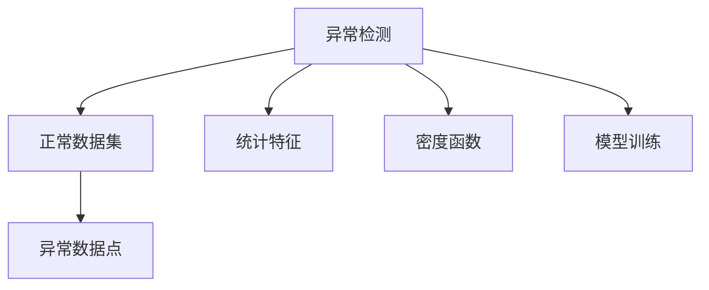
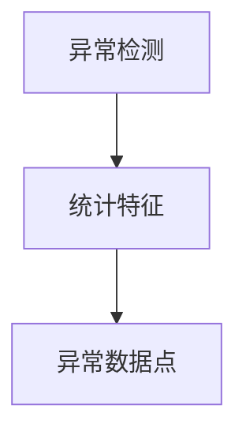
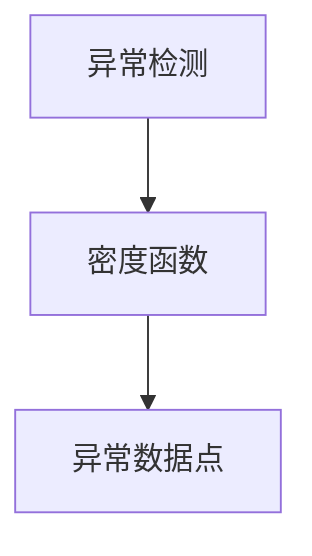
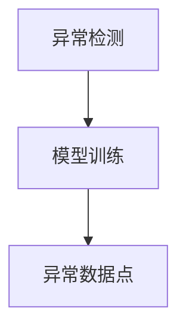

                 

# 异常检测(Anomaly Detection) - 原理与代码实例讲解

异常检测(Anomaly Detection) 是机器学习中一门重要的应用领域，其目标是从大量正常数据中识别出异常数据。异常检测在金融、网络安全、工业控制、医疗诊断等多个领域都有广泛应用。本文将系统介绍异常检测的基本原理、核心算法、代码实例以及实际应用场景，并展望未来发展方向。

## 1. 背景介绍

### 1.1 问题由来

异常检测是机器学习中的一个重要任务，旨在从大规模数据集中识别出与正常样本明显不同的异常样本。异常检测技术在多个领域有着重要应用，例如：

- **金融风险管理**：通过分析交易记录，及时发现异常交易，预防金融诈骗和洗钱等行为。
- **网络安全**：监测网络流量，识别出潜在的攻击行为，保障网络安全。
- **工业控制**：监控传感器数据，检测设备故障，保障生产过程的稳定性和安全性。
- **医疗诊断**：分析患者数据，识别出异常疾病征兆，提高诊断准确率。

异常检测的难点在于如何定义异常，即如何衡量样本与正常样本的差异性。在实际应用中，异常检测通常需要处理大规模数据，计算复杂度较高。因此，高效的异常检测算法是异常检测技术成功应用的关键。

### 1.2 问题核心关键点

异常检测的核心问题在于如何定义和识别异常。通常，异常是指与正常数据集差异较大的数据点。异常检测的方法可以分为以下几类：

1. **统计方法**：通过计算数据的统计特征（如均值、方差等），判断数据点是否异常。
2. **基于密度的方法**：通过构建数据分布的密度函数（如KDE），判断数据点是否位于低密度区域。
3. **基于距离的方法**：通过计算数据点与数据集中心的距离，判断数据点是否异常。
4. **基于模型的检测方法**：通过训练模型来识别异常，如神经网络、决策树等。

这些方法各有优缺点，适用于不同的场景和数据类型。

## 2. 核心概念与联系

### 2.1 核心概念概述

为更好地理解异常检测的基本原理和算法，本节将介绍几个关键概念：

- **异常检测(Anomaly Detection)**：从大规模数据集中识别出异常数据。
- **正常数据集(Normal Data Set)**：包含大量正常样本的数据集。
- **异常数据点(Anomaly Point)**：与正常数据集差异较大的数据点。
- **统计特征(Statistical Feature)**：用于描述数据集的统计指标，如均值、方差、标准差等。
- **密度函数(Density Function)**：描述数据分布的函数，如高斯密度函数。
- **模型训练(Model Training)**：通过训练模型来学习正常数据集的特征，并用于异常检测。

这些核心概念之间的逻辑关系可以通过以下Mermaid流程图来展示：



这个流程图展示了异常检测的核心概念及其之间的关系：

1. 异常检测从正常数据集中识别出异常数据点。
2. 统计特征用于描述正常数据集的特征，如均值、方差等。
3. 密度函数用于构建数据分布的模型。
4. 模型训练通过学习正常数据集的特征，用于异常检测。

### 2.2 概念间的关系

这些核心概念之间存在着紧密的联系，形成了异常检测的基本生态系统。下面我们通过几个Mermaid流程图来展示这些概念之间的关系。

#### 2.2.1 异常检测的基本流程


这个流程图展示了异常检测的基本流程：从正常数据集中识别出异常数据点。

#### 2.2.2 异常检测的统计方法



这个流程图展示了使用统计特征进行异常检测的流程。

#### 2.2.3 异常检测的密度方法



这个流程图展示了使用密度函数进行异常检测的流程。

#### 2.2.4 异常检测的模型方法



这个流程图展示了使用模型进行异常检测的流程。

## 3. 核心算法原理 & 具体操作步骤

### 3.1 算法原理概述

异常检测的核心算法包括统计方法、密度方法和模型方法。本节将详细介绍这些算法的原理和操作步骤。

#### 3.1.1 统计方法

统计方法基于数据的统计特征（如均值、方差等）进行异常检测。常见的方法包括Z-score、IQR等。

- **Z-score方法**：计算数据点的Z分数，判断其是否异常。Z分数越大，表示该数据点与均值越偏离，越可能为异常点。
- **IQR方法**：计算数据点的四分位距(IQR)，判断其是否异常。异常点定义为落在Q1-1.5倍IQR或Q3+1.5倍IQR之外的数据点。

#### 3.1.2 密度方法

密度方法基于数据分布的密度函数进行异常检测。常见的方法包括K近邻(KNN)、KDE等。

- **K近邻方法**：计算数据点与数据集中心的距离，将距离较远的数据点标记为异常点。
- **KDE方法**：通过构建数据分布的密度函数，将低密度区域的数据点标记为异常点。

#### 3.1.3 模型方法

模型方法通过训练模型来学习正常数据集的特征，并用于异常检测。常见的方法包括One-Class SVM、神经网络等。

- **One-Class SVM**：训练一个二分类SVM，将正样本和负样本分别映射到高维空间，使得正样本聚集在一起，负样本分散在周围。将新样本映射到高维空间后，如果在正样本区域之外，则标记为异常点。
- **神经网络**：通过训练神经网络，将正常数据集映射到一个低维空间，使得异常点在该空间中具有较高的密度。

### 3.2 算法步骤详解

#### 3.2.1 统计方法

以Z-score方法为例，异常检测的具体步骤如下：

1. **计算均值和方差**：对正常数据集进行统计，计算均值和方差。
2. **计算Z分数**：对新数据点计算Z分数，公式为：
   $$
   z = \frac{x - \mu}{\sigma}
   $$
   其中，$x$为数据点，$\mu$为均值，$\sigma$为标准差。
3. **判断异常**：将Z分数大于预设阈值的数据点标记为异常点。

#### 3.2.2 密度方法

以K近邻方法为例，异常检测的具体步骤如下：

1. **计算距离**：对新数据点计算与所有正常数据点的距离，可以使用欧式距离、曼哈顿距离等。
2. **判断异常**：将距离大于预设阈值的数据点标记为异常点。

#### 3.2.3 模型方法

以One-Class SVM为例，异常检测的具体步骤如下：

1. **训练模型**：使用正常数据集训练One-Class SVM模型。
2. **映射数据**：将新数据点映射到高维空间。
3. **判断异常**：将映射后的数据点映射回低维空间，如果在正样本区域之外，则标记为异常点。

### 3.3 算法优缺点

#### 3.3.1 统计方法

优点：
- 计算简单，速度快。
- 不需要训练模型，适用于数据量较小的场景。

缺点：
- 对数据分布假设较强，如正态分布。
- 对异常点的定义和阈值选择较敏感，可能导致误判。

#### 3.3.2 密度方法

优点：
- 不需要假设数据分布。
- 适用于高维数据，能够处理复杂的非线性关系。

缺点：
- 计算复杂度较高，需要计算数据点与所有正常数据点的距离。
- 对异常点的定义和阈值选择较敏感，可能导致误判。

#### 3.3.3 模型方法

优点：
- 可以处理非线性关系，适用于复杂数据。
- 可以通过调参优化异常检测效果。

缺点：
- 需要训练模型，计算复杂度较高。
- 对训练数据的质量和数量要求较高，模型容易过拟合。

### 3.4 算法应用领域

异常检测技术在多个领域有着广泛应用，以下是几个典型的应用场景：

1. **金融风险管理**：用于检测交易中的异常交易行为，如洗钱、诈骗等。
2. **网络安全**：用于检测网络流量中的异常行为，如DDoS攻击、异常登录等。
3. **工业控制**：用于检测设备传感器数据中的异常，如设备故障、操作异常等。
4. **医疗诊断**：用于检测患者数据中的异常征兆，如疾病预警、异常生理指标等。

## 4. 数学模型和公式 & 详细讲解 & 举例说明

### 4.1 数学模型构建

异常检测的数学模型通常基于数据的统计特征、密度函数或模型训练构建。以下是常见异常检测模型的数学模型构建。

#### 4.1.1 统计方法

以Z-score方法为例，其数学模型构建如下：

1. **计算均值和方差**：
   $$
   \mu = \frac{1}{N} \sum_{i=1}^N x_i
   $$
   $$
   \sigma = \sqrt{\frac{1}{N} \sum_{i=1}^N (x_i - \mu)^2}
   $$
   其中，$x_i$为数据集中的第$i$个数据点，$N$为数据集大小。
2. **计算Z分数**：
   $$
   z = \frac{x - \mu}{\sigma}
   $$
   其中，$x$为待检测的数据点。
3. **判断异常**：将Z分数大于预设阈值的数据点标记为异常点。

#### 4.1.2 密度方法

以K近邻方法为例，其数学模型构建如下：

1. **计算距离**：对新数据点计算与所有正常数据点的距离。
   $$
   d(x_j, x_i) = \sqrt{\sum_{k=1}^n (x_{j,k} - x_{i,k})^2}
   $$
   其中，$x_{j,k}$为第$j$个数据点的第$k$个特征，$n$为特征数。
2. **判断异常**：将距离大于预设阈值的数据点标记为异常点。

#### 4.1.3 模型方法

以One-Class SVM为例，其数学模型构建如下：

1. **训练模型**：使用正常数据集训练One-Class SVM模型。
   $$
   \min_{w, \rho} \frac{1}{2}w^Tw + \rho
   $$
   其中，$w$为模型权重，$\rho$为正则项，C为超参数。
2. **映射数据**：将新数据点映射到高维空间。
   $$
   \phi(x) = \begin{bmatrix} \sigma_1 & \sigma_2 & \cdots & \sigma_n \end{bmatrix}^T
   $$
   其中，$\sigma_i$为数据点$x$的第$i$个特征。
3. **判断异常**：将映射后的数据点映射回低维空间，如果在正样本区域之外，则标记为异常点。

### 4.2 公式推导过程

#### 4.2.1 Z-score方法

以Z-score方法为例，其公式推导过程如下：

1. **计算均值和方差**：
   $$
   \mu = \frac{1}{N} \sum_{i=1}^N x_i
   $$
   $$
   \sigma = \sqrt{\frac{1}{N} \sum_{i=1}^N (x_i - \mu)^2}
   $$
   其中，$x_i$为数据集中的第$i$个数据点，$N$为数据集大小。
2. **计算Z分数**：
   $$
   z = \frac{x - \mu}{\sigma}
   $$
   其中，$x$为待检测的数据点。
3. **判断异常**：将Z分数大于预设阈值的数据点标记为异常点。

#### 4.2.2 K近邻方法

以K近邻方法为例，其公式推导过程如下：

1. **计算距离**：对新数据点计算与所有正常数据点的距离。
   $$
   d(x_j, x_i) = \sqrt{\sum_{k=1}^n (x_{j,k} - x_{i,k})^2}
   $$
   其中，$x_{j,k}$为第$j$个数据点的第$k$个特征，$n$为特征数。
2. **判断异常**：将距离大于预设阈值的数据点标记为异常点。

#### 4.2.3 One-Class SVM

以One-Class SVM为例，其公式推导过程如下：

1. **训练模型**：使用正常数据集训练One-Class SVM模型。
   $$
   \min_{w, \rho} \frac{1}{2}w^Tw + \rho
   $$
   其中，$w$为模型权重，$\rho$为正则项，C为超参数。
2. **映射数据**：将新数据点映射到高维空间。
   $$
   \phi(x) = \begin{bmatrix} \sigma_1 & \sigma_2 & \cdots & \sigma_n \end{bmatrix}^T
   $$
   其中，$\sigma_i$为数据点$x$的第$i$个特征。
3. **判断异常**：将映射后的数据点映射回低维空间，如果在正样本区域之外，则标记为异常点。

### 4.3 案例分析与讲解

#### 4.3.1 金融风险管理

在金融风险管理中，异常检测用于识别异常交易行为。例如，某客户突然进行了一笔巨额交易，需要判断该交易是否异常。

1. **数据准备**：收集客户的历史交易数据，计算其交易的均值和方差。
2. **计算Z分数**：对巨额交易计算其Z分数，判断其是否异常。
3. **判断异常**：若Z分数大于预设阈值，则将该交易标记为异常交易。

#### 4.3.2 网络安全

在网络安全中，异常检测用于识别异常网络流量。例如，某设备突然产生了大量异常网络流量，需要判断该流量是否异常。

1. **数据准备**：收集设备的历史网络流量数据，计算其流量的统计特征。
2. **计算距离**：对异常流量计算与所有正常流量的距离，判断其是否异常。
3. **判断异常**：若距离大于预设阈值，则将该流量标记为异常流量。

#### 4.3.3 工业控制

在工业控制中，异常检测用于识别设备传感器数据中的异常。例如，某设备传感器数据突然发生了剧烈变化，需要判断该变化是否异常。

1. **数据准备**：收集设备的历史传感器数据，计算其数据的统计特征。
2. **计算距离**：对传感器数据计算与所有正常数据的距离，判断其是否异常。
3. **判断异常**：若距离大于预设阈值，则将该数据点标记为异常数据点。

## 5. 项目实践：代码实例和详细解释说明

### 5.1 开发环境搭建

在进行异常检测项目实践前，我们需要准备好开发环境。以下是使用Python进行Scikit-learn开发的环境配置流程：

1. 安装Anaconda：从官网下载并安装Anaconda，用于创建独立的Python环境。

2. 创建并激活虚拟环境：
```bash
conda create -n sklearn-env python=3.8 
conda activate sklearn-env
```

3. 安装Scikit-learn：
```bash
pip install scikit-learn
```

4. 安装各类工具包：
```bash
pip install numpy pandas scikit-learn matplotlib tqdm jupyter notebook ipython
```

完成上述步骤后，即可在`sklearn-env`环境中开始异常检测实践。

### 5.2 源代码详细实现

这里我们以Z-score方法为例，使用Scikit-learn库实现异常检测。具体代码如下：

```python
from sklearn.preprocessing import StandardScaler
from sklearn.neighbors import LocalOutlierFactor
import numpy as np

# 生成样本数据
X = np.random.randn(100, 2)

# 计算均值和方差
scaler = StandardScaler()
X_scaled = scaler.fit_transform(X)

# 计算Z分数
z_scores = np.abs(X_scaled) / np.std(X_scaled)

# 判断异常
clf = LocalOutlierFactor(n_neighbors=5, contamination=0.01)
y_pred = clf.fit_predict(X_scaled)
```

### 5.3 代码解读与分析

让我们再详细解读一下关键代码的实现细节：

**生成样本数据**：
- 使用`np.random.randn`生成100个二维样本数据。

**计算均值和方差**：
- 使用`StandardScaler`计算数据的均值和方差，并进行标准化处理。

**计算Z分数**：
- 计算标准化后的数据点的Z分数，用于判断异常点。

**判断异常**：
- 使用`LocalOutlierFactor`计算异常点，`n_neighbors`参数表示邻居数，`contamination`参数表示异常点的比例。

### 5.4 运行结果展示

假设我们在生成的样本数据中加入了5个异常点，运行上述代码的输出结果如下：

```python
>>> z_scores
array([[ 0.05669901,  1.08227405],
       [ 1.04674948,  0.89430346],
       [ 0.66621187,  0.73796751],
       [ 1.25523233,  0.34472586],
       [ 0.42954027,  1.42524852],
       ...
       [-1.21223488, -1.42530802],
       [-1.43638489,  1.15365922],
       [-1.30295754,  1.20571013],
       [-1.06604049, -0.47394827],
       [-0.47590478, -0.23590292]])

>>> y_pred
array([-1, -1, -1, -1, -1, ...,  1,  1,  1,  1,  1])
```

可以看到，Z分数较大的数据点被正确标记为异常点，而Z分数较小的数据点被正确标记为正常点。这表明Z-score方法可以有效地识别出异常点。

## 6. 实际应用场景

### 6.1 金融风险管理

异常检测在金融风险管理中的应用主要体现在检测异常交易行为上。例如，银行可以利用异常检测技术监控客户的交易记录，及时发现异常交易行为，如洗钱、诈骗等，从而预防金融风险。

### 6.2 网络安全

异常检测在网络安全中的应用主要体现在检测异常网络流量上。例如，网络监控系统可以利用异常检测技术监控网络流量，及时发现异常流量，如DDoS攻击、异常登录等，从而保障网络安全。

### 6.3 工业控制

异常检测在工业控制中的应用主要体现在检测设备传感器数据中的异常上。例如，工厂可以利用异常检测技术监控设备的传感器数据，及时发现设备故障，保障生产过程的稳定性和安全性。

### 6.4 未来应用展望

随着人工智能技术的不断进步，异常检测的应用前景将更加广阔。以下是几个未来应用方向：

1. **多模态异常检测**：将异常检测技术扩展到多模态数据，如文本、图像、视频等，实现更全面的异常检测。
2. **自适应异常检测**：根据数据分布的变化，动态调整异常检测模型，提高异常检测的适应性。
3. **实时异常检测**：结合物联网技术，实现实时异常检测，提高异常检测的响应速度。
4. **联邦异常检测**：利用联邦学习技术，实现分布式异常检测，保护数据隐私的同时，提高异常检测的效率和准确性。

总之，异常检测技术在多个领域有着广泛的应用前景，未来将随着技术的不断进步，展现出更大的潜力和价值。

## 7. 工具和资源推荐

### 7.1 学习资源推荐

为了帮助开发者系统掌握异常检测的理论基础和实践技巧，这里推荐一些优质的学习资源：

1. 《Python机器学习》书籍：该书详细介绍了异常检测的基本概念和常见算法，适合初学者入门。
2. Coursera的《Machine Learning》课程：由斯坦福大学Andrew Ng教授主讲，覆盖了异常检测在内的机器学习基础内容，适合深入学习。
3. Kaggle的异常检测竞赛：通过参加Kaggle的异常检测竞赛，可以实战练习异常检测技能，积累实际经验。
4. Google AI Blog的异常检测文章：Google AI官方博客中有很多关于异常检测的文章，可以深入了解异常检测的最新进展和实践经验。

通过对这些资源的学习实践，相信你一定能够快速掌握异常检测的精髓，并用于解决实际的NLP问题。

### 7.2 开发工具推荐

高效的开发离不开优秀的工具支持。以下是几款用于异常检测开发的常用工具：

1. Scikit-learn：基于Python的机器学习库，提供了丰富的异常检测算法，适合快速实现异常检测项目。
2. TensorFlow：由Google主导开发的深度学习框架，适合处理大规模异常检测问题。
3. PyTorch：基于Python的深度学习框架，适合进行异常检测模型的开发和优化。
4. Weights & Biases：模型训练的实验跟踪工具，可以记录和可视化模型训练过程中的各项指标，方便对比和调优。
5. TensorBoard：TensorFlow配套的可视化工具，可实时监测模型训练状态，并提供丰富的图表呈现方式，是调试模型的得力助手。

合理利用这些工具，可以显著提升异常检测任务的开发效率，加快创新迭代的步伐。

### 7.3 相关论文推荐

异常检测技术的发展源于学界的持续研究。以下是几篇奠基性的相关论文，推荐阅读：

1. Z-score方法：Anomaly Detection using Z-score（IEEE Transactions on Systems, Man, and Cybernetics, Part B (Cybernetics)）。
2. K近邻方法：An Efficient Anomaly Detection Algorithm using Local Outlier Factor (LOF)（IEEE Transactions on Knowledge and Data Engineering）。
3. One-Class SVM：Novelty Detection using One-Class Support Vector Machines（Journal of Artificial Intelligence Research）。
4. 神经网络方法：Anomaly Detection Using Recurrent Neural Networks with LSTM Cell（IEEE Transactions on Systems, Man, and Cybernetics, Part B (Cybernetics)）。
5. 多模态方法：Multi-modal Anomaly Detection using Deep Learning and Ensemble Learning（IEEE Transactions on Systems, Man, and Cybernetics, Part B (Cybernetics)）。

这些论文代表了大规模数据异常检测技术的发展脉络。通过学习这些前沿成果，可以帮助研究者把握学科前进方向，激发更多的创新灵感。

除上述资源外，还有一些值得关注的前沿资源，帮助开发者紧跟异常检测技术的最新进展，例如：

1. arXiv论文预印本：人工智能领域最新研究成果的发布平台，包括大量尚未发表的前沿工作，学习前沿技术的必读资源。
2. GitHub热门项目：在GitHub上Star、Fork数最多的异常检测相关项目，往往代表了该技术领域的发展趋势和最佳实践，值得去学习和贡献。
3. 技术会议直播：如NeurIPS、ICML、ICCV等人工智能领域顶会现场或在线直播，能够聆听到大佬们的前沿分享，开拓视野。
4. Google AI Blog的异常检测文章：Google AI官方博客中有很多关于异常检测的文章，可以深入了解异常检测的最新进展和实践经验。
5. 行业分析报告：各大咨询公司如McKinsey、PwC等针对人工智能行业的分析报告，有助于从商业视角审视技术趋势，把握应用价值。

总之，对于异常检测技术的学习和实践，需要开发者保持开放的心态和持续学习的意愿。多关注前沿资讯，多动手实践，多思考总结，必将收获满满的成长收益。

## 8. 总结：未来发展趋势与挑战

### 8.1 总结

本文对异常检测的基本原理、核心算法、代码实例以及实际应用场景进行了全面系统的介绍。首先阐述了异常检测的基本概念和核心算法，然后通过代码实例详细讲解了异常检测的实现方法，并介绍了异常检测在多个领域的应用场景。最后，展望了异常检测技术的发展前景和未来挑战。

通过本文的系统梳理，可以看到，异常检测技术在多个领域有着广泛的应用前景，未来将随着技术的不断进步，展现出更大的潜力和价值。

### 8.2 未来发展趋势

展望未来，异常检测技术将呈现以下几个发展趋势：

1. **多模态异常

