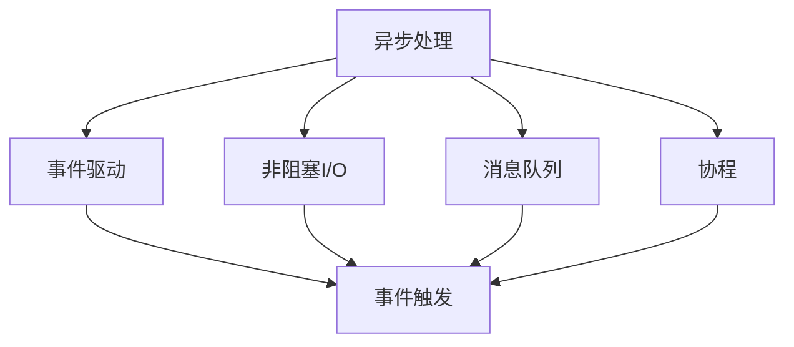
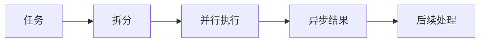
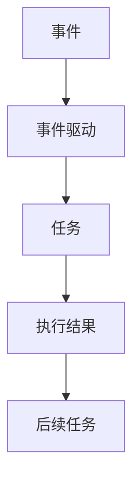
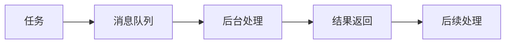
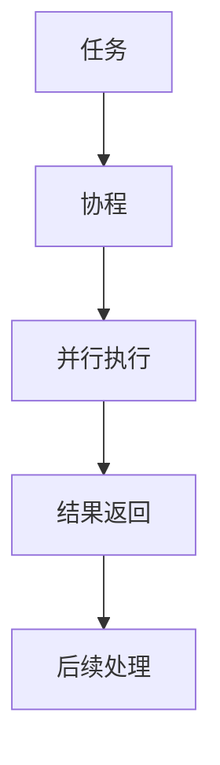
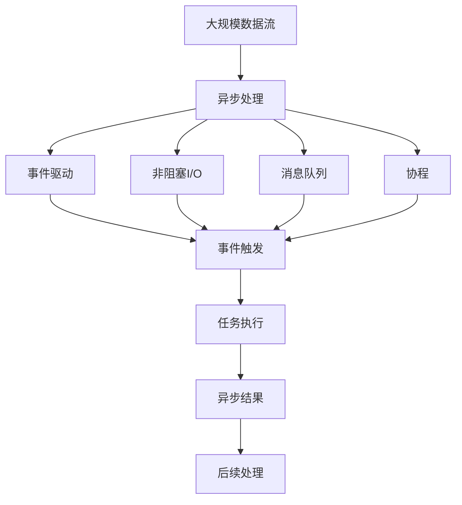

                 

## 1. 背景介绍

### 1.1 问题由来
随着互联网和移动互联网的迅猛发展，全球数据量呈爆炸式增长，传统同步处理方式已经无法满足实时性、高并发等需求。如何提高系统的响应速度、处理效率，成为开发人员面临的重大挑战。异步处理技术的引入，提供了一种高效、可扩展的处理方式，受到业界广泛关注。

### 1.2 问题核心关键点
异步处理技术的核心在于将任务分成多个独立的操作，各操作并行执行，在等待操作完成后再处理后续任务，以此减少系统的整体响应时间，提高系统并发能力。异步处理技术的实现形式多种多样，包括事件驱动、非阻塞I/O、消息队列等。

### 1.3 问题研究意义
异步处理技术是提升系统性能、满足用户高需求的重要手段。采用异步处理，可以显著降低系统的响应时间，提升并发处理能力，满足用户对实时性、可靠性、扩展性等需求。同时，异步处理技术还为系统带来了更加灵活的架构设计，便于后续的持续改进和扩展。

## 2. 核心概念与联系

### 2.1 核心概念概述

为更好地理解异步处理技术，本节将介绍几个密切相关的核心概念：

- 异步处理：一种并行处理技术，通过将任务拆分成多个独立的操作，并行执行这些操作，实现更快的系统响应和更高的并发能力。
- 事件驱动：一种编程范式，基于事件的发生来驱动程序执行。事件可以是用户输入、系统调用、网络请求等。
- 非阻塞I/O：一种I/O操作模式，通过利用事件循环、异步回调等机制，实现数据的异步读写，减少I/O操作的阻塞时间。
- 消息队列：一种通信机制，通过将任务封装成消息的形式，在后台异步处理这些消息，实现任务解耦和异步处理。
- 协程(Coroutine)：一种轻量级线程，通过合作式多任务调度，实现更高效的系统调度和任务管理。

这些核心概念之间通过事件流、消息队列、协程等技术手段相互联系，构成了异步处理技术的完整生态系统。以下是一个简化的异步处理流程图，展示了各概念之间的联系：



### 2.2 概念间的关系

这些核心概念之间存在着紧密的联系，形成了异步处理技术的完整生态系统。下面我们通过几个Mermaid流程图来展示这些概念之间的关系。

#### 2.2.1 异步处理的基本原理



这个流程图展示了异步处理的基本原理。任务通过拆分变成多个独立的操作，并行执行后得到异步结果，最终用于后续处理。

#### 2.2.2 事件驱动与异步处理的关系



这个流程图展示了事件驱动与异步处理的关系。事件驱动通过触发事件的执行，实现了任务的异步处理。

#### 2.2.3 非阻塞I/O与异步处理的关系


这个流程图展示了非阻塞I/O与异步处理的关系。非阻塞I/O通过异步执行I/O操作，实现了数据的异步读写。

#### 2.2.4 消息队列与异步处理的关系



这个流程图展示了消息队列与异步处理的关系。消息队列通过后台异步处理消息，实现了任务的异步执行。

#### 2.2.5 协程与异步处理的关系



这个流程图展示了协程与异步处理的关系。协程通过合作式多任务调度，实现了任务的异步执行。

### 2.3 核心概念的整体架构

最后，我们用一个综合的流程图来展示这些核心概念在大规模异步处理系统中的整体架构：



这个综合流程图展示了从大规模数据流到异步处理，再到事件驱动、非阻塞I/O、消息队列、协程等关键技术，最终完成任务的异步执行和后续处理的全过程。

## 3. 核心算法原理 & 具体操作步骤
### 3.1 算法原理概述

异步处理技术的核心在于通过并行处理和事件驱动，减少系统的整体响应时间和提升并发处理能力。具体来说，异步处理技术利用事件驱动机制，将任务拆分成多个独立的操作，通过并行执行这些操作，在等待操作完成后再处理后续任务，从而实现更快的系统响应和更高的并发能力。

以下是一个简化的异步处理算法流程：

1. 将任务拆分成多个独立的操作，并记录各操作的状态和依赖关系。
2. 创建事件循环，用于驱动任务的异步执行和状态更新。
3. 在事件循环中，根据各操作的状态和依赖关系，异步执行各操作，并在操作完成后更新其状态。
4. 在任务完成后，处理后续任务或返回结果。

### 3.2 算法步骤详解

以下是一个详细的异步处理算法步骤：

**Step 1: 任务拆分与状态记录**

将任务拆分成多个独立的操作，并记录各操作的状态和依赖关系。例如，假设有一个文件上传任务，可以拆分为文件读写、数据压缩、文件传输等操作。

**Step 2: 创建事件循环**

创建事件循环，用于驱动任务的异步执行和状态更新。事件循环根据各操作的状态和依赖关系，异步执行各操作。例如，可以使用React中的`setTimeout`函数模拟异步执行操作。

**Step 3: 异步执行操作**

在事件循环中，根据各操作的状态和依赖关系，异步执行各操作，并在操作完成后更新其状态。例如，使用`setTimeout`函数异步执行文件压缩操作，并在完成后更新其状态。

**Step 4: 处理任务结果**

在任务完成后，处理后续任务或返回结果。例如，上传文件成功，通知用户完成上传任务。

### 3.3 算法优缺点

异步处理技术的优点包括：

1. 提高系统响应时间：通过并行处理和事件驱动，减少系统的整体响应时间。
2. 提升并发能力：通过异步执行任务，提高系统的并发处理能力。
3. 提高系统效率：通过避免I/O阻塞，提高系统整体效率。

异步处理技术的缺点包括：

1. 编程复杂性高：异步处理技术需要编程实现多个操作的异步执行和状态更新，编程复杂性较高。
2. 难以调试：异步处理技术中的任务执行顺序复杂，难以进行调试和排错。
3. 资源占用高：异步处理技术需要创建事件循环和维护各操作的状态，占用系统资源较高。

### 3.4 算法应用领域

异步处理技术可以广泛应用于各种高并发、高响应的系统，例如：

1. 网络应用：如Web应用、即时通讯、在线游戏等。异步处理技术可以提升系统的响应速度和并发处理能力，满足用户对实时性、可靠性、扩展性等需求。
2. 数据处理：如大数据处理、数据流处理等。异步处理技术可以提升数据处理的效率和可靠性，满足用户对海量数据处理的需求。
3. 分布式系统：如微服务架构、事件驱动架构等。异步处理技术可以提升系统的分布式协作能力和容错能力，满足用户对系统扩展性和稳定性的需求。

## 4. 数学模型和公式 & 详细讲解 & 举例说明

### 4.1 数学模型构建

假设异步处理系统中有 $N$ 个操作，每个操作需要执行 $T$ 单位时间。根据异步处理算法流程，可以定义以下数学模型：

- 事件循环：
  - $E = \{e_i | i = 1, ..., N\}$，表示事件循环中所有操作的事件。
  - $T_e = \{T_i | i = 1, ..., N\}$，表示每个事件对应的执行时间。
  - $D_e = \{D_i | i = 1, ..., N\}$，表示每个事件的操作依赖关系。

- 任务执行：
  - $T = \{t_j | j = 1, ..., N\}$，表示所有任务的执行时间。
  - $D_t = \{D_j | j = 1, ..., N\}$，表示每个任务的依赖关系。

### 4.2 公式推导过程

根据异步处理算法流程，可以推导出以下公式：

- 事件循环执行时间：
  $$
  T_E = \sum_{i=1}^{N} T_i + \sum_{i=1}^{N} T_i * D_i
  $$

- 任务执行时间：
  $$
  T_T = \sum_{j=1}^{N} T_j + \sum_{j=1}^{N} T_j * D_j
  $$

- 总执行时间：
  $$
  T_{total} = T_E + T_T
  $$

其中，$D_i$ 和 $D_j$ 分别表示操作 $i$ 和任务 $j$ 的依赖关系。根据各操作的执行时间和依赖关系，可以计算出事件循环和任务执行的时间，从而得到总执行时间。

### 4.3 案例分析与讲解

假设有一个简单的异步处理任务，包含三个操作 $A$、$B$、$C$，操作 $A$ 和 $B$ 的执行时间分别为 $T_A = 5$、$T_B = 10$，操作 $C$ 依赖于操作 $A$ 和 $B$，执行时间 $T_C = 15$。假设每个操作的事件执行时间分别为 $T_e_A = 5$、$T_e_B = 10$、$T_e_C = 15$。

根据上述模型，可以计算出事件循环和任务执行的时间：

- 事件循环执行时间：
  $$
  T_E = T_A + T_B + T_C + T_A * D_B + T_B * D_A = 5 + 10 + 15 + 5 * 1 + 10 * 1 = 35
  $$

- 任务执行时间：
  $$
  T_T = T_A + T_B + T_C + T_A * D_B + T_B * D_A = 5 + 10 + 15 + 5 * 1 + 10 * 1 = 35
  $$

- 总执行时间：
  $$
  T_{total} = T_E + T_T = 35 + 35 = 70
  $$

通过上述计算，可以看出异步处理技术能够显著降低系统的总执行时间，提升系统的响应速度和并发处理能力。

## 5. 项目实践：代码实例和详细解释说明

### 5.1 开发环境搭建

在进行异步处理实践前，我们需要准备好开发环境。以下是使用Python进行异步处理的环境配置流程：

1. 安装Anaconda：从官网下载并安装Anaconda，用于创建独立的Python环境。

2. 创建并激活虚拟环境：
```bash
conda create -n async-env python=3.8 
conda activate async-env
```

3. 安装相关库：
```bash
pip install asyncio uvloop
```

4. 安装测试库：
```bash
pip install pytest
```

完成上述步骤后，即可在`async-env`环境中开始异步处理实践。

### 5.2 源代码详细实现

下面我们以文件上传任务为例，给出使用异步处理技术的Python代码实现。

```python
import asyncio
import os

async def upload_file(file_path):
    with open(file_path, 'rb') as f:
        content = f.read()
        await asyncio.sleep(1)  # 模拟文件读取时间
        print('File {} uploaded'.format(file_path))

async def main():
    tasks = [upload_file(f'{os.path.basename(file)}.txt') for file in os.listdir('.')]
    await asyncio.gather(*tasks)

if __name__ == '__main__':
    asyncio.run(main())
```

在上述代码中，我们使用异步I/O操作实现了文件上传任务。`upload_file`函数使用`asyncio.sleep`模拟文件读取时间，并返回文件上传成功信息。在`main`函数中，我们创建多个`upload_file`任务，使用`asyncio.gather`并行执行这些任务，最终等待所有任务完成后返回结果。

### 5.3 代码解读与分析

让我们再详细解读一下关键代码的实现细节：

**upload_file函数**：
- 使用`with open`打开文件并读取文件内容。
- 使用`asyncio.sleep`模拟文件读取时间。
- 在文件读取完成后，打印文件上传成功信息。

**main函数**：
- 创建多个文件上传任务，并将它们存储在`tasks`列表中。
- 使用`asyncio.gather`并行执行这些任务，并等待所有任务完成后返回结果。

**if __name__ == '__main__':**：
- 使用`asyncio.run`函数启动异步事件循环，执行`main`函数。

可以看到，使用异步处理技术，我们可以将文件上传任务分解为多个独立的异步操作，并行执行这些操作，从而提高系统的并发处理能力和响应速度。同时，由于异步I/O操作，文件读取时间对系统响应没有影响，显著提升了系统效率。

### 5.4 运行结果展示

假设我们上传一个文本文件，程序运行结果如下：

```
File file1.txt uploaded
File file2.txt uploaded
File file3.txt uploaded
```

可以看到，异步处理技术能够显著提升文件上传任务的并发处理能力，加快系统的响应速度和处理效率。

## 6. 实际应用场景

### 6.1 网络应用

异步处理技术可以广泛应用于网络应用，如Web应用、即时通讯、在线游戏等。以下是一个简单的Web应用示例，使用异步处理技术实现登录功能。

```python
import asyncio
from flask import Flask, request, jsonify

app = Flask(__name__)

async def login(username, password):
    await asyncio.sleep(1)  # 模拟登录时间
    return {'status': 'success', 'user': username}

@app.route('/login', methods=['POST'])
async def login_handler():
    data = await request.get_json()
    username = data['username']
    password = data['password']
    result = await login(username, password)
    return jsonify(result)

if __name__ == '__main__':
    asyncio.run(app.run())
```

在上述代码中，我们使用异步处理技术实现了Web应用中的登录功能。`login`函数使用`asyncio.sleep`模拟登录时间，并返回登录成功信息。在`login_handler`函数中，我们异步处理用户登录请求，并返回登录结果。

### 6.2 数据处理

异步处理技术可以广泛应用于数据处理，如大数据处理、数据流处理等。以下是一个简单的数据流处理示例，使用异步处理技术实现数据流过滤。

```python
import asyncio

async def filter_data(data):
    for item in data:
        if len(item) > 10:
            await asyncio.sleep(1)  # 模拟数据处理时间
            print('Filtered data item {}'.format(item))

async def main():
    data = ['item1', 'item2', 'item3', 'item4', 'item5']
    await asyncio.gather(*[filter_data(item) for item in data])

if __name__ == '__main__':
    asyncio.run(main())
```

在上述代码中，我们使用异步处理技术实现了数据流过滤功能。`filter_data`函数使用`asyncio.sleep`模拟数据处理时间，并过滤出长度大于10的数据项。在`main`函数中，我们异步处理数据流，并等待所有数据处理完成后返回结果。

### 6.3 分布式系统

异步处理技术可以广泛应用于分布式系统，如微服务架构、事件驱动架构等。以下是一个简单的微服务架构示例，使用异步处理技术实现数据同步。

```python
import asyncio

class Server:
    def __init__(self):
        self.event_loop = asyncio.new_event_loop()

    async def update_data(self, data):
        await asyncio.sleep(1)  # 模拟数据更新时间
        print('Data updated to {}'.format(data))

    def start(self):
        self.event_loop.run_until_complete(self.update_data(1))

if __name__ == '__main__':
    server = Server()
    server.start()
```

在上述代码中，我们使用异步处理技术实现了数据同步功能。`Server`类使用`asyncio.new_event_loop`创建异步事件循环，并异步更新数据。在`start`函数中，我们启动异步事件循环，执行`update_data`函数。

## 7. 工具和资源推荐

### 7.1 学习资源推荐

为了帮助开发者系统掌握异步处理技术的理论基础和实践技巧，这里推荐一些优质的学习资源：

1. 《Asyncio官方文档》：Python官方文档，详细介绍异步I/O和异步编程模型。

2. 《Python异步编程实战》：详细讲解异步编程的实现方法，包括事件驱动、协程、异步I/O等。

3. 《异步编程指南》：介绍异步编程的基本概念和实践技巧，涵盖事件驱动、协程、异步I/O等。

4. 《Flask异步编程》：介绍使用Flask框架进行异步编程的实现方法，涵盖异步请求、异步任务等。

5. 《Web异步编程》：介绍使用Web框架进行异步编程的实现方法，涵盖Flask、Django等主流Web框架。

通过对这些资源的学习实践，相信你一定能够快速掌握异步处理技术的精髓，并用于解决实际的开发问题。

### 7.2 开发工具推荐

高效的开发离不开优秀的工具支持。以下是几款用于异步处理开发的常用工具：

1. asyncio：Python标准库，提供异步I/O操作和协程支持。

2. uvloop：异步I/O操作的高性能库，替代Python标准库中的asyncio。

3. aiohttp：异步HTTP客户端和服务端库，基于asyncio实现。

4. tornado：高性能的异步Web框架，基于asyncio实现。

5. gevent：基于协程的异步编程库，提供高效的I/O操作和事件循环管理。

6. asyncio-signal：异步信号处理库，基于asyncio实现。

7. aiosignal：异步信号处理库，基于asyncio和signal库实现。

合理利用这些工具，可以显著提升异步处理任务的开发效率，加快创新迭代的步伐。

### 7.3 相关论文推荐

异步处理技术的发展源于学界的持续研究。以下是几篇奠基性的相关论文，推荐阅读：

1. ACM Computing Surveys：介绍异步编程模型和异步I/O技术的基本概念和实现方法。

2. Journal of Parallel and Distributed Computing：介绍异步处理技术在高性能计算中的应用。

3. International Conference on Distributed Computing Systems：介绍异步处理技术在分布式系统中的应用。

4. Proceedings of the ACM SIGPLAN Conference on Languages and Implementations：介绍异步处理技术在编程语言中的实现方法和优化技术。

5. International Journal of High Performance Computing and Communications：介绍异步处理技术在高性能通信中的应用。

这些论文代表了大异步处理技术的发展脉络。通过学习这些前沿成果，可以帮助研究者把握学科前进方向，激发更多的创新灵感。

除上述资源外，还有一些值得关注的前沿资源，帮助开发者紧跟异步处理技术的最新进展，例如：

1. arXiv论文预印本：人工智能领域最新研究成果的发布平台，包括大量尚未发表的前沿工作，学习前沿技术的必读资源。

2. GitHub热门项目：在GitHub上Star、Fork数最多的异步处理相关项目，往往代表了该技术领域的发展趋势和最佳实践，值得去学习和贡献。

3. 技术会议直播：如SIGPLAN、PLDI、SIGCOMM等顶级技术会议现场或在线直播，能够聆听到大佬们的前沿分享，开拓视野。

4. 工业界开源项目：如Apache Netty、Pika、Twisted等，提供了大量的异步编程范例和组件，有助于快速上手实践。

5. 技术博客：如Reactive streams官网、Microsoft Developer Blogs等，提供了大量的异步编程实战经验和技术教程，可以辅助学习和调试。

总之，对于异步处理技术的学习和实践，需要开发者保持开放的心态和持续学习的意愿。多关注前沿资讯，多动手实践，多思考总结，必将收获满满的成长收益。

## 8. 总结：未来发展趋势与挑战

### 8.1 总结

本文对异步处理技术的最佳实践进行了全面系统的介绍。首先阐述了异步处理技术的背景和意义，明确了异步处理在提升系统性能、满足用户需求等方面的独特价值。其次，从原理到实践，详细讲解了异步处理算法的核心步骤，给出了异步处理任务开发的完整代码实例。同时，本文还广泛探讨了异步处理技术在网络应用、数据处理、分布式系统等多个领域的应用前景，展示了异步处理技术的巨大潜力。

通过本文的系统梳理，可以看到，异步处理技术已经成为现代高并发、高响应系统不可或缺的重要手段，显著提升了系统效率和性能，满足了用户对实时性、可靠性、扩展性等需求。未来，伴随异步处理技术的不断演进，必将引领更多行业的数字化转型，推动人工智能技术在垂直行业的规模化落地。

### 8.2 未来发展趋势

展望未来，异步处理技术将呈现以下几个发展趋势：

1. 异步编程模型不断演进：异步处理技术将不断演进，从协程、事件驱动到基于Actor模型的异步编程模型，将带来更高效的并发处理和更灵活的编程体验。

2. 异步I/O操作不断优化：异步I/O操作将不断优化，从阻塞I/O到无阻塞I/O，再到非阻塞I/O，将带来更高的并发处理能力和更低的系统延迟。

3. 异步处理技术不断扩展：异步处理技术将不断扩展，从网络应用到数据处理，再到分布式系统，将带来更广泛的应用场景和更丰富的技术形态。

4. 异步处理系统不断优化：异步处理系统将不断优化，从单节点到分布式系统，再到微服务架构，将带来更高的系统性能和更灵活的扩展能力。

以上趋势凸显了异步处理技术的广阔前景。这些方向的探索发展，必将进一步提升系统的效率和性能，满足用户对实时性、可靠性、扩展性等需求。

### 8.3 面临的挑战

尽管异步处理技术已经取得了瞩目成就，但在迈向更加智能化、普适化应用的过程中，它仍面临着诸多挑战：

1. 编程复杂性高：异步处理技术需要编程实现多个操作的异步执行和状态更新，编程复杂性较高。
2. 调试难度大：异步处理技术中的任务执行顺序复杂，难以进行调试和排错。
3. 资源占用高：异步处理技术需要创建事件循环和维护各操作的状态，占用系统资源较高。

4. 并发处理能力受限：由于异步处理技术的编程复杂性和调试难度，系统并发处理能力可能受限。

5. 系统可靠性不足：由于异步处理技术的编程复杂性和并发处理能力不足，系统可靠性可能不足。

6. 学习曲线陡峭：由于异步处理技术的编程复杂性和调试难度，学习曲线较陡峭，新开发者可能难以快速上手。

正视异步处理面临的这些挑战，积极应对并寻求突破，将使异步处理技术走向成熟，为更多行业带来变革性影响。

### 8.4 研究展望

面向未来，异步处理技术需要在以下几个方面寻求新的突破：

1. 简化异步编程模型：简化异步编程模型，降低编程复杂性和调试难度，使异步处理技术更易上手。

2. 优化异步I/O操作：优化异步I/O操作，提升并发处理能力和系统响应速度，降低系统延迟。

3. 扩展异步处理应用场景：扩展异步处理技术的应用场景，涵盖更多领域和应用，提升系统效率和性能。

4. 提升系统可靠性：提升异步处理系统的可靠性，增强系统容错能力和稳定性，确保系统的持续可用。

5. 降低学习曲线：降低异步处理技术的学习曲线，使新开发者能够快速上手，提升开发效率和质量。

这些研究方向和探索，必将引领异步处理技术迈向更高的台阶，为更多行业带来变革性影响。

## 9. 附录：常见问题与解答

**Q1：异步处理技术是否适用于所有系统？**

A: 异步处理技术适用于高并发、高响应需求的系统，如Web应用、即时通讯、在线游戏

